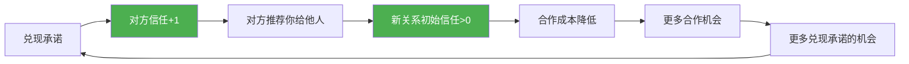
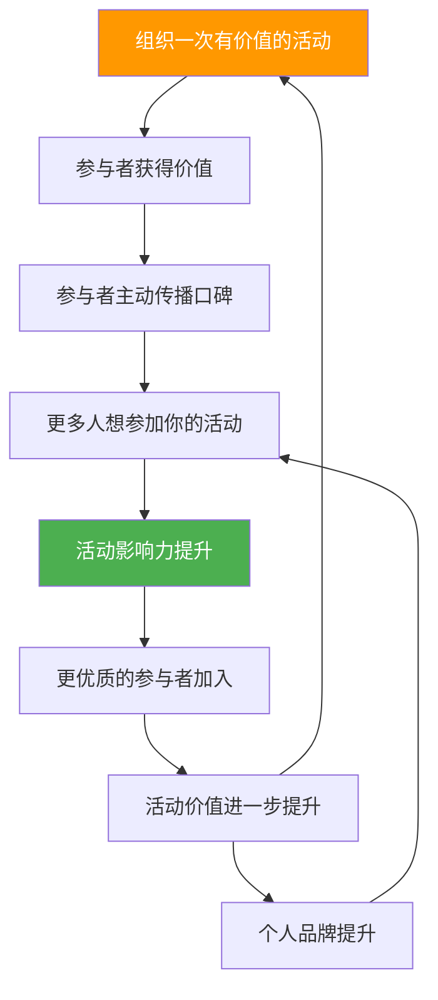

## 六、社交资本的复利增长

### 6.1 为什么社交资本遵循复利规律

#### 6.1.1 复利的本质：非线性增长

在金融领域，复利被爱因斯坦称为"世界第八大奇迹"——本金产生利息，利息再产生利息，时间越长，增长曲线越陡峭。社交资本的增长遵循完全相同的数学逻辑，只不过"本金"是你的人脉关系，"利息"是每段关系为你带来的新连接、新机会和新价值。

金融复利公式为 $A = P(1+r)^t$，其中 $P$ 是本金，$r$ 是利率，$t$ 是时间。社交资本的复利可以用类似框架理解：

- **本金（P）**：你当前拥有的有效人脉数量和质量
- **利率（r）**：每段关系产生新连接的效率（取决于关系深度、对方连接能力、你的个人吸引力）
- **时间（t）**：你持续经营社交资本的时间跨度
- **终值（A）**：你最终获得的社交资本总量

关键区别在于：金融复利的利率相对固定，而社交复利的"利率"是可以主动提升的。通过提升自身价值、优化社交策略、选择高连接能力的人脉，你可以不断提高"r"的值，从而加速整个增长过程。

#### 6.1.2 梅特卡夫定律与社交网络效应

梅特卡夫定律（Metcalfe's Law）指出，网络的价值与网络节点数的平方成正比（$V = n^2$）。这意味着你每增加一个新连接，网络价值不是线性增加，而是呈平方级增长。

具体到社交资本：

| 网络规模 | 可能的连接数 | 网络价值系数 |
|---------|------------|------------|
| 10 人 | 45 条连接 | 100 |
| 50 人 | 1,225 条连接 | 2,500 |
| 100 人 | 4,950 条连接 | 10,000 |
| 500 人 | 124,750 条连接 | 250,000 |

这就是为什么社交资本的增长在初期看起来很慢——当你只有 10 个联系人时，网络效应几乎不可见。但一旦突破临界点（通常在 150-300 个有效连接），增长会突然加速，机会开始"涌现"。

#### 6.1.3 邓巴数与有效社交半径

人类学家罗宾·邓巴（Robin Dunbar）提出，人类大脑的认知极限决定了我们能维持的稳定社交关系约为 150 人（邓巴数）。但这 150 人并非均等分布：

- **核心层（5 人）**：最亲密的关系，可以无条件信任
- **亲密层（15 人）**：经常互动，深度了解彼此
- **友好层（50 人）**：定期联系，互相帮助
- **认识层（150 人）**：知道彼此存在，偶尔互动
- **扩展层（500+ 人）**：弱连接，但可能带来新信息

社交资本的复利增长主要发生在"认识层"和"扩展层"——这些弱连接（weak ties）恰恰是信息传播和机会流通的主要通道。社会学家马克·格兰诺维特（Mark Granovetter）的"弱连接理论"证明：大多数人找到工作、获得商业机会，靠的不是亲密朋友，而是那些"认识但不太熟"的人。

### 6.2 社交复利的四大增长机制

#### 6.2.1 机制一：信任复利

信任是社交资本的"硬通货"。每一次兑现承诺、每一次可靠交付，都在为你的人脉网络积累"信任利息"。随着时间推移，这些利息会自动吸引更多的人愿意与你合作。

信任复利的运作逻辑：



关键点：信任复利有一个"破产机制"——一次严重的失信可能导致信任归零，甚至变成负数（比从未有过信任更糟糕）。这就是为什么"守信"比"承诺"重要十倍。宁可少承诺、多兑现，也不要多承诺、少兑现。

**信任复利的实操框架：**

1. **承诺管理三步法**：
   - 承诺前：评估自己能否 100% 兑现，如果不确定就承诺 80% 的部分
   - 执行中：主动同步进度，让对方知道你在推进
   - 完成后：超出预期 10%-20% 交付（比如提前一天、多给一个建议）

2. **信任账户管理**：
   - 把每段重要关系想象成一个银行账户
   - 每次帮忙、守信、主动关心 = 存款
   - 每次求助、占用时间、小失误 = 取款
   - 保持账户余额为正，关键时刻才能"大额取款"

#### 6.2.2 机制二：信息复利

当你成为某个领域的"信息枢纽"时，信息会自动向你聚集。人们知道你"消息灵通"，就会主动告诉你更多消息，因为你可能是下一个帮他们传递信息的人。

信息复利的正循环：

1. 你掌握了有价值的信息 → 分享给相关的人
2. 对方受益后 → 下次有信息会优先想到你
3. 你获得更多信息 → 能帮助更多人
4. 更多人知道你是信息枢纽 → 更多人主动给你信息

**如何成为信息枢纽：**

- **垂直领域深耕**：选择 2-3 个你真正了解的领域（比如 AI、跨境电商、投资理财），成为这些领域的"活字典"
- **主动信息分发**：每周整理 1-2 条有价值的信息，发给最需要的人（不是群发，是精准推送）
- **建立信息渠道**：订阅行业报告、加入核心社群、关注关键人物，确保你有稳定的信息来源
- **信息增值处理**：不要原封不动转发，加上你的分析、观点或应用场景，让信息更有价值

**信息复利的量化追踪：**

| 指标 | 入门级 | 进阶级 | 专家级 |
|------|--------|--------|--------|
| 每周主动分享信息 | 1-2 条 | 5-10 条 | 20+ 条 |
| 被他人主动咨询次数 | 每月 1-2 次 | 每周 2-3 次 | 每天 1+ 次 |
| 信息准确率 | 60%+ | 80%+ | 90%+ |
| 信息带来实际价值 | 偶尔 | 经常 | 常态化 |

#### 6.2.3 机制三：推荐复利

每一次成功的推荐，都会同时增强你与被推荐方和接收方的关系。被推荐方感激你创造了机会，接收方感激你提供了有价值的连接。下次他们有类似需求时，会优先想到你。

推荐复利的核心公式：**推荐成功率 × 推荐频率 = 推荐资本**

- **推荐成功率**：取决于你对双方需求的了解程度和匹配精准度
- **推荐频率**：取决于你的连接规模和信息敏感度

**高效推荐的五个原则：**

1. **双向价值匹配**：推荐前确认双方都能从中获益，不是单方面的"帮忙"
2. **提前征得同意**：推荐前先跟双方确认，避免"好心办坏事"
3. **提供背景信息**：推荐时附上双方的简介和推荐理由，降低沟通成本
4. **适时退出**：介绍完成后主动退出，不要做"第三者"
5. **跟进反馈**：推荐后 1-2 周跟进结果，了解是否成功

**推荐复利的反模式（必须避免）：**

- ❌ 随意推荐不熟悉的人（透支信任）
- ❌ 推荐时夸大双方能力（制造预期落差）
- ❌ 推荐后插手双方合作（破坏独立性）
- ❌ 只推荐对自己有利的组合（显得功利）

#### 6.2.4 机制四：声誉复利

声誉是你社交资本的"信用评级"。良好的声誉会自动为你吸引人脉和机会——人们更愿意与声誉好的人合作，即使从未见过面。

声誉复利的特点是"慢积累、快崩塌"：

- 建立良好声誉需要数年甚至数十年
- 毁掉声誉可能只需要一件事
- 但一旦建立了坚实的声誉，它会成为你最强大的"被动获客引擎"

**声誉管理框架：**

```text
声誉 = (专业能力 × 可靠性 × 人格魅力) ÷ 争议性

- 专业能力：你在核心领域的实力和成果
- 可靠性：你兑现承诺的一致性
- 人格魅力：你的沟通风格和处事态度
- 争议性：你引发负面评价的频率和程度
```

提升声誉的具体行动：

1. **公开输出**：写文章、做分享、出教程，让更多人看到你的专业能力
2. **案例积累**：把每一次成功合作变成可展示的案例（征得对方同意后）
3. **口碑管理**：定期搜索自己的名字，了解别人怎么评价你
4. **危机预案**：提前想好如果出现负面评价如何应对（承认错误 > 解释辩解）

### 6.3 加速社交复利的实操策略

#### 6.3.1 策略一：投资"高利率"人脉

不是所有社交投资的回报率都相同。有些人脉的"利率"天然更高——他们连接能力强、社交活跃度高、所处位置关键。优先投资这些人脉，你的社交复利增长会更快。

**识别"高利率"人脉的特征：**

| 特征 | 说明 | 判断方法 |
|------|------|---------|
| 行业连接者 | 认识大量行业从业者 | 看他们的朋友圈/LinkedIn连接数 |
| 信息敏感度 | 总是最早知道行业动态 | 观察他们分享信息的时效性 |
| 推荐习惯 | 经常帮别人牵线搭桥 | 听他们是否常说"我认识一个人" |
| 社交活跃度 | 经常参加活动、组织聚会 | 统计他们每月社交活动频率 |
| 跨界能力 | 能连接不同圈层的人 | 看他们的社交圈是否多元 |

**高利率人脉投资策略：**

1. **深度优先于广度**：与其认识 100 个泛泛之交，不如深度经营 10 个高利率人脉
2. **主动创造价值**：不要等对方需要帮忙，主动发现他们可能需要什么
3. **定期维护**：每 2-4 周跟高利率人脉保持一次有意义的互动（不是简单的"在吗"）
4. **成为他们的高利率人脉**：双向投资才能持久

#### 6.3.2 策略二：构建"社交飞轮"

社交飞轮是一种自我强化的社交增长模型：每一次社交活动都为下一次活动创造条件，形成正向循环。



**构建社交飞轮的步骤：**

1. **找到你的"价值锚点"**：你能为别人提供什么独特价值？（信息、资源、技能、视野）
2. **设计"最小可行活动"**：从 3-5 人的小聚餐开始，不必一上来就搞大活动
3. **创造"可分享的记忆"**：让参与者有话题可聊、有收获可分享
4. **建立"回流机制"**：活动结束时预告下一次，保持连续性
5. **逐步升级**：从小聚餐 → 主题沙龙 → 行业论坛 → 年度峰会

**社交飞轮的三个加速器：**

- **仪式感**：固定的活动时间、地点、形式，降低参与者的决策成本
- **稀缺性**：控制活动规模和参与门槛，保持"圈层感"
- **可传承性**：培养副手或合作伙伴，让飞轮不依赖你一个人

#### 6.3.3 策略三：建立"社交操作系统"

把社交当成一个系统来管理，而不是随机发生的事情。社交操作系统包括四个模块：

**模块一：人脉数据库**

建立一个结构化的人脉管理表，记录关键信息：

```text
字段设计：
- 姓名 / 联系方式
- 认识时间和场景
- 核心能力和资源
- 当前需求和痛点
- 上次互动时间和内容
- 关系温度（1-5分）
- 下次联系计划
```

推荐工具：
- 轻量级：Notion 数据库、飞书多维表格
- 专业级：CRM 系统（HubSpot 免费版、纷享销客）
- 极简版：Excel/Google Sheets + 定期回顾

**模块二：互动节奏管理**

不同关系层级需要不同的维护频率：

| 关系层级 | 维护频率 | 互动方式 | 时间投入 |
|---------|---------|---------|---------|
| 核心层（5人） | 每周 1-2 次 | 深度对话、线下见面 | 高 |
| 亲密层（15人） | 每 2 周 1 次 | 电话/视频、分享近况 | 中高 |
| 友好层（50人） | 每月 1 次 | 微信互动、信息分享 | 中 |
| 认识层（150人） | 每季度 1 次 | 点赞评论、节日问候 | 低 |

**模块三：价值创造日历**

提前规划你每月要为社交网络创造的价值：

- **第 1 周**：整理本月行业动态，分享给 5 个最相关的人
- **第 2 周**：组织一次小型聚会或线上交流
- **第 3 周**：为 2-3 对人脉做精准推荐
- **第 4 周**：回顾本月社交活动，更新人脉数据库

**模块四：复盘与优化**

每月花 30 分钟回答以下问题：

1. 本月新增了多少有效连接？质量如何？
2. 本月为别人创造了什么价值？
3. 本月从社交网络中获得了什么机会？
4. 哪些关系需要加强？哪些可以降级？
5. 下月社交重点是什么？

#### 6.3.4 策略四：利用"弱连接"的力量

格兰诺维特的弱连接理论告诉我们：最有价值的信息和机会，往往来自那些"不太熟"的人。因为强连接（亲密朋友）和你处于同一个信息圈，他们知道的你大概率也知道。而弱连接能把你带到完全不同的信息世界。

**激活弱连接的实操方法：**

1. **定期"唤醒"弱连接**：
   - 每周花 15 分钟翻看通讯录，找出 3 个月没联系的人
   - 发一条有价值的信息（不是"在吗"，而是"看到这篇文章想到你"）
   - 如果对方回应，顺势聊几句近况

2. **参加"跨界"活动**：
   - 不要只参加本行业的活动
   - 去完全不同的领域看看（技术人去艺术展，金融人去科技论坛）
   - 跨界弱连接的信息价值通常更高

3. **做"桥接者"**：
   - 主动连接两个原本不认识的圈子
   - 比如把你的技术朋友介绍给你的营销朋友
   - 桥接者在网络中的位置极其关键，价值远超普通节点

### 6.4 社交复利的常见误区

#### 6.4.1 误区一：追求"认识人多"而非"关系深"

很多人把社交资本等同于通讯录人数，拼命参加各种活动、加各种微信。但如果没有后续的深度互动，这些"连接"只是数字，不会产生复利。

**纠正方法：**

- 用"有效连接率"替代"连接总数"：有效连接 = 过去 6 个月内有实质性互动的人
- 用"关系深度分"评估每段关系：1 分=认识、2 分=聊过几次、3 分=互相帮助过、4 分=深度合作过、5 分=无条件信任
- 每月目标不是"认识多少新人"，而是"把多少 2 分关系提升到 3 分"

#### 6.4.2 误区二：只索取不付出

有些人社交目的性太强——每次联系别人都是有事相求，平时从不主动关心。这种"单向索取"模式会快速消耗社交资本，最终导致人脉断裂。

**纠正方法：**

- 遵循"3:1 法则"：每向别人求助 1 次，至少要主动帮助别人 3 次
- 建立"无目的社交"习惯：定期跟朋友聊天，不带任何功利目的
- 记住"社交账户"概念：保持每段关系的"存取比"为正

#### 6.4.3 误区三：忽视"弱连接"的维护

很多人只维护亲密关系，对"不太熟"的人不理不睬。但弱连接才是信息和机会的主要来源。忽视弱连接，等于切断了社交复利的"高速通道"。

**纠正方法：**

- 每月至少"激活" 5 个弱连接（发一条有价值的信息）
- 参加跨行业活动，主动认识不同圈层的人
- 对弱连接保持"友好但不打扰"的平衡

#### 6.4.4 误区四：期望"即时回报"

社交投资的回报周期通常较长——可能 6 个月、1 年甚至更久才会看到回报。很多人因为短期内看不到回报就放弃了，这是最大的损失。

**纠正方法：**

- 设定"社交投资期限"：至少坚持 1 年才能评估效果
- 用过程指标代替结果指标：不看"获得了多少机会"，看"帮助了多少人"
- 记住：社交复利的曲线是"前期慢、后期快"，放弃在前期是最可惜的

#### 6.4.5 误区五：忽视个人品牌建设

有些人认为"酒香不怕巷子深"，只要能力强自然有人来找。但在信息爆炸的时代，没有个人品牌等于"隐形人"——你的能力再强，别人不知道也没用。

**纠正方法：**

- 选择 1-2 个平台持续输出（公众号、知乎、小红书、LinkedIn）
- 每月至少发布 2 篇有深度的内容
- 主动参与行业讨论，建立"专业可见度"
- 不需要成为"网红"，只需要让目标人群知道你的存在

### 6.5 社交复利的阶段模型

#### 6.5.1 第一阶段：播种期（0-6 个月）

这个阶段的特点是投入多、回报少。你正在建立基础人脉网络，大多数人还在"观察"你是否值得深交。

**核心任务：**
- 建立人脉数据库，整理现有关系
- 每周认识 1-2 个新朋友，每月深度交流 3-5 人
- 开始为别人创造价值（分享信息、帮忙牵线）
- 建立个人品牌的基础（至少在一个平台活跃）

**预期回报：** 几乎为零。这个阶段的回报是"关系基础"，不是实际机会。

**关键心态：** 耐心。不要因为看不到回报就放弃。

#### 6.5.2 第二阶段：生长期（6-18 个月）

你的社交网络开始产生初步效果。有些人脉开始为你介绍机会，你的个人品牌开始有了一定知名度。

**核心任务：**
- 从"广撒网"转向"精准投资"，重点经营高利率人脉
- 开始组织小型活动（聚餐、沙龙），建立社交飞轮
- 每月至少做 2 次有价值的推荐
- 持续输出内容，扩大个人品牌影响力

**预期回报：** 开始有零星的机会出现（被推荐、被咨询、被邀请）。但还不稳定。

**关键心态：** 专注。不要分散精力到太多方向。

#### 6.5.3 第三阶段：收获期（18-36 个月）

社交复利开始显现。你的社交网络成为"机会发生器"——不需要你主动找机会，机会会主动来找你。

**核心任务：**
- 优化社交系统，提高效率（自动化维护、标准化流程）
- 开始"选择性社交"——拒绝低价值的社交活动
- 扩大社交飞轮的规模和影响力
- 开始培养"社交副手"，让社交系统不依赖你一个人

**预期回报：** 稳定的机会流入、明确的信息优势、可衡量的商业价值。

**关键心态：** 精准。不是所有机会都要接，选择最匹配的。

#### 6.5.4 第四阶段：复利期（36 个月以上）

你的社交资本进入"自动增长"模式。你的名字成为一个"品牌"，你的社交网络成为你的核心竞争力之一。

**核心任务：**
- 维护核心关系，保持信任资本
- 扩大影响力范围（从个人到组织、从行业到跨行业）
- 开始"社交套利"——利用信息差和连接优势创造超额回报
- 回馈社交网络，成为年轻社交者的导师

**预期回报：** 社交资本成为稳定的"被动收入"来源——机会、信息、资源自动流向你。

### 6.6 社交资本转化：从关系到价值

#### 6.6.1 三种转化路径

社交资本最终需要转化为实际价值，否则就是"无效社交"。转化路径有三种：

**路径一：直接转化（关系 → 机会）**

人脉直接为你带来客户、项目、工作机会、合作伙伴。这是最直接的转化方式。

转化效率取决于：
- 关系深度（深度关系的推荐转化率是浅层关系的 5-10 倍）
- 需求匹配度（你的能力是否正好是对方需要的）
- 时机（对方是否正好在寻找解决方案）

**路径二：间接转化（关系 → 信息 → 决策优势）**

通过社交网络获取关键信息，用于商业决策、投资判断、职业选择。这种转化不那么直接，但价值往往更大。

示例：
- 通过行业朋友提前知道某公司要裁员，及时调整职业规划
- 通过投资圈朋友了解到某个新兴赛道，提前布局
- 通过技术圈朋友知道某个工具要涨价，提前囤积资源

**路径三：长期转化（关系 → 地位 → 交易成本降低）**

当你在社交网络中建立了足够高的地位，你的"信用成本"会大幅降低。别人更愿意跟你合作、给你优惠、向你让利，因为跟你合作的"确定性"更高。

具体表现：
- 谈判时对方更信任你的承诺，降低保证金要求
- 合作时对方更愿意接受你的方案，减少扯皮时间
- 融资时投资人更看重你的背书，降低尽调难度

#### 6.6.2 转化的时机判断

不是所有时候都适合转化社交资本。过早转化会显得功利，过晚会错过最佳时机。

**适合转化的信号：**
- 对方主动提到有相关需求
- 你有明确的、对方需要的价值可以提供
- 双方已经建立了足够的信任基础
- 转化对双方都有明确价值

**不适合转化的信号：**
- 关系还处于"初步了解"阶段
- 对方当前没有相关需求
- 转化只对你有利，对对方价值不明确
- 你最近已经多次向对方求助

**转化的"黄金公式"：**

```text
转化成功率 = 信任度 × 匹配度 × 时机系数

- 信任度：0-1，基于过往互动积累的信任
- 匹配度：0-1，你的供给与对方需求的匹配程度
- 时机系数：0-2，对方当前是否有迫切需求
```

### 6.7 数字时代的社交复利

#### 6.7.1 线上社交的复利特点

数字时代改变了社交复利的运作方式：

- **规模放大**：线上可以同时维护更多弱连接（微信 5000 人上限 vs 线下 150 人邓巴数）
- **速度加快**：信息传播速度从天级缩短到分钟级
- **门槛降低**：不需要面对面就能建立和维护关系
- **但也更脆弱**：线上关系的"断连成本"极低，一条不恰当的消息可能就断了

**线上社交复利的优化策略：**

1. **内容即社交**：通过持续输出优质内容，被动吸引人脉（比主动加人效率高 10 倍）
2. **社群运营**：建立或加入高质量社群，批量维护弱连接
3. **私域沉淀**：把有价值的线上关系引导到私域（微信、邮件列表），降低平台风险
4. **线上线下结合**：线上认识、线下深化，是最高效的社交模式

#### 6.7.2 AI 时代的社交复利新趋势

AI 工具正在改变社交复利的游戏规则：

- **信息获取民主化**：AI 让每个人都能快速获取信息，信息枢纽的价值可能下降
- **关系的"人味"更稀缺**：在 AI 泛滥的时代，真诚的人际连接反而更有价值
- **社交效率工具**：AI 可以帮你分析人脉网络、提醒维护时机、辅助内容创作
- **但 AI 不能替代信任**：信任仍然需要人类的互动来建立和维护

**在 AI 时代保持社交竞争力的关键：**

1. **做 AI 做不到的事**：深度信任、情感连接、创造性合作
2. **善用 AI 提效**：用 AI 工具管理人脉、分析社交数据、辅助内容创作
3. **保持"人味"**：在 AI 内容泛滥的时代，真诚的个人表达反而更有吸引力

### 6.8 复利增长的实操清单

#### 6.8.1 每日习惯（10-15 分钟）

- [ ] 回复重要人脉的消息，保持互动温度
- [ ] 在至少 1 个社交平台发布有价值的内容或评论
- [ ] 记录今天遇到的有价值的信息，思考可以分享给谁

#### 6.8.2 每周习惯（1-2 小时）

- [ ] 深度交流 1-2 位重要人脉（电话/见面/长消息）
- [ ] 整理本周获得的信息，筛选有价值的分享给 3-5 人
- [ ] 更新人脉数据库（新增联系人、更新关系状态）
- [ ] 激活 1-2 个"沉睡"的弱连接

#### 6.8.3 每月习惯（半天）

- [ ] 组织或参加 1 次社交活动
- [ ] 做 2-3 次有价值的人脉推荐
- [ ] 回顾本月社交活动，更新人脉数据库
- [ ] 规划下月社交重点和目标

#### 6.8.4 每季度习惯（1 天）

- [ ] 全面审视社交网络结构，识别关键节点和薄弱环节
- [ ] 评估社交资本的转化效果（带来了多少机会、信息、资源）
- [ ] 调整社交策略（增加/减少投入、转换方向）
- [ ] 更新个人品牌内容（简介、作品集、案例库）

### 6.9 本章小结

社交资本的复利增长不是玄学，而是一个可以理解、可以规划、可以执行的系统工程。核心要点：

1. **理解机制**：信任复利、信息复利、推荐复利、声誉复利，四大机制协同运作
2. **投资策略**：优先投资高利率人脉，构建社交飞轮，建立社交操作系统
3. **避开误区**：不追求"认识人多"、不只索取不付出、不忽视弱连接、不期望即时回报
4. **耐心坚持**：社交复利的曲线是"前期慢、后期快"，至少坚持 18 个月才能看到显著效果
5. **持续转化**：社交资本最终要转化为实际价值，掌握转化的时机和方法

记住：社交资本是你唯一越用越多的资本。每一次真诚的帮助、每一次有价值的信息分享、每一次精准的推荐，都在为你的社交账户"存入利息"。这些利息会自动产生利息，最终形成你最强大的个人竞争力。
