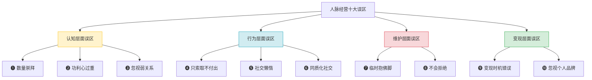
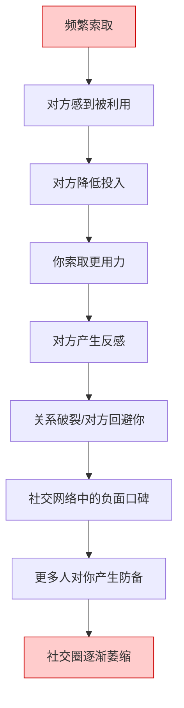
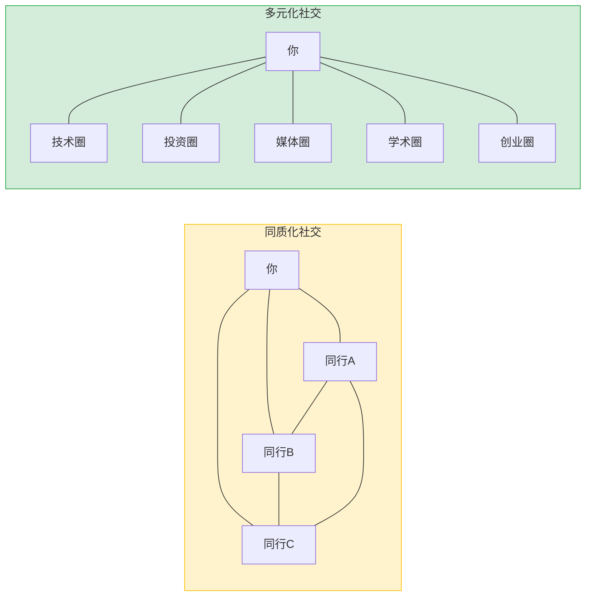
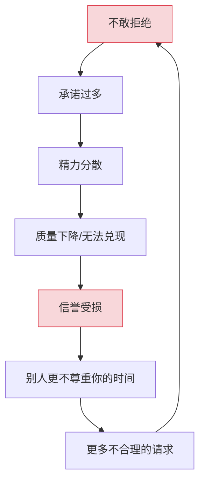
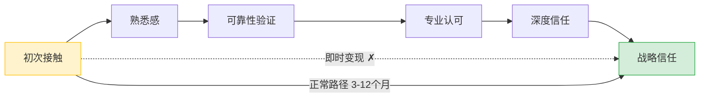
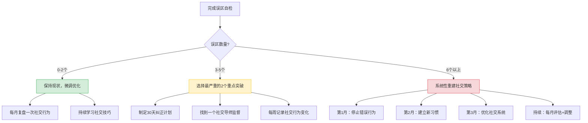

## 七、人脉经营的常见误区

人脉经营是一门需要长期修炼的技艺。很多人在社交投入上花费了大量时间和精力，却始终无法将人脉转化为实际价值，甚至陷入"越社交越疲惫"的恶性循环。问题往往不在于努力不够，而在于方向错误——从一开始就踩进了认知陷阱。

本节系统梳理人脉经营中最常见的十大误区，帮助你识别并纠正那些看似合理、实则低效甚至有害的社交行为。

### 7.1 误区全景图

### 7.2 认知层面误区

#### 7.2.1 误区一：数量崇拜——"认识的人越多越好"

**典型症状**：
- 微信好友超过 3000 人，但真正能说上话的不到 50 人
- 热衷于参加各种社交活动，每次活动加几十个微信
- 以"我认识某某某"为荣，但对方可能根本不记得你
- 手机里存了上百个名片，从未进行过任何分类管理

**为什么会陷入这个误区**：

这源于一个根深蒂固的认知偏差——将人脉的广度等同于人脉的价值。社交媒体的兴起加剧了这种错觉：微信好友数量、LinkedIn 连接数成为一种可量化的"社交资本"指标，人们不自觉地将其视为社交能力的证明。

邓巴数（Dunbar's Number）告诉我们，人类大脑能维持的稳定社交关系上限约为 150 人。其中：
- **核心圈层**（5 人）：亲密家人和挚友，每周至少联系一次
- **共情圈层**（15 人）：好朋友，每月至少联系一次
- **友谊圈层**（50 人）：较好的朋友，每季度联系一次
- **熟人圈层**（150 人）：认识且能叫出名字的人

超过 150 人的社交关系，大脑根本无法有效维护。你加了 3000 个微信好友，其中 2850 人本质上是"僵尸关系"——既不提供信息价值，也不提供情感价值。

**正确的做法**：

| 错误做法 | 正确做法 |
|----------|----------|
| 疯狂加人，追求数量 | 精准连接，追求质量 |
| 不筛选地参加所有活动 | 选择与自身目标匹配的高质量活动 |
| 加完好友就束之高阁 | 加完后 48 小时内进行首次深度交流 |
| 只看对方"有没有用" | 评估双方是否能产生价值互换 |
| 一次性社交 | 建立长期关系维护机制 |

**实操建议——人脉精简四步法**：

1. **盘点**：导出微信好友列表，逐一标注与每个人的关系状态（活跃/半活跃/沉默/僵尸）
2. **分类**：按照邓巴的四层模型，将活跃关系放入对应圈层
3. **清理**：对于超过 12 个月无任何互动的"僵尸关系"，不必删除但停止主动维护
4. **聚焦**：将 80% 的社交精力投入到核心圈层和共情圈层（20 人），20% 的精力用于扩展友谊圈层

> **关键洞察**：真正有价值的人脉不在于你认识多少人，而在于有多少人在关键时刻愿意为你站出来。一个在你创业时愿意借你 50 万的朋友，价值远超 5000 个点赞之交。

---

#### 7.2.2 误区二：功利心过重——"有用的人才值得交往"

**典型症状**：
- 与人交往前先评估"这个人对我有什么用"
- 对"没用"的人态度冷淡，对"有用"的人热情过度
- 社交目的性极强，三句话不离业务
- 别人帮了你忙，你觉得理所当然；你帮了别人，立刻期待回报
- 在社交场合只跟"大人物"打招呼，忽视普通人

**为什么会陷入这个误区**：

功利社交的本质是将人际关系简化为交易关系。这种思维模式在短期内看似高效——省去了"无用"社交的时间成本——但长期来看，它会严重损害你的社交声誉。

社会学中的"信号理论"（Signaling Theory）指出：你在社交中的每一个行为都在向周围的人发送信号。当你表现出明显的功利心时，你发送的信号是"我只在乎你能给我带来什么"。这个信号一旦被接收到，会产生两个后果：第一，对方会降低对你的信任度；第二，这个信号会通过社交网络传播，让更多人对你产生防备。

**功利社交的隐性成本**：

| 表面收益 | 隐性成本 |
|----------|----------|
| 省去了"无用"社交的时间 | 失去了弱关系带来的信息优势 |
| 短期内获得了资源对接 | 长期被贴上"势利"标签，高端人脉回避你 |
| 看似高效的人脉利用 | 缺乏信任基础，关键时刻无人帮你 |
| 集中精力在"重要"人脉上 | 错过普通人中潜在的"黑马" |

**真实案例**：

某互联网公司销售总监，社交能力极强，但功利心极重。他在行业聚会上只跟 VP 级别以上的人交流，对普通从业者不屑一顾。三年后，他跳槽创业，发现昔日的"高端人脉"无人愿意投资或推荐客户——因为大家都知道他是一个"用完即弃"的人。反而是他曾经忽视的一位普通产品经理，创业成功后成为行业新贵，但他已经没有机会重建这段关系了。

**正确的做法**：

1. **践行"利他优先"原则**：与人交往时，先想"我能为对方提供什么"，而不是"对方能给我什么"
2. **维护"无用"关系**：定期与那些"暂时看不出价值"的人保持联系，因为人的价值是动态变化的
3. **真诚对待每一个人**：今天的实习生可能是明天的 CEO，今天的快递员可能掌握你急需的本地信息
4. **建立"社交信誉"账户**：每次帮助别人都是在存入"信誉资本"，这个账户的利息是长期而丰厚的

> **核心法则**：人脉的本质是信任网络，不是交易市场。信任的建立需要时间、真诚和持续的价值输出，任何试图走捷径的行为都会付出代价。

---

#### 7.2.3 误区三：忽视弱关系——"只跟熟人来往就行"

**典型症状**：
- 社交圈高度封闭，来来回回就是那几个人
- 对"点头之交"不屑一顾，觉得没有深度的关系没有价值
- 不愿意参加陌生人社交活动，觉得"尴尬"
- 只在自己的行业/领域内社交，从不跨界

**为什么会陷入这个误区**：

1973 年，社会学家马克·格兰诺维特（Mark Granovetter）发表了经典论文《弱关系的力量》（The Strength of Weak Ties），揭示了一个反直觉的发现：在求职、获取新信息、发现商业机会等方面，弱关系（点头之交）的价值往往超过强关系（亲密朋友）。

原因在于"信息冗余"：你的亲密朋友和你处于同一个社交圈，他们知道的信息你大概率也知道。而弱关系连接的是不同的社交圈，他们掌握着你接触不到的信息和资源。

**强关系 vs 弱关系的价值对比**：

| 维度 | 强关系（亲密朋友） | 弱关系（点头之交） |
|------|-------------------|-------------------|
| 信息多样性 | 低（信息高度重叠） | 高（跨圈层信息） |
| 情感支持 | 高 | 低 |
| 新机会发现 | 低 | 高 |
| 信任成本 | 低（已有信任基础） | 中（需要建立信任） |
| 维护成本 | 高（需要投入大量时间） | 低（偶尔互动即可） |
| 商业合作 | 容易产生利益冲突 | 合作空间更大 |

**正确的做法**：

1. **主动扩展弱关系网络**：每周至少认识 1-2 个新朋友，保持社交圈的"新陈代谢"
2. **跨界社交**：有意识地参加不同行业、不同领域的活动，获取跨圈层信息
3. **善用弱关系的信息桥梁作用**：当你需要某个领域的信息或资源时，先想想有没有认识这个领域的"点头之交"
4. **降低弱关系的维护成本**：通过朋友圈点赞、节日问候、分享有价值的文章等方式，用极低的成本维持弱关系的"活性"

> **格兰诺维特的忠告**："你最可能获得的新工作、新机会、新信息，不是来自你的密友，而是来自你偶尔联系的熟人。因为他们连接着你从未触及的社交网络。"

---

### 7.3 行为层面误区

#### 7.3.1 误区四：只索取不付出——"人脉就是用来用的"

**典型症状**：
- 频繁请求别人帮忙，但从不主动提供帮助
- 加入社群只潜水，从不分享有价值的内容
- 找人办事时热情洋溢，事成之后杳无音信
- 把别人的帮助视为理所当然，缺乏感恩表达
- 总是第一个开口提需求，最后一个开口提供帮助

**为什么会陷入这个误区**：

这种行为模式源于对"社会资本"的单向理解——只看到社会资本的"提取"功能，忽视了"存储"功能。社会资本就像银行账户：如果你只取不存，账户终将透支。而透支的后果不仅是失去某一个人的帮助，更是在整个社交网络中留下"不可靠"的标签。

社会交换理论（Social Exchange Theory）指出，人际关系的维持依赖于"成本-收益"的动态平衡。当一方持续处于"净索取"状态时，另一方会逐渐降低投入，最终导致关系破裂。

**单向索取的社交死亡螺旋**：

**正确的做法——建立"社交储蓄"习惯**：

1. **5:1 法则**：每请求别人帮一次忙之前，先主动帮别人五次忙
2. **"预存款"策略**：在需要帮助之前，就持续为社交网络"存款"——分享信息、介绍资源、提供专业建议
3. **即时回报**：别人帮了你，24 小时内表达感谢，并在 30 天内寻找机会回报
4. **超额回报**：别人给你 1 分帮助，你回报 1.5 分。长期下来，你会成为所有人都愿意帮助的人
5. **公开感谢**：在社交场合公开感谢帮助过你的人，这既是对对方的尊重，也是在为自己的"社交信誉"加分

**感恩表达的四个层次**：

| 层次 | 做法 | 效果 |
|------|------|------|
| 基础层 | 说"谢谢" | 及格，但不突出 |
| 进阶层 | 发一条走心的感谢消息，说明具体帮助了你什么 | 让对方感到被重视 |
| 高级层 | 在对方需要时主动提供帮助，用行动回报 | 建立深度信任 |
| 顶级层 | 在公开场合提及对方的帮助，为对方背书 | 将关系升级为战略同盟 |

---

#### 7.3.2 误区五：社交懒惰——"关系好了就不用维护了"

**典型症状**：
- 觉得"真朋友不需要经常联系"
- 从不主动发起社交，总是等别人来找你
- 重要节日、生日没有任何表示
- 好几年不联系，突然找人帮忙，觉得"关系还在"
- 手机里有几百个"老朋友"，但最近一次联系都是两三年前

**为什么会陷入这个误区**：

"社交懒惰"往往披着"君子之交淡如水"的外衣，让人误以为这是一种高级的社交境界。但真相是：关系的本质是连接，连接需要维护。长期不维护的关系，就像长期不浇水的植物——表面看起来还在，根系早已枯死。

心理学中的"曝光效应"（Mere Exposure Effect）表明，人们对频繁出现在自己视野中的人会产生更强的好感和信任。反过来说，长期不出现的人会逐渐从对方的"心理雷达"上消失。

**关系衰退的时间线**：

| 不联系时长 | 关系状态 | 恢复难度 |
|-----------|----------|----------|
| 1-3 个月 | 关系活跃，随时可联系 | 零成本 |
| 3-6 个月 | 关系开始淡化，但可快速恢复 | 低成本 |
| 6-12 个月 | 关系明显淡化，需要"破冰" | 中等成本 |
| 1-3 年 | 关系基本断裂，需要重新建立 | 高成本 |
| 3 年以上 | 关系名存实亡，对方可能已不记得你 | 极高成本/不可恢复 |

**正确的做法——低成本关系维护系统**：

1. **建立联系人日历**：将重要联系人的生日、纪念日、职业里程碑录入日历，设置自动提醒
2. **"三分钟维护法"**：每天花 3 分钟，给 1-2 个老朋友发条消息——可以是分享一篇文章、评论对方的朋友圈、或者简单问候
3. **"季节性触达"**：每个季度至少与核心圈层（15 人）中的每个人联系一次，方式不限——电话、微信、线下见面均可
4. **"价值推送"**：当你看到与某个朋友相关的信息（行业动态、工作机会、生活建议），主动分享给他。这比"最近怎么样"的寒暄更有价值
5. **"事件驱动"联系**：利用对方的职业变动、公司融资、产品上线、家庭喜事等事件作为联系的契机

**社交维护的 ROI 对比**：

| 维护方式 | 时间成本 | 效果 | 适合场景 |
|----------|----------|------|----------|
| 朋友圈点赞/评论 | 10 秒 | 低，但保持"存在感" | 弱关系维护 |
| 分享文章/信息 | 1 分钟 | 中，展示你关注对方的领域 | 中等关系维护 |
| 节日问候（个性化） | 3 分钟 | 中高，表达重视 | 所有关系 |
| 电话/语音聊天 | 15-30 分钟 | 高，传递情感温度 | 核心关系 |
| 线下见面 | 2-3 小时 | 极高，深度连接 | 关键关系 |

---

#### 7.3.3 误区六：同质化社交——"只跟同类人来往"

**典型症状**：
- 社交圈里全是同行业、同背景、同观点的人
- 对"不同世界"的人缺乏兴趣，甚至排斥
- 在社交场合总能找到"安全"的人聊天，回避"不舒服"的交流
- 所有社交话题都围绕同一个领域，缺乏跨界视野

**为什么会陷入这个误区**：

人类天然倾向于与相似的人建立连接，这在心理学中被称为"相似性吸引"（Similarity-Attract）效应。与相似的人交往确实更舒适、更轻松，但这也意味着你获取的信息高度同质化，视野被局限在"回音室"中。

社会学家罗纳德·伯特（Ronald Burt）的"结构洞理论"（Structural Holes Theory）指出：最大的社交价值不在于你和谁连接，而在于你连接了哪些"本不相连"的群体。能够跨越不同社交圈的人，拥有信息优势和控制优势，他们能发现别人看不到的机会。

**同质化社交 vs 多元化社交**：

同质化社交的网络中，所有节点都相互连接，信息高度冗余。你听到的消息，你的朋友们也都知道。而多元化社交的网络中，你连接着不同的群体，成为信息的"枢纽"——这是真正的社交资本优势。

**正确的做法**：

1. **"20% 跨界法则"**：将 20% 的社交时间投入到与你当前领域无关的圈子中
2. **主动寻找"桥梁人物"**：那些同时活跃在多个圈子中的人，是进入新领域的最佳引路人
3. **培养跨界兴趣**：学习一个与主业无关的技能或爱好（摄影、攀岩、品酒、书法），通过兴趣圈子认识不同背景的人
4. **参加跨行业活动**：不要只参加本行业的会议，创业大赛、投资路演、公益项目、文化交流活动都是结识多元人脉的好机会
5. **练习"好奇心社交"**：与不同背景的人交流时，放下"功利"心态，纯粹出于好奇心去了解对方的世界

---

### 7.4 维护层面误区

#### 7.4.1 误区七：临时抱佛脚——"需要帮忙时才联系"

**典型症状**：
- 平时不联系，一联系就是求帮忙
- 开口就是"在吗？有个事想请你帮个忙"
- 上次联系是一年前，这次联系是借钱/求介绍/要资源
- 逢年过节从不问候，项目需要资源时突然热情
- 加入一个社群后长期潜水，需要推广时才在群里发广告

**为什么会陷入这个误区**：

"临时抱佛脚"的本质是将人脉关系视为"工具箱"——需要时打开，不需要时关闭。这种工具化思维忽视了一个关键事实：人脉关系是有"温度"的，温度需要持续加热才能维持。当你半年不联系突然找人帮忙时，对方的心理反应不是"老朋友来找我了"，而是"这个人突然找我，肯定没什么好事"。

心理学中的"归因理论"可以解释这种反应：当你突然联系一个久未联络的人时，对方会自动归因——"他为什么突然联系我？一定是因为他需要我帮忙。"这种归因会让你的请求显得更加功利，即使你的本意并非如此。

**"冷启动"社交的代价**：

| 场景 | 长期维护的请求 | 临时抱佛脚的请求 |
|------|--------------|-----------------|
| 对方第一反应 | "老朋友找我，挺开心" | "他突然找我，肯定有事" |
| 对方帮忙意愿 | 高（基于长期信任） | 低（缺乏信任基础） |
| 对方帮忙质量 | 尽心尽力，可能超预期 | 敷衍了事，能推就推 |
| 对关系的影响 | 进一步加深 | 可能产生反感 |
| 后续关系走向 | 更加紧密 | 对方可能主动回避 |

**正确的做法**：

1. **建立"无目的社交"习惯**：定期与朋友联系，纯粹是问候和分享，不带任何目的
2. **"预热"策略**：如果你知道未来可能需要某个人的帮助，提前 3-6 个月开始"预热"——增加联系频率，分享有价值的信息，逐步恢复关系温度
3. **"价值先行"原则**：在请求帮助之前，先为对方提供价值。比如："我最近看到一个机会可能适合你，想跟你分享一下。顺便也有个事想请教……"
4. **坦诚面对"久未联系"**：如果确实很久没联系了，直接承认："好久没联系了，先跟你道个歉。最近一直想约你出来聊聊……"比假装什么都没发生更真诚
5. **维护社交日历**：将重要联系人按照维护频率分组，确保没有人超过 3 个月没有任何互动

---

#### 7.4.2 误区八：不会拒绝——"答应所有人的所有请求"

**典型症状**：
- 别人一开口就答应，即使自己很忙或很为难
- 害怕拒绝会破坏关系，所以宁可委屈自己
- 答应了做不到，导致失信于人
- 承担了太多不属于自己的责任，身心俱疲
- 成为朋友圈里的"老好人"，但内心充满怨气

**为什么会陷入这个误区**：

"不会拒绝"表面上看起来是一种美德——乐于助人、有求必应。但从社交策略的角度来看，这是一种严重的资源错配。你的时间、精力、社交资本都是有限的，如果你对所有请求都说"是"，就意味着你无法将资源集中在最重要的事情上。

更深层的问题是：当一个人对所有人都说"是"时，他说的每一个"是"的价值都在贬值。别人不会因为你的"有求必应"而更尊重你，反而会觉得你的时间不值钱、你的好意廉价。

**"老好人"困境的恶性循环**：

**正确的做法——学会"策略性拒绝"**：

1. **"24 小时缓冲"法则**：收到请求后不立即回复，说"我看看日程，明天给你答复"。这给了你评估的时间，也避免了冲动答应
2. **"条件式答应"**：不是直接答应或拒绝，而是提出条件。"我可以帮你，但最快也要下周三才能开始"——让对方自行决定是否接受
3. **"推荐替代方案"**：如果自己无法帮忙，推荐更合适的人选。"这个事我不太擅长，但我的朋友小王是这方面的专家，我可以帮你引荐"
4. **"优先级框架"**：将请求按照"紧急/重要"四象限分类，只答应真正重要的事情，其他的一律婉拒
5. **建立"个人边界"清单**：明确列出哪些事情你绝对不做、哪些事情有条件地做、哪些事情主动做。有了清单，拒绝时就有依据

**拒绝话术模板**：

| 场景 | 话术模板 |
|------|----------|
| 时间冲突 | "非常感谢你的信任，但最近我的日程已经排满了，怕答应了反而耽误你的事" |
| 能力不足 | "这个领域我不太专业，怕帮倒忙。我推荐你找 XXX，他是这方面的专家" |
| 不合理请求 | "理解你的需求，但这个超出了我目前的能力范围，希望你能理解" |
| 频繁索取 | "我很愿意帮忙，但最近精力有限，可能需要你先找其他人看看" |
| 涉及底线 | "这个事情涉及到 XXX（原则/法律/利益冲突），我没办法参与，抱歉" |

---

### 7.5 变现层面误区

#### 7.5.1 误区九：变现时机错误——"关系还没到位就想用"

**典型症状**：
- 刚认识就推销产品或服务
- 加入社群第一件事就是发广告
- 跟大佬吃了一顿饭就开口要投资
- 刚帮了别人一个小忙就期待对方投桃报李
- 把"认识"等同于"关系到位"

**为什么会陷入这个误区**：

人脉变现的前提是信任，而信任的建立需要时间和事件的积累。根据信任建立的心理学研究，信任的形成遵循以下路径：

试图跳过中间环节直接变现，就像在土壤还没松好时就播种——不仅不会发芽，还会浪费种子。

**信任层级与可变现方式对照表**：

| 信任层级 | 建立时间 | 特征 | 可变现方式 | 不可变现方式 |
|----------|----------|------|----------|-------------|
| 初次接触 | 即时 | 互相知道名字 | 无 | 任何请求 |
| 熟悉感 | 1-4 周 | 偶尔互动，面熟 | 轻量级资源分享 | 重大请求 |
| 可靠性验证 | 1-3 个月 | 多次互动，守时守信 | 信息交换、小忙 | 资金、核心资源 |
| 专业认可 | 3-6 个月 | 认可对方的能力 | 项目合作、互相推荐 | 大额合作 |
| 深度信任 | 6-12 个月 | 经历过考验 | 战略合作、资源整合 | — |
| 战略信任 | 1 年以上 | 背靠背的信任 | 任何合作 | — |

**正确的做法**：

1. **先建立信任，再谈变现**：与新认识的人交往时，前 3 次互动只做"价值输出"，不提任何需求
2. **从小合作开始**：不要第一次合作就谈大项目，先通过小合作建立默契和信任
3. **"试水温"策略**：在正式提出请求之前，先试探性地聊一聊相关话题，观察对方的态度和反应
4. **提供"先例"**：在请求帮助之前，先展示你帮助过类似的人或做过类似的事，降低对方的风险感知
5. **尊重对方的节奏**：如果对方表现出犹豫或不适，立即后退，不要施压

---

#### 7.5.2 误区十：忽视个人品牌——"酒香不怕巷子深"

**典型症状**：
- 只知道埋头做事，从不展示自己的能力和成果
- 在社交场合中"存在感"极低，别人对你没有印象
- 不经营社交媒体，朋友圈要么空空如也，要么全是转发
- 觉得"只要能力强，自然会有人来找我"
- 不会讲述自己的故事，无法在短时间内让别人记住你

**为什么会陷入这个误区**：

"酒香不怕巷子深"这句话在信息爆炸的时代已经过时了。根据注意力经济学的研究，现代人每天接触的信息量超过 34GB，大脑会自动过滤掉 99% 以上的内容。如果你不主动建立和传播个人品牌，即使你再有能力，也会被淹没在信息洪流中。

个人品牌在人脉经营中的作用是"社交加速器"：当你有了清晰的个人品牌，别人在提到某个领域时会自然想到你，这大大降低了社交成本，提高了人脉匹配效率。

**有品牌 vs 无品牌的人脉经营效率对比**：

| 维度 | 有个人品牌 | 无个人品牌 |
|------|----------|----------|
| 被动获客 | 高（别人主动找你） | 低（需要主动出击） |
| 信任建立速度 | 快（品牌即背书） | 慢（需要从零开始） |
| 社交筛选效率 | 高（吸引对的人） | 低（鱼龙混杂） |
| 人脉变现能力 | 强（品牌溢价） | 弱（只能靠低价竞争） |
| 抗风险能力 | 强（品牌资产可迁移） | 弱（依赖单一关系） |

**正确的做法**：

1. **明确你的"社交标签"**：用一句话概括你是谁、你能提供什么价值。例如："我是做 XXX 的，擅长帮人解决 XXX 问题"
2. **持续输出内容**：在朋友圈、公众号、知乎、行业社群中持续分享专业见解，建立"专家"形象
3. **打造"社交名片"**：整理一个 30 秒的自我介绍（电梯演讲），包含你的身份、专长、成功案例
4. **经营"口碑传播"**：帮助别人解决问题后，请求对方为你"背书"——推荐给其他有需要的人
5. **参加"高曝光"活动**：行业峰会演讲、专业论坛分享、社群答疑等活动能快速建立个人品牌

**个人品牌建设的三个阶段**：

1. **定位期**（1-2 个月）：明确你的核心价值主张和目标受众，确定"社交标签"
2. **内容期**（3-6 个月）：持续输出高质量内容，在 1-2 个平台上建立存在感
3. **传播期**（6-12 个月）：通过口碑传播和社交网络效应，让品牌自动扩散

---

### 7.6 误区自检清单

以下是人脉经营常见误区的自检清单。诚实地评估自己，标记你当前存在的问题：

| 序号 | 误区 | 自检问题 | 你是否中招？ |
|------|------|----------|-------------|
| 1 | 数量崇拜 | 你的微信好友中，能叫出名字且知道对方职业的有多少？ | □ 是 □ 否 |
| 2 | 功利心过重 | 你是否在交往前会先评估"这个人对我有什么用"？ | □ 是 □ 否 |
| 3 | 忽视弱关系 | 你最近一个月是否主动认识了新朋友？ | □ 是 □ 否 |
| 4 | 只索取不付出 | 过去一个月，你主动帮助别人的次数是否多于请求帮助的次数？ | □ 是 □ 否 |
| 5 | 社交懒惰 | 你是否有超过 3 个月没联系的"好朋友"？ | □ 是 □ 否 |
| 6 | 同质化社交 | 你的社交圈中，不同行业/背景的人占比是否超过 30%？ | □ 是 □ 否 |
| 7 | 临时抱佛脚 | 你最近一次联系老朋友，是纯粹问候还是有事相求？ | □ 是 □ 否 |
| 8 | 不会拒绝 | 过去一个月，你是否因为不好意思拒绝而答应了不想做的事？ | □ 是 □ 否 |
| 9 | 变现时机错误 | 你是否在关系还没到位时就提过需求？ | □ 是 □ 否 |
| 10 | 忽视个人品牌 | 别人提到你的名字时，能否立刻说出你是做什么的？ | □ 是 □ 否 |

**评分标准**：
- **0-2 个"是"**：社交认知健康，继续保持
- **3-5 个"是"**：存在一些误区，需要有意识地调整
- **6-8 个"是"**：社交策略需要重大调整，建议系统性地纠正
- **9-10 个"是"**：社交系统需要重建，建议从最严重的误区开始逐一突破

---

### 7.7 从误区到正途：纠偏路线图

识别误区只是第一步，关键在于系统性地纠偏。以下是针对不同误区严重程度的纠偏路线图：

**30 天纠偏行动方案**：

| 周次 | 行动重点 | 具体任务 |
|------|----------|----------|
| 第 1 周 | 认知重建 | 完成误区自检、阅读本节内容、写下你最大的 3 个社交误区 |
| 第 2 周 | 行为纠正 | 针对最大的误区，每天记录自己的社交行为，标记哪些属于误区行为 |
| 第 3 周 | 习惯建立 | 开始执行新的社交习惯（如每天 3 分钟维护、每周认识 1 个新朋友） |
| 第 4 周 | 复盘优化 | 回顾本月的社交行为变化，评估效果，制定下月计划 |

---

### 7.8 本节核心要点

1. **人脉质量远比数量重要**：150 人的邓巴数限制意味着你不可能维护无限的关系，聚焦核心圈层才是正道
2. **功利心是社交的毒药**：真诚利他才是建立长期信任的唯一路径
3. **弱关系是被低估的宝藏**：跨圈层的点头之交往往能带来意想不到的机会
4. **社交需要持续投入**：关系不维护就会衰退，建立低成本的维护系统是关键
5. **个人品牌是社交的加速器**：在信息爆炸时代，不主动建立品牌就会被淹没
6. **学会拒绝是一种能力**：策略性拒绝不是冷漠，而是对有限资源的最优配置
7. **变现需要等待时机**：信任建立需要时间和事件，跳过过程直接变现只会破坏关系
