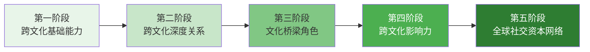

## 八、跨文化社交技巧

在全球化深度推进的今天，跨文化社交能力已不再是外交官和跨国企业高管的专属技能。无论是与海外客户谈判、在国际会议上建立人脉、运营跨境电商品牌，还是在多元文化团队中协作，跨文化社交技巧都直接决定了你能触达的人脉半径和商业机会的天花板。

一项来自哈佛商学院的研究表明，具备高水平跨文化沟通能力的管理者，其团队绩效比平均水平高出 30%，而跨文化社交失误导致的商业损失每年高达数十亿美元——一个不恰当的手势、一次误解的沉默、一封措辞失当的邮件，都可能让一笔价值百万的合作化为泡影。

### 1. 跨文化社交的理论基础

#### 1.1 霍夫斯泰德文化维度理论

荷兰社会心理学家吉尔特·霍夫斯泰德（Geert Hofstede）通过对 IBM 全球 11.6 万名员工的大规模调研，提出了文化维度理论，这是理解跨文化差异最经典的框架。该理论包含六个核心维度：

| 维度 | 含义 | 高分文化特征 | 低分文化特征 | 代表国家（高/低） |
|------|------|-------------|-------------|------------------|
| 权力距离（PDI） | 对权力不平等的接受程度 | 等级森严，尊重权威 | 平等意识强，挑战权威 | 马来西亚(104) / 丹麦(18) |
| 个人主义 vs 集体主义（IDV） | 个人利益与群体利益的优先级 | 强调个人成就和自由 | 强调群体和谐与忠诚 | 美国(91) / 危地马拉(6) |
| 男性化 vs 女性化（MAS） | 竞争导向 vs 关系导向 | 追求成功、竞争激烈 | 注重生活质量、关怀他人 | 日本(95) / 瑞典(5) |
| 不确定性规避（UAI） | 对模糊和未知的容忍度 | 规则明确、流程严格 | 灵活变通、容忍模糊 | 希腊(112) / 新加坡(8) |
| 长期导向 vs 短期导向（LTO） | 时间视角和战略耐心 | 重视长远规划和储蓄 | 重视眼前结果和传统 | 中国(87) / 美国(26) |
| 放纵 vs 克制（IVR） | 对欲望和享乐的态度 | 乐观、享受生活 | 严格自律、重视规范 | 墨西哥(97) / 俄罗斯(20) |

**实战应用：** 在与高权力距离文化（如日本、韩国、印度）的商务伙伴社交时，必须注意职级对等——让对方的 CEO 对接你的基层员工，会被视为极大的失礼。而在低权力距离文化（如北欧、荷兰）中，过度强调头衔反而会让对方觉得你官僚做作。

#### 1.2 爱德华·霍尔的高语境与低语境理论

人类学家爱德华·霍尔（Edward T. Hall）将文化分为高语境（High-Context）和低语境（Low-Context）两大类型，这一划分对社交沟通方式有决定性影响：

**高语境文化（中国、日本、韩国、阿拉伯国家）：**
- 沟通依赖语境、暗示和非语言信号
- "话里有话"是常态，直接拒绝被视为粗鲁
- 关系建立在信任基础上，交易来得慢
- 面子文化至关重要，公开批评是大忌
- 沉默是沟通的一部分，不代表尴尬或拒绝

**低语境文化（美国、德国、北欧、澳大利亚）：**
- 沟通依赖明确的语言表达
- "Yes 就是 Yes，No 就是 No"，期望直接反馈
- 先做事再建关系，效率优先
- 对事不对人，公开辩论是正常的
- 沉默让人不适，需要用语言填充

**社交场景对比示例：**

| 场景 | 高语境文化做法 | 低语境文化做法 |
|------|--------------|--------------|
| 拒绝对方提议 | "这个想法很有意思，我们回去再研究研究" | "感谢提议，但这个方案不符合我们的需求" |
| 表达不满 | 通过沉默、减少互动、第三方传话 | 直接约谈，当面表达关切 |
| 约定合作 | 先建关系，反复沟通，逐步推进 | 明确条款，签署协议，快速执行 |
| 称赞对方 | 委婉含蓄，避免过度直白 | 具体直接，"This is excellent work!" |

#### 1.3 跨文化适应的 U 型曲线模型

加拿大人类学家卡尔伯格（Sverre Lysgaard）在 1955 年提出了跨文化适应的 U 型曲线模型，理解这个模型对社交策略制定至关重要：


**各阶段社交策略：**

- **蜜月期（0-3个月）：** 利用高涨的热情主动出击，参加各种社交活动，建立初步人脉网络。但要避免因"文化新鲜感"而过度承诺。
- **危机期（3-6个月）：** 文化冲击高峰期，容易退缩到同文化圈子。此时应刻意保持与本地人的接触频率，寻找一位"文化导师"帮助解读困惑。
- **恢复期（6-12个月）：** 开始理解文化差异的底层逻辑，社交策略从"模仿"转向"理解"。逐步扩大跨文化社交圈。
- **适应期（12个月+）：** 能够自如切换文化角色，成为"文化桥梁"型人脉节点，具备极高的人脉连接价值。

### 2. 跨文化社交的核心能力模型

#### 2.1 文化智商（CQ）四维度

文化智商（Cultural Intelligence, CQ）是心理学家克里斯托弗·厄利（Christopher Earley）和安格（Soon Ang）提出的跨文化能力衡量框架，包含四个维度：

| 维度 | 含义 | 提升方法 | 社交中的体现 |
|------|------|---------|-------------|
| CQ 驱动力（Drive） | 跨文化互动的动机和信心 | 明确跨文化社交的商业价值，积累小成功 | 主动参加国际活动，不怕犯错 |
| CQ 知识（Knowledge） | 对文化差异的理解深度 | 系统学习文化维度理论，阅读目标文化历史 | 能预判对方的社交期望和禁忌 |
| CQ 策略（Strategy） | 跨文化互动前的规划和中的调整能力 | 提前做功课，互动后复盘 | 针对不同文化制定不同的社交方案 |
| CQ 行动（Action） | 语言和非语言行为的灵活调整能力 | 练习跨文化沟通场景，观察模仿 | 能根据对方反应实时调整沟通风格 |

#### 2.2 跨文化社交的"冰山模型"

文化的可见部分只是冰山一角，真正影响社交效果的是水面下的深层结构：

```mermaid
graph TB
    subgraph 水面以上-可见层
        A[着装规范] --> B[饮食习惯]
        B --> C[问候方式]
        C --> D[时间观念]
    end
    subgraph 水面附近-半可见层
        E[沟通风格] --> F[决策方式]
        F --> G[冲突处理]
        G --> H[面子观念]
    end
    subgraph 水面以下-深层
        I[世界观与宗教信仰] --> J[对"公平"的定义]
        J --> K[个人与群体的边界]
        K --> L[对时间/空间/关系的理解]
    end
    水面以上-可见层 -.-> 水面附近-半可见层
    水面附近-半可见层 -.-> 水面以下-深层
```

**深层文化对社交的影响：**

- **"公平"的不同定义：** 在中国，"关系"本身就是一种公平——帮过你的人理应获得回报。在美国，"公平"意味着所有人适用相同规则。在中东，"公平"首先体现在家族和部落内部。
- **个人与群体的边界：** 日本人的"内（うち）"和"外（そと）"界限分明，初次见面的人属于"外"，需要通过正式的介绍才能进入"内"。美国人则更开放，一次酒吧闲聊就能建立联系。
- **时间的线性与循环：** 德国人视时间为线性资源，迟到 5 分钟就是不尊重。印度人视时间为循环的，关系比守时重要。在中东，"Inshallah（如果真主愿意）"意味着时间表是弹性的。

### 3. 主要文化圈的社交实操指南

#### 3.1 东亚文化圈（中国、日本、韩国）

**共性特征：**
- 高语境、高权力距离、集体主义、长期导向
- "面子"是社交的硬通货
- 关系先于交易，信任需要时间沉淀
- 等级秩序在社交中不可忽视

**日本社交要点：**
- **名片礼仪：** 双手递接，仔细阅读后放在桌上，切勿随意放入裤袋。名片代表对方的身份，怠慢名片等同怠慢本人。
- **读空气（空気を読む）：** 日本社交的核心能力是"读懂氛围"。对方说"稍微有点困难"意味着"不行"，说"我们需要考虑一下"意味着"大概率拒绝"。
- **送礼文化：** 初次见面带小礼物（手信），包装要精致。避免送 4 或 9 相关数量的物品（谐音"死"和"苦"）。回礼时价值不宜超过对方礼物。
- **饮酒社交（飲みニケーション）：** 日本商务关系的深度往往在下班后的居酒屋中建立。在酒桌上放下职务等级，展示真实一面，是拉近关系的黄金时机。
- **禁忌：** 不要在公共场合大声打电话，不要在电车上吃东西，不要用筷子直插饭碗。

**韩国社交要点：**
- **年龄先行：** 韩国社交的第一步几乎总是确定年龄关系，这决定了使用敬语还是平语。
- **饮酒礼仪：** 面对长辈倒酒时双手持杯，转身饮酒。接受长辈递来的酒杯时双手接杯。
- **빨리빨리（快快）文化：** 韩国人崇尚速度和效率，社交也带有一定的紧迫感。回复消息要快，承诺要迅速兑现。
- **情（정）文化：** 韩国人重视情感纽带，一旦建立深厚的"情"，关系会非常牢固。经常性的聚餐（회식）是加深"情"的重要方式。

**中国社交要点：**
- **饭局社交：** 商务社交在中国最核心的场景是饭局。座次安排（主位、主宾、副主宾）、点菜技巧（征求客人意见、荤素搭配、注意忌口）、敬酒顺序（从主宾开始）都是必须掌握的。
- **送礼分寸：** 避免送钟（谐音"送终"）、伞（谐音"散"）、梨（谐音"离"）。烟酒茶是商务社交的通用选择。金额要适度，过于贵重反而造成压力。
- **微信社交：** 中国人脉管理的核心工具是微信。加微信后及时备注（公司+职位+认识场景），偶尔点赞评论保持存在感，重要节日发送个性化祝福（不要群发模板）。
- **中间人文化：** 重要社交几乎都需要"引荐人"。贸然联系陌生人效率极低，通过共同信任的第三方介绍，信任传递效率提高数倍。

#### 3.2 西方文化圈（美国、欧洲、澳洲）

**美国社交要点：**
- **小谈（Small Talk）是社交货币：** 天气、体育、周末计划、旅行经历是万能话题。避免讨论政治、宗教、收入等敏感话题（除非关系足够深）。
- **握手与眼神接触：** 坚定的握手+直接的眼神接触=自信和真诚。但眼神接触不要超过 3-5 秒，否则会显得有攻击性。
- **直接沟通风格：** 美国人期望明确的答案。"I'll think about it"通常被理解为委婉的拒绝。如果你想表达积极意愿，说"Yes, let's do it"。
- **时间观念严格：** 准时是基本礼貌。如果迟到 5 分钟以上，必须提前通知并道歉。会议通常有明确的议程和时长。
- **LinkedIn 是商务社交平台：** 建立专业的 LinkedIn 档案，主动连接行业内人士，定期发布有价值的行业观点。

**德国社交要点：**
- **准时是铁律：** 德国人对准时的要求近乎苛刻。迟到 5 分钟已经需要正式道歉，迟到 15 分钟可能直接取消会面。
- **正式称谓：** 使用"Herr/Frau + 姓氏"和"Sie（您）"，直到对方主动提出使用"du（你）"。在商务场合，贸然使用非正式称谓会被视为无礼。
- **直接但不粗鲁：** 德国人的直接是出于效率和透明度，不是针对个人。接受直接反馈是建立信任的方式。
- **隐私意识极强：** 不要询问收入、家庭状况、宗教信仰等私人话题。德国人将工作和私人生活严格分开。

**法国社交要点：**
- **语言是社交入场券：** 即使只会说"Bonjour（你好）"和"Merci（谢谢）"，也要努力说法语。在法国人看来，不尝试说法语是文化傲慢的表现。
- **社交节奏慢：** 法国人重视长午餐、长晚餐，在餐桌上建立关系。不要在用餐时急于谈生意。
- **批判性思维：** 法国人以辩论为乐趣，挑战对方的观点是尊重的表现，不是敌意。
- **面子与品味：** 着装、谈吐、对艺术和美食的鉴赏力，在法国社交中是重要的社会资本。

#### 3.3 中东与南亚文化圈

**中东社交要点：**
- **关系优先，一切可以谈：** 在中东做生意，先成为朋友，再谈生意。第一次见面就直奔主题会被视为粗鲁。
- **伊斯兰礼仪：** 用右手递东西（左手被认为不洁），不要翘脚露出鞋底（侮辱性手势），尊重斋月期间的饮食禁忌。
- **热情好客：** 阿拉伯人的款待文化是真诚的。如果被邀请到家中做客，带甜食或巧克力作为礼物。拒绝主人提供的咖啡或茶是失礼的。
- **Wasta（关系/推荐）：** 中东社交的核心概念，类似中国的"关系"。有"有分量的人"为你推荐，事半功倍。

**印度社交要点：**
- **"是"不一定是"是"：** 印度人出于维护和谐关系的考虑，很少直接说"不"。"I'll try""We'll see""Let me check"可能都意味着"不行"。需要用具体的行动节点来确认真实意图。
- **家庭和关系网络：** 印度人对家庭关系极其重视，社交话题中经常涉及家庭。展示对对方家庭的关心和尊重，能迅速拉近关系。
- **Jugaad（灵活应变）：** 印度文化推崇创意性的解决问题方式。过于死板地遵循流程可能被视为不近人情。
- **种姓与阶层意识：** 虽然官方已废除种姓制度，但在实际社交中仍有微妙的影响。注意观察社交圈的阶层结构。

### 4. 跨文化社交的非语言沟通

#### 4.1 身体语言的文化差异

| 身体语言 | 美国含义 | 日本含义 | 中东含义 | 拉美含义 |
|---------|---------|---------|---------|---------|
| OK 手势 | 好的/可以 | 金钱/钱 | 侮辱性手势 | 侮辱性手势 |
| 竖大拇指 | 干得好 | 数字"5" | 侮辱性手势（部分国家） | 搭便车 |
| 点头 | 同意 | 我在听（未必同意） | 同意 | 同意 |
| 摇头 | 不同意 | 不同意 | 同意（印度：左右摇头=同意） | 不同意 |
| 眼神直视 | 真诚/自信 | 挑战/不敬（对长辈） | 友善（同性间） | 真诚 |
| 拍肩膀 | 友好/鼓励 | 不尊重（对长辈） | 仅限同性 | 友好/亲切 |
| 双手叉腰 | 自信/准备就绪 | 愤怒/攻击性 | 愤怒/挑衅 | 生气/挑战 |

#### 4.2 空间距离的文化规范

美国人类学家霍尔提出了"近体学（Proxemics）"理论，不同文化对社交距离的期望差异巨大：

| 文化类型 | 亲密距离 | 个人距离 | 社交距离 | 公共距离 |
|---------|---------|---------|---------|---------|
| 北欧/北美 | 0-45cm | 45-120cm | 120-360cm | 360cm+ |
| 南欧/拉美 | 0-30cm | 30-80cm | 80-250cm | 250cm+ |
| 中东 | 0-20cm | 20-60cm | 60-200cm | 200cm+ |
| 东亚 | 0-45cm | 45-130cm | 130-400cm | 400cm+ |

**实操提示：** 在跨文化社交中，如果对方不断后退而你不断逼近，说明你们对社交距离的期望不同。此时应主动拉大距离，给对方舒适的空间。反之，如果对方靠得太近让你不适，可以借助拿东西、转身看展板等方式自然调整。

#### 4.3 时间观念的文化差异

- **单线性时间观（Monochronic）：** 美国、德国、北欧、日本。一次做一件事，严格遵守时间表，准时是美德，打断别人的时间是失礼。
- **多线性时间观（Polychronic）：** 中东、拉美、南亚、非洲。同时处理多件事，时间表是灵活的，关系比守时更重要，被打断是常态。

**社交中的时间策略：**
- 与单线性时间文化的人约会：提前 5 分钟到达，准备议程，控制时长。
- 与多线性时间文化的人约会：预留充足弹性时间，不要因为对方迟到而表现出不满，利用等待时间与其他到场的人社交。

### 5. 跨文化社交的数字工具与平台

#### 5.1 社交平台的全球分布

不同文化圈有各自的主流社交平台，选择正确的平台是跨文化数字社交的第一步：

| 地区 | 主流社交平台 | 商务社交平台 | 即时通讯 |
|------|------------|------------|---------|
| 中国 | 微信、微博、小红书、抖音 | 微信、脉脉、LinkedIn | 微信 |
| 日本 | LINE、Twitter/X、Instagram | LinkedIn、Bizreach | LINE |
| 韩国 | KakaoTalk、Instagram、Naver | LinkedIn、KakaoTalk | KakaoTalk |
| 东南亚 | Facebook、Instagram、TikTok | LinkedIn | WhatsApp、LINE、Zalo |
| 中东 | Instagram、Snapchat、Twitter/X | LinkedIn | WhatsApp、Telegram |
| 欧美 | Instagram、Facebook、TikTok、X | LinkedIn | WhatsApp、iMessage |
| 印度 | Instagram、Facebook、WhatsApp、YouTube | LinkedIn | WhatsApp |
| 俄罗斯 | VK、Telegram、Odnoklassniki | LinkedIn（受限） | Telegram |

#### 5.2 跨文化数字社交的最佳实践

- **消息风格匹配：** 给德国人发消息简洁正式，给巴西人发消息热情友好，给日本人发消息使用敬语并注意季节问候。
- **时区意识：** 跨时区社交时，在消息开头注明你的当地时间，或使用 Calendly 等工具让对方选择方便的时间。
- **视频会议礼仪：** 日本文化中视频会议时保持摄像头打开但背景整洁；美国文化中鼓励开启摄像头以增加互动感；中东文化中注意着装（上半身正式即可）。
- **邮件称呼：** 德国用"Sehr geehrte/r"，法国用"Cher/Chère"，日本用"様（さま）"，美国用"Dear + First Name"（关系近时直接用 Hi）。

### 6. 跨文化社交的谈判与冲突处理

#### 6.1 谈判风格的文化差异

| 谈判维度 | 美国风格 | 日本风格 | 中国风格 | 中东风格 |
|---------|---------|---------|---------|---------|
| 决策速度 | 快速，"时间就是金钱" | 缓慢，共识驱动 | 中等，灵活应变 | 缓慢，关系优先 |
| 合同观 | 详细书面合同 | 合同是意向，关系是保障 | 合同重要但可调整 | 口头承诺有时比合同更重要 |
| 让步方式 | 逐步让步，互利互惠 | 避免正面冲突，迂回表达 | 战略性让步，保留核心利益 | 初始报价留较大空间 |
| 信息共享 | 透明直接 | 含蓄谨慎 | 选择性分享 | 通过信任网络获取 |
| 最终达成 | 签字即生效 | 签字后仍需维护关系 | 签字后关系维护同样重要 | 需要关系持续维护 |

#### 6.2 跨文化冲突处理策略

**当冲突发生在不同文化背景之间时：**

1. **暂停反应（Pause）：** 意识到文化差异可能是冲突的根源，而不是对方的人格问题。给自己 10 秒钟的冷静时间。
2. **确认理解（Verify）：** "我想确认一下我是否正确理解了你的意思……" 用对方的原话复述，避免用自己的文化滤镜解读。
3. **表达尊重（Respect）：** 即使不同意对方的观点，也要先认可对方的立场。"我理解从你的角度来看……"
4. **寻找共同点（Bridge）：** 找到双方都认同的利益或价值观作为谈判基础。
5. **灵活适应（Adapt）：** 根据对方的文化背景调整自己的冲突处理方式——高语境文化用间接方式，低语境文化用直接方式。

### 7. 跨文化社交中的常见误区与纠正

#### 7.1 十大跨文化社交错误

| 错误 | 具体表现 | 正确做法 | 涉及文化 |
|------|---------|---------|---------|
| 文化刻板印象 | "日本人都是含蓄的""美国人都直接" | 了解文化倾向，但对个体保持开放 | 所有文化 |
| 自我参照标准 | 用自己的文化标准评判对方行为 | 学习用对方的文化框架理解行为 | 所有文化 |
| 过度补偿 | 刻意模仿对方文化的一切行为 | 保持本真，尊重差异即可 | 所有文化 |
| 忽视非语言信号 | 只关注语言内容，忽视肢体语言和语调 | 学习目标文化的非语言沟通规范 | 高语境文化尤其重要 |
| 话题禁区触雷 | 在中东问对方妻子情况，在日本问收入 | 提前了解目标文化的话题禁区 | 所有文化 |
| 送礼失当 | 在中国送钟，在日本送白色花束（丧事用） | 调研目标文化的送礼禁忌和偏好 | 东亚/中东 |
| 时间观念冲突 | 对德国人迟到，对印度人催促 | 根据对方文化调整时间期望 | 所有文化 |
| 直接翻译思维 | 把中文习惯用语直译成英文 | 用目标语言的表达习惯重新组织 | 所有文化 |
| 忽略宗教禁忌 | 在斋月白天约穆斯林吃饭 | 了解主要宗教的节日和禁忌 | 中东/南亚/东南亚 |
| 期望即时信任 | 在关系型文化中急于谈生意 | 耐心投资关系，信任需要时间 | 中国/日本/中东/印度 |

#### 7.2 纠正方法：跨文化复盘框架

每次重要的跨文化社交互动后，用以下框架进行复盘：

```markdown
## 跨文化社交复盘模板

### 基本信息
- 日期：____
- 对方文化背景：____
- 互动场景：____
- 我的目标：____

### 观察记录
1. 对方的沟通风格（直接/间接、正式/非正式）：____
2. 对方的非语言信号（表情、距离、肢体语言）：____
3. 对方的情绪变化过程：____
4. 互动中的关键时刻：____

### 反思分析
1. 哪些行为效果好？为什么？：____
2. 哪些行为可能造成误解？：____
3. 对方文化框架中如何解读我的行为？：____
4. 下次可以改进的地方：____

### 行动计划
1. 需要学习的文化知识：____
2. 需要调整的社交策略：____
3. 下次互动的准备事项：____
```

### 8. 跨文化社交的进阶策略

#### 8.1 成为"文化桥梁"型人脉节点

跨文化社交的最高境界不是"融入"某一文化，而是成为连接不同文化圈的"桥梁"。这类人脉节点具有极高的结构洞价值：

**文化桥梁的四个特质：**
1. **双语或多语能力：** 不仅是语言能力，更是用不同语言思考的能力。
2. **文化代码切换能力：** 能在不同文化规范之间自如切换，而非简单模仿。
3. **翻译与解释能力：** 能将一方的文化逻辑翻译成另一方能理解的框架。
4. **信任传递能力：** 能在不同文化圈之间传递信任和推荐。

**如何培养文化桥梁能力：**
- 在目标文化中长期生活或深度沉浸至少 6 个月
- 建立跨文化的"亲密朋友圈"（至少 3-5 个不同文化背景的深度朋友）
- 主动承担"介绍人"角色，撮合不同文化背景的人脉
- 在社交媒体上发布双语/多语内容，展示文化理解力

#### 8.2 跨文化社交资本的复利效应

跨文化社交资本具有独特的优势：

| 特性 | 同文化社交资本 | 跨文化社交资本 |
|------|--------------|--------------|
| 信息价值 | 低（同质化信息多） | 高（异质化信息，跨市场洞察） |
| 连接价值 | 中（网络重叠度高） | 高（连接不相关网络，结构洞价值大） |
| 商业机会 | 受限于单一市场 | 跨市场机会，贸易/投资/合作 |
| 建立难度 | 低（文化共识多） | 高（需要跨文化能力投入） |
| 竞争壁垒 | 低（谁都能建立） | 高（跨文化能力是稀缺技能） |

**复利增长路径：**



#### 8.3 全球化社交的数字化工具链

| 用途 | 工具 | 适用场景 |
|------|------|---------|
| 多语言沟通 | DeepL、Google Translate、沉浸式翻译 | 即时翻译，理解对方母语内容 |
| 时区管理 | World Time Buddy、Calendly | 跨时区会议安排 |
| 文化知识 | Hofstede Insights、Country Navigator | 了解目标文化维度数据 |
| 人脉管理 | Notion CRM、Airtable、Clay | 记录文化偏好、社交历史 |
| 视频社交 | Zoom、Teams、Google Meet | 跨文化远程社交 |
| 礼物管理 | Giftagram、本地化电商平台 | 跨文化送礼 |
| 语言学习 | Duolingo、italki、Tandem | 学习目标文化语言 |

### 9. 实战案例

**案例一：中国商人与德国企业的合作之路**

张伟（化名）是一位深圳的电子产品出口商，2022年开始接触德国市场。第一次拜访德国客户时，他按照中国习惯带了名贵白酒作为见面礼，对方虽然收下了但表情微妙。在随后的商务午餐中，张伟多次使用"改天再聊""我们再看看"等含蓄表达，德国客户误以为他对合作不感兴趣。

经过跨文化培训后，张伟调整了策略：第二次拜访时带了中国特色的茶叶（附上英文说明），沟通时使用明确的"Yes/No"和具体的时间节点，邮件中附上详细的产品参数和认证文件。三个月后成功签约，如今该客户是他最大的欧洲客户，年订单额超过 200 万欧元。

**关键教训：** 在低语境文化中，含蓄等于模糊，模糊等于不专业。跨文化社交的核心不是"变成对方"，而是"用对方能理解的方式表达自己"。

**案例二：印度IT团队与美国产品经理的协作磨合**

一位美国科技公司的产品经理 Sarah 负责管理分布在班加罗尔的印度开发团队。初期协作中，印度团队总是回答"Yes, we can do it"，但多次无法按时交付。Sarah 一度认为团队能力不足。

在一位印度裔同事的提醒下，Sarah 学会了用"里程碑确认法"来替代开放式询问——将大任务拆分为具体的小里程碑，每个里程碑设置明确的交付物和时间节点。同时，她学会了在一对一会议（而非群组会议）中询问真实进度，因为印度文化中在公开场合表达困难会有"丢面子"的风险。

调整后，团队交付准时率从 40% 提升到 85%，Sarah 也因此获得了管理多元文化团队的专项培训机会，成为公司内部跨文化管理的专家。

**关键教训：** 跨文化社交不是一次性技能，而是一种持续学习的能力。每一次成功的跨文化互动，都会转化为你的社交资本和职业竞争力。

### 10. 本节核心要点总结

| 要点 | 核心内容 | 记忆口诀 |
|------|---------|---------|
| 理论基础 | 霍夫斯泰德六维度 + 霍尔高低语境 + U型曲线 | "维度·语境·曲线" |
| 能力模型 | 文化智商 CQ：驱动力、知识、策略、行动 | "驱·知·策·行" |
| 非语言沟通 | 身体语言、空间距离、时间观念三大差异 | "语·距·时" |
| 数字工具 | 选择正确的平台、匹配消息风格、时区管理 | "台·风·区" |
| 冲突处理 | 暂停→确认→尊重→寻找→适应 | "暂·确·尊·寻·适" |
| 进阶策略 | 成为文化桥梁，积累跨文化社交资本复利 | "桥·利" |

**记住：跨文化社交的终极目标不是消除差异，而是在差异中找到连接点。每一次成功的跨文化互动，都是在为你的人脉网络接入一个全新的、高价值的文化子网络。这种能力的稀缺性和不可替代性，正是它最大的商业价值所在。**
