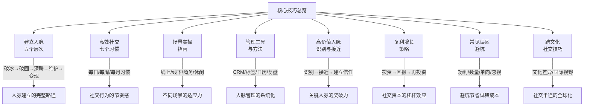
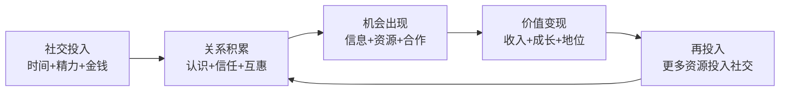
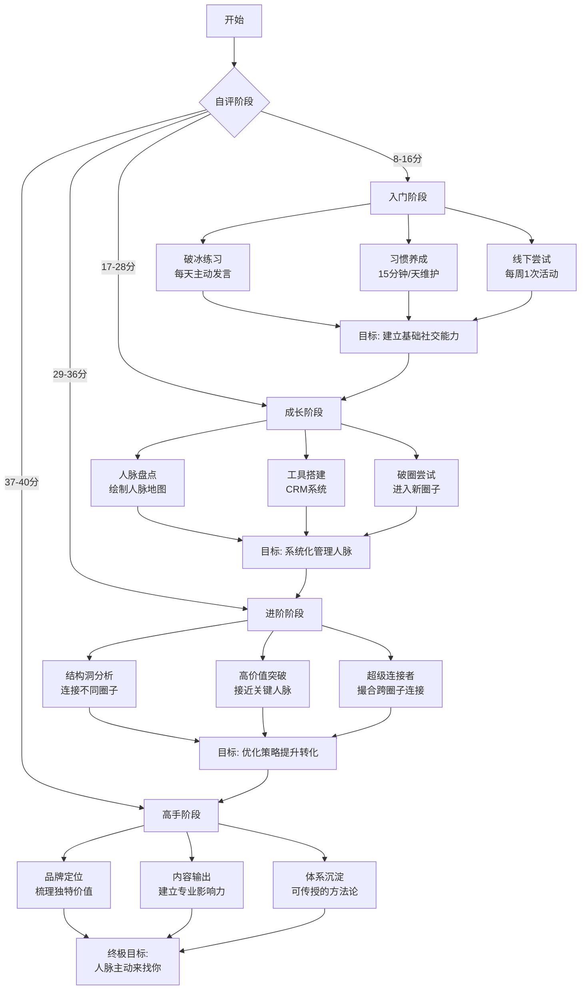

## 九、本节总结

本节"核心技巧"是整章从"道"到"术"的关键桥梁——理论基础告诉你社交资本为什么有效，而核心技巧告诉你具体怎么做。在前八个小节中，我们系统地拆解了人脉经营的完整方法论：从建立人脉的五个层次，到高效社交的七个习惯；从不同社交场景的实操指南，到人脉管理的工具与方法；从高价值人脉的识别与接近，到社交资本的复利增长；从人脉经营的常见误区，到跨文化社交技巧。

本节总结将从四个维度帮你把这些碎片化的技巧整合成一套可执行的系统：**核心框架回顾**、**关键能力自评**、**30天行动计划**、**常见问题速查**。

---

### 1. 核心框架回顾：八个技巧的内在逻辑

八个核心技巧并非孤立存在，它们构成了一条完整的人脉经营链路。理解这条链路，比记住每个技巧更重要。

#### 1.1 五个层次：人脉经营的纵向阶梯

人脉建立的五个层次——破冰、破圈、深耕、维护、变现——构成了人脉经营的纵向阶梯。每一层都有明确的能力要求和行动标准：

| 层次 | 核心能力 | 行动标准 | 常见卡点 |
|------|----------|----------|----------|
| 破冰 | 主动开口、寻找共同点 | 每次社交场合至少认识1个新朋友 | 害怕被拒绝、不知道说什么 |
| 破圈 | 进入陌生社交圈层 | 每季度进入1个新的社交圈 | 找不到入口人物、缺乏入场价值 |
| 深耕 | 将浅关系升级为深关系 | 每月与5-10个关键人物深度互动 | 不知道如何深化关系、缺乏共同经历 |
| 维持 | 定期维护人脉关系 | 建立联系人管理系统，定期跟进 | 容易忘记、不知道聊什么 |
| 变现 | 通过人脉创造实际价值 | 每季度至少促成1次人脉带来的机会 | 觉得功利、不知道如何开口 |

**关键洞察**：大多数人的问题集中在前两层——不敢破冰或无法破圈，导致人脉网络长期局限在一个很小的范围内。破冰的核心技巧是"先给后取"——你不需要很强，但你需要让对方感受到你的诚意和价值。破圈的核心技巧是"找到守门人"——每个圈子都有1-2个关键人物决定了谁能进入，与其广泛撒网，不如集中精力获得守门人的认可。

#### 1.2 七个习惯：人脉经营的节奏感

人脉经营不是一次性行为，而是持续的习惯。七个高效社交习惯对应不同的频率和场景：

| 习惯 | 频率 | 最低投入 | 核心动作 |
|------|------|----------|----------|
| 认识新朋友 | 每周 | 2-3小时 | 参加活动、社群互动、朋友引荐 |
| 维护老关系 | 每天 | 15分钟 | 问候、分享有价值信息、点赞互动 |
| 组织聚会 | 每月 | 半天 | 主题聚餐、运动活动、学习小组 |
| 人脉盘点 | 每季 | 2小时 | 审视网络结构、识别空白、调整策略 |
| 先付出后索取 | 随时 | 融入日常 | 帮人解决问题、分享信息、介绍人脉 |
| 做超级连接者 | 持续 | 融入日常 | 介绍不同圈子的人互相认识 |
| 提升自身价值 | 持续 | 每天1-2小时 | 学习、积累、建立个人品牌 |

**关键洞察**：七个习惯中，"先付出后索取"是所有习惯的基础。社交资本的本质是互惠，而互惠的启动者必须是你自己。在你还没有建立起足够的社交信用之前，唯一的策略就是持续地、不计回报地付出。这不是吃亏，这是投资——社交资本的复利效应会让这些早期投资在未来产生指数级回报。

#### 1.3 场景实操：不同社交环境的适应力

社交不是一套方法打天下，不同场景需要不同的策略。核心场景分为四类：

**线上社交**（微信、LinkedIn、社群）：
- 优势：门槛低、覆盖面广、可异步沟通
- 关键技巧：朋友圈经营（展示专业能力和生活态度）、社群活跃度（定期输出有价值内容）、私聊质量（一对一深度交流优于群发问候）
- 常见错误：群发节日祝福、只点赞不评论、加人后不说话

**线下社交**（活动、聚会、会议）：
- 优势：建立信任快、信息密度高、容易产生深度连接
- 关键技巧：提前了解参会者名单、准备3个万能话题、活动后24小时内跟进
- 常见错误：只和认识的人待在一起、拿到名片后不联系、交流时频繁看手机

**商务社交**（行业峰会、商务晚宴、客户拜访）：
- 优势：目标明确、价值交换直接、关系建立快
- 关键技巧：准备30秒自我介绍、携带个人名片或电子名片、了解对方的业务和痛点
- 常见错误：一上来就推销、不了解对方需求就开口、忽视非决策者

**休闲社交**（运动、旅行、兴趣小组）：
- 优势：关系自然、信任基础好、不带功利色彩
- 关键技巧：选择高质量的休闲活动、在轻松环境中了解对方的真实面、利用共同兴趣深化关系
- 常见错误：只顾玩不社交、过于商业化、忽视圈子里的"隐藏资源"

#### 1.4 管理工具：人脉经营的系统化

没有系统化的管理，人脉经营会变成一团乱麻。核心工具链：

**联系人管理系统**：
- 基础版：微信标签 + 备注 + Excel表格（记录关键信息：职业、兴趣、家庭、重要日期、上次联系时间）
- 进阶版：CRM工具（如Notion数据库、Airtable、HubSpot CRM免费版）
- 专业版：定制化人脉管理系统（包含关系评分、互动历史、价值评估）

**人脉地图绘制**：
- 横轴：关系亲密度（陌生人→认识→熟悉→信任→至交）
- 纵轴：对方价值度（低→中→高，综合考虑资源、影响力、互补性）
- 用这个2×2矩阵对你的联系人进行分类，优先经营"高价值+中亲密度"象限

**社交日历**：
- 每周至少安排1次社交活动（线下优先）
- 每月至少组织1次聚会（掌握主动权）
- 每季度进行1次人脉盘点（审视结构、识别空白）
- 设置关键人物的生日、纪念日提醒

**关键洞察**：工具的价值不在于复杂，而在于坚持。一个你每天打开的简单Excel表，比一个你三个月才打开一次的复杂CRM系统更有价值。选择工具的核心标准是：你是否愿意每天花5分钟维护它。

#### 1.5 高价值人脉：识别与接近的策略

不是所有人都值得花同样的精力。高价值人脉的识别标准：

| 维度 | 高价值特征 | 低价值特征 |
|------|-----------|-----------|
| 影响力 | 在所在领域有话语权和决策权 | 只有头衔没有实际影响力 |
| 资源 | 拥有丰富的资源和广泛的人脉 | 资源有限，人脉单一 |
| 互惠 | 愿意帮助他人，乐于分享资源 | 只索取不付出，封闭保守 |
| 互补性 | 与你的技能、资源、视野互补 | 与你高度同质化 |
| 成长性 | 处于上升期，有发展潜力 | 处于停滞期或下降期 |

接近高价值人脉的四条路径：

**路径一：价值先行。** 先为对方创造价值，再寻求回报。具体方式：帮对方解决一个实际问题、为对方提供有价值的信息或资源、为对方介绍他需要的人脉。这条路径的底层逻辑是"互惠原则"——当一个人接受了你的帮助，他会自然产生回报的心理义务。

**路径二：第三方引荐。** 通过共同信任的朋友介绍。引荐时要做到三点：明确告诉引荐人你想认识谁、为什么想认识；让引荐人知道你能为对方提供什么价值；引荐后及时跟进，不辜负引荐人的信任。

**路径三：共同活动。** 创造自然接触机会。参加对方也在的行业活动、加入对方所在的社群、参与对方发起的项目或活动。关键是让接触发生在自然场景中，而不是刻意安排。

**路径四：内容吸引。** 用高质量输出引起注意。在专业领域持续输出高质量内容（文章、视频、演讲），让对方主动关注你。这是成本最低、效果最持久的路径，但需要较长的时间积累。

#### 1.6 复利增长：社交资本的杠杆效应

社交资本的增长遵循复利原理：今天帮助一个人，这个人可能帮你连接更多的人，这些人又会帮你连接更多的人。当社交网络达到临界质量（约150个有效连接）后，机会的到来频率呈指数级增长。

加速社交复利的三个策略：

**策略一：帮助超级连接者。** 社交网络中，20%的人连接了80%的关系（帕累托法则）。帮助这些人，你的社交投资回报率会成倍提升。超级连接者的特征：朋友圈广泛、经常组织聚会、乐于介绍新朋友、在多个圈子中都有影响力。

**策略二：成为信息枢纽。** 当你连接了不同圈子，你就成为了信息的集散地。不同圈子的信息在你这里交汇，你就拥有了"信息差"优势。成为信息枢纽的方法：主动连接不同领域的人、定期整理和分享跨领域信息、成为"撮合者"——介绍不同圈子的人互相认识。

**策略三：建立个人品牌。** 让更多人主动来找你，降低社交成本。个人品牌的核心是：在某个领域，人们想到某个问题时会想到你。建立个人品牌的方法：持续输出专业内容、在行业活动中发声、积累成功案例和口碑。

#### 1.7 常见误区：人脉经营的避坑指南

人脉经营中最常见的五个误区，足以让你的所有努力白费：

| 误区 | 表现 | 后果 | 正确做法 |
|------|------|------|----------|
| 功利社交 | 一社交就直奔主题："你能不能帮我XX？" | 对方产生防御心理，关系无法深入 | 先建立信任和情感连接，让价值交换自然发生 |
| 数量崇拜 | 追求认识更多人，通讯录3000+但没有深度关系 | 精力分散，每段关系都浅尝辄止 | 按邓巴数管理人脉，集中精力经营关键关系 |
| 只进不出 | 总是索取，从不付出 | 社交信用破产，别人不再愿意帮你 | 在有能力帮助别人时，不计回报地伸出援手 |
| 忽视维护 | 建立关系后放任不管 | 关系淡化，需要帮助时才发现已经疏远 | 建立定期维护机制，保持适度互动 |
| 社交恐惧 | 用"我是内向的人"作为借口 | 错过大量社交机会和人脉资源 | 内向者在深度社交中有独特优势，关键是找到适合自己的方式 |

**关键洞察**：误区一（功利社交）是最致命的。一旦你被贴上"功利"的标签，你在整个社交圈中的信用都会受损——因为社交圈中的信息传播速度远超你的想象。宁可少认识一个人，也不要让一次功利社交毁掉你的社交信用。

#### 1.8 跨文化社交：社交半径的全球化

在全球化时代，跨文化社交能力越来越重要。核心差异维度：

| 维度 | 高语境文化（中国、日本） | 低语境文化（美国、德国） |
|------|------------------------|------------------------|
| 沟通方式 | 含蓄、间接、注重言外之意 | 直接、明确、注重字面意思 |
| 关系建立 | 先建立关系再谈业务 | 先谈业务再看是否建立关系 |
| 信任基础 | 基于人情和面子 | 基于合同和制度 |
| 时间观念 | 关系维护是长期投资 | 效率优先，时间就是金钱 |
| 社交礼仪 | 注重层级和辈分 | 相对平等和随意 |

跨文化社交的实操建议：提前了解对方的文化背景和社交习惯、在不确定时选择更正式的方式、尊重差异但保持真诚、找到跨文化的共同点（如专业领域、共同兴趣）。

---

### 2. 关键能力自评：你现在在哪个阶段？

在制定行动计划之前，先评估你当前的人脉经营能力。以下自评表覆盖核心技巧的八个维度，每个维度按1-5分打分（1=完全不具备，5=非常熟练）：

| 评估维度 | 自评问题 | 1分 | 3分 | 5分 |
|----------|----------|-----|-----|-----|
| 破冰能力 | 你能在社交场合自然地与陌生人交谈吗？ | 完全不敢开口 | 能勉强交流但不自然 | 轻松自如，每次都能找到话题 |
| 破圈能力 | 你过去一年进入了几个新的社交圈？ | 0个 | 1-2个 | 3个以上 |
| 关系深度 | 你有多少个真正信任你、愿意帮你的人？ | 5个以下 | 5-20个 | 20个以上 |
| 维护习惯 | 你是否有系统化的人脉维护机制？ | 完全靠感觉 | 有简单记录但不规律 | 有完整系统并坚持执行 |
| 价值交换 | 你过去一个月帮助了多少人？ | 0-1人 | 2-5人 | 6人以上 |
| 工具使用 | 你使用什么工具管理人脉？ | 什么都不用 | 微信标签/备忘录 | CRM系统/数据库 |
| 复利意识 | 你是否有意识地做"超级连接者"？ | 从不 | 偶尔 | 经常主动介绍不同圈子的人认识 |
| 自我提升 | 你每天花多少时间提升自身价值？ | 几乎没有 | 30分钟-1小时 | 1-2小时以上 |

**评分标准**：
- **8-16分**：入门阶段——你需要从最基础的破冰和习惯养成开始
- **17-28分**：成长阶段——你已经有一定基础，需要系统化和工具化
- **29-36分**：进阶阶段——你已经有不错的社交能力，重点是优化策略和扩大影响力
- **37-40分**：高手阶段——你已经是社交达人，重点是跨文化拓展和复利加速

---

### 3. 30天行动计划：从知道到做到

根据你的自评分数，选择对应的行动计划。每个计划都是30天，按周拆解，每周有明确的任务和验收标准。

#### 3.1 入门版（自评8-16分）

**目标**：建立基础社交能力，迈出第一步。

| 周次 | 核心任务 | 每日行动 | 周末验收 |
|------|----------|----------|----------|
| 第1周 | 破冰练习 | 每天在微信群/社群主动发言1次 | 能自然地在社群中自我介绍 |
| 第2周 | 扩展接触 | 每天在朋友圈发1条有价值的内容 | 获得至少5条互动（点赞/评论） |
| 第3周 | 线下尝试 | 参加1次线下活动（行业沙龙/兴趣小组） | 认识至少2个新朋友并加微信 |
| 第4周 | 跟进维护 | 跟第3周认识的新朋友各交流1次 | 能清楚说出对方的职业和兴趣 |

**入门版核心原则**：不要追求完美，先行动起来。第一次社交可能会尴尬，但这很正常。每一次尴尬的经历都是在为未来的自如社交积累经验。

#### 3.2 成长版（自评17-28分）

**目标**：建立系统化的人脉管理机制。

| 周次 | 核心任务 | 每日行动 | 周末验收 |
|------|----------|----------|----------|
| 第1周 | 人脉盘点 | 整理通讯录，按亲密度和价值度分类 | 完成人脉地图初稿 |
| 第2周 | 工具搭建 | 建立人脉管理表格（Notion/Excel） | 系统中录入50个关键联系人 |
| 第3周 | 习惯养成 | 每天花15分钟维护老关系 | 建立每日社交维护的固定时间 |
| 第4周 | 破圈尝试 | 加入1个新的社群/圈子 | 在新圈子中认识3个以上新朋友 |

**成长版核心原则**：系统化比热情更重要。你不需要每天花很多时间在社交上，但你需要每天花一点时间，并且这些时间是有计划、有目标的。

#### 3.3 进阶版（自评29-36分）

**目标**：优化策略，提升社交资本的转化效率。

| 周次 | 核心任务 | 每日行动 | 周末验收 |
|------|----------|----------|----------|
| 第1周 | 结构洞分析 | 分析你的人脉网络中有哪些"结构洞" | 识别2-3个可以连接的不同圈子 |
| 第2周 | 高价值突破 | 选择1个高价值人脉，制定接近策略 | 成功与目标人物建立初步联系 |
| 第3周 | 超级连接者 | 主动为不同圈子的人牵线搭桥 | 成功促成1次跨圈子的连接 |
| 第4周 | 复盘优化 | 分析过去30天的社交投入产出比 | 制定下个月的优化策略 |

**进阶版核心原则**：从"做多"转向"做精"。你已经有了足够的社交能力，现在需要的是策略性思考——哪些关系值得投入更多精力？哪些圈子值得深耕？如何让你的社交投入产生最大回报？

#### 3.4 高手版（自评37-40分）

**目标**：打造个人品牌，实现社交资本的指数级增长。

| 周次 | 核心任务 | 每日行动 | 周末验收 |
|------|----------|----------|----------|
| 第1周 | 品牌定位 | 梳理你的核心优势和独特价值 | 完成个人品牌的定位声明 |
| 第2周 | 内容输出 | 在专业平台输出1篇高质量内容 | 获得至少10次转发/收藏 |
| 第3周 | 跨文化拓展 | 接触1个国际化社群或跨文化场景 | 与至少1位不同文化背景的人建立联系 |
| 第4周 | 体系总结 | 整理你的人脉经营方法论 | 形成可传授的个人社交体系 |

**高手版核心原则**：从"经营人脉"转向"经营影响力"。当你的个人品牌足够强大时，人脉会主动来找你——这是社交资本的最高境界。

---

### 4. 关键公式与模型速查

以下是本节核心技巧中涉及的关键公式和模型，方便你随时查阅和应用。

#### 4.1 人脉价值公式

$$\text{人脉价值} = \text{对方资源} \times \text{关系深度} \times \text{互惠意愿} \times \text{互补性}$$

四个因子缺一不可。对方资源再丰富，如果关系浅、互惠意愿低，这段关系的实际价值也很低。

#### 4.2 社交投入产出比

$$\text{社交ROI} = \frac{\text{人脉带来的机会价值}}{\text{社交投入的时间和精力}}$$

提升社交ROI的两个方向：减少无效社交（砍掉低价值活动），增加高杠杆社交（帮助超级连接者、成为信息枢纽）。

#### 4.3 邓巴数分层模型

| 层级 | 人数 | 关系特征 | 维护频率 |
|------|------|----------|----------|
| 核心圈 | 3-5人 | 至交好友，可以托付后背 | 每天 |
| 亲密圈 | 10-15人 | 信任度高，经常互动 | 每周 |
| 朋友圈 | 35-50人 | 关系不错，偶尔联系 | 每月 |
| 认识圈 | 100-150人 | 认识但不熟 | 每季 |
| 外围圈 | 500-1500人 | 点头之交 | 按需 |

#### 4.4 社交资本转化路径

这个循环的关键加速器是"个人价值"——你的个人价值越高，每个环节的转化效率就越高。所以，提升自身价值永远是社交资本增长的根本。

---

### 5. 常见问题速查

在实践本节核心技巧的过程中，你可能会遇到以下问题。这里提供快速解答：

**Q1：我是内向的人，怎么社交？**

内向不是缺陷，而是特点。内向者在深度社交方面有独特优势：更善于倾听、更注重关系质量、更擅长一对一深入交流。策略：避开大型社交场合，专注于小型深度聚会；用内容输出（写作、录制视频）代替面对面社交；利用线上社交降低社交压力；每次社交后给自己留出独处恢复的时间。

**Q2：我没有资源，怎么给别人提供价值？**

价值不只是金钱和资源。你可以提供的价值包括：信息（你知道而对方不知道的事情）、时间（帮对方做一些对方没时间做的事情）、连接（介绍对方需要认识的人）、情感支持（在对方需要时提供倾听和鼓励）、专业能力（用你的专业技能帮对方解决问题）。记住：每个人都有自己独特的价值，关键是你是否愿意主动提供。

**Q3：如何判断一段关系值不值得继续投入？**

三个判断标准：第一，对方是否也在付出（关系是否互惠）；第二，这段关系是否让你成长（认知层面是否有收获）；第三，这段关系是否有未来（对方是否有成长潜力）。如果三个标准中有两个答案为"否"，这段关系可能不值得继续投入大量精力——但也不需要断绝关系，降级到"认识圈"维持即可。

**Q4：社交和功利的界限在哪里？**

界限在于"顺序"。先建立关系，再自然地发生价值交换——这是健康的社交。先想着利用对方，再假装建立关系——这是功利社交。判断标准很简单：如果对方永远无法给你任何回报，你还愿意和他交往吗？如果答案是"是"，那你的社交就是真诚的。

**Q5：线上社交和线下社交哪个更重要？**

两者不可替代。线上社交的优势是覆盖面广、效率高、可异步；线下社交的优势是信任建立快、信息密度高、容易产生深度连接。最佳策略是"线上广度+线下深度"——用线上社交扩大人脉网络的规模，用线下社交加深关键关系的深度。

**Q6：如何在社交中避免被利用？**

三个防护措施：第一，设立付出上限——在关系初期，控制你的付出程度，观察对方是否有回报的意愿和行动；第二，观察对方对其他人的态度——一个对你很好但对其他人很差的人，迟早也会对你差；第三，信任但验证——不要因为一次好的互动就完全信任对方，信任需要通过多次互动逐步建立。

---

### 6. 本节核心技巧的整合框架

最后，用一张图将本节所有核心技巧整合成一个完整的行动框架：

这个框架的核心逻辑是：**能力→系统→策略→影响力**。每个阶段都有明确的目标和行动标准，你不需要一步到位，但你需要知道自己在哪个阶段，以及下一步该往哪里走。

---

### 7. 从核心技巧到实战：下一步学什么？

完成本节核心技巧的学习后，建议按以下顺序继续：

1. **实战案例**（下一节）——通过7个真实案例，看别人如何将这些技巧应用到实际场景中。找到与你情况最接近的案例，深入研究他们的策略和执行细节。

2. **常见误区**——对照检查自己是否存在这些误区，提前避坑。

3. **练习方法**——选择适合你当前阶段的练习，将知识转化为能力。

4. **深度拓展**——进一步深化对社交资本的理解，掌握进阶理论和前沿策略。

> **核心提醒**：本节所有技巧的价值，取决于你是否真正去执行。读100遍不如做1次。选择一个你最需要的技巧，今天就开始行动。
