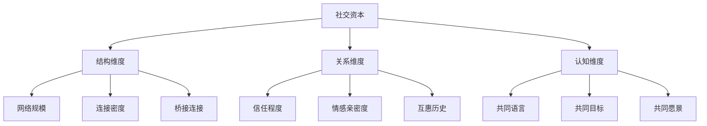
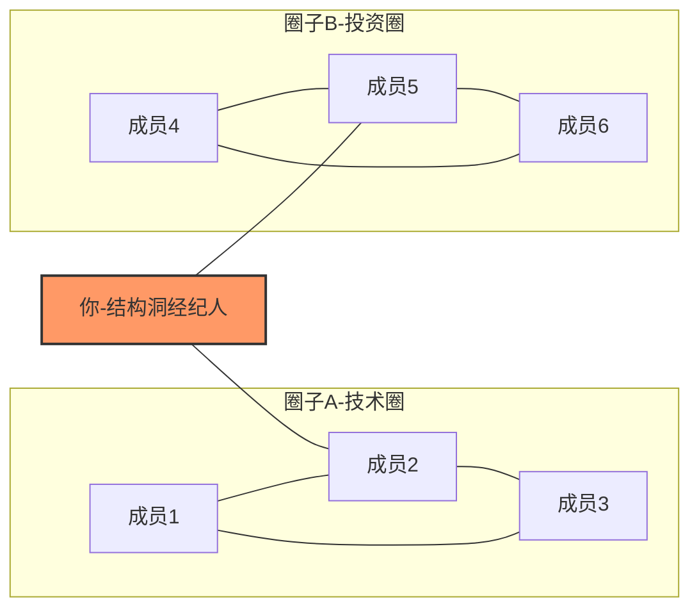
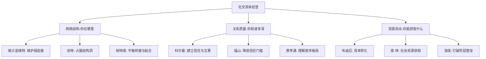

## 一、社交资本理论的起源与发展

社交资本（Social Capital）是理解人脉与社交网络价值的核心理论框架。与金融资本（钱）、人力资本（技能知识）不同，社交资本存在于人与人之间的关系之中——它不是你拥有的东西，而是你通过关系网络能够调动的资源。理解这一理论的来龙去脉，是系统化经营人脉的前提。

### 1. 什么是社交资本

#### 1.1 基本定义

社交资本是指个体或群体通过社会关系网络所获得的实际和潜在资源的总和。这些资源包括信息、信任、互惠规范、社会支持以及影响力。

通俗来说：你认识谁、他们信任你多少、你们之间的互惠关系有多深，决定了你能通过人脉网络获取多少价值。

#### 1.2 社交资本与其他资本的对比

| 维度 | 金融资本 | 人力资本 | 社交资本 |
|------|---------|---------|---------|
| 存在形式 | 货币、资产 | 知识、技能 | 关系、信任、网络 |
| 积累方式 | 储蓄、投资 | 学习、实践 | 互动、互助、时间投入 |
| 损耗方式 | 消费、通胀 | 遗忘、过时 | 疏远、背叛、长期不维护 |
| 可转让性 | 完全可转让 | 不可转让（跟随个体） | 部分可转让（可以介绍引荐） |
| 复利效应 | 利息复利 | 技能叠加复利 | 网络效应指数增长 |
| 衡量难度 | 容易（账面数字） | 中等（证书、绩效） | 困难（关系质量难量化） |

#### 1.3 社交资本的三个核心维度

根据综合各学派观点，社交资本可以从三个维度理解：

**结构维度（Structural）**：你的人际网络的拓扑结构——网络有多大、连接有多密、是否有多元化的桥接连接。拥有500个微信好友但全是同行业同事的人，结构维度并不理想。

**关系维度（Relational）**：关系的质量——信任程度、情感亲密度、互惠历史。你和某个联系人是点头之交还是生死之交，决定了你能调动对方多少资源。

**认知维度（Cognitive）**：共享的语境、价值观和理解方式——是否拥有共同语言、共同目标、共同愿景。同一行业的人天然拥有更高的认知维度。

### 2. 理论起源：思想先驱

社交资本的概念并非凭空出现，它有着深厚的思想根基，跨越社会学、经济学、政治学等多个学科。

#### 2.1 早期萌芽（19世纪末-20世纪初）

**莱达·贾德·哈尼凡（Lida Judson Hanifan）——首次使用"社交资本"一词**

1916年，美国西弗吉尼亚州的教育督学哈尼凡在《乡村学校社区中心》一文中首次使用了"social capital"这个术语。他用这个概念来描述乡村社区中人与人之间的良好意愿、同情心和社交往来如何构成一种有价值的资源。

哈尼凡的原话大意是：社区中个人的社交关系构成了社交资本——如果个人单独行动，就无法实现的目标，通过社交资本的积累可以实现。他观察到，一个社区的学校质量不仅取决于经费和设施（金融资本），更取决于社区成员之间的互助传统和社会凝聚力（社交资本）。

这一观察的意义在于：早在一个多世纪前，就有人意识到"关系"本身就是一种生产力。

**埃米尔·涂尔干（Émile Durkheim）——社会整合的思想基础**

涂尔干虽然没有直接使用"社交资本"一词，但他关于社会整合（Social Integration）和集体意识（Collective Consciousness）的理论，为社交资本概念奠定了社会学基础。他在《自杀论》中证明：个体与社会群体的联系程度，直接影响个人福祉——社会联系越弱，自杀率越高。这一发现直接指向了社交资本对个人命运的影响。

#### 2.2 经典奠基（1960-1980年代）

**简·雅各布斯（Jane Jacobs）——城市社区中的社交资本**

1961年，城市规划学者雅各布斯在《美国大城市的死与生》中，虽未系统阐述理论，但她对城市街区"眼睛盯着街道"现象的分析，实质上描述了社交资本在城市治理中的作用——邻里之间的熟人网络提供了一种非正式的安全保障机制，这是金钱买不到的。

**格伦·洛瑞（Glenn Loury）——经济学视角的引入**

1977年，经济学家洛瑞在研究种族间经济不平等时，首次将社交资本引入经济学分析框架。他指出，非裔美国人在劳动力市场上的劣势，不仅来自人力资本的差异（教育水平），更来自社交资本的差异——他们缺少进入高薪职业的社会网络通道。这一洞见具有突破性意义：它解释了为什么两个能力相同的人，仅因社交圈不同，职业发展可能天差地别。

### 3. 三大理论支柱：布迪厄、科尔曼与帕特南

社交资本理论的系统化，主要归功于三位学者，他们分别从不同学科视角构建了理论框架。

#### 3.1 皮埃尔·布迪厄（Pierre Bourdieu）——社会分层视角

**核心观点：社交资本是精英再生产的工具**

法国社会学家布迪厄在1980年代系统阐述了社交资本理论。在他看来，社交资本是"实际或潜在资源的集合，这些资源与拥有相互熟识和认可的制度化关系的持久网络有关"。

布迪厄的关键洞察：

**资本的三种形态**：布迪厄将资本分为经济资本（金钱物质）、文化资本（学历品味）和社会资本（关系网络），三者可以相互转化。一个富商（经济资本高）可以通过赞助慈善活动结识政界人士（转化社交资本），而后者可能为其提供政策信息（转化为新的经济资本）。

**社交资本的阶层属性**：布迪厄认为，社交资本不是均匀分布的——上层阶级通过俱乐部、名校校友会、私人聚会等方式，构建排他性的社交网络，将社交资本封闭在阶层内部。这就是为什么商学院的真正价值不在于课堂知识，而在于你结识的同学。

**场域理论（Field Theory）**：布迪厄提出，社交资本的价值取决于你所处的"场域"。在商业场域中有价值的关系，在学术场域中可能毫无用处。这意味着经营人脉的第一步是明确你活跃的核心场域。

**布迪厄理论的实践启示**：

- 社交资本不是"朋友多"这么简单，而是网络中蕴涵的可调动资源
- 高端社交圈的"门槛"本质上是社交资本的排他性保护机制
- 你需要同时积累多种资本，因为它们可以相互转化
- 选择正确的"场域"比认识更多人更重要

#### 3.2 詹姆斯·科尔曼（James Coleman）——功能主义视角

**核心观点：社交资本是社区与教育成就的关键因素**

美国社会学家科尔曼在1988年发表的《人力资本创造中的社交资本》是该领域最具影响力的论文之一。他从功能主义角度定义社交资本：社交资本不是一个单一实体，而是具有两个共同特征的多种实体——它们都由社会结构的某些方面组成，并且促进社会结构中行动者的特定行动。

**科尔曼的社交资本形式**：

**义务、期望与信任**：如果A帮了B一个忙，B就对A负有义务。这种相互义务构成了一种"可兑现的信用凭证"——A日后可以请B帮忙作为回报。一个社区中这种信用凭证越多，社区成员能调动的资源就越多。

**信息通道**：社会结构中嵌入着大量信息。一个人的社交网络就是他的信息网络——你不需要什么都知道，你只需要知道谁知道。

**规范与有效惩罚**：社区中的行为规范（如互帮互助、诚实守信）本身就是一种社交资本。当社区成员违反规范时会受到惩罚（声誉损失、被排斥），这种机制降低了交易成本。

**科尔曼的核心案例——科尔曼报告**：

科尔曼通过大规模教育研究发现：学生学业成绩的差异，最大的影响因素不是学校硬件设施，不是教师水平，而是学生的家庭和社区社交资本。具体来说：

- 来自双亲家庭、父母与子女互动频繁的学生，成绩更好
- 教会学校（宗教社区提供更强的社交资本）的学生表现优于公立学校
- 社区中成年人对孩子的集体关注（"别人家的孩子我也管"现象）对学业有显著正面影响

**科尔曼理论的实践启示**：

- 社交资本的积累需要时间——信任和互惠关系无法速成
- 社区比个人更重要——你所在圈子的整体社交资本水平决定了上限
- 信息不对称是社交资本的重要来源——你掌握别人不知道的信息，就是价值
- 社交规范需要维护——背叛信任不仅损失一个人，还会被整个网络排斥

#### 3.3 罗伯特·帕特南（Robert Putnam）——宏观民主视角

**核心观点：社交资本是民主社会的基石，正在衰落**

哈佛大学政治学家帕特南在1993年的《使民主运转起来》和2000年的《独自打保龄》中，将社交资本理论推向了公共话语的中心。

**意大利南北研究**：帕特南通过长达20年的追踪研究，发现意大利北部地区民主治理的成功和南部地区的失败，根本原因在于历史形成的社交资本差异。北部有丰富的公民社团传统（合唱团、足球俱乐部、合作社），人们习惯于横向合作；南部则是庇护-附庸关系主导的垂直网络，社会信任极低。

**独自打保龄现象**：帕特南用一个形象的比喻描述美国社交资本的衰落——过去美国人打保龄球是组队参加联赛，现在是独自去打。这个比喻揭示了一个深刻趋势：美国人参加社团活动、去教堂、和邻居聊天的频率在持续下降，社交网络在萎缩。

**桥接型（Bonding）与粘合型（Bridging）社交资本**：

| 类型 | 桥接型社交资本 | 粘合型社交资本 |
|------|--------------|--------------|
| 关系特征 | 弱连接、跨越群体边界 | 强连接、群体内部 |
| 典型场景 | 跨行业交流会、校友会 | 家庭、密友、同乡会 |
| 信息价值 | 高（获取异质信息） | 低（信息同质化） |
| 情感支持 | 弱 | 强 |
| 资源调动 | 广但浅 | 窄但深 |
| 社会功能 | 促进包容、创新 | 提供归属感、互助 |
| 过度风险 | 关系浅薄，难以深度合作 | 群体极化、排外 |

帕特南的政策含义：一个社会的社交资本总量不是固定的，可以通过政策干预（如鼓励社区活动、发展公共空间、支持公民社团）来提升。

**帕特南理论的实践启示**：

- 社交资本有宏观和微观两个层面——你个人的社交资本受宏观环境影响
- 桥接型和粘合型社交资本需要平衡——只有强关系或只有弱关系都不健康
- "独自打保龄"是一个警示——被动的社交媒体浏览不等于真正的社交资本积累
- 公共参与（志愿者活动、业主委员会、行业组织）是积累社交资本的高效途径

### 4. 现代理论发展（1990年代至今）

#### 4.1 马克·格兰诺维特（Mark Granovetter）——弱连接的力量

**核心发现：改变你命运的往往不是密友，而是泛泛之交**

格兰诺维特在1973年发表的《弱连接的力量》是社会学史上被引用最多的论文之一。他通过调查波士顿地区专业人士的求职过程，发现了一个反直觉的事实：56%的人是通过"偶尔联系的人"（而非亲密朋友）找到工作的。

**为什么弱连接更有价值？**

信息冗余理论：你的密友和你处于同一个社交圈，他们知道的信息你大概率也知道。而偶尔联系的熟人（前同事、同学的朋友、行业活动中认识的人）处于不同的社交圈，能为你带来你圈子内不存在的信息——比如一个你从未听说过的职位空缺。

桥接作用：弱连接充当不同社交圈之间的"桥梁"。在一个信息流动的社会中，桥接位置上的个体拥有最大的信息优势。

**格兰诺维特理论的实践启示**：

- 不要只维护核心圈子，定期维护弱连接同样重要
- 换工作、转行、寻找机会时，应该先激活弱连接而非密友
- "六度分隔"中真正起作用的不是你和目标之间的总距离，而是是否存在有效的弱连接桥
- 社交媒体的价值在于维护大量弱连接，但前提是真正的互动而非单向浏览

#### 4.2 罗纳德·伯特（Ronald Burt）——结构洞理论

**核心发现：连接两个不相干圈子的人获得最大竞争优势**

芝加哥大学商学院教授伯特在1992年的《结构洞》中提出了一个极具影响力的理论：社交网络中存在"结构洞"——两个不相干群体之间的空白地带。能够跨越结构洞、连接这两个群体的人，拥有信息优势和控制优势。

**信息优势**：
- 你知道两个圈子各自在做什么，而他们互相不知道
- 你能比别人更早获得有价值的信息
- 你能将一个圈子的创意、做法引入另一个圈子

**控制优势**：
- 你充当两个圈子之间的中介，拥有议价权
- 你可以选择传递或不传递信息，获得策略性优势
- 你在多方关系中扮演"经纪人"角色

**伯特的实证研究**：伯特通过对美国大型电子公司的管理层研究发现，拥有更多结构洞位置的管理者，获得晋升的速度更快、薪酬更高、获得的创意认可更多——这种优势与个人能力无关，纯粹来自网络位置。

**伯特理论的实践启示**：

- 人脉经营的核心不是认识更多人，而是占据有利的网络位置
- 如果你同时了解技术和商业、国内和海外、学术和产业，你就占据了结构洞
- 主动成为两个不相干圈子的"桥梁"比在同一个圈子里深耕更有边际收益
- 创业者的核心能力之一是连接资源方和需求方，本质就是跨越结构洞

#### 4.3 南·林（Nan Lin）——社会资源理论

**核心观点：社交资本是个体通过社会关系获取和使用的嵌入性资源**

华裔社会学家南·林在2001年的《社交资本：关于社会结构与行动的理论》中，提出了一个更具操作性的理论框架。他关注的核心问题是：人们如何通过社交网络获取有价值的资源？

**社会资源理论的三个命题**：

- **地位强度命题**：一个人的初始社会地位越高，其社交网络中可获取的资源就越多
- **强连接强度命题**：关系越强，获取的社会资源越相似（同质性高）
- **弱连接强度命题**：关系越弱，获取的社会资源越异质（异质性高，价值可能更大）

**行动的两个动机**：

- **工具性行动**：为了获取自己不拥有的资源（找工作、求投资、要政策）
- **表达性行动**：为了维护和保护已有的资源（保持关系、寻求情感支持）

**南·林理论的实践启示**：

- 社交资本的回报取决于你关系网络中"最高价值节点"的水平
- 维护弱连接的回报率高于维护强连接（但两者都需要）
- 向上社交的本质是获取更高等级的社会资源
- 纯粹功利性的社交会失败——需要同时满足工具性和表达性两个动机

#### 4.4 弗朗西斯·福山（Francis Fukuyama）——信任与社交资本

**核心观点：高信任社会比低信任社会拥有更强的经济竞争力**

政治经济学家福山在1995年的《信任：社会美德与创造经济繁荣》中，将社交资本理论与经济发展直接关联。他的核心论点是：一个社会的信任水平决定了企业的规模和经济组织的效率。

**高信任社会 vs 低信任社会**：

| 维度 | 高信任社会（如日本、德国） | 低信任社会（如中国部分地区、意大利南部） |
|------|------------------------|----------------------------------------|
| 企业规模 | 大型企业为主 | 家族企业为主 |
| 组织效率 | 专业经理人管理 | 家族成员管理 |
| 创新能力 | 开放式创新 | 封闭式创新 |
| 交易成本 | 低（合同简洁，执行高效） | 高（需要复杂合同和担保） |
| 产业特征 | 资本密集型、技术密集型 | 劳动密集型、关系密集型 |

**福山理论的实践启示**：

- 信任是社交资本的核心——没有信任，一切社交关系都是空壳
- 在低信任环境中经营社交资本，需要投入更多时间和精力建立信任信号
- 行业口碑和长期一致性行为是建立信任的最有效方式
- 在中国语境下，"关系"（guanxi）本身就是一种本土化的社交资本形式

#### 4.5 数字时代的社交资本理论演进

进入21世纪，互联网和社交媒体彻底改变了社交资本的积累和变现方式。

**博伊德（danah boyd）的网络化公共领域**：社交媒体创造了新的"网络化公共领域"，人们在其中建立、维护和展示社交资本。朋友圈点赞数、微博转发量、LinkedIn连接数成为社交资本的新指标。

**艾莉森·范·埃尔普（Ellison & Steinfield）的Facebook研究**：2007年的研究表明，Facebook等社交平台主要增强了"维持型社交资本"（maintenance social capital）——帮助人们低成本维持大量弱连接。但对"桥接型社交资本"的创建效果有限。

**数字社交资本的新特征**：

- **可量化**：粉丝数、互动率、转发量使社交资本首次变得可测量
- **可展示**：社交资本从隐性变为显性——你和谁合影、谁给你背书
- **去地域化**：在线社交不受地理限制，一个小镇青年可以连接全球资源
- **平台依赖**：社交资本附着在平台上，平台的规则变动可能一夜之间改变你的社交资本存量
- **速度加快**：线下建立信任需要数月甚至数年，线上可能数天就够了（但也更容易崩塌）

### 5. 社交资本理论在中国语境下的发展

#### 5.1 "关系"（Guanxi）的独特性

中国的"关系"体系是全球范围内最复杂、最精细的社交资本系统之一。与西方社交资本理论相比，中国的关系体系有几个独特之处：

**差序格局**：费孝通提出的"差序格局"概念描述了中国人际关系的同心圆结构——以自我为中心，由近及远分为家人、熟人、生人三个层次，每个层次适用不同的交往规则和信任机制。

**面子与人情**：中国社交资本体系中，"面子"是社交货币，"人情"是社交债务。帮别人办事是给面子、积累人情；别人帮你办事是欠人情、日后要还。这套非正式的信用体系比任何正式合同都管用。

**关系的可转化性**：在中国，社交资本可以更直接地转化为经济资本——关系好的人可以在商业谈判中获得更好的条件、在行政审批中获得更快的处理、在信息不对称中获得先机。

#### 5.2 中国学者的理论贡献

**边燕杰的强关系理论**：边燕杰通过对中国天津求职者的调查，发现与格兰诺维特的"弱连接"理论相反，在中国体制内，求职更多依赖"强关系"——因为强关系不仅传递信息，还传递影响力（帮忙打招呼、递话）。这一发现修正了弱连接理论的文化边界条件。

**罗家德的社会网分析**：清华大学教授罗家德将社会网络分析方法引入中国管理研究，提出了"自组织"理论——中国社会中大量的自组织行为（商会、同乡会、行业协会）是社交资本积累和运作的重要平台。

### 6. 理论整合：一个实用框架

将上述理论整合为个人可用的社交资本认知框架：

**核心行动原则**（从理论推导）：

1. **先有位置再有人数**——与其盲目扩展人脉，先想清楚你需要在网络中占据什么位置（伯特）
2. **强弱关系都经营**——强关系给你支持，弱关系给你机会，两者不可偏废（格兰诺维特+科尔曼）
3. **信任是一切的基础**——没有信任的社交关系是虚假繁荣（福山+科尔曼）
4. **社交资本需要投资**——它不会自动产生，需要时间、精力、资源的持续投入（布迪厄）
5. **选择正确的场域**——在错误的圈子里深耕不如在正确的圈子里浅尝（布迪厄）
6. **成为桥梁而非孤岛**——连接不相干的圈子比成为单一圈子的核心更有战略价值（伯特）

### 7. 常见误区与纠正

| 误区 | 纠正 | 理论依据 |
|------|------|---------|
| 认识的人越多越好 | 网络位置比规模更重要 | 伯特结构洞理论 |
| 只维护亲密朋友 | 弱连接带来新机会 | 格兰诺维特弱连接理论 |
| 社交就是请客吃饭 | 信任和互惠比表面应酬重要 | 科尔曼社会资本理论 |
| 社交资本可以速成 | 信任需要时间积累，没有捷径 | 福山信任理论 |
| 有用才去社交 | 功利性太强反而损害关系 | 南·林的表达性动机 |
| 只在线上社交 | 深度信任需要线下互动 | 埃里森维持型社交资本研究 |
| 认为社交资本等于人脉 | 人脉是结构，社交资本是可调动的资源 | 布迪厄的资本定义 |
| 忽视社交资本的维护成本 | 关系不用则废，但维护也有成本 | 科尔曼的信任与互惠框架 |

### 8. 本节小结

社交资本理论从1916年哈尼凡的首次命名，经过布迪厄、科尔曼、帕特南的系统化建设，到格兰诺维特、伯特、南·林的精细化分析，再到福山的信任研究和数字时代的新发展，已经形成了一个跨越社会学、经济学、政治学、管理学的完整知识体系。

对于个人而言，理解这些理论不是为了做学术研究，而是为了：

- **看清楚**：明白社交关系的本质是资源交换网络，而非单纯的情感连接
- **想明白**：知道为什么有些人脉经营高效（占据了有利网络位置），有些人脉经营低效（只是认识了很多人）
- **做对事**：将有限的社交精力投入到最有价值的关系和网络位置上

下一节将基于这些理论基础，探讨社交资本的分类与度量方法——把抽象理论转化为可操作的评估体系。
