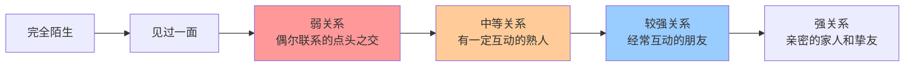
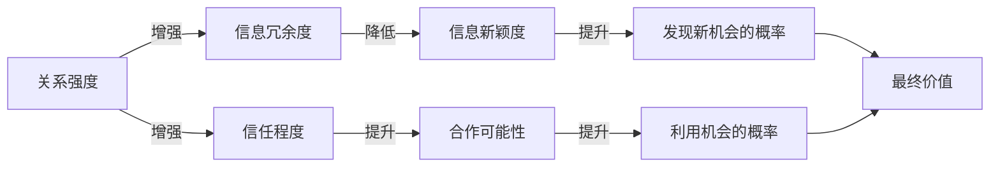
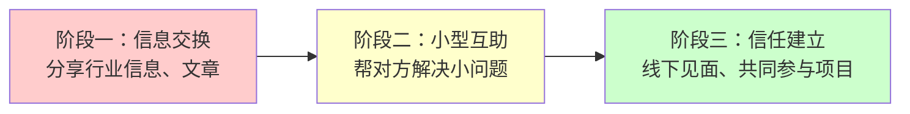
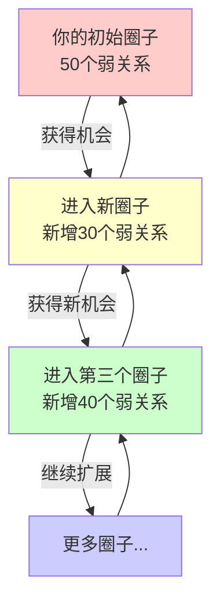

## 二、弱关系理论：为什么点头之交比闺蜜更有用？

你有没有遇到过这样的情况：找了半年工作没有结果，结果一个很久没联系的老同学突然发来一条消息，说他们公司正好在招人，问你有没有兴趣？或者你苦于找不到某个行业的供应商，结果在一个偶然的饭局上，一个刚认识的人三分钟就帮你解决了问题？

这不是巧合。这是社会学中最重要的发现之一——**弱关系理论**（The Strength of Weak Ties）——在你生活中的真实体现。

1973年，斯坦福大学社会学教授马克·格兰诺维特（Mark Granovetter）发表了一篇改变社会学版图的论文《弱关系的力量》（The Strength of Weak Ties），发表在《美国社会学杂志》（American Journal of Sociology）上。这篇论文后来成为社会学领域被引用次数最多的论文之一，截至2024年累计引用超过65,000次，影响力堪比物理学中的相对论。

---

### 1. 什么是强关系和弱关系？

#### 1.1 格兰诺维特的定义

格兰诺维特提出了一个看似简单却极其深刻的区分：人与人之间的关系可以分为**强关系**（Strong Ties）和**弱关系**（Weak Ties）。区分的依据不是你"觉得"关系好不好，而是有三个可测量的维度：

| 维度 | 强关系 | 弱关系 |
|------|--------|--------|
| **互动频率** | 经常联系（每周甚至每天） | 偶尔联系（几个月一次甚至更少） |
| **情感强度** | 深厚的情感投入，彼此关心 | 情感投入较浅，客气友好 |
| **亲密程度** | 无话不谈，了解对方私事 | 只了解表面信息，点头之交 |
| **互惠交换** | 持续的互相帮助和服务 | 偶尔的、有限的互惠 |

举个直观的例子：

- **强关系**：你的父母、配偶、最好的朋友、每天一起吃饭的同事
- **弱关系**：大学同班但毕业后没怎么联系的同学、隔壁部门偶尔开会碰到的同事、朋友聚会上认识但只加了微信没聊过天的人、小区里见面会打招呼的邻居

#### 1.2 关系强度是一个连续光谱

需要强调的是，强关系和弱关系并不是非此即彼的二元分类，而是一个连续的光谱：



格兰诺维特的研究主要关注的是光谱中间偏弱的那段——那些你不怎么联系、但确实认识的人。他发现，正是这些"中间地带"的关系，在信息传递和社会流动中发挥着不成比例的巨大作用。

---

### 2. 核心发现：为什么弱关系更有用？

#### 2.1 原始研究：波士顿求职调查

格兰诺维特在1970年代初对美国波士顿地区牛顿市（Newton）的白领专业人士进行了一项经典的实证研究。他访谈了数百名最近换过工作的专业人士，详细询问他们是如何得到现在这份工作的。

结果令人震惊：

| 求职渠道 | 占比 |
|----------|------|
| 通过"不太熟的人"（弱关系） | **56%** |
| 通过正式渠道（招聘广告、猎头等） | 18.8% |
| 通过"直接申请"（没有任何关系） | 20% |
| 通过"亲密朋友"（强关系） | **仅16.7%** |

超过一半的人是通过"不太熟的人"找到工作的，而不是通过他们最亲密的朋友。这个发现与人们的直觉完全相反——我们本能地认为，最亲近的人最愿意帮我们，所以应该最有效。但数据显示并非如此。

#### 2.2 为什么会这样？——信息冗余的逻辑

要理解为什么弱关系比强关系更有用，关键在于理解一个概念：**信息冗余**（Information Redundancy）。

想象你的社交网络是一个地图。你和你的五个好朋友组成一个紧密的小圈子，你们每天聊天、吃饭、分享信息。问题来了：你们五个人知道的事情，大概率是差不多的。你的朋友A知道的招聘信息，朋友B、C、D可能也知道。这就是信息冗余——强关系网络中的信息高度重叠。

```mermaid
graph TD
    subgraph 你的强关系网络
        你 --- A[朋友A]
        你 --- B[朋友B]
        你 --- C[朋友C]
        A --- B
        B --- C
        A --- C
    end
    
    subgraph 你的弱关系
        你 -.-> D[前同事D<br/>去了另一个行业]
        你 -.-> E[大学同学E<br/>在另一个城市]
        你 -.-> F[行业会议上<br/>认识的人F]
    end
    
    style 你 fill:#ff6666
    D fill:#99ff99
    E fill:#99ff99
    F fill:#99ff99
```

弱关系的价值恰恰在于：它们连接的是**不同的社交圈子**。你的前同事D去了一个完全不同的行业，他知道的信息和你当前圈子完全不同。大学同学E在另一个城市，他接触的机会是你本地圈子根本看不到的。行业会议上认识的人F，他的信息来源和你的朋友圈几乎没有重叠。

用信息论的语言来说：**强关系传递的是冗余信息，弱关系传递的是新信息。** 在找工作、找资源、找机会这类需要"新信息"的场景中，弱关系的优势是压倒性的。

#### 2.3 桥梁作用：弱关系作为信息通道

格兰诺维特引入了一个关键概念：**桥梁**（Bridge）。在社交网络中，一条桥梁是连接两个社交圈的唯一通道。如果去掉这条连接，两个圈子就完全断开了。

弱关系之所以强大，是因为它们更有可能成为桥梁。原因很简单：强关系连接的两个人通常共享同一个社交圈，即使去掉这条连接，这两个圈子里的人仍然可以通过其他强关系互相联系。但弱关系连接的是不同圈子，一旦断开，信息就无法流通。

格兰诺维特精确地定义了"局部桥梁"（Local Bridge）的概念：如果A和B之间的关系是连接A所在圈子和B所在圈子的最短路径，那么A-B关系就是一条局部桥梁。桥的"长度"（用跳数衡量）决定了它连接的两个圈子差异有多大——长度越长，两个圈子越不相关，信息的新颖程度越高。

| 桥梁长度 | 含义 | 信息新颖度 | 例子 |
|----------|------|------------|------|
| 长度2 | 两个圈子有少量重叠 | 中等 | 你和你朋友的朋友 |
| 长度3 | 两个圈子几乎无重叠 | 高 | 你和你朋友的朋友的朋友 |
| 长度4+ | 两个圈子完全独立 | 非常高 | 跨行业、跨地域的连接 |

---

### 3. 现代验证：2022年LinkedIn大规模实验

#### 3.1 研究设计

格兰诺维特的原始研究基于1970年代的访谈数据，样本量有限。半个世纪后，LinkedIn的数据科学家和斯坦福、MIT、哈佛的学者合作，进行了一项史无前例的大规模实验来验证弱关系理论。

这项研究于2022年发表在顶级学术期刊《Science》上，论文标题为《弱关系与劳动市场中的流动性》（Weak Ties and Job Mobility）。研究团队利用LinkedIn平台，对超过2000万用户进行了大规模的A/B测试实验。

#### 3.2 核心发现

研究结果不仅验证了格兰诺维特的理论，还揭示了更精细的规律：

**发现一：弱关系确实带来更多工作机会。** 通过弱关系（在LinkedIn上互动较少的连接）形成的连接，确实比强关系更容易导致用户更换工作。这与1973年的原始发现完全一致。

**发现二：存在一个"最优弱度"。** 并非越弱越好。研究发现，关系强度与工作流动性之间呈现**倒U型**关系——互动频率处于"中等偏低"水平的连接，对求职帮助最大。完全不互动的"僵尸连接"（加了微信但从没说过话的人）帮助不大，但每个月互动1-2次的弱关系效果最好。

**发现三：弱关系的价值因行业而异。** 在信息密集型行业（如科技、金融、咨询），弱关系的价值最为显著。而在传统行业（如制造业、建筑业），强关系的作用相对更大。这是因为信息密集型行业变化快、机会多，新信息的边际价值更高。

**发现四：弱关系对初级和中级职场人帮助更大。** 高管和企业主已经拥有广泛的弱关系网络，边际收益递减。但对于职场新人和中层员工来说，弱关系网络的扩展能带来显著的职业提升。



这个图揭示了弱关系理论的核心张力：**关系越强，信任越高，信息越旧；关系越弱，信息越新，信任越低。** 最优的关系管理策略不是只经营强关系或只经营弱关系，而是在两者之间找到平衡。

---

### 4. 弱关系理论的四大应用场景

#### 4.1 求职：为什么不要只托熟人找工作？

这是弱关系理论最经典的应用场景。大多数人找工作时的第一反应是找最亲近的人帮忙——让爸妈问问朋友、让好兄弟帮忙内推。但数据告诉我们，更有效的策略是：

**具体操作方法：**

1. **梳理你的弱关系清单。** 列出你认识但不太熟的人：大学同学、前同事、行业活动中交换过名片的人、社交平台上互动过但不频繁的人。
2. **按行业和岗位分类。** 将这些人按照所在行业、公司、岗位进行分类，筛选出与你目标岗位最相关的。
3. **以"请教"的名义重新激活。** 不要直接说"帮我介绍工作"，而是以请教行业信息、了解对方公司情况的名义发起对话。例如："张哥你好，我最近在考虑往XX方向发展，记得你在这个领域很资深，方便请教几个问题吗？"
4. **提供价值作为回报。** 分享一个对方可能感兴趣的行业报告、介绍一个对对方有用的人、帮对方解决一个小问题。

**为什么强关系在这类场景中效果不好？** 原因有三：第一，信息冗余——你的好朋友和你大概率在同一个行业，知道的机会你可能也知道；第二，社交压力——太亲近的人之间存在面子和人情债的问题，反而不容易公事公办；第三，圈子限制——你的强关系网络往往覆盖的是同一个社交圈，能接触到的机会类型有限。

#### 4.2 创业：弱关系是商业情报的高速公路

对于创业者来说，弱关系的价值不仅体现在找工作上，更体现在**商业情报的获取**上。

**案例：一个跨境电商创业者的弱关系策略**

小李原本在一家外贸公司做业务员，后来决定自己创业做跨境电商。他的做法很聪明：

- 加入了十几个行业微信群，但不频繁发言，只在有人提出有价值的问题时才参与讨论
- 每次参加行业展会，不求认识很多人，但会和3-5个不同品类的供应商深入交谈
- 在LinkedIn上关注行业KOL，定期评论和互动

半年后，他通过一个微信群里的"弱关系"得知某个东南亚市场的政策变化，提前布局，抢占了先机。这个信息在他的强关系圈子（都是做欧美市场的同事和朋友）里完全没人知道。

**弱关系在创业中的四大情报价值：**

| 情报类型 | 强关系能提供吗？ | 弱关系能提供吗？ | 说明 |
|----------|-----------------|-----------------|------|
| 行业内幕消息 | 部分 | 高 | 弱关系覆盖更广的行业触角 |
| 跨行业机会 | 低 | 高 | 强关系通常局限于同一行业 |
| 政策/法规变化 | 中等 | 高 | 不同地区、不同细分领域的弱关系有不同信息源 |
| 技术/工具更新 | 中等 | 高 | 弱关系接触更多前沿信息 |

#### 4.3 资源整合：做不同圈子之间的桥梁

弱关系理论的第三个重要应用是**资源整合**——当你成为连接不同圈子的"桥梁"时，你就拥有了巨大的杠杆效应。

罗纳德·伯特（Ronald Burt）在格兰诺维特的基础上发展出了"结构洞理论"（Structural Holes Theory），这个理论我们会在下一节详细展开。这里先讲核心概念：如果你同时认识A圈子和B圈子的人，而这两个圈子之间没有其他联系，那么你就占据了一个"结构洞"位置。这个位置的价值在于：

- 你可以将A圈子的信息和资源带给B圈子
- 你可以将B圈子的机会引荐给A圈子
- 你成为两个圈子之间不可或缺的中介

**实操：如何有意识地成为桥梁？**

1. **识别你现有的圈子。** 列出你主要的3-5个社交圈（工作、爱好、学校、社区、线上社群等）。
2. **找到圈子之间的断点。** 哪些圈子之间完全没有联系？这些断点就是潜在的结构洞。
3. **主动建立跨圈子连接。** 在不同圈子之间介绍朋友互相认识，组织跨圈子的聚会或活动。
4. **持续维护桥梁位置。** 定期在不同圈子之间传递有价值的信息，巩固你的连接者角色。

#### 4.4 信息传播：弱关系是社会网络的"神经系统"

弱关系在信息传播中的作用，就像神经系统中的突触——虽然单个突触传递的信息量不如主神经通道大，但正是这些无数的"弱连接"构成了整个信息网络的骨架。

在社交媒体时代，这个效应被放大了。一条信息通过弱关系传播到完全不同的社交圈，比通过强关系在同一个圈子里反复转发有价值得多。

**社交媒体中的弱关系策略：**

- **微信朋友圈**：不要只给亲密好友点赞，定期与不太熟的联系人互动（评论他们的朋友圈、转发有价值的内容）
- **LinkedIn/脉脉**：主动连接不同行业的人，定期发布行业见解
- **行业社群**：加入2-3个与你核心业务相关的社群，但不要只潜水，适度参与讨论
- **线下活动**：每月至少参加1-2次跨行业的线下活动，每次重点认识3-5个新人

---

### 5. 弱关系的维护策略

#### 5.1 "轻触"理论：低成本、高频率的维护

弱关系不需要像强关系那样投入大量时间和精力。维护弱关系的关键是**轻触**（Light Touch）——用极低的成本保持连接的"活性"。

| 维护方式 | 成本 | 频率 | 效果 | 适用场景 |
|----------|------|------|------|----------|
| 朋友圈点赞/评论 | 极低（10秒） | 随时 | 让对方记得你的存在 | 日常维护 |
| 分享有价值的文章/报告 | 低（2分钟） | 每月1-2次 | 展示你的专业性和关心 | 有特定领域的人 |
| 节日问候 | 低（1分钟） | 重要节日 | 维持情感温度 | 所有弱关系 |
| 转发对方需要的信息 | 低（3分钟） | 看到相关时 | 创造互惠价值 | 有针对性的对象 |
| 线下约咖啡 | 中等（1-2小时） | 每季度1次 | 深化关系 | 重要的弱关系 |
| 介绍对双方有价值的人 | 中等（5-10分钟） | 有机会时 | 强化你的桥梁角色 | 跨圈子关系 |

**关键原则：** 弱关系维护的核心不是"联系得多勤"，而是"每次联系都有价值"。一条有价值的信息、一次真诚的推荐、一个及时的点赞，比十次"在吗？最近怎么样？"有效得多。

#### 5.2 弱关系管理的"30-30法则"

这里提供一个实用的管理框架：

**每个月花30分钟做一次弱关系盘点：**
- 浏览你的微信/通讯录，找出30天内没有互动但值得维护的弱关系
- 从中选出5-10个最值得激活的对象
- 用"轻触"方式（点赞、评论、分享信息）重新激活这些连接

**每个月花30分钟扩展新的弱关系：**
- 参加1-2个新的线上/线下活动
- 主动添加3-5个有价值的新联系人
- 在添加后的48小时内进行第一次互动（发一条自我介绍或分享相关信息）

#### 5.3 从弱关系到中等关系的升级

不是所有弱关系都需要升级，但有些弱关系值得深化为中等关系。升级的信号包括：

- 对方在你的目标领域有重要资源或信息
- 你和对方有互补的能力或资源
- 对方展现出愿意帮助他人的品质
- 你们有共同的信任基础（共同的朋友、共同的经历）

**升级的三个阶段：**



注意：不是每段弱关系都需要升级。弱关系有其独立的价值——它的优势恰恰在于"轻量级"。盲目将所有弱关系升级为强关系，会导致你的精力过度分散，最终哪段关系都经营不好。

---

### 6. 弱关系理论的边界与例外

#### 6.1 什么情况下弱关系不起作用？

弱关系理论不是万能的。以下场景中，强关系比弱关系更重要：

**场景一：需要深度信任的合作。** 涉及大额资金、核心机密、长期承诺的合作，需要强关系提供的深度信任作为基础。你不会因为一个点头之交说"这个人靠谱"就把毕生积蓄交给对方投资。

**场景二：情感支持和危机应对。** 当你遭遇人生重大变故（失业、离婚、亲人去世），你需要的是强关系提供的情感支持，而不是弱关系带来的信息。

**场景三：需要对方为你"卖力"的事情。** 如果你需要对方投入大量时间、精力或政治资本来帮你，强关系更可靠。比如让一个好友在公司高层会议上力挺你的方案，这比让一个弱关系帮你转发一篇文章要困难得多。

**场景四：高风险领域的决策。** 在医疗、法律、财务等高风险领域，你更需要深度信任的强关系（家人推荐的医生、多年的老律师），而不是弱关系提供的泛泛建议。

#### 6.2 文化差异：中国语境下的弱关系

格兰诺维特的研究基于美国社会，而中国社会有其独特的社交逻辑。在中国语境下，弱关系理论需要做一些修正：

**修正一：关系（Guanxi）的特殊性。** 中国的"关系"不仅仅是社交网络中的一个连接点，它还承载着面子、人情、互惠等复杂的社会义务。一个在中国语境下的"弱关系"（比如朋友介绍的朋友），可能比西方语境下的弱关系更有效，因为中间人的面子和人情会增强信任传递。

**修正二：饭局文化的作用。** 中国的商务关系往往在饭局上建立。一顿饭的时间足以将一个完全陌生的人升级为"有一定交情"的弱关系，这在西方社会通常需要更长时间。

**修正三：微信生态的特殊性。** 微信不仅是通讯工具，还是一个完整的社交生态系统（朋友圈、微信群、公众号、视频号）。在中国，弱关系的维护高度依赖微信——点赞、评论、群内互动是最低成本的弱关系维护方式。

**修正四："关系"的传递效率更高。** 在中国，"我朋友的朋友"这条信任链传递效率比西方更高。一个中间人的背书在中国文化中分量更重，这意味着弱关系的"桥梁"作用在中国可能更加显著。

#### 6.3 数字时代的修正

社交媒体和即时通讯工具从根本上改变了弱关系的运作方式：

| 变化 | 传统时代 | 数字时代 | 影响 |
|------|----------|----------|------|
| 弱关系的数量上限 | 受地理和时间限制，约150人 | 理论上无上限 | 弱关系网络可以极大扩展 |
| 维护成本 | 需要面对面或电话 | 微信点赞即可 | 维护成本大幅降低 |
| 信息传递速度 | 数天到数周 | 即时 | 弱关系的信息优势被放大 |
| 关系的可搜索性 | 只能靠记忆 | 通讯录、标签、CRM | 弱关系管理变得更加可行 |
| 信息的新颖度 | 受地域限制 | 全球化信息流 | 弱关系连接的圈子更加多元 |

但数字时代也带来了新问题：

**问题一：弱关系的"水分"。** 微信通讯录里5000个联系人，真正能发挥作用的可能不到50个。数字工具让人容易产生"我人脉很广"的错觉，但实际上大部分是"僵尸连接"。

**问题二：信息过载。** 当所有人都在转发信息时，弱关系传递的信息的边际价值在下降。你需要更精准地筛选和利用弱关系，而不是盲目地扩展。

**问题三：注意力稀缺。** 每个人的注意力都是有限的。当弱关系太多时，你无法对每一段关系都给予足够的关注，结果可能是所有弱关系都变成了"僵尸连接"。

---

### 7. 实操工具箱：弱关系管理模板

#### 7.1 弱关系地图绘制

拿出一张纸（或使用思维导图工具），按以下步骤绘制你的弱关系地图：

**第一步：列出你的主要社交圈（5-8个）**

```text
1. 现在的公司/单位
2. 上一家公司
3. 大学/研究生同学
4. 行业社群/协会
5. 兴趣爱好圈（运动、读书、游戏等）
6. 邻居/社区
7. 线上社群（微信群、论坛等）
8. 家人/亲戚的社交圈
```

**第二步：在每个圈子里标注关键弱关系**

对于每个圈子，列出3-5个你认识但不常联系的人，标注：
- 他们所在的行业/岗位
- 他们可能拥有的独特信息或资源
- 上次互动的时间
- 关系的"温度"（热/温/冷/冰冻）

**第三步：识别最有价值的弱关系**

从所有弱关系中，筛选出满足以下条件的人：
- 在你的目标领域有重要资源
- 与你现有圈子的信息重叠度低
- 有一定的信任基础（共同朋友、共同经历等）
- 对方展现出开放和友好的态度

**第四步：制定激活计划**

为每个最有价值的弱关系制定一个30天激活计划：
- 第1天：点赞/评论对方最近的朋友圈
- 第3天：分享一条对方可能感兴趣的信息
- 第7天：发起一次简短的对话（不要超过5分钟）
- 第14天：如果对话顺利，邀请线下见面
- 第30天：评估关系是否值得继续深化

#### 7.2 弱关系维护的月度清单

```text
□ 浏览通讯录，识别30天内未互动的弱关系（每月1次，15分钟）
□ 选择5-10个最值得激活的对象（每月1次，5分钟）
□ 对选定对象进行"轻触"互动（每周2-3次，每次2-5分钟）
□ 参加1-2次新的社交活动，扩展弱关系网络（每月1-2次，2-4小时）
□ 为2-3对不同圈子的人做"连接者"介绍（每月1次，10分钟）
□ 记录本月最有价值的弱关系互动和收获（每月1次，10分钟）
```

---

### 8. 常见误区与纠正

#### 误区一："弱关系就是功利社交"

**错误认知：** 弱关系理论就是教我们利用别人。

**正确理解：** 弱关系理论描述的是一个社会学现象——信息通过弱关系传播更高效。它不鼓励功利社交，而是告诉你一个事实：保持广泛而多样化的社交连接，对你和他人都有好处。弱关系的本质是**信息桥梁**，不是**利用工具**。最好的弱关系经营方式是真诚地提供价值、分享信息、帮助他人——当你成为一个"有价值的信息源"时，弱关系自然会为你带来回报。

#### 误区二："认识的人越多越好"

**错误认知：** 弱关系理论鼓励无限制地扩展人脉。

**正确理解：** 弱关系的价值在于**多样性**而非**数量**。认识1000个同行业的人，不如认识100个来自不同行业、不同背景的人。邓巴数（约150人）告诉我们，人的社交认知有上限。与其盲目扩展数量，不如优化你弱关系网络的**结构**——确保你的弱关系覆盖不同的行业、地域、圈层。

#### 误区三："强关系不重要"

**错误认知：** 既然弱关系更有用，那就不用花时间经营强关系了。

**正确理解：** 弱关系在**信息获取**方面有优势，但强关系在**信任、情感支持、深度合作**方面不可替代。一个健康的人脉网络需要强关系和弱关系的平衡。如果你只有弱关系没有强关系，你会有很多信息但没有人愿意为你两肋插刀；如果你只有强关系没有弱关系，你的信息来源会被局限在一个很小的范围内。

#### 误区四："加了微信就是弱关系"

**错误认知：** 只要通讯录里有人，就是有效的弱关系。

**正确理解：** 一条有效的弱关系需要满足最低限度的"活性"条件：（1）对方知道你是谁；（2）你们有过至少一次有意义的互动；（3）你们在需要时能找到对方。加了微信但从没说过话的"僵尸联系人"不算有效的弱关系。你需要通过定期的"轻触"维护来保持弱关系的活性。

#### 误区五："弱关系不能变成强关系"

**错误认知：** 弱关系就是弱关系，永远不可能变成强关系。

**正确理解：** 弱关系和强关系之间是可以转化的。很多深厚的友谊和重要的商业伙伴关系，最初都只是一次偶然的相遇。关键在于是否有共同的经历、持续的互动、和互相提供的价值来推动关系的深化。事实上，从弱关系到强关系的转化路径，往往比从零开始建立强关系更自然、更高效。

---

### 9. 进阶思考：弱关系理论的延伸

#### 9.1 弱关系与创新

弱关系不仅在求职中有用，在创新领域同样关键。创新的本质是**不同知识的组合**——当你接触到来自完全不同领域的信息时，你更有可能产生跨界的创新想法。

哈佛商学院教授Karim Lakhani的研究发现，在企业内部创新竞赛中，解决方案往往来自"边缘参与者"——那些平时不常参与项目讨论、但偶尔提出建议的人。这些"边缘参与者"实际上就是企业内部的弱关系，他们带来了企业核心团队缺乏的新鲜视角。

**实操建议：** 如果你希望提升创新能力，有意识地维护来自不同领域的弱关系。参加跨行业的会议和沙龙，阅读与你主业无关的书籍和文章，与不同背景的人交流——这些都是获取"跨界信息"的有效方式。

#### 9.2 弱关系与社会资本的复利

弱关系有一个被低估的特性：**复利效应**。当你通过一个弱关系获得了一个机会，这个机会可能让你进入一个全新的社交圈，而这个新圈子又会为你带来新的弱关系。如此循环，弱关系网络的增长是指数级的。



这就是为什么那些善于社交的人，人脉增长越来越快——他们不是在"积累"弱关系，而是在让弱关系网络"生长"。

#### 9.3 弱关系理论的学术发展脉络

格兰诺维特的弱关系理论自1973年提出后，催生了大量后续研究。了解这些后续发展，有助于更全面地理解这一理论：

| 年份 | 学者 | 贡献 | 核心观点 |
|------|------|------|----------|
| 1973 | Granovetter | 弱关系的力量 | 弱关系是信息桥梁，比强关系带来更多机会 |
| 1974 | Granovetter | 求职研究 | 56%的人通过弱关系找到工作 |
| 1992 | Burt | 结构洞理论 | 占据"结构洞"位置的人拥有信息和控制优势 |
| 1998 | Granovetter | 嵌入性理论 | 经济行为嵌入在社会关系中，不能脱离社会结构来理解 |
| 2003 | Burt | 弱关系与好想法 | 创新想法更多来自弱关系，而非强关系 |
| 2007 | Centola | 网络与行为传播 | 强关系在行为传播（如健康习惯）中比弱关系更有效 |
| 2010 | Bakshy et al. | Facebook信息传播 | 弱关系在社交媒体信息传播中起关键作用 |
| 2022 | Rajkumar et al. | LinkedIn大规模实验 | 在2000万人规模上验证弱关系理论，发现"最优弱度" |

---

### 10. 本节核心要点

1. **弱关系的定义**：互动频率低、情感投入浅、亲密程度有限的社会关系。格兰诺维特用互动频率、情感强度、亲密程度和互惠交换四个维度来衡量关系的强弱。

2. **核心发现**：56%的人通过弱关系找到工作，只有16.7%通过强关系。弱关系连接不同的社交圈子，传递的信息更新颖、更有价值。

3. **信息冗余**：强关系网络中信息高度重叠，弱关系连接不同圈子，传递非冗余信息。

4. **桥梁作用**：弱关系更有可能成为连接不同社交圈的"桥梁"，桥梁越长（两个圈子差异越大），信息的新颖程度越高。

5. **现代验证**：2022年LinkedIn的2000万人实验验证了弱关系理论，并发现"最优弱度"——中等偏低的互动频率效果最好。

6. **四大应用**：求职（激活弱关系清单）、创业（获取跨行业情报）、资源整合（成为桥梁）、信息传播（社交媒体策略）。

7. **维护策略**：用"轻触"方式低成本维护弱关系，每月30分钟盘点，每月30分钟扩展新关系。

8. **边界条件**：强关系在深度信任、情感支持、高风险决策中不可替代。弱关系理论不是否定强关系，而是补充我们对社交网络的理解。

9. **中国语境修正**：中国的"关系"文化、饭局传统、微信生态赋予了弱关系理论独特的本土化特征。

10. **行动建议**：今天就开始绘制你的弱关系地图，找出3-5个最有价值的弱关系，用"轻触"方式在30天内重新激活它们。

> **记住：你最亲密的朋友能给你的，是陪伴和支持；你不太熟的人能给你的，是改变命运的机会。两者缺一不可，但大多数人忽视了后者。**
