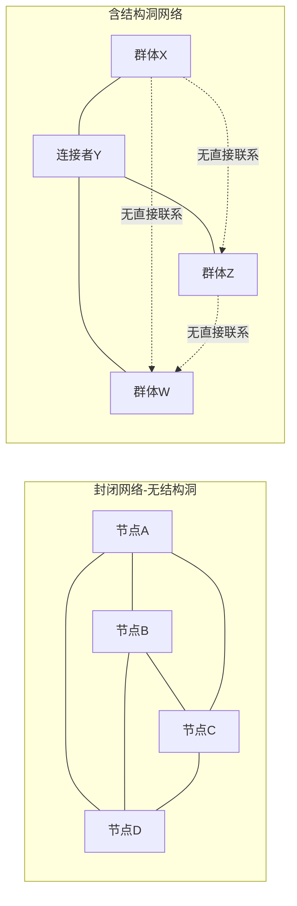

## 三、结构洞理论：连接者的价值

### 1. 概念解析：什么是结构洞

#### 1.1 理论起源

1992年，芝加哥大学社会学家罗纳德·伯特（Ronald Burt）在其开创性著作《结构洞：竞争的社会结构》（*Structural Holes: The Social Structure of Competition*）中提出了结构洞理论。这一理论的核心洞察简洁而深刻：**在社会网络中，谁占据了不同群体之间的空隙位置，谁就拥有了信息和控制的竞争优势。**

"结构洞"（Structural Holes）这个概念指的是：社会网络中两个彼此不直接联系的群体（或个人）之间的空隙。这个"洞"不是一个消极的断裂，而是一个积极的机会空间——谁架起了跨越这个洞的桥梁，谁就成了"连接者"或"经纪人"（Broker）。

#### 1.2 一个直觉化的类比

想象你参加一个大型晚宴，场内有三个小圈子在分别聊天：

```text
    【科技圈】          【投资圈】          【媒体圈】
    - 程序员            - 天使投资人        - 科技记者
    - 产品经理          - VC合伙人          - 自媒体博主
    - 技术总监          - FA顾问            - 行业分析师
         |                   |                   |
         |                   |                   |
         -------- 你（同时认识三方）--------
```

科技圈的人不认识投资圈的人，投资圈的人不认识媒体圈的人。这三个圈子之间的空隙就是"结构洞"。而你，如果同时和三个圈子都有联系，就占据了结构洞两端的关键位置——你就是那个"连接者"。

这带来三个直接优势：

1. **信息优势**：你比任何人都更早知道科技圈的新产品、投资圈的新基金、媒体圈的新渠道
2. **控制优势**：你可以选择性地传递信息，决定谁和谁对接，掌握资源分配的话语权
3. **位置优势**：你需要的资源分散在三个圈子中，但你不需要依赖任何一个圈子的内部连接

#### 1.3 结构洞 vs. 弱关系：两个经典理论的对比

很多读者会把结构洞理论和格兰诺维特（Granovetter）的弱关系理论混淆。两者确实有相似之处，但核心关注点不同：

| 维度 | 弱关系理论（Granovetter, 1973） | 结构洞理论（Burt, 1992） |
|------|------|------|
| 核心关注 | 关系强度对信息传播的影响 | 网络结构对竞争优势的影响 |
| 关键角色 | 弱关系桥梁人 | 结构洞经纪人 |
| 竞争优势来源 | 弱关系带来新信息 | 垄断信息流经的通道 |
| 分析单元 | 两个个体之间的关系 | 一个人在网络中的整体位置 |
| 理论层次 | 关系层面（dyadic） | 位置层面（positional） |
| 核心主张 | 弱关系比强关系更有信息价值 | 桥接不同群体比深耕同一群组更有战略价值 |
| 局限性 | 无法解释为什么有些弱关系更有价值 | 未充分考虑维持结构洞的成本 |

**关键区别**：弱关系理论告诉你"认识不同圈子的人很重要"，结构洞理论则精确告诉你"在不同圈子之间架桥的位置本身就有价值"。即使两个弱关系的强度相同，占据结构洞位置的那个关系价值更高，因为它提供了唯一的通道。

### 2. 核心原理：结构洞的三大机制

#### 2.1 信息利益（Information Benefits）

占据结构洞位置的人在信息获取上有三大优势：

**（1）信息通路（Access）**

连接者能比其他人更早、更多地获取信息。这些信息包括两个方面：

- **谁需要什么**：知道不同群体中谁有需求、谁有资源
- **什么即将发生**：知道不同群体中的计划、动向、变化

**实操案例**：在硅谷的科技行业，一个同时与创业者社区和风险投资圈保持联系的人，能在项目刚启动时就获知融资信息，比普通工程师提前数月知道行业趋势。

**（2）信息时效（Timing）**

连接者获取的信息不仅更多，而且更及时。当信息还在不同群体内部流转时，连接者已经知道了。在商业世界中，早一步获取信息往往意味着先发优势。

**（3）信息参考（Referrals）**

连接者能获得来自不同群体的推荐和背书。当一个投资圈的朋友向你推荐一个创业者，而这个创业者恰好是另一个朋友想找的CTO人选——你就是信息的聚合点。

#### 2.2 控制利益（Control Benefits）

连接者的第二个优势体现在对信息流的控制上：

**（1）第三方博弈优势（Third-Party）**

当你同时连接A和B两个不直接联系的群体时，你处于"第三方"的位置。这个位置赋予你以下能力：

- **选择性传递**：你可以决定什么信息传递、什么信息截留
- **议价优势**：A和B都需要通过你来接触对方，你在任何谈判中都有中间人议价权
- **声誉塑造**：你可以在A面前塑造B的印象，反之亦然

**（2）可替代性低（Non-substitutability）**

如果某个信息通道中只有你一座桥，你的不可替代性就极高。反之，如果A和B之间有10座桥，你作为其中一座的价值就大打折扣。

```text
【低替代性·高价值】            【高替代性·低价值】

  群体A --- 你 --- 群体B        群体A -- 你 -- 群体B
                              群体A -- 张三 -- 群体B
                              群体A -- 李四 -- 群体B
                              群体A -- 王五 -- 群体B
```

**（3）定义竞争规则**

最有权力的连接者不仅能传递信息，还能在一定程度上定义竞争规则。他们可以决定哪些人被介绍给哪些人，从而影响资源的流向。

#### 2.3 创意利益（Vision Benefits）

Burt在后期研究中补充了第三个利益维度——视野优势：

- **多元视角**：接触不同群体的人更容易看到事物的不同面向
- **创新灵感**：不同领域的知识碰撞更容易产生创新想法
- **跨界迁移**：一个领域中成熟的方案可以被迁移到另一个领域

**实证案例**：Burt对美国一家大型电子公司的供应链管理人员研究发现，那些在公司内部不同部门之间占据结构洞位置的员工，提出了更多被采纳的创新建议。这些"想法经纪人"的收入也比同等资历但位于封闭网络中的同事高出更高比例。

### 3. 结构洞的网络分析：如何识别和测量

#### 3.1 关键网络指标

要理解结构洞在网络中的位置，需要了解几个核心指标：

**（1）网络密度（Density）**

网络密度衡量一个群体内部成员之间的联系紧密程度。密度越高的群体，内部结构洞越少；密度越低，说明内部存在更多断裂点，连接者的机会越多。

**（2）中介中心性（Betweenness Centrality）**

这是衡量一个节点在多大程度上充当其他节点之间"桥梁"的指标。高中介中心性的节点往往占据了大量结构洞位置。

计算公式的核心思想：对于网络中任意两个不相邻的节点对(s,t)，计算经过当前节点v的最短路径占所有最短路径的比例，然后对所有(s,t)对求和。

**（3）有效规模（Effective Size）**

这是Burt专门设计来衡量结构洞的指标。一个节点的有效规模等于它的网络规模减去网络中的冗余联系。有效规模越大，说明该节点的网络中冗余越少，占据的结构洞越多。

**（4）效率（Efficiency）**

效率 = 有效规模 / 实际网络规模。效率接近1意味着大部分联系都是非冗余的（高质量连接）；效率接近0意味着大量联系是冗余的（低质量连接）。

**（5）限制度（Constraint）**

这是Burt提出的最核心的结构洞指标。限制度衡量一个节点受到网络约束的程度——限制度越高，说明该节点被嵌入在一个封闭的、冗余的网络中，可利用的结构洞越少；限制度越低，说明该节点拥有更多非冗余连接，占据更多结构洞。

#### 3.2 网络结构对比图

下图展示了两种截然不同的网络结构——封闭网络和含结构洞网络：



- **左侧封闭网络**：所有节点互相连接，没有结构洞，每个人获得的信息大致相同
- **右侧结构洞网络**：连接者Y同时连接三个互不相连的群体，占据了三个结构洞

#### 3.3 实操：绘制你的个人网络地图

要发现自己的结构洞机会，可以按以下步骤绘制个人网络地图：

**第一步：列出你认识的所有人（50-100人）**

按照以下维度分类：

| 维度 | 分类示例 |
|------|----------|
| 行业 | 互联网、金融、医疗、教育、制造业 |
| 功能 | 技术、市场、运营、财务、人力 |
| 层级 | 高管、中层、基层、自由职业者 |
| 地域 | 北京、上海、深圳、海外 |
| 兴趣 | 运动、读书、投资、旅行 |
| 认识渠道 | 同学、同事、行业活动、线上社区 |

**第二步：画出连接图**

用纸笔或工具（如 Kumu、Gephi、Obsidian Canvas）画出：
- 你认识的人之间的已有连接
- 标记哪些人彼此认识，哪些人不认识

**第三步：识别结构洞**

找出那些被你连接但彼此不连接的群体——这些就是你的结构洞机会。

**第四步：评估结构洞价值**

对每个结构洞问三个问题：
1. 这两个群体之间的信息差异有多大？（信息价值）
2. 如果你架起这座桥，能获得什么？（收益评估）
3. 维持这座桥需要什么成本？（维护成本）

### 4. 结构洞的实战应用

#### 4.1 职业发展中的结构洞策略

**场景一：内部晋升**

在企业内部，那些能连接不同部门的人往往晋升更快。具体策略：

- **跨部门项目**：主动申请需要与多个部门协作的项目
- **轮岗经历**：在职业生涯早期争取不同部门的轮岗机会
- **信息枢纽**：成为不同部门之间信息传递的关键节点

**场景二：创业**

创业者的结构洞位置至关重要：

| 创业阶段 | 结构洞策略 | 具体行动 |
|----------|------------|----------|
| 发现阶段 | 连接技术圈和用户圈 | 深入理解技术能力，同时贴近用户痛点 |
| 融资阶段 | 连接创业圈和投资圈 | 参加路演、进入创投社群 |
| 增长阶段 | 连接核心业务和上下游 | 建立供应链关系、行业联盟 |
| 退出阶段 | 连接产业资本和金融资本 | 对接并购方、上市顾问 |

**场景三：跳槽与转型**

当你想从行业A转到行业B时，最大的障碍不是能力，而是缺乏B行业的网络。结构洞策略是：

1. 找到同时认识A行业和B行业的人（现有的"桥"）
2. 通过他们认识B行业的关键人物
3. 逐步建立你在B行业的独立联系
4. 你本身就成了A-B之间的结构洞连接者

#### 4.2 商业合作中的结构洞策略

**（1）中介角色**

很多成功的商业模式本质上是在利用结构洞：

- **房产中介**：连接房东和租客/买家
- **猎头公司**：连接企业和人才
- **FA（财务顾问）**：连接创业者和投资人
- **翻译/本地化**：连接不同语言和文化的市场
- **系统集成商**：连接不同技术供应商和最终用户

**（2）供应链优化**

在供应链管理中，结构洞理论揭示了一个重要洞察：供应链中的核心企业往往不是生产规模最大的企业，而是连接最多上下游环节的企业。

**实操案例**：苹果公司自身不生产任何硬件，但它连接了芯片设计（ARM架构）、代工制造（富士康）、软件生态（开发者）、零售渠道（Apple Store）等多个互不直接联系的环节。苹果占据了整个供应链中最大的结构洞位置，因此获得了最大的控制权和利润。

#### 4.3 个人品牌建设中的结构洞策略

**跨界定位**

个人品牌建设中最强的定位策略之一就是"占据结构洞"——成为两个或多个领域的唯一连接点。

具体操作路径：

1. **选择两个互补但不重叠的领域**（例如：AI技术 + 教育、区块链 + 供应链管理、心理学 + 产品设计）
2. **在两个领域分别建立深度认知**（不需要每个领域都是顶尖，但需要达到专业水平）
3. **持续输出跨界内容**（写文章、做演讲、出课程，主题始终围绕两个领域的交叉点）
4. **成为两个领域之间的信息枢纽**（组织跨界活动、介绍两个领域的人互相认识）

**为什么这比"深耕单一领域"更有效**：在单一领域中，你面对无数竞争者；在跨界交叉点上，你的竞争者极少，甚至可能只有你一个。

#### 4.4 投资领域的结构洞应用

投资行业中，信息差就是利润来源。结构洞理论在投资中的应用：

**（1）信息套利**

连接不同信息圈的投资人能更早发现机会：

- **产业圈 + 投资圈**：了解行业真实状况，提前布局
- **学术圈 + 商业圈**：从学术论文中发现商业化机会
- **国内圈 + 海外圈**：发现国际市场的成熟模式，提前在国内布局

**（2）项目源拓展**

天使投资人和VC的核心竞争力之一是项目源。占据结构洞的投资人能接触到更多、更优质的项目：

- 不要只在投资圈混——去技术社区、创业者社群、高校实验室
- 你的非投资圈朋友越多，你接触到的"第一个电话"越多
- 最好的项目往往在被推荐给正式投资机构之前，先被结构洞连接者看到

### 5. 如何主动构建结构洞

#### 5.1 识别高价值结构洞

不是所有的结构洞都值得投资。评估一个结构洞的价值需要考虑：

| 评估维度 | 高价值结构洞 | 低价值结构洞 |
|----------|-------------|-------------|
| 信息差异 | 两个群体的信息高度不对称 | 两个群体的信息高度重叠 |
| 群体规模 | 两个群体都较大且活跃 | 两个群体都很小或不活跃 |
| 替代性 | 没有其他人在连接这两个群体 | 已经有很多人在连接 |
| 连接成本 | 你有条件自然地接触两个群体 | 需要大量额外投入才能维持 |
| 收益潜力 | 连接后可能产生合作/交易 | 连接后没有明显的协同效应 |

#### 5.2 五步构建结构洞的方法

**第一步：盘点现有网络**

列出你已有的人脉，按行业、功能、层级等维度分类。画出连接图，找出你已经占据的结构洞位置。

**第二步：发现目标结构洞**

基于你的职业目标和个人兴趣，确定你需要但尚未占据的结构洞位置。例如：
- 如果你是程序员，目标结构洞可能是"技术圈 ↔ 商业圈"
- 如果你是销售，目标结构洞可能是"客户行业圈 ↔ 供应商圈"
- 如果你是创业者，目标结构洞可能是"产品圈 ↔ 资本圈"

**第三步：找到入口人物**

每个你不熟悉的群体中，都需要一个"入口人物"——一个愿意引荐你进入这个群体的人。找到入口人物的方法：
- 通过现有的弱关系介绍
- 参加该群体的公开活动（行业会议、社群聚会）
- 在线上社区中先建立存在感（知乎、即刻、微信群）
- 主动提供价值（写该领域的文章、分享有用的资源）

**第四步：深耕连接质量**

不是加了微信就算建立了连接。高质量的结构洞连接需要：
- **定期互动**：不要只在需要帮助时才联系
- **提供价值**：分享信息、介绍人脉、提供帮助
- **建立信任**：信守承诺、保守秘密、不滥用信息优势
- **保持中立**：作为连接者，不要过度偏向任何一方

**第五步：持续维护和扩展**

结构洞需要维护，否则会因为其他连接的建立而消失：
- 定期盘点网络变化
- 发现新的结构洞机会
- 深化已有连接的信任度
- 及时发现并填补潜在的"桥断裂"风险

#### 5.3 结构洞维护的成本管理

占据结构洞是有成本的。Burt本人也承认，维持跨越多个群体的关系需要时间和精力。以下是成本管理策略：

**时间成本管理**：
- 不要试图同时维护太多结构洞——选择3-5个最有价值的
- 用内容输出（写文章、做分享）代替一对一维护，实现一对多
- 建立"结构洞助理"——培养团队中的其他人也成为连接者

**情感成本管理**：
- 连接不同群体可能带来角色冲突——A群体和B群体有矛盾时你怎么办？
- 建立明确的中立立场和信息管理规则
- 不要承诺你做不到的保密义务

**信任成本管理**：
- 结构洞连接者最大的风险是被视为"两面派"
- 保持信息传递的透明度——让双方知道你是连接者角色
- 不要利用信息不对称做损害任何一方的事

### 6. 结构洞理论的局限与批判

#### 6.1 "闭包优势"的挑战

社会学家詹姆斯·科尔曼（James Coleman）提出了与结构洞理论相对的观点——**网络闭包优势**（Network Closure Advantage）。他认为，高密度的封闭网络有其独特价值：

- **信任机制**：封闭网络中，成员之间相互监督，违约行为容易被发现，因此信任度更高
- **规范执行**：封闭网络更容易建立和执行共同的行为规范
- **合作效率**：已经建立信任关系的群体合作效率更高

**实际应用**：这不是"结构洞 vs. 闭包"的二选一，而是不同场景需要不同策略：

| 场景 | 最优网络结构 | 原因 |
|------|-------------|------|
| 创新和信息获取 | 结构洞 | 需要多元信息和新视角 |
| 高信任合作 | 闭包 | 需要信任和规范 |
| 创业初期 | 结构洞 | 需要信息和资源 |
| 团队执行 | 闭包 | 需要协调和配合 |
| 职业发展早期 | 结构洞 | 需要拓展视野和机会 |
| 深度合作项目 | 闭包 | 需要深度信任 |

#### 6.2 文化差异的考量

结构洞理论主要基于美国的社会网络研究。在不同文化背景下，其适用性有所不同：

- **高个人主义文化**（如美国、西欧）：结构洞优势更明显，个人在不同群体之间的游走受到鼓励
- **高集体主义文化**（如中国、日本）：过度强调结构洞可能被视为不忠诚或不靠谱。在中国的"关系"文化中，深度信任（闭包）往往比宽度覆盖（结构洞）更受重视
- **实用策略**：在中国的商业环境中，最佳策略往往是"闭包为体，结构洞为用"——在核心圈层保持高度信任关系，同时有策略地拓展跨圈层连接

#### 6.3 数字时代的新变化

社交媒体和互联网对结构洞理论产生了深刻影响：

**结构洞的"稀释效应"**：
- LinkedIn、微信等平台让建立连接变得更容易，但也让结构洞更容易被填补
- 以前需要亲自引荐才能认识的人，现在可以直接加微信
- 这降低了连接者的信息垄断优势

**新的结构洞形态**：
- **算法结构洞**：平台推荐算法创造了新的信息隔离——不同用户看到的内容完全不同
- **数据结构洞**：掌握数据的人拥有新型的结构洞优势
- **平台结构洞**：平台本身占据了用户和商家之间最大的结构洞位置

**数字时代的结构洞策略调整**：
- 从"认识人"转向"被人信任"——数量不重要，质量和信任度更重要
- 从"垄断信息"转向"整合信息"——信息本身不稀缺，能整合和解读信息的能力更稀缺
- 从"被动占据"转向"主动经营"——有意识地规划你的网络结构

### 7. 常见误区与纠偏

#### 误区一：广撒网就是构建结构洞

**错误做法**：疯狂参加各种社交活动，加了无数微信好友，但从不深入维护任何关系。

**纠偏**：结构洞的核心不是"认识多少人"，而是"占据了哪些不同群体之间的连接位置"。100个同一个圈子的朋友不如10个来自10个不同圈子的朋友。

**正确做法**：
- 先确定你需要连接的目标群体（不超过5个）
- 在每个群体中发展2-3个深度关系
- 确保不同群体之间确实存在信息不对称

#### 误区二：结构洞就是当"中间商赚差价"

**错误做法**：利用信息不对称两头吃——在A面前抬高B的价格，在B面前压低A的预期。

**纠偏**：这种做法短期内可能获利，但一旦被发现，你会同时失去A和B的信任。结构洞的长期价值在于"可信的连接者"角色，而非"信息倒卖者"。

**正确做法**：
- 做有道德的信息传递——帮助双方找到真正匹配的需求
- 主动减少信息不对称——告诉A关于B的真实情况，反之亦然
- 建立"值得信赖的连接者"声誉

#### 误区三：一旦占据了结构洞就可以高枕无忧

**错误做法**：建立了连接后不再维护，等别人主动来求你。

**纠偏**：结构洞是可以被填补的。如果你不持续维护连接，A和B迟早会通过其他方式直接建立联系，你的结构洞价值就会消失。

**正确做法**：
- 定期与结构洞两端的人互动
- 持续提供新的价值（信息、资源、机会）
- 不断发现和填补新的结构洞

#### 误区四：结构洞策略是"利用别人"

**错误做法**：把所有社交关系都视为工具，只在需要时才联系。

**纠偏**：健康的结构洞策略是互惠的——你在帮助不同群体的人互相连接的同时，也在为自己创造价值。如果只有你在获利，这个位置不可持续。

**正确做法**：
- 把"帮人连接"当作一种习惯，而非交易
- 关注双方的收益，而非只关注自己的收益
- 长期来看，"被信任的连接者"本身就是一种强大的社会资本

#### 误区五：所有人都应该追求结构洞位置

**错误做法**：强迫内向的人去大量社交、拓展跨圈层连接。

**纠偏**：不同性格、不同职业阶段、不同文化背景的人，最优的网络策略不同。有人适合当"连接者"，有人适合当"深度合作者"，这都是合理的策略选择。

**正确做法**：
- 评估你的性格特质是否适合大量跨圈层社交
- 考虑你的职业目标是否需要结构洞优势
- 如果不适合，专注于少数几个高质量的深度关系可能是更好的策略

### 8. 进阶专题：结构洞与社会流动性

#### 8.1 结构洞与社会阶层

Burt的研究揭示了一个不太舒适的现实：**结构洞的占据与社会阶层高度相关**。

- 高阶层人群天然拥有更多跨圈层的社交机会
- 低阶层人群的社交网络往往更同质化（同一阶层、同一社区）
- 这种网络结构的差异会进一步放大阶层差距

**实操启示**：如果你处于社会流动性较低的位置，主动构建结构洞可能是打破阶层壁垒最有效的策略之一。具体做法：
- 参加跨阶层的活动（行业峰会、公益组织、创业社区）
- 利用互联网平台接触不同圈层的内容和人群
- 找到你的"升维入口人物"——已经在一个更高圈层但愿意带你进入的人

#### 8.2 结构洞与组织设计

对于企业管理者，结构洞理论有重要的组织设计启示：

**组织内部的结构洞问题**：

- **信息孤岛**：部门之间缺乏沟通，形成大量内部结构洞
- **解决方案**：设立跨部门角色（如PM、BD），或定期组织跨部门交流活动
- **平衡**：过度消除结构洞会导致组织失去创新活力；适度保留结构洞，同时确保关键信息能顺畅流动

**团队组建中的结构洞应用**：

- 在组建团队时，优先选择拥有不同社交网络的成员
- 团队成员之间的网络重叠度越低，团队获取外部信息的能力越强
- 但同时要确保团队内部有足够的信任和沟通机制（闭包优势）

### 9. 工具与资源推荐

#### 9.1 网络分析工具

| 工具名称 | 用途 | 特点 |
|----------|------|------|
| Gephi | 复杂网络可视化分析 | 开源、功能强大、支持大规模网络 |
| Kumu | 交互式关系地图 | 在线工具、适合个人使用 |
| Obsidian | 知识图谱 | 本地化、结合笔记管理 |
| LinkedIn Maps | 职业社交网络可视化 | 直观展示你的职业网络结构 |
| NodeXL | Excel插件式网络分析 | 适合非技术用户 |

#### 9.2 经典阅读材料

**必读**：
- Ronald Burt《结构洞：竞争的社会结构》（*Structural Holes*, 1992）——理论奠基之作
- Ronald Burt《经纪人与闭合》（*Brokerage and Closure*, 2005）——补充了闭包优势的讨论
- Mark Granovetter《弱关系的力量》（*The Strength of Weak Ties*, 1973）——结构洞理论的前置理论

**拓展阅读**：
- Nicholas Christakis & James Fowler《大连接》（*Connected*, 2009）——社会网络如何影响行为
- Albert-László Barabási《链接》（*Linked*, 2002）——网络科学入门经典
- 社会网络分析（SNA）相关学术论文

#### 9.3 实践社群

- **LinkedIn结构洞分析群组**：搜索"structural holes"或"social network analysis"
- **即刻/知乎相关话题**：搜索"结构洞"、"社会资本"、"人脉经营"
- **行业交流会**：参加你所在行业的跨界交流活动，是构建结构洞最直接的方式

### 10. 本章小结

结构洞理论揭示了一个深刻的道理：**在社会网络中，你的位置比你的能力更决定你的竞争力。** 不是说能力不重要，而是说相同能力的人，占据不同网络位置，获得的回报可能天差地别。

**核心要点回顾**：

1. **结构洞是不同群体之间的空隙**——谁架起桥梁，谁就拥有信息、控制和视野三大优势
2. **不是所有结构洞都有价值**——要评估信息差异、群体规模、替代性和维护成本
3. **结构洞需要主动构建和维护**——不会自动出现，也不会自动保持
4. **结构洞和闭包是互补策略**——不同场景需要不同的网络结构
5. **数字时代改变了结构洞的形态**——但"可信的连接者"价值从未减弱
6. **长期价值来自信任，而非信息垄断**——做连接者，不做信息倒卖者

**行动清单**：

- [ ] 绘制你的个人网络地图，识别已有的结构洞位置
- [ ] 确定2-3个最有价值的目标结构洞位置
- [ ] 为每个目标结构洞找到入口人物
- [ ] 制定每月的网络维护计划（谁、什么方式、什么频率）
- [ ] 选择1个跨界领域开始输出内容，建立你的"连接者"品牌
