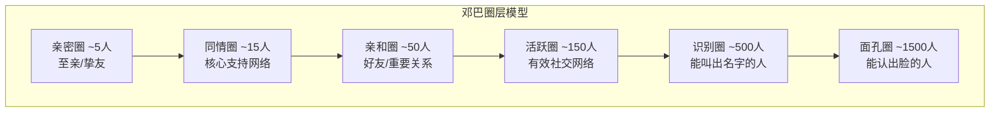
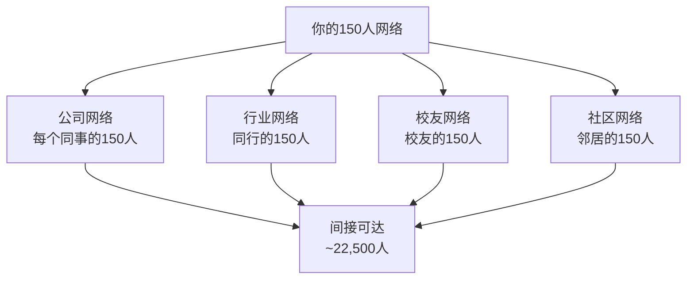

## 四、邓巴数与人脉管理

你可能有过这样的经历：打开微信通讯录，发现有上千个联系人，但真正在关键时刻能打电话求助的不超过20个。这不是你的社交能力有问题——这是人类大脑的硬性认知限制。1992年，英国人类学家罗宾·邓巴（Robin Dunbar）通过研究灵长类动物的新脑皮层体积与社会群体规模的关系，发现人类能够维持稳定社交关系的上限约为150人。这个数字后来被称为"邓巴数"（Dunbar's Number），它从根本上揭示了人脉管理的底层逻辑：**不是认识的人越多越好，而是每一层关系都需要被精确管理和投入**。

### 4.1 邓巴数的科学基础

#### 4.1.1 社会脑假说

邓巴数的理论根基是"社会脑假说"（Social Brain Hypothesis）。该假说认为，灵长类动物的新脑皮层（neocortex）体积与其社会群体规模之间存在显著的正相关关系。邓巴在1992年发表于《人类进化杂志》（*Journal of Human Evolution*）的论文中，通过对38种灵长类动物的数据分析，建立了一个回归模型：

```text
log(群体规模) = 0.093 + 3.395 × log(新脑皮层比率)
```

其中，新脑皮层比率 = 新脑皮层体积 / 大脑其余部分体积。

将人类的新脑皮层比率代入这个模型，得出的预测群体规模约为148人，四舍五入即为150——这就是邓巴数的来源。

#### 4.1.2 大脑为什么有上限

维持一段社交关系需要大量的认知资源。具体来说，大脑需要处理以下信息：

| 认知任务 | 具体内容 | 所需资源 |
|----------|----------|----------|
| 身份识别 | 记住对方的名字、外貌、身份 | 长期记忆存储 |
| 关系历史 | 记住与对方的交往经历、承诺、恩怨 | 情景记忆检索 |
| 心智理论 | 推断对方的想法、情绪、意图 | 前额叶皮层计算 |
| 社交规范 | 知道在不同人面前该说什么、不该说什么 | 社会规则引擎 |
| 关系动态 | 感知关系的变化——亲疏远近的微调 | 持续监控系统 |

这些任务全部由新脑皮层负责。新脑皮层的体积是有限的，因此能同时维护的活跃社交关系也是有限的。这就像电脑的内存——你可以有无限的硬盘存储（认识无数人），但同时运行的程序（活跃关系）受到RAM的硬性限制。

#### 4.1.3 验证与争议

邓巴数提出30多年来，经历了大量的验证和挑战：

**支持证据：**

- **军事组织**：从罗马军团到现代军队，基本作战单位的规模（连级约150人）与邓巴数高度吻合。这不是巧合——超过150人的单位必须拆分，否则指挥官无法与每个士兵建立直接的信任关系。
- **企业规模**：Gore-Tex公司（W. L. Gore & Associates）刻意将每个工厂的人数控制在150人以内。当规模超过150人时，他们拆分为新工厂。这家连续数十年被评为"最佳雇主"的公司，其管理哲学的底层逻辑正是邓巴数。
- **社交媒体**：2016年邓巴团队分析Twitter数据发现，尽管用户可能有数千个"关注者"，但他们频繁互动的对象中位数约为100-200人，与邓巴数一致。
- **圣诞贺卡研究**：邓巴分析英国人寄送圣诞贺卡的习惯，发现每个家庭平均寄送给约154人——这154人代表了他们最核心的社交网络。
- **历史村落**：对新石器时代村落遗址的考古研究表明，典型定居点的人口规模也在150人左右。

**争议与修正：**

- **文化差异**：2021年邓巴团队的新研究发现，在更平等的社会中（如小规模狩猎采集社会），邓巴数可能更低，约在100-150之间；在更不平等的社会中，某些个体可能维持更大的网络。
- **个体差异**：内向者与外向者的实际社交网络规模存在显著差异。邓巴本人也承认150是一个平均值，个体范围可能在100-250之间。
- **关系质量**：批评者指出，"维持关系"的定义模糊——你与微信好友的"关系"和与发小的"关系"完全不同。邓巴数更适用于"你知道这个人是谁，并且在过去两年内有过某种互动"的关系。

### 4.2 邓巴的圈层模型：从5到1500

邓巴数不是单一的150这个数字，而是一组嵌套的同心圆，每一层都有特定的认知和社会功能：



#### 第一层：亲密圈（~5人）

这是你人生中最核心的5个人。通常是伴侣、父母、子女中最亲近的人，或者1-2个至交好友。这一层的特征是：

- **无条件信任**：你可以在凌晨3点打电话给他们，不用担心被拒绝
- **情感同频**：你们的情绪状态会直接影响彼此——他们难过你也会难过
- **高频率互动**：每周多次深度交流，而非表面寒暄
- **认知成本最高**：维护这一层的关系需要最大的情感投入和注意力
- **代偿效应**：研究表明，失去一个亲密圈成员（离婚、去世）带来的心理创伤，相当于失去整个150人网络

**管理要点**：亲密圈是最脆弱的。它不像其他圈层可以替换——失去一个亲密圈成员需要数年才能有新的替补。因此，亲密圈管理的核心是"防损"而非"扩展"。

#### 第二层：同情圈（~15人）

这15人是你真正的"社交安全网"。当你遇到困难（失业、疾病、情感危机），你会主动向他们求助。这一层的特征是：

- **双向义务感**：你们之间存在隐性的互助契约
- **情感支持**：他们会在你困难时提供实质帮助，而非仅仅是安慰
- **定期维护**：至少每月一次有质量的互动（见面、通话、深度消息）
- **社会仪式参与**：他们会参加你的婚礼、葬礼、重要人生仪式

**数据支撑**：邓巴团队的追踪研究发现，如果一个同情圈成员超过6个月没有任何互动，这个关系有很大概率会"下沉"到下一个圈层（从15人层掉到50人层），而且这种下沉几乎不可逆。

#### 第三层：亲和圈（~50人）

这50人是你愿意邀请到家里参加生日聚会或大型烧烤的人。他们是"好朋友"——你会主动关心他们的近况，但不会在深夜崩溃时第一个想到他们。

- **社交愉悦**：与他们在一起你感到放松和愉快
- **互利互惠**：你们可能互相介绍资源、机会、信息
- **季度维护**：至少每3个月一次互动才能维持在这一层
- **领域多样性**：这一层通常包含来自不同生活领域的面孔——前同事、大学同学、邻居、行业同行

#### 第四层：活跃圈（~150人）

这是邓巴数的核心——150人的有效社交网络。你知道他们是谁，记得你们之间的关系历史，在社交场合遇到他们会愉快地打招呼。

- **最低互动频率**：至少每年一次有意义的互动（不只是朋友圈点赞）
- **弱关系价值**：根据社会学家格兰诺维特（Mark Granovetter）的"弱关系的力量"理论，这一层往往是信息和机会的主要来源
- **流动性**：这一层的人在不断进出——每年约有20-30%的更替率
- **社会资本基础**：大部分"你能请到帮忙"的人脉都在这一层

#### 第五、六层：识别圈（~500人）与面孔圈（~1500人）

- **500人层**：你能在街上认出他们并叫出名字，但对他们的近况一无所知
- **1500人层**：你认识这张脸，但可能叫不出名字或想不起在哪里见过
- **价值**：这两层是"弱关系的弱关系"，主要价值在于社交场合的信号传递——比如在某个活动上你能认出20个人，比完全陌生的环境会更有信心

#### 圈层动态：关系的升降机制

圈层不是静态的。关系会在不同层级之间移动：


**关键洞察：关系升级（向上）比降级（向下）难10倍**。从150层升到50层可能需要6-12个月的持续投入；但从50层降到150层只需要6个月的疏忽。这解释了为什么很多人"认识很多人但没有真正的朋友"——他们忙于在150层做广度扩展，没有投入精力将关系升级到更核心的圈层。

### 4.3 基于邓巴数的人脉管理实操框架

理解了邓巴数的科学基础，接下来的关键问题是：如何将这个理论转化为可执行的人脉管理策略？

#### 4.3.1 第一步：盘点你的社交网络

拿出一张纸（或打开电子表格），将你当前的社交关系按照邓巴的圈层分类：

| 圈层 | 目标人数 | 你的当前人数 | 差距 | 行动 |
|------|----------|------------|------|------|
| 亲密圈 | 3-5人 | ?人 | ? | 防损维护 |
| 同情圈 | 10-15人 | ?人 | ? | 深化投入 |
| 亲和圈 | 30-50人 | ?人 | ? | 定期互动 |
| 活跃圈 | 100-150人 | ?人 | ? | 筛选优化 |
| 识别圈 | 300-500人 | ?人 | ? | 保持联络 |

**盘点的实操方法：**

1. **翻看过去3个月的通讯记录**：谁给你打过电话？你给谁打过电话？微信/WhatsApp上谁的聊天记录最多？
2. **回忆过去6个月的线下见面**：你见过哪些人？频率如何？
3. **危机测试**：如果你明天遇到重大困难（需要10万元、需要法律帮助、需要情感支撑），你会打给谁？这些人就是你的同情圈。
4. **反向测试**：谁会第一个打给你？这些人可能比你以为的更信任你。

#### 4.3.2 第二步：优化圈层结构

大多数人的圈层结构存在以下典型问题：

**问题一：150层过于臃肿**

你的微信通讯录可能有1000+联系人，但其中大量是"僵尸关系"——加了微信后再也没说过话的人。这些僵尸关系会消耗你的认知资源（看到朋友圈时的信息处理成本），并给你虚假的社交安全感。

**解决方案：定期清理150层。** 每6个月做一次"社交断舍离"：

- 过去12个月没有任何互动的人 → 从活跃圈移除
- 已经不在同一行业/城市/生活阶段的人 → 降级到识别圈
- 价值观严重冲突或已产生负面情绪的人 → 主动断开

**问题二：5层和15层过于薄弱**

很多人把大量时间花在扩展500层（参加各种行业活动、加微信），却忽略了最核心的5人和15人圈层。结果是：微信好友3000人，但深夜崩溃时不知道打给谁。

**解决方案：核心圈层投资策略**

- **每周固定时间**：与亲密圈成员保持每周至少1次深度对话
- **每月固定活动**：与同情圈成员保持每月至少1次见面或长通话
- **关键时刻在场**：当核心圈层的人遇到大事（生病、搬家、换工作），一定要在场——哪怕只是一通电话

**问题三：圈层结构单一**

如果你的150人全部是同一行业、同一城市、同一背景的人，你的社交网络虽然深度够但广度不足。格兰诺维特的弱关系理论告诉我们，最有价值的信息和机会往往来自不同圈层的人。

**解决方案：刻意制造多样性**

- 跨行业社交：至少加入1-2个与你主业无关的社群
- 跨年龄社交：保持与比你大10岁和小10岁的人的联系
- 跨阶层社交：保持与不同社会经济背景的人的联系

#### 4.3.3 第三步：建立维护节奏

不同圈层需要不同的维护频率和方式：

| 圈层 | 最低互动频率 | 最佳维护方式 | 信息工具 |
|------|------------|------------|----------|
| 5人亲密圈 | 每天/隔天 | 面对面、电话、深度消息 | 直接沟通 |
| 15人同情圈 | 每月1次 | 聚餐、长电话、共度事件 | 日历提醒 |
| 50人亲和圈 | 每季度1次 | 聚会、群聊、行业活动 | CRM/通讯录标签 |
| 150人活跃圈 | 每年1次 | 社交媒体互动、节日问候、偶遇 | 社交管理工具 |
| 500人识别圈 | 每2-3年 | 点赞、转发、偶遇打招呼 | 自然流动 |

**维护的黄金法则：**

1. **主动原则**：不要等别人联系你。每个周一早上花15分钟，给3-5个需要维护的关系主动发一条消息。不需要长篇大论，一句"最近怎么样？上次你说的那件事进展如何？"就够了。
2. **价值原则**：每次互动都要创造价值。分享一篇对方可能感兴趣的文章、介绍一个对对方有用的人、提醒一个对方可能不知道的机会。
3. **仪式原则**：生日、升职、搬家、孩子出生——这些人生节点是维护关系的最佳时机。提前在日历上标记，当天送上真诚的祝福（不是群发的那种）。
4. **帮助原则**：当别人向你求助时，如果条件允许就尽量帮忙。人脉的本质是"情感账户"——你存得越多，需要时能取的也越多。

#### 4.3.4 第四步：数字化管理工具

在数字化时代，手动管理150人的社交网络已经不现实。以下是几种常用的管理方式：

**基础方案：通讯录标签系统**

在微信/手机通讯录中，为联系人打标签：

```text
标签体系示例：
├── 圈层标签
│   ├── 核心-5（亲密圈）
│   ├── 核心-15（同情圈）
│   ├── 好友-50（亲和圈）
│   └── 活跃-150（活跃圈）
├── 领域标签
│   ├── 技术
│   ├── 商务
│   ├── 生活
│   └── 兴趣
└── 来源标签
    ├── 校友
    ├── 前同事
    ├── 行业活动
    └── 朋友介绍
```

**进阶方案：CRM工具**

对于社交网络特别庞大或需要系统化管理人脉的人（如销售、创业者、投资人），可以使用专业CRM工具：

- **个人版CRM**：如 Monica（monica.cm）、Dex（getdex.com）——专为个人关系管理设计，可以记录每次互动、设置提醒、追踪关系状态
- **Notion/飞书多维表格**：自建人脉数据库，字段包括：姓名、圈层、领域、上次互动时间、下次提醒时间、关系动态
- **微信标签+日历组合**：低成本方案——在微信中打标签，在日历中设置定期提醒

**自动化策略示例（基于日历）：**

```text
每月第1个周一：检查5人亲密圈，确保本周有互动
每月第2个周一：检查15人同情圈，安排本月见面
每月第3个周一：检查50人亲和圈，发送季度问候
每季度末：全面盘点150人活跃圈，清理僵尸关系
```

### 4.4 邓巴数在不同场景的应用

#### 4.4.1 职场人脉管理

在职场中，邓巴数的应用尤为关键：

- **向上管理**：你的直属上级和上级的上级，应该在你的15人圈层。他们对你的职业发展有直接影响。
- **跨部门联盟**：每个相关部门的关键人物，应该在你的50人圈层。
- **行业网络**：同一行业但不同公司的同行，应该在你的150人圈层。
- **猎头与HR**：保持5-10个活跃的猎头/HR联系人，即使不跳槽也要定期互动。

**案例：硅谷工程师的职场人脉策略**

某硅谷高级工程师的圈层管理策略：
- 5人层：CTO（导师关系）、2个核心搭档、妻子、大学挚友
- 15人层：5个直接下属、3个跨部门合作伙伴、4个行业好友、3个家人
- 50人层：20个前同事、15个行业同行、10个开源社区伙伴、5个猎头
- 150人层：GitHub上活跃互动的开发者、行业大会认识的人、校友网络

他的维护方式：每周与5人层至少通话1次，每月与15人层聚餐2-3次，每季度与50人层中10人线上交流，每年参加3-4个行业大会维护150人层。

#### 4.4.2 创业者的社交资本构建

创业者需要比普通人更大的活跃网络，但仍然受邓巴数限制。解决方案是**分工协作**：

- 创始人负责维护15人核心圈（投资人、联合创始人、关键客户）
- 商务负责人负责扩展150人活跃圈（合作伙伴、渠道、媒体）
- 团队成员各自维护自己的150人网络，通过公司品牌聚合

**案例：YC孵化器的网络效应**

Y Combinator之所以强大，本质上是将数千创业者的150人网络通过校友关系连接起来。每个YC校友的150人网络中都包含其他YC校友，形成了一个远超单人邓巴数的超级网络。

#### 4.4.3 社交媒体时代的新挑战

社交媒体给人一个错觉：你可以维持无限的社交关系。但研究反复证明，即使在社交媒体上，人类依然遵循邓巴数的限制：

- **Facebook研究**（2011年，Facebook数据团队）：用户的平均好友数为150人（与邓巴数一致），即使好友列表上千人。
- **Twitter研究**（2016年，邓巴团队）：用户频繁互动的账号中位数约为100-200人。
- **微信研究**：腾讯研究院的数据显示，中国微信用户的平均"经常联系人"数量为128人。

**社交媒体的双刃剑效应：**

| 正面影响 | 负面影响 |
|----------|----------|
| 降低弱关系维护成本（点赞=低成本互动） | 给人虚假的社交富足感 |
| 帮助维持地理上远距离的关系 | 挤占了深度关系的维护时间 |
| 提供了更多认识新人的渠道 | "社交媒体好友"≠真正的朋友 |
| 信息传播更高效 | 信息过载导致注意力碎片化 |

**应对策略：** 使用社交媒体扩展150层的入口，但核心的5人、15人、50人圈层必须通过线下互动来维护。社交媒体无法替代面对面的深度交流。

### 4.5 邓巴数的局限性与现代修正

#### 4.5.1 理论局限

1. **关系定义模糊**：邓巴数定义的"社交关系"标准是"在过去两年内有过某种互动"。但"互动"的定义太宽泛——朋友圈点赞和促膝长谈都算互动，但它们对关系的维护效果天差地别。
2. **文化差异**：邓巴数主要基于西方社会的研究。在东亚文化中，人际关系的结构和维护方式有所不同——比如中国的"关系"文化强调的是义务网络而非情感网络。
3. **个体差异**：150是一个统计平均值。研究表明，外向者的社交网络可能达到200-250人，而内向者可能只有80-100人。强迫一个内向者维护150人的活跃网络，效果可能适得其反。
4. **年龄效应**：年轻人（20-30岁）的社交网络通常更大更活跃，而中年以后会自然收缩。这不是衰退，而是大脑对社交投入的优化。

#### 4.5.2 现代修正

2021年，邓巴本人在《社会网络》（*Social Networks*）杂志上发表了一篇重要论文，对原始理论做了修正：

- **关系是多维度的**：同一个150人网络中，不同的人在不同维度（情感支持、信息交换、实际帮助、社交陪伴）上占据不同的位置。
- **核心圈层更稳定**：5人和15人圈层的人员变动远小于50人和150人圈层。失去一个5人层成员平均需要5年才能补充；失去一个150人层成员可能在几周内就被新人替代。
- **双向认知**：邓巴数衡量的是你认为的社交网络，但对方可能不这样认为。你的150人网络和对方的150人网络的重叠部分，才是真正的"有效社交网络"。

### 4.6 常见误区与纠正

#### 误区一："认识的人越多越好"

**真相**：超过150人的社交网络中，多出来的关系要么是僵尸关系（消耗认知资源但无实际价值），要么是质量极低的表面关系。一个精心维护的100人网络，远比一个疏于管理的500人网络更有价值。

**纠正方法**：停止盲目参加社交活动加微信。每次认识新人后，问自己：这个人值得被纳入我的150层吗？如果答案是否定的，不必投入维护精力。

#### 误区二："关系不需要刻意维护"

**真相**：社交关系有自然衰减周期。邓巴团队的研究发现，如果不主动维护，一段关系大约以每年30%的速度降级——150层的关系约3-4年就会自然消失。

**纠正方法**：像管理投资组合一样管理社交关系。设置定期检查点（如每季度盘点一次），确保核心圈层得到足够投入。

#### 误区三："社交媒体上的互动=真正的社交"

**真相**：社交媒体上的点赞、评论是一种"社交零食"——它给你社交的满足感，但营养不足。研究显示，线上互动能维持关系不继续衰减，但无法推动关系升级。

**纠正方法**：如果一个关系只存在于线上，把它视为"休眠关系"。要激活它，必须有至少一次线下见面或深度通话。

#### 误区四："人脉管理=功利主义"

**真相**：健康的人脉管理不是把人当作工具，而是确保你在有限的认知资源下，投入到最值得的关系中。就像你不会觉得"定期锻炼身体"是功利主义一样，定期维护社交关系也不是。

**纠正方法**：将人脉管理理解为"社交健康"的一部分，而非"社交利用"。目标不是从别人身上获取价值，而是构建一个在你需要时能提供支持的关系网络。

#### 误区五："邓巴数意味着不能认识超过150人"

**真相**：你可以认识1000人、5000人，但你只能与其中约150人维持"有效社交关系"。多出来的人不是没有价值——他们构成了你的"识别圈"和"面孔圈"，在特定场景下（如行业活动、求职）仍然有用。

**纠正方法**：不要限制自己认识新人的速度，但要有意识地控制进入150层的门槛。只有通过了"价值筛选"的关系才值得被纳入活跃圈。

### 4.7 进阶：构建超越邓巴数的社交架构

虽然个人受邓巴数限制，但通过组织化策略，可以突破个人认知的天花板：

#### 4.7.1 网络嵌套策略

将自己的150人网络嵌入更大的网络结构中：



通过精心选择你150人网络中的"桥梁人物"（在不同圈子中都有连接的人），你可以间接触达远超150人的网络。

#### 4.7.2 桥梁人物的价值

格兰诺维特的"弱关系的力量"理论指出：最有价值的社交连接往往不是你的密友（他们和你信息同质化），而是那些连接不同圈子的"桥梁人物"。

**识别你的桥梁人物：**

- 谁同时认识你行业里的人和行业外的人？
- 谁同时认识你的工作圈和生活圈？
- 谁在你的社交网络中连接了两个原本不相连的群体？

**培养桥梁关系：**

- 主动成为别人的桥梁（介绍不同圈子的人互相认识）
- 珍视已有的桥梁人物，确保他们在你的50人或150人圈层
- 定期评估：你的社交网络是否存在"孤岛"——某个圈子完全与其他圈子不相连

#### 4.7.3 社交网络健康度评估

每隔一段时间（建议每半年），对你的社交网络进行一次全面评估：

| 评估维度 | 健康标准 | 警告信号 |
|----------|----------|----------|
| 圈层完整性 | 5/15/50/150各层人数合理 | 某一层严重缺失或臃肿 |
| 关系多样性 | 涵盖工作、生活、兴趣、社区 | 所有关系来自同一领域 |
| 维护投入 | 核心圈层得到足够时间投入 | 所有时间花在150层扩展 |
| 双向性 | 关系是互惠的 | 单方面付出或单方面索取 |
| 更新率 | 每年约20-30%自然更新 | 多年不变或变动过快 |
| 深度分布 | 有足够数量的深度关系 | 全是浅层关系，无深度连接 |

### 4.8 总结

邓巴数告诉我们一个反直觉但深刻的真相：**社交的极限不在于你能认识多少人，而在于你的大脑能同时维护多少段有效关系**。与其追求通讯录的膨胀，不如把有限的认知资源精准投入到每一层关系中：

1. **保护好你的5人圈**——这是你人生的锚点，失去任何一个都需要数年才能修复
2. **定期投资你的15人圈**——这是你的社交安全网，关键时刻能接住你
3. **有策略地经营你的50人圈**——这是你社交生活的核心，决定了你的日常体验
4. **优化你的150人圈**——这是你社会资本的基础，但要学会断舍离
5. **接受邓巴数的限制**——不要试图突破大脑的硬性上限，而是学会在限制内做最优配置

> 邓巴本人说过："维持一段关系需要时间和精力。如果你把时间花在维护大量浅层关系上，你就没有时间去深化那些真正重要的关系。选择，比努力更重要。"
