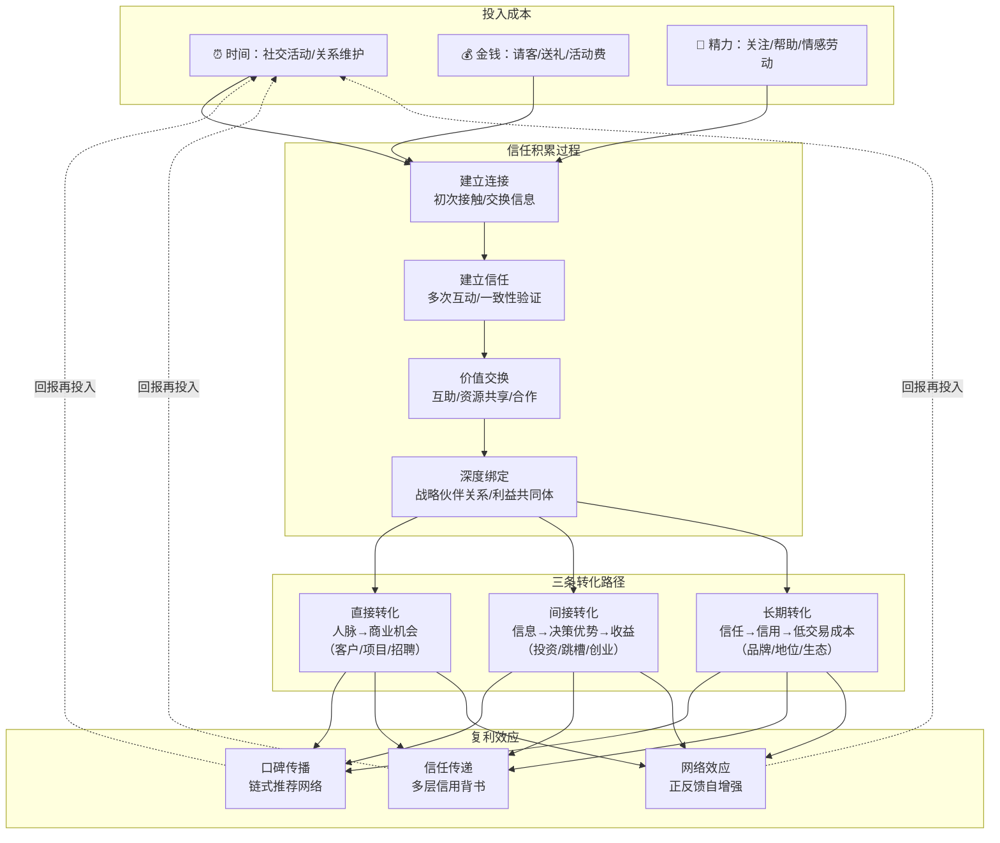

## 五、社会资本的回报率

上一节我们讨论了邓巴数——人脉网络的规模上限。但人脉数量只是表面指标，真正决定社交资本价值的是**回报率**：你投入的每一份时间、金钱和精力，最终能转化成多少实际收益。

这个问题之所以重要，是因为社交活动的投入和产出往往不对称。有人花大量时间参加饭局，收获的只是几条微信好友；有人只花很少时间维护关键关系，却获得了改变命运的机会。理解社会资本的回报率，本质上是在回答一个问题：**如何用最少的社交投入，获得最大的人生回报？**

### 5.1 社交投资的回报模型

社交资本的经营可以类比为金融投资。和金融投资一样，社交投资也有明确的投入成本和产出回报，但其计量方式比金融投资复杂得多。

#### 投入成本的三个维度

**时间成本**是社交投资中最昂贵、也最容易被忽视的资源。参加一场行业沙龙需要半天，加上交通、准备和后续跟进，实际消耗可能达到一整天。根据"一万小时定律"的逻辑推演：如果你每周花10小时进行社交活动，一年就是520小时，十年就是5200小时——几乎相当于培养一项专业技能所需时间的一半。这意味着，社交投资的时间成本本质上是一种**机会成本**：这些时间如果投入到学习或工作中，同样会产生回报。

**金钱成本**包括直接支出和间接支出。直接支出很好理解：请客吃饭、送礼、参加付费活动、购买会员等。间接支出则容易被忽略——为参加社交活动而购置的服装、出行的交通费、甚至因为社交而放弃的加班收入。据统计，中国职场人每年在社交活动上的直接花费平均在5000-20000元之间，但加上间接成本后，实际数字可能翻倍。

**精力成本**是最隐性的投入。维护一段关系需要持续的情感劳动：记住对方的生日、关注对方的动态、在对方需要时提供帮助。心理学研究表明，维持一段中等亲密程度的友谊大约需要每周投入2小时的高质量互动时间。如果你有100个需要维护的关系，理论上每周需要200小时——这显然不可能。这就是为什么精力管理比时间管理更重要。

#### 产出回报的三个层次

**信息价值**是社交投资最直接的回报。在信息不对称的商业世界中，提前获知行业趋势、政策变化、市场机会，往往意味着巨大的竞争优势。例如，一位投资人通过朋友提前了解到某公司正在寻求融资，比公开渠道早了三个月，这个时间差足以让他获得更好的投资条款。信息价值的特点是**时效性强、不可储存**——一条今天值百万的信息，明天可能一文不值。

**机会价值**是社交投资的核心回报。工作机会、合作机会、投资机会、客户推荐——这些直接转化为经济收益的机会，是大多数人进行社交投资的根本动力。LinkedIn的数据显示，全球约70%的工作机会从未公开发布，而是通过人脉网络内部消化。在中国，这个比例可能更高。这意味着，如果你只依赖公开招聘渠道，你看到的只是冰山一角。

**支持价值**是最容易被低估的回报。情感支持帮助你在低谷期保持心理健康；资源支持（借用设备、推荐人才、提供场地）节省你的直接开支；背书支持（为你担保、推荐、背书）降低别人与你合作的信任成本。一个有力的背书，可能让你的商业谈判从零信任起步，直接跳到初步信任阶段，节省数月的验证时间。

### 5.2 社交投资的复利效应

复利是爱因斯坦口中的"世界第八大奇迹"。在社交资本领域，复利效应同样显著，但表现形式与金融复利不同。

#### 社交复利的运作机制

金融复利的公式是 A = P(1+r)^n，其中 P 是本金，r 是利率，n 是时间。社交复利的逻辑类似，但变量不同：**P 是你初始帮助他人的价值，r 是关系质量系数，n 是关系持续的时间。**

关键区别在于：金融复利的利率通常是固定的，而社交复利的回报率是**非线性的、不可预测的**。你今天帮助一个看似普通的人，五年后他可能成为某家公司高管，给你带来一个千万级的项目。这种"黑天鹅式回报"在社交领域并不罕见。

具体来说，社交复利通过三个机制产生指数级增长：

**机制一：口碑传播的链式反应。** 你帮助了A，A向B推荐了你，B又向C推荐了你——每一次推荐都会带来新的连接，形成链式反应。假设你每月深度帮助一个人，每个人会向2个新朋友推荐你，那么一年后你的潜在推荐网络规模是 2^12 = 4096 人。当然实际数字会打折扣，但指数增长的趋势是真实的。

**机制二：信任的多层传递。** 社会学研究表明，信任可以通过关系网络传递。你的好友A信任你，A的好友B信任A，那么B对你也会有初步的信任基础（虽然比A对你的信任弱）。这种"弱信任"在商业场景中价值巨大——它让你在见一个陌生人之前，就已经获得了某种程度的信用背书。

**机制三：网络效应的正反馈。** 当你的社交网络达到一定规模后，会产生自增强效应：网络越大，对每个节点的价值越高，就越能吸引新节点加入，形成正反馈循环。这就是为什么很多成功人士的社交资本增长曲线呈现"先慢后快"的特征。

#### 复利效应的案例

雷军在创办小米之前，花了近20年时间积累社交资本。他在金山时期帮助过大量程序员和创业者，不求回报地提供技术指导和投资建议。当他创办小米时，这些人脉网络成为了小米最早的支持者和传播者——他们不仅成为小米的种子用户，还主动向自己的社交网络推荐小米产品。这种基于信任关系的口碑传播，为小米节省了数亿元的广告费用。

查理·芒格说过："如果你想获得某样东西，最可靠的方式是让自己配得上它。"这句话用在社交投资上尤为贴切：如果你想获得高质量人脉的回报，最可靠的方式是先成为别人眼中高价值的人。

### 5.3 社交资本的转化路径

社交资本本身是一种"隐性资产"——它存在于你和他人的关系网络中，无法直接消费。要将社交资本转化为实际收益，需要经过明确的转化路径。

#### 三种转化模式

**直接转化：人脉→商业机会。** 这是最简单也最直观的转化路径。客户推荐、项目合作、招聘内推——这些场景中，人脉直接带来了经济价值。直接转化的特点是**见效快、可量化**，但也有明显的局限：过度依赖直接转化会导致社交行为变得功利化，损害长期关系。

**间接转化：信息→决策优势→经济收益。** 这条路径更长，但回报往往更大。你通过人脉获得了某个行业的内幕信息，基于这个信息做出了更好的决策（投资、跳槽、创业方向），最终获得了经济回报。间接转化的关键在于**信息处理能力**——同样的信息，不同人的解读和利用方式完全不同。

**长期转化：信任→信用→交易成本降低→系统性收益。** 这是最隐蔽但回报最高的转化路径。当你的社交网络积累了足够的信任资本后，你在商业世界中的交易成本会显著降低：谈判周期缩短、合同条款更优惠、合作伙伴更愿意让步。这种收益不是一次性的，而是持续的、系统性的。

#### 转化路径的对比分析

| 转化模式 | 时间跨度 | 可量化程度 | 回报规模 | 风险等级 | 适用场景 |
|---------|---------|-----------|---------|---------|---------|
| 直接转化 | 短期（0-3个月） | 高 | 中等 | 低 | 销售、招聘、项目合作 |
| 间接转化 | 中期（3-12个月） | 中等 | 较高 | 中等 | 投资决策、职业规划、市场判断 |
| 长期转化 | 长期（1年以上） | 低 | 极高 | 较低 | 品牌建设、行业地位、商业生态 |

#### 社交资本转化的完整流程

### 5.4 社交投资回报率的量化方法

"社交投资回报率"这个概念听起来很抽象，但实际上可以通过一套系统的方法进行近似量化。

#### 社交投资回报率公式

> **社交投资回报率（SROI）= (机会价值 + 信息价值 + 支持价值) / (时间成本 + 金钱成本 + 精力成本)**

这个公式的难点在于分母和分子的计量方式。以下是一套实用的近似计算方法：

**成本端计量：**

- 时间成本 = 社交活动小时数 × 你的时薪（月收入/22天/8小时）
- 金钱成本 = 直接花费 + 间接花费（服装、交通、礼物等）
- 精力成本 = 时间成本 × 0.3（精力消耗是时间消耗的隐性附加）

**收益端计量：**

- 机会价值 = 通过人脉获得的直接经济收益（如推荐费、项目收入、升职加薪）
- 信息价值 = 基于社交信息做出的决策带来的额外收益
- 支持价值 = 如果自行获取同等支持需要的市场价格（如猎头费、咨询服务费）

#### 量化案例

以一位年收入30万的产品经理为例：

**年度社交投入：**
- 时间成本：每周8小时社交 × 50周 × 时薪170元 = 68,000元
- 金钱成本：年度社交花费约15,000元
- 精力成本：68,000 × 0.3 = 20,400元
- **总投入：约103,400元**

**年度社交收益：**
- 机会价值：通过朋友内推获得当前工作（相比上一份工作年薪增加5万）= 50,000元
- 信息价值：通过行业人脉提前获知趋势，主导了一个带来200万营收的产品方向，个人绩效奖金增加3万 = 30,000元
- 支持价值：朋友帮忙解决了法律咨询（市场价约5,000元）+ 技术问题（市场价约3,000元）= 8,000元
- **总收益：约88,000元**

**SROI = 88,000 / 103,400 ≈ 0.85**

表面上看，回报率不到1，似乎"亏本"了。但这里有两个关键修正：

1. **长期资产效应**：这个人脉网络在未来5-10年会持续产生收益，不能只看单年回报
2. **风险对冲价值**：人脉网络提供了职业安全网——失业时有更多机会、创业时有更多资源

修正后的预期5年回报率约为 **2.5-3.5**，这在社交投资中属于正常偏好的水平。

### 5.5 提高社交投资回报率的六大策略

理解了回报率的计算逻辑后，提高回报率的方法就清晰了：降低投入端成本，提高产出端价值。以下是六种经过验证的策略。

#### 策略一：精准社交——减少无效投入

**核心原则**：不是所有的社交都值得参加。社交投资的第一原则是**选择性**。

具体做法：

1. **评估社交活动的价值密度**。参加前问自己三个问题：这个活动里有没有我特别想认识的人？我能为在场的人提供什么独特价值？如果不去，有什么更好的替代方案？如果三个问题的答案都不理想，果断放弃。

2. **建立"社交筛选清单"**。列出你当前最需要的3-5类人脉（如潜在客户、行业专家、合作伙伴），只优先参加能接触到这些人群的活动。

3. **学会优雅地拒绝**。"感谢邀请，最近在专注一个项目，下次一定参加"——简短、真诚、不伤关系。

**案例**：一位互联网创业者过去每周参加3-4场行业活动，一年下来名片收了几百张，真正转化为合作的不到5个。后来他改为每月只参加1场精心挑选的活动，并在活动前研究参会名单、提前联系目标人物。结果一年内的有效合作反而增加到12个，时间投入减少了70%。

#### 策略二：价值先行——利他是最好的投资

**核心原则**：在社交中，给予比索取更有效。这不是道德说教，而是博弈论的结论——在重复博弈中，合作策略的长期收益高于背叛策略。

具体做法：

1. **做一个"价值连接者"**。当你发现两个人可以互相帮助时，主动为他们牵线。这种"连接者"角色不需要你有很高的社会地位，只需要你有敏锐的观察力和主动的意愿。

2. **提供"小而具体"的帮助**。帮人修改简历、推荐一篇好文章、分享一个有用的工具——这些低成本的帮助，能快速建立好感和信任。

3. **记住"给予清单"**。定期记录你为不同人提供的帮助，确保你的社交行为是给予导向的，而非索取导向的。

#### 策略三：杠杆效应——借力超级连接者

**核心原则**：与其认识100个普通人，不如认识1个连接了100个人的超级连接者。

超级连接者的特点是：他们在多个社交圈子中都有交集，拥有"结构洞"优势（参见本章第三节）。通过与超级连接者建立深度关系，你可以间接触达他们背后庞大的网络。

具体做法：

1. **识别你所在行业的超级连接者**。他们通常是行业协会负责人、资深媒体人、知名投资人、社群运营者。
2. **为超级连接者提供独特价值**。超级连接者最需要的不是普通帮助，而是稀缺资源——独家信息、独特技能、特殊渠道。
3. **成为超级连接者**。当你自己成为连接多个圈子的桥梁时，你的社交投资回报率会呈指数级提升。

#### 策略四：分层管理——差异化投入

**核心原则**：不同层级的人脉应该投入不同的资源。对所有人都一视同仁，是社交投资中最大的浪费。

根据关系深度，人脉可以分为四层：

| 层级 | 人数上限 | 维护频率 | 投入程度 | 典型关系 |
|------|---------|---------|---------|---------|
| 核心层 | 5-10人 | 每周 | 高（深度对话、关键支持） | 挚友、核心合伙人、人生导师 |
| 亲密层 | 20-30人 | 每月 | 中高（定期交流、主动帮助） | 好友、重要客户、关键同事 |
| 活跃层 | 50-100人 | 每季度 | 中等（节日问候、偶尔互动） | 普通朋友、行业同行、前同事 |
| 外围层 | 150-500人 | 每半年 | 低（朋友圈互动、群发祝福） | 点头之交、微信群友、活动认识 |

**关键操作**：每年花1-2小时做一次人脉盘点，把每个人放在正确的层级，并据此调整你的投入分配。

#### 策略五：时机选择——在关键时刻投入

**核心原则**：社交投资的回报率在特定时刻会出现峰值。抓住这些"关键时机"，投入产出比可以提升5-10倍。

**高回报时机包括：**

- **对方处于转折期时**：刚升职、刚跳槽、刚创业、刚经历低谷——这些时刻，人们对支持和帮助的感知最敏感，此时的一份帮助会被深刻记住。
- **你需要帮助之前**：不要等到需要帮助时才去维护关系。提前投资，在你真正需要时，对方才会真心相助。
- **行业变化发生时**：政策调整、技术变革、市场波动——这些时刻，及时的信息分享和互助价值最大。

#### 策略六：数字化工具——降低维护成本

**核心原则**：用工具替代部分人力投入，降低社交维护的边际成本。

具体工具和方法：

1. **CRM工具管理人脉**：用Notion、飞书多维表格或专业CRM（如Dex、Clay）记录关键人物的信息、上次联系时间、待办事项。
2. **日历提醒维护节奏**：为核心层和亲密层设置定期提醒，确保不遗漏关键关系的维护。
3. **社交媒体高效互动**：在朋友圈、即刻、Twitter等平台，定期给重要联系人的内容点赞和评论——这是一种低成本但有效的"存在感维护"。
4. **模板化节日问候**：准备几套不同风格的节日祝福模板，避免每年重复"新年快乐"的群发消息。

### 5.6 社交投资的风险与对冲

和任何投资一样，社交投资也有风险。只看到回报不看到风险，是社交投资中最危险的心态。

#### 五大常见风险

**风险一：社交货币贬值。** 你辛苦维护的一段关系，可能因为对方失业、转行、迁移而迅速贬值。这在快速变化的互联网行业尤为常见——三年前的行业大佬，今天可能已经离开了这个圈子。

**对冲方法**：不要把社交资本集中在单一行业或圈子。跨行业的社交网络更能抵御"行业周期"带来的贬值风险。

**风险二：关系维护的"沉没成本陷阱"。** 很多人因为"已经投入了这么多时间和精力"而不愿意放弃一段已经失去价值的关系。这是典型的沉没成本谬误。

**对冲方法**：每年做一次"关系审计"，理性评估每段关系的当前价值和未来潜力。对于已经失去价值的关系，逐步降低维护频率（而非突然断联），把释放出的资源投入到更有潜力的新关系中。

**风险三：社交过度导致的核心能力退化。** 如果你把太多时间花在社交上，可能会忽视专业能力的提升。而社交投资的根本基础是**你自身的价值**——如果你本身没有价值，再好的社交技巧也无法产生真正的回报。

**对冲方法**：遵守"二八法则"——用80%的时间提升自身能力，用20%的时间进行社交。自身价值是1，社交是后面的0——没有前面的1，后面再多的0都没有意义。

**风险四：人情债的隐性成本。** 在中国文化中，"人情债"是一种强大的社交货币，但也有隐性成本。接受别人的帮助意味着你欠下了一笔"人情债"，未来可能需要付出远超预期的代价来偿还。

**对冲方法**：在接受帮助时，明确评估"偿还成本"是否在你的承受范围内。对于可能产生高额人情债的帮助，考虑用市场化方式替代（如付费咨询）。

**风险五：社交圈的同质化。** 人们倾向于和自己相似的人交往——相同的行业、相近的收入、类似的价值观。这种同质化虽然让社交更舒适，但会限制你的信息来源和视野，形成"回音室效应"。

**对冲方法**：有意识地拓展跨行业、跨年龄、跨背景的社交圈。参加不同类型的活动，接触不同领域的人。异质化的社交网络虽然维护成本更高，但信息价值和机会价值也更大。

### 5.7 从理论到实践：社交投资回报率的自检清单

将上述理论转化为可执行的行动框架，以下是你可以立即使用的自检清单：

**每月自检（15分钟）：**

- [ ] 本月社交时间投入了多少小时？占总工作时间的比例是多少？
- [ ] 本月通过人脉获得了哪些有价值的信息或机会？
- [ ] 本月为他人提供了哪些帮助？是否保持了"给予>索取"的平衡？
- [ ] 本月有没有参加"低价值密度"的社交活动？如何避免下个月重复？
- [ ] 核心层的5-10个人，本月是否都有互动？

**每季度自检（30分钟）：**

- [ ] 过去三个月，社交投资的最大收获是什么？最大浪费是什么？
- [ ] 人脉清单中有没有需要调整层级的人？（升层或降层）
- [ ] 有没有新的高价值人脉需要纳入维护计划？
- [ ] 社交圈的行业分布是否过于集中？是否需要拓展异质化圈子？

**每年自检（1小时）：**

- [ ] 过去一年社交投资的SROI是多少？相比去年是提升还是下降？
- [ ] 人脉网络的核心层是否需要调整？
- [ ] 下一年的社交投资重点应该放在哪里？
- [ ] 有没有长期未维护但仍然有价值的关系需要重新激活？

### 5.8 本节核心要点

1. **社交投资可以量化**：通过SROI公式，你可以近似计算社交投资的回报率，而不是凭感觉判断。
2. **复利效应是社交投资的核心优势**：今天的一份帮助可能在未来产生指数级回报，但前提是你有耐心等待。
3. **转化路径有三条**：直接转化（人脉→机会）、间接转化（信息→决策→收益）、长期转化（信任→信用→低成本）。三条路径各有适用场景，不能偏废。
4. **提高回报率的六大策略**：精准社交、价值先行、杠杆效应、分层管理、时机选择、数字化工具。
5. **风险需要对冲**：社交货币贬值、沉没成本陷阱、核心能力退化、人情债隐性成本、社交圈同质化——每一种风险都有对应的对冲策略。
6. **自身价值是根本**：社交技巧是放大器，但放大器的前提是有一个值得放大的信号。持续提升自身价值，才是提高社交投资回报率的终极策略。
