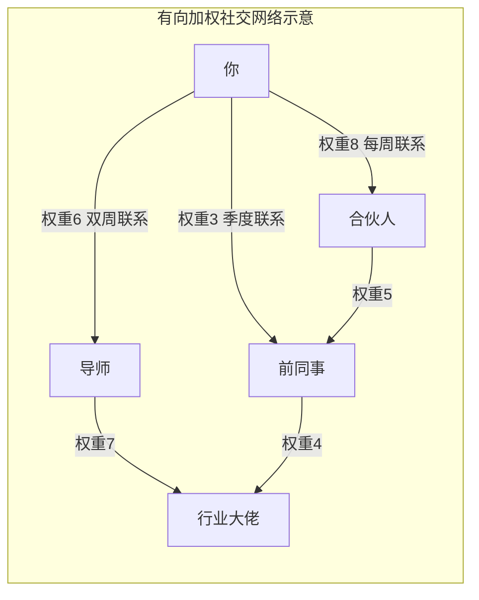
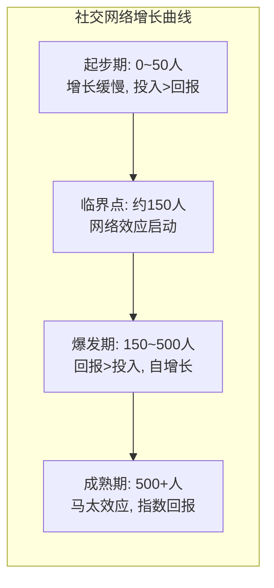

## 六、社交网络的数学模型

人脉经营不能只靠直觉。当我们把社交关系抽象为数学模型时，许多反直觉的规律就会浮现出来——为什么弱关系比强关系更容易带来工作机会？为什么少数人掌握了大部分社交资源？为什么人脉网络在初期增长缓慢，到某个节点后突然爆发？这些问题的答案，都藏在社交网络的数学结构里。

本节用图论、统计物理学和社会学的经典模型，帮你建立"用数据理解人脉"的思维方式。这不是学术课——每个模型都附带可落地的行动指南。

### 6.1 社交网络的图论基础

社交网络本质上是一张**图（Graph）**。图由两类元素构成：

- **节点（Node）**：代表个体——你、你的同事、你的客户
- **边（Edge）**：代表关系——好友、同事、交易对手

把你的微信通讯录想象成一张图：每个人是一个节点，每条聊天记录或好友关系就是一条边。这张图的结构特征，直接决定了信息如何流动、机会如何产生。

#### 6.1.1 图的基本参数

理解社交网络，先要掌握几个核心参数：

| 参数 | 定义 | 社交含义 | 计算方式 |
|------|------|----------|----------|
| **度（Degree）** | 一个节点拥有的边数 | 你认识多少人 | 直接统计好友数 |
| **路径长度（Path Length）** | 两个节点之间最短路径的边数 | 你和某人隔几层关系 | 最短路径算法 |
| **聚类系数（Clustering Coefficient）** | 节点的邻居之间互相连接的比例 | 你的朋友们彼此认识的程度 | 实际三角形数/可能三角形数 |
| **连通分量（Component）** | 互相可达的最大节点集合 | 你所在的社交圈 | BFS/DFS遍历 |

**聚类系数的计算公式**：

$$C_i = \frac{2 \times e_i}{k_i \times (k_i - 1)}$$

其中 $e_i$ 是节点 $i$ 的邻居之间实际存在的边数，$k_i$ 是节点 $i$ 的度。

**举个例子**：你有6个朋友（$k=6$），他们之间有3对互相认识（$e=3$）。你的聚类系数为：

$$C = \frac{2 \times 3}{6 \times 5} = 0.2$$

聚类系数越高，说明你的社交圈越"封闭"——你的朋友们彼此都认识。这在熟人社会（如县城、行业小圈子）中很常见。聚类系数低，说明你连接了不同的圈子——这正是结构洞的价值所在（详见第三章）。

#### 6.1.2 有向图与加权图

现实中的社交关系比简单的图更复杂：

- **有向图**：A关注B不代表B关注A。微博的粉丝关系、LinkedIn的连接请求都是有向的。这意味着"度"要拆分为**入度**（关注你的人数）和**出度**（你关注的人数）。
- **加权图**：关系有强弱之分。和你每天聊天的人权重为10，半年没联系的人权重为1。权重决定了信息传递的概率和速度。

在人脉经营中，**加权有向图**是最接近现实的模型。你不仅要关注"认识谁"（度），还要关注"关系多深"（权重）和"谁主动维护"（方向）。



### 6.2 六度分隔与小世界网络

#### 6.2.1 米尔格拉姆的信件实验

1967年，哈佛大学社会心理学家斯坦利·米尔格拉姆（Stanley Milgram）做了一个经典实验：他随机选取内布拉斯加州的居民，让他们把一封信通过熟人转交的方式寄给波士顿的一个股票经纪人。结果发现，成功送达的信件平均经过了**5.5个中间人**——这就是"六度分隔"（Six Degrees of Separation）的由来。

这个实验的深层含义并非"只要6步就能认识任何人"，而是揭示了一个惊人的事实：**在一个拥有数十亿节点的网络中，任意两点之间的平均路径长度竟然如此之短**。社交网络不是一团乱麻，而是有着精巧的数学结构。

#### 6.2.2 小世界网络模型

1998年，邓肯·瓦茨（Duncan Watts）和史蒂文·斯托加茨（Steven Strogatz）提出了**小世界网络模型（Small-World Network）**，解释了为什么社交网络同时具备两种看似矛盾的特性：

- **高聚类系数**：你的朋友之间大概率也认识（本地聚集）
- **短平均路径**：你和任何陌生人之间只需要几步（全局可达）

**小世界网络的构造算法**（Watts-Strogatz模型）：

1. 从一个规则环形网络开始（每个节点连接最近的 $k$ 个邻居）
2. 以概率 $p$ 随机重连每条边
3. 当 $p$ 很小时（约0.01~0.1），网络就变成了"小世界"

$p$ 值越小，网络越接近规则网络（高聚类，长路径）；$p$ 值越大，网络越接近随机网络（低聚类，短路径）。小世界网络正好处在两者之间的"甜蜜地带"。

**对人脉经营的启示**：

你的社交网络天然就是小世界网络——你身边有紧密的小圈子（高聚类），同时通过少数几个"跨界连接"就能触及远方的陌生人（短路径）。这意味着：

1. **维护3~5个跨界连接**（不同行业、不同城市、不同圈层的朋友）就能大幅缩短你到任何目标人物的距离
2. **你不需要认识所有人**，只需要确保你的网络中有几条"长程连接"
3. **圈子内部的信息高度冗余**——同一个圈子里的10个人告诉你的消息，往往大同小异

#### 6.2.3 现代验证：在线社交网络的实测数据

六度分隔在数字时代被大幅压缩：

| 平台 | 研究年份 | 平均路径长度 | 数据来源 |
|------|----------|-------------|----------|
| 微软MSN消息 | 2008 | 6.6步 | Microsoft Research |
| Facebook | 2011 | 4.74步 | Facebook Data Science |
| Twitter | 2012 | 4.67步 | 亚利桑那州立大学 |
| LinkedIn | 2016 | 3.5步 | LinkedIn官方 |
| 微信（推测） | 2020 | 约4~5步 | 腾讯研究院估算 |

LinkedIn的3.5度意味着：你和任何一个行业大佬之间，最多隔3个人。这在理论上是极短的距离——但能不能走通，取决于你是否有意识地去经营这条路径。

### 6.3 幂律分布与无标度网络

#### 6.3.1 二八法则的数学本质

你可能听说过"20%的人掌握了80%的财富"。在社交网络中，存在一个类似的规律：**少数人拥有大量的连接，大多数人只有少量连接**。这种分布不是正态分布（钟形曲线），而是**幂律分布（Power Law）**：

$$P(k) \sim k^{-\gamma}$$

其中 $P(k)$ 是度为 $k$ 的节点出现的概率，$\gamma$ 是幂律指数（社交网络中通常在2~3之间）。

幂律分布和正态分布的关键区别：

| 特征 | 正态分布 | 幂律分布 |
|------|----------|----------|
| 形状 | 钟形，对称 | 长尾，严重右偏 |
| 典型值 | 平均值有代表性 | 平均值无意义 |
| 极端值 | 极少出现 | 相对常见 |
| 社交例子 | 随机网络中的好友数 | 真实社交网络中的好友数 |
| 直觉 | "大多数人都差不多" | "贫富差距巨大" |

**这意味着什么？** 在你的社交网络中，大多数人的微信好友在200~500人之间，但少数"超级连接者"可能有5000+好友。这些超级连接者虽然人数少，但对网络的信息流动起着决定性作用。

#### 6.3.2 无标度网络模型

1999年，艾伯特-拉斯洛·巴拉巴西（Albert-László Barabási）和雷卡·阿尔伯特（Réka Albert）提出了**BA模型（Barabási-Albert Model）**，解释了幂律分布的产生机制。BA模型只有两条规则：

1. **增长（Growth）**：网络不断扩大，新节点不断加入
2. **优先连接（Preferential Attachment）**：新加入的节点更倾向于连接已有的高连接度节点——"富者愈富"

用社交场景翻译就是：

- **增长**：每年都有新人进入你的行业、城市、圈子
- **优先连接**：新人更倾向于认识行业里最有名的人，而不是随机认识一个人

**优先连接的概率公式**：

$$\Pi(k_i) = \frac{k_i}{\sum_j k_j}$$

一个节点被新节点连接的概率，正比于它已有的连接数。这就是为什么：

- 大V的粉丝增长越来越快
- 行业大佬每天收到无数的社交请求
- 普通人想建立同等规模的网络，难度呈指数增长

#### 6.3.3 马太效应与人脉经营策略

幂律分布揭示了社交网络中的**马太效应**——强者愈强，弱者愈弱。但这并不意味着普通人没有机会。理解幂律之后，你可以采取以下策略：

**策略一：成为小池塘里的大鱼**

在大平台上和百万大V竞争注意力是不明智的。但如果你在某个细分领域建立权威（比如"Python量化交易"而不是"编程"），你更容易成为这个小网络中的超级节点。

**策略二：优先连接超级节点**

与其认识100个普通人，不如花同样的精力认识3个超级连接者。一个拥有5000好友的行业KOL帮你转发一条内容，效果远超你自己发100条。

**策略三：利用长尾价值**

幂律分布的"长尾"意味着，虽然大多数人的连接数少，但他们的数量巨大。这些人可能无法给你带来单次大机会，但他们的集体价值不可忽视——这就是"弱关系"理论的数学基础。

### 6.4 网络中心性：谁才是真正的关键人物

判断一个人在社交网络中的重要性，不能只看好友数量。图论提供了四种**中心性（Centrality）**指标，从不同维度衡量节点的影响力。

#### 6.4.1 四种中心性指标

**① 度中心性（Degree Centrality）**

$$C_D(v) = \frac{deg(v)}{n-1}$$

直接衡量一个节点有多少连接。好友数多的人度中心性高。

- **优点**：简单直观，计算成本低
- **缺点**：只看数量不看质量，不反映位置优势
- **适用场景**：快速评估一个人的社交活跃度

**② 中介中心性（Betweenness Centrality）**

$$C_B(v) = \sum_{s \neq v \neq t} \frac{\sigma_{st}(v)}{\sigma_{st}}$$

其中 $\sigma_{st}$ 是节点 $s$ 到 $t$ 的最短路径数，$\sigma_{st}(v)$ 是经过节点 $v$ 的最短路径数。

衡量一个节点在多大程度上充当"桥梁"。高中介中心性的人控制着信息流通——去掉他，网络就会出现断层。

- **优点**：识别真正的"桥梁人物"和"结构洞占据者"
- **缺点**：计算复杂度高（$O(VE)$）
- **适用场景**：识别组织中不可或缺的信息中间人

**③ 接近中心性（Closeness Centrality）**

$$C_C(v) = \frac{n-1}{\sum_{u \neq v} d(v,u)}$$

衡量一个节点到所有其他节点的平均距离。接近中心性高的人，能最快地把信息传播到整个网络。

- **优点**：反映信息传播效率
- **缺点**：在非连通图中无意义
- **适用场景**：选择信息广播的起点（如市场推广的种子用户）

**④ 特征向量中心性（Eigenvector Centrality）**

$$x_v = \frac{1}{\lambda} \sum_{u \in N(v)} x_u$$

不仅看你认识多少人，还看你认识的人有多重要。如果你的朋友都是大佬，你的特征向量中心性就高。Google的PageRank算法本质上就是特征向量中心性的变体。

- **优点**：考虑了连接的质量
- **缺点**：可能出现"一人得道，鸡犬升天"的聚集效应
- **适用场景**：评估一个人的"隐性影响力"

#### 6.4.2 四种中心性的实战对比

| 中心性类型 | 衡量维度 | 高值特征 | 人脉经营策略 |
|-----------|----------|----------|-------------|
| 度中心性 | 连接数量 | 社交蝴蝶，好友众多 | 扩大社交面，增加曝光度 |
| 中介中心性 | 桥梁位置 | 跨圈连接者，信息掮客 | 连接不同圈子，占据结构洞 |
| 接近中心性 | 传播效率 | 消息灵通，四通八达 | 成为信息枢纽，缩短传播路径 |
| 特征向量中心性 | 连接质量 | 朋友圈含金量高 | 优先结交高质量人脉 |

**行动建议**：不要只追求度中心性（好友数量）。对于搞钱来说，**中介中心性**和**特征向量中心性**往往更有价值——前者帮你成为信息经纪人，后者确保你身处高质量网络。

### 6.5 网络效应与临界质量

#### 6.5.1 三种网络价值定律

社交网络的价值如何随规模增长？三位学者提出了不同的数学模型：

**梅特卡夫定律（Metcalfe's Law）—— 以太网发明者罗伯特·梅特卡夫，1993年**

$$V = n \times (n-1) / 2 \approx n^2/2$$

网络价值与节点数的平方成正比。$n$ 个用户之间有 $n(n-1)/2$ 条潜在连接，每条连接都有价值。

- 10个人的网络有45条连接
- 100个人的网络有4950条连接
- 1000个人的网络有499500条连接

**里德定律（Reed's Law）—— MIT教授大卫·里德，1999年**

$$V = 2^n$$

网络价值与节点数的指数成正比。因为网络中的用户不仅能两两连接，还能形成各种**子群（Group）**——群组本身就有价值。$n$ 个人可以组成 $2^n$ 种可能的子群。

**实际增长模型**

真实的社交网络价值通常介于梅特卡夫定律和里德定律之间。但核心结论一致：**网络价值的增长速度远超网络规模的增长速度**。

#### 6.5.2 临界质量：突破引爆点

社交网络存在一个**临界质量（Critical Mass）**——当参与者数量超过某个阈值后，网络会产生自增长的正反馈循环，价值呈指数上升。



**临界质量的估算**：

对于一个社交网络，临界质量通常出现在网络中**至少有30%的成员彼此连接**的时候。对于个人人脉网络来说，这个阈值大约在**150~300人**之间——巧合的是，这和邓巴数（150人）高度吻合。

**实践指导**：

- **0~50人阶段**：不要期待回报。这是"播种期"，核心任务是建立连接、积累信任
- **50~150人阶段**：开始感受到网络效应——有人主动介绍机会、推荐合作
- **150~500人阶段**：网络进入自增长模式，你维护关系的成本反而下降，因为网络本身在帮你传播价值
- **500人以上**：你需要的是**网络管理策略**而非继续扩张——质量比数量更重要

#### 6.5.3 网络密度与结构优化

**网络密度（Density）** 是实际边数与最大可能边数的比值：

$$D = \frac{2E}{n(n-1)}$$

- **密度接近1**：所有人都互相认识（封闭的小圈子）——信息冗余高，创新少
- **密度接近0**：几乎没人互相认识（松散的群体）——信息流动差，缺乏凝聚力
- **最优密度**：约0.1~0.3——既有足够的连接保证信息流通，又保留了结构洞带来的信息优势

### 6.6 邓巴数的数学推导

英国人类学家罗宾·邓巴（Robin Dunbar）在1992年提出了著名的"邓巴数"——人类能维持稳定社交关系的上限约为**150人**。这不是一个随意的数字，而是从大脑新皮层的体积推导出来的。

#### 6.6.1 从脑容量到社交极限

邓巴分析了38种灵长类动物，发现新皮层比例（新皮层体积/大脑总体积）与群体规模之间存在对数线性关系：

$$\log(N) = 0.093 + 3.389 \times \log(ECR)$$

其中 $N$ 是群体规模，$ECR$ 是新皮层比例。

将人类的新皮层比例代入公式，得出人类的认知极限群体规模约为**148人**——四舍五入就是150人。

#### 6.6.2 邓巴层级结构

邓巴进一步发现，社交关系不是均匀分布的，而是呈现**分层结构**——每一层的规模大约是前一层的3倍：

| 层级 | 人数 | 关系类型 | 维护频率 | 互动特征 |
|------|------|----------|----------|----------|
| 核心圈 | 5人 | 至亲挚友 | 每天 | 深度情感连接，无条件信任 |
| 亲密圈 | 15人 | 好朋友 | 每周 | 相互了解，主动关心 |
| 友好圈 | 50人 | 朋友 | 每月 | 有一定了解，愿意帮忙 |
| 熟人圈 | 150人 | 熟人 | 每季度 | 能叫出名字，偶尔互动 |
| 认知圈 | 500人 | 点头之交 | 每年 | 认识但不太了解 |
| 可识别层 | 1500人 | 面熟 | — | 见过面，叫不出名字 |

**关键洞察**：每一层大约是前一层的3倍（5→15→50→150→500→1500）。这不是巧合，而是人类认知能力的自然延伸——你的大脑能处理的社交信息总量是有限的，分配到每一层的资源自然递减。

#### 6.6.3 突破邓巴数的数字工具

邓巴数是认知极限，但不代表你只能维护150个关系。借助工具，你可以突破这个限制：

| 策略 | 原理 | 工具/方法 | 扩展上限 |
|------|------|-----------|----------|
| 外部记忆 | 用工具代替大脑记忆 | CRM系统、人脉管理App、Notion数据库 | 将"熟人圈"扩展到500+ |
| 触发机制 | 定期提醒而非主动记忆 | 日历提醒、自动化消息（生日祝福等） | 将维护频率提升3~5倍 |
| 社群杠杆 | 用群组替代一对一维护 | 微信群、Discord、定期聚会 | 1人维护500+被动连接 |
| 内容广播 | 用内容替代直接互动 | 朋友圈、公众号、短视频 | 1条内容触达数千人 |

### 6.7 弱关系的数学解释

#### 6.7.1 格兰诺维特的弱关系强度理论

1973年，马克·格兰诺维特（Mark Granovetter）发表了《弱关系的力量》，解释了一个反直觉的现象：**找工作时，帮上忙的往往不是亲密好友，而是不太熟的"点头之交"**。

从数学角度，原因在于**信息冗余度**：

- **强关系**（亲密好友）：和你处于同一个社交圈子，你们的信息源高度重叠。他们知道的信息，你大概率已经知道了。聚类系数高意味着信息在封闭三角形中反复循环。
- **弱关系**（点头之交）：和你处于不同的社交圈子，他们接触到的信息对你来说是全新的。弱关系正是跨聚类的"长程连接"。

**信息冗余度的量化**：

假设你有 $k$ 个强关系朋友，他们的聚类系数为 $C$。那么你通过强关系获得的新信息比例大约为：

$$\text{新信息比} \approx 1 - C$$

如果 $C = 0.6$（你的60%的朋友互相认识），那么你通过强关系获得的每10条信息中，有6条是重复的。

而弱关系的聚类系数接近0（他们和你的其他朋友几乎不认识），每条信息几乎都是全新的。

#### 6.7.2 强弱关系的最优配比

弱关系带来新信息，强关系带来深度支持。最优的人脉结构不是全强或全弱，而是两者的合理配比：

| 维度 | 强关系占比 | 弱关系占比 | 最优配比依据 |
|------|-----------|-----------|-------------|
| 工作机会 | 20% | 80% | Granovetter研究：80%的工作来自弱关系 |
| 情感支持 | 90% | 10% | 只有强关系能提供深度情感支持 |
| 商业信息 | 30% | 70% | 弱关系带来更多跨界信息 |
| 资源调动 | 60% | 40% | 强关系更愿意投入资源，弱关系覆盖面广 |
| 创新灵感 | 25% | 75% | 创新来自不同领域的交叉碰撞 |

**实操建议**：将你投入社交维护的时间按"70/30法则"分配——70%的时间维护现有强关系（质量），30%的时间拓展新的弱关系（覆盖面）。

### 6.8 网络传染模型：信息与影响力的传播

#### 6.8.1 SIR模型在社交传播中的应用

流行病学中的SIR模型可以完美类比社交网络中的信息传播：

- **S（Susceptible，易感者）**：还没听到这个消息的人
- **I（Infected，感染者）**：正在传播这个消息的人
- **R（Recovered，康复者）**：已经知道但不再传播的人

信息传播的数学模型：

$$\frac{dS}{dt} = -\beta \cdot S \cdot I$$

$$\frac{dI}{dt} = \beta \cdot S \cdot I - \gamma \cdot I$$

$$\frac{dR}{dt} = \gamma \cdot I$$

其中 $\beta$ 是传播率（一条消息被分享的概率），$\gamma$ 是遗忘率（消息热度消退的速度）。

**对内容创作者的启示**：

- **提高 $\beta$（传播率）**：制作更容易被分享的内容——实用干货、情感共鸣、社交货币（让人分享后显得有见识）
- **降低 $\gamma$（遗忘率）**：通过持续更新、系列内容、互动讨论，延长内容的生命周期
- **找到超级传播者**：少数高连接度节点（KOL）的传播效率远超普通用户。一个拥有10万粉丝的博主发布，效果等同于1000个普通用户各分享10次

#### 6.8.2 影响力传播的阈值模型

不是所有信息都能像病毒一样扩散。影响力传播存在一个**阈值（Threshold）**：只有当一个人的社交圈中超过一定比例的人采用了某个行为（或接受了某个观点）时，这个人才会被"激活"。

**格拉诺维特阈值模型**：

假设每个人 $i$ 有一个阈值 $\theta_i$——当其社交圈中有超过 $\theta_i$ 比例的人采纳某行为时，$i$ 也会采纳。

- $\theta = 0$：不管别人怎么做，我都做（创新者/先行者）
- $\theta = 0.1$：10%的人做了，我就跟（早期采用者）
- $\theta = 0.5$：半数人做了，我才做（大多数人）
- $\theta = 0.9$：90%的人都做了，我才勉强做（保守者）

**连锁反应的条件**：当网络中存在一条"阈值链"——$\theta = 0$ 的人影响 $\theta = 0.1$ 的人，$\theta = 0.1$ 的人再影响 $\theta = 0.2$ 的人……如此递进——信息就能产生连锁传播。

**搞钱应用**：

1. **做第一批 $\theta = 0$ 的人**——在新平台、新工具、新趋势刚出现时就参与，而不是等所有人都用了再跟进
2. **找到 $\theta$ 值最低的人群**作为种子用户——他们最容易被激活，然后帮你传播
3. **避免在高阈值人群中做早期推广**——事倍功半，不如等网络效应自然传导

### 6.9 实战：用Python分析你的社交网络

理解理论之后，用工具把你的社交网络可视化出来。以下是使用Python的`networkx`库分析社交网络的完整流程。

#### 6.9.1 基础分析代码

```python
import networkx as nx
import matplotlib.pyplot as plt
import numpy as np

# 创建社交网络图
G = nx.Graph()

# 添加节点和边（示例数据，替换为你的真实人脉）
relationships = [
    ("你", "同事A", 8), ("你", "同学B", 6), ("你", "客户C", 5),
    ("你", "导师D", 9), ("你", "邻居E", 3), ("同事A", "同事F", 7),
    ("同事A", "客户G", 4), ("同学B", "同学H", 6), ("导师D", "大佬I", 8),
    ("大佬I", "大佬J", 9), ("客户C", "供应商K", 5),
    ("同学H", "投资人L", 7), ("大佬J", "投资人L", 6),
]

for u, v, w in relationships:
    G.add_edge(u, v, weight=w)

# 基本参数
print(f"节点数: {G.number_of_nodes()}")
print(f"边数: {G.number_of_edges()}")
print(f"网络密度: {nx.density(G):.3f}")
print(f"平均聚类系数: {nx.average_clustering(G):.3f}")

# 中心性分析
degree_cent = nx.degree_centrality(G)
betweenness_cent = nx.betweenness_centrality(G)
closeness_cent = nx.closeness_centrality(G)

print("\n=== 中心性排名 ===")
for node in sorted(degree_cent, key=degree_cent.get, reverse=True)[:5]:
    print(f"{node}: 度中心性={degree_cent[node]:.3f}, "
          f"中介中心性={betweenness_cent[node]:.3f}, "
          f"接近中心性={closeness_cent[node]:.3f}")

# 可视化
pos = nx.spring_layout(G, seed=42)
node_sizes = [3000 * degree_cent[n] + 100 for n in G.nodes()]
nx.draw(G, pos, with_labels=True, node_size=node_sizes,
        node_color='lightblue', font_size=10, font_weight='bold')
plt.title("你的社交网络图")
plt.savefig("social_network.png", dpi=150, bbox_inches='tight')
plt.show()
```

#### 6.9.2 关键发现与行动指南

运行上述分析后，重点关注以下指标：

| 发现 | 含义 | 行动 |
|------|------|------|
| 你的中介中心性最高 | 你是网络中的关键桥梁 | 利用位置优势，收取"信息过路费" |
| 某节点的度中心性最高但中介中心性低 | 他认识人多但不是桥梁 | 通过他快速扩展网络 |
| 聚类系数>0.5 | 你的朋友圈高度重叠 | 需要拓展弱关系，打破圈子壁垒 |
| 存在孤立节点 | 有人和你的网络完全断开 | 考虑是否有维护价值 |
| 网络密度<0.1 | 你的网络太松散 | 需要在圈内做更多连接介绍 |

### 6.10 常见误区

**误区一：只追求好友数量**

幂律分布告诉我们，大多数连接毫无价值。1000个泛泛之交不如50个深度关系+200个活跃弱关系。你应该关注的是**有效网络规模**——在你需要时能产生响应的关系数量。

**误区二：忽视网络结构**

很多人只关注"认识谁"，不关注"关系网络长什么样"。一个拥有500好友但全部在同一圈子的人，其信息获取能力远不如一个只有200好友但横跨3个不同行业的人。

**误区三：以为关系可以长期不维护**

邓巴层级的维护频率不是建议，是认知科学的硬约束。半年不联系的人，你在大脑中的"社交缓存"已经被清理了——重新激活的成本远高于定期维护。

**误区四：迷信"认识大佬"**

特征向量中心性说明，认识大佬确实有价值。但前提是**双向关系**而非单向崇拜。如果你无法为对方提供价值，那条连接的权重为零。与其追求"认识大佬"，不如先成为某个细分领域的价值提供者。

**误区五：用线性思维理解网络增长**

网络效应是指数级的——初期投入看不到回报是正常的。很多人在临界质量之前放弃，就像在雪崩前最后一秒停止推雪球。坚持到150人的阈值，网络会开始自增长。

### 6.11 本节核心公式速查表

| 模型/定律 | 公式 | 核心含义 | 搞钱启示 |
|-----------|------|----------|----------|
| 聚类系数 | $C_i = 2e_i / [k_i(k_i-1)]$ | 你的朋友们互相认识的程度 | 高聚类=信息冗余，需拓展弱关系 |
| 幂律分布 | $P(k) \sim k^{-\gamma}$ | 连接分布极度不均 | 少数超级节点决定网络结构 |
| 优先连接 | $\Pi(k_i) = k_i / \Sigma k_j$ | 富者愈富 | 先成为小领域的大节点 |
| 梅特卡夫定律 | $V = n^2/2$ | 网络价值与规模平方成正比 | 网络规模值得投入 |
| 邓巴层级 | 5→15→50→150→500 | 社交关系的自然分层 | 分层管理，差异化维护 |
| 网络密度 | $D = 2E/[n(n-1)]$ | 实际连接vs最大可能连接 | 密度0.1~0.3为最优 |
| SIR传播 | $dS/dt = -\beta SI$ | 信息传播动力学 | 找超级传播者，提高传播率 |

理解这些数学模型，不是为了成为网络科学家，而是为了在人脉经营中做出**更聪明的决策**——知道把有限的时间和精力投入在哪里，才能获得最大的社交资本回报。
