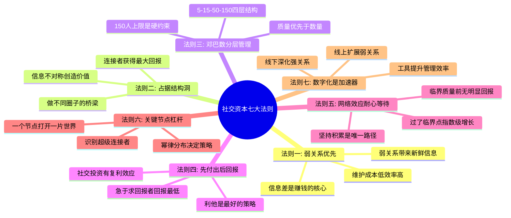
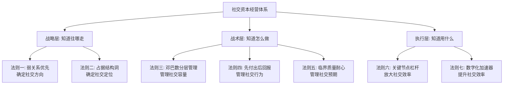

## 七、总结：社交资本的核心法则

前面六节分别介绍了社交资本的理论起源、弱关系理论、结构洞理论、邓巴数、社会资本回报率以及社交网络的数学模型。本节将这些分散的理论整合为一套可操作的核心法则体系，帮助你建立对社交资本的全局认知框架。

### 7.1 为什么需要总结法则

理论的价值在于指导实践。但如果六个理论各自为政，你在实际社交中会面临选择困难：遇到一个新人脉，是该用弱关系理论判断其信息价值，还是用结构洞理论评估其连接价值？当你的社交圈接近邓巴数上限时，是该扩展还是深耕？

这些法则就是把理论转化为决策框架的桥梁。每一条法则背后都有严谨的学术支撑，但表述方式是面向实践者的。

### 7.2 社交资本的七大核心法则



#### 法则一：弱关系优先——信息差是赚钱的核心

**理论来源**：马克·格兰诺维特（Mark Granovetter）1973年发表的《弱关系的力量》。

**核心逻辑**：你的亲密朋友和你处于同一个信息圈层，他们知道的事情你大概率也知道。而那些偶尔联系的"点头之交"——前同事、行业会议上认识的人、朋友的朋友——他们处于完全不同的信息网络中，能带来你圈子内部不可能产生的新信息。

**数据支撑**：格兰诺维特对波士顿地区换工作的专业人士进行调查发现，56%的人是通过"偶尔联系"或"很少联系"的人找到新工作的，而非通过亲密朋友。这个比例远超直觉预期。

**实操指南**：

| 维度 | 强关系 | 弱关系 |
|------|--------|--------|
| 信息新鲜度 | 低（同质化严重） | 高（跨圈层流动） |
| 维护成本 | 高（需要高频互动） | 低（偶尔联系即可） |
| 信任基础 | 高（有情感基础） | 低（需要建立信任） |
| 适用场景 | 情感支持、深度合作 | 信息获取、机会发现 |
| 最佳策略 | 定期深度交流 | 保持连接、有事回应 |

**行动要点**：
1. 每周花30分钟维护弱关系：给朋友圈有价值的内容点赞评论，转发行业信息时@相关的人
2. 每月主动联系2-3个"快断联"的弱关系，方式可以是分享一篇对方可能感兴趣的文章
3. 每季度参加1-2个新的行业活动，扩展弱关系池

**常见错误**：把所有社交时间都花在和好朋友吃喝玩乐上，导致信息圈层严重同质化，错失大量外部机会。

#### 法则二：占据结构洞——做不同圈子的桥梁

**理论来源**：罗纳德·伯特（Ronald Burt）1992年提出的结构洞理论。

**核心逻辑**：在社交网络中，如果两个群体之间没有直接联系，那么这两个群体之间就存在一个"结构洞"。能够填补这个结构洞的人——也就是连接两个不相干群体的人——将获得巨大的信息优势和控制优势。

**为什么连接者最有价值**：

假设你同时认识投资人圈子和创业者圈子，而这两个圈子之间几乎没有交集。当一个创业者朋友需要融资时，你可以直接推荐给投资人朋友；当一个投资人朋友在找好项目时，你可以推荐合适的创业者。你在这两个群体之间获得的信息差和信任差，就是你的结构洞价值。

**结构洞价值的三个层次**：

| 层次 | 描述 | 价值来源 |
|------|------|----------|
| 信息利益 | 最先获知来自不同群体的信息 | 时间差优势 |
| 推荐利益 | 在不同群体间充当中介人 | 位置优势 |
| 控制利益 | 协调不同群体间的利益关系 | 话语权优势 |

**如何识别你身边的结构洞**：
1. 画出你目前的社交网络图，标注每个人所在的行业/圈子
2. 找到那些你认识但彼此不认识的人——这就是你已有的结构洞
3. 评估哪些结构洞的信息差价值最高（行业差异越大、圈子越不重叠，价值越高）

**如何主动构建结构洞**：
1. 刻意进入与主业不同的圈子（如技术人员参加商业活动，金融人士参加科技论坛）
2. 做"翻译者"：把一个圈子的知识和资源，用另一个圈子能理解的方式传递过去
3. 组织跨界活动：把不同圈子的人邀请到同一个场景中，你自然成为桥梁

**案例**：一个做传统外贸的朋友，业余时间参加了本地的AI创业者聚会。当他在外贸行业发现一个可以用AI解决的痛点后，他把AI团队和外贸客户连接起来，最终以技术合伙人的身份参与了一家AI外贸SaaS公司的创业。他之所以能获得这个机会，不是因为他的技术能力，而是因为他占据了"传统外贸"和"AI技术"之间的结构洞。

#### 法则三：邓巴数分层管理——150人上限是硬约束

**理论来源**：英国人类学家罗宾·邓巴（Robin Dunbar）基于灵长类动物大脑新皮层比例研究，提出人类认知能力能维持的稳定社交关系上限约为150人。

**核心逻辑**：人的认知资源有限，不可能无限扩展社交网络。150不是一个精确数字，而是一个数量级概念——大多数人的有效社交网络在100-250人之间。超过这个数量，关系质量必然下降。

**四层社交圈模型**：

| 层级 | 人数 | 关系类型 | 互动频率 | 维护方式 |
|------|------|----------|----------|----------|
| 核心层 | ≤5人 | 挚友/至亲 | 每天或隔天 | 深度交流、无条件支持 |
| 亲密层 | ≤15人 | 好朋友 | 每周1-2次 | 主动关心、分享资源 |
| 熟悉层 | ≤50人 | 朋友 | 每月1-2次 | 定期互动、价值交换 |
| 认知层 | ≤150人 | 认识的人 | 每季度或更少 | 节日问候、保持连接 |

**分层管理的核心原则**：

1. **不要试图和所有人保持深度关系**。这是最常见的社交错误——精力分散到所有关系上，结果每段关系都不深。把80%的社交精力放在核心层和亲密层（共20人），20%的精力维护熟悉层和认知层。

2. **定期审视你的四层结构**。每季度做一次"社交审计"：核心层的人还值得信任吗？亲密层是否有人应该升级或降级？熟悉层中是否有高价值关系在流失？

3. **接纳关系的流动性**。人的一生中，不同阶段的核心层成员会变化。大学时的死党可能变成工作后的认知层。这不是背叛，是正常的生命流动。

**实操工具：社交关系盘点表**：

```text
每月花15分钟做一次：
1. 列出核心层5人 → 最近一次深度交流是什么时候？
2. 列出亲密层15人 → 最近一个月联系了几个？
3. 从熟悉层中选5人 → 哪些有升级潜力？主动联系一次
4. 从认知层中选3人 → 哪些关系在流失？发一条消息保持连接
```

**常见错误**：追求社交网络的"数量最大化"，加了5000个微信好友，但真正能在关键时刻帮到你的人不到10个。社交资本的质量远比数量重要。

#### 法则四：先付出后回报——利他是最好的社交策略

**理论来源**：社会交换理论（霍曼斯，1958）、亚当·格兰特《Give and Take》研究。

**核心逻辑**：社交关系本质上是一种隐性的交换关系。但与直觉相反，那些不计较短期回报、持续为他人创造价值的人，长期来看获得的回报最大。格兰特的研究将人分为三类：给予者（Giver）、索取者（Taker）和互利者（Matcher）。在职场成功的顶端和底端，都是给予者——差别在于顶端的给予者会策略性地给予，而非无底线地付出。

**"策略性利他"的操作框架**：

| 维度 | 无策略利他 | 策略性利他 |
|------|-----------|-----------|
| 给予对象 | 所有人 | 筛选过的高价值关系 |
| 给予内容 | 有求必应 | 选择自己擅长且对方需要的 |
| 期望回报 | 期望即时回报或完全不期望 | 期望长期系统性回报 |
| 保护边界 | 没有边界 | 有明确的时间和精力边界 |
| 长期结果 | 容易被消耗殆尽 | 持续积累社交资本 |

**如何有效"先付出"**：

1. **信息价值**：分享对方需要但不容易获取的信息（行业报告、政策变化、竞品动态）
2. **连接价值**：介绍对对方有用的人脉（前提是双方都有需求，不是单方面拉线）
3. **专业价值**：用自己的专业能力帮对方解决具体问题（免费咨询、代码review、方案建议）
4. **情绪价值**：在对方遇到困难时提供倾听和支持（不需要解决问题，只需要在场）

**关键原则**：给予要"可见"——不是默默做好事不让人知道，而是让你的帮助被对方感知到。同时要"适度"——不要过度付出导致自己被掏空，也不要让对方觉得你在"施恩"。

**案例**：一个做产品经理的朋友，每周在行业社群里花2小时回答新人的问题，持续了两年。这些新人分散在不同的公司。两年后，当他自己创业需要找合作方时，当年被他帮助过的人中有7个主动提供了关键帮助——有的介绍了客户，有的推荐了技术合伙人，有的提供了内部信息。他两年的"免费付出"，在创业时获得了远超预期的回报。

#### 法则五：网络效应与临界质量——耐心是唯一的捷径

**理论来源**：梅特卡夫定律（网络价值与节点数的平方成正比）、布莱恩·阿瑟的正反馈理论。

**核心逻辑**：社交网络的价值不是线性增长的，而是存在一个"临界质量"——在此之前你几乎感觉不到回报，在此之后机会会自动找上门。大多数人在临界质量到来之前就放弃了，这是社交经营最大的陷阱。

**社交网络价值增长曲线**：


**临界质量的估算**：
- **行业影响力临界点**：当你在一个行业有50+个有效连接（认识你、认可你的专业能力），行业内的机会开始主动流向你
- **跨行业影响力临界点**：当你在3个以上不同行业各有20+个有效连接，跨行业的整合机会开始出现
- **个人品牌临界点**：当你的社交媒体粉丝中，有100+个人会因为你的推荐而产生行动，你的个人品牌开始产生实际价值

**如何度过"投入期"**：
1. 设定阶段性目标，不要只盯着最终回报（如：本月新增5个有效弱关系）
2. 记录你的社交投入和微小回报，建立正反馈循环
3. 找到社交伙伴（一起参加活动、互相引荐），降低孤独感
4. 把社交当成一种生活方式，而非一项任务

**常见错误**：在投入期看不到回报就放弃，转而投入"看起来回报更快"的事情。殊不知社交资本是复利增长的，后期的指数级增长恰恰需要前期的持续积累。

#### 法则六：识别关键节点——用杠杆撬动整个网络

**理论来源**：幂律分布（帕累托法则）、马尔科姆·格拉德威尔《引爆点》中的"联系人"概念。

**核心逻辑**：社交网络的连接分布不是正态分布，而是幂律分布。少数"超级连接者"拥有不成比例的大量连接。与一个超级连接者建立关系，等同于间接连接到他背后的整个网络。

**识别超级连接者的特征**：
- 他们认识的人覆盖多个行业和圈层
- 他们经常主动"牵线搭桥"，帮别人互相认识
- 他们在社交媒体上有较强的互动率（不是粉丝数，是互动质量）
- 他们的名字在不同场合被不同的人反复提到

**与超级连接者打交道的原则**：

| 原则 | 说明 |
|------|------|
| 价值先行 | 超级连接者最不缺的就是"想认识他们的人"，你需要提供独特价值 |
| 质量优先 | 一次深度交流 > 十次表面寒暄 |
| 耐心经营 | 超级连接者对关系质量要求更高，信任建立需要时间 |
| 互惠互利 | 让对方看到你也能帮他连接到他需要的资源 |
| 保持独特性 | 你是"那个做XX的人"比你是"又一个想认识我的人"有价值得多 |

**案例**：一个做自媒体运营的朋友，花了半年时间经营与一个行业KOL的关系。他不是去求合作，而是持续为KOL提供有价值的行业数据和竞品分析。半年后，KOL主动邀请他参与一个项目，项目本身不大，但通过KOL的引荐，他认识了KOL背后的整个商业圈——包括3个后来成为他大客户的企业主。一个人脉杠杆，撬动了整个商业网络。

#### 法则七：数字化是加速器——线上扩展，线下深化

**核心逻辑**：数字工具不会改变社交的本质（信任和价值交换），但它极大地改变了社交的效率和规模。线上社交擅长扩展弱关系的广度，线下社交擅长深化强关系的深度。两者结合，才能构建最优的社交网络结构。

**数字化社交的最优策略**：

| 维度 | 线上优势 | 线下优势 | 最优组合 |
|------|----------|----------|----------|
| 扩展速度 | 快（一对多传播） | 慢（一对一交流） | 线上扩展 → 线下筛选 |
| 关系深度 | 浅（缺乏非语言信息） | 深（全感官接触） | 线上初步认识 → 线下深度交流 |
| 维护成本 | 低（一条消息即可） | 高（需要专门时间） | 日常线上维护 + 定期线下见面 |
| 信息密度 | 中（文字/图片/视频） | 高（当面交流的信息量远超线上） | 重要事项线下谈 |

**数字化工具的选择与使用**：

1. **CRM思维管理人脉**：使用Notion、飞书多维表格或专业CRM工具，记录每个人的关键信息（行业、专长、上次联系时间、待跟进事项）
2. **社交媒体策略性运营**：在你的目标行业相关的平台上保持活跃，定期分享专业内容，建立"这个人在XX领域很专业"的认知
3. **自动化但不冷漠**：生日祝福、节日问候可以用工具提醒，但内容应该个性化，而非群发模板
4. **线上社群的价值筛选**：加入5-10个高质量行业社群，观察3个月后选择2-3个深度参与，而不是泛泛加入50个群

### 7.3 法则之间的内在逻辑

这七大法则不是孤立的，它们构成了一个完整的社交资本经营体系：



**逻辑链条**：
1. **先有方向**（法则一、二）：决定你该往哪个社交方向投入——弱关系告诉你要跨圈，结构洞告诉你要做桥
2. **再管容量**（法则三、四、五）：邓巴数告诉你上限在哪里，利他策略告诉你怎么建立关系，临界质量告诉你需要多久
3. **最后提效**（法则六、七）：关键节点帮你用杠杆放大效果，数字化工具帮你提升管理效率

### 7.4 从理论到实践的转化清单

| 法则 | 每日行动 | 每周行动 | 每月行动 | 每季度行动 |
|------|----------|----------|----------|------------|
| 弱关系优先 | 评论/点赞1条弱关系的朋友圈 | 主动联系1个快断联的人 | 参加1个新社交场景 | 评估弱关系池的健康度 |
| 结构洞 | 关注1个不同行业的信息源 | 与1个不同圈子的人交流 | 组织1次跨界小聚 | 评估结构洞覆盖的行业广度 |
| 邓巴数管理 | — | 检查核心层关系状态 | 做一次社交关系盘点 | 调整四层结构的人员配置 |
| 先付出后回报 | 帮1个人解决小问题 | 分享1条有价值的信息给合适的人 | 提供1次深度帮助（免费咨询等） | 评估付出回报的长期趋势 |
| 临界质量 | — | — | 记录有效连接数变化 | 判断是否接近临界点 |
| 关键节点 | — | 研究1个行业KOL的动态 | 与1个超级连接者深度交流 | 评估关键节点关系的质量 |
| 数字化 | 在专业平台发布/互动 | 更新人脉CRM记录 | 优化线上内容策略 | 审视数字化工具的使用效率 |

### 7.5 社交资本经营的常见误区总结

**误区一：认识的人越多越好**

真相：邓巴数的硬约束意味着，超过150人的社交网络，关系质量必然下降。与其加5000个微信好友，不如维护好150个有效关系。每一段浅薄的关系都是对注意力的浪费。

**误区二：社交就是"搞关系"、"走后门"**

真相：健康的社交资本建立在价值交换的基础上。你为别人提供价值，别人也为你提供价值，这是双赢而非零和。如果一段关系只有一方在付出，它不会长久，也不应该长久。

**误区三：有了社交媒体就等于有社交资本**

真相：5000个微信好友和5000个真正认识你、信任你的人是完全不同的概念。社交媒体只是一个渠道，真正的社交资本建立在信任和价值交换上，需要时间沉淀。

**误区四：社交能力强的人不需要刻意经营**

真相：社交能力强只是降低了经营成本，不代表不需要经营。即便是天生的社交达人，如果不有意识地管理关系网络，也会出现结构失衡（全是强关系没有弱关系）、圈层固化（全是同一行业的人）等问题。

**误区五：年轻人不需要经营社交资本**

真相：社交资本有复利效应，越早开始积累，后期回报越大。20多岁开始有意识地经营社交网络的人，到30多岁时会比同龄人拥有显著的信息优势和机会优势。社交资本是少数"越年轻投入越划算"的资产。

**误区六：社交资本可以快速变现**

真相：社交资本的变现需要前提条件——足够的信任基础和合适的机会窗口。试图快速变现只会透支关系，损害长期的社交资本。正确的做法是持续积累，在机会出现时自然转化。

### 7.6 进阶思考：社交资本的伦理边界

社交资本经营不可避免地涉及伦理问题。在追求社交价值的同时，需要守住以下边界：

1. **真诚原则**：不要为了社交目的而伪装自己。短期的社交技巧可以提升效率，但长期来看，真诚是维持信任的唯一基础。
2. **互惠原则**：不要只想着从关系中获取价值。单向索取会快速消耗社交资本。
3. **尊重原则**：每个人都有选择维护或不维护一段关系的权利。当对方明确表示不想继续社交时，尊重对方的选择。
4. **隐私原则**：在连接不同人脉时，不要泄露任何一方的隐私信息。作为桥梁，保密是最基本的职业道德。
5. **边界原则**：社交资本经营应该有时间和精力的边界。当社交开始严重影响你的核心工作和家庭生活时，需要重新评估优先级。

社交资本的本质是人与人之间的信任网络。所有的法则、技巧和工具，最终都服务于一个目的：建立和维护高质量的信任关系。偏离了这个本质，任何社交技巧都会变成套路，而套路是走不远的。
