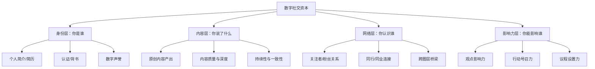
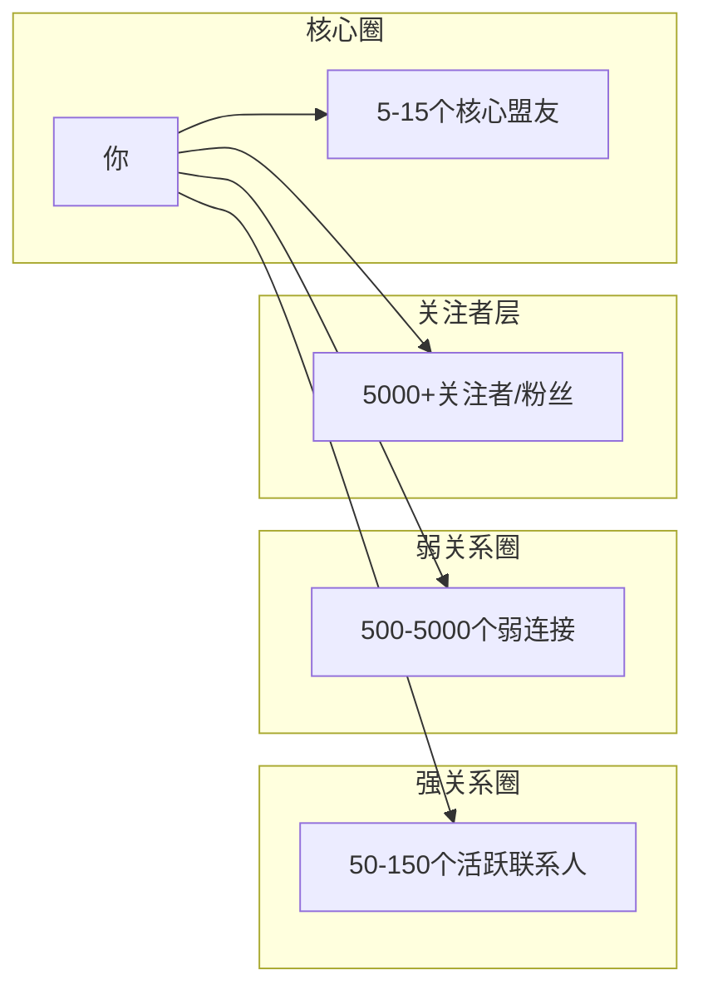

## 八、社交资本的数字化转型

社交资本从来不是一个静态概念。当人类的主要社交场景从线下茶馆、会议室迁移到微信、LinkedIn、Twitter（X）和各类垂直社区时，社交资本的积累规则、变现路径和风险特征都发生了根本性变化。本节系统阐述社交资本在数字时代的运作逻辑，帮助你在虚拟世界中建立真实的人脉资产。

### 1. 为什么社交资本必须数字化转型

#### 1.1 社交场景的根本迁移

2015年之前，一次行业会议的名片交换是拓展人脉的核心动作。到2025年，全球超过50亿人使用社交媒体，中国网民规模超过10.9亿（CNNIC第55次报告），人均每日社交媒体使用时长超过2.5小时。社交的主战场已经彻底转移到线上。

这意味着一个残酷的现实：**如果你的社交资本无法在数字空间中被看见、被检索、被验证，它就等于不存在。**

#### 1.2 数字社交资本的独特属性

线下社交资本与数字社交资本的核心差异如下：

| 维度 | 线下社交资本 | 数字社交资本 |
|------|------------|------------|
| 积累速度 | 慢，依赖面对面互动 | 快，一次内容可触达数千人 |
| 可见性 | 低，只有当事人知道 | 高，公开可查证 |
| 可复制性 | 不可复制，人走茶凉 | 可复制，内容持续产生价值 |
| 信任建立 | 基于长期相处 | 基于内容质量+社交证明 |
| 地域限制 | 强，受限于物理空间 | 弱，全球可达 |
| 存储方式 | 人脑记忆，易遗忘 | 数字足迹，持久可检索 |
| 变现路径 | 间接，难以量化 | 直接，可追踪转化 |

#### 1.3 不转型的代价

忽视数字社交资本的人会面临三重损失：

**第一，机会成本。** 招聘方在面试前会搜索候选人的LinkedIn和GitHub；投资人在见创始人前会查看其社交媒体影响力；合作伙伴在签约前会调查对方的线上声誉。如果你在这些平台上是一片空白，你已经在竞争中落后了。

**第二，杠杆缺失。** 线下社交是线性的——你一天最多见10个人。数字社交是指数级的——一条高质量推文可以触达10万人。没有数字杠杆，你的人脉扩展速度被物理定律锁死。

**第三，脆弱性。** 纯线下社交网络极其脆弱。换城市、换行业、换手机，大量关系就会断裂。数字社交网络具有韧性——即使多年不联系，通过社交媒体仍然可以重新激活。

### 2. 数字社交资本的构成模型

数字社交资本不是简单的"粉丝数"。它由四个相互关联的层次构成：



#### 2.1 身份层：数字身份的建立与管理

**核心任务：让别人在搜索你时，看到一个专业、可信、一致的形象。**

数字身份由以下要素构成：

**基础要素：**
- **姓名一致性**：在所有平台使用相同或高度相似的名称，降低搜索摩擦。如果你叫张伟，可以在所有平台统一用"张伟-产品经理"或英文名+中文名的组合
- **头像专业性**：使用高质量个人照片或品牌Logo。研究表明，有清晰头像的LinkedIn个人资料获得的浏览量是无头像的21倍
- **简介精准性**：用一句话说清楚你是谁、做什么、能提供什么价值。避免模糊的"热爱生活"之类的废话

**进阶要素：**
- **权威认证**：平台认证标识（微博蓝V、知乎认证、LinkedIn技能背书）
- **数字简历**：完整的教育和工作经历，项目成果，推荐信
- **跨平台互链**：在不同平台之间建立链接，形成数字身份矩阵

**实操模板——个人简介框架：**

```text
[身份标签] + [核心能力] + [过往成果] + [当前关注] + [联系方式]

示例：
高级数据分析师 | 10年金融行业数据建模经验
曾主导某银行风控模型升级，坏账率降低23%
当前关注：AI在金融风控中的应用
合作联系：xxx@email.com
```

#### 2.2 内容层：数字社交资本的核心引擎

内容是数字社交资本的"货币"。你产出的内容决定了别人如何认知你的专业水平。

**内容产出的三个层次：**

| 层次 | 内容类型 | 社交资本增益 | 示例 |
|------|---------|------------|------|
| 转发层 | 转发他人内容+简短评论 | 低，证明你在关注行业动态 | 转发一篇论文+一句话点评 |
| 观点层 | 对行业话题发表独立见解 | 中，展示思考能力 | "我认为XX技术的真正瓶颈不在算法，而在数据质量" |
| 原创层 | 深度分析、教程、研究报告 | 高，建立专家形象 | 一篇5000字的行业深度分析 |

**高质量内容的生产公式：**

```text
高价值内容 = 真实经验 × 独特视角 × 清晰表达 × 实用价值
```

具体来说：

- **真实经验**：分享你亲身经历的案例，而非道听途说。"我在某项目中踩过的坑"比"据说某公司踩过坑"有说服力得多
- **独特视角**：同一件事，你能看到别人看不到的角度。这需要深厚的专业积累和跨学科思维
- **清晰表达**：用结构化的方式呈现信息。善用标题、列表、图表、代码块
- **实用价值**：读者看完你的内容后能直接采取行动。提供工具、模板、方法论，而非空洞的观点

**内容日历模板（以技术人为例）：**

```text
周一：行业新闻解读（300字短评）
周三：技术教程/实战经验（1500-3000字深度文）
周五：行业思考/观点碰撞（500-1000字短文）
周日：本周学习总结/书评（500字）
```

#### 2.3 网络层：数字人脉的拓扑结构

数字社交网络不是均匀的——它有清晰的拓扑结构，理解这个结构能帮你更高效地积累社交资本。



**各圈层的特征和经营策略：**

**核心盟友（5-15人）：**
- 定义：互相深度信任、愿意为对方背书、定期深度交流的人
- 数字化策略：私聊群、定期视频通话、共同项目协作
- 关键动作：每周至少一次深度交流（不限于文字，最好语音或视频）

**活跃联系人（50-150人）：**
- 定义：行业同行，互相了解对方的工作，偶尔合作
- 数字化策略：朋友圈互动、行业群交流、偶尔私聊
- 关键动作：定期点赞评论，分享对方有价值的内容，主动介绍匹配的人脉

**弱连接（500-5000人）：**
- 定义：你认识但不熟的人，通过一两个共同朋友连接
- 数字化策略：关注但不频繁互动，定期浏览其动态获取信息
- 关键动作：在对方发布重要内容时给予回应，在需要时发送精准的消息

**关注者/粉丝（5000+）：**
- 定义：因你的内容关注你，但你不一定认识他们
- 数字化策略：持续产出高质量内容，建立单向影响力
- 关键动作：保持内容质量和发布频率，通过互动将部分关注者转化为弱连接

#### 2.4 影响力层：从关注到行动

影响力是数字社交资本的最高形态。它意味着你不仅能被看见，还能驱动他人的行为。

**影响力金字塔：**

```text
            ┌─────────┐
            │ 信任     │ ← 别人愿意把钱/机会交给你
            │ 驱动行动  │
            ├─────────┤
            │ 认同     │ ← 别人认同你的价值观和判断
            │ 建立偏好  │
            ├─────────┤
            │ 关注     │ ← 别人愿意花时间看你说了什么
            │ 获取注意力│
            ├─────────┤
            │ 认知     │ ← 别人知道你是谁
            │ 建立存在感│
            └─────────┘
```

从底层到顶层的转化需要时间，但有明确的路径：

1. **认知→关注**：持续产出与目标受众痛点相关的内容
2. **关注→认同**：在关键议题上展现一致性，言行合一
3. **认同→信任**：交付过实际成果，有可查证的成功案例

### 3. 主流平台的社交资本运营策略

不同平台有不同的规则和用户群体，盲目全平台铺开是低效的。以下是核心平台的运营策略：

#### 3.1 微信生态

微信是中国最复杂的社交资本平台，它融合了即时通讯、社交媒体、内容分发和商业交易。

**朋友圈经营：**
- **发布频率**：每天1-3条为宜，过少缺乏存在感，过多引起反感
- **内容比例**：专业内容60% + 个人生活20% + 行业资讯10% + 互动提问10%
- **发布时间**：早8-9点（通勤）、午12-13点（午休）、晚20-22点（睡前）
- **关键细节**：发长文时前几行必须有吸引力，因为朋友圈只显示前几行

**微信公众号/视频号：**
- 公众号适合深度内容（长文、研究报告、教程）
- 视频号适合个人品牌展示和快速触达
- 两者互补：公众号建立专业深度，视频号建立人格化连接

**微信群经营：**
- 加入行业群，但不要潜水——每周至少贡献1-2条有价值的发言
- 创建自己的主题群，提供持续价值（资料分享、话题讨论、资源对接）
- 群主的社交资本远高于群成员——建群比加群更有价值

#### 3.2 LinkedIn

LinkedIn是全球最专业的职业社交平台，在跨国企业、海外华人圈和高端人才市场中权重极高。

**个人资料优化清单：**
- 标题（Headline）：不要只写职位名称，写清楚你能解决什么问题
- 摘要（About）：用第一人称讲故事，包含关键词，便于搜索
- 经历（Experience）：每段经历写明具体成果，用数据量化
- 技能（Skills）：至少列出10项核心技能，争取同事背书
- 推荐（Recommendations）：主动请3-5位同事/客户写推荐

**内容策略：**
- 每周发布2-3个帖子（文字+图片效果最好）
- 使用英文+中文双语（扩大触达范围）
- 参与行业话题讨论，对热门帖子发表见解
- 主动连接目标人脉时附上个性化消息，不要用默认模板

#### 3.3 知乎/行业垂直平台

知乎在中国互联网知识社区中占据独特位置——它是"深度内容"和"搜索引擎友好"的结合体。

**知乎运营策略：**
- 回答问题时写长文、有深度、带案例——知乎算法偏爱长内容
- 选择与你专业领域高度相关的问题回答，建立垂直权威
- 知乎回答具有长尾效应——一个好答案可以持续获得流量数年
- 创建专栏系统化输出你的知识体系

**垂直平台选择：**
- 技术人：GitHub（代码贡献）、掘金/CSDN（技术博客）、Stack Overflow
- 设计师：Dribbble、Behance
- 金融人：雪球、东方财富
- 营销人：数英、梅花网
- 产品经理：人人都是产品经理、ProductHunt

#### 3.4 Twitter/X

Twitter是全球信息流速最快的社交平台，适合建立行业影响力和获取前沿信息。

**运营策略：**
- 发布短观点（Thread形式的长线程更佳）
- 积极参与行业KOL的讨论
- 利用列表（Lists）功能分类管理关注对象
- 英文内容触达全球，中文内容触达华语圈——根据目标受众选择语言

### 4. 数字社交资本的量化与评估

"无法量化的东西无法管理。"数字社交资本同样需要可衡量的指标体系。

#### 4.1 核心评估指标

| 维度 | 指标 | 计算方式 | 健康基准 |
|------|------|---------|---------|
| 存在感 | 搜索可见度 | 搜索你的名字时前3页出现的平台数量 | ≥3个平台 |
| 影响力 | 内容互动率 | (点赞+评论+转发) / 展示量 | ≥3% |
| 网络质量 | 强关系比例 | 核心盟友数 / 总联系人数 | ≥5% |
| 专业认可 | 行业背书数 | LinkedIn技能背书+推荐信+合作邀请 | 持续增长 |
| 信任度 | 主动连接率 | 别人主动添加你的数量 / 你主动添加的数量 | ≥0.5 |
| 变现能力 | 机会转化率 | 通过线上人脉获得的机会 / 总机会数 | 持续提升 |

#### 4.2 数字社交资本自评工具

用以下框架对自己的数字社交资本进行打分（每项1-5分）：

```text
数字社交资本自评表

A. 身份层
   A1. 所有主要平台的个人资料是否完整且一致？     [  /5]
   A2. 搜索你的名字时，结果是否正面且专业？       [  /5]
   A3. 你是否有行业认证或平台认证？             [  /5]

B. 内容层
   B1. 你是否定期产出原创专业内容？             [  /5]
   B2. 你的内容是否获得目标受众的积极反馈？        [  /5]
   B3. 你的内容是否形成了系统的知识体系？         [  /5]

C. 网络层
   C1. 你的核心盟友圈是否有5个以上深度信任的人？    [  /5]
   C2. 你是否有跨行业、跨圈层的人脉连接？         [  /5]
   C3. 你是否定期维护和更新你的人脉网络？         [  /5]

D. 影响力层
   D1. 你是否被认为是所在领域的专家？            [  /5]
   D2. 你的推荐或建议是否能影响他人的决策？        [  /5]
   D3. 你是否能通过线上影响力驱动实际合作或机会？    [  /5]

总分：/60
48-60：数字社交资本优秀
36-47：数字社交资本良好，有明确提升空间
24-35：数字社交资本一般，需要系统性建设
<24：数字社交资本薄弱，需要立即行动
```

### 5. 数字社交资本的变现路径

数字社交资本不是自娱自乐的数字游戏，它有清晰的变现路径：

#### 5.1 直接变现

**咨询与服务：**
当你的线上影响力达到一定水平后，会有人主动付费获取你的专业建议。定价可以参考市场行情和你的稀缺性——行业垂直领域的专家咨询费通常在每小时500-5000元。

**内容付费：**
知识星球、付费专栏、在线课程。关键是要提供独家价值——免费内容建立信任，付费内容提供深度和个性化。

**社群运营：**
运营付费社群，提供持续的资源对接、信息筛选和深度交流。一个500人的高质量付费社群，年费200元，年收入10万元——这还不算社群带来的其他机会。

#### 5.2 间接变现

**职业机会：**
数字社交资本最常见也最高价值的变现方式。研究表明（LinkedIn 2024年数据），超过70%的专业人士通过社交网络获得过职业机会。一个活跃的LinkedIn个人资料平均每年收到3-5个猎头联系。

**商业合作：**
品牌合作、联合项目、资源共享。这些都是基于你在线上建立的信任和影响力自然产生的机会。

**信息优势：**
通过高质量的人脉网络获取行业前沿信息、投资机会和市场趋势。这种信息优势往往是决定性——很多投资决策和商业机会都源于"提前知道了一条信息"。

#### 5.3 变现的注意事项

**避免过早变现：** 在信任尚未建立时急于变现会摧毁你的社交资本。内容质量和人脉关系必须先于商业变现。

**保持价值交换的平衡：** 80%的价值应该免费输出，20%进行商业化。如果比例倒过来，你的信任度会迅速下降。

**透明化商业行为：** 如果推荐产品或服务涉及佣金，务必披露。隐瞒利益关系一旦被发现，对数字声誉的打击是毁灭性的。

### 6. 数字社交资本的风险管理

数字化在放大社交资本的同时，也放大了风险。一次不当言论可能在几小时内毁掉多年积累的声誉。

#### 6.1 主要风险类型

**声誉风险：**
- 旧帖被翻出：互联网有记忆，十年前的不当言论可能被挖出
- 断章取义：你的话被脱离上下文传播，产生歧义
- 关联风险：你关注/互动的人出了问题，你受到牵连

**隐私风险：**
- 过度暴露个人信息导致精准诈骗
- 职业信息泄露导致竞争对手挖角
- 个人生活信息被恶意利用

**平台风险：**
- 平台政策变化导致内容被删除或限流
- 平台倒闭导致社交资产归零
- 算法变化导致影响力骤降

#### 6.2 风险防控策略

**声誉风险防控：**
- 定期清理历史内容（至少每年一次），删除可能引起争议的帖子
- 发布敏感话题前先问自己：如果这条内容被截图传播到所有平台，我能承受后果吗？
- 建立危机应对预案——如果出了问题，24小时内应该如何回应

**隐私风险防控：**
- 使用不同邮箱区分工作和个人账号
- 敏感信息（住址、电话、身份证号）绝不公开发布
- 定期检查各平台的隐私设置

**平台风险防控：**
- **不要把所有鸡蛋放在一个篮子里**——至少在3个平台建立存在感
- 定期备份自己的内容（微信公众号文章导出、Twitter存档）
- 建立独立域名的个人网站作为社交资本的"大本营"

#### 6.3 数字社交资本的备份策略

```text
数字社交资产备份清单：

□ 个人网站（独立域名+托管）
  - 完整的内容备份
  - 个人简介和作品集
  - 联系方式和社交链接

□ 内容备份
  - 微信公众号文章（定期导出HTML）
  - 知乎回答和文章（本地备份）
  - Twitter/X帖子（使用Twitter存档功能）
  - GitHub项目（本地仓库镜像）

□ 联系人备份
  - LinkedIn联系人导出（CSV格式）
  - 微信重要联系人信息（手动维护联系人表）
  - 邮件通讯录定期导出

□ 备份频率：至少每季度一次
□ 存储位置：本地硬盘 + 云存储双备份
```

### 7. AI时代的数字社交资本新趋势

#### 7.1 AI对数字社交资本的冲击

**内容生产门槛降低：** ChatGPT等工具让任何人都能快速产出"看起来专业"的内容。这意味着单纯的文字内容不再是稀缺资源，真正的稀缺性转移到了以下方面：
- 独特的真实经验和案例
- 基于深度实践的判断力
- 建立在信任基础上的人际关系

**AI辅助社交管理：** AI工具正在被用于：
- 自动化社交媒体发布和互动
- 识别高价值人脉和互动机会
- 分析内容表现并优化策略

**但AI无法替代的是：**
- 真实的人际信任
- 基于亲身经历的洞察
- 在关键时刻为他人背书的信用

#### 7.2 应对策略

- **强化"人"的属性**：分享真实故事、展示独特个性、表达真诚观点——这些是AI无法复制的
- **建立线下验证**：数字社交资本需要线下验证来巩固。定期参加线下活动，将线上关系转化为线下关系
- **深度优于广度**：在信息过载的时代，深度思考和独特见解比高频输出更有价值
- **拥抱AI工具，但保持人格化**：用AI提升效率，但最终输出必须带有你的个人印记

### 8. 实操案例：从零开始的数字社交资本建设

#### 案例：一个技术从业者的6个月数字社交资本建设

**起点状态：**
- 工作5年的后端开发工程师
- 没有任何线上内容产出
- LinkedIn个人资料空白
- 微信好友200人，主要是同事和同学

**执行计划与结果：**

| 阶段 | 时间 | 行动 | 结果 |
|------|------|------|------|
| 基础建设 | 第1-2周 | 完善LinkedIn资料，注册知乎账号，开公众号 | 搜索可见度从0提升到3个平台 |
| 内容启动 | 第1-2月 | 每周写1篇技术文章，同步发布知乎+公众号 | 知乎获得100+关注，公众号50+订阅 |
| 网络拓展 | 第2-3月 | 主动连接50位行业同行，参加2个技术社群 | LinkedIn连接数从30增长到200 |
| 深度输出 | 第3-4月 | 发布一篇行业深度分析文章（5000字） | 文章被多个大V转发，获得3000+阅读 |
| 影响力建立 | 第4-5月 | 被邀请做线上技术分享，收到3个猎头联系 | 确立了细分领域的专家形象 |
| 变现启动 | 第5-6月 | 开始接技术咨询，受邀参与行业报告撰写 | 第一笔咨询收入，新的职业机会 |

**关键数据变化：**
- LinkedIn浏览量：从每月50次增长到每月2000次
- 微信好友：从200人增长到800人（主动添加vs被动接受比例为1:1.2）
- 行业活动邀请：从0次/月增长到2-3次/月
- 猎头联系：从0次/季度增长到3-5次/季度

### 9. 常见误区与纠正

**误区1："粉丝数等于社交资本"**

纠正：10万僵尸粉不如1000个活跃的行业同行。关注数字社交资本的质量（互动率、关系深度、信任程度），而非数量。

**误区2："我要在所有平台都建立存在感"**

纠正：与其全面平庸，不如在一个平台做到头部。先集中精力在一个最适合你的平台建立影响力，再逐步扩展。

**误区3："只要内容好，自然会有人关注"**

纠正：酒香也怕巷子深。好的内容需要配合主动的推广策略——分享到社群、@相关人士、参与热门话题讨论。

**误区4："线上社交是虚假的，不如线下真实"**

纠正：线上和线下社交不是对立的，而是互补的。线上提供效率和广度，线下提供深度和信任。最理想的状态是线上认识→线下验证→线上维护。

**误区5："社交资本建设可以一劳永逸"**

纠正：数字社交资本需要持续维护。停止内容产出3个月以上，你的影响力会显著下降。人脉关系需要定期"浇水"——互动、问候、价值交换。

### 10. 进阶：构建个人数字社交资本操作系统

当你完成了基础建设后，应该建立一套系统化的"数字社交资本操作系统"（Digital Social Capital OS），将碎片化的运营动作整合为可持续运转的体系。

#### 10.1 系统架构

```text
┌─────────────────────────────────────────────┐
│           数字社交资本操作系统                  │
├─────────────┬──────────────┬────────────────┤
│   输入层     │    处理层     │    输出层       │
├─────────────┼──────────────┼────────────────┤
│ 行业信息流   │ 内容加工     │ 多平台分发      │
│ 人脉动态     │ 关系维护     │ 精准互动        │
│ 个人成长     │ 价值提炼     │ 机会转化        │
├─────────────┴──────────────┴────────────────┤
│           底层：个人品牌定位                    │
│      持续积累的数字资产（内容+关系+信任）        │
└─────────────────────────────────────────────┘
```

#### 10.2 每日/每周/每月运营节奏

**每日（15分钟）：**
- 浏览行业信息流，记录有价值的信息
- 回复评论和私信
- 在1-2个社群中进行有价值发言

**每周（2-3小时）：**
- 产出1-2篇原创内容
- 主动联系3-5位人脉（问候、分享、请教）
- 更新1个平台的个人资料或作品集

**每月（半天）：**
- 复盘内容表现数据
- 清理和整理人脉列表
- 规划下月内容主题
- 备份数字资产

**每季度（1天）：**
- 评估数字社交资本整体状态
- 调整平台策略和内容方向
- 参加1-2个线下活动强化关键关系
- 全面备份数字资产

这套系统的核心思想是：**数字社交资本不是一次性工程，而是一个持续运转的系统。** 你需要的不是偶尔发几条朋友圈，而是一套能够长期稳定运转的机制，让你的数字社交资产持续增长、持续产生价值。
