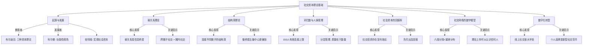
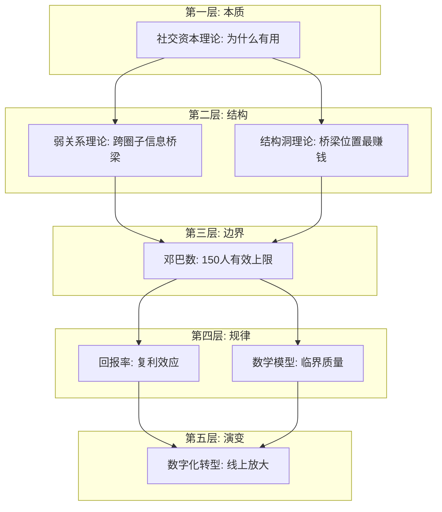

## 九、本节总结

### 1. 理论基础全景回顾

本节从七个维度构建了社交资本的完整理论框架。从布尔迪厄提出"社交资本"概念的学术起源，到数字时代社交网络的运作模型，我们完成了一次从"道"到"器"的认知升级。在进入实操环节之前，有必要将这些分散的理论知识点串联成一张完整的认知地图。

### 2. 七大理论核心要点速查

下表汇总了本节每个理论的核心观点、关键数据和对搞钱的直接启示：

| 理论 | 一句话总结 | 关键数据/事实 | 搞钱启示 |
|------|-----------|--------------|----------|
| 社交资本理论起源 | 社交资本是一种可变现的关系资源，与经济资本、文化资本可互相转化 | 布尔迪厄（1986）首次系统阐述；哈佛85年追踪研究证实人际关系是幸福感和财富的首要因素 | 提升专业能力（文化资本）是扩大社交资本的前提——没有价值输出能力，社交技巧再好也是空中楼阁 |
| 弱关系理论 | 不太熟的人反而比亲密朋友带来更多机会 | 格兰诺维特1973年研究：56%的人通过弱关系找到工作；LinkedIn 2022年数据：二度人脉工作机会比一度多60% | 刻意拓展跨领域弱关系，不要只在同一圈子里社交 |
| 结构洞理论 | 连接不同社交圈的人（桥梁位置）比圈内核心人物更赚钱 | 伯特研究：占据结构洞位置的员工薪酬高22%、晋升速度快18% | 有意识地成为不同圈子之间的连接者，而非某个圈子的中心 |
| 邓巴数与人脉管理 | 人的认知能力限制了有效社交网络的上限（约150人） | 邓巴数150人上限；五层关系圈：5（亲密）→15（好友）→50（朋友）→150（熟人）→500-1500（泛泛之交） | 分层管理人脉，把有限精力集中在高价值关系上 |
| 社会资本的回报率 | 社交是投资而非消费，存在复利效应 | 社交投资回报率 = (机会价值+信息价值+支持价值) / (时间成本+金钱成本+精力成本) | 精准社交+价值先行+利用杠杆效应提高回报率 |
| 社交网络数学模型 | 社交网络遵循幂律分布，存在网络效应和临界质量 | 六度分隔（LinkedIn已缩短到3.5度）；幂律分布：少数人拥有大量连接；临界质量约150个有效连接 | 耐心积累到临界质量后，机会会呈指数级增长 |
| 数字化转型 | 线上社交放大了社交资本的半径和效率，个人品牌成为新型社交货币 | 数字身份、内容输出、社交媒体运营正在重塑社交资本的积累方式 | 利用内容输出建立个人品牌，让机会主动找上门 |

### 3. 理论之间的内在逻辑

这七个理论不是孤立的知识点，而是相互支撑、层层递进的逻辑体系。理解它们之间的关系，比单独记忆每个理论更重要。

**第一层：社交资本的本质（为什么有用）**

社交资本理论（布尔迪厄、科尔曼、帕特南）回答了最根本的问题：社交资本是什么？为什么它能转化为财富？答案是：社交资本通过信息差变现、资源整合、信任背书和认知升级四大机制，将人际关系转化为经济价值。这是一切后续理论的基石。

**第二层：社交资本的结构特征（如何分布）**

弱关系理论和结构洞理论从不同角度揭示了社交网络的结构规律。格兰诺维特告诉你"弱关系比强关系更有信息价值"，伯特告诉你"占据桥梁位置的人拥有信息和控制优势"。两个理论互补：弱关系理论解释了"为什么要拓展跨圈子人脉"，结构洞理论解释了"为什么桥梁位置最赚钱"。

**第三层：社交资本的管理边界（管多少）**

邓巴数设定了社交网络管理的物理上限。它告诉我们：人的认知资源是有限的，不可能无限拓展人脉。因此必须分层管理、差异化维护——这直接指导了后续核心技巧中"人脉管理工具与方法"的操作设计。

**第四层：社交资本的运作规律（怎么增长）**

社会资本回报率和社交网络数学模型揭示了社交资本的增长规律。复利效应告诉你"今天的小投入可能带来未来的大回报"；幂律分布和网络效应告诉你"积累到临界质量后机会会爆发式增长"。这两个理论共同构成了"长期主义社交策略"的理论依据。

**第五层：社交资本的时代演变（怎么适应）**

数字化转型理论将经典理论放到数字时代的语境中重新审视。线上社交如何改变了弱关系的形成方式？数字身份如何成为新的结构洞？个人品牌如何放大社交资本的半径？这些问题是经典理论在新时代的延伸。

### 4. 从理论到行动的转化框架

理论的价值在于指导行动。以下是将七大理论转化为具体行动策略的映射表：

| 理论 | 行动策略 | 具体做法 | 优先级 |
|------|----------|----------|--------|
| 社交资本理论 | 提升自身价值 | 深耕专业领域，成为某个领域的"值得认识的人" | ★★★★★ |
| 弱关系理论 | 拓展跨领域社交 | 每月参加1-2个非本行业的活动或社群 | ★★★★★ |
| 结构洞理论 | 成为桥梁 | 有意识地介绍不同圈子的人互相认识 | ★★★★☆ |
| 邓巴数 | 分层管理人脉 | 绘制人脉地图，标注每段关系的层级和维护频率 | ★★★★☆ |
| 回报率理论 | 先付出后回报 | 每周主动帮助1-2个人，不求即时回报 | ★★★★☆ |
| 数学模型 | 积累到临界质量 | 系统化拓展人脉，记录和追踪关系进展 | ★★★☆☆ |
| 数字化转型 | 建立个人品牌 | 定期输出专业内容，维护线上专业形象 | ★★★☆☆ |

### 5. 常见认知偏差与纠正

在学习社交资本理论的过程中，读者容易产生以下认知偏差：

**偏差一："弱关系有用，强关系没用"**

格兰诺维特的弱关系理论被过度简化后，很多人误以为应该放弃强关系、只经营弱关系。事实是：强关系提供情感支持和深度合作，弱关系提供信息和新机会。两者缺一不可。正确的理解是：在拓展新机会时，弱关系更有效；在深度合作和情感支持方面，强关系不可替代。

**偏差二："我要成为所有圈子的中心"**

结构洞理论强调的是"桥梁"位置而非"中心"位置。成为某个圈子的中心意味着你被大量同质化的关系包围，反而容易陷入信息茧房。真正的优势来自于连接不同圈子——你是A圈子和B圈子之间唯一的桥梁，这个位置比任何一个圈子的中心都更有价值。

**偏差三："150人就够了"**

邓巴数150人是有效维护关系的上限，不是社交网络的总规模。你的弱关系网络（认识但不常联系的人）可以远远超过150人。邓巴数的真正启示是：你需要对关系进行分层管理，把有限的精力集中在最重要的5-15个核心关系上，而不是平均分配给所有人。

**偏差四："社交是消费，不是投资"**

很多人把社交活动（请客、参加活动、送礼）视为纯粹的开销。从社会资本回报率的角度看，这些是投资而非消费——前提是你有策略地社交，而不是漫无目的地应酬。关键区分在于：有明确目的和策略的社交是投资，无目的的应酬是消费。

**偏差五："线上社交不是真正的社交"**

在数字化时代，线上社交已经成为社交资本积累的重要渠道。LinkedIn上的一个专业评论可能比线下递一张名片更有效。关键不在于线上还是线下，而在于你是否提供了真实的价值、建立了真实的信任。线上社交和线下社交不是对立的，而是互补的。

### 6. 关键公式与模型汇总

本节涉及的核心量化模型，方便读者随时查阅：

**社交资本三维模型（Nahapiet & Ghoshal, 1998）**

| 维度 | 定义 | 衡量指标 |
|------|------|----------|
| 结构维度 | 网络的形态和连接方式 | 网络规模、连接密度、中心性、结构洞数量 |
| 关系维度 | 关系的质量和深度 | 信任程度、互惠规范、认同感、情感强度 |
| 认知维度 | 共享的语言、符号和愿景 | 共同语言、共享愿景、价值观一致性 |

**社交投资回报率公式**

> 社交投资回报率 = (机会价值 + 信息价值 + 支持价值) / (时间成本 + 金钱成本 + 精力成本)

**邓巴数分层模型**

| 层级 | 人数 | 维护频率 | 关系特征 | 投入占比 |
|------|------|----------|----------|----------|
| 核心圈 | 5人 | 每天 | 无条件信任、情感依赖 | 40% |
| 亲密圈 | 15人 | 每周 | 深度了解、相互支持 | 25% |
| 朋友圈 | 50人 | 每月 | 有一定了解、业务往来 | 20% |
| 熟人圈 | 150人 | 每季 | 能叫出名字、信息交换 | 10% |
| 泛交圈 | 500-1500人 | 按需 | 认识但不太了解 | 5% |

**六度分隔到三度连接的演变**

| 平台/场景 | 平均分隔度 | 数据来源 |
|-----------|-----------|----------|
| 线下社会 | 6度 | Milgram 1967年实验 |
| MSN用户 | 6.6度 | 微软 2008年研究 |
| Facebook用户 | 4.7度 | Facebook 2016年研究 |
| LinkedIn用户 | 3.5度 | LinkedIn 2022年数据 |

数字时代的信息传播效率使社交距离持续缩短，这意味着拓展高质量人脉的路径比历史上任何时期都更短、更高效。

### 7. 本节学习自测

完成理论基础的学习后，用以下问题检验自己的理解程度：

**基础层（能回答说明你理解了基本概念）**
- 什么是社交资本？它与经济资本、文化资本的关系是什么？
- 什么是弱关系？为什么弱关系比强关系带来更多机会？
- 什么是结构洞？占据结构洞位置有什么优势？
- 邓巴数是多少？它对人脉管理有什么启示？

**进阶层（能回答说明你理解了理论的内在逻辑）**
- 弱关系理论和结构洞理论有什么联系和区别？
- 社交资本的复利效应是如何产生的？
- 为什么社交网络的连接分布遵循幂律法则？
- 数字化转型如何改变了社交资本的积累方式？

**应用层（能回答说明你能将理论转化为行动）**
- 如何利用弱关系理论指导自己的社交策略？
- 如何识别自己在社交网络中的位置（中心、边缘还是桥梁）？
- 如何根据邓巴数设计自己的人脉分层管理方案？
- 如何计算一段社交关系的投资回报率？

### 8. 进入下一节的衔接

理论基础为我们建立了"为什么要经营人脉"和"人脉如何运作"的认知框架。接下来的核心技巧部分，将进入"怎么做"的实操层面——从人脉建立的五个层次，到高效社交的七个习惯，再到高价值人脉的识别与接近，每一步都有具体的操作方法和可执行的流程。

如果你对某个理论概念还不清楚，建议回头重读对应的小节，特别是弱关系理论和结构洞理论——这两个理论是后续所有实操方法的底层逻辑，理解透彻了，后面的技巧学习会事半功倍。

> **一句话总结：社交资本的本质是可变现的关系资源，它的价值遵循复利效应增长，它的结构遵循幂律分布，它的管理需要尊重邓巴数的物理限制，它的未来正在被数字化重新定义。理解了这些底层规律，你的人脉经营就不再是碰运气，而是一门可以系统化运作的科学。**
