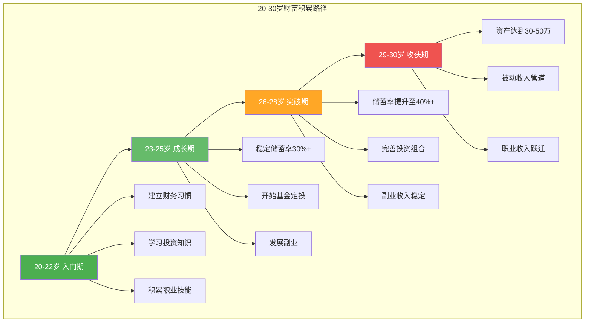

# 第十七章：20-30岁：积累期

> "年轻人最大的资本不是金钱，而是时间和可能性。" —— 沃伦·巴菲特

20-30岁是人生中最关键的十年。在这个阶段，你的收入可能不高，但你拥有最宝贵的资源——时间、精力和无限的可能性。这一章将为你提供一套系统的搞钱策略，帮助你在积累期打好财务基础，为未来的财富增长奠定坚实的基础。

***## 17.1 阶段特点分析

### 17.1.1 收入较低，但增长潜力大

**收入现状**：
- 应届毕业生平均月薪：5000-8000元（一线城市）
- 工作3-5年后：月薪可达10000-20000元
- 工作5-8年后：月薪可达20000-50000元

**增长潜力**：
- 技能提升带来的薪资增长
- 职位晋升带来的收入跃迁
- 跳槽带来的薪资涨幅（通常20-50%）
- 副业和投资带来的额外收入

**关键认知**：不要只看眼前的收入水平，要看未来的增长潜力。20-30岁的核心任务是提升自己的价值，而不是追求短期的高收入。

### 17.1.2 时间充裕，试错成本低

**时间优势**：
- 没有家庭负担，时间自由度高
- 精力充沛，学习能力强
- 可以尝试多种方向，找到最适合自己的道路

**试错成本**：
- 经济成本：年轻时损失几万元，影响不大
- 时间成本：即使走弯路，也有足够的时间纠正
- 机会成本：年轻时放弃的机会，未来还会有很多

**关键认知**：不要害怕失败，年轻时的失败是最好的学习机会。每一次失败都是一次宝贵的经验积累。

### 17.1.3 学习能力强，接受新事物快

**学习优势**：
- 大脑可塑性强，学习新知识速度快
- 对新技术、新趋势的接受度高
- 有时间和精力进行系统学习

**学习方向**：
- 专业技能：提升核心竞争力
- 通用技能：如沟通、写作、演讲
- 投资知识：为未来的财富增长做准备
- 行业知识：了解行业趋势和发展方向

### 17.1.4 负担较轻，风险承受能力强

**负担情况**：
- 通常没有房贷、车贷等大额负债
- 家庭责任较轻，经济压力较小
- 可以承受较高的投资风险

**风险承受能力**：
- 可以将更多资金投入高风险高收益的投资
- 可以尝试创业或副业
- 可以承受短期的收入波动

***## 17.2 核心策略

### 17.2.1 投资自己：最高效的财富增长方式

在20-30岁这个阶段，投资自己是回报率最高的投资。以下是几个关键的投资方向：

**技能学习与提升**

1. **硬技能**：
   - 编程：Python、Java、JavaScript等
   - 数据分析：Excel、SQL、Python数据分析
   - 设计：UI/UX设计、平面设计
   - 外语：英语、日语等

2. **软技能**：
   - 沟通能力：表达清晰、善于倾听
   - 写作能力：逻辑清晰、文字优美
   - 演讲能力：自信表达、感染力强
   - 领导力：团队管理、项目管理

3. **学习方法**：
   - 系统学习：通过课程、书籍进行系统学习
   - 实践学习：通过项目、实习进行实践学习
   - 向高手学习：找行业内的高手请教和学习
   - 输出倒逼输入：通过写作、分享来巩固学习成果

**职业规划与发展**

1. **职业定位**：
   - 了解自己的兴趣、能力和价值观
   - 研究行业趋势和就业前景
   - 确定自己的职业方向和发展目标

2. **职业发展路径**：
   - 技术路线：深耕专业技能，成为技术专家
   - 管理路线：提升领导力，走管理岗位
   - 复合路线：跨领域能力整合，成为复合型人才

3. **职业发展策略**：
   - 主动争取机会：不要等待机会，主动争取
   - 建立个人品牌：在行业内建立自己的影响力
   - 持续学习：保持学习，跟上行业发展趋势

**人脉积累**

1. **行业人脉**：
   - 参加行业活动和会议
   - 加入行业协会和社群
   - 与同行建立联系和交流

2. **导师关系**：
   - 寻找行业内的导师
   - 定期向导师请教和学习
   - 维护与导师的关系

3. **同事关系**：
   - 与同事建立良好的合作关系
   - 帮助同事解决问题
   - 建立信任和口碑

### 17.2.2 控制支出：建立良好的财务习惯

**预算管理**

1. **50/30/20法则**：
   - 50%用于必需支出：房租、饮食、交通等
   - 30%用于个人发展：学习、社交、娱乐等
   - 20%用于储蓄和投资

2. **记账习惯**：
   - 使用记账App记录每一笔支出
   - 每月复盘支出情况
   - 找出不必要的支出并减少

3. **消费陷阱**：
   - 避免冲动消费：购物前等待24小时
   - 避免攀比消费：不要为了面子而消费
   - 避免超前消费：谨慎使用信用卡和花呗

**建立应急基金**

1. **应急基金的重要性**：
   - 应对突发事件：如失业、疾病等
   - 避免被迫做出错误的财务决策
   - 提供心理安全感

2. **应急基金规模**：
   - 建议：3-6个月的生活费
   - 计算方法：月支出 × 3-6个月
   - 存放位置：货币基金或银行活期存款

3. **建立方法**：
   - 每月固定存入一部分收入
   - 将年终奖的一部分存入应急基金
   - 减少不必要的支出，增加储蓄

### 17.2.3 小额投资：开始你的投资之旅

**基金定投**

基金定投是20-30岁最适合的投资方式之一。它的优势在于：
- 门槛低：每月只需几百元
- 风险分散：通过定期定额投资，平滑市场波动
- 操作简单：设置自动扣款，无需频繁操作
- 长期收益：长期定投，收益可观

**定投策略**：

1. **选择基金**：
   - 指数基金：如沪深300、中证500
   - 主动基金：选择长期业绩优秀的基金经理
   - 行业基金：选择有发展前景的行业

2. **定投金额**：
   - 建议：每月收入的10-20%
   - 根据自己的收入情况调整
   - 随着收入增长逐步增加

3. **定投频率**：
   - 月定投：每月固定日期扣款
   - 周定投：每周固定日期扣款
   - 智能定投：根据市场情况调整定投金额

4. **止盈策略**：
   - 目标收益率止盈：如达到20%收益时止盈
   - 估值止盈：当市场估值过高时止盈
   - 分批止盈：分批卖出，锁定收益

**学习股票投资**

1. **学习路径**：
   - 入门阶段：学习基本概念和投资理念
   - 进阶阶段：学习分析方法和投资策略
   - 实战阶段：小额实践，积累经验
   - 精通阶段：形成自己的投资体系

2. **投资原则**：
   - 用闲钱投资：不要用生活费和应急基金投资
   - 分散投资：不要把所有资金投入一只股票
   - 长期持有：不要频繁交易，长期持有优质股票
   - 持续学习：不断学习和提升投资能力

3. **推荐学习资源**：
   - 书籍：《聪明的投资者》《漫步华尔街》《投资最重要的事》
   - 平台：雪球、东方财富、同花顺
   - 课程：CFA、基金从业资格考试教材

**尝试副业**

1. **副业选择原则**：
   - 与主业协同：副业能够提升主业能力
   - 边际成本递减：投入一次，多次收益
   - 可扩展性强：能够规模化发展
   - 风险可控：不会影响主业和生活

2. **推荐副业类型**：
   - 技能型：写作、设计、编程、翻译
   - 内容型：自媒体、短视频、知识付费
   - 平台型：电商、直播、社群运营
   - 投资型：理财、基金、股票

***## 17.3 具体行动方案

### 17.3.1 月度储蓄计划

**目标储蓄率**：30-50%

**储蓄分配**：
- 应急基金：10%（直到达到3-6个月生活费）
- 投资基金：50%（基金定投为主）
- 学习基金：20%（技能学习和提升）
- 社交基金：20%（人脉经营和社交活动）

**执行方法**：
1. 发工资后第一时间将储蓄部分转入专门账户
2. 设置自动转账，避免手动操作
3. 定期复盘储蓄情况，调整储蓄计划

### 17.3.2 投资配置建议

**推荐配置**：70%股票基金 + 30%债券基金

**具体方案**：

| 投资类型 | 配置比例 | 推荐产品 | 月投金额（以月入1万为例） |
|----------|----------|----------|--------------------------|
| 指数基金 | 40% | 沪深300ETF、中证500ETF | 1200元 |
| 主动基金 | 20% | 优秀基金经理管理的产品 | 600元 |
| 行业基金 | 10% | 科技、消费、医疗等行业基金 | 300元 |
| 债券基金 | 20% | 纯债基金、二级债基 | 600元 |
| 货币基金 | 10% | 余额宝、零钱通 | 300元 |

**定投执行**：
1. 选择1-2个平台进行定投（如支付宝、天天基金）
2. 设置每月固定日期自动扣款
3. 每季度复盘一次投资情况
4. 根据市场情况适当调整配置

### 17.3.3 副业选择建议

**根据技能类型选择副业**：

| 技能类型 | 推荐副业 | 预期收入 | 时间投入 |
|----------|----------|----------|----------|
| 写作 | 公众号投稿、自媒体、文案 | 1000-5000元/月 | 每周5-10小时 |
| 设计 | 平面设计、UI设计、视频剪辑 | 2000-8000元/月 | 每周10-20小时 |
| 编程 | 接单开发、技术咨询、开源项目 | 3000-10000元/月 | 每周10-20小时 |
| 翻译 | 笔译、口译、本地化 | 2000-6000元/月 | 每周10-15小时 |
| 教育 | 在线辅导、课程开发、知识付费 | 2000-8000元/月 | 每周5-15小时 |

**副业启动步骤**：
1. 评估自己的技能和资源
2. 选择1-2个适合的副业方向
3. 学习相关知识和技能
4. 小规模尝试，验证可行性
5. 逐步扩大规模，增加收入

### 17.3.4 学习目标设定

**年度学习目标**：
- 掌握1-2项可变现技能
- 阅读20-30本专业书籍
- 完成1-2个在线课程
- 参加3-5个行业活动

**月度学习计划**：
- 每周阅读1-2本书
- 每天学习1-2小时
- 每月完成1个学习项目
- 每季度总结学习成果

***## 17.4 常见误区与避坑指南

### 17.4.1 过度消费，月光族

**问题表现**：
- 收入全部用于消费，没有储蓄
- 追求品牌和面子，超前消费
- 没有预算管理，消费随意

**解决方案**：
1. 开始记账，了解自己的消费情况
2. 制定预算，控制不必要的支出
3. 设置自动储蓄，强制储蓄
4. 避免超前消费，谨慎使用信用卡

### 17.4.2 盲目跟风投资

**问题表现**：
- 听到别人赚钱就跟风投资
- 不了解投资产品就盲目购买
- 追涨杀跌，频繁交易

**解决方案**：
1. 先学习后投资，了解投资产品的风险和收益
2. 根据自己的风险承受能力选择投资产品
3. 制定投资计划，严格执行
4. 避免情绪化投资，保持理性

### 17.4.3 忽视职业发展

**问题表现**：
- 只关注短期收入，忽视长期发展
- 不愿意投资自己，学习新技能
- 没有职业规划，随波逐流

**解决方案**：
1. 制定职业规划，明确发展方向
2. 持续学习，提升专业能力
3. 主动争取机会，积累经验
4. 建立个人品牌，提升影响力

### 17.4.4 急于求成，追求暴富

**问题表现**：
- 希望快速致富，追求高收益
- 参与高风险投资，如炒币、期货
- 被各种"暴富"项目吸引

**解决方案**：
1. 树立正确的财富观，理解复利的力量
2. 避免高风险投资，选择稳健的投资方式
3. 保持耐心，长期积累
4. 警惕各种"暴富"陷阱

***## 17.5 案例：25岁程序员的搞钱之路

**背景**：
小李，25岁，计算机专业毕业，在一家互联网公司担任Java开发工程师，月薪15000元。

**搞钱策略**：

**第一年（24岁）：建立基础**
- 储蓄率：40%（每月6000元）
- 投资：每月定投3000元指数基金
- 学习：每天学习1小时，提升技术能力
- 副业：在技术社区写文章，积累影响力

**第二年（25岁）：能力提升**
- 储蓄率：45%（月薪涨到18000元，每月储蓄8100元）
- 投资：继续定投，增加投资金额到每月5000元
- 学习：完成系统架构师认证
- 副业：开始接外包项目，每月额外收入3000-5000元

**第三年（26岁）：收入增长**
- 储蓄率：50%（月薪涨到25000元，每月储蓄12500元）
- 投资：投资金额增加到每月8000元
- 学习：学习AI和机器学习
- 副业：开发了一个技术工具，开始产生被动收入

**成果**：
- 三年累计储蓄：约30万元
- 投资收益：约5万元
- 副业收入：约10万元
- 总资产：约45万元

**关键经验**：
1. 坚持储蓄和投资，养成良好的财务习惯
2. 持续学习，提升自己的价值
3. 发展副业，增加收入来源
4. 保持耐心，长期积累

***## 17.6 20-30岁搞钱的黄金法则

### 法则一：先投资自己，再投资市场

在20-30岁这个阶段，投资自己的回报率远高于投资市场。把时间和金钱花在提升自己的技能和能力上，是最明智的投资。

### 法则二：建立良好的财务习惯

养成记账、储蓄、预算管理的好习惯，这些习惯会让你受益终身。

### 法则三：开始投资，越早越好

复利的力量需要时间来发挥。越早开始投资，未来的收益就越大。

### 法则四：保持学习，持续成长

在这个快速变化的时代，只有不断学习，才能保持竞争力。

### 法则五：建立人脉，拓展机会

人脉是搞钱路上的重要杠杆。主动建立和维护人脉关系，能够为你带来更多的机会。

### 法则六：保持耐心，长期主义

财富积累是一个长期的过程，不要急于求成。保持耐心，坚持长期主义，最终会获得丰厚的回报。

***## 17.7 深度专题：20-30岁不可忽视的关键领域

### 17.7.1 薪资谈判：你的第一次财富杠杆

很多年轻人羞于谈钱，或者不知道如何谈判薪资。实际上，一次成功的薪资谈判，其终身价值可能超过你十年的理财收益。

**薪资谈判的时机**：
- 入职offer阶段：这是你议价能力最强的时刻
- 年度绩效评估后：用数据证明你的价值
- 承担更大职责时：晋升或接手新项目
- 收到外部offer时：谨慎使用，避免被贴上"不稳定"标签

**谈判前的准备工作**：

1. **市场调研**：通过Boss直聘、拉勾、脉脉等平台了解同岗位薪资范围
2. **量化你的价值**：整理你为公司创造的具体成果，用数据说话
   - 例如："我主导的项目为公司节省了30%的服务器成本"
   - 例如："我开发的功能使用户留存率提升了15%"
3. **设定三个数字**：理想薪资、可接受薪资、底线薪资
4. **准备BATNA**（最佳替代方案）：如果谈判失败，你的退路是什么

**谈判技巧**：
- **锚定效应**：先提出略高于你预期的数字，给对方还价空间
- **不要先报价**：如果可能，让对方先出价
- **关注总包**：基本工资、奖金、股票/期权、福利、培训机会都算
- **保持专业**：不要用威胁的语气，而是强调你对公司的价值
- **书面确认**：口头达成一致后，要求书面offer

**一个具体的例子**：

假设你收到一份offer，月薪15000元，但你的调研显示市场价是18000-22000元：

> "非常感谢您的offer，我对这个机会非常感兴趣。根据我对市场行情的了解以及我在XX项目中积累的经验，我期望的薪资在20000元左右。我相信我的能力能够为团队带来相应的价值，不知道是否有调整的空间？"

这次谈判如果成功将15000提升到18000，每年多出36000元。如果把这36000元每年投资，按年化8%的收益率，30年后将超过40万元。一次30分钟的谈判，价值40万。

### 17.7.2 信用体系建设：你的隐形资产

信用是你在金融系统中的"身份证"。20-30岁是建立良好信用记录的黄金时期，因为信用历史的长度占信用评分的15%。

**信用报告的核心要素**：

| 要素 | 权重 | 说明 |
|------|------|------|
| 还款记录 | 35% | 是否按时还款，有无逾期 |
| 负债水平 | 30% | 信用卡使用额度占比 |
| 信用历史长度 | 15% | 账户开立时间 |
| 新信用申请 | 10% | 近期申请新信用的频率 |
| 信用类型 | 10% | 信用卡、贷款等类型的多样性 |

**建立良好信用的具体做法**：

1. **办理一张信用卡**：选择免年费的卡，每月消费后全额还款
2. **控制信用卡使用率**：每月使用额度不超过总额度的30%
3. **绝对不要逾期**：设置自动还款，或者至少设置还款提醒
4. **不要频繁申请新卡**：每次申请都会产生"硬查询"记录
5. **定期查看信用报告**：通过中国人民银行征信中心查询，每年有2次免费机会

**信用卡的正确使用方式**：

很多人认为信用卡是"消费陷阱"，但实际上，正确使用信用卡是一个强大的财务工具：

- **享受免息期**：合理利用账单日和还款日之间的免息期（最长56天）
- **积累信用记录**：为未来房贷、车贷打下基础
- **获取权益**：积分兑换、机场贵宾厅、消费返现等
- **记账辅助**：信用卡账单本身就是一份消费记录

**关键原则**：信用卡是工具，不是收入来源。每月必须全额还款，绝不分期（分期手续费实际年化利率通常在12-18%）。

### 17.7.3 保险配置：用小钱转移大风险

20-30岁的人往往觉得自己年轻健康，不需要保险。这是一个危险的认知误区。保险的本质是用确定的小额支出，转移不确定的巨额风险。

**20-30岁必备的四类保险**：

| 保险类型 | 作用 | 月均费用 | 优先级 |
|----------|------|----------|--------|
| 医疗险（百万医疗） | 覆盖大病住院费用 | 20-50元/月 | 最高 |
| 意外险 | 覆盖意外伤残/身故 | 10-30元/月 | 最高 |
| 重疾险 | 确诊重疾一次性赔付 | 200-500元/月 | 高 |
| 定期寿险 | 身故后保障家人 | 50-150元/月 | 中 |

**为什么年轻时买保险更划算**：

保险费率与年龄直接相关。以某款重疾险为例：
- 25岁投保：年缴3600元，保额50万，缴20年
- 35岁投保：年缴5800元，保额50万，缴20年
- 总保费差距：(5800-3600) × 20 = 44000元

早买10年，省下4.4万元，而且保障时间更长。

**保险配置的注意事项**：

1. **先保障后理财**：优先配置保障型保险（医疗、意外、重疾），不要先买分红险、万能险
2. **先大人后小孩**：如果你已经有家庭，先保障收入来源（大人），再保障孩子
3. **保额要充足**：重疾险保额建议为年收入的3-5倍，至少覆盖治疗费+2年生活费
4. **仔细看条款**：重点关注免责条款、等待期、续保条件
5. **不要返还型**：返还型保险看似"不花钱"，实际收益率极低（通常不足2%），不如买消费型保险+自己投资

**具体的保险方案示例（25岁，月薪15000元）**：

- 百万医疗险：众安尊享e生，月缴约30元，保额600万
- 意外险：小蜜蜂2号，年缴约160元，保额50万
- 重疾险：达尔文6号，年缴约3600元，保额50万
- 定期寿险：华贵大麦，年缴约600元，保额100万
- 年缴总计：约4360元，月均363元，占月薪2.4%

这个比例完全在可承受范围内，却能为你提供全面的风险保障。

### 17.7.4 税务优化：合法少交税

很多年轻人对税务一无所知，白白多交了不少税。了解基本的税务知识，是搞钱的重要一环。

**个人所得税基础知识**：

2019年起实施的新个税法采用综合所得税率：

| 全年应纳税所得额 | 税率 | 速算扣除数 |
|------------------|------|------------|
| 不超过36,000元 | 3% | 0 |
| 36,000-144,000元 | 10% | 2,520 |
| 144,000-300,000元 | 20% | 16,920 |
| 300,000-420,000元 | 25% | 31,920 |
| 420,000-660,000元 | 30% | 52,920 |
| 660,000-960,000元 | 35% | 85,920 |
| 超过960,000元 | 45% | 181,920 |

**个税专项附加扣除**（每年汇算清缴时申报）：

| 扣除项目 | 每月扣除额 | 适用条件 |
|----------|------------|----------|
| 子女教育 | 1000元/子女 | 3岁到博士毕业 |
| 继续教育 | 400元或3600元 | 学历教育或职业资格 |
| 大病医疗 | 最高80000元/年 | 自付超过15000元部分 |
| 住房贷款利息 | 1000元 | 首套房贷 |
| 住房租金 | 800-1500元 | 无自有住房 |
| 赡养老人 | 2000元 | 60岁以上父母 |
| 3岁以下婴幼儿照护 | 2000元/婴幼儿 | 3岁以下 |

**20-30岁最可能用到的扣除项**：

1. **继续教育**：如果你在读在职研究生或考取职业资格证书，每月可扣除400元
2. **住房租金**：在主要工作城市没有自有住房的，可扣除800-1500元/月
3. **赡养老人**：独生子女每月可扣除2000元

**一个计算示例**：

月薪15000元，五险一金个人部分约2250元：
- 应纳税所得额 = 15000 - 5000(起征点) - 2250(五险一金) - 1000(房租扣除) = 6750元
- 年应纳税所得额 = 6750 × 12 = 81000元
- 年个税 = 81000 × 10% - 2520 = 5580元

如果不申报房租扣除：
- 应纳税所得额 = 15000 - 5000 - 2250 = 7750元
- 年应纳税所得额 = 7750 × 12 = 93000元
- 年个税 = 93000 × 10% - 2520 = 6780元

**差距：每年多交1200元税**。很多年轻人不知道可以申报这些扣除，白白损失了钱。

**年终奖的计税方式**：

年终奖可以选择单独计税或并入综合所得计税。一般来说：
- 年终奖较高、平时工资较低：单独计税更划算
- 年终奖较低、平时工资较高：并入综合所得更划算

具体可以通过个人所得税APP进行两种方式的试算，选择税额更低的方式。

### 17.7.5 居住决策：租房还是买房

这是20-30岁年轻人面临的最大财务决策之一。没有标准答案，取决于你的具体情况。

**租房的优势**：
- 灵活性高：可以根据工作变动随时搬迁
- 资金自由：不需要大额首付，资金可以用于投资
- 维护成本低：房屋维修由房东承担
- 机会成本低：不会因为房贷而错过其他投资机会

**买房的优势**：
- 强制储蓄：房贷本质上是一种强制储蓄
- 资产增值：长期来看，核心城市房产有增值潜力
- 稳定性：不用担心房东涨租或收房
- 社会功能：学区、落户、婚恋市场的"硬通货"

**决策框架**：

| 考量因素 | 倾向租房 | 倾向买房 |
|----------|----------|----------|
| 工作稳定性 | 经常变动 | 非常稳定 |
| 城市计划 | 可能换城市 | 确定长期居住 |
| 首付能力 | 不足或需借大额 | 有充足首付 |
| 房价收入比 | 超过30倍 | 低于20倍 |
| 月供/收入比 | 超过50% | 低于30% |

**如果决定买房的注意事项**：

1. **首付来源**：尽量用自有资金，避免借高利贷凑首付
2. **贷款方式**：优先选择公积金贷款（利率3.1%），其次是商业贷款
3. **贷款年限**：建议选择最长年限（30年），月供压力小，多余资金可以投资
4. **月供上限**：月供不超过家庭月收入的30%，留足生活和应急资金
5. **不要为了买房掏空六个钱包**：父母的养老钱不应该动用

**如果决定租房的注意事项**：

1. **租金上限**：月租金不超过月收入的25-30%
2. **租住策略**：可以考虑合租降低成本，但要注意室友选择
3. **租房权益**：了解租房合同的关键条款，保护自己的权益
4. **把省下的钱投资**：这是租房策略能否跑赢买房的关键——如果省下的钱都花了，租房就失去了财务意义

### 17.7.6 副业的法律与税务问题

很多人做副业只关注收入，忽略了法律和税务风险。这些隐患可能在你做大之后爆发。

**副业的法律风险**：

1. **竞业限制**：检查你的劳动合同是否有竞业限制条款。如果有，副业不能与主业存在竞争关系
2. **知识产权归属**：很多公司的合同规定，工作期间创作的知识产权归公司所有。用公司资源（电脑、时间、技术）做的副业产品，可能引发纠纷
3. **兼职审批**：部分公司（特别是国企、事业单位）要求员工报备兼职情况

**副业的税务处理**：

- **劳务报酬**：按次预扣预缴，税率20-40%，次年汇算清缴时多退少补
- **经营所得**：如果副业收入稳定且金额较大，建议注册个体工商户或个人独资企业
- **增值税**：月收入超过10万元（季度30万元）需要缴纳增值税

**副业的合规化路径**：

当副业月收入稳定超过5000元时，建议：
1. 注册个体工商户（手续简单，成本低）
2. 开具正规发票
3. 合理利用小规模纳税人优惠政策
4. 建立简单的账目记录

### 17.7.7 心理账户与行为经济学

理解你自己的"金钱心理"，是避免非理性决策的关键。

**心理账户效应**：

人们会把钱分成不同的"心理账户"，并对不同账户的钱有不同的态度：
- 工资收入：精打细算
- 年终奖：容易冲动消费（"这是意外之财"）
- 投资收益：容易冒更大风险（"反正是赚来的钱"）
- 红包/礼金：觉得"不花白不花"

**破解方法**：把所有收入都视为"钱"，统一管理。年终奖和工资一样，都应该纳入预算管理。

**损失厌恶**：

人们对损失的痛苦感约为获得同等金额快乐感的2-2.5倍。这导致：
- 亏损时不愿意止损（"再等等，会涨回来的"）
- 盈利时急于止盈（"先落袋为安"）
- 对"免费"的东西过度追捧

**破解方法**：制定明确的投资规则并严格执行，不要让情绪主导决策。

**锚定效应**：

第一个接收到的数字会影响后续判断：
- 原价399元，现价199元——感觉便宜，但实际上你可能只需要花99元
- 薪资谈判中先出价的一方会"锚定"对方的预期

**破解方法**：购买前问自己"如果没有折扣，我愿意花多少钱？"谈判中争取让对方先出价。

**即时满足 vs 延迟满足**：

20-30岁最大的敌人是"及时行乐"的冲动。一杯奶茶30元不多，但每天一杯，一年就是10950元。如果把这笔钱定投，按8%年化收益率，10年后将变成约15.9万元。

**建立延迟满足能力的方法**：
1. **可视化你的目标**：把你的财务目标（旅行、房子、财务自由）贴在显眼的地方
2. **设置"冷静期"**：非必需品购物前等待24-48小时
3. **自动化储蓄**：发工资后自动转入储蓄/投资账户，"看不见就花不了"
4. **奖励机制**：达到阶段性目标后，给自己一个小奖励

### 17.7.8 复利的数学：为什么时间是最大的财富

爱因斯坦（据说）称复利为"世界第八大奇迹"。理解复利的数学，是理解为什么20-30岁如此关键的基础。

**复利公式**：

$$A = P \times (1 + r)^n$$

其中：
- A = 最终金额
- P = 本金
- r = 年化收益率
- n = 年数

**一个震撼的对比**：

假设年化收益率8%：
- 25岁开始每月投资1000元，到60岁时：约235万元
- 35岁开始每月投资1000元，到60岁时：约100万元
- 45岁开始每月投资1000元，到60岁时：约36万元

**晚开始10年，最终资产少了一半以上**。这就是"时间的复利"。

**复利的关键要素**：

1. **时间**：越早开始越好，这是年轻人最大的优势
2. **收益率**：不要追求过高收益，稳健的8-10%就足够
3. **持续投入**：定期定额投入，不要中断
4. **不要中断**：市场下跌时恰恰是定投的好时机，不要停止

**72法则**：

想知道你的钱多久能翻倍？用72除以年化收益率：
- 年化8%：72 ÷ 8 = 9年翻倍
- 年化10%：72 ÷ 10 = 7.2年翻倍
- 年化12%：72 ÷ 12 = 6年翻倍

如果你25岁投入10万元，年化收益率10%，到60岁时将变成约280万元（翻了约4.8次）。

**复利增长可视化**：

**不同起始年龄的资产对比**：

| 起始年龄 | 每月投入 | 年化收益率 | 60岁时总资产 | 差距 |
|----------|----------|------------|--------------|------|
| 25岁 | 1000元 | 10% | 约235万 | 基准 |
| 30岁 | 1000元 | 10% | 约144万 | 少91万 |
| 35岁 | 1000元 | 10% | 约86万 | 少149万 |
| 40岁 | 1000元 | 10% | 约50万 | 少185万 |

***## 17.8 不同收入水平的搞钱策略

### 17.8.1 月薪5000-8000元：生存期策略

这个阶段的核心是**活下来并建立基础**。

**预算分配**：
- 必需支出（房租+饮食+交通）：60-70%
- 储蓄/投资：10-15%
- 学习提升：10-15%
- 社交娱乐：5-10%

**重点行动**：
1. 记录每一笔支出，找到可以压缩的空间
2. 建立1万元的应急基金（先有"第一桶金"的感觉）
3. 每月定投500-1000元指数基金
4. 把主要精力放在提升技能、争取涨薪上
5. 发展一个低成本的副业（写作、自媒体等）

**这个阶段最大的投资就是自己**。花在学习上的每一分钱，回报率都是最高的。

### 17.8.2 月薪8000-15000元：成长期策略

这个阶段开始有了**积累的空间**。

**预算分配**：
- 必需支出：45-55%
- 储蓄/投资：20-30%
- 学习提升：10-15%
- 社交娱乐：5-10%
- 保险：3-5%

**重点行动**：
1. 应急基金达到3个月生活费
2. 配置基础保险（百万医疗+意外险）
3. 每月定投2000-4000元
4. 开始认真考虑副业方向
5. 建立行业人脉，寻找导师

### 17.8.3 月薪15000-30000元：加速期策略

这个阶段可以开始**系统性的财富积累**。

**预算分配**：
- 必需支出：35-45%
- 储蓄/投资：30-40%
- 学习提升：5-10%
- 社交娱乐：5-10%
- 保险：3-5%

**重点行动**：
1. 应急基金达到6个月生活费
2. 完善保险配置（加配重疾险和定期寿险）
3. 每月定投5000-10000元
4. 开始学习股票投资
5. 副业收入稳定化
6. 考虑房产购置（如果条件允许）

***## 17.9 年度财务规划模板

每年年初，花2-3小时制定这一年的财务规划。以下是一个模板：

### 第一步：回顾去年

- 去年总收入：_____ 元
- 去年总支出：_____ 元
- 去年储蓄率：_____%
- 去年投资收益：_____ 元
- 去年的财务目标完成了几个？_____

### 第二步：设定今年的财务目标

- 收入目标：_____ 元（含主业+副业+投资）
- 储蓄率目标：_____%
- 投资目标：_____ 元
- 学习目标：掌握 _____ 技能
- 其他目标：_____

### 第三步：制定行动计划

| 季度 | 收入目标 | 储蓄目标 | 投资计划 | 学习计划 |
|------|----------|----------|----------|----------|
| Q1 | | | | |
| Q2 | | | | |
| Q3 | | | | |
| Q4 | | | | |

### 第四步：设定检查点

- 每月：检查收支情况
- 每季度：检查投资表现和目标进度
- 每半年：全面回顾，必要时调整计划
- 年终：总结全年，制定下年计划

***## 17.10 升级版案例：从月薪5000到年薪50万的十年路径

**背景**：
小王，22岁，普通二本计算机专业毕业，二线城市，入职一家中小型软件公司，月薪5000元。

**第1-2年（22-23岁）：扎根期，月薪5000→8000元**

核心策略：疯狂学习，快速成长

- 每天下班后学习2小时（系统学习Java/Python）
- 周末做开源项目，积累GitHub作品集
- 每月定投500元指数基金
- 储蓄率15%（每月750元）
- 年末跳槽到一家中型互联网公司，月薪8000元

两年累计：储蓄约2万元，投资本金1.2万元

**第3-4年（24-25岁）：突破期，月薪8000→15000元**

核心策略：技能深化+副业起步

- 考取PMP证书，系统学习项目管理
- 在技术社区写文章，建立个人品牌
- 开始接技术咨询和培训副业，月均副业收入2000元
- 每月定投2000元
- 配置百万医疗险+意外险
- 储蓄率25%

两年累计：储蓄约8万元，副业收入约5万元，投资本金约6万元

**第5-6年（26-27岁）：加速期，月薪15000→25000元**

核心策略：跳槽+副业规模化

- 跳槽到一线互联网公司（远程或迁移），月薪25000元
- 副业转型为技术自媒体+在线课程，月均收入5000-8000元
- 完善保险配置，增加重疾险和定期寿险
- 每月投资8000-10000元（指数基金+少量个股）
- 储蓄率提升到35%

两年累计：储蓄约25万元，副业收入约15万元，投资收益约3万元

**第7-8年（28-29岁）：收获期，年薪40-50万**

核心策略：技术管理+被动收入

- 晋升为技术负责人或高级架构师，年薪40-50万
- 技术课程和自媒体形成被动收入管道，月均收入1-2万元
- 投资组合达到一定规模，开始产生可观收益
- 储蓄率40-45%
- 开始认真评估购房时机

八年累计成果：
- 总储蓄：约80-100万元
- 投资收益：约10-15万元
- 副业总收入：约30-40万元
- 总资产：约120-150万元

**小王做对了什么**：
1. 前两年把所有精力放在学习上，而不是纠结月薪5000太少
2. 从第一份工资就开始投资，哪怕只有500元
3. 每次跳槽都是有计划的能力跃迁，而不是盲目跳槽
4. 副业从第二年开始布局，逐步从"卖时间"升级为"卖产品"
5. 收入增长的同时，储蓄率也在同步提升

***## 本章小结

20-30岁是搞钱的积累期，核心任务是：

1. **投资自己**：提升技能和能力，增加自己的价值
2. **控制支出**：建立良好的财务习惯，避免过度消费
3. **小额投资**：开始投资之旅，利用复利的力量
4. **尝试副业**：增加收入来源，积累商业经验
5. **建立人脉**：拓展社交网络，为未来创造机会
6. **配置保险**：用小钱转移大风险
7. **了解税务**：合法优化税负
8. **建设信用**：为未来的金融需求打基础

记住，这个阶段最重要的不是赚多少钱，而是建立正确的搞钱思维和习惯，为未来的财富增长打下坚实的基础。

***## 推荐资源

### 书籍
- 《富爸爸穷爸爸》—— 罗伯特·清崎：财商启蒙经典
- 《小狗钱钱》—— 博多·舍费尔：入门级理财故事书
- 《工作前5年，决定你一生的财富》—— 三公子：适合中国年轻人的理财指南
- 《指数基金投资指南》—— 银行螺丝钉：定投入门必读
- 《原子习惯》—— 詹姆斯·克利尔：习惯养成的方法论
- 《思考，快与慢》—— 丹尼尔·卡尼曼：理解行为经济学
- 《穷查理宝典》—— 查理·芒格：多元思维模型
- 《纳瓦尔宝典》—— 埃里克·乔根森：关于财富和幸福的智慧

### 课程
- 长投学堂：理财入门课程（免费+付费）
- 极客时间：技术学习课程（提升硬技能）
- Coursera：各种专业课程（名校资源）
- 中国大学MOOC：免费的大学课程

### 工具
- 随手记/钱迹：记账工具
- 支付宝/天天基金：基金定投
- 雪球：投资社区和研究
- 个人所得税APP：税务管理
- 中国人民银行征信中心：信用报告查询
- Notion/飞书：学习和计划管理

***## 本章行动清单

- [ ] 开始记账，了解自己的消费情况
- [ ] 制定月度预算，控制不必要的支出
- [ ] 建立应急基金，存够3-6个月的生活费
- [ ] 开始基金定投，每月投入收入的10-20%
- [ ] 配置基础保险（百万医疗+意外险）
- [ ] 查询个人信用报告，了解自己的信用状况
- [ ] 申报个税专项附加扣除
- [ ] 制定学习计划，掌握1-2项可变现技能
- [ ] 尝试一个副业，增加收入来源
- [ ] 参加1-2个行业活动，拓展人脉
- [ ] 制定年度财务规划

***下一章，我们将讨论30-40岁的加速期策略。*
