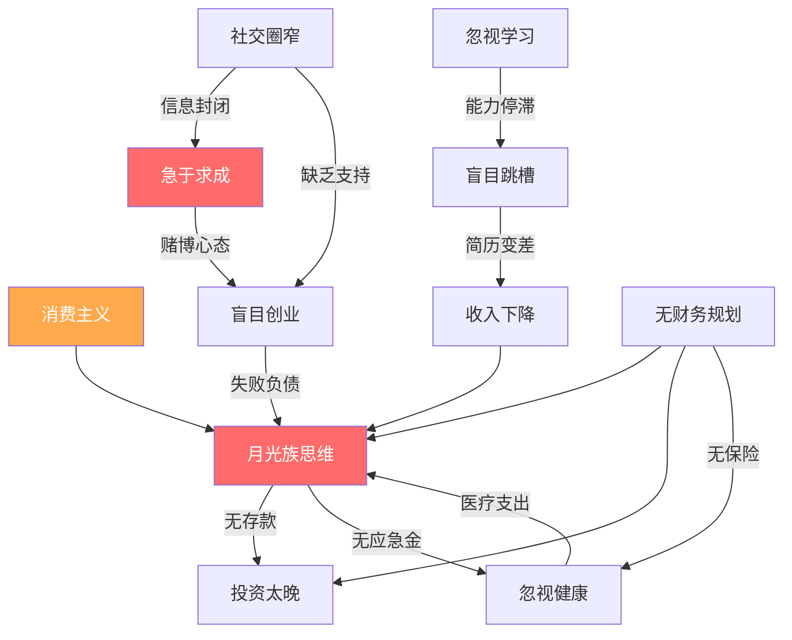

# 第17章 常见误区：积累期的陷阱与纠偏指南

> "年轻人最大的资本不是时间，而是犯错后还能重来的机会。但最好的策略，是少犯错。"

20-30岁是财富积累的起跑阶段，也是认知最容易出偏差的阶段。这个年龄段的人刚离开校园，社会经验不足，容易被流行观念、消费主义、同辈压力和信息茧房裹挟，做出看似合理实则有害的决策。本章系统梳理积累期最常见的十大误区，从行为经济学、发展心理学和财务规划三个维度剖析其成因，并给出具体的纠正方案。

## 误区一：月光族思维——"及时行乐"

### 典型画像

月薪8000元的小李，每月房租2500元、餐饮2000元、娱乐1500元、购物1000元、交通通讯500元，月底账户余额为零。他的口头禅是："年轻不享受，老了有钱也没用。"

### 行为经济学解析

"月光"不是单纯的自制力问题，而是多种认知偏差的叠加：

| 认知偏差 | 表现 | 心理机制 |
|----------|------|----------|
| **双曲贴现** | 过度看重当下满足，低估未来收益 | 大脑对即时奖励的估值是延迟奖励的2-3倍 |
| **锚定效应** | 以周围人的消费水平作为参照 | "同事都用最新iPhone，我也应该用" |
| **心理账户** | 把年终奖、退税等视为"意外之财"随意挥霍 | 对不同来源的钱赋予不同"价值标签" |
| **乐观偏差** | "以后收入会涨的，到时候再存" | 高估未来收入增长的确定性 |

行为经济学家理查德·塞勒（Richard Thaler）的"心理账户"理论揭示：人们对"辛苦赚来的钱"和"意外得到的钱"的消费态度截然不同。月薪是"辛苦钱"会谨慎花，年终奖是"天上掉的"就容易挥霍。破解方法是把所有收入统一视为"劳动所得"，进入同一个账户管理。

### 复利损失的量化分析

假设你25岁月光，30岁才开始每月存2000元，年化收益8%：

```text
方案A：25岁开始，每月存2000元，到60岁
  → 累计投入84万，终值约 473万

方案B：30岁开始，每月存2000元，到60岁
  → 累计投入72万，终值约 300万

差距：少存5年 → 少积累173万
这就是"月光5年"的真实代价。
```

### 纠正方案：先储蓄后消费的自动化体系

**第一步：建立"三账户"结构**

将工资卡绑定三个自动转账规则（发薪日当天执行）：

```text
工资到账 → 自动分流：
  ├── 储蓄账户（30%）：定期存款/货币基金，只进不出
  ├── 投资账户（10%）：指数基金定投，长期不动
  └── 消费账户（60%）：日常开销，花完即止
```

**第二步：设置"冷静期"规则**

- 超过200元的非必需消费，强制等待24小时
- 超过500元的消费，等待72小时
- 超过2000元的消费，等待一周并写100字购买理由

**第三步：记账复盘**

使用记账App（如随手记、Money Pro、YNAB）记录每笔支出，每周日花15分钟复盘本周消费，找出"不知不觉花掉的钱"。研究表明，仅靠记账这一项动作，就能减少15-20%的非必要支出。

---

## 误区二：盲目追求高薪——"跳槽涨薪"

### 典型画像

小王毕业3年换了4份工作，每份不到一年。每次跳槽涨薪20-30%，简历上写满了短期经历。到第5次面试时，HR看到他的简历直接说："我们不太考虑稳定性这么差的候选人。"

### 职业资本理论分析

职业发展研究者迈克尔·亚瑟（Michael Arthur）提出的"智能职业"理论指出：职业价值由三个资本构成：

```text
职业总价值 = 人力资本（技能+知识）
           + 社会资本（人脉+信任）
           + 文化资本（行业口碑+个人品牌）
```

频繁跳槽的问题在于：

1. **人力资本断裂**：每换一份工作，前6个月基本在"交学费"——学习新业务、适应新流程、建立新关系。真正产出价值通常要6-12个月。频繁跳槽意味着你永远在"学习期"，从未进入"收获期"。

2. **社会资本归零**：信任需要时间积累。同事不会在认识你3个月后就把重要项目交给你，领导不会在半年内给你核心资源。每次跳槽，你之前积累的信任关系全部作废。

3. **简历信号恶化**：HR筛选简历时，有一个隐性规则——"平均每份工作不满2年是减分项"。在竞争激烈的岗位，这可能直接导致简历被过滤。

### 跳槽的正确决策框架

不是不能跳，而是要"战略性跳槽"。用以下框架评估：

```text
跳槽决策矩阵（打分1-5，总分>15才考虑跳）：

| 评估维度         | 当前公司 | 新公司 |
|-----------------|---------|--------|
| 技能成长空间      |   ?     |   ?    |
| 行业/赛道前景     |   ?     |   ?    |
| 直属领导质量      |   ?     |   ?    |
| 薪资竞争力        |   ?     |   ?    |
| 团队氛围与文化    |   ?     |   ?    |
| 晋升可见性        |   ?     |   ?    |
```

**关键原则：**

- **在一个岗位至少待2年**：2年是一个完整的能力成长周期，足以让你经历完整的业务周期、建立深度人脉、产出可量化的成果。
- **跳槽涨薪应>30%**：低于30%的涨薪不值得承受跳槽带来的社会资本损失。
- **优先考虑内部转岗**：同一家公司内部换部门，既能获得新机会，又不损失已积累的信任和资历。
- **跳槽频率红线**：30岁前，累计不超过3次跳槽为佳。

### 什么情况下该果断跳

- 公司经营状况恶化，有裁员风险
- 直属领导持续打压，晋升通道堵死
- 行业整体下行，需要转向新赛道
- 收入远低于市场中位数（低于50%分位），且沟通无果
- 身心健康受到严重影响

---

## 误区三：忽视学习——"工作太忙没时间学习"

### 典型画像

小陈毕业后进入一家互联网公司做运营，前两年还算勤奋，第三年开始"吃老本"。每天工作8小时后就刷短视频、打游戏，周末睡到中午。三年后公司业务调整，他发现自己既不懂数据分析，也不会内容创作，被优化后找不到同薪工作。

### 知识折旧率与终身学习的必要性

麻省理工学院（MIT）的研究表明，工程类知识的半衰期约为5年——也就是说，你今天掌握的专业知识，5年后只有一半还有用。在互联网、AI、金融科技等领域，这个周期更短，可能只有2-3年。

```text
知识价值衰减曲线：

知识价值
100% |■
     |■■
 75% |■■■
     |■■■■
 50% |■■■■■        ← 5年后，一半知识过时
     |■■■■■■■
 25% |■■■■■■■■■■
     |■■■■■■■■■■■■■
  0% |________________
     0  2  4  6  8  10 年
```

### 高效学习的"T型能力"模型

不是什么都学，而是有策略地构建"T型能力"：

```text
                    ← 广度：跨领域通识 →
    ┌─────────────────────────────────────────┐
    │  商业思维 | 数据分析 | 沟通表达 | 项目管理  │
    └────────────────────┬────────────────────┘
                         │
                         │  深度：专业技能
                         │
                         │  ← 你的核心竞争力
                         │
                         │
                         ▼
```

- **横向（广度）**：掌握与工作相关的辅助技能，如数据分析、沟通表达、项目管理。这些技能让你能与不同部门协作，增加职业灵活性。
- **纵向（深度）**：在你的核心领域持续深耕，成为"不可替代"的专家。深度决定你的薪资天花板。

### 每日学习的实操方案

**"30分钟日课"系统：**

| 时间段 | 学习内容 | 形式 | 目标 |
|--------|----------|------|------|
| 通勤（20分钟） | 行业播客/音频课程 | 耳听 | 保持行业敏感度 |
| 午休（10分钟） | 专业文章/行业报告 | 阅读 | 积累知识碎片 |
| 晚间（30分钟） | 系统课程/书籍 | 深度学习 | 构建知识体系 |
| 周末（2小时） | 实操练习/项目 | 动手做 | 把知识转化为技能 |

**学习的"721法则"：**

- **70% 在做中学**：主动承担有挑战性的工作任务，在实践中学习
- **20% 向人学**：找导师、参加行业社群、与高手交流
- **10% 从书中学**：系统阅读专业书籍和课程

### 学习投资的ROI计算

假设你月薪1万，花5000元学了一门数据分析课程，3个月后跳槽到新岗位月薪1.5万：

```text
投资回报率 = (收益 - 成本) / 成本 × 100%
           = (5000×12 - 5000) / 5000 × 100%
           = 1100%

即：投入5000元，年回报55000元，ROI为1100%。
没有任何金融产品能提供如此高的回报率。
```

---

## 误区四：盲目创业——"不想给别人打工"

### 典型画像

23岁的小张看了几篇创业鸡汤，觉得"打工没前途"，辞掉月薪6000的工作，用积蓄5万块开了家奶茶店。不懂选址、不懂供应链、不懂营销，半年亏光积蓄，还欠了3万块信用卡。

### 创业成功率的真实数据

根据国家市场监督管理总局和中小企业协会的数据：

- 中国中小企业平均寿命约 2.5 年
- 初创企业1年内倒闭率约 20%，3年内约 50%，5年内约 70%
- 大学生创业成功率不足 5%（部分统计口径显示仅 2-3%）
- 第一次创业失败率约 90%，但连续创业者的成功率逐次提高

### "创业准备度"自评模型

在决定创业前，用这个模型自评，总分低于60分建议继续积累：

```text
创业准备度评估（满分100分）：

行业经验（25分）
├── 在该行业工作3年以上         +15分
├── 深度理解行业供应链和盈利模型  +5分
├── 有该行业的核心人脉           +5分
└── 缺乏以上全部                +0分

资金储备（25分）
├── 启动资金 >= 预算的2倍        +15分
├── 个人生活费储备 >= 12个月     +5分
├── 无高息负债                   +5分
└── 只有勉强够的启动资金         +5分

核心能力（25分）
├── 拥有该业务的核心技术/资源     +10分
├── 有成功的项目管理经验          +5分
├── 具备销售/获客能力             +5分
└── 有互补的合伙人               +5分

心态准备（25分）
├── 能接受1-2年没有收入          +10分
├── 家庭支持（配偶/父母理解）     +5分
├── 有清晰的商业计划             +5分
└── 做过充分的市场调研           +5分
```

### 正确的创业路径

**"在职创业"渐进路线：**

```text
阶段1：探索期（在职，6-12个月）
  → 利用业余时间验证商业想法
  → 做最小可行产品（MVP），获取首批用户
  → 确认收入模型可行

阶段2：过渡期（3-6个月）
  → 副业收入达到主业50%以上
  → 存够12个月生活费
  → 找到互补的合伙人

阶段3：全职创业（时机成熟时）
  → 副业收入稳定且有增长趋势
  → 核心团队已组建
  → 有明确的6个月里程碑计划
```

### "打工"也是创业的准备

不要把"打工"和"创业"对立。在大公司工作，你能学到：

- **系统化思维**：大公司的流程、制度、方法论
- **资源整合能力**：如何协调跨部门资源推动项目
- **商业全局观**：从内部理解一个公司如何运转、如何盈利
- **人脉积累**：同事、客户、供应商都可能成为未来的合伙人或客户

---

## 误区五：消费主义陷阱——"买买买"

### 典型画像

26岁的小美月薪1.2万，分期买了最新iPhone（每月还800元）、名牌包（每月还500元）、健身房年卡（每月均摊400元），加上房租3000元，每月固定支出就占了收入的40%以上。她觉得自己"生活质量很高"，但银行账户余额常年不超过5000元。

### 消费主义的心理机制

消费主义利用了人类的几个深层心理需求：

**1. 社会比较理论（Leon Festinger, 1954）**

人天生会与周围人比较来评估自己的价值。社交媒体放大了这种比较——你看到的不是真实的生活，而是精心策划的"高光时刻"。研究表明，每天使用社交媒体超过2小时的人，物质欲望水平比少用的人高出37%。

**2. 多巴胺驱动的"期待-获得"循环**

购物时，大脑释放多巴胺（期待的快感），而不是内啡肽（满足的快感）。这意味着你真正享受的是"期待购买"的过程，而不是"拥有商品"的结果。商品到手后，多巴胺迅速消退，你又开始期待下一次购买——这就是"享乐适应"（hedonic adaptation）。

**3. 锚定效应与"相对便宜"错觉**

原价1000元、打折后600元，你觉得"省了400元"。但实际上你花了600元买了可能不需要的东西。商家精心设计的"原价-折扣价"对比，就是利用锚定效应让你觉得自己在"赚钱"。

### "真实成本"计算法

每笔消费前，问自己一个问题："这东西的真实成本是多少？"

```text
真实成本 = 商品价格 × (1 + 资金机会成本率)^n

举例：一部8000元的手机
  如果这8000元投入年化8%的指数基金：
  → 10年后：8000 × 1.08^10 = 17,272元
  → 20年后：8000 × 1.08^20 = 37,288元
  → 30年后：8000 × 1.08^30 = 80,433元

这部手机的"真实成本"不是8000元，而是你放弃了的8万元（30年后）。
```

### 消费分级与预算管理

**"需求-想要-渴望"三级分类法：**

| 级别 | 定义 | 举例 | 预算占比 |
|------|------|------|----------|
| **需求** | 维持基本生活必需 | 房租、餐饮、交通、基本通讯 | 50-60% |
| **想要** | 提升生活质量但可替代 | 偶尔外出就餐、适量衣物、适度娱乐 | 20-30% |
| **渴望** | 情绪驱动的冲动消费 | 最新款电子设备、奢侈品、网红同款 | 10-20% |

每月消费前，先按这三个级别分类。如果"渴望"类支出超过总预算的20%，就需要砍掉或延后。

### 延迟满足的实操技巧

- **"48小时冷静期"**：非必需品放入购物车，48小时后如果还想买再下单。研究显示，约60%的冲动消费会在冷静期后放弃。
- **"时薪换算法"**：想买一个3000元的包？算算你需要工作多少小时。如果时薪100元，这个包值30小时的生命。你愿意用30小时的生命换这个包吗？
- **"替代满足法"**：想买新衣服？先整理衣柜，把旧衣服重新搭配。很多时候你缺的不是衣服，而是搭配灵感。

---

## 误区六：忽视健康——"年轻就是本钱"

### 典型画像

28岁的小刘是程序员，每天坐12小时，不运动，饮食靠外卖，凌晨2点睡觉。他觉得"扛得住"。直到体检报告出现脂肪肝、高血脂、颈椎病，他才意识到身体已经发出了警告。

### 健康的财务视角

健康不仅是身体问题，更是财务问题。从财富积累的角度看，健康是你最重要的"生产工具"：

```text
健康损失的财务影响：

直接成本：
├── 医疗费用：一次住院平均花费 1-5万元
├── 慢性病管理：高血压/糖尿病年均药费 3000-10000元
├── 牙科治疗：种一颗牙 8000-20000元
└── 视力矫正：近视手术 15000-30000元

间接成本：
├── 工作效率下降：身体不适时工作效率可能降低30-50%
├── 职业中断：重大疾病可能导致数月无法工作
├── 晋升机会损失：频繁请假影响领导评价
└── 长期收入影响：慢性病可能限制职业选择
```

### 年轻人最容易忽视的健康风险

**1. 久坐伤害（"新型吸烟"）**

世界卫生组织将久坐列为"第四大致死风险因素"。每天坐超过8小时且不运动的人，死亡风险与吸烟和肥胖相当。

- 腰椎间盘突出：20-30岁发病率逐年上升
- 深静脉血栓：久坐不动导致下肢血液循环变差
- 代谢综合征：久坐导致胰岛素敏感性下降

**2. 睡眠债务**

每晚睡眠不足6小时的人，认知能力下降程度相当于连续24小时不睡觉。长期睡眠不足会导致：
- 免疫力下降30-50%
- 肥胖风险增加55%
- 心血管疾病风险增加48%
- 抑郁风险增加3倍

**3. 心理健康**

20-30岁是焦虑症和抑郁症的高发期。职场压力、经济压力、社交压力叠加，如果不及时处理，可能导致严重后果。

### "最小可行健康"方案

不需要每天健身2小时，坚持以下"最小可行健康"方案即可：

**运动（每周3次，每次30分钟）：**
- 最简单：每天快走30分钟（通勤路上即可完成）
- 进阶：每周3次力量训练（俯卧撑、深蹲、平板支撑，无需去健身房）
- 最佳：找一项喜欢的运动（游泳、跑步、羽毛球），坚持下去

**饮食（遵循"211法则"）：**
- 每餐：2拳蔬菜 + 1掌蛋白质 + 1拳主食
- 减少：外卖频率降到每周2-3次，自己做饭
- 限制：含糖饮料每周不超过2杯

**睡眠（固定作息）：**
- 设定固定起床时间（即使周末也不超过1小时偏差）
- 睡前1小时不看手机（蓝光抑制褪黑素分泌）
- 目标：每晚7-8小时

**体检（每年1次）：**
- 基础体检：血常规、肝肾功能、血脂血糖、心电图
- 25岁后加查：甲状腺功能、颈椎/腰椎检查
- 30岁后加查：肿瘤标志物筛查

---

## 误区七：社交圈太窄——"只和熟人玩"

### 典型画像

小周毕业后只和大学同学、公司同事来往，周末要么宅家打游戏，要么和固定的几个朋友聚餐。三年后想跳槽，发现除了现公司的人，一个能帮忙推荐的人都没有。

### 社会资本理论：弱关系的力量

社会学家马克·格兰诺维特（Mark Granovetter）在1973年的经典研究中发现：**真正带来新机会的，不是你的亲密朋友（强关系），而是你认识但不太熟的人（弱关系）。**

原因很简单：你的亲密朋友和你处于同一个社交圈，接触的信息高度重叠。而弱关系连接的是不同的社交圈，能带来你从未接触过的信息和机会。

```text
社交圈结构：

      强关系（5-15人）
     ╱  亲密朋友、家人  ╲
    ╱   信息高度重叠     ╲
   ╱    情感支持为主      ╲
  ┌───────────────────────────┐
  │                           │
  │      你                   │
  │                           │
  └───────────────────────────┘
   ╲    弱关系（50-150人）    ╱
    ╲   行业同行、泛社交圈   ╱
     ╲  信息多元化          ╱
      ╲ 机会桥梁为主       ╱

弱关系带来的价值：
- 80%的工作机会来自弱关系推荐
- 70%的商业合作来自弱关系介绍
- 60%的行业信息来自弱关系传递
```

### 构建高质量社交圈的策略

**"3-3-3"社交法则：**

- **每月参加3次行业活动**：线上/线下均可，行业沙龙、技术分享会、读书会
- **每周深度交流3个人**：不是泛泛之交，而是有实质内容的对话
- **维护3层社交圈**：核心圈（5人，深度信任）、协作圈（30人，互相帮助）、信息圈（150人，信息互通）

**社交的"价值交换"原则：**

社交的本质是价值交换。在拓展人脉之前，先问自己："我能为对方提供什么价值？"

| 你能提供的价值 | 具体形式 |
|---------------|----------|
| 信息价值 | 分享行业报告、技术文章、招聘信息 |
| 技能价值 | 帮忙解决技术问题、提供专业建议 |
| 连接价值 | 介绍合适的人给对方认识 |
| 情绪价值 | 真诚的赞美、认真的倾听、靠谱的承诺 |

### 线上社交的高效方式

- **专业社群**：加入行业微信群、知识星球、Discord社区，定期输出有价值的内容
- **内容创作**：在公众号/知乎/掘金等平台写专业文章，吸引同频的人
- **开源贡献**：参与GitHub开源项目，与全球开发者协作

---

## 误区八：投资太晚——"等有钱了再投资"

### 典型画像

27岁的小赵月薪1.5万，每月能存5000元。他觉得"5000块太少了，等攒够10万再投资"。结果两年后攒了12万，但因为从未接触过投资，不知道从何开始，又继续"等学习好了再投"。

### "等有钱再投资"的逻辑谬误

这个误区包含两个错误：

**错误1：金额门槛幻觉**

投资没有最低金额门槛。基金定投100元起，ETF 1手（几百元）起。问题不是"钱太少"，而是"没有开始"。

**错误2：准备度幻觉**

"等我学会了再投"是典型的无限推迟。投资知识的80%是在实践中获得的，不是在书本上学到的。就像游泳——你在岸上看100本游泳教材，不如跳进浅水区亲自试试。

### 时间价值的量化对比

假设目标：60岁时积累500万投资资产，年化收益8%：

```text
方案A：25岁开始，每月需投入  2,413元
方案B：30岁开始，每月需投入  3,681元（多52%）
方案C：35岁开始，每月需投入  5,712元（多137%）
方案D：40岁开始，每月需投入  9,215元（多282%）

结论：每晚开始5年，每月投入需增加50-100%。
早开始的最大优势不是"多赚几年"，而是"少投很多"。
```

### 从零开始的投资路径

**第1步：建立紧急备用金（1-3个月）**

在开始投资前，先存够3-6个月生活费作为紧急备用金。放在货币基金（如余额宝、零钱通），年化约1.5-2%，流动性好，随时可取。

**第2步：开始指数基金定投（第2个月起）**

指数基金是新手最佳选择：分散风险、费率低、不需要选股能力。

```text
推荐的入门定投方案：

沪深300指数基金（A股大盘）   40%
中证500指数基金（A股中小盘）  30%
标普500指数基金（美股大盘）   30%

每月发薪日自动扣款，坚持3年以上。
```

**第3步：学习并扩展（6个月后）**

- 阅读《漫步华尔街》《指数基金投资指南》
- 了解资产配置、风险分散、再平衡的概念
- 根据自身风险承受能力调整股债比例

**第4步：建立投资系统（1年后）**

- 制定书面的投资策略和纪律
- 设定止盈止损规则
- 每季度复盘一次，每年调整一次配置

### 定投的心理陷阱

| 陷阱 | 表现 | 应对 |
|------|------|------|
| **追涨杀跌** | 市场涨时加仓，跌时暂停 | 反过来：跌时加码，涨时维持 |
| **频繁查看** | 每天看收益，心情随涨跌起伏 | 每月只看1次，把App从手机首页移除 |
| **中途放弃** | 亏损20%就停止定投 | 记住：定投微笑曲线，下跌时正是积累筹码的好时机 |
| **过早止盈** | 赚了10%就全部卖出 | 设定目标持有期（3-5年），而非目标收益率 |

---

## 误区九：没有财务规划——"走一步看一步"

### 典型画像

小孙月薪1万，每个月"凭感觉"花钱，不知道钱花到了哪里。没有存款目标、没有投资计划、没有保险配置。突然有个月需要交3个月房租押金，只能找朋友借钱。

### 为什么需要财务规划

财务规划不是"有钱人的事"，恰恰相反——越是收入有限，越需要规划。因为你的容错空间很小，一次意外支出就可能打乱全部节奏。

财务规划的核心价值：

```text
没有规划 vs 有规划：

没有规划的财务轨迹：
收入 → 消费 → 剩余（如果有） → 随意存放
结果：月光、无保障、目标模糊

有规划的财务轨迹：
收入 → 储蓄目标 → 投资计划 → 保障配置 → 消费预算
结果：有节奏、有保障、目标清晰
```

### "532"财务规划框架

这是一个适合20-30岁年轻人的简化框架：

```text
月收入分配：

50% → 基本生活支出
     ├── 住房（房租/房贷）：不超过收入的30%
     ├── 餐饮：不超过收入的15%
     └── 交通通讯：不超过收入的5%

30% → 储蓄与投资
     ├── 紧急备用金（先完成，目标6个月生活费）
     ├── 指数基金定投（长期资产）
     └── 学习投资（自我增值）

20% → 保障与弹性
     ├── 保险（重疾险+意外险，见下文）
     ├── 社交应酬
     └── 娱乐/弹性消费
```

### 保险配置的优先级

20-30岁的人最容易犯的错误是"不买保险"或"买错保险"。正确的保险配置顺序：

```text
优先级从高到低：

1. 医保（必须有）
   → 职工医保/居民医保，这是最基础的保障

2. 意外险（每年100-300元）
   → 覆盖意外伤残和意外医疗
   → 杠杆率极高，几百元保费可获得几十万保障

3. 百万医疗险（每年200-500元）
   → 覆盖大病住院费用，通常有1万免赔额
   → 与医保互补，解决"看不起大病"的问题

4. 重疾险（每年3000-6000元）
   → 确诊即赔，用于弥补收入损失和康复费用
   → 建议保额 >= 年收入的3-5倍
   → 越年轻买越便宜，25岁买比35岁买便宜40-50%

5. 寿险（暂缓）
   → 20-30岁无家庭负担时，寿险优先级最低
   → 结婚有娃后再配置

注意：不要买返还型保险（贵且收益低），
不要买万能险/分红险（保障不足且收益不确定）。
纯消费型保险才是性价比之王。
```

### 财务目标的SMART设定

把模糊的"我要存钱"变成可执行的目标：

| 维度 | 差的目标 | 好的目标 |
|------|----------|----------|
| S（具体） | "我要存钱" | "我要存够6个月紧急备用金" |
| M（可衡量） | "多存点" | "每月存3000元" |
| A（可实现） | "一年存50万"（月薪1万） | "一年存3.6万"（月薪1万） |
| R（相关性） | "我要学吉他" | "我要提升数据分析能力" |
| T（有时限） | "以后再说" | "12月底前完成" |

---

## 误区十：急于求成——"想快速致富"

### 典型画像

29岁的小钱看到朋友炒币赚了50倍，把全部积蓄20万投入某个"百倍币"。三个月后币价归零，20万血本无归。他又借贷10万想"翻本"，结果越亏越多，最终负债15万。

### "快速致富"骗局的识别清单

以下任何一条命中，大概率是骗局或极高风险：

```text
🚩 红旗信号（命中1条即警惕，命中2条+立刻远离）：

□ 承诺"稳赚不赔"或"保本保息"
□ 年化收益超过15%且"零风险"
□ 需要"拉人头"才能获得收益
□ 要求你把钱转给个人账户
□ 模式复杂，解释不清楚钱怎么赚的
□ 制造紧迫感："今天不投就没了"
□ 用名人/机构背书但无法核实
□ 你无法自由提取本金
□ 群里全是"晒收益"的人
□ 推荐人比你还着急让你投钱
```

### 常见的"快速致富"陷阱

| 陷阱类型 | 典型话术 | 实际风险 |
|----------|----------|----------|
| **资金盘** | "静态收益+动态收益" | 后入场者的钱给先入场者，崩盘是必然 |
| **虚拟币传销** | "区块链革命，百倍币" | 99%的山寨币最终归零 |
| **外汇/期货带盘** | "老师带单，月收益30%" | 对赌平台，你的亏损就是平台的利润 |
| **杀猪盘** | "我有个内幕消息" | 先让你小赚，再让你大亏 |
| **刷单/套利** | "动动手指就能赚钱" | 垫付资金后对方消失 |
| **知识付费割韭菜** | "跟我学，月入10万" | 卖课才是他的收入来源 |

### 正确的财富心态

**接受"慢即是快"的财富哲学：**

```text
财富积累的真实速度：

普通工薪族的财富曲线：
  起步期（22-28岁）：积累慢，可能只存下10-30万
  成长期（28-35岁）：收入增长+投资复利，开始加速
  爆发期（35-50岁）：职业高峰+资产增值，财富快速增长
  收获期（50岁+）：复利效应充分显现

真正的财富爆发通常在35岁之后，
前提是20-30岁打好了基础。
```

**"反脆弱"投资心态：**

纳西姆·塔勒布在《反脆弱》中提出：不要追求"每次赚一点"，而是构建"小亏大赚"的组合——大部分时候承受小的波动，但在关键机会出现时获得巨大回报。这意味着：

- **控制单次亏损上限**：任何单一投资不超过总资产的10%
- **保留"子弹"**：永远留有20-30%的现金，等待好的投资机会
- **避免杠杆**：20-30岁不要用杠杆投资（借钱炒股、配资等）
- **长期持有**：好资产需要时间兑现价值

---

## 误区间的关联性：一个系统性视角

以上十个误区并非孤立存在，它们往往相互关联、相互强化，形成恶性循环：



这个图揭示了一个关键洞察：**很多财务问题的根源不是"钱不够"，而是"认知不够"。** 月光、乱投资、盲目创业的背后，是缺乏对财富积累规律的理解。

---

## 综合自检与纠偏清单

每月花15分钟，用以下清单审视自己的状态。如果连续2个月有3项以上不达标，说明你可能陷入了某个误区：

### 财务健康检查

- [ ] 储蓄率 >= 20%（每月存下收入的20%以上）
- [ ] 紧急备用金 >= 3个月生活费
- [ ] 无高息负债（信用卡分期、花呗、网贷）
- [ ] 有至少1项长期投资在运行
- [ ] 有基本保险配置（医疗险+意外险）

### 职业发展检查

- [ ] 过去6个月学了新技能或新知识
- [ ] 有明确的1年和3年职业目标
- [ ] 在当前岗位有可量化的成长
- [ ] 有3个以上可以推荐工作的行业人脉

### 生活方式检查

- [ ] 每周运动 >= 3次
- [ ] 平均睡眠 >= 7小时
- [ ] 过去1个月有意识地拒绝了冲动消费
- [ ] 社交圈在扩大，而不只是维持

### 心态检查

- [ ] 没有"一夜暴富"的幻想
- [ ] 能接受"慢慢变富"
- [ ] 遇到财务问题时冷静分析，而非情绪化应对
- [ ] 对自己的长期规划有信心

---

## 纠偏行动：如果我已经中招了怎么办

### 诊断：你最可能陷入的误区

根据你的现状，选择最需要优先解决的1-2个误区（不要贪多）：

| 你的现状 | 最可能的误区 | 第一步行动 |
|----------|-------------|-----------|
| 月底余额为零 | 月光+消费主义 | 今天就开一个储蓄账户，设自动转账 |
| 3年换了4份工作 | 盲目跳槽 | 在当前岗位至少再待1年，积累成果 |
| 毕业后没读过书 | 忽视学习 | 本周开始每天30分钟阅读 |
| 想辞职创业 | 盲目创业 | 先用业余时间做MVP验证 |
| 总觉得钱不够花 | 消费主义 | 记账一个月，找出最大的浪费 |
| 经常熬夜、不运动 | 忽视健康 | 本周开始每天快走30分钟 |
| 只和老朋友玩 | 社交圈窄 | 本月参加1次行业活动 |
| 存了钱但不敢投 | 投资太晚 | 今天开一个基金账户，定投100元 |
| 从不做财务规划 | 无规划 | 用"532框架"分配下月收入 |
| 想快速赚钱 | 急于求成 | 把"高收益"项目清单拿出来，对照红旗信号逐条检查 |

### "21天纠偏"计划

选一个误区，用21天时间建立新习惯：

```text
第1-7天（认知期）：
  → 阅读本节对应误区的详细分析
  → 写下自己在该误区上的具体表现
  → 设定纠偏目标

第8-14天（行动期）：
  → 每天执行纠偏行动
  → 记录执行情况
  → 遇到阻力时回顾"为什么要改"

第15-21天（巩固期）：
  → 行动已基本形成习惯
  → 总结21天的变化和收获
  → 开始攻克下一个误区
```

---

## 总结：积累期的核心认知

20-30岁的积累期，你最需要建立的不是某个具体技能，而是以下核心认知：

1. **时间是最大的资产**：复利效应需要时间发酵，早开始5年可能差出几百万
2. **能力是最好的投资**：对自己的投资回报率远超任何金融产品
3. **慢即是快**：财富积累没有捷径，但有正确的路径
4. **系统比意志力可靠**：自动化储蓄、定投、记账系统比"靠自觉"有效100倍
5. **健康是一切的基础**：没有健康，所有财富都是数字

避开这些误区，不是要你过苦行僧的生活，而是让你在享受当下的同时，为未来的自己铺设一条宽广的道路。十年后回头看，你会感谢今天做出改变的自己。
