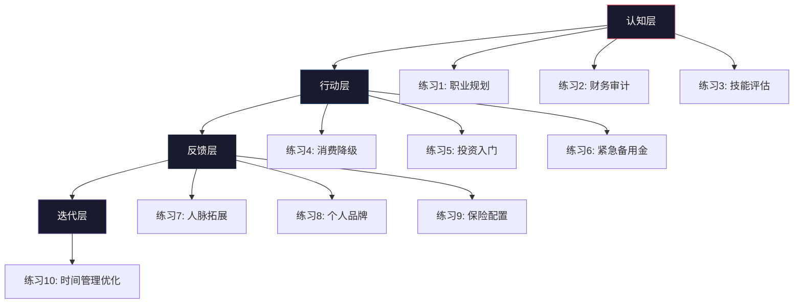
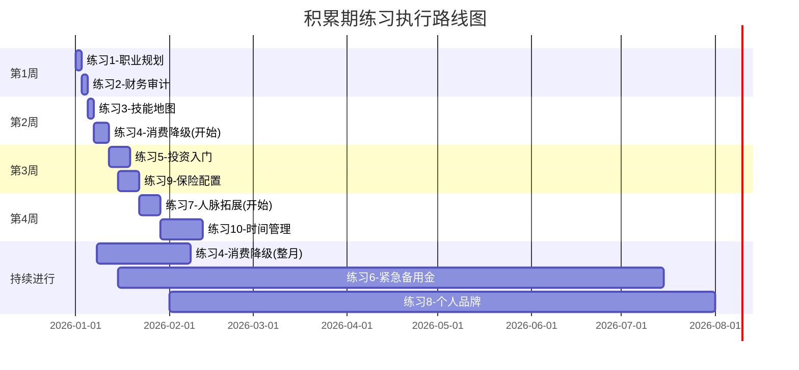

# 第17章 练习方法：积累期的实操练习

## 为什么需要刻意练习

读完前面的理论基础和核心技巧，你可能觉得"道理都懂了"。但知道和做到之间，隔着一条巨大的鸿沟。行为心理学家K. Anders Ericsson的研究表明，任何领域的专业能力都需要至少10000小时的刻意练习。财富积累也一样——你需要通过反复实操，把知识转化为本能反应。

本章设计了10个练习，按照"认知→行动→反馈→迭代"的循环逻辑编排。每个练习都遵循以下结构：

- **理论锚点**：为什么做这个练习，它对应本章哪个理论
- **具体步骤**：可执行的操作流程，不是空泛的建议
- **工具推荐**：具体可用的工具和平台
- **成功标准**：做到什么程度算完成
- **常见陷阱**：执行过程中最容易犯的错误

## 练习体系总览



| 阶段 | 练习 | 时长 | 难度 | 对应理论 |
|------|------|------|------|----------|
| 认知层 | 练习1: 职业规划工作坊 | 2小时 | ★★☆ | 职业发展理论、人力资本理论 |
| 认知层 | 练习2: 财务状况审计 | 1.5小时 | ★☆☆ | 消费行为理论 |
| 认知层 | 练习3: 技能地图绘制 | 2小时 | ★★☆ | 职业资本理论 |
| 行动层 | 练习4: 消费降级挑战 | 1个月 | ★★★ | 消费行为理论 |
| 行动层 | 练习5: 投资入门实操 | 1周 | ★★☆ | 复利理论 |
| 行动层 | 练习6: 紧急备用金建立 | 6个月 | ★☆☆ | 风险管理 |
| 反馈层 | 练习7: 人脉拓展计划 | 1个月 | ★★★ | 社会资本理论 |
| 反馈层 | 练习8: 个人品牌建设 | 持续 | ★★★ | 职业资本理论 |
| 反馈层 | 练习9: 保险配置规划 | 1周 | ★★☆ | 风险管理 |
| 迭代层 | 练习10: 时间管理优化 | 2周 | ★★☆ | 时间价值理论 |

---

## 练习一：职业规划工作坊

### 理论锚点

职业发展理论（Donald Super的生涯发展论）指出，20-30岁处于"探索阶段"的核心期。这个阶段最重要的任务不是找到"完美工作"，而是通过试错建立对自我和市场的准确认知。人力资本理论则强调，你的最大资产是你自己，职业规划本质上就是人力资本投资决策。

### 为什么这个练习排在第一位

职业方向决定了你未来10年收入增长的上限。选择一个高速增长的行业，你的努力会被行业红利放大；选择一个夕阳行业，你再努力也事倍功半。这不是玄学，而是行业增长对个人收入的杠杆效应——一个年增长20%的行业，即使你只是中等水平，收入增速也会远超一个停滞行业中的一流人才。

### 具体步骤

**第一步：自我深度扫描（30分钟）**

不要只写"我的兴趣是编程"这种笼统回答。用以下框架深入挖掘：

```text
兴趣挖掘（写5个，每个附带具体场景）：
1. 兴趣点 → 什么场景下你感到兴奋？为什么？
2. 兴趣点 → 你愿意免费做的事是什么？
3. 兴趣点 → 你在什么话题上可以和人聊3小时不停？
4. 兴趣点 → 你小时候最喜欢做什么？
5. 兴趣点 → 你的浏览器历史记录里，出现最多的非工作内容是什么？

优势挖掘（写5个，附带证据）：
1. 优势 → 别人经常夸你什么？最近一次是什么时候？
2. 优势 → 你做什么事比别人快/好？
3. 优势 → 你解决过什么别人解决不了的问题？
4. 优势 → 你的同事/朋友遇到什么问题会找你？
5. 优势 → 你做过什么让你有成就感的事？

价值观排序（从以下12个中选3个最重要的）：
收入水平 | 工作稳定性 | 自主性 | 社会地位 | 
创造力 | 帮助他人 | 工作生活平衡 | 学习成长 |
领导力 | 团队合作 | 冒险刺激 | 技术深度
```

**第二步：行业研究（30分钟）**

不要泛泛而谈"我对互联网感兴趣"。用以下数据源做具体研究：

数据来源：
- **国家统计局**（data.stats.gov.cn）：查看各行业增加值增速
- **招聘平台**（Boss直聘、拉勾）：搜索目标岗位的薪资区间和要求
- **行业报告**（36kr研究院、艾瑞咨询）：查看行业发展趋势
- **上市公司财报**（巨潮资讯网）：查看行业内头部公司的营收增长

研究模板：

| 维度 | 行业A：____ | 行业B：____ | 行业C：____ |
|------|------------|------------|------------|
| 近3年行业增速 | | | |
| 头部公司营收增速 | | | |
| 目标岗位薪资范围 | | | |
| 入门门槛（学历/技能） | | | |
| 天花板（10年后上限） | | | |
| 与我的兴趣匹配度(1-5) | | | |
| 与我的优势匹配度(1-5) | | | |
| 与我的价值观匹配度(1-5) | | | |

**第三步：路径规划（30分钟）**

选定一个行业后，找到该行业3-5个已经成功的人（可以通过LinkedIn、脉脉、行业公众号），研究他们的职业路径。总结共性：

```text
路径研究模板：
目标人物1：____
- 第一份工作是什么？薪资多少？
- 第3年在做什么？薪资多少？
- 第5年在做什么？薪资多少？
- 他们的关键转折点是什么？
- 他们具备什么共性能力？

目标人物2：____
（同上格式）

路径共性总结：
1. 行业内的典型晋升路径是：____→____→____→____
2. 从入门到中层平均需要____年
3. 最关键的能力跃迁是：____→____
4. 最常见的"卡点"是：____
```

**第四步：制定90天行动计划（30分钟）**

将长期目标拆解为可执行的90天冲刺计划：

```text
我的90天职业发展冲刺计划

终极目标：____（3年后的职位/收入目标）
90天目标：____（当前阶段最关键的一件事）

第1个月：
- 周1-2：____（具体行动）
- 周3-4：____（具体行动）

第2个月：
- 周1-2：____
- 周3-4：____

第3个月：
- 周1-2：____
- 周3-4：____

每周检查点：
- 每周日晚上花15分钟回顾本周进展
- 记录：完成了什么？遇到了什么困难？下周要调整什么？

成功标准：90天后，我在____方面有了可衡量的进步（如：通过XX认证/完成XX项目/薪资提升XX%）
```

### 成功标准

完成这个练习后，你应该能清晰地回答：
1. 我要进入什么行业？为什么？
2. 这个行业3年后的样子是什么？
3. 我需要具备什么能力才能进入？
4. 我的90天第一步是什么？

### 常见陷阱

- **分析瘫痪**：花了3天研究行业，却从不开始行动。解决：给自己严格限时2小时，到时间必须做出初步决定，后续可以调整。
- **只看薪资不看成长**：选了高薪但天花板低的行业。解决：优先看10年后的收入上限，而不是入职起薪。
- **完美主义**：觉得必须找到"最适合"的行业才开始。解决：没有完美选择，只有足够好的选择加上持续投入。

---

## 练习二：财务状况审计

### 理论锚点

消费行为理论（Thaler的心理账户理论）揭示了一个关键事实：大多数人对自己"钱去了哪里"的认知是严重失真的。你以为你每月在餐饮上花2000元，实际可能是3500元。财务审计的第一步就是打破这种幻觉，建立对财务状况的客观认知。

### 为什么要做这个练习

你无法管理你无法衡量的东西。在没有清晰的财务数据之前，任何"我要多存钱"的计划都是空中楼阁。这个练习就像去医院做体检——你得先知道各项指标的现状，才能有针对性地改善。

### 具体步骤

**第一步：资产全面盘点（20分钟）**

用以下清单逐一核对，不要遗漏任何一项：

```text
流动性资产（随时可变现）：
- 银行活期存款：____元（开户行：____）
- 银行定期存款：____元（到期日：____）
- 货币基金（余额宝/零钱通等）：____元
- 其他现金等价物：____元

投资性资产：
- 股票账户：____元（当前市值）
- 基金账户：____元（当前市值）
- 数字货币：____元（当前市值）
- 其他投资：____元

固定资产：
- 房产：____万元（当前估值，可参考同小区最近成交价）
- 车辆：____万元（当前残值，可参考二手车平台估价）
- 其他固定资产：____元

无形资产：
- 公司期权/股权：____元（如有）
- 公积金账户余额：____元
- 社保个人账户余额：____元

资产总计：____元
```

**第二步：负债全面盘点（20分钟）**

```text
短期负债（1年内需还清）：
- 信用卡欠款：____元（利率：____%）
- 花呗/借呗：____元（利率：____%）
- 消费贷款：____元（利率：____%）
- 亲友借款：____元（是否有利息：____）

长期负债（1年以上）：
- 房贷：____元（剩余本金，利率：____%，剩余____年）
- 车贷：____元（剩余本金，利率：____%，剩余____年）
- 教育贷款：____元
- 其他长期负债：____元

负债总计：____元
净资产 = 资产总计 - 负债总计 = ____元
```

**第三步：收支深度分析（30分钟）**

从银行APP和支付宝/微信账单导出最近3个月的流水，逐笔分类统计：

| 支出类别 | 第1个月 | 第2个月 | 第3个月 | 月均 | 占比 |
|---------|--------|--------|--------|------|------|
| 房租/房贷 | | | | | |
| 餐饮 | | | | | |
| 交通 | | | | | |
| 通讯 | | | | | |
| 日用品 | | | | | |
| 服饰 | | | | | |
| 社交/人情 | | | | | |
| 娱乐 | | | | | |
| 学习/自我提升 | | | | | |
| 医疗/保险 | | | | | |
| 其他 | | | | | |
| **总支出** | | | | | |
| **总收入** | | | | | |
| **月结余** | | | | | |
| **储蓄率** | | | | | |

关键指标计算：
- **储蓄率** = 月结余 / 月收入 × 100%。积累期的目标储蓄率是30%以上。
- **负债收入比** = 月还款额 / 月收入 × 100%。警戒线是40%，超过这个值说明负债过重。
- **应急覆盖率** = 流动性资产 / 月支出。至少要覆盖3个月，6个月更安全。

**第四步：制定优化方案（20分钟）**

基于审计结果，列出3个最高优先级的优化方向：

```text
优化方向1：____
- 当前状况：____
- 目标状态：____
- 具体行动：____
- 预期节省/增收：____元/月

优化方向2：____
（同上格式）

优化方向3：____
（同上格式）
```

### 工具推荐

- **记账APP**：随手记、MoneyWiz、钱迹（推荐钱迹，无广告，支持多账户）
- **银行流水导出**：各银行APP→账户明细→导出CSV
- **自动分类**：支付宝→账单→分类统计；微信→钱包→账单
- **预算管理**：YNAB（You Need A Budget）的理念值得学习，但国内可用随手记替代

### 成功标准

完成这个练习后，你应该能精确回答：
1. 我的净资产是多少？
2. 我每月的钱花在哪里（精确到类别和金额）？
3. 我的储蓄率是多少？
4. 我最大的3个"漏钱口"在哪里？

### 常见陷阱

- **遗漏隐性支出**：忘记计算年度支出（保险费、会员费、节日礼物等）。解决：把年度支出除以12，分摊到每月。
- **自我欺骗**：把"社交"支出归类为"必要支出"。解决：问自己"如果我这个月少参加一次聚餐，会有什么实质性损失？"
- **只做一次**：审计完就不管了。解决：设置每月1号为"财务审计日"，花15分钟更新数据。

---

## 练习三：技能地图绘制

### 理论锚点

职业资本理论将你的职业能力分为三类：**通用技能**（沟通、写作、项目管理）、**专业技能**（编程、财务分析、设计）、**领域知识**（行业经验、人脉资源）。20-30岁积累期的核心任务，是把专业技能从"初级"提升到"高级"，同时确保通用技能不低于"中级"。

### 为什么要做这个练习

很多人学习是随机的——看到什么学什么，或者别人推荐什么学什么。这种"散弹枪式学习"效率极低。技能地图的作用是让你看清全局，找到最值得投入时间的技能缺口，实现精准投资。

### 具体步骤

**第一步：技能盘点（40分钟）**

把你掌握的所有技能列出来，并评估当前水平：

```text
专业技能（与你的职业直接相关的）：
1. ____________  水平：□初级 □中级 □高级 □专家
2. ____________  水平：□初级 □中级 □高级 □专家
3. ____________  水平：□初级 □中级 □高级 □专家
4. ____________  水平：□初级 □中级 □高级 □专家
5. ____________  水平：□初级 □中级 □高级 □专家

通用技能（跨行业通用的）：
1. 沟通表达    水平：□初级 □中级 □高级 □专家
2. 书面写作    水平：□初级 □中级 □高级 □专家
3. 项目管理    水平：□初级 □中级 □高级 □专家
4. 数据分析    水平：□初级 □中级 □高级 □专家
5. 英语能力    水平：□初级 □中级 □高级 □专家
6. 演讲/汇报   水平：□初级 □中级 □高级 □专家
7. 团队协作    水平：□初级 □中级 □高级 □专家
8. 时间管理    水平：□初级 □中级 □高级 □专家

领域知识：
1. ____________  水平：□初级 □中级 □高级 □专家
2. ____________  水平：□初级 □中级 □高级 □专家
```

**第二步：差距分析（30分钟）**

去Boss直聘搜索你的目标岗位（3年后想达到的职位），列出Top 10的技能要求。与你现有技能做对比：

| 目标岗位要求的技能 | 重要程度 | 我的当前水平 | 差距 | 优先级 |
|-------------------|---------|------------|------|--------|
| | | | | |
| | | | | |
| | | | | |

**第三步：制定90天学习计划（30分钟）**

只选1-2个最高优先级的技能集中突破，不要贪多：

```text
90天技能突破计划

目标技能：____________
当前水平：____ → 目标水平：____

学习资源（已验证可用的）：
1. 书籍：____（具体书名，不要写"相关书籍"）
2. 课程：____（具体平台+课程名）
3. 实践项目：____（你打算做什么来练手）
4. 导师/社群：____（谁能给你反馈）

每周学习安排：
- 周一到周五：每天____小时，____时间段
- 周末：____小时
- 总计：每周____小时

里程碑检查点：
- 第30天：____（具体可验证的成果）
- 第60天：____
- 第90天：____（最终成果，如证书、项目、作品）
```

### 工具推荐

- **技能自评**：LinkedIn的技能背书功能，可以让你的同事帮你评价
- **学习资源**：中国大学MOOC（免费）、极客时间（技术类）、得到（商业类）、Coursera（英文）
- **学习追踪**：Notion数据库或Excel表格，记录每天的学习时长和内容
- **实践平台**：GitHub（技术类作品集）、Behance（设计类）、公众号/知乎（写作类）

### 成功标准

完成这个练习后，你应该能回答：
1. 我的核心技能组合是什么？
2. 与目标岗位相比，我最大的技能缺口是什么？
3. 我的90天学习计划是什么？
4. 每天要投入多少时间？

### 常见陷阱

- **贪多嚼不烂**：同时学习5个技能，每个都学不深。解决：一次只聚焦1-2个，90天一个周期。
- **只学不练**：看了100小时的课程，却没有一个实际作品。解决：每个技能必须产出一个可展示的成果。
- **忽视通用技能**：只关注专业技能，沟通能力一直停留在初级。解决：通用技能至少保持中级水平，这是职业发展的"地板"。

---

## 练习四：消费降级挑战

### 理论锚点

消费行为理论中的"享乐适应"（Hedonic Adaptation）现象指出：人类对物质刺激的快乐感受会迅速消退。你买了最新款iPhone，兴奋感最多持续一周；但你因此少存了6000元，这个损失会影响你未来数年的财务状况。消费降级不是让你过苦日子，而是让你区分"真正提升生活质量的支出"和"只是在花钱的支出"。

### 为什么要做这个练习

在积累期，每一块钱都有两个选择：消费掉（价值归零）或投资出去（价值随时间增长）。假设你的投资年化收益率8%，今天省下的100元在30年后价值1006元。消费降级练习的目的，是帮你建立"机会成本思维"——每次花钱前，想一想这笔钱如果投资30年会值多少。

### 挑战规则

**第一周：支出全记录（建立基线）**

这一周不改变任何消费习惯，只是如实记录每一笔支出。

记录要求：
```text
日期：____
时间：____
金额：____元
类别：□餐饮 □交通 □购物 □娱乐 □社交 □学习 □其他
必要性：□必须（不花会出问题）□应该（花了更好）□想要（纯属欲望）
情绪状态：花钱时我在____（开心/无聊/焦虑/社交压力/习惯性）
```

记录工具推荐：
- **钱迹APP**：每笔支出花10秒记录，支持拍照小票
- **手动记录**：用手机备忘录，每天晚上统一整理
- **关键原则**：不要追求完美分类，重要的是"记"这个动作本身

一周结束后，做以下统计：
1. 总支出：____元
2. 必须支出占比：____%
3. 应该支出占比：____%
4. 想要支出占比：____%（这个数字通常会吓你一跳）
5. 支出最大的3个类别：____、____、____
6. 最让你意外的一笔支出：____

**第二周：欲望支出腰斩**

把上周的"想要"类支出全部砍掉50%。

具体操作方法：
- **购物类**：加入购物车后强制等待48小时。48小时后还想买再买。
- **外卖类**：每周外卖次数减半，其余时间自己做或吃食堂。
- **娱乐类**：把付费娱乐换成免费/低成本替代（跑步替代健身房、图书馆替代书店、免费播客替代付费课程）。
- **社交类**：把聚餐改成咖啡，把KTV改成散步。真正的朋友不会因为少花钱就疏远你。

每天记录：
```text
今天省下了：____元
省下的方法：____
感受：____（是痛苦还是无感？）
```

**第三周：必要支出优化**

这周不砍支出，而是优化必要支出的性价比：

- **餐饮**：研究单位附近的高性价比餐厅；学会做3道简单但好吃的菜
- **交通**：计算地铁/公交/骑车/打车的时间成本和金钱成本，找到最优组合
- **通讯**：检查手机套餐是否匹配实际用量，很多人每月多付30-50元
- **订阅服务**：盘点所有自动续费（视频会员、音乐会员、云存储），砍掉不常用的
- **保险**：检查是否有重复保障或不必要的险种

**第四周：复盘与长期方案**

```text
消费降级挑战总结

总节省金额：____元
节省比例：____%
最大节省来源：____
最难改变的习惯：____
哪些改变我愿意长期坚持？
1. ____
2. ____
3. ____

哪些改变我觉得太痛苦，不适合我？
1. ____
2. ____

我的长期消费预算：
- 必须支出：____元/月（占收入____%）
- 应该支出：____元/月（占收入____%）
- 想要支出：____元/月（占收入____%）
- 储蓄/投资：____元/月（占收入____%）
```

### 成功标准

1. 清楚知道自己的钱花在哪里（精确到类别）
2. 找到至少3个可持续的省钱方式
3. 储蓄率比挑战前提升至少10个百分点
4. 建立了"48小时冷静期"的消费习惯

### 常见陷阱

- **矫枉过正**：把自己逼得太狠，一个月后报复性消费。解决：允许自己保留1-2个"小确幸"支出，不需要全部砍掉。
- **忽视社交成本**：过度省钱导致社交圈缩小。解决：社交支出可以优化但不要归零，人脉是积累期的重要资产。
- **不记录就放弃**：觉得记账太麻烦坚持不下来。解决：用APP一键记录，不要用Excel手动填（太繁琐）。

---

## 练习五：投资入门实操

### 理论锚点

复利理论的核心公式是 A = P(1+r)^n。其中n（时间）是最关键的变量。25岁开始每月定投1000元，到55岁（30年，假设年化8%）你将拥有约150万元，其中本金只有36万元，其余114万元都是复利收益。如果你35岁才开始，同样条件到55岁只有约59万元。10年的延迟，损失了91万元。

### 为什么要做这个练习

投资最大的敌人不是市场波动，而是"不开始"。很多人在"学习投资"的状态里停留了好几年，却从未真正买入第一笔。这个练习的目的是打破这个僵局，让你在一周内完成从开户到第一次定投的全过程。

### 具体步骤

**第一步：开户（第1天，30分钟）**

你需要两个账户：

1. **证券账户**（用于买ETF、股票）
   - 推荐券商：华泰证券（涨乐财富通APP）、东方财富（东方财富APP）
   - 开户流程：下载APP→身份证拍照→视频认证→绑定银行卡→等待审核（通常1个工作日）
   - 佣金：选择万1.5以下的，开户时可以谈

2. **基金账户**（用于买场外基金）
   - 推荐平台：天天基金（费率1折）、支付宝（方便但费率稍高）、蛋卷基金
   - 或者直接用证券账户买场内ETF，费率更低

**第1天操作清单：**
- [ ] 下载并注册证券APP
- [ ] 完成开户认证
- [ ] 绑定银行卡
- [ ] 从银行卡转入100元到证券账户（测试转账是否正常）

**第二步：理解你买的到底是什么（第2-3天，每天1小时）**

不要盲目买入，先搞清楚基础概念：

```text
必须理解的概念（不懂就查，直到搞懂）：

1. 什么是指数基金？
   - 一句话：买入一篮子股票，跟踪某个指数的表现
   - 例子：沪深300指数基金 = 同时买入A股最大的300家公司

2. 什么是ETF？
   - 一句话：在证券交易所买卖的指数基金
   - 优势：费率比普通基金低10倍以上

3. 什么是定投？
   - 一句话：每月固定日期投入固定金额
   - 优势：自动执行，不需要择时，利用"微笑曲线"降低平均成本

4. 什么是净值/估值？
   - 净值：基金每份的实际价值
   - PE估值：判断指数"贵不贵"的指标
   - PE百分位<30%：相对便宜，可以多买
   - PE百分位>70%：相对贵，可以少买或暂停

5. 需要关注的费用：
   - 管理费：ETF通常0.5%/年，普通基金1.5%/年
   - 申购费：场内ETF几乎为零，场外基金通常0.12%-0.15%（打折后）
   - 卖出费：持有7天以内1.5%（惩罚性费率），超过7天通常0.5%
```

**第三步：开始你的第一次定投（第4天，20分钟）**

新手推荐的第一个定投标的：

| 标的 | 代码 | 跟踪指数 | 特点 | 起投金额 |
|------|------|---------|------|---------|
| 沪深300ETF联接 | 110020 | 沪深300 | A股大盘蓝筹，波动适中 | 10元 |
| 中证500ETF联接 | 161017 | 中证500 | A股中盘成长，波动较大 | 10元 |
| 创业板ETF联接 | 110026 | 创业板指 | 科技成长，波动最大 | 10元 |

操作步骤（以天天基金为例）：
1. 打开天天基金APP→搜索基金代码
2. 点击"定投"→设置金额（建议从500元/月开始）
3. 设置扣款日期（建议发工资后的第2天）
4. 确认并开启自动扣款

**第4天操作清单：**
- [ ] 选择一只宽基指数基金
- [ ] 设置每月定投金额（不超过月收入的20%）
- [ ] 设置自动扣款日期
- [ ] 截图保存，记录你的"投资第一天"

**第四步：建立投资记录系统（第5-7天）**

```text
我的投资记录表

开始日期：____
初始投入：____元
每月定投：____元
目标年化收益率：8%-12%

每月记录：
| 月份 | 投入金额 | 累计投入 | 当前市值 | 累计收益率 | 备注 |
|------|---------|---------|---------|-----------|------|
| | | | | | |
| | | | | | |

每季度复盘：
1. 本季度市场发生了什么？
2. 我的情绪变化是什么？（恐慌/贪婪/平静）
3. 我有没有违反投资纪律？（如：追涨杀跌、频繁操作）
4. 下季度需要调整什么？
```

### 投资纪律清单

把以下规则打印出来贴在电脑旁边：

1. **不投看不懂的东西**：只买你能用一句话解释给朋友听的投资品
2. **不借钱投资**：只用闲钱，即3年内不需要用到的钱
3. **不频繁操作**：定投设置好之后，每月只看一次账户
4. **不追涨杀跌**：市场暴跌时是加仓机会，不是逃跑信号
5. **不听小道消息**：同事说的"内幕消息"比你随便选还不可靠
6. **坚持定投**：无论市场涨跌，都按计划投入，至少坚持3年

### 成功标准

1. 已经完成开户并成功转入资金
2. 理解了指数基金、ETF、定投的基本概念
3. 设置了第一次自动定投
4. 建立了投资记录系统
5. 能向朋友解释"我买的是什么，为什么买"

### 常见陷阱

- **模拟炒股太久**：在模拟盘上玩了半年，就是不开真账户。解决：模拟盘和实盘的心理压力完全不同，真金白银才能学到真东西。从100元开始就行。
- **第一笔就想赚大钱**：投入大量资金，每天盯盘。解决：第一年的目标是"学会投资"，不是"赚多少钱"。定投金额不超过月收入的20%。
- **被短期亏损吓跑**：第一个月亏了5%就想卖。解决：定投的"微笑曲线"效应需要时间，至少坚持36个月（3年）才能看到效果。

---

## 练习六：紧急备用金建立

### 理论锚点

风险管理理论中的"安全垫"概念：任何投资和职业发展都建立在基本生活有保障的前提之上。没有紧急备用金的人，一旦遇到失业、生病、意外，就不得不以极高的代价（借高利贷、贱卖资产、中断投资）来应对，这对财富积累是毁灭性打击。

### 为什么要做这个练习

紧急备用金是财务健康的"地基"。没有地基就盖房子（做投资），一阵风（意外事件）就能把你的财务大厦吹倒。这个练习排在投资入门之后，是因为它需要6个月的持续执行，而投资入门只需要一周。

### 具体步骤

**第一步：计算目标金额（10分钟）**

```text
紧急备用金计算表

月固定支出（不花就会出问题的）：
- 房租/房贷：____元
- 餐饮：____元
- 交通：____元
- 通讯：____元
- 水电燃气：____元
- 保险费用（月均）：____元
- 其他固定支出：____元
- 月固定支出合计：____元

目标月数：
- 有稳定工作且单身：3个月
- 有稳定工作且有家庭：6个月
- 自由职业/收入不稳定：6-12个月
- 我的情况：____个月

紧急备用金目标 = 月固定支出 × 目标月数 = ______元

当前已有紧急备用金：____元
还需存入：____元
```

**第二步：制定储蓄计划（10分钟）**

```text
每月存入金额：____元（建议不低于月收入的10%）
预计完成时间：____个月
存入方式：工资到账后第1天自动转入

存放位置选择：
□ 货币基金（余额宝/零钱通）：年化2%-3%，随时可取，T+0到账
□ 银行活期存款：年化0.2%-0.3%，随时可取
□ 短期银行理财（7天/14天）：年化2.5%-3.5%，流动性稍差

推荐方案：全部放在货币基金，兼顾收益和流动性
```

**第三步：执行与维护（6个月）**

核心规则：
1. **自动化**：设置工资到账后自动转入货币基金，不要考验意志力
2. **专款专用**：这笔钱只能用于真正的紧急情况（失业、重大疾病、意外事故），不能用于"想买的东西"
3. **不到万不得已不动用**：定义"紧急"的标准——是否影响基本生活保障
4. **用完即补**：如果动用了，立即开始补充，回到目标金额

**每月检查清单：**
- [ ] 本月是否按时存入？
- [ ] 当前余额是否达到阶段目标？
- [ ] 是否有不正当的动用？
- [ ] 下月需要调整存入金额吗？

**第四步：完成后升级（第6个月后）**

紧急备用金完成后：
1. 不要停止储蓄，把这笔钱的"管道"转向投资
2. 随着收入增长，相应增加备用金目标（每年更新一次）
3. 在人生重大节点（换工作、结婚、买房前）重新评估备用金是否充足

### 成功标准

1. 清楚知道自己的紧急备用金目标金额
2. 已设置自动转入
3. 6个月后达到目标金额
4. 在整个过程中没有不正当动用

### 常见陷阱

- **目标太高放弃**：算出需要6万备用金，觉得太多了存不了。解决：先存1个月的支出（通常只需3000-5000元），这个小目标1-2个月就能达到。
- **放在活期不动**：存在银行活期里，年化只有0.2%。解决：放在货币基金里，同样是随时可取，但收益高10倍。
- **忍不住挪用**：看到想买的东西就从备用金里拿。解决：把备用金存在一个单独的账户/APP里，不要和日常消费账户混在一起。

---

## 练习七：人脉拓展计划

### 理论锚点

社会资本理论（Robert Putnam）指出，一个人的社会网络分为两种：**桥接型社会资本**（弱连接，提供新信息和机会）和**黏合型社会资本**（强连接，提供情感支持和深度合作）。Mark Granovetter的"弱连接的力量"研究表明，大多数工作机会和商业信息来自弱连接——那些你不太熟但偶尔联系的人。

### 为什么要做这个练习

20-30岁是建立人脉的黄金期。这个阶段你没有太多利益纠葛，更容易建立真诚的关系。到了30岁以后，社交会变得越来越功利化，纯粹的信任关系更难建立。此外，人脉的复利效应不亚于金融投资——你今天认识的一个人，可能在5年后给你带来一个改变命运的机会。

### 具体步骤

**第一周：人脉盘点（建立人脉地图）**

```text
现有人脉分类表

核心圈（每月联系，深度信任，5-10人）：
1. ____：关系类型____，能提供____价值
2. ____：关系类型____，能提供____价值
...

活跃圈（每季度联系，有一定了解，15-30人）：
1. ____：行业____，上次联系____
2. ____：行业____，上次联系____
...

休眠圈（半年以上没联系，但曾经有交集，30-50人）：
1. ____：行业____，最后一次互动____
2. ____：行业____，最后一次互动____
...

人脉空白分析：
- 我缺少什么行业的人脉？____
- 我缺少什么角色的人脉？（投资人/律师/HR/技术大牛等）____
- 我的人脉主要集中在什么领域？____
```

**第二周：激活弱连接**

从休眠圈中选择5个人，发起一次自然的"重新连接"：

```text
重新连接话术模板（不要用群发模板，要个性化）：

给老同学：
"XX你好，最近在整理通讯录，翻到你的联系方式，想起我们之前在XX的那些日子。
你现在还在做XX吗？最近在忙什么？我最近在做XX方面的工作，如果你也在这个领域，
改天可以聊聊。"

给前同事：
"XX你好，好久没联系了。最近看到你们公司在XX方面的新闻，做得真不错。
我现在在做XX，有些问题想请教一下你的经验，方便的话可以约个时间聊聊。"

给行业认识的人：
"XX你好，上次在XX活动上聊过，你当时提到的XX观点我一直印象深刻。
最近我在做XX相关的事情，想请教几个问题，方便吗？"
```

**第三周：拓展新连接**

每周至少参加1次社交活动，每次至少认识2个新人：

线下活动来源：
- **行业会议/峰会**：活动行、互动吧上搜索
- **兴趣社群**：读书会、跑步团、技术沙龙
- **校友会**：各大学校友会定期活动
- **创业空间**：很多创业孵化器有开放日活动

线上社交渠道：
- **LinkedIn/脉脉**：主动添加行业人士，附上个性化备注
- **行业微信群**：先在群里输出价值（回答问题、分享资料），再私下添加
- **知识星球/付费社群**：付费社群的人脉质量通常更高

```text
每次社交活动后的记录模板：

活动：____________
日期：____________
认识的人：
1. ____ | 职业/行业：____ | 联系方式：____ | 对方的需求：____ | 我能提供的价值：____
2. ____ | 职业/行业：____ | 联系方式：____ | 对方的需求：____ | 我能提供的价值：____

后续跟进计划：
- 48小时内发一条消息："很高兴认识你，XX（提到你们聊过的具体内容）"
- 一周内分享一个对对方有价值的信息/资源
- 一个月内找机会再见一次面
```

**第四周：建立维护机制**

人脉维护的核心原则：**先给予，再索取**。

```text
人脉维护节奏表：
- 核心圈：每月至少深度交流1次，重要节日/生日送上祝福
- 活跃圈：每季度至少联系1次，分享对方可能感兴趣的信息
- 休眠圈：每年至少激活1次，用"近况更新"的方式自然联系

每周人脉维护时间：30分钟（周日晚上）
- 给2-3个人发送有价值的信息（行业新闻、好文章、活动推荐）
- 回复朋友圈/动态中的互动
- 记录本周新认识的人，建立联系
```

### 工具推荐

- **联系人管理**：Notion数据库、Airtable、或手机通讯录+备注功能
- **社交活动**：活动行、互动吧、Meetup
- **线上社群**：即刻、知识星球、行业微信群
- **名片管理**：名片全能王（拍照自动识别名片信息）

### 成功标准

1. 有完整的人脉地图，知道自己的人脉结构
2. 成功激活了至少3个休眠连接
3. 每月至少参加2次社交活动
4. 建立了定期维护人脉的习惯
5. 在需要帮助时，能找到合适的人求助

### 常见陷阱

- **功利心太强**：一认识人就想着"这个人能帮我什么"。解决：先想"我能帮对方什么"，长期来看，给予者比索取者获得的回报更多。
- **数量优先**：追求认识很多人，但都是浅层关系。解决：深度关系（核心圈+活跃圈）的总价值远超100个点赞之交。
- **只线上不线下**：只在微信群里聊天，从不见面。解决：线下的深度交流是建立信任的关键，线上只是维护工具。

---

## 练习八：个人品牌建设

### 理论锚点

职业资本理论中的"信号理论"（Michael Spence）指出，在信息不对称的市场中，你需要向市场发送"高质量信号"来证明你的能力。个人品牌就是最有效的信号系统——它让机会主动来找你，而不是你去寻找机会。在积累期建立个人品牌，相当于在20多岁时就开始积累"注意力资产"，这项资产的复利效应远超你的想象。

### 为什么要做这个练习

大多数人是"隐形人"——能力不错，但行业里没人知道。这意味着你只能通过投简历、参加招聘会这种低效方式获取机会。而有个人品牌的人，机会会主动找上门：猎头电话、合作邀请、演讲机会、出书邀约。两者的差距会随时间指数级扩大。

### 具体步骤

**第一阶段：定位（第1-2周）**

```text
个人品牌定位画布：

我是谁：____________（一句话描述你的专业身份）
我擅长什么：____________（你最核心的1-2个技能）
我服务谁：____________（你的目标受众）
我能提供什么价值：____________（别人关注你能得到什么）
我的差异化：____________（和其他同类人相比，你有什么不同）

示例：
我是谁：专注于B端SaaS产品的产品经理
我擅长什么：用户需求分析和产品架构设计
我服务谁：B端产品经理、创业者、产品团队负责人
我能提供什么价值：实战经验分享、方法论总结、案例拆解
我的差异化：有从0到1和从1到100的完整产品经验，不是纸上谈兵
```

**第二阶段：平台选择与启动（第3-4周）**

根据你的行业和受众，选择1-2个主平台：

| 平台 | 适合人群 | 内容形式 | 变现路径 |
|------|---------|---------|---------|
| 知乎 | 知识型、分析型 | 长文回答、专栏 | 付费咨询、课程 |
| 公众号 | 几乎所有行业 | 图文 | 广告、课程、社群 |
| 掘金/CSDN | 技术开发者 | 技术文章 | 技术影响力→求职加分 |
| 小红书 | 生活/消费/职场 | 图文+短视频 | 品牌合作、带货 |
| B站 | 年轻受众、教程类 | 视频 | 广告、充电、课程 |
| 即刻 | 互联网/创业圈 | 短动态 | 社交资本→机会 |

启动行动：
- [ ] 注册账号，完善个人简介（突出专业身份，不要写"一个热爱生活的人"）
- [ ] 发布第一篇内容（不要追求完美，先发出去）
- [ ] 关注10个同领域的优质创作者，学习他们的内容风格

**第三阶段：内容生产系统（第2-12周）**

建立可持续的内容生产流程：

```text
内容选题库（至少储备20个选题）：

问题解答类（来自你日常工作中的真实问题）：
1. ____（别人问过你的问题）
2. ____（你曾经踩过的坑）
3. ____（行业内常见的误解）

经验分享类：
4. ____（你做过的项目复盘）
5. ____（你学到的技能/方法论）
6. ____（你的职业成长经历）

行业分析类：
7. ____（对行业趋势的看法）
8. ____（对某个新闻/事件的解读）
9. ____（对某本书/课程的评价）

每周内容发布计划：
- 周一：选题+大纲（30分钟）
- 周三：初稿完成（1.5小时）
- 周五：修改+发布（30分钟）
- 频率：每周1篇，坚持12周（共12篇）
```

**第四阶段：影响力扩展（第3-6个月）**

当你的内容积累到20-30篇时，开始主动扩大影响力：

1. **跨平台分发**：同一内容稍作修改，发布到2-3个平台
2. **主动互动**：在同领域大V的文章下留下有深度的评论
3. **合作互推**：找粉丝量相近的创作者互相推荐
4. **参与社群**：加入行业社群，成为活跃的贡献者
5. **线下输出**：在行业活动上做分享（哪怕只是5分钟的闪电演讲）

```text
个人品牌成长追踪表：

| 月份 | 发布文章数 | 总阅读量 | 新增粉丝 | 互动数 | 机会事件 |
|------|-----------|---------|---------|--------|---------|
| 第1月 | | | | | |
| 第2月 | | | | | |
| 第3月 | | | | | |
| 第4月 | | | | | |
| 第5月 | | | | | |
| 第6月 | | | | | |

机会事件记录：
- 有人因为看了你的文章主动联系你
- 收到合作/邀请/推荐
- 被行业媒体转载或引用
- 收到面试/工作机会
```

### 成功标准

1. 有清晰的个人品牌定位
2. 在至少1个平台持续输出12周以上
3. 积累了20+篇原创内容
4. 粉丝数达到500+（或等效影响力指标）
5. 至少收到过1次因个人品牌带来的机会

### 常见陷阱

- **完美主义拖延**：觉得自己的文章不够好，迟迟不发布。解决：第一篇一定很烂，但你需要先发出去才能开始改进。先完成，再完美。
- **追热点迷失**：什么热门写什么，内容没有主线。解决：始终围绕你的定位领域，热点可以追但要有自己的角度。
- **数据焦虑**：每小时刷一次阅读量，没增长就焦虑。解决：前3个月不要看数据，专注于内容质量。数据增长是滞后指标，不会立即反映出来。
- **抄袭/洗稿**：为了更新频率而复制别人的内容。解决：宁可少发也不要抄袭，一次抄袭就能毁掉你所有的品牌积累。

---

## 练习九：保险配置规划

### 理论锚点

风险管理理论中的"风险转移"原则：有些风险（重大疾病、意外伤残）的损失远超个人承受能力，应该通过保险将这些风险转移给保险公司。20-30岁是购买保险的最佳时期——年龄越小，保费越低，核保越容易通过。

### 为什么要做这个练习

很多年轻人觉得"我年轻健康，不需要保险"。但保险不是为现在买的，是为未来买的。等到你35岁体检出问题再想买保险，要么被拒保，要么保费翻倍。而且20多岁的保费真的很便宜——一份50万保额的重疾险，25岁买和35岁买，总保费差距可能超过10万元。

### 具体步骤

**第一步：理解保险体系（第1-2天）**

```text
保险体系概览（按优先级排序）：

第一层：社保（必须有）
- 医保：报销住院和门诊费用，报销比例50%-90%
- 养老保险：交满15年，退休后领取
- 工伤/失业/生育保险：基础保障
- 结论：社保是基础，但有封顶线和报销范围限制

第二层：百万医疗险（优先配置）
- 作用：补充社保，报销大额医疗费用（通常1万免赔，最高报销数百万）
- 保费：25岁约200-400元/年
- 核心指标：续保条件、免赔额、报销范围
- 推荐关注：保证续保20年的产品

第三层：意外险（优先配置）
- 作用：保障意外伤残和意外医疗
- 保费：25岁约100-300元/年（100万保额）
- 核心指标：伤残赔付标准、意外医疗额度
- 特点：最便宜的险种，杠杆率最高

第四层：重疾险（建议配置）
- 作用：确诊重大疾病直接赔付一笔钱（用于收入补偿、康复费用）
- 保费：25岁约3000-6000元/年（50万保额，保终身）
- 核心指标：保额、保障病种、赔付次数
- 建议：保额不低于年收入的3-5倍

第五层：定期寿险（有家庭负担后配置）
- 作用：身故/全残赔付，保障家人
- 保费：25岁约500-1000元/年（100万保额，保至60岁）
- 适用场景：有房贷、有子女、有需要赡养的父母

不建议在这个阶段购买的：
× 返还型保险（保费贵2-3倍，收益不如自己投资）
× 万能险/分红险（保障弱、收益低、费用高）
× 终身寿险（除非资产传承需求，否则性价比低）
```

**第二步：评估你的保险需求（第3-4天）**

```text
个人保险需求评估表：

基本信息：
- 年龄：____
- 年收入：____元
- 是否有社保：□是 □否
- 是否有房贷/车贷：□是 ____元/月 □否
- 是否需要赡养父母：□是 □否
- 未来2年是否有结婚/生育计划：□是 □否

已有的保险：
- 社保医保：□有 □无
- 公司补充医疗：□有（报销范围：____） □无
- 其他商业保险：□有（____） □无

需要配置的保险：
| 险种 | 优先级 | 预计保费 | 预算占比 |
|------|--------|---------|---------|
| 百万医疗 | P0（必配） | 元/年 | % |
| 意外险 | P0（必配） | 元/年 | % |
| 重疾险 | P1（建议） | 元/年 | % |
| 定期寿险 | P2（按需） | 元/年 | % |

年度保险预算：____元（建议不超过年收入的5%-10%）
```

**第三步：选择产品（第5-6天）**

产品选择的核心原则：

1. **先看条款再看价格**：便宜的产品可能在关键条款上缩水
2. **关注免责条款**：哪些情况不赔，比哪些情况赔更重要
3. **线上投保通常更便宜**：省去了代理人佣金
4. **不要迷信大公司**：保险理赔看条款，不看公司品牌

对比工具：
- **深蓝保**：保险测评和产品对比平台
- **蜗牛保险**：保险知识科普和产品推荐
- **慧择网**：保险产品对比和在线投保
- **保险经纪人**：可以找独立经纪人帮你对比多家产品（比代理人更客观）

**第四步：投保与管理（第7天）**

```text
投保操作清单：
- [ ] 确认健康告知（如实回答，不要隐瞒病史）
- [ ] 完成在线投保
- [ ] 下载电子保单，保存到云盘
- [ ] 在手机日历设置续保提醒（提前30天）
- [ ] 告知家人你的保险情况（保单在哪里、理赔流程是什么）

保单管理表：
| 险种 | 产品名称 | 保额 | 保费 | 保期 | 缴费日 | 投保日期 |
|------|---------|------|------|------|--------|---------|
| | | | | | | |

年度保险审查（每年1次）：
1. 保障是否还充足？（收入增长后可能需要加保）
2. 是否有更好的新产品可以替换？
3. 家庭情况变化是否需要调整？（结婚、生子、买房）
```

### 成功标准

1. 理解了各险种的作用和优先级
2. 已有社保，且清楚社保的保障范围
3. 已配置百万医疗险和意外险（每年总保费500元以内）
4. 重疾险在考虑范围内，了解了自己的需求
5. 保单信息整理完毕，家人知道理赔流程

### 常见陷阱

- **被销售误导**：朋友/亲戚推荐的保险往往不是最适合你的。解决：自己做功课，或找独立经纪人，不要碍于面子购买不适合的产品。
- **过度保险**：买了5-6份保险，每年保费超过1万。解决：保险是风险转移工具，不是投资工具。保费控制在年收入的5%-10%以内。
- **不如实告知**：隐瞒病史投保，理赔时被拒赔。解决：如实告知是投保的基本义务，宁可加费或除外承保，也不要隐瞒。
- **只买返还型**：觉得"没生病钱就白花了"。解决：消费型保险的保费只有返还型的1/3，省下来的钱自己投资收益更高。

---

## 练习十：时间管理优化

### 理论锚点

时间价值理论的核心观点：时间是你最稀缺的资源，而且它不可再生。一个人每天的可支配时间（扣除睡眠、通勤、基本生活需求后）大约只有4-6小时。这4-6小时的分配方式，决定了你5年后的位置。积累期的时间投资回报率远高于其他阶段——因为你的单位时间价值还很低，提升空间最大。

### 为什么要做这个练习

大多数人高估了自己的有效工作时间。你以为你每天认真学习了3小时，实际可能只有45分钟。时间管理的第一步不是"安排时间"，而是"看清时间去了哪里"——就像财务审计一样，你需要先有数据才能优化。

### 具体步骤

**第一步：时间审计（第1周）**

从早上起床到晚上睡觉，每30分钟记录一次你在做什么：

```text
时间审计记录表（每天填写）

日期：____
起床时间：____  睡觉时间：____

| 时间段 | 实际在做什么 | 类别 | 是否高效 | 备注 |
|--------|------------|------|---------|------|
| 6:00-6:30 | | | | |
| 6:30-7:00 | | | | |
| 7:00-7:30 | | | | |
| ... | | | | |
| 23:00-23:30 | | | | |

类别标记：
W=工作  L=学习  S=社交  E=运动  
R=休息  D=日常事务  X=浪费时间
高效标记：✓=专注且有产出  ✗=分心或无产出

一周统计：
| 类别 | 总时长 | 占比 | 目标占比 | 差距 |
|------|--------|------|---------|------|
| 工作 | | % | % | |
| 学习 | | % | % | |
| 社交 | | % | % | |
| 运动 | | % | % | |
| 休息 | | % | % | |
| 日常事务 | | % | % | |
| 浪费时间 | | % | % | |
```

**第二步：识别时间黑洞（第2周前半）**

分析第一周的数据，找出你的"时间黑洞"——那些消耗大量时间但产出极低的活动：

常见时间黑洞及应对方案：

| 时间黑洞 | 平均耗时/天 | 应对方案 |
|---------|------------|---------|
| 无目的刷手机 | 1-3小时 | 设置屏幕使用时间限制，社交APP放在第二屏 |
| 社交媒体信息流 | 30-90分钟 | 取消关注不产生价值的账号，设置每日使用上限 |
| 无效会议 | 30-60分钟 | 会前确认议程，无议程的会议拒绝参加 |
| 反复切换任务 | 1-2小时 | 使用"时间块"方法，每个时间块只做一件事 |
| 完美主义打磨 | 30-90分钟 | 设置截止时间，"足够好"就提交 |
| 过度社交聊天 | 30-60分钟 | 设置"勿扰时间"，集中回复消息 |

**第三步：设计你的时间系统（第2周后半）**

```text
我的理想周模板

工作日（周一至周五）：
6:30-7:00  晨间例程（洗漱+简单运动）
7:00-7:30  学习时间（读书/课程）
7:30-8:00  通勤（听播客/有声书）
8:00-12:00  核心工作时间（最重要的事放在上午）
12:00-13:00  午餐+午休
13:00-17:00  工作时间
17:00-17:30  通勤
17:30-18:30  运动
18:30-19:30  晚餐+放松
19:30-21:00  学习/副业/个人项目
21:00-22:00  自由时间
22:00-22:30  复盘+计划明天
22:30-23:00  睡前例程

周末（周六周日）：
- 保留3-4小时学习时间
- 保留2小时社交时间
- 保留2小时运动时间
- 其余为自由时间

每周核心任务（不超过3件）：
1. ____
2. ____
3. ____

每天最重要的事（MIT - Most Important Task）：
每天早上确定1-3件"今天必须完成"的任务，优先完成。
```

**第四步：执行与迭代（第3周起持续）**

```text
每日复盘模板（5分钟，睡前完成）：

今天最重要的3件事完成了吗？
1. ____：□完成 □未完成（原因：____）
2. ____：□完成 □未完成（原因：____）
3. ____：□完成 □未完成（原因：____）

今天最大的时间浪费是什么？____
明天可以改进什么？____

每周复盘模板（15分钟，周日晚上）：

本周完成了什么？
1. ____
2. ____
3. ____

本周的时间分配和计划相比，差距在哪里？
____

下周的重点是什么？（不超过3件）
1. ____
2. ____
3. ____
```

### 工具推荐

- **番茄钟**：Forest（种树APP，防止玩手机）、潮汐（白噪音+番茄钟）
- **任务管理**：滴答清单（国产，功能强大）、Todoist（简洁高效）
- **时间记录**：Toggl Track（自动追踪时间）、aTimeLogger（手动记录）
- **日程管理**：Google Calendar、飞书日历、滴答清单日历
- **专注力**：把手机放到另一个房间、使用"专注模式"屏蔽通知

### 成功标准

1. 完成了1周的时间审计，清楚知道时间花在哪里
2. 识别了至少3个时间黑洞，并制定了应对方案
3. 建立了理想的周模板，并执行了2周以上
4. 每天的有效学习/工作时间比之前提升至少30分钟
5. 养成了每日复盘的习惯

### 常见陷阱

- **计划太满**：把每天安排得密不透风，一周后崩溃放弃。解决：留出至少20%的缓冲时间，计划要留余量。
- **忽视休息**：觉得休息是浪费时间。解决：休息是生产力的一部分，持续的高压会导致效率断崖式下降。
- **追求完美执行**：某天没按计划执行就全盘放弃。解决：允许80%的执行率就是成功，不要追求100%。

---

## 练习执行路线图

以上10个练习不需要一次性全部开始。以下是推荐的执行节奏：



**推荐执行顺序：**

| 顺序 | 练习 | 开始时间 | 时长 | 状态 |
|------|------|---------|------|------|
| 1 | 练习1: 职业规划工作坊 | 第1周 | 2小时 | 待开始 |
| 2 | 练习2: 财务状况审计 | 第1周 | 1.5小时 | 待开始 |
| 3 | 练习3: 技能地图绘制 | 第2周 | 2小时 | 待开始 |
| 4 | 练习4: 消费降级挑战 | 第2-5周 | 1个月 | 待开始 |
| 5 | 练习5: 投资入门实操 | 第3周 | 1周 | 待开始 |
| 6 | 练习9: 保险配置规划 | 第3周 | 1周 | 待开始 |
| 7 | 练习7: 人脉拓展计划 | 第4周 | 1个月 | 待开始 |
| 8 | 练习10: 时间管理优化 | 第4周 | 2周 | 待开始 |
| 9 | 练习6: 紧急备用金建立 | 第3周起 | 6个月 | 待开始 |
| 10 | 练习8: 个人品牌建设 | 第5周起 | 持续 | 待开始 |

## 最后的提醒

这10个练习的设计逻辑是：先看清现状（审计），再明确方向（规划），然后开始行动（执行），最后持续优化（迭代）。

几个关键原则：

1. **先完成再完美**：每个练习做到80分就继续下一个，不要在一个练习上卡太久。
2. **行动>计划**：不要花3天做计划却从不执行。计划1小时，执行10小时。
3. **记录>感受**：用数据说话，不要凭感觉判断。"我觉得我存了不少钱"和"我存了12000元"是完全不同的认知水平。
4. **坚持>强度**：每天30分钟的学习，持续一年，远胜于每天学8小时但只坚持一周。
5. **复利思维**：这些练习的效果不会立即显现，但6个月后回头看，你会发现自己已经走了很远。

积累期的关键不是赚大钱，而是打基础。这些练习就是你地基的每一块砖。今天认真砌好每一块，未来的你一定会感谢现在的自己。
