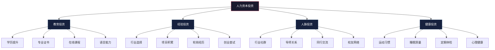
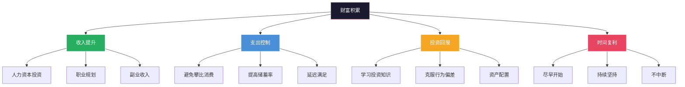

# 深度拓展：20-30岁的财务规划与行为分析

20-30岁是人生财务旅程的"黄金起跑期"。这一阶段的每一个财务决策——储蓄率的设定、职业赛道的选择、消费习惯的塑造——都会通过复利效应在未来几十年被放大数十倍。本章从职业早期财务规划、人力资本投资、行为金融学、关键财务决策、同龄人压力应对、数字时代搞钱方式六个维度，系统拆解20-30岁的财富积累逻辑。

```mermaid
graph TD
    A[20-30岁财富积累] --> B[职业早期财务规划]
    A --> C[人力资本投资]
    A --> D[行为偏差修正]
    A --> E[关键财务决策]
    A --> F[同龄人压力应对]
    A --> G[数字时代搞钱]
    B --> B1[应急基金]
    B --> B2[消灭高息负债]
    B --> B3[启动长期投资]
    C --> C1[教育投资]
    C --> C2[经验投资]
    C --> C3[人脉投资]
    C --> C4[健康投资]
    D --> D1[过度自信]
    D --> D2[确认偏差]
    D --> D3[锚定效应]
    D --> D4[从众行为]
    D --> D5[损失厌恶]
    E --> E1[租房vs买房]
    E --> E2[买车决策]
    E --> E3[自我投资]
    E --> E4[大额收入处理]
    F --> F1[攀比消费]
    F --> F2[FOMO投资]
    F --> F3[职业从众]
    G --> G1[内容创业]
    G --> G2[技能变现]
    G --> G3[知识付费]
    G --> G4[共享经济]
    style A fill:#1a1a2e,stroke:#e94560,color:#fff
    style B fill:#16213e,stroke:#0f3460,color:#fff
    style C fill:#16213e,stroke:#0f3460,color:#fff
    style D fill:#16213e,stroke:#0f3460,color:#fff
    style E fill:#16213e,stroke:#0f3460,color:#fff
    style F fill:#16213e,stroke:#0f3460,color:#fff
    style G fill:#16213e,stroke:#0f3460,color:#fff
```



***

## 一、职业早期的财务规划

### 1.1 职业早期的财务特征

20-30岁是人生财务旅程的起点，这一阶段的财务状况具有鲜明的结构性特征。理解这些特征是制定有效财务策略的前提。

**收入特征：**

| 特征维度 | 具体表现 | 数据支撑 |
|----------|----------|----------|
| 绝对水平 | 处于职业生涯最低点 | 应届生平均月薪约5,000-8,000元（一线城市） |
| 增长潜力 | 增长曲线呈J型 | 前3年年均增长8%-15%，之后可能出现跳跃式增长 |
| 收入结构 | 高度依赖工资 | 工资收入占比通常超过90% |
| 行业差异 | 行业选择影响巨大 | 金融/互联网起薪是传统制造业的2-3倍 |
| 地域差异 | 城市能级决定天花板 | 一线城市收入是三四线城市的2-4倍 |

**支出特征：**

- **刚性支出占比高**：房租（通常占收入25%-40%）、交通、餐饮三项合计可占收入的60%-70%
- **社交支出快速增长**：聚会、旅行、礼物等社交支出在25岁前后会出现一个明显的增长拐点
- **消费欲望与收入的矛盾**：刚脱离学生身份，消费欲望被释放，但收入水平尚未跟上
- **"首次高收入"心理效应**：第一次拿到月薪时的兴奋感容易导致冲动消费，心理学称之为"收入幻觉"——将暂时的收入水平误判为永久水平

**资产负债特征：**

- 净资产通常为负值或接近零（助学贷款余额、信用卡分期、消费贷等）
- 缺乏实质性资产积累，金融资产通常低于5万元
- 信用记录处于建立初期，信用卡额度较低
- 风险承受能力理论上最高——因为几乎没有可损失的资产，"年轻就是最大的资本"

### 1.2 职业早期财务规划的四步法


**第一步：建立应急基金（入职第0-6个月）**

应急基金是所有财务规划的基石。没有应急基金，任何意外支出（生病、失业、设备损坏）都可能迫使你借入高息贷款，抵消数月的储蓄成果。

目标金额的计算方法：

```text
应急基金目标 = 月固定支出 × 3（保守）至 6（稳健）

示例：
月固定支出明细：
  房租：3,000元
  餐饮：1,500元
  交通：300元
  通讯：100元
  水电：200元
  月固定支出合计：5,100元
  
保守目标（3个月）：15,300元
稳健目标（6个月）：30,600元
```

存放原则：
- **流动性第一**：应急基金必须能在24小时内取出使用
- **安全性第二**：本金不能有任何损失风险
- **收益性最后**：不追求收益，能跑赢活期利率即可

推荐存放方式对比：

| 存放方式 | 年化收益 | 流动性 | 安全性 | 推荐指数 |
|----------|----------|--------|--------|----------|
| 货币基金（余额宝/零钱通） | 1.5%-2.0% | T+0快速到账（单日限额1万） | 极高 | ★★★★★ |
| 银行活期存款 | 0.2%-0.35% | 即时 | 极高 | ★★★☆☆ |
| 短期银行理财（T+1） | 2.5%-3.5% | T+1到账 | 高 | ★★★★☆ |
| 国债逆回购 | 1.5%-3.0%（波动） | 到期自动到账 | 极高 | ★★★☆☆ |

具体做法：
1. 记录每月固定支出，计算应急基金目标金额
2. 设定每月自动转存金额（建议为月收入的10%-20%）
3. 开设一个独立的储蓄账户，与日常消费账户隔离
4. 在应急基金建立之前，暂停一切非必要消费和高风险投资

**第二步：消灭高息负债（入职第6-18个月）**

高息负债是财富积累的最大敌人。信用卡分期、消费贷、网贷等的利率通常在15%-24%之间，远高于任何投资的预期年化回报率（沪深300长期年化约8%-10%）。消灭高息负债本身就是最好的"投资"。

负债优先级排序：

| 负债类型 | 典型年利率 | 优先级 | 处理策略 |
|----------|-----------|--------|----------|
| 网贷/现金贷 | 24%-36% | 最高 | 立即还清，必要时动用应急基金 |
| 信用卡分期 | 13%-18% | 高 | 优先还清，停止新增分期 |
| 信用卡最低还款 | 18%-24% | 高 | 避免只还最低，尽快全额还清 |
| 消费贷（银行） | 6%-12% | 中 | 制定还款计划，每月多还 |
| 助学贷款 | 3%-5% | 低 | 按期还款即可，不急提前还清 |

债务偿还策略详解：

**雪崩法（Avalanche Method）**：优先偿还利率最高的负债。数学上最优，总利息支出最少。

```text
示例：
负债A：信用卡分期 18,000元，年利率18%
负债B：消费贷 30,000元，年利率8%
负债C：助学贷款 20,000元，年利率4%

每月还款预算：5,000元

雪崩法执行：
第1-4个月：负债A还18,000元 + 利息约1,080元，负债B/C仅还最低
第5-12个月：集中还负债B
第13-16个月：还清负债C
总利息支出：约4,200元
```

**雪球法（Snowball Method）**：优先偿还金额最小的负债。心理学上更有效，通过快速消灭小额负债获得成就感和动力。

```text
同一示例用雪球法：
第1-4个月：先还清负债A（18,000元，最小金额）
第5-10个月：还清负债C（20,000元）
第11-18个月：还清负债B（30,000元）
总利息支出：约5,800元
```

两种方法的对比：

| 对比维度 | 雪崩法 | 雪球法 |
|----------|--------|--------|
| 总利息支出 | 更少（节省约15%-30%） | 更多 |
| 心理激励 | 较弱（大额负债还很久） | 较强（快速消灭小额负债） |
| 适合人群 | 理性、自律型 | 需要成就感驱动型 |
| 执行难度 | 需要持续的意志力 | 容易坚持 |

核心规则：每月偿还金额不低于收入的20%。在还清所有高息负债（年利率>6%）之前，暂停非必要的投资活动。

**第三步：建立保障体系（入职第12-18个月）**

在应急基金建立、高息负债消灭之后，下一步是建立基本的保险保障。20多岁的年轻人往往忽视保险，认为"我还年轻，不会生病"。但保险的本质是用小额确定性支出（保费）转移大额不确定性风险（重疾、意外）。

20-30岁必买的保险清单：

| 保险类型 | 年保费参考 | 保额建议 | 核心作用 |
|----------|-----------|----------|----------|
| 医疗险（百万医疗） | 200-400元 | 200-400万元 | 覆盖大病住院费用 |
| 意外险 | 100-300元 | 50-100万元 | 覆盖意外伤残/身故 |
| 重疾险（定期） | 2,000-4,000元 | 30-50万元 | 确诊即赔，覆盖收入损失 |

总保费预算：2,500-5,000元/年，占年收入的2%-5%。

购买顺序：百万医疗险 → 意外险 → 定期重疾险。不要买返还型保险（贵且收益低），不要买万能险/分红险（保障不足、理财不强）。

**第四步：启动长期投资（入职第18-24个月起）**

在前三步完成后，可以开始进行长期投资。对于20多岁的年轻人，最具价值的投资方向：

1. **指数基金定投**：利用长期复利效应，每月定投宽基指数基金（沪深300、中证500）。这是最适合普通人的投资方式——不需要选股能力，不需要择时，只需要坚持。
2. **个人能力提升**：参加培训课程、考取专业证书、提升学历（详见本章第二节人力资本投资）。
3. **健康投资**：建立运动习惯、改善饮食结构、定期体检。健康是一切财富的载体。

### 1.3 储蓄率的战略意义

对于20多岁的年轻人来说，**储蓄率**比投资回报率更为重要。这个结论违反直觉，但数学上无可辩驳。

假设月收入10,000元，投资年化回报率8%：

| 储蓄率 | 月储蓄 | 年储蓄 | 5年本金 | 5年本息（8%复利） | 10年本息 |
|--------|--------|--------|---------|-------------------|----------|
| 10% | 1,000元 | 12,000元 | 60,000元 | 73,466元 | 182,952元 |
| 20% | 2,000元 | 24,000元 | 120,000元 | 146,933元 | 365,905元 |
| 30% | 3,000元 | 36,000元 | 180,000元 | 220,399元 | 548,857元 |
| 50% | 5,000元 | 60,000元 | 300,000元 | 367,332元 | 914,762元 |

关键洞察：储蓄率从10%提高到30%（增加3倍），10年后本息增加了200%。而如果储蓄率保持10%不变，投资回报率从8%提高到15%（接近专业投资者水平），10年后本息仅增加约40%。

**这意味着：在20-30岁阶段，把主要精力放在提高收入和控制支出上，比追求高投资回报率有效得多。**

储蓄率提升的实操方法：

| 方法 | 预期节省 | 难度 | 具体操作 |
|------|----------|------|----------|
| 住房优化 | 收入的5%-15% | 中 | 合租、选择通勤稍远但租金低的区域 |
| 餐饮优化 | 收入的3%-8% | 低 | 自己做饭（成本约为外卖的1/3），减少不必要的聚餐 |
| 订阅清理 | 100-300元/月 | 低 | 清理不常用的会员订阅（视频、音乐、健身卡等） |
| 购物冷静期 | 收入的5%-10% | 中 | 非必需品等待48小时再决定 |
| 收入提升 | 潜力最大 | 高 | 加薪谈判、跳槽、发展副业 |

***

## 二、人力资本投资理论

### 2.1 人力资本的概念与估值

人力资本（Human Capital）是经济学家加里·贝克尔（Gary Becker）在1964年提出的概念，指个人通过教育、培训和工作经验积累的知识、技能和能力的总和。贝克尔因此获得了1992年诺贝尔经济学奖。

人力资本是20-30岁阶段最重要的"资产"，其价值往往远超个人的金融资产。理解这一点，是制定正确财务优先级的基础。

**人力资本的简易估值模型：**

```text
人力资本价值 = 年收入 × 预期工作年限 × 收入增长系数

示例：
当前年收入：100,000元
预期工作年限：35年（25岁到60岁）
年均收入增长率：5%

不考虑增长：100,000 × 35 = 350万元
考虑增长（等比数列求和）：
  人力资本价值 = 100,000 × (1.05^35 - 1) / 0.05 ≈ 903万元
```

更精确的估值需要考虑折现率（将未来收入折算为当前价值）：

```text
人力资本现值 = Σ [年收入_t / (1+r)^t]，t从1到35

假设折现率r=5%（接近长期国债收益率）：
人力资本现值 ≈ 100,000 × 16.37 ≈ 163.7万元
```

**核心洞察：如果你目前年收入10万元，你的人力资本现值约为160万元。通过教育和技能提升将年收入提高到20万元，人力资本现值就翻倍至320万元。投资5万元的MBA课程，如果能将年薪提升10万元，仅需不到一年就能回本——这是任何金融投资都无法比拟的回报率。**

### 2.2 人力资本投资的四大类型



**教育投资的回报率分析：**

| 教育投资类型 | 典型费用 | 预期年薪提升 | 回本周期 | ROI（5年） |
|-------------|----------|-------------|----------|-----------|
| 在职硕士 | 5-15万元 | 2-5万元/年 | 2-4年 | 100%-300% |
| MBA（非全日制） | 15-40万元 | 5-15万元/年 | 2-4年 | 100%-250% |
| CPA/CFA证书 | 1-3万元 | 3-8万元/年 | 半年-1年 | 500%-2000% |
| PMP/软考等 | 0.5-1万元 | 1-3万元/年 | 半年 | 500%-1500% |
| 英语能力提升 | 0.5-3万元 | 2-10万元/年（外企/出海） | 半年-1年 | 300%-500% |
| 编程技能（自学/培训） | 0-2万元 | 3-10万元/年 | 半年-1年 | 500%-3000% |

**经验投资的关键原则：**

1. **选择有学习曲线的行业和岗位**：入职前3年，薪资不是唯一标准。一个起薪8,000元但能学到核心技能的岗位，长期价值远高于起薪12,000元但技能天花板低的岗位。
2. **主动承担挑战性项目**：在职场中，"舒适区"是最大的陷阱。主动争取有难度的项目，是加速能力成长的最有效方式。
3. **争取轮岗机会**：跨职能的经验积累能帮助你建立"T型能力结构"——既有专业深度，又有跨领域视野。
4. **适度的创业尝试**：即使不全职创业，也可以通过副业、自由职业等方式体验创业过程，培养商业思维。

**人脉投资的实操方法：**

- **加入行业社群**：选择2-3个高质量的行业社群（微信群、知识星球、线下沙龙），定期参与讨论和分享
- **建立导师关系**：找到3-5位比你资深5-10年的行业前辈，定期请教。导师的价值不仅在于直接指导，更在于帮你避免"已知的坑"
- **参加行业会议**：每年参加2-3场行业峰会或论坛，主动与演讲者和参会者交流
- **维护校友网络**：大学校友是最容易建立信任关系的人脉资源，定期参加校友活动

**健康投资的长期回报：**

健康是"1"，其他一切都是后面的"0"。20-30岁建立的健康习惯，将影响未来40-50年的生活质量。

- **运动习惯**：每周3-4次、每次30-60分钟的中等强度运动（跑步、游泳、力量训练）。长期坚持可以降低60%的心血管疾病风险、50%的糖尿病风险。
- **睡眠质量**：保证每晚7-8小时的睡眠。睡眠不足会导致认知能力下降30%、免疫力下降40%。
- **定期体检**：每年一次全面体检，重点关注血压、血糖、血脂、肝功能等指标。早期发现的治疗成本是晚期的1/10到1/100。
- **心理健康**：学会压力管理，必要时寻求专业心理咨询。心理健康的投入回报率往往被严重低估。

### 2.3 人力资本与金融资本的平衡

一个关键问题是：如何在人力资本投资和金融资本投资之间分配有限的资源？


**原则一：年轻时优先投资人力资本。** 因为人力资本的收益期最长（未来几十年），而且年轻人的时间成本相对较低。一个25岁的人花2年读全日制MBA，放弃的收入约20万元；一个35岁的人做同样的选择，放弃的收入可能是50-80万元。

**原则二：当人力资本投资的边际回报递减时，转向金融资本投资。** 例如，当你已经在某个领域积累了丰富经验，继续深造的边际收益可能不如开始投资理财。判断标准：如果一项教育投资的预期年化回报率低于15%，而你已经掌握了基本的投资知识，那么将同等资金投入金融市场可能更划算。

**原则三：保持人力资本投资的持续性。** 即使在开始金融投资后，也应该持续投资于学习和技能提升，以应对职场变化。在AI时代，技能的半衰期正在缩短——一项技能的"保质期"可能只有3-5年，持续学习不是可选项，而是生存必需。

### 2.4 人力资本投资的决策框架

当面对一项具体的人力资本投资机会时，可以用以下框架进行评估：

```text
人力资本投资决策清单：

1. 收入提升评估
   - 这项投资能带来多少确定性的收入提升？
   - 收入提升是永久性的还是暂时性的？
   - 行业/岗位的收入天花板是多少？

2. 成本评估
   - 直接成本（学费、考试费、培训费）是多少？
   - 间接成本（放弃的收入、时间成本）是多少？
   - 是否需要承担负债？

3. 风险评估
   - 投资失败的概率有多大？（如考试未通过、学历不被认可）
   - 最坏情况下的损失是什么？
   - 是否有备选方案？

4. 时机评估
   - 现在是最佳时机吗？（职业阶段、家庭状况、经济环境）
   - 推迟投资的机会成本是什么？
   - 是否有窗口期限制？（如某些证书有年龄偏好）

5. 替代方案评估
   - 是否有更低成本的方式达到同样的效果？
   - 自学能否替代付费培训？
   - 是否可以通过工作实践获得同等能力？
```

***

## 三、年轻投资者的行为特征

### 3.1 行为金融学视角下的年轻投资者

行为金融学研究表明，年轻投资者在投资决策中表现出一系列系统性的行为偏差。这些偏差不是个别人的"愚蠢"，而是人类认知系统的固有局限。认识并理解这些偏差，是克服它们的前提。

**偏差一：过度自信偏差（Overconfidence Bias）**

心理学家发现，人类有一种根深蒂固的倾向——高估自己的能力和判断质量。在投资领域，这种偏差尤为严重。

数据佐证：
- 研究显示，新入市的投资者中超过70%认为自己的投资水平高于平均水平（这在统计学上显然不可能）
- 散户投资者的年均换手率超过300%（机构投资者约为50%-100%），频繁交易的散户中超过80%跑输大盘
- 巴bera和Odean的经典研究（2000年）发现，交易最频繁的散户，年化收益比交易最少的散户低7个百分点

过度自信的典型表现：
- **频繁交易**：认为自己能"低买高卖"，实际上每次交易都在给券商交手续费
- **重仓单一标的**：将大部分资金押注在一只股票或一个行业上，忽视分散化的重要性
- **忽视风险提示**：对负面信息充耳不闻，只关注支持自己判断的信息
- **过度依赖社交媒体**：将KOL的推荐当作投资依据，缺乏独立分析能力

**偏差二：确认偏差（Confirmation Bias）**

一旦形成某种投资判断，投资者就会不自觉地只寻找支持这个判断的信息，而忽视或贬低相反的证据。

典型场景：
- 买入某只股票后，只看多头分析师的报告，对空头报告嗤之以鼻
- 加入某个投资社群后，只与观点相同的人交流，形成"信息茧房"
- 在搜索引擎中，倾向于搜索"XX股票为什么值得买"而不是"XX股票的风险"

**偏差三：锚定效应（Anchoring Effect）**

投资者容易被某个"锚点"数字绑架，影响后续判断。

常见锚点：
- **历史最高价**：某股票最高涨到100元，现在跌到60元，觉得"便宜"——但100元可能本身就是泡沫
- **买入成本价**：以10元买入，跌到8元不愿意止损，因为"等回本再卖"——成本价与未来走势毫无关系
- **整数关口**：股价从9.9元涨到10元时犹豫要不要卖，仅仅因为10是一个"整数"
- **分析师目标价**：某券商给出目标价50元，就将其当作"合理"估值

**偏差四：从众行为（Herd Behavior）**

年轻投资者特别容易受到群体行为的影响。社交媒体的普及进一步放大了这种效应。

经典案例：
- **2021年GameStop事件**：Reddit论坛上的散户集体买入GameStop股票，股价从20美元暴涨至483美元，随后暴跌至40美元。大量跟风买入的散户损失惨重。
- **2020-2021年加密货币热潮**：大量年轻人在比特币6万美元时入场，随后比特币跌至1.6万美元，亏损超过70%。
- **"基金抱团"现象**：2021年初大量散户追买明星基金经理的产品，随后市场回调，许多基金回撤超过30%。

从众行为的心理根源：
- **信息级联**：看到别人赚钱，认为"他们一定知道什么我不知道的"
- **社会认同**：不想被排除在"赚钱的机会"之外
- **责任分散**：如果大家都亏了，"不是我一个人的错"

**偏差五：损失厌恶（Loss Aversion）**

卡尼曼和特沃斯基的前景理论（Prospect Theory）是行为金融学的基石。其核心发现是：人们对损失的痛苦感受大约是等量收益快乐感受的2-2.5倍。

这导致一系列非理性行为：
- **不愿止损**：亏损时死扛不卖，期望"回本"，结果越亏越多
- **过早止盈**：小幅盈利时急于兑现，错失后续更大的涨幅
- **摊低成本**：在亏损时加倍投入，试图降低平均成本——但如果判断本身就是错的，加倍投入只会加倍亏损
- **处置效应**：投资者倾向于卖出盈利的股票（锁定收益），保留亏损的股票（不愿承认错误）

### 3.2 年轻投资者的独特优势

尽管存在上述行为偏差，年轻投资者也拥有一些年长投资者不具备的优势：

**优势一：时间优势——复利的终极盟友**

假设从25岁开始每月定投2,000元，年化回报率8%：

| 起始年龄 | 投资年限 | 60岁时总资产 | 其中本金 | 复利收益 |
|----------|----------|-------------|----------|----------|
| 25岁 | 35年 | 459万元 | 84万元 | 375万元 |
| 30岁 | 30年 | 298万元 | 72万元 | 226万元 |
| 35岁 | 25年 | 190万元 | 60万元 | 130万元 |
| 40岁 | 20年 | 118万元 | 48万元 | 70万元 |

晚开始5年，最终资产少了161万元（减少35%）。这就是"时间就是金钱"最精确的数学表达。

时间优势还意味着：
- 可以承受更高的风险，追求更高的长期回报
- 有足够的时间等待市场回暖（A股历史上最长的熊市持续约4年）
- 可以从错误中学习并恢复

**优势二：学习能力强**

年轻人的学习能力强，能够快速掌握新的投资工具和策略。在线学习资源的丰富性使得年轻人可以比前几代人更快地建立投资知识体系。

推荐的学习路径：

| 阶段 | 内容 | 推荐资源 | 预计时间 |
|------|------|----------|----------|
| 入门 | 理解基本概念（复利、通胀、风险收益） | 《小狗钱钱》《富爸爸穷爸爸》 | 1-2周 |
| 基础 | 掌握基金投资 | 《指数基金投资指南》（银行螺丝钉） | 2-4周 |
| 进阶 | 理解资产配置 | 《漫步华尔街》《投资中最简单的事》 | 1-2月 |
| 深入 | 学习财务分析 | 《聪明的投资者》《证券分析》 | 3-6月 |
| 实践 | 建立自己的投资体系 | 模拟交易 → 小额实盘 → 逐步加仓 | 持续进行 |

**优势三：负担轻，试错成本低**

年轻人通常没有家庭负担（房贷、子女教育等），可以将更多的收入用于投资。更重要的是，即使投资出现亏损，也有足够的时间和机会通过工作收入弥补。

### 3.3 克服行为偏差的系统化策略

**策略一：建立投资纪律并写成书面规则**

将投资规则写下来，形成自己的"投资宪法"。在情绪波动时，严格按照规则执行。

```text
我的投资宪法（示例）：

1. 定投规则
   - 每月15日自动定投，金额为月收入的20%
   - 不因市场涨跌改变定投金额
   - 定投标的：沪深300指数基金60% + 中证500指数基金40%

2. 个股投资规则
   - 单一持仓不超过总资产的10%
   - 行业集中度不超过30%
   - 买入前必须写下3个买入理由和3个可能的风险
   - 亏损达到15%强制止损

3. 信息管理规则
   - 每天查看行情不超过2次
   - 每笔交易前阅读至少2篇不同观点的分析
   - 不在社交媒体上跟风投资

4. 情绪管理规则
   - 市场大跌时不操作（等待24小时）
   - 市场大涨时不加仓（等待24小时）
   - 每季度回顾一次投资组合，不频繁调仓
```

**策略二：信息多元化——主动寻找反面观点**

在做出任何投资决策之前，强迫自己完成以下步骤：
1. 写下你看好这个投资的理由
2. 搜索至少3篇持相反观点的分析
3. 如果反面观点有道理，重新评估你的决策
4. 记录最终决策和理由，事后复盘

**策略三：延迟决策——"冷静期"规则**

当情绪激动时（无论是恐惧还是贪婪），不做出任何投资决策。
- 设定24-72小时的冷静期
- 冷静期内，记录自己的情绪状态和冲动想法
- 冷静期结束后，重新评估是否还需要执行原计划

**策略四：模拟交易——先练后打**

在投入真金白银之前，先用模拟账户进行3-6个月的交易。模拟交易的价值不在于"赚了多少钱"，而在于：
- 检验自己的投资策略是否有效
- 了解自己面对亏损时的心理反应
- 熟悉交易流程和工具
- 建立交易纪律

***

## 四、20-30岁的关键财务决策

### 4.1 决策一：租房还是买房？

这是20-30岁阶段最大的财务决策之一，也是最容易引发焦虑的话题。传统观念认为"有房才有家"，但从财务角度看，这个决策远比表面看起来复杂。

**买房vs租房的全维度对比：**

| 对比维度 | 买房 | 租房 |
|----------|------|------|
| 资产积累 | 每月还贷相当于"强制储蓄"，逐步积累房产净值 | 租金是纯消费支出，不形成资产 |
| 流动性 | 极差——卖房需要数月，交易成本高（税费约房价的3%-5%） | 极好——租约到期即可搬迁 |
| 初始资金 | 需要首付（通常为房价的20%-30%）+ 税费 + 装修 | 仅需押金（通常为1-3个月租金） |
| 月度支出 | 月供 + 物业费 + 维修基金 + 装修折旧 | 租金（通常低于同地段月供） |
| 灵活性 | 受限——换城市/换工作需要考虑房产处置 | 灵活——可以根据职业发展随时调整 |
| 心理感受 | 安全感、归属感、社会认同 | 轻松、自由、无负债压力 |
| 杠杆效应 | 房贷是普通人能获得的最大杠杆（3-5倍） | 无杠杆 |
| 通胀对冲 | 房产长期来看能跑赢通胀 | 租金随通胀上涨 |

**决策框架——量化分析：**

```text
租房vs买房的量化决策模型：

关键指标：房价租金比 = 房价 / 年租金

房价租金比 < 15：买房更划算（相当于不到15年的租金就能买下房子）
房价租金比 15-25：中性区间，取决于个人偏好
房价租金比 > 25：租房更划算

中国主要城市房价租金比（2024年参考）：
北京：约50-60
上海：约45-55
深圳：约55-65
杭州：约35-45
成都：约25-35
武汉：约25-30

结论：一线城市从纯财务角度看，租房更划算
```

**月供压力测试：**

```text
月供不超过月收入的30%（保守）至40%（激进）

示例：
月收入：15,000元
可承受月供上限（30%）：4,500元
可承受月供上限（40%）：6,000元

按30年期、利率4.2%计算：
月供4,500元 → 可贷约88万元 → 加上30%首付 → 可买约126万元的房
月供6,000元 → 可贷约118万元 → 加上30%首付 → 可买约168万元的房
```

**建议：**
- 如果你所在城市的房价租金比超过30，且你有明确的职业发展计划需要保持流动性，租房是更理性的选择
- 如果你打算长期在一个城市定居（5年以上），有稳定收入，且房价收入比在可承受范围内，可以考虑买房
- 无论租房还是买房，都要确保月供或租金不超过收入的30%-40%
- 不要因为"怕房价涨"而恐慌性买房——恐惧驱动的决策往往是最差的决策

### 4.2 决策二：要不要买车？

在中国的一线城市，由于公共交通发达、停车困难、限牌政策等因素，买车可能不是最优选择。但在二三线城市，汽车可能是必要的交通工具。

**买车的真实持有成本（以15万元的车为例）：**

| 成本项目 | 年费用（元） | 说明 |
|----------|-------------|------|
| 车辆折旧 | 15,000-22,500 | 前3年年均折旧约15%-20% |
| 保险费用 | 4,000-8,000 | 交强险+商业险 |
| 油费/电费 | 6,000-12,000 | 年行驶1.5万公里 |
| 停车费 | 6,000-24,000 | 小区+外出停车，一线城市更高 |
| 维修保养 | 2,000-5,000 | 常规保养+零配件更换 |
| 过路费 | 1,000-3,000 | 高速公路通行费 |
| 洗车/美容 | 500-1,500 | |
| 违章罚款 | 500-2,000 | |
| **合计** | **35,000-78,000** | **月均3,000-6,500元** |

**对比分析：**

```text
方案A：买车
年持有成本：约50,000元（取中间值）
10年总成本：500,000元（不含换车）

方案B：不买车，出行用公共交通+偶尔打车/租车
年出行成本：约12,000-20,000元
10年总成本：120,000-200,000元

差额：300,000-380,000元

如果将差额投资（年化8%）：
10年后：约450,000-570,000元
```

**建议：**
- 一线城市：除非工作确实需要（如销售、客户拜访），否则暂缓购车
- 二三线城市：如果公共交通不便且通勤距离较远，可以考虑购买经济型车辆
- 购车预算：不超过年收入的50%，避免成为"车奴"
- 考虑新能源车：使用成本约为燃油车的1/3-1/5

### 4.3 决策三：如何投资自己？

20-30岁是人力资本投资回报率最高的阶段。以下几种自我投资的回报率分析：

**自我投资的IRR计算方法：**

```text
人力资本IRR = (年收入增加额 - 年分摊成本) / 投资总额

示例1：专业技能培训
投入：20,000元培训费 + 200小时时间（按50元/小时计 = 10,000元）
总投入：30,000元
预期效果：年薪增加10,000元
收益持续期：20年
总收益：200,000元
IRR：约30%（远高于金融市场投资）

示例2：在职硕士
投入：学费80,000元 + 3年时间成本（每年投入500小时 × 50元 = 25,000元 × 3 = 75,000元）
总投入：155,000元
预期效果：年薪增加30,000元
收益持续期：25年
总收益：750,000元
IRR：约18%

示例3：英语能力提升
投入：课程费10,000元 + 1年时间（每天1小时 × 365天 × 50元 = 18,250元）
总投入：28,250元
预期效果：获得外企offer，年薪增加50,000元
收益持续期：20年
总收益：1,000,000元
IRR：约85%
```

**自我投资的优先级排序（按IRR从高到低）：**

| 优先级 | 投资方向 | 典型投入 | 预期IRR | 适合人群 |
|--------|----------|----------|---------|----------|
| 1 | 核心职业技能深化 | 低（时间为主） | 50%-200% | 所有人 |
| 2 | 语言能力（英语） | 1-3万元 | 50%-100% | 有国际化需求者 |
| 3 | 专业证书（CPA/CFA等） | 1-3万元 | 100%-500% | 金融/会计/法律从业者 |
| 4 | 编程/数据技能 | 0-2万元 | 50%-200% | 非技术岗位想转型者 |
| 5 | 学历提升 | 5-20万元 | 15%-40% | 学历受限者 |
| 6 | 管理能力 | 2-10万元 | 20%-60% | 有晋升潜力者 |

### 4.4 决策四：如何处理第一笔大额收入？

当你第一次获得大额收入时（年终奖、项目奖金、副业收入等），如何处理是一个关键决策。这笔钱的处理方式，往往会成为你未来财务习惯的"模板"。

**常见错误及后果：**

| 错误做法 | 心理动因 | 后果 |
|----------|----------|------|
| 全部消费掉 | "犒劳自己" | 没有形成任何资产积累 |
| 全部投入高风险投资 | "搏一把" | 可能损失大部分甚至全部 |
| 存入活期不处理 | "以后再说" | 通货膨胀侵蚀购买力 |
| 全部还贷 | "无债一身轻" | 失去了投资增值的机会 |

**推荐的分配方案——"4321法则"：**

```text
第一笔大额收入分配方案：

示例：年终奖 50,000元

10%（5,000元）→ 犒劳自己
  - 买一件一直想要的东西
  - 享受一顿好的
  - 目的：保持生活的热情，避免"苦行僧"式的储蓄

30%（15,000元）→ 充实应急基金
  - 如果应急基金已满，转入短期理财

30%（15,000元）→ 偿还高息负债
  - 优先偿还利率最高的负债
  - 如果没有负债，转入长期投资

30%（15,000元）→ 长期投资
  - 指数基金定投（一次性投入或分3-6个月定投）
  - 或用于自我投资（培训、证书等）
```

### 4.5 决策五：如何规划恋爱与婚姻的财务？

20-30岁也是恋爱和婚姻的关键时期。财务问题是导致情侣和夫妻矛盾的首要原因之一。

**恋爱阶段的财务建议：**

- **建立透明的财务沟通**：在关系稳定后（通常3-6个月），坦诚地讨论各自的收入、负债、储蓄目标
- **设定约会预算**：约会支出不应超过月收入的15%-20%。浪漫不需要花很多钱——用心比花钱更重要
- **避免"恋爱通胀"**：不要因为恋爱而大幅提高消费水平。如果恋爱前月消费5,000元，恋爱后不应超过7,000元
- **共同消费AA或轮流**：不必每次都由一方买单，建立公平的消费分担机制

**婚姻准备的财务清单：**

| 项目 | 预算参考 | 时间规划 |
|------|----------|----------|
| 婚礼 | 3-10万元（量力而行） | 婚前6-12个月 |
| 婚房首付 | 根据城市和收入评估 | 婚前1-3年 |
| 婚房装修 | 5-15万元 | 婚前3-6个月 |
| 蜜月旅行 | 1-3万元 | 婚后1-3个月 |
| 婚后应急基金 | 6个月家庭支出 | 婚后持续积累 |

**婚前必谈的5个财务话题：**
1. 双方的收入、负债、资产情况
2. 婚后财务管理方式（共同账户/各自管理/混合制）
3. 大额消费的决策机制（多少金额以上需要商量）
4. 双方父母的赡养计划
5. 未来3-5年的财务目标（买房、生娃、教育基金等）

***

## 五、同龄人压力与财务行为

### 5.1 社会比较理论

费斯汀格（Leon Festinger）在1954年提出的社会比较理论指出，人们有一种本能的倾向，通过与他人比较来评估自己的能力和状况。这种比较分为两种：

- **上行比较**：与比自己"好"的人比较——可能产生激励作用，也可能导致焦虑和自卑
- **下行比较**：与比自己"差"的人比较——可能产生满足感，也可能导致自满

社交媒体的普及极大地放大了社会比较效应。朋友圈、小红书、抖音上精心包装的生活方式展示，创造了一个"虚假的平均水平"——你看到的不是别人的真实生活，而是他们最好的瞬间。

研究数据：
- 哈佛大学的研究发现，每天使用社交媒体超过2小时的年轻人，报告焦虑和抑郁症状的比例比使用30分钟以下的人高50%
- 英国皇家公共卫生协会的报告指出，Instagram是对年轻人心理健康影响最大的社交平台
- 社会比较强度与财务决策质量呈负相关——越频繁地与他人比较，越容易做出冲动消费和盲目投资

### 5.2 同龄人压力对财务行为的三大影响

**影响一：攀比消费——"别人有的我也要有"**

攀比消费是20-30岁阶段最常见的财务陷阱。它的心理机制是：

```text
触发事件：看到同龄人消费展示
    ↓
心理反应："他都买了，我也应该有"
    ↓
合理化："人生苦短，及时行乐"
    ↓
行为结果：超前消费、负债消费
    ↓
长期后果：财务积累被严重侵蚀
```

攀比消费的典型场景：
- 同事换了新手机，自己也想换
- 朋友圈晒旅行照片，自己也想去
- 朋友买了名牌包，自己觉得"也不能太寒酸"
- 同学聚会时发现别人收入比自己高，回家后报复性消费

**影响二：FOMO投资——"我不能错过"**

FOMO（Fear of Missing Out，错失恐惧症）是导致高位追涨、盲目跟风投资的主要心理动因。

FOMO投资的典型路径：
1. 看到某个投资品暴涨（如某只股票、加密货币、基金）
2. 看到身边的人"赚了大钱"（通常只听到赚钱的故事，亏钱的都沉默了）
3. 产生强烈的"我也要参与"的冲动
4. 在高位买入
5. 市场回调，亏损
6. 恐慌性卖出
7. 市场反弹，后悔

**影响三：职业选择的从众效应**

同龄人纷纷进入某个"热门行业"（如曾经的互联网、金融、人工智能），可能让人忽略自己的兴趣和特长，盲目跟风。

从众择业的风险：
- 进入了不适合自己的行业，既不快乐，发展也受限
- 热门行业的竞争激烈程度远超想象
- 当你进入时，行业可能已经过了高速增长期
- 缺乏真正的热情和兴趣，难以在行业中建立深度竞争力

### 5.3 应对同龄人压力的系统化策略

**策略一：建立内在评价标准**

```text
内在标准 vs 外在标准：

外在标准（容易导致焦虑）：
  ✗ 别人的收入水平
  ✗ 别人的消费水平
  ✗ 别人的投资收益
  ✗ 别人的职业头衔

内在标准（促进真正成长）：
  ✓ 我的储蓄率是否比上个月提高了？
  ✓ 我的负债是否比上个月减少了？
  ✓ 我的技能是否比上个月提升了？
  ✓ 我是否比半年前更接近自己的目标？
```

具体做法：
- 每季度做一次个人财务回顾，与自己的过去比较
- 建立个人财务仪表盘（Excel或记账App），跟踪关键指标
- 为自己设定个性化的财务目标，而不是"别人有的我也要有"
- 定期提醒自己：社交媒体上看到的不是别人的完整生活

**策略二：延迟满足的系统训练**

延迟满足能力是财务成功的关键预测指标。心理学家沃尔特·米歇尔的"棉花糖实验"（Stanford Marshmallow Experiment）追踪了数百名儿童数十年，发现能够延迟满足的儿童，在成年后的收入水平、健康状况和人际关系质量都显著更好。

训练延迟满足的具体方法：

| 方法 | 具体操作 | 预期效果 |
|------|----------|----------|
| 24小时规则 | 想要购买非必需品时，强制等待24小时 | 减少50%以上的冲动消费 |
| 等待清单法 | 将想要购买的东西列在清单上，30天后重新评估 | 清单上70%的物品30天后不再想要 |
| 消费转投资 | 每当产生消费欲望时，将等额资金转入投资账户 | 将消费冲动转化为财富积累 |
| 成本换算 | 将消费金额换算为工作时间（如500元 = 工作10小时） | 直观感受消费的真实成本 |
| 替代满足 | 用低成本的替代方式满足同类需求 | 降低满足需求的成本 |

**策略三：构建正向社交圈**

吉姆·罗恩（Jim Rohn）说："你是你最常交往的5个人的平均值。"在财务领域，这句话尤为准确。

构建正向社交圈的做法：
- 加入理财学习社群（豆瓣理财小组、雪球社区等）
- 与志同道合的朋友组建"财务互助小组"，定期分享财务进展和学习心得
- 减少与"消费主义导向"的朋友的互动频率——不是断交，而是减少容易引发消费冲动的场景
- 关注理财领域的优质内容创作者，建立正向的信息输入
- 找到一位财务状况良好、有长期规划意识的"财务榜样"，学习他们的思维方式

**策略四：认知重构——改变对"富有"的定义**

```text
重新定义"富有"：

表面的富有（虚假的富有）：
  ✗ 开豪车、住大房、穿名牌
  ✗ 朋友圈里的精致生活
  ✗ 高收入但高消费、零储蓄

真正的富有：
  ✓ 被动收入覆盖基本生活支出
  ✓ 不需要为了钱而做自己不喜欢的工作
  ✓ 有足够的应急基金应对意外
  ✓ 有选择的自由——可以拒绝不想做的事
```

***

## 六、数字原住民的搞钱方式

### 6.1 数字原住民的定义与核心优势

"数字原住民"（Digital Natives）是教育学家马克·普伦斯基（Marc Prensky）在2001年提出的概念，指在数字技术环境中成长起来的一代人。20-30岁的年轻人是典型的数字原住民——从小就接触互联网、智能手机和社交媒体，数字技术不仅是工具，更是思维方式和生活方式的一部分。

数字原住民在搞钱方面的独特优势：

| 优势维度 | 具体表现 | 变现潜力 |
|----------|----------|----------|
| 技术敏感度 | 对新技术和新平台的接受速度快 | 能抓住早期红利 |
| 数字技能 | 内容创作、社交媒体运营、数据分析 | 多种变现渠道 |
| 信息获取 | 善于利用互联网获取信息和资源 | 降低信息不对称 |
| 线上社交网络 | 拥有天然的线上社交网络和影响力 | 社交电商、内容变现 |
| 创造力 | 敢于尝试新的商业模式 | 创新机会 |

### 6.2 数字时代的七大搞钱方式

**方式一：内容创业**

通过创作有价值的内容（文字、视频、音频）来获得收入。内容创业是数字原住民最天然的搞钱方式。

主要平台与变现路径：

| 平台类型 | 代表平台 | 内容形式 | 变现方式 | 收入范围 |
|----------|----------|----------|----------|----------|
| 短视频 | 抖音、快手、B站 | 视频（15秒-30分钟） | 广告分成、直播打赏、电商带货 | 月入0-50万+ |
| 自媒体 | 微信公众号、知乎、小红书 | 图文 | 广告投放、知识付费、品牌合作 | 月入0-20万+ |
| 播客 | 小宇宙、喜马拉雅 | 音频 | 广告植入、付费节目、品牌合作 | 月入0-10万+ |
| 直播 | 淘宝直播、抖音直播 | 实时视频 | 打赏、带货佣金 | 月入0-100万+ |

内容创业的关键成功要素：

1. **差异化定位**：不要做"什么都聊"的泛内容，而是聚焦一个细分领域。例如，不做"美食博主"，而做"500元以下一人食"；不做"理财博主"，而做"应届生第一份工资怎么花"
2. **稳定输出频率**：算法偏爱稳定的更新频率。每周至少更新2-3次，比偶尔爆发一次更重要
3. **深入理解平台算法**：每个平台的推荐机制不同。抖音重完播率，小红书重互动率，B站重弹幕和评论。理解算法才能获得流量
4. **深度用户互动**：回复评论、参与讨论、了解粉丝需求。粉丝不是数字，而是真实的人
5. **长期主义**：内容创业的前期（通常6-12个月）几乎没有收入。需要有心理准备和财务准备

**方式二：技能变现**

将自己的专业技能通过互联网平台变现。技能变现的核心逻辑是：你的技能在本地市场可能供过于求，但在全国甚至全球市场可能供不应求。

| 技能类型 | 变现平台 | 收入范围（月） | 入门门槛 |
|----------|----------|---------------|----------|
| 平面设计 | 猪八戒网、站酷、Fiverr | 3,000-30,000元 | 中（需要作品集） |
| 编程开发 | GitHub、Upwork、程序员客栈 | 5,000-50,000元 | 高（需要技术能力） |
| 翻译 | 有道翻译、Gengo、ProZ | 2,000-20,000元 | 中（需要语言证书） |
| 摄影/视频 | 图虫、视觉中国、Shutterstock | 1,000-20,000元 | 中（需要设备和作品） |
| 文案写作 | 稿定设计、各类约稿平台 | 2,000-15,000元 | 低（需要写作能力） |
| 数据分析 | Kaggle、各类企业外包 | 5,000-30,000元 | 高（需要分析能力） |

**方式三：知识付费**

将自己的专业知识和经验打包成付费产品。知识付费的本质是"把你知道而别人不知道的东西，系统化地传授给需要的人"。

知识付费的产品形态：

| 产品形态 | 制作成本 | 定价范围 | 复用性 | 适合人群 |
|----------|----------|----------|--------|----------|
| 在线课程 | 高（需要录制、剪辑） | 99-999元 | 极高（一次制作反复销售） | 有系统知识体系者 |
| 电子书/专栏 | 中（需要写作） | 9.9-99元 | 高 | 善于写作者 |
| 付费咨询 | 低（需要时间） | 200-2,000元/小时 | 低（一对一） | 有行业经验者 |
| 社群会员 | 中（需要持续运营） | 99-999元/年 | 中（需要持续输出） | 有影响力者 |
| 模板/工具 | 中 | 19-199元 | 高 | 有技术能力者 |

**方式四：社交电商**

利用社交媒体平台进行商品销售。社交电商的核心竞争力是"信任"——你的粉丝因为信任你而购买你推荐的产品。

主要形式：
- 微信小程序商城：适合有私域流量的创作者
- 小红书带货：适合生活方式类内容创作者
- 直播带货：适合有表达能力和人格魅力的创作者
- 社群团购：适合有本地社群资源的人

**方式五：共享经济与平台经济**

利用共享经济平台获得额外收入：
- 闲置物品出售（闲鱼、转转）：清理家中闲置物品，平均可回收3,000-10,000元
- 空间共享（Airbnb、短租）：如果有闲置房间，可以获得额外租金收入
- 车辆共享（顺风车）：在通勤或出行时顺便搭载乘客
- 技能共享（跑腿、代驾、家政服务）：利用空闲时间提供服务

**方式六：自动化收入系统**

数字原住民最大的优势是可以构建"睡后收入"系统——即使你在睡觉，系统也在为你赚钱。

常见的自动化收入系统：
- **Affiliate营销**：通过推荐链接获得销售佣金（如淘宝客、京东联盟）
- **数字产品销售**：制作电子书、模板、素材包等，在平台上自动销售
- **广告收入**：博客/网站/视频的广告收入（Google AdSense、头条广告等）
- **SaaS工具**：如果有技术能力，可以开发小工具，通过订阅制收费

**方式七：AI时代的新机会**

2023年以来，AI技术的爆发为数字原住民创造了全新的搞钱机会：

- **AI辅助内容创作**：利用AI工具提高内容生产效率，一个人可以做过去一个团队的工作
- **AI工具培训**：教别人使用AI工具（ChatGPT、Midjourney、Stable Diffusion等）
- **AI应用开发**：基于大模型API开发垂直领域应用
- **AI数据标注**：为AI训练提供数据标注服务
- **Prompt工程**：为企业提供AI提示词优化服务

### 6.3 数字原住民搞钱的风险与防范

**风险一：收入不稳定——波动性管理**

数字原住民的收入来源往往波动较大，受平台政策、算法变化、市场竞争等因素影响。

应对策略：
- 建立至少6个月的应急基金（比工薪族更多，因为收入波动更大）
- 发展多元收入来源（至少2-3个），降低单一来源依赖
- 保持核心职业技能，确保在副业收入消失时能快速回归职场
- 记录和分析收入数据，识别波动规律

**风险二：税收合规——不可忽视的法律底线**

许多数字原住民的收入来源分散且不规范，容易忽视税务合规问题。

税务合规要点：
- 个人年收入超过12万元需要自行申报
- 平台收入（直播打赏、课程销售、带货佣金）属于劳务报酬或经营所得，需要纳税
- 保留所有收入凭证和支出凭证
- 如果年收入较高（超过30万元），考虑注册个体工商户或个人独资企业，享受税收优惠
- 必要时咨询专业税务顾问

**风险三：知识产权保护——内容创作者的护城河**

内容创作和知识付费涉及知识产权问题。

保护措施：
- 了解《著作权法》《商标法》的基本内容
- 在作品上标注版权声明
- 对核心品牌进行商标注册
- 发现侵权行为时及时维权（平台投诉、法律途径）
- 同时注意避免侵犯他人的知识产权

**风险四：精力分散——专注的力量**

同时尝试多种搞钱方式可能导致精力分散，最终每一种都做不好。

建议：
- 第一年：专注于1个方向，做到"能赚钱"的程度
- 第二年：在主业方向稳定后，尝试1个副业方向
- 第三年：根据数据反馈，保留表现好的方向，砍掉表现差的
- 持续评估：每季度评估每个收入来源的投入产出比

### 6.4 数字原住民的财务规划建议

**建议一：建立"主业+副业"的收入结构**

```text
理想的收入结构：

主业收入（70%-80%）
  - 提供稳定的现金流
  - 提供社会保障（五险一金）
  - 提供职业成长路径

副业收入（20%-30%）
  - 提供额外的现金流
  - 探索新的可能性
  - 建立独立于雇主的收入来源

长期目标：副业收入逐步增长，最终可以独立支撑生活
```

**建议二：重视现金流管理**

工薪族每月收入基本固定，而数字原住民的收入往往波动较大。因此，现金流管理尤为重要。

现金流管理实操：
- 建立"收入平滑"机制：将高收入月份的多余部分存入缓冲账户，用于低收入月份
- 区分"经常性收入"和"一次性收入"，只将经常性收入用于日常支出
- 保持至少6个月的应急基金
- 使用记账工具（如随手记、MoneyPro）跟踪每笔收入和支出

**建议三：及早开始投资**

利用复利效应，越早开始投资越好。数字原住民的优势是可以利用各种智能投资工具。

投资起步方案：
1. 开设一个基金账户（天天基金、蛋卷基金、支付宝等）
2. 设置每月自动定投（建议为月收入的15%-25%）
3. 选择宽基指数基金（沪深300、中证500）作为核心配置
4. 不要频繁查看收益，坚持长期投资

**建议四：建立个人品牌**

在数字时代，个人品牌是最有价值的无形资产之一。它不仅带来直接的收入（内容变现、品牌合作），还带来间接的职业机会（猎头找上门、合作伙伴主动联系）。

个人品牌建设路径：

| 阶段 | 目标 | 关键行动 | 时间框架 |
|------|------|----------|----------|
| 起步期 | 被看见 | 选定1-2个平台，持续输出内容 | 0-6个月 |
| 成长期 | 被认可 | 深耕垂直领域，建立专业形象 | 6-18个月 |
| 成熟期 | 被信任 | 形成独特风格，建立粉丝忠诚度 | 18-36个月 |
| 收获期 | 被需要 | 多元变现，品牌合作 | 36个月+ |

**建议五：保持学习和适应能力**

数字技术和市场环境变化极快。今天的热门平台可能明天就衰落，今天的新兴技术可能明天就过时。

持续学习的方法：
- 每天花30分钟阅读行业资讯（36氪、虎嗅、少数派等）
- 每月学习一个新工具或新技能
- 每季度参加一次行业交流活动
- 每年评估一次自己的技能组合是否还具有市场竞争力

***

## 七、总结：20-30岁的财富积累公式

20-30岁的财富积累可以用一个核心公式来概括：

**财富积累 = （收入 - 支出）× 投资回报率 × 时间**



公式中每个变量的战略优先级（20-30岁阶段）：

| 优先级 | 变量 | 核心策略 | 预期影响 |
|--------|------|----------|----------|
| 1 | 收入提升 | 人力资本投资、职业规划、副业发展 | 决定积累的"上限" |
| 2 | 支出控制 | 提高储蓄率、避免攀比消费、延迟满足 | 决定积累的"效率" |
| 3 | 时间 | 尽早开始、持续坚持、不中断 | 复利效应的放大器 |
| 4 | 投资回报 | 学习投资知识、克服行为偏差、合理配置 | 长期的加速器 |

**最后的忠告：**

20-30岁是财富积累的起跑阶段。这个阶段最重要的不是赚多少钱，而是：

1. **建立正确的财务习惯**——储蓄、记账、理性消费、定期投资。习惯的力量远大于一时的收入高低。
2. **建立正确的思维方式**——长期主义、延迟满足、持续学习。思维方式决定了你一生的财务上限。
3. **建立正确的风险管理意识**——保险保障、应急基金、分散投资。风险管理不是胆小，而是智慧。
4. **建立正确的自我认知**——了解自己的行为偏差、情绪弱点、能力边界。自我认知是所有正确决策的基础。

好的习惯会伴随你一生，为你带来源源不断的财务回报。20-30岁种下的每一颗种子，都将在未来几十年长成参天大树。
