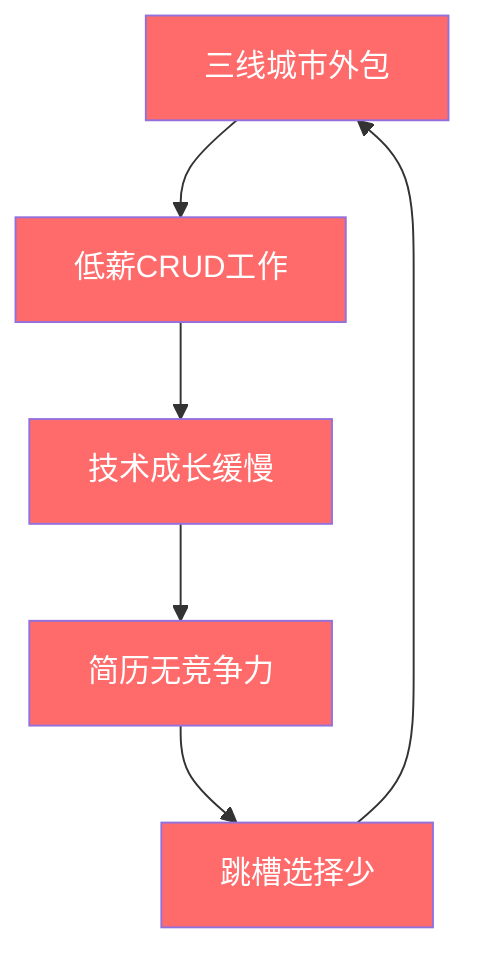

## 案例一：从月薪3000到年薪50万的程序员

这是一个真实的成长路径拆解——不是鸡汤，不是幸存者偏差，而是一个普通二本毕业生用7年时间，从三线城市外包岗位走到一线城市互联网大厂P7的完整过程。我们把这条路径拆解为可复制的阶段、关键决策点和核心方法论，让每一位处于类似起点的读者都能找到对标参照。

### 案例背景：起点画像

**主人公基本信息：**

| 维度 | 具体情况 |
|------|----------|
| 学历 | 二本计算机科学与技术，非985/211 |
| 起点城市 | 三线省会城市 |
| 第一份工作 | 本地软件外包公司，Java初级开发 |
| 起始月薪 | 3000元（2017年），无年终奖，无社保公积金 |
| 技术栈 | 大学期间仅掌握基础Java语法和简单SQL |
| 英语水平 | 四级飘过，阅读英文文档费力 |
| 家庭背景 | 普通工薪家庭，无行业人脉资源 |

**起点的核心困境：**

这位程序员（下文简称"小Z"）面临的不是某一个单一问题，而是一组相互纠缠的困境锁：

- **城市锁定**：三线城市IT岗位稀少，薪资天花板低，跳槽选择有限
- **技术锁定**：外包项目以CRUD为主，技术含量低，简历无亮点
- **信息锁定**：身边没有高薪程序员做参照，不知道差距在哪里
- **认知锁定**：以为"写代码就是程序员的全部工作"，缺乏职业规划意识



这个"负向飞轮"是大多数低起点程序员的真实写照。打破它需要的不是运气，而是系统性的策略。

### 第一阶段：破局期（第1-2年）——月薪3000→8000

#### 核心策略：用技术深度换取议价权

小Z在第一份工作做了6个月后意识到一个关键事实：**在三线城市，外包公司的薪资取决于你能独立交付多少项目，而不是你加班多少。** 这个认知转变是整个成长路径的起点。

**具体执行步骤：**

**1. 建立技术学习的"最小可行体系"**

小Z没有盲目报班或买书，而是先做了三件事：

- 花一周时间在招聘网站上爬取了200份Java开发岗位的JD，提取高频技术关键词
- 将关键词按出现频率排序，发现排名前十的依次是：Spring Boot、MySQL优化、Redis、微服务、Docker、消息队列、Linux运维、Git、设计模式、JVM调优
- 用一个Excel表格记录自己的掌握程度（0-5分），发现平均只有1.2分

这张表就是他的"学习路线图"——不是某位大V推荐的路线图，而是市场用真金白银投票选出来的路线图。

**2. "项目驱动"学习法（不是"教程驱动"）**

小Z没有从头看视频教程，而是用了一个更高效的方法：

```text
学习公式：真实需求 → 技术选型 → 最小实现 → 逐步优化 → 沉淀文档

具体操作：
1. 从公司项目中找一个真实的技术痛点（如：查询慢）
2. 带着这个问题去学习相关技术（如：MySQL索引优化）
3. 用最小代码量验证解决方案
4. 在生产环境应用并观察效果
5. 把整个过程写成技术博客

为什么这比看教程高效？
- 有真实上下文，记忆更深刻
- 学完立刻用，不会遗忘
- 博客内容来自真实经历，质量天然高于"搬运"
```

**3. 第一次薪资跳跃的关键动作**

工作满1年时，小Z做了两件关键的事：

- **内部争取**：主动接手了一个其他同事不愿碰的"烂尾项目"（技术债多、文档缺失），用了两个月时间重构完成，并将接口响应时间从3秒优化到200毫秒。这件事让他在团队中建立了"靠谱"的标签。
- **外部验证**：带着这个项目经验和15篇技术博客（总阅读量约2万），投了省会城市的3家互联网公司，拿到了一个8000元/月的offer。

**这个阶段的关键认知：**

> 在职业生涯早期，你的薪资不是由你的工作年限决定的，而是由你能解决的问题的复杂度决定的。月薪3000的人在解决3000块的问题，月薪8000的人在解决8000块的问题——你需要先证明自己能解决更贵的问题。

| 对比维度 | 外包公司（3000元） | 省会互联网公司（8000元） |
|----------|-------------------|------------------------|
| 工作内容 | 按需求文档写CRUD | 参与需求讨论，有技术方案设计权 |
| 技术栈 | Spring + JSP + 手动部署 | Spring Boot + Docker + CI/CD |
| 成长速度 | 重复劳动，成长曲线平坦 | 接触高并发、分布式，成长曲线陡峭 |
| 人脉质量 | 同事多为初级开发者 | 团队有高级工程师，可近距离学习 |
| 简历价值 | 几乎无法写进简历 | 可作为跳板进入更好的公司 |

### 第二阶段：加速期（第3-4年）——月薪8000→25000

#### 核心策略：从"能干活"到"能扛事"

进入新公司后，小Z面对的第一个冲击是：**技术要求完全不在一个量级。** 在外包公司，他只需要把功能实现；在互联网公司，他需要考虑高并发、数据一致性、系统可维护性。

**1. "源码阅读"突破技术瓶颈**

小Z在工作中遇到了一个RabbitMQ消息丢失的问题，排查了三天没解决。他的主管花10分钟看了日志就定位到了原因——因为主管读过RabbitMQ的源码，知道消息确认机制的内部实现。

这件事给小Z的启发是：**用工具和读过工具源码，是两个完全不同的能力层级。** 从那以后，他开始了系统性的源码阅读计划：

```text
源码阅读路线（小Z的实际执行顺序）：

第一阶段（3个月）：Spring IoC容器
├── 目标：理解Bean的生命周期、依赖注入的实现原理
├── 方法：从ClassPathXmlApplicationContext入口跟读
├── 产出：一篇1.5万字的源码分析博客
└── 收益：面试时能回答"Spring Bean的生命周期"的底层细节

第二阶段（3个月）：MyBatis执行流程
├── 目标：理解SQL解析、参数映射、结果集处理
├── 方法：从SqlSession.selectList入口跟读
├── 产出：一篇1.2万字的源码分析博客
└── 收益：能排查复杂的SQL映射问题

第三阶段（6个月）：Netty网络框架
├── 目标：理解Reactor线程模型、ByteBuf内存管理
├── 方法：从ServerBootstrap.bind入口跟读
├── 产出：一篇2万字的源码分析博客 + 一个简易RPC框架
└── 收益：具备了理解任何Java网络框架的能力
```

**2. 第二次薪资跳跃的关键动作**

工作第3年，小Z在公司内部主导了一个核心系统重构项目：

- 将单体应用拆分为6个微服务，引入Spring Cloud Gateway、Nacos注册中心
- 设计了分布式事务方案（TCC模式），保证跨服务数据一致性
- 项目上线后，系统QPS从500提升到5000，可用性从99.5%提升到99.95%

这个项目让小Z从"高级开发"晋升为"技术负责人"，薪资从8000涨到了15000。但他没有止步于此——他开始系统性地准备一线城市的面试。

**3. 面试准备的"信息战"策略**

小Z的跳槽准备不是"刷LeetCode"，而是一个系统工程：

```text
面试准备矩阵（耗时3个月）：

┌─────────────────────────────────────────────────────┐
│                    知识体系梳理                        │
├──────────┬──────────┬──────────┬──────────┬──────────┤
│  Java基础 │  框架原理 │  数据库   │  分布式   │  系统设计 │
│  JVM调优  │  Spring  │  MySQL   │  一致性   │  高并发   │
│  并发编程  │  MyBatis │  Redis   │  消息队列  │  缓存设计 │
│  反射/代理 │  Netty   │  MongoDB │  分布式锁  │  存储设计 │
└──────────┴──────────┴──────────┴──────────┴──────────┘
                           │
                           ▼
┌─────────────────────────────────────────────────────┐
│                    面试模拟训练                        │
│  · 20套一线公司真题（牛客网+脉脉收集）                   │
│  · 每套题限时90分钟，模拟真实面试压力                    │
│  · 每套题写详细题解，不是只记答案                       │
│  · 找3个同行做模拟面试，互相提问                        │
└─────────────────────────────────────────────────────┘
                           │
                           ▼
┌─────────────────────────────────────────────────────┐
│                    简历包装                            │
│  · 不写"负责XX模块开发"，写"主导XX系统重构，              │
│    QPS从500提升到5000"                                │
│  · 每段经历用STAR法则重写                              │
│  · 附上GitHub项目链接和技术博客链接                      │
│  · 简历控制在2页，PDF格式，排版干净                     │
└─────────────────────────────────────────────────────┘
```

最终，小Z拿到了一家杭州互联网公司的offer，职级P6，月薪25000，16薪。

### 第三阶段：跃迁期（第5-7年）——年薪25万→50万

#### 核心策略：从"技术执行者"到"技术决策者"

进入大厂后，小Z面临的挑战从"能不能做"变成了"该不该做"和"怎么做得更好"。P6到P7的核心区别不在于代码写得多好，而在于：

- **技术判断力**：面对一个需求，能选择最优的技术方案，而不是最熟悉的技术方案
- **项目推动力**：能跨团队协调资源，推动复杂项目落地
- **技术影响力**：能在团队和部门层面输出技术规范、最佳实践

**1. 建立"技术影响力"的具体方法**

小Z在大厂期间做了三件事，直接推动了他从P6到P7的晋升：

**（1）技术方案评审中的"建设性反对"**

在一次技术方案评审会上，团队计划用RocketMQ做异步解耦。小Z没有直接反对，而是做了一个对比分析：

```text
方案对比分析（实际案例）：

需求：订单系统与库存系统的异步解耦

方案A：RocketMQ（团队原方案）
├── 优势：社区活跃、功能丰富、支持事务消息
├── 劣势：运维成本高（需要独立集群）、学习曲线陡
└── 适用场景：复杂的消息路由、大规模消息处理

方案B：Kafka（小Z提议）
├── 优势：吞吐量更高、生态更完善、团队已有Kafka集群
├── 劣势：不支持原生事务消息（需要额外实现）
└── 适用场景：高吞吐日志/事件流、已有基础设施复用

最终决策：采用Kafka + 本地消息表方案
├── 复用现有集群，节省3台服务器（约1.5万/月）
├── 本地消息表保证最终一致性，满足业务需求
└── 方案被写入团队技术规范，成为后续项目的参考
```

**（2）技术博客的"部门级"影响力**

小Z在内网写了一系列"踩坑记"博客，记录了他在大厂遇到的真实技术问题和解决方案。这些博客不是泛泛而谈的"最佳实践"，而是：

- 每篇都包含完整的排查过程（从现象到日志到根因）
- 附上可复现的测试代码
- 给出可直接复制的修复方案

这些博客在部门内被广泛传播，小Z因此被邀请在部门技术分享会上做主题演讲。

**（3）主导技术规范制定**

小Z牵头制定了团队的《代码评审规范》和《技术方案模板》，这两个文档被采纳为部门标准。这件事的意义不在于文档本身，而在于：**它证明了小Z具备从"做事"到"建规则"的能力跃迁。**

**2. 薪资谈判的底层逻辑**

工作第7年，小Z拿到了P7的晋升，同时收到了一个外部offer（竞对公司，薪资更高）。他利用这个offer作为谈判筹码，最终在现公司达成了年薪50万的package：

```text
薪资构成拆解（年薪50万）：

基本工资：25K × 12 = 30万
├── 这部分是固定的，每月发放

绩效奖金：约8万/年
├── 根据绩效考核结果浮动（B+及以上可拿满）
├── 绩效考核维度：项目交付、技术影响力、团队贡献

股票/期权：约12万/年
├── 分4年 vest，每年归属25%
├── 这部分是"金手铐"，离职则未归属部分作废

总计：约50万/年（税前）
```

### 关键决策复盘：哪些选择决定了结果


这5个关键决策中，每一个都不是"自然而然发生的"，而是主动选择的结果。我们逐个拆解：

**决策1：离开外包公司（第1年）**

| 维度 | 留在外包 | 跳槽互联网 |
|------|---------|-----------|
| 短期风险 | 零风险，稳定 | 有试用期不通过的风险 |
| 长期收益 | 技术成长停滞，薪资天花板低 | 技术栈升级，薪资天花板高 |
| 机会成本 | 浪费1-2年黄金学习期 | 早一年进入快车道 |
| 小Z的选择 | ✗ | ✓ |

**决策2：投入源码阅读（第3年）**

源码阅读的投入产出比极高，但大多数程序员不愿意做，因为它有三个"反人性"的特点：

- **前期痛苦**：一开始看不懂，挫败感强
- **见效慢**：不像刷题那样有即时反馈
- **无法量化**：不像考证那样有明确的"完成标志"

但一旦突破临界点（通常是读完2-3个框架的源码后），你会发现：**所有框架的设计模式都是相通的，学习新框架的速度会指数级提升。**

**决策3：跳槽一线城市（第4年）**

三线城市程序员面临的核心矛盾是：**本地IT产业规模有限，高薪岗位稀缺。** 跳槽一线城市虽然生活成本更高，但：

- 薪资涨幅通常是2-3倍（扣除生活成本后仍有显著提升）
- 接触的技术复杂度和业务规模完全不同
- 人脉圈层质变——身边都是月薪2万+的同行

**决策4：从"做事"到"建影响力"（第5-6年）**

在大厂，P6和P7的核心区别可以用一句话概括：**P6是优秀的执行者，P7是局部的决策者。** 建立影响力不是"邀功"，而是让你的技术判断力被组织认可。

**决策5：用外部offer谈判（第7年）**

薪资谈判的黄金法则是：**你的真实市场价值 = 你当前薪资 + 你手里的外部offer溢价。** 没有外部offer的谈判是"请求"，有外部offer的谈判是"协商"。

### 可复制的方法论：如果你也在起点

#### 自我诊断：你在哪个阶段？

```text
诊断清单（回答"是"计1分）：

第一阶段诊断（破局期）：
□ 你在一家外包公司或小公司工作
□ 你的工作内容以CRUD为主
□ 你身边没有月薪2万+的程序员同事
□ 你不清楚市场对Java/Python/Go等语言的具体技术要求
□ 你没有技术博客或GitHub项目
得分：___/5

第二阶段诊断（加速期）：
□ 你能在30分钟内独立排查一个中等复杂度的线上问题
□ 你读过至少一个开源框架的源码
□ 你有主导一个完整项目（从设计到上线）的经验
□ 你的简历能让HR在10秒内看到亮点
□ 你能清晰描述"你在上一个项目中的技术决策及原因"
得分：___/5

第三阶段诊断（跃迁期）：
□ 你在技术方案评审中能提出有建设性的反对意见
□ 你在团队/部门层面有技术影响力（博客/分享/规范）
□ 你能跨团队协调资源推动项目
□ 你有外部公司愿意给你涨薪30%以上的offer
□ 你能清晰描述"你为公司创造了什么价值"
得分：___/5

解读：
- 第一阶段得分≥3：先完成破局，不要急于跳槽
- 第二阶段得分≥3：可以考虑跳槽一线城市
- 第三阶段得分≥3：具备P7级别的能力，需要的是机会和谈判
```

#### 避坑指南：这些错误会浪费你1-2年

**错误1：盲目追求"全栈"**

很多初级程序员会同时学前端、后端、运维、测试，结果每样都会一点，每样都不精。正确的做法是：**先在一个方向做到前20%，再横向扩展。** 在Java后端领域，"前20%"的标准是：能独立设计并实现一个支撑1000 QPS的系统。

**错误2：只刷题不理解**

LeetCode刷了500题但面试还是挂，根本原因是：**你在记答案，不是在学思维。** 每道题应该搞清楚三个问题：

- 这道题考察的核心算法/数据结构是什么？
- 最优解的时间/空间复杂度是多少？为什么？
- 如果改变题目条件（如数据规模变大1000倍），解法需要怎么调整？

**错误3：跳槽过于频繁**

简历上每份工作不到1年，会被HR标记为"不稳定"。合理的跳槽节奏是：**第一份工作至少1.5年（证明你能坚持），之后每份工作至少2年（证明你能深入）。** 如果确实需要短期跳槽，准备好一个合理的解释（如"公司业务调整/部门裁撤"）。

**错误4：忽视软技能**

技术再强，如果不会沟通、不会写文档、不会做汇报，在大厂也很难晋升。P7的考核维度中，技术能力只占40%，剩余60%是：项目管理、跨团队协作、技术影响力、人才培养。

**错误5：不做职业规划**

"走一步看一步"是最大的时间浪费。每半年做一次职业复盘：

- 我当前的市场价值是多少？（通过面试验证）
- 我距离下一个职级还差什么？（通过晋升标准对照）
- 我的技能树中，哪些是"升值资产"，哪些是"贬值资产"？

### 数据复盘：7年薪资增长曲线

```text
薪资增长时间线：

2017.07  月薪3,000   外包公司Java初级开发
    │     ↓ +167%（跳槽 + 技术提升）
2019.01  月薪8,000   省会互联网公司高级开发
    │     ↓ +88%（主导重构项目 + 晋升）
2020.06  月薪15,000  技术负责人
    │     ↓ +67%（跳槽一线城市）
2021.03  月薪25,000  杭州互联网公司P6
    │     ↓ +40%（晋升P7 + 股票）
2024.06  年薪500,000 P7（月薪25K + 绩效 + 股票）

7年总增长：月薪3000 → 年薪50万（约14倍）
年化复合增长率：约47%
```

这个增长率看起来惊人，但分解到每一步，都是合理的市场定价。**程序员薪资增长的本质是：你解决的问题的商业价值在增长。** 月薪3000解决的是"把需求翻译成代码"，年薪50万解决的是"用技术方案驱动业务增长"——两者的商业价值差距远不止14倍。

### 延伸思考：这条路的局限性

这个案例有三个需要诚实面对的局限：

**1. 时代红利不可复制**

2017-2024年是中国互联网行业的高速增长期，技术岗位供不应求。在当前（2025-2026年）的行业环境下，同样的努力可能获得的回报会打折扣。但这不意味着路径失效——**行业收缩期，真正有实力的人反而更容易脱颖而出，因为竞争者在减少。**

**2. 幸存者偏差**

我们只看到了"成功从3000到50万"的案例，没有看到"同样努力但卡在2万"的案例。决定最终结果的变量有很多：行业选择、公司机遇、个人运气。你能控制的只有"提升自己的概率"，不能控制"概率是否兑现"。

**3. 50万不是终点**

在一线城市，年薪50万对应的生活质量并不如三线城市月薪1万。房贷、子女教育、父母养老——这些现实压力不会因为薪资增长而消失。**真正的财务自由不是薪资数字的增长，而是被动收入超过生活支出。** 这一点，我们将在后续章节详细讨论。

### 本案例的核心启示

如果你只记住一件事，记住这个：

> **你的薪资 = 你能解决的问题的市场价值 × 你的不可替代性。** 提升前者靠学习和实践，提升后者靠深度和影响力。两条腿走路，缺一不可。
