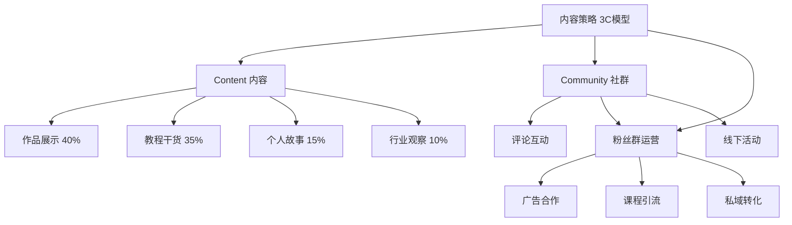
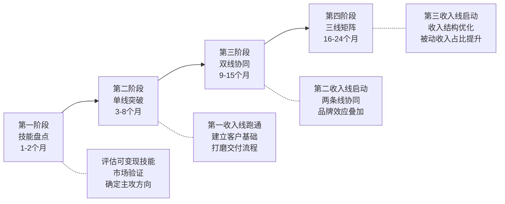

## 案例三：斜杠青年的多元收入之路

> "斜杠"一词来源于英文"Slash"，指不满足于单一职业身份，而是同时从事多种职业、拥有多元收入来源的年轻人。本案例的主人公林嘉怡（化名），用三年时间从一个月薪6000元的普通运营岗职员，成长为月均收入28000元的四重身份斜杠青年——主业运营经理/兼职商业插画师/自媒体博主/在线课程讲师。她的故事不是一夜暴富的神话，而是一套可复制的多元收入构建方法论。

### 案例背景：为什么要成为斜杠青年？

#### 个人基本面

| 项目 | 详情 |
|------|------|
| 姓名 | 林嘉怡（化名） |
| 年龄 | 24岁开始，27岁达到稳定期 |
| 学历 | 普通本科，视觉传达设计专业 |
| 起始薪资 | 月薪6000元（互联网公司运营岗） |
| 所在城市 | 成都（新一线城市） |
| 起始存款 | 约2万元 |
| 每周可支配自由时间 | 工作日晚间约2小时 + 周末约10小时 |

#### 核心动机分析

林嘉怡决定走斜杠路线，不是因为"副业焦虑"，而是基于三个理性判断：

1. **收入天花板的预判**：纯运营岗在成都的薪资天花板约15K-20K，扣除生活开支后储蓄有限，无法支撑她30岁前买房的规划
2. **技能资产的浪费**：大学四年视觉设计功底在运营岗中只用到20%，大量闲置技能是沉没成本
3. **抗风险需求**：2022年互联网裁员潮中，她亲眼看到同事被裁后陷入困境，意识到单一收入源的脆弱性

#### 为什么是"斜杠"而不是"跳槽"

很多人遇到薪资瓶颈会选择跳槽，但林嘉怡的分析是：

| 策略 | 优势 | 劣势 | 适合场景 |
|------|------|------|----------|
| 跳槽涨薪 | 短期见效快 | 依赖市场行情，有上限 | 技能溢价高的稀缺人才 |
| 深耕主业晋升 | 收入稳定增长 | 需要3-5年，受公司规模限制 | 大厂/上升期公司 |
| 斜杠多元收入 | 多条收入线，抗风险 | 初期精力分散，收入不稳定 | 有可变现技能+时间管理能力 |

她判断自己适合第三种：设计技能可直接变现，运营经验可降维打击自媒体，而自媒体又能反哺个人品牌。

### 执行过程：从0到28000元的四阶段演进

#### 第一阶段：技能盘点与定位（第1-2个月）

##### 自我技能审计

林嘉怡用了一个系统化的方法来盘点自己的可变现技能：

**技能变现四象限评估法**

```text
                    市场需求高
                        │
         ┌──────────────┼──────────────┐
         │   金矿技能    │   蓝海技能    │
         │  （立即变现）  │ （学习投入）  │
技能水平  │──────────────┼──────────────│
  高     │   维持区      │   投资区      │
         │ （高竞争力）  │ （长期布局）  │
         └──────────────┼──────────────┘
                        │
                    市场需求低
```

她的评估结果：

| 技能 | 技能水平 | 市场需求 | 变现速度 | 定位 |
|------|----------|----------|----------|------|
| 视觉设计/插画 | ★★★★☆ | ★★★★☆ | 即时 | 主攻方向 |
| 内容运营 | ★★★★☆ | ★★★★★ | 中期 | 主业深耕 |
| 文案写作 | ★★★☆☆ | ★★★★★ | 即时 | 辅助方向 |
| 数据分析 | ★★★☆☆ | ★★★★☆ | 中期 | 主业加分 |
| 短视频剪辑 | ★★☆☆☆ | ★★★★★ | 需学习 | 暂时放弃 |

##### 市场验证：用最小成本试错

她没有一上来就辞职全职做副业，而是用了一个"72小时验证法"：

1. **第1天（24小时）**：在小红书发布5张自己的设计作品，观察自然流量反应
2. **第2天（24小时）**：在猪八戒/站酷注册设计师主页，尝试接1单低价设计（50-100元）
3. **第3天（24小时）**：统计反馈数据，判断是否值得继续

验证结果：小红书作品获得200+赞，站酷在48小时内收到2个询价。这证明她的设计水平有市场买单。

#### 第二阶段：第一收入线——商业插画（第3-8个月）

##### 定价策略

新手最常见的错误是定价过低。林嘉怡采用了"阶梯定价法"：

| 阶段 | 单价 | 目的 | 持续时间 |
|------|------|------|----------|
| 引流期 | 100-200元/张 | 积累作品和好评 | 第1-2个月 |
| 成长期 | 300-500元/张 | 建立客户基础 | 第3-5个月 |
| 成熟期 | 800-1500元/张 | 筛选高质量客户 | 第6个月起 |
| 品牌期 | 2000-5000元/张 | 品牌合作/商业授权 | 第12个月起 |

##### 客户获取渠道矩阵

```text
                        获客成本
            低 ────────────────────── 高
            │                         │
    高  ┌───┼─────────────────────────┤
        │   │  老客户转介绍（最佳）     │
        │   │  朋友圈口碑传播          │
  客    │   │                         │
  户    │   │                         │
  质    │   │  小红书/站酷自然流量     │  付费投放
  量    │   │  设计类平台接单          │  商务BD
        │   │                         │
    低  └───┼─────────────────────────┤
            │  低价内卷平台            │
            └─────────────────────────┘
```

她的实际获客数据（第3-8个月累计）：

| 渠道 | 获客数量 | 平均单价 | 投入时间 | ROI评价 |
|------|----------|----------|----------|---------|
| 站酷/Behance展示 | 8单 | 400元 | 低（被动） | ★★★★★ |
| 小红书引流 | 12单 | 350元 | 中（内容更新） | ★★★★☆ |
| 朋友/客户转介绍 | 15单 | 500元 | 低（被动） | ★★★★★ |
| 猪八戒等平台 | 6单 | 200元 | 高（竞标） | ★★☆☆☆ |
| 主动BD（找品牌方） | 3单 | 1500元 | 高（沟通） | ★★★☆☆ |

**关键教训**：平台型接单（如猪八戒）虽然容易起步，但竞争激烈、价格低，不适合长期发展。真正的增长引擎是作品展示+转介绍。

##### 时间管理：工作日+周末双轨制

| 时间段 | 周一至周五 | 周六 | 周日 |
|--------|-----------|------|------|
| 7:00-8:30 | 通勤+听行业播客 | 自由创作时间 | 休息/社交 |
| 9:00-18:00 | 主业工作 | 集中接单创作（上午） | 内容批量生产 |
| 19:00-20:00 | 复盘+客户沟通 | 集中接单创作（下午） | 下周规划 |
| 20:00-22:00 | 插画接单/课程制作 | 学习新技能 | 自由安排 |

**核心原则**：工作日每天投入2小时做副业，周末集中产出。绝不占用主业时间和睡眠时间。

#### 第三阶段：第二收入线——自媒体（第6-12个月）

##### 为什么选择自媒体作为第二条线

林嘉怡没有同时开多条线，而是等插画副业稳定后再开启自媒体。原因是：

1. **能力复用**：插画作品本身就是优质内容素材
2. **品牌叠加**：自媒体放大个人品牌，反过来提高插画的议价能力
3. **收入多元化**：自媒体有广告收入、引流收入、知识付费收入三种变现模式

##### 平台选择与策略

她选择了"一主两副"的平台策略：

| 平台 | 定位 | 内容形式 | 更新频率 | 目标 |
|------|------|----------|----------|------|
| 小红书（主） | 种草+作品展示 | 图文+短视频 | 每天1条 | 涨粉+引流 |
| B站（副） | 教程深度内容 | 中长视频 | 每周1条 | 信任建设 |
| 公众号（副） | 长文+沉淀 | 图文 | 每周2篇 | SEO+私域 |

##### 内容策略：3C模型



**关键数据**：

| 指标 | 第6个月 | 第9个月 | 第12个月 |
|------|---------|---------|----------|
| 小红书粉丝 | 1,200 | 8,500 | 23,000 |
| B站粉丝 | 300 | 2,100 | 6,800 |
| 公众号关注 | 500 | 3,200 | 9,500 |
| 月均内容收入 | 200元 | 1,800元 | 5,500元 |

内容收入来源拆解（第12个月）：

| 来源 | 金额 | 占比 |
|------|------|------|
| 小红书品牌合作（3单） | 2,400元 | 44% |
| B站创作激励 | 600元 | 11% |
| 公众号广告 | 500元 | 9% |
| 私域引流到插画/课程 | 2,000元 | 36% |

#### 第四阶段：第三收入线——在线课程（第12-18个月）

##### 课程产品设计

当小红书粉丝突破2万后，频繁收到"怎么学插画""能不能教我"的私信，这就是市场需求的直接信号。她设计了三级课程产品：

| 产品层级 | 形式 | 价格 | 目标用户 | 内容深度 |
|----------|------|------|----------|----------|
| 引流层 | 免费公开课（录播） | 0元 | 潜在用户 | 入门概念+案例 |
| 轻课层 | 小红书专栏/图文课 | 49-99元 | 兴趣学习者 | 基础技法+练习 |
| 正式层 | 系统录播课（12节） | 299元 | 认真学习者 | 完整方法论+作业点评 |
| 高端层 | 1v1私教/小班课 | 1999元/期 | 深度学习者 | 个性化指导+就业辅导 |

##### 课程制作成本与收益

| 项目 | 投入 | 说明 |
|------|------|------|
| 脚本撰写 | 40小时 | 12节课，每节课约3.3小时脚本 |
| 录制剪辑 | 30小时 | 使用iPad+录屏软件 |
| 平台搭建 | 500元 | 小鹅通年费 |
| 推广物料 | 200元 | 海报设计+详情页 |
| **总投入** | **约70小时+700元** | — |

| 指标 | 第1期 | 第2期 | 第3期（稳定期） |
|------|-------|-------|-----------------|
| 报名人数 | 28人 | 45人 | 60人/期 |
| 收入 | 8,372元 | 13,455元 | 17,940元/期 |
| 复购/转介绍率 | 18% | 32% | 45% |
| NPS（净推荐值） | — | 62 | 71 |

### 成果数据：多元收入结构全景

#### 收入演进总览

| 时间节点 | 主业收入 | 插画副业 | 自媒体 | 课程 | 月总收入 | 同比增长 |
|----------|----------|----------|--------|------|----------|----------|
| 起点（第1月） | 6,000 | 0 | 0 | 0 | 6,000 | — |
| 第6个月 | 6,500 | 3,200 | 200 | 0 | 9,900 | +65% |
| 第12个月 | 8,000 | 6,500 | 2,500 | 0 | 17,000 | +72% |
| 第18个月 | 10,000 | 8,000 | 5,500 | 6,000 | 29,500 | +74% |
| 第24个月（稳定期） | 12,000 | 7,000 | 5,000 | 4,000 | 28,000 | -5% |

**注意**：第24个月总收入略有下降是正常的——插画接单从"来者不拒"转向"精选高价"，课程从密集开班转为稳定节奏，单位时间收入实际提升了。

#### 收入结构健康度分析

第24个月收入结构占比：

```text
主业收入   ████████████████████████████  43%  (12,000元)
插画副业   ██████████████████           25%  (7,000元)
自媒体     █████████████                18%  (5,000元)
课程收入   ████████                     14%  (4,000元)
```

**健康度评估**：

| 评估维度 | 现状 | 理想值 | 评价 |
|----------|------|--------|------|
| 单一收入占比 | 43%（主业） | <50% | ✅ 合格 |
| 被动收入占比 | 32%（自媒体+课程） | >30% | ✅ 合格 |
| 最大客户依赖度 | <15% | <20% | ✅ 合格 |
| 收入线数量 | 4条 | 3-5条 | ✅ 合格 |
| 单位时间收入 | 约180元/小时 | >150元/小时 | ✅ 合格 |

#### 支出与储蓄数据

| 项目 | 月均金额 | 占总收入比 |
|------|----------|-----------|
| 生活开支 | 5,500元 | 20% |
| 社保公积金（自缴部分） | 1,200元 | 4% |
| 副业工具/软件订阅 | 300元 | 1% |
| 学习投资 | 500元 | 2% |
| 税费（劳务报酬预扣） | 约1,500元 | 5% |
| **月储蓄** | **约19,000元** | **68%** |

三年累计储蓄约45万元，加上理财收益约5万元，总计约50万元。这在成都足以支付一套小户型的首付。

### 关键决策复盘：那些"做对了"和"做错了"的事

#### 做对了的五件事

**1. 先深后广，而非同时铺开**

林嘉怡没有一开始就三条线并行，而是：插画（3-8月稳定）→ 自媒体（6-12月成长）→ 课程（12-18月启动）。每条线稳定后再开下一条，避免了"样样通样样松"的陷阱。

**2. 用主业养副业，而非透支主业**

她始终坚持一个原则：副业绝不能影响主业表现。在副业初期最忙的时候，她仍然保持主业绩效B+以上。这确保了主业收入这条"生命线"不受威胁。

**3. 重作品轻营销**

在小红书涨粉最快的时期，很多人建议她做更多"博眼球"的内容（如争议话题、蹭热点）。她坚持90%的内容是作品和干货，虽然涨粉速度不是最快的，但粉丝质量高、转化率好。

**4. 早期定价不低**

与大多数新手不同，她在试错期结束后迅速把插画单价提到300元以上。低价虽然容易接单，但会吸引低质量客户，且严重消耗时间。一个300元的客户往往比三个100元的客户更好服务。

**5. 建立标准化流程**

她为每条收入线都建立了SOP（标准操作流程），包括：接单沟通模板、交付清单、售后跟进流程、课程录制清单。这让每条线的运营效率提升了约40%。

#### 做错了的三件事

**1. 猪八戒等平台浪费了太多时间（前3个月）**

在猪八戒上竞标、比价、应对甲方无理需求，三个月只赚了1200元，但消耗了大量精力。这些时间如果用在作品集建设和小红书运营上，回报会高得多。

**教训**：远离低价竞争平台，把精力花在能建立个人品牌的地方。

**2. 课程定价过低（第1期）**

第一期课程定价199元，虽然报名了28人，但很多学员不够认真（"反正便宜，不学也不心疼"），导致完课率只有45%，影响了口碑和NPS。第二期提到299元后，完课率反而提升到了68%。

**教训**：合理的定价筛选出认真的学员，反而提高教学效果和口碑。

**3. 没有提前处理税务问题（前12个月）**

前12个月的副业收入都是"裸收"，没有申报个税。后来收到税务提醒，补缴了约4000元税款和少量滞纳金。

**教训**：年副业收入超过一定额度后，务必咨询财税专业人士，合规申报。

### 方法论提炼：斜杠青年多元收入构建框架

#### 多元收入建设的四阶段模型



#### 斜杠收入线选择的三条原则

| 原则 | 说明 | 反面案例 |
|------|------|----------|
| **技能复用** | 多条收入线共享核心技能，边际成本递减 | 运营+外卖骑手+家教（技能无交集） |
| **流量互通** | 一条线的用户可以转化为另一条线的客户 | 自媒体粉丝→课程学员→高端咨询客户 |
| **被动占比提升** | 随时间推移，被动收入占比逐渐提高 | 一直靠纯接单，不做产品化和内容沉淀 |

#### 时间分配的"70-20-10法则"

| 分配 | 比例 | 用途 | 示例 |
|------|------|------|------|
| 主线投入 | 70% | 当前最重要的收入线 | 当前主力：课程开发和推广 |
| 维护投入 | 20% | 已成熟的收入线 | 插画老客户维护+自媒体日常更新 |
| 探索投入 | 10% | 新方向试探 | 咨询服务试点、新平台探索 |

#### 避坑清单：斜杠青年常见陷阱

| 陷阱 | 表现 | 后果 | 应对策略 |
|------|------|------|----------|
| 贪多嚼不烂 | 同时开5条线，每条都做不深 | 精力分散，全线亏损 | 最多同时经营3条线 |
| 忽视主业 | 副业太投入，主业绩效下滑 | 丢掉主业收入保障 | 主业绩效不低于B |
| 低价竞争 | 为接单不断压价 | 吸引劣质客户，身心俱疲 | 设定价格底线，宁可少接 |
| 不做复盘 | 埋头干活不看数据 | 不知道哪条线赚钱哪条亏 | 每月复盘各线ROI |
| 税务裸奔 | 不申报副业收入 | 补税+滞纳金+信用风险 | 年收入超12万请财税顾问 |
| 忽略健康 | 用睡眠换时间 | 慢性疲劳，创造力下降 | 每天睡满7小时是底线 |
| 孤军奋战 | 不找同行交流 | 信息闭塞，错过机会 | 加入3-5个行业社群 |

### 进阶思考：从斜杠到创业者

#### 斜杠的终点不是永远斜杠

林嘉怡在第30个月做了一个关键决策：辞去主业，将三条副业线整合为一家小型创意工作室。此时：

- 副业月收入已稳定在2.5万以上（超过主业2倍）
- 有稳定的客户池（50+活跃客户）
- 有可复制的课程产品线
- 有持续的内容流量入口

这个决策的判断标准是：

> **当你的副业收入连续6个月超过主业收入的1.5倍，且拥有稳定的客户/流量基础时，可以考虑全职化。**

#### 全职化后的收入跃迁

| 阶段 | 月收入 | 收入结构 | 关键变化 |
|------|--------|----------|----------|
| 斜杠期（第24月） | 28,000元 | 主业43%+副业57% | 时间受限 |
| 过渡期（第30月） | 35,000元 | 全部自营 | 全时间投入 |
| 工作室期（第36月） | 52,000元 | 设计40%+课程30%+咨询20%+广告10% | 品牌溢价 |

#### 多元收入的长期目标：资产化

真正高阶的斜杠思维不是"用更多时间赚更多钱"，而是把收入来源资产化：

| 收入类型 | 特征 | 示例 | 目标占比 |
|----------|------|------|----------|
| 主动收入 | 用时间换钱 | 接单、咨询 | <30% |
| 半被动收入 | 前期投入时间，后期持续收益 | 录播课程、版权收入 | 30-40% |
| 被动收入 | 一次创作持续收益 | 广告分成、理财收益、数字产品 | >30% |

林嘉怡的36个月目标是将被动收入占比提升到40%以上，这意味着即使她暂停工作一个月，收入也不会断崖式下跌。

### 可复制的行动清单

如果你也想走斜杠路线，以下是按时间线排列的具体行动步骤：

**第1周：技能盘点**
- 列出你所有可变现的技能（至少5项）
- 用"四象限评估法"对每项技能评分
- 确定1个主攻方向

**第2周：市场验证**
- 在1个平台发布3-5个作品/内容
- 尝试接1单最小可行的订单（哪怕只收50元）
- 收集反馈，判断是否有市场买单

**第1-2个月：建立基础设施**
- 注册2-3个核心平台账号
- 准备作品集/个人介绍页
- 制定每周时间分配表

**第3-6个月：第一收入线冲刺**
- 每周固定投入10-15小时
- 目标：月入3000元
- 重点：积累客户和好评

**第6-12个月：开启第二收入线**
- 第一条线进入"自动驾驶"模式
- 开启自媒体/内容/第二技能线
- 目标：月总收入突破10000元

**第12-24个月：收入结构优化**
- 开启第三收入线（知识付费/产品化）
- 提高被动收入占比
- 目标：月总收入20000元以上

**第24个月以后：评估全职化**
- 副业收入连续6个月超主业1.5倍？
- 有稳定客户/流量基础？
- 有6个月以上的生活储备金？
- 如果三项都满足，可以考虑全职化

---

**本案例核心启示**：斜杠不是"什么都会一点"，而是"以核心技能为圆心，向外辐射出多条收入线"。每条线之间存在技能复用和流量互通的协同效应，这才是多元收入的真正壁垒。单纯增加不相关的副业数量，只会让你变成一个疲惫的兼职打工人，而不是斜杠青年。
