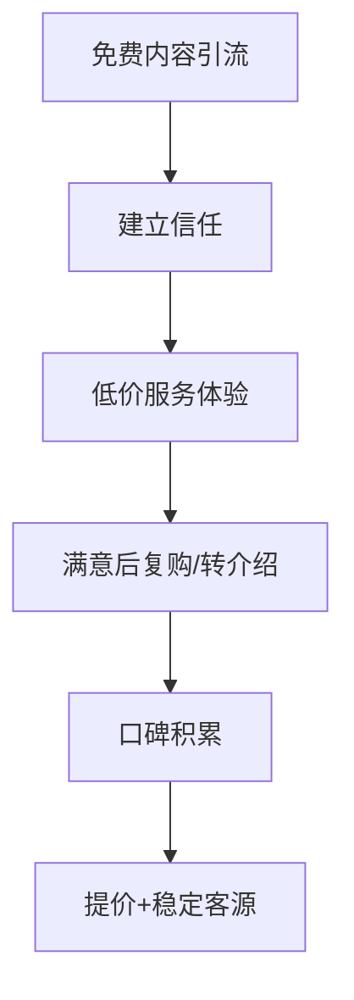
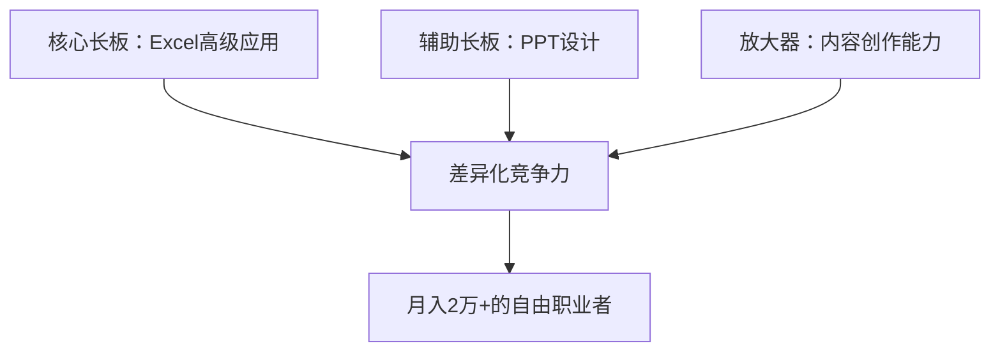
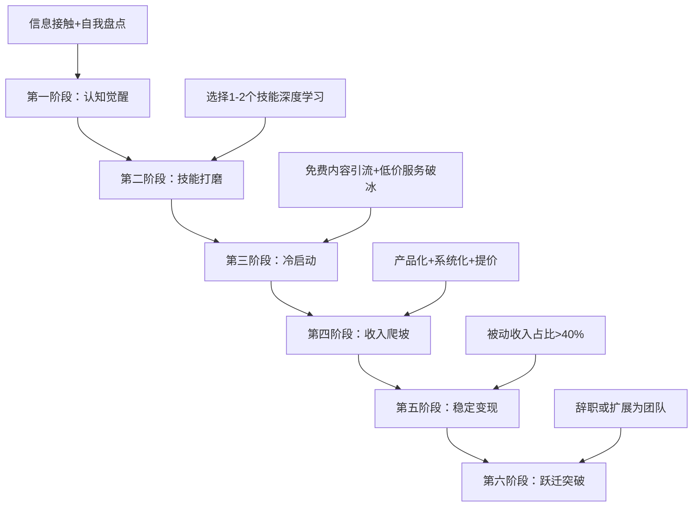

## 案例四：小镇青年的逆袭

> "我没有985学历，没有大厂背景，没有家族资源。但我用了三年时间，从月薪3500的县城文员，变成了月入2.5万的自由职业者。小镇青年的逆袭，靠的不是运气，是一套可以复制的方法论。"
> ——陈磊（化名），27岁，安徽某县城出身

### 案例背景：为什么"小镇青年"值得单独分析

"小镇青年"是中国社会经济结构中一个庞大但容易被忽视的群体。他们通常具备以下特征：

- **学历背景**：大专或普通本科，非985/211院校
- **家庭条件**：父母为普通工薪阶层或个体户，无法提供职业资源或启动资金
- **初始起点**：毕业后回到县城或三四线城市工作，月薪3000-5000元
- **信息差**：缺乏对高薪行业、投资理财、副业机会的认知渠道
- **社交圈层**：周围朋友多为同阶层，难以获得向上突破的参考样本

这些条件看起来是劣势，但小镇青年也有独特的结构性优势：

1. **生活成本极低**：县城租房500-800元/月，生活开支可控在1500元以内
2. **时间充裕**：相比一线城市996的工作节奏，县城工作的下班时间通常较早
3. **竞争压力小**：当地市场对数字技能、内容创作的需求大但供给少
4. **试错成本低**：没有房贷压力，没有高额消费习惯，失败的代价有限

陈磊的故事，就是一个典型的小镇青年如何利用这些结构性优势，通过副业实现收入跃迁的完整路径。

---

### 第一阶段：认知觉醒期（第1-3个月）

#### 起点：月薪3500的县城行政文员

陈磊，1999年出生，安徽某县城人，毕业于省内一所普通二本院校的工商管理专业。2022年毕业后回到家乡，在一家小型建材公司做行政文员，月薪3500元，到手约3200元。

他的月度开支结构如下：

| 支出项目 | 金额（元） | 占比 |
|---------|-----------|------|
| 房租（合租） | 500 | 15.6% |
| 餐饮 | 800 | 25.0% |
| 交通 | 150 | 4.7% |
| 通讯 | 100 | 3.1% |
| 日用品 | 200 | 6.3% |
| 社交/娱乐 | 400 | 12.5% |
| 其他 | 250 | 7.8% |
| **月结余** | **800** | **25.0%** |

月结余800元，一年不到1万。按这个速度，要存到第一个10万需要10年以上。

#### 认知转折点：一次偶然的信息接触

2022年10月，陈磊在B站刷到了一条视频，标题是《小城市的人如何靠副业月入过万》。视频中提到一个概念让他震动：**"你的收入上限，不取决于你的努力程度，而取决于你服务的市场半径。"**

这句话点醒了他：在县城做行政，服务的是一个公司的内部需求，市场半径就是这家公司。但如果他能把技能输出到互联网上，服务的就是全国甚至全球的市场。

#### 第一步：盘点自身可用技能

陈磊没有盲目行动，而是先做了一次系统的自我盘点：

| 维度 | 具体内容 | 市场价值评估 |
|------|---------|-------------|
| 学历专业 | 工商管理（二本） | 低——不构成竞争壁垒 |
| 工作技能 | Excel、PPT、行政流程 | 中——基础但有改进空间 |
| 兴趣爱好 | 摄影（业余水平）、写作 | 中——可转化为副业方向 |
| 时间资源 | 下班后3-4小时/天 | 高——充裕的可支配时间 |
| 启动资金 | 存款约3000元 | 低——但副业不需要高投入 |
| 可学习能力 | 学习速度快，愿意尝试 | 高——核心优势 |

**关键洞察**：陈磊没有追求"高大上"的副业方向（如编程、设计），而是选择了与自己现有技能最接近、学习曲线最平缓的切入点——**Excel教程和PPT定制**。

这个选择背后有一个重要的决策逻辑：**副业启动的最佳策略不是追逐高薪赛道，而是选择"技能可迁移+市场需求明确+竞争相对较低"的交叉点**。在县城，会用Excel的人很多，但能做出专业级Excel教程的人极少；会做PPT的人也很多，但能提供企业级PPT定制服务的人几乎没有。

---

### 第二阶段：技能打磨期（第3-6个月）

#### 技能升级路径

陈磊制定了一个3个月的技能强化计划：

**Excel方向（第1-2个月）：**

| 周次 | 学习内容 | 学习方式 | 投入时间 |
|------|---------|---------|---------|
| 第1周 | 函数进阶（VLOOKUP、INDEX-MATCH、SUMIFS） | B站免费教程 + 练习 | 每天2小时 |
| 第2周 | 数据透视表高级应用 | ExcelHome论坛 + 实操 | 每天2小时 |
| 第3周 | Power Query数据清洗 | 微软官方文档 + 案例 | 每天2小时 |
| 第4周 | VBA基础自动化 | 录制宏 → 修改代码 → 自己写 | 每天2小时 |
| 第5-8周 | 综合项目实战（制作3个完整案例） | 模拟真实工作场景 | 每天2小时 |

**PPT方向（第2-3个月，与Excel重叠）：**

| 周次 | 学习内容 | 学习方式 | 投入时间 |
|------|---------|---------|---------|
| 第1-2周 | 设计基础（排版、配色、字体） | 旁门左道PPT教程 | 每天1小时 |
| 第3-4周 | 高级动画和交互逻辑 | iSlide案例拆解 | 每天1小时 |
| 第5-8周 | 企业级PPT模板制作（完成5套模板） | 仿制+原创 | 每天1小时 |

#### 学习资源和成本

| 资源 | 类型 | 费用 | 价值 |
|------|------|------|------|
| B站Excel教程（ExcelHome、王佩丰） | 免费视频 | 0元 | 入门到中级 |
| ExcelHome论坛 | 免费社区 | 0元 | 疑难解答、案例参考 |
| 旁门左道PPT | B站免费+付费课程 | 付费部分299元 | PPT设计系统提升 |
| iSlide插件 | 订阅制 | 99元/年 | 大量模板和素材 |
| 微软官方文档 | 免费 | 0元 | 权威技术参考 |
| **总投入** | | **398元** | |

**398元的学习投入，换来的是一个可持续变现的技能组合**。这印证了一个重要原则：副业的启动成本应该是极低的——如果一个副业需要大量前期投入，它可能更适合叫"创业"而非"副业"。

#### 关键转折：从"学习者"到"输出者"

陈磊在学习过程中犯了一个常见错误：**陷入"学习陷阱"——觉得自己还没学够，不敢开始输出**。

他在第4个月时已经具备了基本能力，但一直觉得"还不够专业"。直到他在一个Excel交流群里看到一句话：**"你不需要成为专家才能教别人，你只需要比你的学生早走一步。"**

这句话让他意识到：他不需要成为Excel大师，他只需要比县城里那些连VLOOKUP都不会用的人强，就能提供价值。

于是他做了三件事：

1. **在小红书发布第一条Excel技巧帖**（花了2小时制作，获得47个赞）
2. **在闲鱼上架第一个PPT定制服务**（定价50元/页，等待第一个客户）
3. **在朋友圈发布一条消息**："最近在学Excel，有需要帮忙处理表格的可以找我，免费帮忙。"

---

### 第三阶段：冷启动期（第6-9个月）

#### 第一批客户从哪里来

陈磊的客户获取遵循了一个经典的"漏斗模型"：

**阶段一：免费内容引流（第6-7个月）**

陈磊坚持在小红书发布Excel技巧帖，每周3-4条，内容聚焦于"职场人最常用的10个Excel场景"：

- 如何用数据透视表3分钟完成月度报表
- VLOOKUP的3个常见错误及解决方法
- 用条件格式让数据一目了然
- 批量处理100个Excel文件的VBA脚本

两个月下来，他积累了约800个粉丝，单条帖子平均阅读量从200提升到2000+。

**关键数据：**

| 指标 | 第1个月 | 第2个月 |
|------|--------|--------|
| 发帖数 | 12条 | 15条 |
| 总阅读量 | 8,000 | 35,000 |
| 新增粉丝 | 150 | 650 |
| 评论咨询数 | 5 | 30 |
| 转化为客户 | 0 | 2 |

**阶段二：低价服务破冰（第7-8个月）**

陈磊在闲鱼和小红书同时上架了两个服务：

1. **Excel表格定制**：50-200元/份（根据复杂度）
2. **PPT定制**：30-80元/页

最初两个月的接单数据：

| 月份 | 接单数 | 总收入 | 平均单价 | 客户来源 |
|------|--------|--------|---------|---------|
| 第7个月 | 3单 | 680元 | 227元 | 闲鱼2单，小红书1单 |
| 第8个月 | 7单 | 1,850元 | 264元 | 闲鱼3单，小红书4单 |
| 第9个月 | 12单 | 3,200元 | 267元 | 闲鱼2单，小红书6单，转介绍4单 |

**转介绍比例从0%增长到33%，这是口碑效应开始发挥作用的信号。**

#### 冷启动阶段的核心经验

陈磊在这个阶段总结了三条关键经验：

**经验一：免费是最好的获客手段。** 他前期帮朋友免费处理Excel表格，这些朋友后来成了他最忠实的客户和推荐人。免费服务不是损失，是投资——你用时间换取了信任和口碑。

**经验二：低价不是目的，验证模式才是。** 50元/份的Excel定制不赚钱（制作一份需要2-3小时），但这个价格帮他快速获得了第一批客户，验证了"确实有人愿意为这个服务付费"。

**经验三：平台选择比内容质量更重要。** 陈磊发现，同样的Excel技巧帖，在小红书的阅读量是知乎的5倍，是B站的10倍。原因是：小红书的用户画像以职场女性为主，她们对"提升工作效率"的内容有天然需求。

---

### 第四阶段：收入爬坡期（第9-15个月）

#### 从"接单"到"系统化"的转变

当月收入突破3000元后，陈磊意识到一个瓶颈：**他的收入上限被"时间"锁死了**。每天下班后只有3-4小时，加上周末的时间，他每周最多能服务5-6个客户。

要突破这个瓶颈，他需要改变商业模式。他做了三个关键调整：

**调整一：产品化——从"定制服务"到"标准化产品"**

| 模式 | 单价 | 服务时间 | 月产能 | 月收入上限 |
|------|------|---------|--------|-----------|
| 定制Excel表格 | 200元 | 2-3小时 | 20份 | 4,000元 |
| 标准化Excel模板 | 29.9元 | 0小时（一次制作） | 无限 | 理论无上限 |
| 定制PPT | 80元/页 | 1小时/页 | 约60页 | 4,800元 |
| PPT模板包 | 49.9元 | 0小时（一次制作） | 无限 | 理论无上限 |

陈磊花了一个月时间，制作了15套Excel模板和8套PPT模板，打包上架到小红书和闲鱼。模板定价在19.9-49.9元之间，属于"冲动消费"的价格区间。

**模板销售数据（上线第1-3个月）：**

| 月份 | 模板销量 | 模板收入 | 定制服务收入 | 总收入 |
|------|---------|---------|-------------|--------|
| 第10个月 | 45份 | 1,350元 | 3,800元 | 5,150元 |
| 第11个月 | 78份 | 2,340元 | 4,200元 | 6,540元 |
| 第12个月 | 120份 | 3,600元 | 5,100元 | 8,700元 |

**关键发现：模板收入在第3个月就超过了定制收入的50%，而且几乎不需要额外时间投入。** 这就是"睡后收入"的雏形——你睡觉的时候，模板还在帮你赚钱。

**调整二：建立"内容→流量→变现"的飞轮**

陈磊开始有意识地构建一个自循环系统：

具体做法：

1. **内容矩阵**：小红书（主阵地，日更1-2条）+ 知乎（长文回答，每周2篇）+ B站（视频教程，每月2条）
2. **私域沉淀**：建立微信群，将付费客户拉入群内，定期分享进阶技巧
3. **复购设计**：模板客户后续购买定制服务可享8折；定制客户推荐新客户，双方各享9折

**调整三：提价——从"便宜"到"值"**

当口碑积累到一定程度后，陈磊开始有策略地提价：

| 服务类型 | 初始定价 | 当前定价 | 提价幅度 | 提价后订单变化 |
|---------|---------|---------|---------|--------------|
| Excel定制 | 50元/份 | 150元/份 | +200% | 下降20%，但总收入增长60% |
| PPT定制 | 30元/页 | 60元/页 | +100% | 下降15%，总收入增长70% |
| 模板包 | 19.9元 | 39.9元 | +100% | 下降10%，总收入增长80% |

**提价的核心逻辑：低价吸引的是价格敏感型客户，他们要求多、复购少、转介绍少。提价后筛选出的是价值认同型客户，他们更尊重你的专业性，更容易成为长期客户。**

---

### 第五阶段：稳定变现期（第15-24个月）

#### 收入结构的演变

经过两年的积累，陈磊的收入结构发生了质的变化：

| 收入来源 | 月均收入 | 占比 | 时间投入 | 性质 |
|---------|---------|------|---------|------|
| Excel/PPT定制服务 | 8,000元 | 35% | 每周10小时 | 主动收入 |
| 模板产品销售 | 6,500元 | 28% | 几乎为零 | 被动收入 |
| 小红书/知乎接广告 | 3,000元 | 13% | 每月2-3条 | 半被动收入 |
| 企业培训/咨询 | 4,000元 | 17% | 每月1-2次 | 主动收入 |
| 社群付费会员 | 1,500元 | 7% | 日常维护 | 被动收入 |
| **合计** | **23,000元** | **100%** | | |

**被动收入占比达到45%，这意味着即使他完全停止接单，每月仍有约1万元的收入。**

#### 关键里程碑时间线

| 时间节点 | 里程碑 | 关键动作 |
|---------|--------|---------|
| 第1个月 | 开始学习Excel/PPT | 制定学习计划，每天投入2小时 |
| 第4个月 | 技能达标，开始输出 | 在小红书发布第一条帖子 |
| 第7个月 | 获得第一个付费客户 | 闲鱼上架，定价50元/份 |
| 第10个月 | 月收入突破5,000元 | 推出标准化模板产品 |
| 第12个月 | 月收入突破8,000元 | 建立私域社群，启动转介绍机制 |
| 第15个月 | 月收入突破12,000元 | 接到第一个企业培训订单 |
| 第18个月 | 月收入突破18,000元 | 全平台粉丝突破1万 |
| 第24个月 | 月收入稳定在23,000元 | 辞职成为全职自由职业者 |

---

### 第六阶段：跃迁突破期（第24个月至今）

#### 从"副业"到"事业"的关键决策

当副业收入稳定超过主业收入的3倍后，陈磊面临一个重要决策：是否辞职全职做自由职业？

他用了三个月时间做评估，最终在以下条件全部满足后才辞职：

| 评估维度 | 具体条件 | 陈磊的情况 |
|---------|---------|-----------|
| 收入稳定性 | 副业收入连续6个月超过主业收入 | ✓ 连续8个月 |
| 应急储备 | 至少12个月的生活储备金 | ✓ 存款8万元，可支撑16个月 |
| 客户多元化 | 不依赖单一客户或平台 | ✓ 5个以上稳定客户来源 |
| 技能壁垒 | 具备难以替代的核心竞争力 | ✓ 企业培训+高级定制能力 |
| 家庭支持 | 家人理解并支持 | ✓ 父母虽不理解但不反对 |

辞职后的收入变化：

| 时间 | 月收入 | 变化原因 |
|------|--------|---------|
| 辞职前1个月 | 23,000元 | 基准线 |
| 辞职后第1个月 | 28,000元 | 时间投入增加，接单量提升 |
| 辞职后第3个月 | 32,000元 | 开始系统化运营，推出高价课程 |
| 辞职后第6个月 | 35,000元 | 企业客户增加，单价提升 |

---

### 深度复盘：小镇青年逆袭的可复制方法论

#### 方法论一：低成本启动验证模型

陈磊的案例验证了一个重要的副业启动原则：**先用最小成本验证商业模式，再决定是否投入更多资源**。

整个启动过程的成本明细：

| 阶段 | 投入 | 产出 | ROI |
|------|------|------|-----|
| 学习期（3个月） | 398元学费 + 约180小时 | Excel/PPT中级技能 | - |
| 冷启动期（3个月） | 0元 + 约300小时 | 第一批客户（15单） | 5,730元 |
| 爬坡期（6个月） | 约500元（工具订阅） | 月收入过万 | 约60,000元 |
| 稳定期（12个月） | 约1,000元 | 年收入约25万 | 约240,000元 |

**两年总投入约1,900元 + 约2,000小时，总产出约30万元。** 每投入1元，产出约158元。

#### 方法论二：技能组合的"木桶效应"反面

传统观点认为要补短板（木桶效应），但副业发展恰恰相反——**应该集中精力打造长板**。

陈磊的技能组合策略：

他没有花时间去学编程（虽然很多人建议），也没有去考各种证书。他把所有精力集中在两个技能上，做到了**县城里的前5%水平**。这比"什么都会一点"有价值得多。

#### 方法论三：平台选择的"错位竞争"策略

陈磊选择小红书作为主阵地，而不是B站或抖音，背后有一个精妙的逻辑：

| 平台 | 用户画像 | 内容形式 | 竞争程度 | 适合度 |
|------|---------|---------|---------|--------|
| 小红书 | 25-35岁职场女性 | 图文+短视频 | 中等（Excel赛道） | ★★★★★ |
| B站 | 18-30岁男性为主 | 长视频 | 高（Excel赛道） | ★★★☆☆ |
| 抖音 | 全年龄段 | 短视频 | 极高 | ★★☆☆☆ |
| 知乎 | 高学历人群 | 长文回答 | 中等 | ★★★★☆ |

小红书的优势在于：**用户有明确的"学习提升"心智**，她们搜索"Excel技巧"不是为了娱乐，而是真的想学。这种用户的转化率远高于其他平台。

#### 方法论四：从"打工人思维"到"产品人思维"的转变

陈磊最大的认知跃迁，是从"用时间换钱"转变为"用产品换钱"：

| 思维模式 | 特征 | 收入上限 | 可扩展性 |
|---------|------|---------|---------|
| 打工人思维 | 做一份工拿一份钱 | 受限于时间 | 低 |
| 产品人思维 | 做一次卖无数次 | 理论无上限 | 高 |

具体体现：

- **模板产品**：制作一次，无限次销售，边际成本趋近于零
- **课程内容**：录制一次，无限次播放，边际成本趋近于零
- **标准化服务流程**：建立SOP后，可以培训助手协助，突破个人产能上限

---

### 避坑指南：陈磊踩过的6个坑

**坑一：过早追求完美**

陈磊在学习期花了大量时间追求"完美教程"，导致前三个月几乎没有输出。后来他意识到：**完美是行动的敌人。先发布60分的作品，根据反馈迭代到80分，远比闷头做到90分再发布更有效率。**

**坑二：定价过低**

初期定价50元/份，客户反而不信任——"这么便宜，能做好吗？"后来提价到150元/份，客户质量反而提升了。**定价不仅影响收入，还影响客户对你的认知。**

**坑三：过度依赖单一平台**

有一段时间，陈磊的小红书账号被限流（疑似违规），导致咨询量断崖式下降。他意识到**不能把所有鸡蛋放在一个篮子里**，于是同时运营知乎和闲鱼，建立了多渠道获客体系。

**坑四：忽视合同和付款流程**

早期接过几单"先做后付"的定制服务，结果客户收到成品后消失。后来他建立了标准流程：**先付50%定金，验收后付尾款**，彻底解决了这个问题。

**坑五：不做复盘**

前6个月，陈磊只知道埋头干活，从不分析哪些内容带来了客户，哪些服务利润率最高。后来他建立了月度复盘机制，才发现**80%的收入来自20%的服务类型**，于是果断砍掉低利润业务，聚焦高价值服务。

**坑六：忽视身体健康**

副业初期，陈磊每天只睡5-6小时，连续三个月后出现了严重的颈椎问题和焦虑症状。他不得不停工两周休养。**健康是所有数字前面的那个"1"，没有它，后面再多的"0"都没有意义。**

---

### 关键数据总览

#### 整体财务变化

| 指标 | 起点（第1个月） | 12个月后 | 24个月后 |
|------|---------------|---------|---------|
| 月收入（主业） | 3,500元 | 4,000元（小幅涨薪） | 辞职 |
| 月收入（副业） | 0元 | 8,700元 | 23,000元 |
| 月总收入 | 3,500元 | 12,700元 | 23,000元 |
| 月储蓄 | 800元 | 5,500元 | 12,000元 |
| 累计存款 | 3,000元 | 65,000元 | 180,000元 |
| 可投资资产 | 0元 | 50,000元 | 150,000元 |

#### 能力成长轨迹

| 能力维度 | 起点 | 24个月后 | 成长幅度 |
|---------|------|---------|---------|
| Excel水平 | 入门（基础函数） | 专家级（VBA+Power Query） | 质变 |
| PPT设计 | 能用模板 | 可独立设计企业级方案 | 质变 |
| 内容创作 | 无经验 | 多平台万粉博主 | 从0到1 |
| 商业思维 | 打工人思维 | 产品人+运营人思维 | 质变 |
| 客户管理 | 无 | 15个稳定客户+200+付费用户 | 从0到1 |

---

### 小镇青年副业发展的通用框架

陈磊的经验可以提炼为一个适用于所有小镇青年的副业发展框架：

#### 每个阶段的关键检查点

| 阶段 | 持续时间 | 进入下阶段的条件 | 常见卡点 |
|------|---------|-----------------|---------|
| 认知觉醒 | 1-3个月 | 明确副业方向，完成自我盘点 | 信息过载，不知道选什么 |
| 技能打磨 | 2-4个月 | 技能达到当地市场前20% | 学习陷阱，迟迟不敢输出 |
| 冷启动 | 2-3个月 | 获得第一个付费客户 | 没人买单的挫败感 |
| 收入爬坡 | 3-6个月 | 月收入突破5,000元 | 时间不够用，产能瓶颈 |
| 稳定变现 | 6-12个月 | 被动收入占比>40% | 平台政策变化，流量波动 |
| 跃迁突破 | 视情况 | 副业收入>主业收入3倍 | 辞职的心理恐惧 |

---

### 给不同处境读者的分层建议

#### 如果你是县城/乡镇青年（月薪3000-5000）

- **最大的优势**：生活成本低，时间充裕，竞争压力小
- **推荐方向**：Excel/PPT定制、短视频剪辑、本地生活服务（探店、代运营）
- **核心策略**：先在本地市场验证，再通过互联网扩展到全国市场
- **收入预期**：6-12个月月入3000-5000元副业收入是可实现的

#### 如果你是三四线城市青年（月薪5000-8000）

- **最大的优势**：有一定的专业基础，接触面比县城更广
- **推荐方向**：知识付费（课程、训练营）、技术外包（网站、小程序）、自媒体运营
- **核心策略**：利用信息差——你知道但县城青年不知道的东西，就是你的产品
- **收入预期**：6-12个月月入5000-10000元副业收入是可实现的

#### 如果你是一二线城市青年（月薪8000+）

- **最大的优势**：专业技能强，客户资源丰富
- **推荐方向**：高端咨询、企业服务、投资理财
- **核心策略**：向上社交，服务比你高一个层级的客户
- **收入预期**：因人而异，上限更高但竞争也更激烈

---

### 行动清单：从今天开始的30天计划

| 周次 | 核心任务 | 具体动作 | 预期产出 |
|------|---------|---------|---------|
| 第1周 | 自我盘点 | 列出你的所有技能、兴趣、可用时间、启动资金 | 一份完整的个人资源清单 |
| 第2周 | 方向选择 | 研究3个候选方向的市场需求和竞争程度 | 确定1个主攻方向 |
| 第3周 | 技能学习 | 每天投入2小时学习，选择免费或低成本资源 | 完成入门级学习 |
| 第4周 | 第一次输出 | 在一个平台发布第一条内容，或者上架第一个服务 | 迈出从0到1的一步 |

**记住：完成比完美更重要。不要等到"准备好了"才开始——你永远不会完全准备好。最好的开始时间是三年前，其次是现在。**
