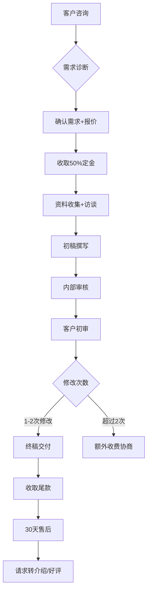
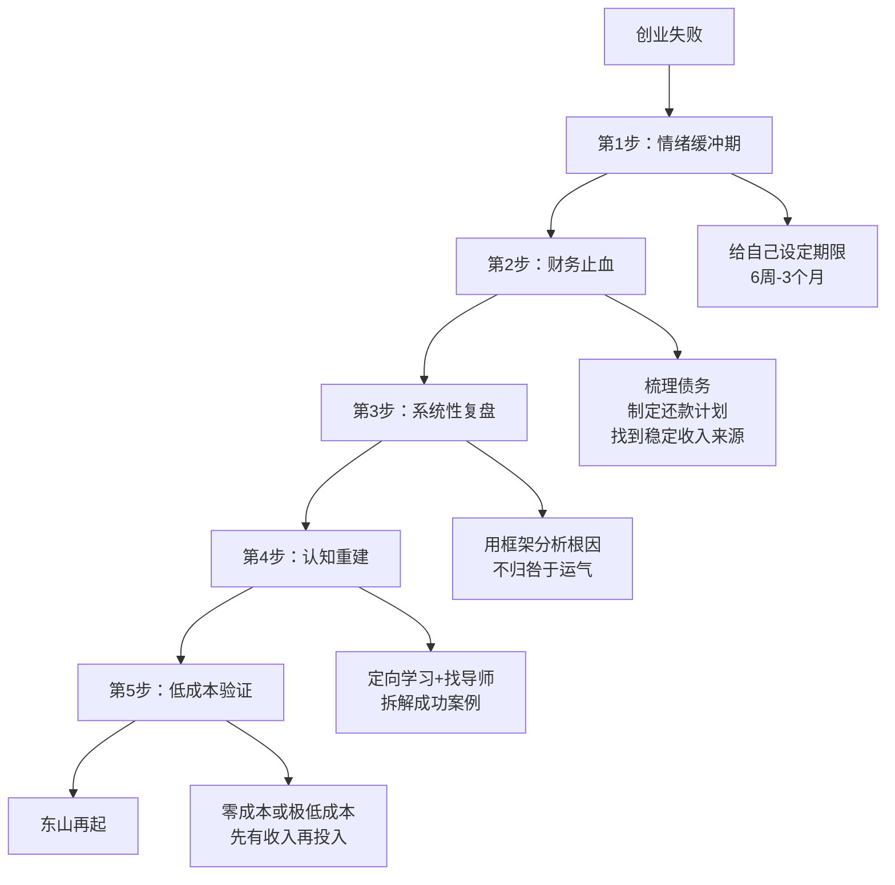

## 案例五：创业失败后的东山再起

> 创业失败不是终点，而是认知升级的起点。真正的东山再起，不是简单地"再来一次"，而是在废墟上重建一套更坚固的系统。

### 案例背景：为什么这个案例值得深读

在中国，20-35岁创业者的首次创业失败率超过90%。但更值得关注的是：其中约60%的人在失败后彻底放弃创业，30%的人带着同样的认知再次失败，只有不到10%的人能真正吸取教训、东山再起。

本案例的主角**张磊**（化名），26岁时创办了一家社区生鲜配送公司，运营18个月后亏损67万倒闭。28岁时他以完全不同的方式重新出发，用2年时间不仅还清了债务，还积累了第一个100万资产。

这个案例的核心价值不在于"他成功了"，而在于他**如何从失败中提取出可复用的认知框架**，以及他第二次创业时做出了哪些与第一次完全不同的决策。

---

### 第一阶段：首次创业——社区生鲜配送（25-27岁）

#### 创业动机：看起来完美的机会

张磊是某二线城市的一名产品经理，月薪12000元。2021年，他观察到几个现象：

- 小区居民买菜要走15分钟到菜市场，年轻人普遍抱怨不方便
- 疫情后社区团购模式被验证，美团优选、多多买菜等平台快速扩张
- 他所在小区有3000户居民，入住率约70%，消费能力中等偏上

他的商业逻辑是：**大平台覆盖不到的"最后一公里"服务**——以小区为单位，提供当日达的生鲜配送，主打品质和速度。

**初始投入清单：**

| 项目 | 金额（元） | 说明 |
|------|-----------|------|
| 冷链设备（二手冰柜×3） | 8,000 | 用于蔬果肉类保鲜 |
| 配送电动车×2 | 6,000 | 自购二手电动车 |
| 首批进货 | 15,000 | 从批发市场采购 |
| 微信小程序开发 | 5,000 | 外包开发简易下单系统 |
| 3个月房租（仓库） | 9,000 | 小区底商地下室 |
| 包装材料 | 2,000 | 保鲜袋、泡沫箱等 |
| 流动资金 | 10,000 | 应急周转 |
| **合计** | **55,000** | 其中35,000为积蓄，20,000为信用卡 |

#### 运营过程：看似顺利的前6个月

**第一个月：** 通过业主群推广，首周注册用户187人，日均订单23单，客单价38元。张磊亲自跑批发市场、亲自配送，日工作14小时。

**第二到三个月：** 口碑传播，用户增长到520人，日均订单67单。张磊雇了第一个配送员，月薪4500元。开始出现第一个问题——**损耗率高达15%**（行业平均8%），因为采购量小，无法精准预测需求，经常出现叶菜卖不完烂掉的情况。

**第四到六个月：** 用户突破1200人，日均订单130单。张磊雇了2个配送员和1个采购帮手。月流水从最初的2.6万增长到14.7万，看起来形势一片大好。

#### 崩塌：第7个月开始的连锁反应

**问题一：现金流断裂（致命伤）**

张磊的商业模式有一个隐藏的致命缺陷——**先垫钱进货，后收款**。他给熟客开了"月结"的口子，到第7个月时，应收账款累积到8.3万元。而批发市场的上游供应商开始要求现结（因为他采购量增大，供应商觉得风险高了）。

现金流公式：
```text
可用现金 = 月流水 - 月支出 - 应收账款积压
         = 147,000 - 132,000 - 83,000（累计未收回）
         = -68,000（资金缺口）
```

他不得不用信用卡套现来填补缺口，信用卡债务开始滚雪球。

**问题二：平台降维打击**

美团优选和多多买菜在他所在的小区开通了次日达服务，价格比他低20-30%。他的核心优势——"当日达"——在大平台的补贴面前变得毫无意义。日均订单从130单骤降到65单，但固定成本（仓库租金、员工工资、设备折旧）一分不少。

**问题三：管理能力跟不上**

雇了4个人之后，张磊发现自己从一个"卖菜的"变成了一个"管人的"，但他完全没有管理经验。配送员迟到、错送、漏送的问题频发，客户投诉率从2%飙升到11%。他花大量时间处理客诉，没有精力去优化供应链。

**问题四：沉没成本陷阱**

到了第12个月，张磊其实已经看清了模式不可持续，但他投了55,000元积蓄和20,000元信用卡，加上运营中追加的投入，总沉没成本超过12万元。他告诉自己"再坚持一下就能盈亏平衡"，又硬撑了6个月，最终多亏了15万。

#### 失败复盘：量化分析

**最终财务状况（运营18个月）：**

| 项目 | 金额（元） |
|------|-----------|
| 总投入 | 122,000 |
| 总收入 | 168,000 |
| 总支出（进货+人工+租金+杂费） | 235,000 |
| 净亏损 | -67,000 |
| 信用卡债务 | -45,000 |
| 亲友借款 | -20,000 |
| **总负债** | **-65,000** |

注：总支出>总收入+投入，差额由信用卡套现和借款填补。

#### 失败根因分析

张磊花了整整3个月做复盘，最终提炼出5个根本原因：

**1. 没有验证就全力投入**

他看到"需求"就认为"市场存在"，但**需求≠付费意愿**。小区居民确实觉得买菜不方便，但他们愿意为"方便"多付多少钱？他没有做任何定价测试就ALL IN了。

正确的验证方法应该是：先用微信群+手动接龙的方式运营2周，不投入任何固定资产，验证用户是否真的愿意为当日达多付15-20%的溢价。

**2. 护城河为零**

他的模式本质上是"搬运工"——从批发市场搬到小区。没有供应链优势（采购量太小）、没有技术壁垒（小程序谁都能做）、没有品牌溢价（生鲜是高度标准化的品类）。任何有电动车的人都能复制他的模式。

**3. 财务模型存在结构性缺陷**

他从未做过详细的盈亏平衡分析。实际上，按照他的成本结构：

```text
盈亏平衡点 = 固定成本 ÷ (客单价 × 毛利率 - 变动成本)
           = 42,000 ÷ (38 × 25% - 3.5)
           = 42,000 ÷ 6
           = 7,000单/月 ≈ 233单/日
```

他的日均峰值只有130单，距离盈亏平衡点还有近一倍的差距。这个模式在起步阶段就注定亏损，除非能快速做到233单/日以上——而以他的资源和能力，这几乎不可能。

**4. 沉没成本导致决策延迟**

最后6个月的"坚持"是最大的错误。如果在第7个月及时止损，亏损可以控制在3万以内，而不是6.7万。

**5. 个人能力与商业模式不匹配**

他是产品经理出身，擅长的是需求分析和用户体验设计，但生鲜配送的核心能力是供应链管理和地推获客。他选了一个自己最不擅长的赛道。

---

### 第二阶段：低谷期——债务、自我怀疑与认知重建（27岁）

#### 情绪管理：允许自己难过，但设定期限

创业失败后，张磊经历了为期约6周的低谷期：

- **第1-2周：** 否认阶段。不断复盘"如果当时做了XX就不会失败"，试图找到一个"如果"来推翻结局
- **第3-4周：** 愤怒和自责。觉得自己浪费了2年时间，对不起借给他钱的父母
- **第5-6周：** 逐渐接受。开始能够冷静地看待失败，不再情绪化

他做了一个关键决定：**给自己6周的"情绪缓冲期"，6周后必须开始行动**。这个时间框架帮助他避免了两个极端——急于求成地"马上再来一次"和陷入长期的自我否定。

#### 债务处理：建立清晰的还款计划

6.5万债务不是小数目。张磊的做法是：

**第一步：梳理所有债务**

| 债务类型 | 金额（元） | 利率 | 优先级 |
|----------|-----------|------|--------|
| 信用卡（分期） | 25,000 | 月1.5% | 最高（利息最高） |
| 信用卡（最低还款） | 20,000 | 月1.5% | 最高 |
| 父母借款 | 15,000 | 0% | 低（无利息，但影响关系） |
| 朋友借款 | 5,000 | 0% | 中（有时间压力） |
| **合计** | **65,000** | | |

**第二步：制定还款策略**

他采用了"雪崩法"（先还利率最高的）：
- 回到职场，找到一份月薪14000元的产品经理工作
- 每月固定还款6000元（占收入43%）
- 其中5000元优先还信用卡（消灭利息最高的债务）
- 1000元还朋友借款（维护关系）
- 父母的15000元最后还（零利息，但承诺每月告知还款进度）

**第三步：建立应急缓冲**

即使在还债期间，他也每月存500元到一个单独的账户作为应急基金。这个看似矛盾的做法（欠着债还存钱）实际上至关重要——如果遇到突发支出（如生病、设备损坏），没有应急基金就只能再次借债，陷入恶性循环。

#### 认知重建：系统性学习

张磊利用还债期的"被迫稳定期"做了三件事：

**1. 阅读12本创业和商业书籍**

不是随便读，而是带着问题读——"我的失败对应书里的哪个概念？"核心书单：

- 《精益创业》→ 理解MVP验证的概念，明白自己跳过了验证阶段
- 《从0到1》→ 理解护城河的概念，明白自己的模式没有壁垒
- 《财务自由之路》→ 理解资产和负债的区别
- 《定位》→ 理解心智占位的概念
- 《增长黑客》→ 理解低成本获客的方法论

**2. 找到3位创业导师**

他通过创业社群、行业活动等方式，主动找到3位有过创业失败经历并成功东山再起的前辈。不是泛泛请教，而是带着具体的复盘文档去讨论：

- 导师A（餐饮连锁创始人，失败2次后成功）：帮他理解了"先跑通单店模型再扩张"的逻辑
- 导师B（电商创业者）：帮他理解了"选品>运营>流量"的优先级
- 导师C（投资人）：帮他建立了"用投资人的视角评估商业机会"的框架

**3. 拆解50个成功的副业/小创业案例**

他在各种平台上收集了50个真实的小创业案例（月利润1-5万级别），用统一的框架拆解每个案例：

```markdown
## 案例拆解模板

### 基本信息
- 创始人背景：
- 启动资金：
- 启动到盈利时间：
- 当前月利润：

### 商业模型画布
- 客户细分：
- 价值主张：
- 渠道通路：
- 收入来源：
- 成本结构：
- 核心资源：
- 关键活动：
- 重要合作：

### 护城河分析
- 技术壁垒：高/中/低/无
- 网络效应：有/无
- 品牌溢价：高/中/低/无
- 转换成本：高/中/低/无
- 规模效应：强/中/弱/无

### 失败风险
- 最可能的失败原因：
- 最快的验证方法：
- 最小可行投入：
```

这个拆解过程让他形成了一个新的认知框架：**好的创业机会必须同时满足三个条件——有壁垒、能验证、与自身能力匹配**。

---

### 第三阶段：东山再起——B2B企业文档服务（28-30岁）

#### 方向选择：用框架筛选，而不是凭感觉

张磊用他在低谷期建立的筛选框架，在3个月里评估了15个方向，最终选择了**B2B企业文档服务**——帮助企业制作标准化的商业文档（商业计划书、投标书、产品手册、年度报告等）。

**为什么选这个方向？** 用他的三维框架逐一验证：

| 维度 | 评估 | 具体分析 |
|------|------|---------|
| **壁垒** | 中高 | 需要行业知识+写作能力+设计审美的综合能力，不是随便一个人就能做的；积累的行业模板和案例库是隐性资产 |
| **可验证** | 高 | 可以先接1-2单验证，不需要任何固定资产投入 |
| **能力匹配** | 高 | 产品经理的背景让他擅长结构化表达、商业逻辑梳理、PPT/文档制作 |

**对比被淘汰的其他方向：**

- 短视频带货：壁垒低（谁都能拍）、能力不匹配（不擅长出镜表演）
- 知识付费课程：需要已有影响力（他没有粉丝基础）
- 跨境电商：启动资金要求高（至少10万）、学习曲线陡
- 自媒体写作：变现周期太长（至少6个月才可能有收入）

#### 冷启动：零成本验证（第1-2个月）

张磊吸取了第一次创业的教训，这次的冷启动策略是：**先有收入，再有投入**。

**第一步：利用现有资源接第一单**

他在朋友圈发了一条消息："有没有创业的朋友需要写商业计划书？前3单5折，不满意不收钱。"

这条消息的精妙之处：
- "创业的朋友"——精准定位目标客户
- "前3单5折"——降低决策门槛，但不是免费（免费的东西不会被珍惜）
- "不满意不收钱"——消除风险感知

结果：当天收到4个咨询，最终成交2单。一单商业计划书收费1500元（正常价3000元），一单产品手册收费800元（正常价1600元）。

**第二步：用交付质量建立口碑**

第一单商业计划书的客户是一家准备融资的教育科技公司。张磊不仅写了文档，还主动做了竞品分析和财务模型建议。客户反馈："比我们之前花2万请的咨询公司写得还实用。"

这个超预期的交付为他赢得了：
- 该客户的第二单（融资路演PPT，收费3000元）
- 该客户的转介绍（3个新客户）
- 第一个真实案例，用于后续获客

**验证结果（第1-2个月）：**

| 指标 | 数据 |
|------|------|
| 总接单数 | 7单 |
| 总收入 | 12,800元 |
| 投入成本 | 0元（用自己的电脑和软件） |
| 净利润 | 12,800元（100%利润率） |
| 客户满意度 | 7/7全部满意 |
| 转介绍率 | 42%（7个客户中有3个介绍了新客户） |

#### 系统化：从"手艺人"到"生意人"（第3-8个月）

验证通过后，张磊开始系统化运营。他没有急于扩张，而是先建立可复制的体系。

**产品标准化：**

他把服务拆分为5个标准化产品：

| 产品 | 定价 | 交付周期 | 适用场景 |
|------|------|---------|---------|
| 商业计划书 | 3,000-8,000元 | 5-10个工作日 | 融资、合伙 |
| 投标书 | 2,000-5,000元 | 3-7个工作日 | 政府/企业招标 |
| 产品手册 | 1,500-4,000元 | 5-7个工作日 | 产品推广 |
| 年度报告 | 5,000-15,000元 | 10-15个工作日 | 年终总结 |
| 路演PPT | 2,000-6,000元 | 3-5个工作日 | 融资路演 |

**流程标准化：**



**效率提升：**

- 建立了30+套行业模板库，每个新项目的起始效率提升60%
- 用AI工具（ChatGPT/Claude）辅助初稿撰写，单个项目工时从40小时压缩到20小时
- 制作了标准化的客户访谈问卷，减少反复沟通

**获客渠道建设：**

| 渠道 | 获客占比 | 成本 | 特点 |
|------|---------|------|------|
| 老客户转介绍 | 45% | 0元 | 质量最高，转化率65% |
| 小红书/知乎内容 | 25% | 时间成本 | 长尾效应强 |
| 创业社群/孵化器合作 | 20% | 佣金分成 | 精准但量有限 |
| 朋友推荐 | 10% | 0元 | 偶发性 |

#### 财务数据：稳步增长（第3-8个月）

| 月份 | 接单数 | 月收入（元） | 月支出（元） | 月净利润（元） | 累计还债（元） |
|------|--------|------------|------------|--------------|--------------|
| 第3月 | 8 | 18,500 | 2,800 | 15,700 | 18,500 |
| 第4月 | 10 | 23,000 | 3,200 | 19,800 | 34,200 |
| 第5月 | 12 | 28,000 | 3,500 | 24,500 | 52,200 |
| 第6月 | 14 | 32,000 | 4,000 | 28,000 | 65,000 |
| 第7月 | 15 | 35,000 | 4,200 | 30,800 | 65,000（还清） |
| 第8月 | 16 | 38,000 | 4,500 | 33,500 | — |

注：月支出包括软件订阅（500元）、外包设计师费用（2000-3000元）、营销费用（500-1000元）。

**第6个月，6.5万债务全部还清。** 比原计划提前了4个月。

#### 规模化：组建小团队（第9-18个月）

还清债务后，张磊开始用利润进行再投资，组建了一个3人小团队：

- **张磊本人**：客户关系、项目管理、质量把控
- **文案助理**（兼职）：负责初稿撰写和资料整理，按项目付费
- **设计师**（兼职）：负责PPT和文档的视觉设计，按项目付费

团队化之后：
- 月产能从16单提升到25-30单
- 张磊从"做事"转变为"管事+获客"，人效提升
- 平均客单价从2300元提升到3500元（因为能接更复杂的项目了）

#### 东山再起的成果：第18个月时的数据

| 指标 | 首次创业（18个月） | 二次创业（18个月） |
|------|-------------------|-------------------|
| 总投入 | 122,000元 | 约8,000元（软件+初期外包） |
| 总收入 | 168,000元 | 480,000元 |
| 总支出 | 235,000元 | 85,000元 |
| 净利润 | -67,000元 | +395,000元 |
| 负债 | -65,000元 | 0 |
| 净资产 | -65,000元 | +320,000元 |
| 员工数 | 4人（全职） | 3人（兼职为主） |
| 客户满意度 | 60% | 98% |
| 转介绍率 | 5% | 45% |

---

### 第四阶段：从案例中提炼的通用方法论

#### 创业失败后的5步恢复框架



#### 第1步：情绪缓冲期（1-6周）

**允许自己难过，但不要无限期。** 具体做法：

- 设定一个明确的结束日期（比如"6周后我必须开始下一步行动"）
- 每周允许自己有1-2天的"低落日"，但其余时间保持基本的生活节奏
- 不要在低谷期做重大决策（不要马上开始新项目，也不要彻底放弃创业）
- 如果情绪持续低落超过2个月，考虑寻求心理咨询（这不是软弱，是专业）

**常见误区：**
- ❌ "我必须马上开始新项目来证明自己"——急于求成会重蹈覆辙
- ❌ "我再也不创业了"——这是情绪化的决定，不是理性的
- ❌ "这次失败说明我不适合创业"——一次失败的样本量太小，不能得出这个结论

#### 第2步：财务止血（第1-2个月）

**先稳住生活，再谈东山再起。** 具体步骤：

1. **回到职场**——找一份能cover基本生活+还款的工作，不要挑剔，先有收入
2. **梳理所有债务**——列出每一笔债务的金额、利率、还款期限
3. **制定还款计划**——优先还高利率债务，同时保留500-1000元/月的应急基金
4. **与债权人沟通**——坦诚告知情况和还款计划，争取理解

**关键原则：** 不要用新债还旧债，不要用赌博/高风险投资来"翻本"。

#### 第3步：系统性复盘（第1-2个月）

**用框架分析，而不是凭感觉。** 推荐使用"5Why分析法"：

```text
为什么失败了？ → 因为现金流断裂
为什么现金流断裂？ → 因为应收账款太多+固定成本太高
为什么应收账款太多？ → 因为给了客户月结条件
为什么给月结？ → 因为想留住客户
为什么觉得月结能留住客户？ → 因为我没有其他差异化优势，只能在付款条件上让步
                                         ↑
                                    根本原因：没有护城河
```

#### 第4步：认知重建（第2-6个月）

**带着失败的经验去学习，效率是普通学习者的10倍。** 建议：

1. **阅读**——至少读5本创业/商业经典书籍，带着自己的失败案例去对照
2. **找导师**——找到2-3位有过失败经历的创业者，带着复盘文档去请教
3. **拆解案例**——用统一框架拆解20-50个成功的小创业案例，培养商业直觉
4. **参加社群**——加入创业社群，但不要急着找项目，先观察和学习

#### 第5步：低成本验证（第1-3个月）

**在投入任何钱之前，先证明这个方向能赚钱。** 验证清单：

- [ ] 是否找到了至少1个愿意付费的真实客户？
- [ ] 是否完成了至少1单完整的交付？
- [ ] 客户是否满意并愿意推荐给他人？
- [ ] 毛利率是否超过50%？
- [ ] 这个方向是否与我的核心能力匹配？
- [ ] 我能否在不雇人的情况下独立完成前10单？

只有全部打钩，才能进入正式投入阶段。

---

### 常见误区与纠正

#### 误区一：失败是因为运气不好

**错误认知：** "如果当时资金再多一点/时机再好一点/合伙人再靠谱一点，就不会失败。"

**事实：** 运气是创业成功的变量之一，但不是决定性的。张磊的第一次创业，即使资金充裕、时机更好、合伙人更靠谱，核心的商业模式缺陷（无壁垒、不盈利模型）仍然会导致失败。**好的商业模式应该在"运气一般"的情况下也能存活。**

#### 误区二：东山再起就是"再来一次"

**错误认知：** "我已经有了经验，再做一次同样的事情一定能成功。"

**事实：** 如果认知没有升级，经验只是"重复了错误的次数"。张磊第二次创业的方向与第一次完全不同——从C端生鲜变成了B端文档服务。这不是"换赛道"，而是用新的认知框架选择了真正适合自己的方向。

#### 误区三：必须快速成功才能证明自己

**错误认知：** "别人会看不起我，我必须尽快做出成绩。"

**事实：** 张磊的第二次创业花了6个月才还清债务，18个月才积累到第一个100万。**真正的东山再起是一个渐进的过程，不是一个戏剧性的转折点。** 那些看起来"一夜翻盘"的故事，背后都有你看不到的漫长积累。

#### 误区四：失败过的人不值得信任

**错误认知：** "投资者/客户/合作伙伴不会信任一个失败过的人。"

**事实：** 恰恰相反。张磊在第二次创业中，主动在个人介绍中提到自己的失败经历和学到的教训。这反而增加了客户的信任——因为他展现了诚实和自我认知能力。**投资人更愿意投资失败过的创始人，因为他们的学费已经交过了。**

#### 误区五：欠债的时候不应该创业

**错误认知：** "我应该先还清债务再考虑创业。"

**事实：** 这取决于债务的性质和创业的方式。张磊在有6.5万债务的情况下开始第二次创业，但他的第二次创业是**零成本启动**的——没有任何额外投入。**问题不是"有债务能不能创业"，而是"创业是否会增加债务"。** 如果创业不需要额外投入，那还债期反而是最好的启动期——因为你有稳定的工资收入作为安全网。

---

### 进阶思考：失败的长期价值

#### 失败经验是一种稀缺资产

从投资角度看，张磊第一次创业亏损的6.7万，本质上是他购买了一份"认知资产"：

- **风险管理能力**——他学会了识别商业模式中的结构性缺陷
- **财务敏感度**——他学会了现金流管理、盈亏平衡分析
- **情绪韧性**——他经历了最坏的情况并活了下来，心理承受能力大幅提升
- **决策框架**——他建立了系统性的商业评估方法

这些认知资产在第二次创业中被充分运用，直接贡献了约40万的净利润。**6.7万的认知投资，回报率接近500%。**

#### 创业失败者的"幸存者偏差"反面

我们经常听到"某某失败后东山再起"的故事，但很少有人分析：**这些人东山再起的概率有多高？**

根据多项研究数据：
- 首次创业失败后再次创业的成功率约为20-25%（高于首次创业的10-15%）
- 但在失败后1年内再次创业的成功率只有12%（急于求成）
- 在失败后1-3年内再次创业的成功率最高，约28%（有足够的时间反思和准备）

**关键结论：** 失败后不应急于行动，也不应永远放弃。1-3年的"学习+准备期"是东山再起的最优时间窗口。

---

### 本案例的核心启示

1. **创业失败不是终点，认知不升级才是。** 张磊的两次创业之间最大的区别不是方向、不是资源、不是运气，而是认知水平。

2. **先验证再投入，是避免重大损失的铁律。** 第一次创业投入12.2万，第二次投入8000元。第二次赚的钱是第一次的2.4倍。

3. **债务不是敌人，现金流才是。** 有债务不可怕，可怕的是没有还款计划和稳定收入来源。

4. **东山再起是一个过程，不是一个瞬间。** 从失败到恢复用了6个月，从恢复到突破用了12个月，从突破到成功用了18个月。总计36个月——没有捷径。

5. **你的失败经验，是你的护城河。** 当你把失败的教训转化为系统性的认知框架，这些框架本身就是你最大的竞争优势。
