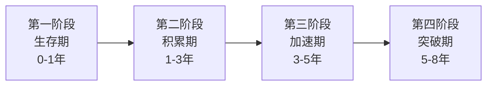

## 案例总结：积累期的共同规律

前面的案例覆盖了不同起点、不同路径的20-30岁积累期故事——从月薪3000的程序员到年薪50万，从月光族到40万净资产，从大学生理财启蒙到创业失败后的东山再起。表面看每个人的故事截然不同，但剥开具体细节，底层逻辑惊人地一致。本节提炼这些案例中反复出现的共同规律，帮你建立一个可复制的积累期行动框架。

### 一、七个案例的核心数据对比

先把所有案例的关键指标拉到同一张表上，直观感受规律：

| 维度 | 程序员案例 | 月光族案例 | 斜杠青年 | 小镇青年 | 创业重启 | 投资之路 | 副业过万 |
|------|-----------|-----------|---------|---------|---------|---------|---------|
| 起始年龄 | 22岁 | 24岁 | 23岁 | 21岁 | 26岁 | 25岁 | 23岁 |
| 起始月薪 | 3,000元 | 6,000元 | 5,000元 | 3,500元 | 4,000元（重启） | 7,000元 | 4,500元 |
| 用了多久 | 8年 | 5年 | 4年 | 6年 | 3年 | 5年 | 3年 |
| 终态月收入 | 40,000+元 | 15,000元 | 20,000+元 | 12,000元 | 25,000元 | 被动收入5,000元 | 12,000+元 |
| 终态净资产 | 200万+ | 40万 | 80万+ | 50万 | 100万+ | 60万 | 30万 |
| 核心策略 | 技术深耕 | 节流+定投 | 多元收入 | 降维+迁移 | 资源复用 | 系统投资 | 副业变现 |

**关键观察**：终态净资产与起始月薪无关，与策略执行时长和储蓄率高度相关。小镇青年起始月薪最低（3,500元），但6年积累到50万；斜杠青年起始月薪5,000元，4年达到80万——路径选择比起点重要得多。

### 二、积累期的五条铁律

从所有案例中提炼出五条反复验证的规律，每条都有具体的数据支撑。

#### 铁律一：收入增长是非线性的，但前期必须忍受线性

几乎所有案例都呈现同一个收入曲线——前1-2年几乎看不到增长，第3年开始出现跳跃：

```text
收入增长曲线（典型模式）：

月收入（元）
40,000 |                                          *
30,000 |                                    *
20,000 |                              *
15,000 |                        *
10,000 |                  *
 8,000 |            *
 5,000 |      *  *
 3,000 | *
       +----+----+----+----+----+----+----+----→ 年份
         1    2    3    4    5    6    7    8
```

**为什么是这种形状？** 因为人力资本的增值遵循"投入-积累-爆发"的S曲线。前1-2年你在建立基础能力、积累行业认知、构建人脉网络，这些投入不会立即转化为收入。但一旦越过临界点（通常在第2-3年），积累的资本开始产生复利效应——技能让你拿到更好的项目，人脉带来更优质的机会，个人品牌降低获客成本。

**实操建议**：
- 第1年：不要纠结收入数字，把90%的精力放在能力提升上
- 第2年：开始有意识地将能力转化为可见成果（项目、作品、认证）
- 第3年：主动争取收入跳跃——跳槽、谈薪、接大单

#### 铁律二：储蓄率比收入绝对值更重要

这是最容易被忽视的规律。看两组对比：

| 人物 | 月收入 | 月支出 | 月储蓄 | 储蓄率 | 5年总储蓄 |
|------|--------|--------|--------|--------|----------|
| A（高收入低储蓄） | 20,000元 | 17,000元 | 3,000元 | 15% | 18万 |
| B（中收入高储蓄） | 10,000元 | 4,000元 | 6,000元 | 60% | 36万 |

A的收入是B的两倍，但5年总储蓄只有B的一半。所有成功案例中，没有一个是靠"赚得多花得也多"实现积累的。

**储蓄率的黄金区间**：

| 储蓄率 | 等级 | 评价 |
|--------|------|------|
| <10% | 危险区 | 任何意外都会打破平衡 |
| 10%-20% | 及格线 | 能积累但速度很慢 |
| 20%-40% | 良好 | 多数成功案例的起点 |
| 40%-60% | 优秀 | 加速积累的关键区间 |
| >60% | 极限操作 | 需要极低生活成本或极高收入 |

**如何提高储蓄率？** 两个杠杆同时撬动：
1. **降低分母**（减少支出）：区分"需要"和"想要"，砍掉所有不产生价值的消费
2. **提高分子**（增加收入）：但注意——收入增长带来的储蓄增量应该100%存下来，而不是升级消费

#### 铁律三：第一桶金的积累方式决定了后续路径

案例中出现三种第一桶金的积累模式：

**模式A：工资储蓄型**
- 代表：月光族案例、应届毕业生案例
- 特点：通过极致节流 + 稳定工资，2-3年积累5-10万
- 优势：风险极低，适合保守型人格
- 劣势：速度慢，容易在中途放弃

**模式B：技能变现型**
- 代表：程序员案例、副业过万案例
- 特点：通过技能提升带来收入跳跃，1-2年积累10-20万
- 优势：速度快，且技能是可持续资产
- 劣势：需要一定的技能基础和市场敏感度

**模式C：资源整合型**
- 代表：斜杠青年、创业重启案例
- 特点：通过整合人脉、信息、渠道等资源，快速变现
- 优势：上限最高，速度快
- 劣势：风险大，失败率高，需要较强社交能力

**选择建议**：不要盲目模仿别人的路径。评估自己的起点（技能、资金、人脉、风险承受力），选择匹配的模式。小镇青年用模式A起步，积累到一定资本后转向模式B，这种"组合拳"才是最常见且最稳妥的路径。

#### 铁律四：复利效应需要时间，但职业复利比金融复利更快

很多人一提到"复利"就想到投资。但在20-30岁阶段，真正产生复利效应的是三个领域：

**职业复利**（增长最快）：
- 技能提升 → 更好的项目机会 → 更高的收入 → 更多资源投入学习
- 典型回报率：每年20-50%的收入增长（前5年）
- 案例：程序员从月薪3,000到年薪50万，8年增长16倍

**人脉复利**（增长中等）：
- 认识优秀的人 → 获得更好的信息和机会 → 认识更优秀的人
- 典型回报率：每年新增5-10个高质量人脉
- 案例：应届毕业生3年积累30个行业核心人脉

**金融复利**（增长最慢但最稳定）：
- 储蓄 → 投资 → 收益再投资 → 资产增值
- 典型回报率：年化8-12%（长期定投指数基金）
- 案例：月光族5年定投，35万投资资产

**关键洞察**：在20-30岁阶段，把精力优先分配给职业复利和人脉复利，金融复利是"锦上添花"而非"雪中送炭"。这不是说不投资——而是说不要为了追求投资收益而牺牲学习和社交时间。

#### 铁律五：失败是积累期的必修课，但要控制失败的成本

创业失败案例最能说明这一点。创业者的第一次创业失败，损失了全部积蓄20万，但他做了三件关键的事：

1. **控制了最大损失**：没有借高利贷，没有抵押房产，损失上限就是20万
2. **保留了核心资产**：人脉、行业认知、失败经验都还在
3. **快速复盘**：3个月内完成失败分析，明确下一步方向

**失败成本控制矩阵**：

| 失败类型 | 可接受的成本 | 不可接受的成本 |
|---------|-------------|--------------|
| 技能学习失败 | 3-6个月的时间投入 | 放弃主业全职学习 |
| 副业尝试失败 | 1-3个月的业余时间 | 借钱投入副业 |
| 投资亏损 | 总资产的10-20% | 借钱炒股、加杠杆 |
| 创业失败 | 全部投入的资金 | 个人信用、家庭关系 |
| 职业转型失败 | 1-2年的收入差距 | 多年积累的行业人脉 |

### 三、积累期的四阶段模型

综合所有案例，20-30岁的积累期可以清晰地划分为四个阶段，每个阶段有不同的核心任务：



#### 第一阶段：生存期（0-1年）

**核心任务**：活下来，建立基本盘

| 任务 | 具体行动 | 成功标志 |
|------|---------|---------|
| 稳定收入 | 确保主业稳定，不轻易裸辞 | 月收入覆盖基本生活+20%余量 |
| 建立记账习惯 | 每日记账，月末复盘 | 连续3个月记录完整 |
| 识别隐形消费 | 找出"不知道花到哪去了"的钱 | 隐形消费<月收入5% |
| 建立应急储备 | 存下3个月生活费 | 应急金到位 |

**这个阶段最常犯的错误**：急于投资、急于跳槽、急于搞副业。地基没打好就盖楼，后面全部要推倒重来。

#### 第二阶段：积累期（1-3年）

**核心任务**：快速提升收入，建立储蓄系统

| 任务 | 具体行动 | 成功标志 |
|------|---------|---------|
| 收入翻倍 | 技能提升+跳槽/谈薪 | 月收入达到起始的1.5-2倍 |
| 储蓄率达标 | 自动转账+预算控制 | 储蓄率稳定在30%以上 |
| 开始投资 | 定投指数基金 | 连续12个月定投不断 |
| 建立人脉 | 参加行业活动、输出内容 | 认识20+行业同行 |
| 探索副业 | 利用业余时间试水 | 至少尝试过1-2个方向 |

**这个阶段的关键转折点**：从"省钱为主"转向"赚钱为主"。很多月光族案例在这一步卡住——他们已经很会省钱了，但收入增长停滞，储蓄率到了天花板。突破方法是把省下来的时间和精力投入到收入增长上。

#### 第三阶段：加速期（3-5年）

**核心任务**：收入跳跃，资产规模开始产生感知

| 任务 | 具体行动 | 成功标志 |
|------|---------|---------|
| 收入再翻倍 | 跳槽到更好平台或副业变现 | 月收入达到起始的3-5倍 |
| 资产破50万 | 工资储蓄+投资收益 | 总净资产达到50万 |
| 建立被动收入 | 投资分红、副业自动化 | 被动收入>月支出10% |
| 个人品牌成型 | 在行业内有知名度 | 主动找来的机会>自己找的 |

**这个阶段的陷阱**：生活方式膨胀。收入涨了3倍，但消费也涨了3倍，净资产没变。所有成功案例的共同点是——收入增长后，储蓄率不降反升。

#### 第四阶段：突破期（5-8年）

**核心任务**：从量变到质变，建立可持续的财富增长系统

| 任务 | 具体行动 | 成功标志 |
|------|---------|---------|
| 资产破百万 | 多元收入+复利投资 | 总净资产达到100万 |
| 收入结构多元化 | 主业+副业+投资 | 任何单一收入来源<总收入60% |
| 系统化投资 | 从定投升级到资产配置 | 年化收益稳定在8-15% |
| 可持续增长 | 建立不依赖个人时间的收入 | 被动收入>月支出50% |

### 四、不同起点的最优路径推荐

不是所有人都从同一起跑线出发。根据你的起点，选择最匹配的路径：

#### 起点A：低薪无积蓄（月薪<5,000元，存款<1万）

**最优路径**：先降维生存，再技能突破

```text
第1步（0-6个月）：极致节流
  - 月支出控制在收入的50%以内
  - 建立应急储备金（3个月生活费）

第2步（6-18个月）：技能投资
  - 每天投入2小时学习高价值技能
  - 目标：18个月后收入翻倍

第3步（18-36个月）：收入跳跃
  - 跳槽或谈薪，实现收入1.5-2倍增长
  - 储蓄率提升到40%+

第4步（36个月+）：投资+副业
  - 开始定投
  - 探索技能变现的副业
```

#### 起点B：中等收入有基础（月薪5,000-10,000元，存款5-20万）

**最优路径**：加速收入增长，同步投资

```text
第1步（0-6个月）：优化支出结构
  - 砍掉所有"看起来有用但实际没用"的消费
  - 储蓄率提升到30-40%

第2步（6-18个月）：收入突破
  - 技能提升+跳槽/副业
  - 目标：月收入达到15,000+

第3步（18-36个月）：资产加速
  - 定投金额提升到月收入30%
  - 探索第二收入来源

第4步（36个月+）：系统化
  - 建立资产配置体系
  - 被动收入目标：月支出的30%
```

#### 起点C：高薪但月光（月薪>10,000元，存款<5万）

**最优路径**：先治消费病，再发挥收入优势

```text
第1步（0-3个月）：记账诊断
  - 找出所有不必要的支出
  - 通常能砍掉30-40%的支出

第2步（3-12个月）：建立自动储蓄
  - 发工资当天自动转走40-50%
  - 用剩下的钱生活，假装收入只有那么多

第3步（12-24个月）：投资起步
  - 应急金到位后，开始定投
  - 利用高收入优势快速积累本金

第4步（24个月+）：优化收入结构
  - 高薪但不可持续的工作，要建立Plan B
  - 副业或投资收入逐步替代部分工资依赖
```

### 五、案例中的反模式——哪些做法注定失败

除了成功规律，案例中也隐含了一些"反模式"——这些做法看似合理，但几乎所有失败者都在做：

**反模式一：等收入高了再存钱**
- 真相：月入3,000存不下钱的人，月入30,000大概率也存不下
- 原因：消费习惯一旦形成，会随收入同步膨胀
- 正确做法：从第一份工资开始就储蓄，哪怕只有100元

**反模式二：追求一夜暴富**
- 真相：所有案例中没有一个是靠"暴富"实现积累的
- 原因：暴富的期望导致高风险决策，而高风险决策的期望值是负的
- 正确做法：接受"慢慢变富"，把精力放在可控的事情上

**反模式三：只开源不节流**
- 真相：收入增长10%很难，但减少10%的浪费很容易
- 原因：提高收入需要外部认可，减少支出只需要自我管理
- 正确做法：两个杠杆同时撬动，但先把"节流"做到位

**反模式四：孤军奋战**
- 真相：所有成功案例都有"关键人脉"的影子
- 原因：信息不对称是最大的成本，而人脉是降低信息成本的最有效工具
- 正确做法：从第1年就开始有意识地构建人脉网络

**反模式五：完美主义导致不行动**
- 真相：没有一个案例是"准备好了一切才开始"的
- 原因：完美计划是拖延的借口，边做边调整才是正确姿势
- 正确做法：70分就可以开始，边执行边优化

### 六、可复用的积累期自检清单

每个月用这张清单自检一次，确保你还在正确的轨道上：

```markdown
## 月度自检清单

### 收入维度
- [ ] 本月收入是否高于去年同期？
- [ ] 本月是否为提升收入做了具体行动（学习/谈薪/接单）？
- [ ] 收入来源是否在多元化？

### 支出维度
- [ ] 本月储蓄率是否达到目标（30%+）？
- [ ] 是否有冲动消费需要复盘？
- [ ] 固定支出是否还有优化空间？

### 投资维度
- [ ] 定投是否按时执行？
- [ ] 投资知识是否有更新？
- [ ] 资产配置是否需要再平衡？

### 成长维度
- [ ] 本月学到了什么新技能/知识？
- [ ] 人脉网络是否有扩展？
- [ ] 个人品牌是否有输出（文章/分享/项目）？

### 心态维度
- [ ] 是否还在和别人比较而焦虑？
- [ ] 是否因为短期波动而动摇长期计划？
- [ ] 是否保持了足够的耐心和信心？
```

### 七、从规律到行动：你的下一步

读完这些规律，最重要的是转化为行动。不需要同时执行所有建议——选择对你当前阶段最有杠杆效应的1-2个行动点，立刻开始：

1. **如果你还没有记账习惯**：今天就开始，用任何APP都行，关键是连续记录
2. **如果你的储蓄率低于20%**：这个月就把自动转账设置好
3. **如果你还没有开始投资**：本周开一个基金账户，设定第一个定投计划
4. **如果你的收入2年没增长**：本月更新简历，开始看市场机会
5. **如果你没有行业人脉**：这个月参加1个行业活动或社群

积累期的精髓不是"做很多事"，而是"持续做对的事"。所有案例的共同点只有一个——他们都在正确的方向上，坚持了足够长的时间。

> **记住**：20-30岁是你人生中试错成本最低、复利效应最高的十年。不是因为这段时间你能赚多少钱，而是因为这段时间建立的习惯、技能、人脉和认知，会复利式地影响你之后的整个人生。现在开始，永远不晚；但越早开始，复利越惊人。
