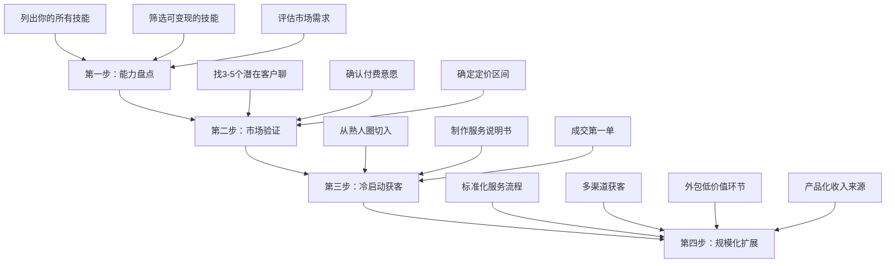

## 案例七：副业从0到月入过万

> 本案例记录了一位普通上班族从零开始搭建副业，用12个月时间实现月入稳定过万的完整历程。案例重点展示副业冷启动、客户获取、服务标准化和收入规模化的全过程，并附带每个阶段的收入明细、踩坑记录和可复用的方法论。

### 一、案例背景

#### 1.1 人物画像

**基本信息**

| 项目 | 详情 |
|------|------|
| 化名 | 林晨（为保护隐私，使用化名） |
| 年龄 | 26岁 |
| 所在城市 | 成都（新一线城市） |
| 本职工作 | 某中型公司市场专员，月薪6500元 |
| 学历 | 本科，市场营销专业 |
| 工作年限 | 3年 |
| 可支配时间 | 工作日晚上2-3小时，周末每天4-5小时 |
| 初始资金 | 可投入2000元启动资金 |

**起点特征分析**

林晨的起点代表了大多数20-30岁职场人的典型状态：学历不差但不算顶尖，工作稳定但收入增长缓慢，有时间焦虑但不知道从何入手。他的优势在于市场营销的专业背景让他对用户需求和传播逻辑有一定认知，劣势在于没有突出的技术技能（不会编程、不会设计），也没有积累起可以变现的行业人脉。

#### 1.2 为什么选择副业

林晨决定做副业的直接导火索是2023年公司年度调薪只涨了300元，而他所在城市的房租同比涨了8%。他算了一笔账：按目前的涨薪速度，即使不考虑通胀，要达到月入过万至少还需要5年。而副业如果能成功，最快1年就能实现这个目标。

更深层的驱动力来自三个认知：

- **收入天花板焦虑**：市场专员的行业平均薪资上限约12K-15K，仅靠本职工作很难突破这个区间
- **抗风险需求**：2023年互联网裁员潮让他意识到单一收入来源的风险
- **个人价值验证**：他想知道自己的能力在开放市场上值多少钱

#### 1.3 方向选择的决策过程

林晨没有盲目行动，而是花了一个完整周末做了系统的方向评估。他用了一个自创的"四维评估法"：

**四维评估矩阵**

| 评估维度 | 权重 | 具体问题 | 林晨的自评 |
|----------|------|----------|-----------|
| 技能匹配度 | 30% | 我擅长什么？什么是我做得比多数人好的？ | 文案写作、活动策划、数据分析（Excel/Python基础） |
| 市场需求度 | 30% | 有人愿意为这个能力付费吗？付费意愿强吗？ | 中小企业有营销外包需求，但预算有限 |
| 时间友好度 | 20% | 能否在下班后和周末完成？时间是否灵活？ | 文案和策划类工作可以远程完成，时间灵活 |
| 可规模化程度 | 20% | 能否从一对一升级到一对多？天花板在哪里？ | 标准化后可做成模板/课程，天花板较高 |

经过评估，他排除了几个常见选项：
- **外卖/网约车**：时间友好度低（需要固定时段出车），不可规模化
- **自媒体**：启动周期太长（至少6个月才可能有收入），短期不可行
- **代购/微商**：需要囤货资金，且与本职工作可能存在利益冲突
- **技术外包**：自己的技术能力不足以接商业项目

最终他选择的方向是：**中小企业营销代运营**——帮小微企业做社交媒体内容、活动策划和简单的数据报表，按月收费。

### 二、冷启动阶段（第1-3个月）

#### 2.1 找到第一批客户

冷启动是副业最难的阶段。林晨的方法不是广撒网，而是精准出击。

**第一步：盘点可触达的人脉池**

他列了一张表，把所有可能带来客户的关系分为四层：

```text
第一层（强关系）：同事、同学、亲友 → 直接需求或转介绍
第二层（弱关系）：前同事、行业社群群友 → 有需求但需要建立信任
第三层（陌生关系）：本地商会、创业者社群 → 需要冷启动触达
第四层（线上关系）：社交平台、内容平台 → 需要内容吸引
```

他的策略是先从第一层和第二层切入，因为信任成本最低。

**第二步：制作"服务说明书"**

他没有直接去推销，而是先写了一份2页的服务说明书（本质上是一个PDF格式的案例介绍），内容包括：
- 我能帮你解决什么问题（列出3个具体场景）
- 我的方案是什么（附带一个简化版的方案示例）
- 收费标准和合作方式
- 我的相关经验（本职工作的脱敏案例）

这份说明书的核心逻辑是"让对方一看就知道你能帮他赚钱"，而不是"我有什么能力"。

**第三步：精准触达**

| 渠道 | 动作 | 结果 |
|------|------|------|
| 朋友圈 | 发了一条精心设计的朋友圈，展示自己帮公司做的营销案例数据（脱敏后） | 3个朋友私聊咨询，1个有真实需求 |
| 行业社群 | 在3个本地创业者微信群里提供了一次免费的营销诊断 | 2个群友主动找他聊合作 |
| 前同事推荐 | 请3位关系好的前同事帮忙留意 | 1位前同事介绍了一个开店的朋友 |

**冷启动成果**

第一个月，林晨用几乎零成本获得了3个意向客户，最终成交了1个。这个客户是他前同事介绍的一个开奶茶店的朋友，每月收费1500元，服务内容是帮对方运营小红书和大众点评。

#### 2.2 第一笔收入的里程碑意义

第一个月的收入是1500元。这个数字看起来不多，但它的意义远大于金额本身：

- **验证了市场需求是真实的**：有人愿意为他的服务付费
- **建立了信心闭环**：从"我不确定能不能做"变成了"我可以做"
- **获得了第一个案例**：这个案例后续成为他拓展客户的最重要素材

林晨在这个阶段犯的一个错误是定价太低。1500元/月对应的工作量其实不小（每周需要花6-8小时），折合时薪只有约40元，低于成都的兼职市场均价。但回头看，低价策略在冷启动阶段确实降低了客户的决策门槛，有其合理性——关键是不要在这个价位停留太久。

#### 2.3 冷启动阶段的收入明细

| 月份 | 客户数 | 月收入 | 投入时间 | 时薪（估算） |
|------|--------|--------|----------|-------------|
| 第1个月 | 1 | 1,500元 | 30小时 | 50元 |
| 第2个月 | 2 | 3,200元 | 45小时 | 71元 |
| 第3个月 | 3 | 5,000元 | 50小时 | 100元 |

### 三、成长突破阶段（第4-6个月）

#### 3.1 从"做事情"到"做产品"

前三个月，林晨为每个客户提供的都是定制化服务——根据客户的具体需求来策划内容和活动。这种方式的问题是：每个客户都要从头开始，效率很低，而且很难复制。

转折点出现在第4个月。他把服务内容标准化为三个套餐：

**服务产品化方案**

| 套餐名称 | 月费 | 服务内容 | 适合客户类型 |
|----------|------|----------|-------------|
| 基础版 | 2,000元/月 | 每月8条小红书/抖音图文内容策划 + 月度数据报告 | 个体户、小店铺 |
| 标准版 | 4,000元/月 | 基础版内容 + 每月1次营销活动策划 + 竞品分析 | 中小企业、连锁店 |
| 高级版 | 8,000元/月 | 标准版全套 + 每周1次线上营销顾问会议 + 季度营销方案 | 成长型企业 |

这个标准化过程的关键是把"我在做的事情"变成"客户能看懂的产品"。具体来说，他做了三件事：

1. **提炼SOP（标准操作流程）**：把每月为每个客户做的事情拆成标准步骤，形成流程文档
2. **制作内容模板库**：积累了50+个经过验证的内容模板，新客户可以快速套用
3. **建立数据看板**：用Excel做了一个标准化的数据报告模板，每个客户只需要替换数据

#### 3.2 定价策略的调整

林晨在第4个月做了一个大胆的决定：涨价。他把最便宜的套餐从1500元提到了2000元，同时升级了服务内容。

涨价的逻辑很简单：前三个月他已经积累了真实案例和客户好评，不再是"零经验的新手"。而1500元的价格吸引的多是预算极度敏感的客户，这类客户往往沟通成本最高、满意度最难保障。

**涨价前后的对比**

```text
涨价前（1500元/月）：
- 客户质量：预算敏感型，期望值高，沟通频繁
- 服务内容：非标准化，每次都要从零开始
- 时薪：约50元
- 续约率：33%（3个客户只续约了1个）

涨价后（2000-4000元/月）：
- 客户质量：更认可专业价值，沟通效率高
- 服务内容：标准化套餐，流程化执行
- 时薪：约100-120元
- 续约率：75%（4个客户续约了3个）
```

这个经验可以用一句话总结：**低价不等于低门槛，高价反而降低了沟通成本**。

#### 3.3 获客渠道的扩展

到了第5个月，林晨意识到仅靠熟人转介绍已经不够了。他开始系统性地拓展获客渠道：

**渠道一：内容营销（成本最低，周期最长）**

他在小红书上开了一个账号，定位是"帮中小企业做营销的实战派"，每周发2-3篇内容。内容策略是"案例拆解+实操模板"：

- 不讲大道理，只讲"我是怎么帮XX店铺一个月涨粉2000的"
- 每篇笔记附带一个可直接使用的模板或工具
- 评论区积极回复，建立专业形象

到第6个月，这个账号积累了约800个粉丝，带来了2个付费客户。

**渠道二：本地商会和创业社群**

他花了200元参加了成都的一个小型创业者社群（按季付费），每月参加一次线下聚会。这个渠道的核心价值不是直接获客，而是建立"本地营销专家"的人设。到第6个月，通过这个社群获得了3个客户。

**渠道三：老客户转介绍激励**

他设计了一个简单的转介绍机制：老客户每介绍一个成交客户，下个月服务费减免500元。这个机制在第5-6个月带来了4个新客户，获客成本仅为500元/客户，远低于任何广告投放。

#### 3.4 成长阶段的收入明细

| 月份 | 客户数 | 月收入 | 投入时间 | 时薪（估算） | 新增获客渠道 |
|------|--------|--------|----------|-------------|-------------|
| 第4个月 | 5 | 7,500元 | 55小时 | 136元 | 老客户续约+涨价 |
| 第5个月 | 7 | 10,200元 | 60小时 | 170元 | 转介绍+社群 |
| 第6个月 | 9 | 13,500元 | 65小时 | 208元 | 小红书+社群+转介绍 |

### 四、稳定增长阶段（第7-12个月）

#### 4.1 服务瓶颈与突破

第7个月，林晨遇到了一个新问题：**时间饱和**。9个客户每月需要投入约65小时，加上本职工作，他已经没有任何余力了。如果继续增加客户，要么降低服务质量，要么影响本职工作——两条路都走不通。

他用了一个周末复盘，发现问题的核心不是客户太多，而是他的服务模式还是"手工作坊"模式——每个客户的每条内容都是他亲手写的。要突破这个瓶颈，必须从"自己做"变成"带着别人做"。

**突破方案：建立协作体系**

他做了两个关键决策：

1. **外包低价值环节**：在某兼职平台上找了2个大学生兼职，负责基础的内容撰写和图片排版，每条内容付30-50元。他只负责策略方向和最终审核。

2. **搭建质量控制流程**：

```text
需求分析（林晨）→ 内容策划（林晨）→ 初稿撰写（兼职）→ 审核修改（林晨）→ 数据复盘（林晨）
```

通过这个调整，他把每个客户的月均投入时间从7小时降到了4小时，腾出了约30小时/月的空间。

#### 4.2 产品线扩展

腾出时间后，林晨开始探索新的收入来源：

**收入来源多元化**

| 收入类型 | 具体内容 | 月收入占比 | 投入时间占比 |
|----------|----------|-----------|-------------|
| 代运营服务 | 9个客户的月度运营 | 65% | 50% |
| 单次项目 | 活动策划、品牌方案等一次性项目 | 20% | 25% |
| 知识付费 | 营销模板包、实操课程 | 10% | 15%（前期投入，后期被动） |
| 咨询顾问 | 按小时收费的营销咨询 | 5% | 10% |

其中，知识付费的探索值得详细说明。他在第9个月把自己积累的50+内容模板整理成了一个"中小企业营销模板包"，定价199元，通过小红书和朋友圈销售。第一个月卖了15份，第二个月通过口碑传播卖了28份。这个产品几乎不需要额外的运营时间，属于"一次制作、反复销售"的模式。

#### 4.3 客户管理的关键指标

经过半年多的实践，林晨建立了一套简单的客户健康度评估体系：

**客户健康度评估表**

| 指标 | 健康标准 | 预警信号 | 处理方式 |
|------|----------|----------|----------|
| 续约率 | ≥70% | <50% | 分析流失原因，调整服务内容 |
| 客单价 | 稳定或上升 | 持续下降 | 检查是否过度依赖低价客户 |
| 客户满意度 | NPS≥8 | NPS<6 | 主动沟通，了解不满原因 |
| 服务效率 | 月均≤4小时/客户 | >6小时/客户 | 优化流程或外包低价值环节 |
| 转介绍率 | ≥30%的客户有转介绍 | <10% | 设计转介绍激励机制 |

#### 4.4 稳定阶段的收入明细

| 月份 | 客户数 | 代运营收入 | 项目收入 | 知识付费 | 咨询收入 | 月总收入 |
|------|--------|-----------|---------|---------|---------|---------|
| 第7个月 | 9 | 13,500元 | 2,000元 | 0元 | 0元 | 15,500元 |
| 第8个月 | 10 | 14,000元 | 3,000元 | 0元 | 500元 | 17,500元 |
| 第9个月 | 11 | 15,000元 | 2,500元 | 2,985元 | 800元 | 21,285元 |
| 第10个月 | 11 | 15,000元 | 4,000元 | 5,572元 | 1,200元 | 25,772元 |
| 第11个月 | 12 | 16,000元 | 3,500元 | 4,200元 | 1,500元 | 25,200元 |
| 第12个月 | 12 | 16,000元 | 5,000元 | 3,800元 | 2,000元 | 26,800元 |

### 五、复盘与方法论提炼

#### 5.1 一年数据总览

| 指标 | 数值 |
|------|------|
| 累计副业收入 | 186,757元 |
| 月均收入 | 15,563元 |
| 峰值月收入 | 26,800元（第12个月） |
| 累计投入时间 | 约700小时 |
| 时薪变化 | 50元 → 208元（代运营部分） |
| 客户数变化 | 1 → 12 |
| 客户平均生命周期 | 7.2个月 |
| 转介绍率 | 42% |
| 综合续约率 | 78% |

#### 5.2 关键成功因素

**因素一：选择了"服务型"而非"产品型"副业**

林晨选择的代运营服务有一个核心优势：**按月收费，收入可预期**。相比卖货、做自媒体等需要持续获取新流量的模式，服务型副业一旦获得稳定客户，收入就是可预测的。这是他能在第5个月就月入过万的根本原因。

**因素二：快速验证，小步迭代**

他没有花3个月做市场调研、写商业计划书，而是在第一周就发了朋友圈，第一个月就拿到了第一个客户。这种"先开枪再瞄准"的策略在副业冷启动中至关重要——因为你需要的不是完美方案，而是真实的市场反馈。

**因素三：重视客户留存而非拉新**

林晨的客户管理理念是"留住一个老客户比获取三个新客户更重要"。他把续约率从33%提升到78%，这意味着同样的获客投入，收入产出提高了2.3倍。

**因素四：逐步产品化**

从定制化服务到标准化套餐，再到知识付费产品，林晨的副业路径是一个典型的"服务→产品→品牌"升级过程。

#### 5.3 踩坑记录

| 踩坑 | 时间 | 后果 | 解决方式 | 可复用教训 |
|------|------|------|----------|-----------|
| 定价过低 | 第1个月 | 时薪仅50元，吸引低质量客户 | 第4个月涨价并升级服务内容 | 冷启动可以用低价试水，但不要超过3个月 |
| 没有签合同 | 第1个月 | 一个客户做完2个月后赖账，损失3000元 | 从此每个客户签书面协议 | 再小的项目也要有书面约定 |
| 过度承诺 | 第2个月 | 为了拿下客户承诺了做不到的效果指标 | 调整为承诺过程指标（内容数量、更新频率）而非结果指标 | 承诺你能控制的事情，不承诺市场反应 |
| 忽视税务 | 第8个月 | 收入超过一定额度后需要考虑个税问题 | 咨询会计，合理规划收入结构 | 副业收入超过5000元/月就应该咨询专业人士 |
| 兼职质量失控 | 第7个月 | 外包的兼职写手连续两周交付不合格内容 | 建立内容审核checklist，增加抽检频率 | 外包不等于甩手，质量控制永远不能省 |

#### 5.4 副业与本职工作的平衡

这是一个经常被忽视但极其重要的话题。林晨能坚持12个月，核心原因是他始终遵守三条底线：

1. **时间底线**：工作日晚上不超过11点，周末至少留1天完全休息
2. **质量底线**：本职工作的绩效评级不低于B+（他的评级一直是A-）
3. **合规底线**：副业内容不与本职工作产生竞争关系，不使用公司资源

当他发现某个月因为副业太忙导致本职工作出现疏忽时，他选择砍掉2个低利润客户而不是硬撑。这个决策让他在第11个月的本职工作绩效评估中依然拿到了A-，也因此获得了公司的年度调薪。

### 六、可复制的行动框架

基于林晨的案例，提炼出一个适用于大多数人的副业启动框架：

#### 6.1 副业启动四步法



#### 6.2 各阶段关键指标

| 阶段 | 时间 | 核心目标 | 关键指标 | 常见陷阱 |
|------|------|----------|----------|----------|
| 验证期 | 第1-2个月 | 证明有人愿意付费 | 是否成交第1单 | 过度准备，迟迟不行动 |
| 冷启动期 | 第3-4个月 | 获得3-5个稳定客户 | 客户数、续约率 | 定价过低、过度承诺 |
| 成长期 | 第5-8个月 | 月入过万 | 月收入、时薪 | 时间饱和、忽视本职 |
| 稳定期 | 第9-12个月 | 收入多元化 | 收入来源数、被动收入占比 | 停止获客、停止迭代 |

#### 6.3 适合20-30岁人群的副业方向参考

| 方向 | 启动难度 | 收入天花板 | 时间灵活性 | 适合人群 |
|------|---------|-----------|-----------|---------|
| 自媒体代运营 | 低 | 中（2-3万/月） | 高 | 有文案/营销基础的人 |
| 设计/视频制作 | 中 | 中高（3-5万/月） | 高 | 有设计/剪辑技能的人 |
| 技术外包/咨询 | 高 | 高（5万+/月） | 中 | 有编程/技术背景的人 |
| 知识付费/培训 | 中 | 高（5万+/月） | 高 | 有深度专业知识的人 |
| 电商/代购 | 中 | 高（不确定） | 中 | 有供应链资源的人 |
| 翻译/文案 | 低 | 中（1-2万/月） | 高 | 语言能力强的人 |

### 七、常见误区与纠正

**误区一："我没有什么可以变现的技能"**

纠正：大多数人低估了自己的能力。你不需要是行业顶尖专家才能开始副业——你只需要比你的目标客户多懂一点。一个Excel用得熟练的上班族，可以教小店铺老板用Excel做进销存管理；一个会做PPT的职场人，可以帮创业者做商业计划书。关键不是你有多强，而是你能帮别人解决什么问题。

**误区二："等我准备好了再开始"**

纠正：你永远不会"准备好"。林晨在发出第一条朋友圈时，连正式的服务方案都没有，只有一个大致的想法。第一个客户的合作方案是在成交后才细化的。副业的核心逻辑是"用最小成本获取真实市场反馈"，而不是"做好完美准备再出击"。

**误区三："副业收入越高越好"**

纠正：副业的价值不仅是收入。林晨在这一年的副业经历中，还获得了三项隐性收益：(1) 营销能力的实战提升，反过来帮助了本职工作；(2) 建立了20+个本地商业人脉；(3) 建立了个人品牌，为未来的职业发展打开了新选项。过度追求短期收入而忽视这些隐性收益，是一种短视行为。

**误区四："做副业就是不忠诚于公司"**

纠正：只要不与公司产生竞争关系、不使用公司资源、不影响本职工作质量，副业是完全正当的。事实上，很多公司的核心员工都有副业——他们只是不会在公司里公开讨论而已。

**误区五："副业可以快速致富"**

纠正：林晨用了12个月才稳定月入过万，而且前3个月的时薪只有50-100元，低于很多兼职的市场价。副业是一个需要耐心的长期投资，如果你期望"一个月见效"，大概率会失望。

### 八、进阶思考：从副业到事业的跃迁

当副业收入稳定超过本职收入时，很多人会面临一个选择：要不要把副业变成主业？

林晨在第12个月的月收入已经达到26,800元（本职收入6,500元+副业收入20,300元），副业收入已经是本职收入的3倍以上。但他并没有选择辞职，原因是：

1. **副业收入的稳定性还需要验证**：12个月的数据还不够证明这是一个可以持续5年以上的模式
2. **本职工作提供了社会保障**：五险一金、带薪年假、职业背书
3. **本职工作提供了行业视野**：作为市场专员，他能接触到最新的行业趋势，这些信息对副业也有价值

他的计划是：如果副业收入在第18-24个月依然保持稳定增长，再认真考虑全职转型。在此之前，他选择继续"两条腿走路"。

这个决策体现了20-30岁积累期的一个核心原则：**在风险可控的前提下追求增长**。副业的最大价值不是让你一夜暴富，而是让你在不放弃主业安全垫的情况下，探索更多的收入可能性和个人成长空间。

---

> **本案例的核心启示**：副业不是"第二份工作"，而是"用业余时间建立一个小型商业系统"。从0到月入过万的关键不在于你有多强的技能，而在于你能否找到愿意付费的真实需求、快速验证、持续迭代。林晨的路径——能力盘点→冷启动→标准化→规模化——是绝大多数普通人可以复制的副业增长模型。
