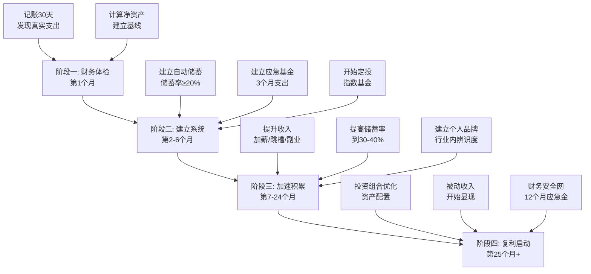

## 最终总结：20-30岁积累期的全景复盘与行动蓝图

本节是实战案例部分的收官之作。前面七个案例分别展示了不同起点、不同路径的20-30岁积累故事——程序员的职业跃迁、月光族的财务自救、斜杠青年的多元收入、小镇青年的逆袭、创业失败后的东山再起、从零开始的投资之路、副业从0到月入过万。本节将这些分散的故事提炼为可复用的规律、可操作的框架、可避免的陷阱，为读者提供一份完整的"积累期行动指南"。

### 一、七个案例的全景对比

先用一张表把七个案例的核心数据拉齐，让读者一眼看出不同路径的共性和差异：

| 案例 | 起点 | 核心策略 | 时间跨度 | 最终成果 | 关键转折点 |
|------|------|----------|----------|----------|------------|
| 程序员 | 月薪3000元 | 技术深耕+跳槽杠杆 | 5年 | 年薪50万 | 第3年跳槽到大厂 |
| 月光族 | 月入6000存0 | 记账→预算→强制储蓄 | 18个月 | 存下10万应急金 | 第1个月记账发现"隐形消费"1500元 |
| 斜杠青年 | 月薪8000元 | 主业+副业双线并行 | 3年 | 月入2.5万（主业1.5万+副业1万） | 副业收入首次超过主业的30% |
| 小镇青年 | 月薪4000元 | 技能迁移+城市跃迁 | 4年 | 月入1.8万 | 从小城市搬到一线城市 |
| 创业失败者 | 负债30万 | 先还债再积累，低风险重启 | 3年 | 净资产转正，月入2万 | 接受"先打工还债"而非再次创业 |
| 投资新手 | 零投资经验 | 定投指数基金+持续学习 | 5年 | 投资资产50万 | 第一次经历市场暴跌没有赎回 |
| 副业达人 | 月入0 | 需求验证→最小可行产品→规模化 | 2年 | 副业月入1.2万 | 第一个付费客户 |

### 二、从案例中提炼的六条核心规律

#### 规律一：起点不决定终点，但行动决定轨迹

七个案例的起点差异巨大——有人月薪3000，有人负债30万，有人还是大学生。但最终结果与起点的相关性远低于与"开始行动的时间点"的相关性。

**数据佐证：** 月光族小周从月入6000到净资产40万用了5年；程序员小李从月薪3000到年薪50万也用了5年。起点差一倍，终点在同一量级。区别在于小周晚了1年才开始行动——那1年的差距体现在复利上，按年化8%计算，大约损失了3.5万元的潜在收益。

**实操意义：** 不要因为"现在钱太少"而推迟开始。月投500元和月投5000元，在建立投资纪律这个维度上是等价的。先建立系统，再逐步加码。

#### 规律二：收入增长有明确的阶梯模型

七个案例的收入增长路径呈现出高度相似的阶梯模式，而非线性增长：


每个"跳跃"都对应一个关键事件：第一次加薪、第一次跳槽、第一笔副业收入、第一次投资收益超过工资涨幅。理解这个阶梯模型的意义在于：**当你处于平台期时，不要焦虑，这是在为下一次跳跃蓄力。**

**收入增长的典型时间表：**

| 阶段 | 时间 | 月收入区间 | 核心动作 | 常见陷阱 |
|------|------|-----------|----------|----------|
| 学习期 | 0-12个月 | 3000-6000元 | 技能积累、建立信用 | 急于求成，频繁跳槽 |
| 突破期 | 12-24个月 | 6000-12000元 | 争取升职或跳槽加薪 | 满足于加薪，停止学习 |
| 平台期 | 24-36个月 | 12000-15000元 | 深耕专业、发展副业 | 消费升级吃掉涨幅 |
| 二次突破 | 36-60个月 | 15000-25000元 | 副业规模化或管理晋升 | 精力分散、两头不着 |
| 加速期 | 60个月+ | 25000元+ | 投资收益叠加、被动收入 | 过度自信、忽视风控 |

#### 规律三：储蓄率比收入绝对值更重要

这是最容易被忽视但影响最大的规律。用一个对比来说明：

| 人物 | 月收入 | 月储蓄 | 储蓄率 | 5年后净资产（含投资收益） |
|------|--------|--------|--------|--------------------------|
| 高收入月光族 | 20000元 | 0元 | 0% | 约0元 |
| 中等收入储蓄者 | 10000元 | 3000元 | 30% | 约22万元 |
| 低收入高储蓄率者 | 6000元 | 2400元 | 40% | 约17.6万元 |

高收入月光族的净资产为零，而月薪仅6000元但储蓄率40%的人，5年后拥有17.6万元。**储蓄率是积累期最核心的指标，没有之一。**

**储蓄率的分级目标：**

- **及格线：20%** —— 月入5000存1000，月入10000存2000。这是最低要求，低于这个比例基本不可能在30岁前建立有意义的资产。
- **良好线：30%** —— 需要对消费结构做优化，减少非必要支出。月入10000存3000，5年后约22万。
- **优秀线：40%+** —— 需要同时做到控制支出和提升收入。月入10000存4000，5年后约29.4万。
- **极限线：50%+** —— 通常需要较低的生活成本（如住在家里、没有房租）或较高的收入。适合有特殊条件的人。

#### 规律四：复利效应在"非金钱领域"同样成立

复利不只是投资概念。在七个案例中，至少有四个领域存在明显的复利效应：

**技能复利：** 程序员小李前3年学的技术，在第4-5年产生了"技能复利"——他不再需要花时间学习基础内容，可以把全部精力投入到高价值的工作中。这类似于投资中"本金越大，收益越高"的逻辑。

**人脉复利：** 斜杠青年的前10个客户都是靠个人关系获取的，但到了第30个客户时，80%的新客户来自老客户的推荐。人脉网络的价值与节点数量的平方成正比（梅特卡夫定律）。

**品牌复利：** 副业达人在知乎写了50篇文章后，开始收到品牌合作邀请。内容的积累产生了"被动获客"效果——写过的每篇文章都在24小时不间断地为他带来流量和机会。

**知识复利：** 投资新手在前2年学到的金融知识，让他在第3年的投资决策中避免了至少3个重大错误（追涨杀跌、集中投资、忽视费率）。知识的积累降低了未来犯错的概率。

#### 规律五：失败是积累期最有价值的资产

创业失败案例（小王负债30万）表面上看是"负面案例"，但实际上他后来的逆袭速度比其他案例更快。原因在于：

1. **失败建立了风险认知的"免疫系统"。** 经历过创业失败的人，对风险的判断比从未失败过的人准确得多。小王在第二次创业时，避开了第一次犯的5个关键错误（过度乐观的财务预测、忽视现金流、合伙人选择草率、没有止损线、过早扩张）。
2. **失败是最好的"认知升级"。** 小王说："第一次创业失败让我明白，商业的本质是现金流，不是创意。"这种认知在书本上读100遍也不会真正理解，只有亲身经历过才能刻入骨髓。
3. **失败降低了"机会成本焦虑"。** 很多人不敢创业是因为害怕失败。但已经失败过一次的人反而更从容——他知道最坏的结果是什么，也知道如何从最坏的结果中恢复。

**关键前提：** 失败要成为"资产"，必须满足一个条件——**你从失败中提取了教训，而不是重复了错误。** 如果小王在第一次创业失败后立刻借钱再创业，那失败就是纯粹的负债。

#### 规律六：系统比意志力可靠100倍

七个案例中，所有成功者都建立了某种"自动化系统"：

- **自动化储蓄：** 工资到账当天自动转入储蓄/投资账户（月光族小周的做法）
- **自动化投资：** 每月15日自动定投指数基金（投资新手的做法）
- **自动化学习：** 每天固定2小时学习时间，雷打不动（程序员的做法）
- **自动化记账：** 所有消费自动记录到记账App，每周日复盘（月光族的做法）
- **自动化获客：** 每周发布1篇专业文章，持续6个月（副业达人的做法）

**为什么系统比意志力可靠？** 行为心理学研究表明，意志力是有限资源——每天的决策会消耗意志力（决策疲劳），到了晚上你更难抵抗诱惑。但自动化系统不依赖意志力，它在你"不想做"的时候依然在运行。正如投资新手所说："我定投了3年，中间有好几个月我根本没看账户。如果靠我自己每次手动买入，我肯定在市场暴跌时停止了。"

### 三、20-30岁积累期的完整行动框架

基于七个案例的共性，提炼出一个四阶段行动框架：



#### 阶段一：财务体检（第1个月）

**目标：** 建立对自己财务状况的精确了解。

**步骤1：连续记账30天**

使用记账App（推荐随手记、MoneyWiz或YNAB），记录每一笔支出，无论金额大小。30天后，你大概率会发现至少1000-2000元的"隐形消费"——那些你不记得花过、但确实花掉了的钱。

**步骤2：计算净资产**

```text
净资产 = 资产 - 负债

资产清单：
- 现金及银行存款
- 投资账户余额
- 公积金余额
- 其他可变现资产

负债清单：
- 信用卡欠款
- 花呗/借呗余额
- 学生贷款
- 其他借款
```

**步骤3：计算三个关键比率**

| 比率 | 公式 | 健康值 | 警戒值 |
|------|------|--------|--------|
| 储蓄率 | (收入-支出)/收入 | ≥20% | <10% |
| 负债率 | 总负债/总资产 | <30% | >50% |
| 应急比 | 应急资金/月支出 | ≥3个月 | <1个月 |

#### 阶段二：建立系统（第2-6个月）

**目标：** 搭建自动化的财务管理系统，让积累变成"默认行为"。

**步骤1：建立"三账户"体系**

```text
工资账户（收入进入）
  │
  ├──→ 储蓄账户（自动转入20-30%）
  │     ├── 应急基金（目标：3个月支出）
  │     └── 投资账户（应急基金满后开始）
  │
  └──→ 消费账户（剩余70-80%）
        ├── 固定支出（房租、水电、交通）
        └── 可变支出（餐饮、娱乐、购物）
```

**步骤2：建立应急基金**

应急基金是积累期的"安全气囊"。目标是3-6个月的必要支出。放在货币基金或银行活期中，随时可取，不追求收益。

| 月支出 | 3个月应急金 | 6个月应急金 |
|--------|------------|------------|
| 3000元 | 9000元 | 18000元 |
| 5000元 | 15000元 | 30000元 |
| 8000元 | 24000元 | 48000元 |

**步骤3：开始第一笔定投**

选择一只宽基指数基金（沪深300或中证500），设置每月自动定投。金额不重要，重要的是**开始**。建议从月收入的5-10%开始，后续逐步增加。

#### 阶段三：加速积累（第7-24个月）

**目标：** 通过提升收入和优化支出来加速净资产增长。

**收入提升的五条路径（按推荐优先级排序）：**

| 路径 | 难度 | 周期 | 收益上限 | 适合人群 |
|------|------|------|----------|----------|
| ① 加薪谈判 | ★★☆ | 1-3个月 | 20-50% | 有业绩支撑的职场人 |
| ② 技能变现（副业） | ★★★ | 3-6个月 | 主业收入的50-100% | 有专业技能的人 |
| ③ 跳槽加薪 | ★★★ | 1-6个月 | 30-100% | 有2年+经验的职场人 |
| ④ 管理晋升 | ★★★★ | 1-3年 | 50-200% | 有领导潜力的人 |
| ⑤ 创业 | ★★★★★ | 1-3年 | 无上限 | 有资源和风险承受力的人 |

**支出优化的"三刀法"：**

第一刀砍"无效支出"——那些花了钱但没有带来任何满足感的消费，比如忘记取消的订阅、办了没去的健身卡、买了没穿的衣服。

第二刀砍"低效支出"——那些带来了满足感但可以用更低的成本替代的消费，比如每天30元的外卖可以替换为15元的自制便当。

第三刀砍"延迟支出"——那些你想买但可以等3个月再买的商品。3个月后如果你还想买，说明是真实需求；如果已经忘了，说明是冲动消费。

#### 阶段四：复利启动（第25个月+）

**目标：** 让资产收益开始产生有意义的贡献，逐步减少对劳动收入的依赖。

到这个阶段，你应该已经拥有：

- **6-12个月的应急基金**
- **10-30万的投资资产**（取决于收入和储蓄率）
- **至少一次完整的投资周期经验**（经历过市场涨跌）
- **一个正在增长的副业或个人品牌**

这个阶段的核心策略从"省钱+赚钱"转向"资产配置+被动收入"。具体的投资策略在本书后续章节有详细讨论，这里只给出一个基础的资产配置参考：

| 年龄 | 股票类基金 | 债券类基金 | 货币基金 | 说明 |
|------|-----------|-----------|----------|------|
| 20-25岁 | 70-80% | 10-15% | 10-15% | 用时间换空间，承受波动 |
| 25-28岁 | 60-70% | 15-20% | 10-15% | 逐步降低波动 |
| 28-30岁 | 50-60% | 20-25% | 15-20% | 为30岁后的重大决策做准备 |

### 四、案例背后的典型错误与纠正

七个案例虽然最终都取得了成功，但过程中都犯过错误。这些错误极具代表性：

#### 错误一：收入增长后立即消费升级

**案例表现：** 程序员小李在第一次跳槽加薪50%后，立刻搬进了更贵的公寓、换了新手机、开始频繁聚餐。结果加薪后的储蓄率反而低于加薪前。

**心理机制：** 这是"生活方式通胀"（Lifestyle Inflation）——收入增加时，支出几乎同步增加，导致实际可储蓄金额没有增长。行为经济学称之为"享乐适应"（Hedonic Adaptation）：新公寓带来的快乐在2周后就消退了，但租金是每月都要付的。

**纠正方法：** 采用"加薪冻结"策略——每次加薪后，将涨幅的至少50%自动转入储蓄/投资账户，剩余的才用于改善生活。月薪从8000涨到12000，先把2000元（涨幅的50%）自动转走，剩下的2000元中再分配。

#### 错误二：用"忙"代替"有效"

**案例表现：** 小镇青年在第一年同时做了主业、两个兼职、一个在线课程、还要维护社交账号。结果每个方向都浅尝辄止，没有一个做到位。

**心理机制：** 这是"伪勤奋"——用战术上的忙碌掩盖战略上的模糊。同时做很多事情给人"在进步"的感觉，但实际上分散了精力，导致每个方向都无法突破临界点。

**纠正方法：** 采用"一个主攻+一个辅修"原则。主攻方向投入70%的可支配精力，辅修方向投入30%。每个季度评估一次，如果辅修方向有突破迹象，可以提升为主攻；如果主攻方向遇到瓶颈，可以暂时降低强度但不要放弃。

#### 错误三：忽视"看不见的成本"

**案例表现：** 投资新手在前两年买了5只基金，每只都有申购费和管理费。两年后发现，光是费用就吃掉了约8%的收益——相当于一年多的定投收益被费率吞掉了。

**心理机制：** 人们对显性成本（基金亏损）敏感，但对隐性成本（管理费、申购费、赎回费、频繁交易的摩擦成本）不敏感。1.5%的年管理费看起来很小，但在20年的复利周期中，会吞噬约25%的总收益。

**纠正方法：** 选择费率低的指数基金（管理费0.15-0.5%），避免频繁交易，优先选择C类份额（适合持有期较短）或A类份额（适合长期持有）。每半年检查一次投资组合的总费率。

#### 错误四：过早追求"财务自由"

**案例表现：** 斜杠青年在副业收入达到每月5000元时，就想辞掉主业全职做副业。

**心理机制：** "财务自由"是一个被过度浪漫化的概念。很多年轻人把"不上班"当作目标，但忽略了财务自由的真实门槛——按4%法则，你需要年支出×25倍的资产。月支出5000元的人，需要150万的可投资资产才能实现财务自由。副业月入5000距离这个目标还很远。

**纠正方法：** 在主业收入稳定且副业收入超过主业收入50%之前，不要辞职。主业是你的"现金流安全网"，副业是你的"增长引擎"。两者并行是最优策略，而不是二选一。

#### 错误五：把"投资"和"投机"混为一谈

**案例表现：** 投资新手在第2年听朋友推荐买了一只"概念股"，两周内涨了40%，于是追加投资，结果一个月后跌回原点还亏了15%。

**心理机制：** 这是典型的"近因效应"和"确认偏误"——近期的成功经验让人高估自己的判断力，同时只关注支持自己决策的信息（"这只股票还会涨"），忽略反面信息（"它已经涨了40%，估值过高"）。

**纠正方法：** 建立"投资清单"制度。在做任何非定投的投资决策前，必须回答以下问题：

```text
投资决策清单：
□ 我理解这个资产的价值来源吗？
□ 我能承受最坏情况下亏损50%吗？
□ 这个决策是基于研究还是基于情绪？
□ 如果明天跌20%，我会怎么做？
□ 这笔钱是闲钱还是生活必需资金？
□ 我能持有这个资产至少3年吗？

如果任何一个答案是"否"，就不应该投资。
```

### 五、不同起点的个性化路径建议

不是所有人都有相同的起点。以下是针对不同起点人群的个性化建议：

#### 场景一：应届毕业生（月薪3000-5000元）

**核心策略：** 先活下来，再活得好。

- 第1年：储蓄率目标15-20%，重点投资自己的技能
- 第2年：争取第一次加薪或跳槽，储蓄率提升到25%
- 第3年：开始定投，建立副业意识
- 5年目标：月入过万，净资产20万+

#### 场景二：工作2-3年的职场人（月薪8000-15000元）

**核心策略：** 打破平台期，建立第二曲线。

- 第1年：优化支出结构，储蓄率提升到30%
- 第2年：发展副业或争取管理岗位
- 第3年：副业收入稳定化，开始系统投资
- 5年目标：月入2万+，净资产50万+

#### 场景三：月光族（任何收入水平）

**核心策略：** 先止血，再造血。

- 第1个月：记账，找到"出血点"
- 第2-3个月：砍掉无效支出，储蓄率从0提升到15%
- 第4-6个月：建立应急基金（3个月支出）
- 第7-12个月：开始定投，储蓄率提升到25%
- 5年目标：净资产30万+

#### 场景四：有负债的人

**核心策略：** 先还债，后积累。还债也是一种"投资"——年化收益等于负债利率。

- 优先还高息债（信用卡分期、网贷），利率>10%的债务必须在12个月内清零
- 低息债（房贷、学贷）可以按期还款，不急于提前还清
- 还债期间同步建立最小应急基金（1个月支出），避免"还债→突发支出→再借债"的恶性循环
- 负债清零后，将原来的还款金额全部转入储蓄/投资

#### 场景五：小城市/小镇青年

**核心策略：** 技能先行，城市跃迁。

- 先在线上建立技能和人脉（不受地域限制）
- 积累1-2年的经验和存款后，考虑搬到一线城市或新一线城市
- 搬迁前确保：有明确的工作机会、有3个月的应急金、有可落脚的住处
- 城市跃迁的收入提升通常是30-100%，但要扣除更高的生活成本

### 六、30天快速启动清单

如果你读完了所有案例和分析，但还没开始行动，这是你的"30天启动计划"：

**第1周：认知启动**

| 天数 | 任务 | 预计耗时 | 完成标志 |
|------|------|----------|----------|
| 第1天 | 下载记账App，开始记录每一笔支出 | 10分钟 | App安装完成，记录了今天的支出 |
| 第2天 | 计算当前净资产（资产-负债） | 30分钟 | 得到一个数字，写在纸上 |
| 第3天 | 列出所有固定支出（房租、水电、保险等） | 20分钟 | 完成固定支出清单 |
| 第4天 | 列出所有订阅服务，取消不需要的 | 30分钟 | 至少取消1个订阅 |
| 第5天 | 计算本月储蓄率 | 10分钟 | 得到一个百分比 |
| 第6-7天 | 回顾本周记账数据，找出3个最大的"意外支出" | 30分钟 | 识别出3个隐形消费 |

**第2周：系统搭建**

| 天数 | 任务 | 预计耗时 | 完成标志 |
|------|------|----------|----------|
| 第8天 | 开设一个专用储蓄账户（与日常消费账户分开） | 1小时 | 账户开通 |
| 第9天 | 设置工资日自动转账（收入的20%转到储蓄账户） | 15分钟 | 自动转账设置完成 |
| 第10天 | 计算应急基金目标（3个月×月必要支出） | 10分钟 | 得到目标金额 |
| 第11天 | 研究2-3只宽基指数基金（沪深300/中证500） | 1小时 | 记录基金代码和费率 |
| 第12天 | 设置基金定投（从收入的5%开始） | 30分钟 | 定投计划设置完成 |
| 第13-14天 | 制定下个月的预算（按"50-30-20"法则：50%必要支出、30%个人消费、20%储蓄投资） | 1小时 | 书面预算完成 |

**第3周：收入探索**

| 天数 | 任务 | 预计耗时 | 完成标志 |
|------|------|----------|----------|
| 第15天 | 列出自己的3个核心技能 | 30分钟 | 技能清单 |
| 第16天 | 调研这些技能的市场价值（招聘网站、自由职业平台） | 1小时 | 了解市场行情 |
| 第17天 | 找到1-2个可以尝试的副业方向 | 1小时 | 副业方向清单 |
| 第18天 | 了解本公司的加薪机制和时间窗口 | 30分钟 | 知道下次加薪的时间 |
| 第19天 | 列出3个可以提升核心竞争力的学习资源 | 30分钟 | 学习计划 |
| 第20-21天 | 选择一个副业方向，完成最小可行测试（比如发布第一篇内容、接第一单小活） | 2-4小时 | 完成第一步行动 |

**第4周：复盘与优化**

| 天数 | 任务 | 预计耗时 | 完成标志 |
|------|------|----------|----------|
| 第22天 | 回顾本月记账数据，计算实际储蓄率 | 30分钟 | 与第5天的储蓄率对比 |
| 第23天 | 评估副业方向的可行性（是否值得继续） | 30分钟 | 做出去留决定 |
| 第24天 | 设置下个月的预算调整 | 30分钟 | 更新预算 |
| 第25天 | 阅读1本投资入门书籍的前3章 | 2小时 | 开始学习 |
| 第26天 | 检查基金定投是否正常执行 | 10分钟 | 确认定投成功 |
| 第27天 | 列出本月最大的3个收获和3个教训 | 30分钟 | 书面记录 |
| 第28天 | 设定下个月的3个具体目标 | 30分钟 | 目标清单 |
| 第29天 | 找到一个可以互相监督的伙伴（朋友/社群） | 1小时 | 建立监督机制 |
| 第30天 | 写一封给6个月后自己的信，记录当前状态和期望 | 30分钟 | 信件完成 |

### 七、积累期的终极认知：你正在投资的不只是金钱

回到本章概览中提出的问题：为什么20-30岁这十年如此重要？

七个案例给出的答案是：**这十年你投资的不只是金钱，而是整个人生的"操作系统"。**

- 你建立的**储蓄习惯**会在未来30年持续产生复利
- 你培养的**投资纪律**会让你在每一次市场波动中保持理性
- 你积累的**专业技能**会成为你未来收入增长的引擎
- 你构建的**人脉网络**会在关键时刻为你打开意想不到的门
- 你打造的**个人品牌**会让机会主动找上门
- 你经历的**失败教训**会成为你最好的决策顾问

这些东西加在一起，就是你的"人生操作系统"。20-30岁是安装和调试这个系统的最佳窗口期——错过了这个窗口，不是不能装，而是安装成本会指数级上升，而且很多组件会变成"补丁"而非"原生系统"。

正如应届毕业生小林在3年后的总结："如果让我回到22岁重新开始，我不会改变大的方向，但会早6个月开始记账，早1年开始定投，早2年开始建立个人品牌。每早一步，后面的复利就多一层。"

这就是积累期的终极真相：**不是你做了什么决定了你的未来，而是你多早开始做了那些正确的事。**
