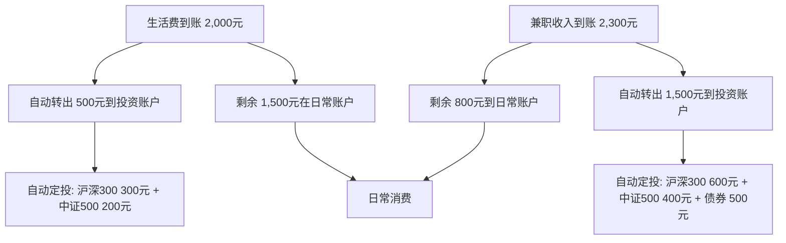

## 五、20-30岁积累期的深度案例

前面的案例展示了不同类型年轻人的积累路径，本节将深入剖析三个更具代表性的深度案例——从月光族逆袭、应届毕业生的系统规划、到大学生的理财启蒙——通过完整的决策链条、数据追踪和心理变化，呈现积累期财富增长的全貌。

每个案例不仅记录"做了什么"，更深入分析"为什么这样做""遇到什么阻力""如何克服"，让读者能从中找到与自己处境最相似的参照点，并直接复制可执行的方法。

---

### 案例四：从月光族到百万存款——一个设计师的6年财务重建

#### 背景与初始画像

小周，24岁，美术学院毕业后进入一家广告公司做平面设计师。和大多数刚毕业的年轻人一样，他的消费模式是"有多少花多少"——甚至在花呗和信用卡的加持下，"花的比赚的还多"。

**初始财务全景**：

| 项目 | 金额（元/月） | 占比 | 备注 |
|------|-------------|------|------|
| 税后工资 | 6,000 | 100% | 五险一金后实发 |
| 房租 | 1,500 | 25% | 合租单间，距公司地铁30分钟 |
| 餐饮 | 2,000 | 33% | 外卖为主，奶茶每天1杯，周末聚餐 |
| 交通 | 300 | 5% | 地铁+偶尔打车 |
| 购物 | 1,500 | 25% | 衣服、数码产品、盲盒 |
| 娱乐 | 700 | 12% | 游戏充值、电影、KTV |
| 其他 | 200 | 3% | 杂项 |
| **月储蓄** | **-200** | **-3%** | **实际在透支** |

关键问题：小周的月储蓄为负数。他靠花呗和信用卡维持消费，每月最低还款约800元，信用卡余额在6个月后累积到了4,800元。这已经是一个典型的"消费陷阱"——用未来的钱为今天的享受买单。

#### 第一阶段：觉醒——记账揭开真相（第1-2个月）

小周的转折点来自一次意外。他想买一台新显示器（3,500元），翻遍银行卡发现余额不到500元，而下个月的工资还要再等20天。那一刻的窘迫感让他开始反思："我的钱到底花到哪里去了？"

**记账工具选择**：小周使用了「随手记」APP（同类可选：钱迹、MoneyThings、MoneyWiz），开始了为期30天的全量记账。

**记账发现的真相**：

经过一个月的精确记录，小周发现自己每月的"隐形消费"高达1,500元，具体构成如下：

| 隐形消费项 | 月均金额（元） | 触发场景 | 心理机制 |
|-----------|--------------|---------|---------|
| 奶茶/咖啡 | 300 | 下午犯困、路过门店 | 习惯性消费，单次金额小导致感知钝化 |
| 冲动购物 | 500 | 深夜刷电商、直播间 | 锚定效应+限时折扣制造紧迫感 |
| 不必要订阅 | 200 | 视频会员、App会员 | 自动续费导致"温水煮青蛙" |
| 打车 | 500 | 下雨天、起晚了 | 即时满足战胜延迟满足 |

**记账的心理学价值**：行为经济学中的"心理账户"理论（Richard Thaler）指出，人们对金钱的感知是非理性的。记账的本质是将分散在不同"心理账户"中的消费统一到一个账户中，从而恢复理性判断。小周在记账前觉得"一杯奶茶才15块"，记账后发现"每月奶茶300块，一年就是3,600块——够买一台iPad了"。

#### 第二阶段：止血——制定预算并执行（第3-6个月）

**预算制定原则**：小周采用的是"50-30-20"法则的变体。原版是50%必要支出、30%个人消费、20%储蓄，但他根据自己的一线城市生活成本做了调整：

```text
调整后的预算框架（月收入6,000元）：

必要支出（55%）：3,300元
├── 房租：1,500元（不变，已是最优方案）
├── 餐饮：1,200元（自己做饭为主，偶尔外卖）
├── 交通：200元（地铁+公交，提前出门避免打车）
└── 通讯+日用品：400元

个人消费（15%）：900元
├── 购物：500元（每月限额，超额转入下月）
├── 娱乐：300元（控制频次）
└── 学习：100元（在线课程/书籍）

储蓄与投资（30%）：1,800元
├── 应急储备：500元（优先建立3个月应急金）
├── 投资定投：800元（指数基金）
└── 还债：500元（清理花呗/信用卡余额）
```

**执行中的关键技巧**：

1. **发工资日自动转账**：设置银行自动转账，工资到账当天即转1,800元到专用储蓄账户。行为经济学研究表明，"默认选项"的力量远大于"自律"——把储蓄变成自动行为，而非需要意志力的决定。

2. **信封法控制消费**：将个人消费的900元转入一个独立的电子钱包（如微信零钱），当这个钱包余额归零时，本月消费额度用尽，不再从主账户转钱。

3. **24小时冷静期规则**：任何超过100元的非必需消费，加入购物车后等待24小时再决定。小周发现，大约60%的冲动购物在24小时后会被取消。

4. **订阅清理**：逐一审查所有自动续费项目，取消了视频会员（改用免费资源）、云存储（改用本地备份）、修图App会员（用免费替代品），每月节省约200元。

**第6个月状态**：

| 项目 | 金额 | 变化 |
|------|------|------|
| 月储蓄 | 1,800元 | 从-200到+1,800 |
| 花呗余额 | 0元 | 已全部还清 |
| 应急储备金 | 3,000元 | 初步建立 |
| 投资账户 | 4,800元 | 开始定投 |

#### 第三阶段：增收——职业发展与副业开拓（第7-24个月）

小周意识到，仅靠节流，天花板很低。他的收入增长路径分两条线并行：

**主线——职场晋升**：

| 时间点 | 动作 | 收入变化 | 关键决策 |
|--------|------|---------|---------|
| 第12个月 | 获年度优秀员工，主动谈加薪 | 6,000→7,200元（+20%） | 准备了作品集和量化贡献数据 |
| 第18个月 | 跳槽到更好的公司 | 7,200→9,000元（+25%） | 通过行业人脉获得内推机会 |
| 第24个月 | 晋升为资深设计师 | 9,000→11,000元（+22%） | 管理2名初级设计师 |

**副线——副业收入**：

小周利用设计师的专业技能，在以下渠道开拓副业：

| 副业渠道 | 月均收入 | 时间投入 | 启动成本 |
|---------|---------|---------|---------|
| 猪八戒/站酷接单 | 2,000元 | 每周8-10小时 | 0元（已有技能） |
| 设计模板售卖（千图网/包图网） | 800元 | 前期集中制作，后期被动收入 | 0元 |
| 小红书设计教程 | 500元 | 每周3小时 | 0元 |
| **副业合计** | **3,300元** | **每周12-15小时** | **0元** |

**第24个月收入结构**：

```text
总收入：14,300元/月
├── 主业：11,000元（77%）
├── 副业：3,300元（23%）
│
支出：5,500元（38%）
├── 生活必要：4,200元
├── 个人消费：1,300元（收入提升后适度提高）
│
储蓄+投资：8,800元（62%）
├── 定投基金：5,000元
├── 应急储备：1,000元（已达标，转为投资）
├── 其他投资：2,800元
```

#### 第四阶段：投资——从入门到系统化（第25-72个月）

小周的投资之路并非一帆风顺，他的经历可以帮助新手避开常见的坑：

**投资进化路线**：

| 阶段 | 时间 | 策略 | 年化收益 | 教训 |
|------|------|------|---------|------|
| 入门期 | 第7-12个月 | 纯货币基金（余额宝） | 2.5% | 安全但收益太低，跑不赢通胀 |
| 学习期 | 第13-24个月 | 沪深300指数定投 | 约8%（含波动） | 第一次经历-15%的回撤，差点止损 |
| 成长期 | 第25-48个月 | 指数基金+债券基金（7:3） | 约10% | 学会了资产配置的重要性 |
| 成熟期 | 第49-72个月 | 指数基金+个股+REITs | 约12% | 开始关注资产多元化 |

**定投的数学力量**：

小周从第7个月开始定投，每月2,000元起步，后期逐步增加到5,000元。以年化收益10%计算：

| 年限 | 累计投入 | 资产总值 | 收益金额 | 收益率 |
|------|---------|---------|---------|--------|
| 第1年 | 24,000 | 25,320 | 1,320 | 5.5% |
| 第2年 | 72,000 | 79,860 | 7,860 | 10.9% |
| 第3年 | 144,000 | 168,720 | 24,720 | 17.2% |
| 第5年 | 288,000 | 372,600 | 84,600 | 29.4% |

到第5年末（即小周29岁时），仅投资资产就达到了约37万元。加上工资储蓄、副业收入和应急储备金，总净资产突破40万元。

**关键投资纪律**：

1. **定投不择时**：无论市场涨跌，每月固定日期扣款。小周在2024年市场低迷时坚持定投，反而获得了更低的持仓成本。
2. **下跌加仓**：当指数跌幅超过20%时，额外投入一笔资金（使用应急储备金之外的闲钱）。
3. **年度再平衡**：每年12月底检查一次资产比例，偏离目标超过5%时调整。
4. **绝不用杠杆**：小周拒绝了同事推荐的"融资炒股"建议，避免了爆仓风险。

#### 6年成果总览

| 指标 | 第0个月 | 第24个月 | 第72个月（6年） |
|------|--------|---------|---------------|
| 月收入 | 6,000元 | 14,300元 | 18,000元 |
| 月储蓄率 | -3% | 62% | 55% |
| 应急储备金 | 0 | 10,000元 | 50,000元 |
| 投资资产 | 0 | 35,000元 | 420,000元 |
| 被动收入 | 0 | 300元/月 | 3,500元/月 |
| **总净资产** | **-4,800元** | **45,000元** | **470,000元** |

#### 核心启示与可复制的方法论

1. **记账是觉醒的起点**：不是为了记流水账，而是为了看清消费模式中的"黑洞"。建议至少精确记账30天再制定预算。
2. **自动化是意志力的替代品**：自动转账、自动定投、24小时冷静期——用系统代替自律，成功率提高3倍以上。
3. **收入增长和储蓄率提升要同步**：只节流不增收会撞上天花板，只增收不节流会陷入"生活方式膨胀"。
4. **投资越早开始越好**：复利需要时间发酵。即使每月只投500元，6年后的回报也远超"等有钱了再投"。
5. **副业要基于主业技能**：设计师接设计单、程序员做外包、写作者做自媒体——边际成本最低的副业模式。

---

### 案例五：应届毕业生的3年逆袭——从月薪5,000到年薪20万的系统规划

#### 背景与起点分析

小林，22岁，普通二本院校计算机专业毕业。在校期间没有实习经验，没有拿得出手的项目，唯一的"优势"是对编程有真实的兴趣。他的第一份工作是一家中小型软件公司的初级开发岗位。

**初始状态诊断**：

| 维度 | 状态 | 评级 | 对标同龄人 |
|------|------|------|-----------|
| 学历 | 普通二本 | 中等偏下 | 985/211占比约15% |
| 技能 | 基础编程能力，无框架经验 | 入门级 | 能干活但缺乏竞争力 |
| 项目经验 | 课程设计2个，无实习 | 低于平均 | 大厂实习是标配 |
| 人脉 | 无行业人脉 | 零基础 | 需要从零建立 |
| 月薪 | 5,000元 | 中位数 | 2024年应届生平均约6,500元 |

小林面临的核心矛盾：**起点低于平均水平，但需要在3年内实现大幅跃迁**。这意味着他不能走常规路径——必须在每一步都做到极致。

#### 第一年：扎根期（22-23岁）——构建技术护城河

**核心策略**：用一年时间把自己从"普通开发者"变成"业务骨干"，为后续的跳槽或晋升积累筹码。

**时间分配规划**：

```text
工作日时间表（非加班日）：
08:00-09:00  通勤（听技术播客）
09:00-12:00  核心工作时间（处理最重要的任务）
12:00-13:00  午餐+午休
13:00-18:00  工作+主动承担额外任务
18:00-19:00  通勤（听技术播客）
19:00-20:00  晚餐+休息
20:00-22:00  系统学习（技术深度+广度）
22:00-22:30  复盘当天+规划明天

周末时间安排：
周六上午：集中学习新技术（3小时）
周六下午：做个人项目或开源贡献（3小时）
周日：完全休息，充电恢复
```

**收入与储蓄规划**：

| 项目 | 金额（元/月） | 策略 |
|------|-------------|------|
| 税后工资 | 5,000 | - |
| 房租 | 1,200 | 合租，距公司步行15分钟（省交通费和时间） |
| 餐饮 | 1,000 | 公司食堂+自己做饭 |
| 其他支出 | 1,300 | 严格控制在工资的26%以内 |
| 储蓄 | 1,500 | 30%储蓄率 |
| 学习投资 | 500 | 技术课程、书籍、认证考试费 |

**关键行动清单**：

1. **技术能力**：
   - 精通工作中使用的核心框架，阅读源码理解底层原理
   - 每周写一篇技术博客，记录学习心得和踩坑经验
   - 参与1个开源项目，即使是修复文档也行——目的是理解协作流程
   - 考取1个行业认证（如AWS认证、PMP等，视行业而定）

2. **职场表现**：
   - 主动承担跨部门协作任务，扩大可见度
   - 每周向leader做一次工作汇报，展示成果和思考
   - 遇到问题先尝试解决30分钟再求助，培养独立解决问题的能力

3. **人脉建设**：
   - 参加2-3个行业技术meetup/沙龙（线上或线下）
   - 在技术社区（掘金、SegmentFault、GitHub）活跃发言
   - 认识至少10位同行业的同行，建立初步联系

**第一年成果**：

| 指标 | 年初 | 年末 | 变化 |
|------|------|------|------|
| 月薪 | 5,000元 | 6,500元 | +30%（年度调薪） |
| 技术栈 | 1个框架 | 3个框架+1个云平台 | 显著扩展 |
| 技术博客 | 0篇 | 48篇 | 建立了输出习惯 |
| GitHub Star | 0 | 150+ | 开源贡献被认可 |
| 行业人脉 | 0人 | 15人 | 初步建立 |
| 年储蓄 | - | 18,000元 | - |

#### 第二年：成长期（23-24岁）——建立差异化竞争力

**核心策略**：从"能干活的人"变成"不可替代的人"——通过建立个人品牌和深化专业领域，大幅提升市场价值。

**薪资跳跃路径**：

小林在第一年末开始准备跳槽。他的策略不是海投简历，而是通过已建立的人脉网络获取内推机会：

| 时间 | 动作 | 结果 |
|------|------|------|
| 第12个月 | 更新简历，突出项目成果和量化数据 | 简历通过率从5%提升到25% |
| 第13个月 | 通过技术社区认识的朋友获得3个内推 | 获得3个面试机会 |
| 第14个月 | 面试5家公司（含2个内推+3个自投） | 收到2个offer |
| 第15个月 | 入职新公司，薪资8,500元 | +31%涨幅 |

**个人品牌建设**：

| 渠道 | 内容策略 | 投入时间 | 效果 |
|------|---------|---------|------|
| 技术博客 | 深度技术文章，每周1篇 | 4小时/周 | 月均3,000阅读量 |
| GitHub | 开源工具/库 | 6小时/周 | 300+ Star |
| 掘金/知乎 | 技术问答+专栏 | 2小时/周 | 500+关注者 |
| 行业分享 | 技术meetup演讲 | 每月1次 | 建立专家形象 |

**投资进阶**：

第二年，小林的投资策略从纯定投升级为"核心+卫星"模式：

```text
投资组合（月投3,000元）：
├── 核心仓位（70%）：沪深300+中证500指数基金定投
│   └── 每月2,100元，长期持有不动
├── 卫星仓位（20%）：行业主题基金（科技/新能源）
│   └── 每月600元，根据估值调整
└── 学习仓位（10%）：模拟投资（股票/可转债）
    └── 每月300元，用于学习，亏完就停
```

**第二年成果**：

| 指标 | 年初 | 年末 | 变化 |
|------|------|------|------|
| 月薪 | 6,500元 | 8,500元 | +31%（跳槽） |
| 副业收入 | 0 | 2,000元/月 | 技术咨询+文章稿费 |
| 投资资产 | 18,000元 | 65,000元 | 含收益+新增投入 |
| 行业人脉 | 15人 | 40人 | 质量提升 |
| 年收入 | 78,000元 | 126,000元 | +62% |

#### 第三年：突破期（24-25岁）——从执行者到领导者

**核心策略**：完成从"个人贡献者"到"团队领导者"的身份转变，实现收入的非线性增长。

**晋升路径**：

小林在新公司用12个月证明了自己，核心动作包括：

1. **主动承担技术难题**：接手了一个积压3个月的技术债项目，用2个月完成重构，系统性能提升40%。
2. **带领新人**：主动申请带2名应届生，展现了领导潜力。
3. **跨团队协作**：推动了一个跨部门的技术标准化项目，扩大了影响力。
4. **向上管理**：每月给直属leader和部门总监发一份工作成果总结，确保自己的贡献被看见。

**第30个月**，小林获得了晋升，从高级开发工程师升为技术组长，月薪从8,500元涨到12,000元（+41%），同时获得了年终奖3个月（约36,000元）。

**收入全景（第36个月）**：

```text
年收入结构：
├── 基本工资：12,000 × 12 = 144,000元
├── 年终奖：36,000元（3个月）
├── 副业收入：3,000 × 12 = 36,000元
│   ├── 技术顾问：2,000元/月（为1家小公司兼职技术顾问）
│   └── 课程/文章：1,000元/月（技术平台分成）
│
年收入合计：216,000元
年支出：约84,000元（月均7,000元）
年储蓄+投资：132,000元
储蓄率：61%
```

**3年资产总览**：

| 资产类别 | 金额 | 说明 |
|---------|------|------|
| 指数基金 | 85,000元 | 3年定投+收益 |
| 债券基金 | 25,000元 | 稳健配置 |
| 应急储备金 | 40,000元 | 约5个月支出 |
| 现金 | 15,000元 | 日常流动 |
| **总净资产** | **165,000元** | **从0到16.5万** |

#### 核心启示与可复制的方法论

1. **前3年是复利效应的种子期**：小林在第一年的技术积累，在第二年带来了跳槽的筹码，在第三年带来了晋升的机会——这不是运气，而是前期投入的复利回报。
2. **薪资增长的非线性**：小林3年薪资从5,000到12,000元（+140%），远超平均涨幅。关键驱动因素是"跳槽+晋升+副业"三管齐下。
3. **人脉投资的回报周期**：第一年建立的人脉，在第二年带来了内推机会和副业客户。人脉的价值不在于数量，而在于质量——30个真心认可你能力的人，比300个泛泛之交有用得多。
4. **个人品牌是最高效的求职渠道**：当你的技术文章和开源项目被同行看到时，好机会会主动找上门，而不是你去求别人给机会。
5. **时间管理决定上限**：小林每天下班后投入2小时学习，3年累计投入超过2,000小时——这相当于读了一个"业余硕士"。

---

### 案例六：大学生的理财启蒙——从生活费2,000元到毕业时拥有2万元

#### 背景与特殊性

小陈，20岁，某985大学大三学生，金融学专业。每月生活费2,000元，由父母按月转账。他的案例之所以有参考价值，是因为**大学生没有工资收入，资源极其有限，但恰恰是培养理财习惯的最佳窗口期**。

为什么大学期间是理财启蒙的黄金期？

1. **试错成本极低**：亏100元的教训和亏10万元的教训一样深刻，但前者承受得起。
2. **时间充裕**：没有996的工作压力，有大量时间学习和实践。
3. **消费环境简单**：校园生活成本可控，不会面临房租、养家等刚性支出。
4. **习惯形成期**：20岁养成的习惯会伴随一生，越早建立正确的金钱观越好。

#### 第一步：开源——在不耽误学业的前提下增加收入

小陈分析了自己的资源：

| 资源 | 变现方式 | 月收入 | 时间投入 |
|------|---------|--------|---------|
| 金融专业知识 | 周末家教（高中数学/经济） | 1,500元 | 每周8小时 |
| Excel/PPT技能 | 帮同学/学长做数据整理 | 500元 | 每周3小时 |
| 写作能力 | 校园公众号投稿 | 300元 | 每周2小时 |
| **合计** | | **2,300元** | **每周13小时** |

**时间冲突管理**：小陈将所有兼职集中在周末和工作日晚上，确保不影响课堂学习和考试复习。他的原则是"学业优先，副业是加分项"——GPA始终保持在3.5以上。

#### 第二步：节流——大学生的消费优化

小陈的月支出优化：

| 项目 | 优化前 | 优化后 | 节省方法 |
|------|--------|--------|---------|
| 餐饮 | 1,200元 | 800元 | 以食堂为主（一顿8-12元），减少外卖和聚餐频次 |
| 日用品 | 300元 | 200元 | 囤货选双11，日常用拼多多比价 |
| 娱乐 | 400元 | 200元 | 免费校园活动替代商业娱乐 |
| 学习资料 | 100元 | 50元 | 图书馆+电子版+二手书 |
| **月支出** | **2,000元** | **1,250元** | **节省750元** |

**月度结余**：生活费2,000 + 兼职收入2,300 - 支出1,250 = **3,050元**

#### 第三步：学习——构建理财知识体系

小陈没有急于把所有钱投入市场，而是先花了一个月系统学习：

**推荐阅读清单**（按阅读顺序）：

| 书名 | 作者 | 核心收获 | 适合阶段 |
|------|------|---------|---------|
| 《小狗钱钱》 | 博多·舍费尔 | 建立基本金钱观，理解"鹅与金蛋"的故事 | 零基础入门 |
| 《富爸爸穷爸爸》 | 罗伯特·清崎 | 区分资产和负债，理解现金流 | 观念启蒙 |
| 《指数基金投资指南》 | 银行螺丝钉 | 掌握定投策略和指数基金选择 | 投资入门 |
| 《定投十年财务自由》 | 银行螺丝钉 | 理解长期定投的数学逻辑 | 策略深化 |
| 《漫步华尔街》 | 伯顿·马尔基尔 | 理解市场效率和资产配置 | 进阶理解 |

**免费学习资源**：

| 资源 | 平台 | 内容 | 费用 |
|------|------|------|------|
| 中国大学MOOC | 网易/学堂在线 | 金融学、投资学课程 | 免费 |
| B站 | bilibili | 理财科普UP主（小Lin说、巫师财经等） | 免费 |
| 雪球/且慢 | App | 投资社区，看别人的经验和教训 | 免费 |
| 天天基金/蛋卷基金 | App | 基金数据和分析工具 | 免费 |

#### 第四步：实践——用小资金开始投资

小陈的投资实践遵循"先学后投、小步快跑、边投边学"的原则：

**第一阶段：模拟投资（第1个月）**

使用支付宝/天天基金的模拟组合功能，投入虚拟资金10,000元，配置如下：
- 沪深300指数基金：60%
- 中证500指数基金：25%
- 债券基金：15%

记录每天的盈亏变化和自己的心理反应。一个月后发现：看到亏损会焦虑，看到盈利会想加仓——这让他理解了"情绪是投资最大的敌人"。

**第二阶段：真实小资金定投（第2-6个月）**

| 项目 | 详情 |
|------|------|
| 月定投金额 | 500元 |
| 定投标的 | 沪深300指数基金（选了一只费率最低的） |
| 定投日期 | 每月15日（生活费到账后第3天） |
| 定投方式 | 自动扣款，从不手动干预 |
| 记录方式 | Excel表格，记录每次买入的净值和份额 |

**第三阶段：增加投入（第7-18个月）**

随着对市场的理解和信心增强，小陈逐步增加投资：

```text
投资组合演进：

第7-12个月（月投1,000元）：
├── 沪深300指数基金：500元
├── 中证500指数基金：300元
└── 债券基金：200元

第13-18个月（月投2,000元）：
├── 沪深300指数基金：800元
├── 中证500指数基金：500元
├── 债券基金：400元
└── 货币基金（应急储备）：300元
```

#### 第五步：建立系统——让理财自动化运行

小陈最大的聪明之处在于，他没有依赖意志力，而是建立了一套自动化系统：

**自动化理财流程**：



**记账系统**：使用"钱迹"APP，设置自动分类规则。每周日晚上花10分钟review本周支出，每月初花30分钟做月度总结。

#### 毕业时的成果（2年后）

| 指标 | 大三开学时 | 毕业时 | 变化 |
|------|-----------|--------|------|
| 月收入 | 2,000元（生活费） | 4,300元（生活费+兼职） | +115% |
| 月储蓄 | 0 | 3,050元 | 从0到3,050 |
| 投资资产 | 0 | 14,000元 | 含约1,200元收益 |
| 应急储备金 | 0 | 3,000元 | 约2个月支出 |
| 现金 | 几百元 | 3,000元 | 流动资金 |
| **总净资产** | **约500元** | **20,000元** | **从500到2万** |

**更重要的无形资产**：

1. **理财知识体系**：系统学习了5本投资书籍，理解了资产配置、定投策略、风险管理的核心原理。
2. **投资实操经验**：经历了市场的上涨和下跌，学会了控制情绪、坚持纪律。
3. **记账和预算习惯**：已经内化为日常生活的一部分，不再需要刻意维持。
4. **自动化系统**：一套可持续运行的理财系统，毕业后收入增加时只需调整金额，无需重建流程。
5. **金钱观的成熟**：理解了"延迟满足"和"复利思维"，这比2万元本身更有价值。

#### 核心启示与可复制的方法论

1. **理财越早开始越好，哪怕金额很小**：小陈每月定投500元，2年后也有1.4万元。更重要的是，他用2年时间交完了"新手学费"，毕业后可以直接用成熟的系统管理更大的资金。
2. **大学期间是试错成本最低的窗口**：亏几百元的教训，和工作后亏几万元的教训一样深刻。在大学用小资金踩完所有坑，是性价比最高的投资。
3. **开源和节流同样重要，但开源更有上限**：小陈通过兼职将收入翻了一倍多，而节流的天花板是把生活费降到0——显然开源的潜力更大。
4. **建立系统比依赖意志力更可靠**：自动转账、自动定投、自动记账——这些系统在小陈期末考试忙到没时间看手机时依然正常运行。
5. **同龄人领先2-3年的真正含义**：当同龄人毕业时才开始思考理财，小陈已经有了2年投资经验、成熟的系统和2万元的启动资金。这个差距会随着时间推移不断扩大。

---

### 三个案例的横向对比分析

#### 关键指标对比

| 对比维度 | 小周（月光族逆袭） | 小林（应届生规划） | 小陈（大学生启蒙） |
|---------|-------------------|-------------------|-------------------|
| 起始年龄 | 24岁 | 22岁 | 20岁 |
| 起始月收入 | 6,000元 | 5,000元 | 2,000元（生活费） |
| 起始净资产 | -4,800元（负债） | 0 | 500元 |
| 核心策略 | 止血→增收→投资 | 技能→品牌→晋升 | 开源→学习→定投 |
| 3年后净资产 | 约15万 | 约16.5万 | 约2万 |
| 5年后净资产 | 约40万 | 约50万+ | -（尚未毕业） |
| 最大挑战 | 改变消费习惯 | 提升技术竞争力 | 时间和资金有限 |
| 关键转折点 | 记账发现隐形消费 | 第一次跳槽 | 第一次定投 |

#### 共同的成功模式

尽管三人的起点、路径和目标各不相同，但他们的成功遵循了相同的底层逻辑：


**第一层：觉醒**——三人都是从某个"触发事件"开始改变的（小周买不起显示器、小林看到同事跳槽涨薪、小陈上了一堂理财课）。没有觉醒，就没有行动。

**第二层：止血**——在增收之前，先堵住财务漏洞。小周还清花呗、小林控制支出、小陈优化消费——都是在"止血"。

**第三层：开源**——止血有天花板，开源没有。三人都在主业之外找到了额外收入来源（副业、晋升、兼职）。

**第四层：投资**——当储蓄积累到一定规模后，让钱开始"工作"。三人都选择了指数基金定投作为入门方式。

**第五层：系统**——最关键的一步。将理财行为从"需要意志力维持的活动"变成"自动运行的系统"。

**第六层：复利**——当系统运行足够长时间后，复利效应开始显现。小周6年后的投资收益占总资产的20%以上，这还只是开始。

#### 常见误区警示

| 误区 | 错误做法 | 正确做法 | 案例中的体现 |
|------|---------|---------|------------|
| "等有钱了再理财" | 永远在等 | 用现有资金开始 | 小陈用2,000元生活费起步 |
| "省钱就能致富" | 极端节俭，影响生活质量 | 优化消费结构，而非消灭消费 | 小周的预算保留了娱乐和学习 |
| "投资就是炒股" | 频繁交易，追涨杀跌 | 长期定投指数基金 | 三人都选择了定投策略 |
| "副业影响主业" | 副业投入过多精力 | 主业优先，副业是锦上添花 | 小林的副业基于主业技能 |
| "一夜暴富" | 加杠杆、炒币、赌博 | 慢慢变富，用时间换空间 | 小周拒绝了融资炒股的建议 |
| "年轻人不需要保险" | 忽视风险保障 | 配置基础保险（意外+医疗） | 建议三人都配置百万医疗险 |

#### 风险管理提醒

20-30岁积累期的年轻人容易忽视风险管理。以下是最基本的保障建议：

**必备保险清单**（月均支出约200-400元）：

| 保险类型 | 作用 | 年保费参考 | 优先级 |
|---------|------|-----------|--------|
| 百万医疗险 | 大病住院费用报销 | 200-400元/年 | ★★★★★ |
| 意外险 | 意外伤残/身故保障 | 100-300元/年 | ★★★★★ |
| 定期寿险 | 身故保障（有房贷/家庭责任时） | 500-1,000元/年 | ★★★★ |
| 重疾险 | 确诊即赔，弥补收入损失 | 2,000-5,000元/年 | ★★★ |

**注意**：20多岁买保险是最便宜的，百万医疗险一年只要两三百元，但能覆盖数十万的医疗费用。不要等到身体出问题才想起来——那时候可能已经买不了了。

---

### 实操工具箱

#### 预算模板（月度）

```text
┌─────────────────────────────────────────────┐
│              月度预算表                       │
├─────────────┬──────────┬──────────┬──────────┤
│ 类别         │ 预算金额  │ 实际支出  │ 差异     │
├─────────────┼──────────┼──────────┼──────────┤
│ 固定支出      │          │          │          │
│  ├ 房租      │ ______元 │ ______元 │ ______元 │
│  ├ 水电网    │ ______元 │ ______元 │ ______元 │
│  └ 通讯      │ ______元 │ ______元 │ ______元 │
├─────────────┼──────────┼──────────┼──────────┤
│ 生活支出      │          │          │          │
│  ├ 餐饮      │ ______元 │ ______元 │ ______元 │
│  ├ 交通      │ ______元 │ ______元 │ ______元 │
│  └ 日用品    │ ______元 │ ______元 │ ______元 │
├─────────────┼──────────┼──────────┼──────────┤
│ 个人消费      │          │          │          │
│  ├ 购物      │ ______元 │ ______元 │ ______元 │
│  ├ 娱乐      │ ______元 │ ______元 │ ______元 │
│  └ 学习      │ ______元 │ ______元 │ ______元 │
├─────────────┼──────────┼──────────┼──────────┤
│ 储蓄与投资    │          │          │          │
│  ├ 应急储备  │ ______元 │ ______元 │ ______元 │
│  ├ 基金定投  │ ______元 │ ______元 │ ______元 │
│  └ 其他投资  │ ______元 │ ______元 │ ______元 │
├─────────────┼──────────┼──────────┼──────────┤
│ 合计         │ ______元 │ ______元 │ ______元 │
│ 储蓄率       │          │    ___%  │          │
└─────────────┴──────────┴──────────┴──────────┘
```

#### 收入增长追踪表（年度）

```text
┌───────────────────────────────────────────────────────┐
│                    年度收入追踪                         │
├──────┬──────────┬──────────┬──────────┬──────────────┤
│ 年份  │ 主业收入   │ 副业收入   │ 投资收益   │ 总收入       │
├──────┼──────────┼──────────┼──────────┼──────────────┤
│ 第1年 │ ______元  │ ______元  │ ______元  │ ______元     │
│ 第2年 │ ______元  │ ______元  │ ______元  │ ______元     │
│ 第3年 │ ______元  │ ______元  │ ______元  │ ______元     │
│ 第4年 │ ______元  │ ______元  │ ______元  │ ______元     │
│ 第5年 │ ______元  │ ______元  │ ______元  │ ______元     │
├──────┼──────────┼──────────┼──────────┼──────────────┤
│ 增长率 │ ____%    │ ____%    │ ____%    │ ____%        │
└──────┴──────────┴──────────┴──────────┴──────────────┘
```

#### 投资组合记录表

```text
┌──────────────────────────────────────────────────────────┐
│                    投资组合月度记录                         │
├──────┬──────────┬──────────┬──────────┬──────────────────┤
│ 月份  │ 定投金额   │ 累计投入   │ 账户市值   │ 收益率          │
├──────┼──────────┼──────────┼──────────┼──────────────────┤
│ 1月  │ ______元  │ ______元  │ ______元  │ ____%           │
│ 2月  │ ______元  │ ______元  │ ______元  │ ____%           │
│ ...  │ ...      │ ...      │ ...      │ ...             │
│ 12月 │ ______元  │ ______元  │ ______元  │ ____%           │
└──────┴──────────┴──────────┴──────────┴──────────────────┘
```

---

### FAQ：积累期常见问题

**Q1：月薪3,000元（或更低）也能理财吗？**

能。理财的本质是管理现金流，不是管理大额资金。月薪3,000元，每月存300元（10%储蓄率），一年就是3,600元。加上定投收益，3年后约1.2万元。金额不大，但习惯无价。小陈的案例证明，用生活费2,000元都能在2年积累2万元。

**Q2：花呗/信用卡要不要全部关掉？**

不一定要关，但要改变使用方式。正确做法是：把信用卡当"记账工具"用——每月消费都走信用卡，但**每月全额还款，绝不分期、绝不最低还款**。这样既能享受免息期，又能通过账单自动记录消费。如果你做不到全额还款，那就关掉，用借记卡消费。

**Q3：定投亏了怎么办？**

继续投。定投的核心逻辑就是"下跌时买入更多份额"。2024年A股低迷期坚持定投的人，2025年反弹后收益普遍超过20%。如果你在下跌时停止定投，就等于放弃了"打折买入"的机会。唯一的前提是：你投的是宽基指数基金（如沪深300），而不是单一行业或个股。

**Q4：副业和主业怎么平衡？**

三条原则：
1. 主业的KPI完成度不能因为副业下降
2. 副业时间不超过主业时间的30%（即每周不超过15小时）
3. 如果副业影响了睡眠和健康，立刻缩减

**Q5：什么时候该买房？**

这个问题没有标准答案，但有几个参考指标：
- 首付已有（不靠借款）
- 月供不超过月收入的30%
- 有6个月以上的应急储备金（在付完首付之后）
- 房价收入比在当地处于合理区间

如果以上条件不满足，租房+投资的组合在大多数情况下优于买房。

---

本节通过三个深度案例，完整呈现了20-30岁积累期从觉醒到行动、从止血到开源、从手动到系统的全过程。无论你是月光族、应届毕业生还是在校学生，都能从中找到可以直接复制的方法。记住：**理财不是有钱人的专利，而是每个普通人都应该掌握的生存技能**。你今天开始，永远比明天开始早一天——而那一天的差距，经过复利放大，可能就是未来的数万元。
