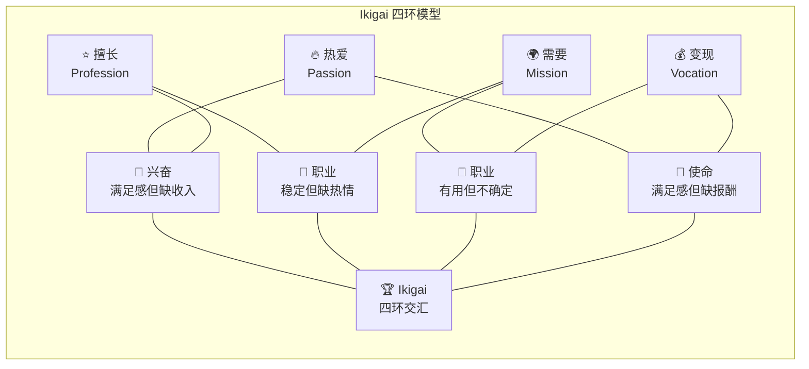
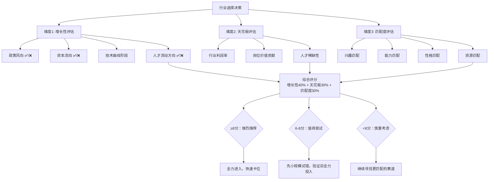

## 一、职业规划：找到你的黄金赛道

职业规划不是一次性的选择，而是一个持续迭代的系统工程。20-30岁这十年，你至少会经历3-5次关键职业决策——选行业、选公司、选岗位、选发展方向、选跳槽时机。每一次决策的质量叠加起来，决定了你30岁时站在什么位置。

本节提供一套完整的职业规划方法论：从自我认知到行业分析，从路径设计到落地执行，从常见误区到进阶策略，帮你系统性地找到并进入属于你的黄金赛道。

### 1.1 自我认知：职业规划的起点

在讨论"选什么行业"之前，必须先回答"我是谁"。缺乏自我认知的职业规划，就像没有地图的导航——你可能跑得很快，但方向是错的。

#### 1.1.1 Ikigai 模型：找到四环交叉点

日本的 Ikigai（生き甲斐）模型是目前最有效的自我定位框架之一，它要求你找到四个圆环的交集：

| 维度 | 核心问题 | 自查方法 |
|------|---------|---------|
| **热爱**（Passion） | 什么事让你废寝忘食？ | 回顾过去一年你主动花时间做的事，不为钱不为名 |
| **擅长**（Profession） | 什么事你做得比大多数人好？ | 收集10个熟人的反馈，问"你觉得我最擅长什么" |
| **需要**（Mission） | 世界需要什么？ | 观察社会痛点、行业缺口、未被满足的需求 |
| **变现**（Vocation） | 什么能让你赚钱？ | 调研市场上有人为之付费的技能和服务 |

四个环的交集处就是你的 Ikigai——既是你热爱的，又是你擅长的，世界需要的，还能养活你的事业方向。



**实操练习**：拿出一张纸，画四个圆环，分别填入你的答案。每个环至少写5条。然后找交集。如果四环交集为空，先找两环交集，再逐步扩展。

#### 1.1.2 能力三核模型

古典在《你的生命有什么可能》中提出的"能力三核"模型，将能力分为三层：

- **知识层**（Knowledge）：你知道什么——学历、证书、行业知识、专业知识
- **技能层**（Skill）：你会做什么——编程、写作、演讲、数据分析、项目管理
- **才干层**（Talent）：你是谁——学习力、创造力、领导力、共情力、抗压力

关键洞察：**知识最容易迁移，技能次之，才干最难被替代**。20多岁应该大量积累知识和技能，同时发现和打磨自己的核心才干。

**自查清单**：

```text
我的知识清单（列10项）：
1. ________  2. ________  3. ________  ...

我的技能清单（列10项）：
1. ________  2. ________  3. ________  ...

我的才干清单（列5项）：
1. ________  2. ________  3. ________  ...

哪些才干是可迁移的（跨行业也能用）？
________

哪些技能是可以快速补强的？
________
```

#### 1.1.3 性格与职业匹配

性格不是决定因素，但确实是重要的参考维度。以下是经过验证的匹配关系：

| 性格特质 | 适合方向 | 不太适合 | 说明 |
|---------|---------|---------|------|
| 外向型（E） | 销售、市场、公关、培训 | 深度研究、独立开发 | 外向型在需要频繁社交的岗位上有天然优势 |
| 内向型（I） | 研究、开发、写作、设计 | 需要大量社交的岗位 | 内向型在需要深度思考的岗位上更出色 |
| 感觉型（S） | 执行、运营、财务、法务 | 需要大量创新的岗位 | 感觉型擅长细节和流程 |
| 直觉型（N） | 战略、产品、创新、创业 | 需要大量重复执行的岗位 | 直觉型擅长模式识别和趋势判断 |
| 思考型（T） | 技术、工程、数据分析 | 需要大量情感劳动的岗位 | 思考型决策更理性 |
| 情感型（F） | 咨询、教育、人力资源 | 需要冷酷决策的岗位 | 情感型更擅长理解他人 |

**重要提醒**：性格测试是参考，不是牢笼。很多优秀的职业人士恰恰是"反类型"的——内向的销售冠军、感性的程序员、直觉型的财务总监。关键是了解自己的默认模式，然后有意识地在需要时切换。

### 1.2 行业选择：三个核心维度

#### 1.2.1 维度一：行业增长性

行业增长性决定了你的"顺风"还是"逆风"。在增长的行业里，即使你表现平庸，也能获得不错的回报；在衰退的行业里，即使你是顶尖人才，天花板也在不断降低。

**如何判断行业增长性**：

1. **看政策风向**：国家五年规划、产业政策扶持方向、财政补贴领域
   - "十四五"重点：人工智能、量子计算、集成电路、生物技术、新能源、新材料
   - 政策打压的行业要谨慎：教培、房地产、互联网金融等曾经的热门已证明政策风险

2. **看资本流向**：VC/PE 投资趋势、上市公司融资规模、人才薪资涨幅
   - 数据来源：IT桔子、PitchBook、清科研究、各大招聘平台薪资报告
   - 资本大量涌入 = 行业处于扩张期；资本大量撤出 = 行业进入调整期

3. **看技术曲线**：Gartner 技术成熟度曲线、技术采纳生命周期
   - 萌芽期：高风险高回报，适合冒险型人才
   - 期望膨胀期：泡沫风险大，但机会多
   - 泡沫破裂期：行业洗牌，劣质企业退出
   - 稳步爬升期：最佳进入时机——技术已验证，竞争格局未定型
   - 生产成熟期：稳定但增长放缓，适合求稳型人才

4. **看人才流动**：高端人才是净流入还是净流出
   - 如果一个行业的顶尖人才在往外跑，说明行业前景堪忧
   - 如果其他行业的优秀人才在往里涌，说明行业处于上升期

**行业生命周期与策略对照表**：

| 生命周期阶段 | 特征 | 机会 | 风险 | 适合人群 |
|-------------|------|------|------|---------|
| 萌芽期 | 技术刚出现，市场极小 | 卡位机会，成为先驱 | 90%概率失败 | 技术极客、连续创业者 |
| 成长期 | 市场快速扩大，玩家涌入 | 薪资快速上涨，晋升机会多 | 竞争激烈，方向多变 | 25-35岁，有学习能力的职场人 |
| 成熟期 | 格局稳定，增长放缓 | 收入稳定，工作压力适中 | 创新空间小，内卷严重 | 求稳型人才，家庭负担较重者 |
| 衰退期 | 市场萎缩，利润下降 | 存量竞争中的效率提升 | 被裁员风险高 | 应尽早规划转型 |

#### 1.2.2 维度二：收入天花板

收入天花板由三个因素决定：**行业利润率 × 岗位价值创造 × 人才稀缺性**。

**不同行业的收入天花板对比**（以一线城市为例，2024-2025年数据）：

| 行业 | 初级（0-3年） | 中级（3-7年） | 高级（7年+） | 天花板（总监/合伙人） | 天花板高度 |
|------|-------------|-------------|-------------|---------------------|-----------|
| 互联网/科技 | 15-30万 | 30-60万 | 60-120万 | 100-500万+ | ⭐⭐⭐⭐⭐ |
| 金融（投行/基金） | 20-40万 | 40-100万 | 100-300万 | 200-1000万+ | ⭐⭐⭐⭐⭐ |
| 医疗/医药 | 10-20万 | 20-50万 | 50-100万 | 80-300万 | ⭐⭐⭐⭐ |
| 法律 | 10-25万 | 25-80万 | 80-200万 | 150-500万+ | ⭐⭐⭐⭐ |
| 咨询 | 15-30万 | 30-80万 | 80-200万 | 150-500万+ | ⭐⭐⭐⭐ |
| 教育/培训 | 8-15万 | 15-30万 | 30-60万 | 50-150万 | ⭐⭐⭐ |
| 传统制造 | 6-12万 | 12-25万 | 25-50万 | 40-100万 | ⭐⭐ |
| 公务员/事业编 | 8-15万 | 15-25万 | 25-40万 | 30-60万 | ⭐⭐ |

> **注意**：以上数据为行业中位数范围，顶尖人才可远超上限，混日子的可能低于下限。收入天花板不是"你会赚多少"，而是"这个行业的顶尖人才能赚多少"。

**如何判断收入天花板**：
1. 去招聘网站搜索该行业"总监""合伙人""VP"级别的薪资范围
2. 了解该行业的薪酬结构：固定薪资 vs 浮动薪资 vs 股权期权
3. 计算该行业的"收入增长斜率"：从业入门到顶尖需要多少年，收入增长了多少倍

#### 1.2.3 维度三：个人匹配度

前两个维度是"这个行业好不好"，第三个维度是"这个行业适不适合我"。再好的行业，如果你不适合，进去也是痛苦。

**个人匹配度评估矩阵**：

| 评估项 | 权重 | 你的评分（1-10） | 加权得分 |
|--------|------|-----------------|---------|
| 兴趣匹配：你对这个行业的工作内容感兴趣吗？ | 25% | ___ | ___ |
| 能力匹配：你的现有能力能胜任入门岗位吗？ | 20% | ___ | ___ |
| 学习速度：你能多快补足能力差距？ | 15% | ___ | ___ |
| 性格匹配：你的性格适合这个行业的文化吗？ | 15% | ___ | ___ |
| 资源匹配：你有相关的人脉、背景、资源吗？ | 10% | ___ | ___ |
| 生活方式：这个行业的工作节奏你能接受吗？ | 15% | ___ | ___ |
| **总分** | 100% | | **___/10** |

评分标准：
- 8分以上：强烈推荐进入
- 6-8分：可以尝试，注意补短板
- 4-6分：需要慎重考虑，可能需要较长时间适应
- 4分以下：建议重新评估，可能不是最佳选择

#### 1.2.4 综合决策：行业选择打分卡

将三个维度整合到一张打分卡中：



### 1.3 职业路径规划：三种发展模型

选定行业后，需要规划具体的职业发展路径。这里有三种经典模型，适用场景不同。

#### 1.3.1 纵向深耕：T型人才的深度路径

在同一领域内从初级到高级，成为领域专家。

**典型路径**：

| 阶段 | 年限 | 角色 | 核心任务 | 年薪范围（一线城市） |
|------|------|------|---------|---------------------|
| 入门期 | 0-2年 | 初级专员/工程师 | 学习基础技能，完成执行任务 | 10-20万 |
| 成长期 | 2-5年 | 高级专员/工程师 | 独立负责模块，带小团队 | 20-40万 |
| 熟练期 | 5-8年 | 主管/资深工程师 | 负责完整项目，制定方案 | 40-70万 |
| 专家期 | 8-12年 | 经理/技术专家 | 战略规划，跨部门协调 | 70-120万 |
| 领袖期 | 12年+ | 总监/CTO/合伙人 | 行业影响力，资源整合 | 120万+ |

**纵向发展的关键成功因素**：
1. **选对细分领域**：不要泛泛地做"产品经理"，要做"AI产品的增长产品经理"
2. **建立专业声誉**：写文章、做分享、参与开源、出书，让行业认识你
3. **跟对老板**：直属领导的能力和资源直接影响你的成长速度
4. **主动争取高难度项目**：舒适区外的成长最快

#### 1.3.2 横向拓展：π型人才的广度路径

在核心能力基础上，发展第二甚至第三能力支柱。

**常见的横向拓展方向**：

```text
技术 → 产品：理解技术实现的产品经理更值钱
产品 → 运营：懂用户增长的产品经理更稀缺
运营 → 商业：懂商业模式的运营人才天花板更高
技术 → 管理：技术管理岗（Tech Lead、工程总监）
销售 → 创业：懂客户的创业者成功率更高
任何方向 → 数据：数据能力是所有岗位的加分项
```

**横向拓展的正确方法**：
1. **不要平行跳跃**：先在原领域建立深度，再横向拓展
2. **寻找交叉点**：不是"转行"，而是"叠加"——你成为"懂技术的产品经理"而不是"不写代码的前程序员"
3. **利用项目机会**：在现有工作中主动接触相邻领域的工作内容
4. **利用业余时间试水**：先用副业或兼职验证新方向，再正式转型

#### 1.3.3 跨界跃迁：斜杠人才的组合路径

利用可迁移技能在不同行业之间跳跃，创造独特的价值组合。

**可迁移技能清单**：

| 技能类别 | 具体技能 | 可迁移场景 |
|---------|---------|-----------|
| 沟通表达 | 演讲、写作、谈判、汇报 | 几乎所有行业 |
| 数据分析 | Excel、SQL、Python、BI工具 | 几乎所有行业 |
| 项目管理 | 敏捷、Scrum、甘特图、风险管理 | 几乎所有行业 |
| 用户研究 | 访谈、问卷、A/B测试、用户画像 | 产品、运营、市场 |
| 技术能力 | 编程、系统设计、架构 | 科技、金融、医疗、教育 |
| 设计思维 | 用户体验、视觉设计、交互设计 | 产品、品牌、营销 |
| 财务思维 | 财务分析、成本控制、投资回报 | 管理、创业、投资 |

**跨界跃迁的黄金法则**：
1. **锚定一个核心技能**：这个技能在任何行业都有价值
2. **行业知识快速补课**：进入新行业后，前3个月全力学习行业知识
3. **找到"翻译"角色**：你能把A行业的经验"翻译"成B行业的价值
4. **案例**：从互联网教育转医疗AI——你懂教育方法论+技术实现，这在医疗教育领域是稀缺组合

### 1.4 工作评估：这个工作值不值得做

面对一个具体的工作机会，你需要一个系统化的评估框架，而不是凭感觉做决定。

#### 1.4.1 工作价值五维评估模型

| 维度 | 核心问题 | 权重 | 评分（1-10） | 说明 |
|------|---------|------|-------------|------|
| **学习成长** | 这份工作能让我学到什么？ | 30% | ___ | 20多岁最重要的是成长速度，不是薪资高低 |
| **平台价值** | 这个公司的品牌和资源能给我什么背书？ | 20% | ___ | 大公司经历是简历的信用背书 |
| **人脉网络** | 我能在这里认识什么层次的人？ | 20% | ___ | 你的圈子决定你的层次 |
| **薪资回报** | 当前收入和未来增长空间如何？ | 20% | ___ | 长期来看，能力增长带来的薪资增长远大于短期涨薪 |
| **生活平衡** | 工作强度和生活节奏我能接受吗？ | 10% | ___ | 25岁前可以拼，但不要燃烧殆尽 |

**关键决策原则**：

> **20-25岁**：学习成长 > 平台价值 > 人脉网络 > 薪资回报 > 生活平衡
>
> **25-30岁**：学习成长 ≈ 薪资回报 > 平台价值 > 人脉网络 > 生活平衡
>
> 原因：25岁前，你的时间是最便宜的资本，应该大量投入学习；25岁后，你积累的能力开始需要变现。

#### 1.4.2 跳槽决策框架

跳槽是职业发展中最常见的决策之一，也是最容易做错的决策。

**该跳的信号**：
1. **学不到新东西了**：连续6个月没有新的技能或知识增长
2. **天花板到了**：在当前公司已经没有晋升空间
3. **行业在衰退**：公司的核心业务所在的行业正在走下坡路
4. **薪资严重低于市场**：低于市场价30%以上，且无法通过谈判解决
5. **有毒环境**：PUA文化、内耗严重、政治斗争大于业务本身

**不该跳的信号**：
1. **只是情绪低落**：一次项目失败、一次被批评就想走
2. **没有明确目标**：只是"想换个环境"但不知道换什么
3. **短期内跳过多次**：简历上1年内换2次以上工作，会被打上"不稳定"标签
4. **只为了涨薪20-30%**：如果成长空间还在，短期涨薪不值得跳
5. **逃避问题而非解决问题**：你在这里解决不了的问题，换个地方可能还会遇到

**跳槽收益计算公式**：

```text
跳槽收益 = (新工作综合价值 - 旧工作综合价值) × 新工作持续时间 - 跳槽成本

其中：
- 综合价值 = 薪资 + 学习成长 + 平台背书 + 人脉价值 + 生活质量
- 跳槽成本 = 适应期损失（通常3-6个月） + 社交资本损失 + 可能的信用损失
```

只有当跳槽收益 > 0 时，才值得跳。

### 1.5 职业规划的常见误区

#### 误区一：选了一个行业就要干一辈子

**真相**：平均每个人一生会换7次职业（不是换工作，是换职业方向）。20多岁是探索期，多尝试几个方向是正常的。关键是每次尝试都要有收获——学到可迁移技能、建立有价值的人脉、积累行业认知。

#### 误区二：只看薪资选行业

**真相**：短期高薪但成长空间小的工作，5年后可能被低薪但成长空间大的工作反超。举例：2018年选择做传统App开发（起薪20万）vs 选择做AI算法（起薪15万），到2024年后者的中位数薪资已远超前者。

#### 误区三：盲目追热门行业

**真相**：等你看到"热门"时，行业可能已经过了最佳进入窗口。2021年大量人涌入Web3，2022年行业大幅裁员。真正的策略是**提前半步**——在行业从萌芽期进入成长期时进入，而不是在期望膨胀期的顶峰时涌入。

#### 误区四：认为"专业对口"很重要

**真相**：除了医生、律师等少数需要专业资质的行业外，大多数行业更看重**能力而非专业**。互联网公司的产品总监可能是学哲学的，金融公司的量化交易员可能是学物理的。专业对口是加分项，不是必要条件。

#### 误区五：等"想清楚了"再行动

**真相**：职业规划不是想出来的，是做出来的。你不可能坐在房间里思考出最适合自己的行业。正确的方法是：**小成本试错 → 快速验证 → 调整方向 → 加大投入**。用3个月的业余时间学习一个新领域的基础知识，比花3个月思考"这个行业适不适合我"有效得多。

#### 误区六：忽视行业的人才供需关系

**真相**：一个行业好不好，不仅看行业本身的增长，还要看这个行业的**人才供给**。如果每年涌入的新人远多于行业需求，即使行业在增长，个体的竞争压力也会很大。反过来，如果一个行业人才缺口大，即使行业增速一般，个人的机会也很多。

### 1.6 进阶策略：职业规划的高级玩法

#### 1.6.1 构建"职业护城河"

就像企业有护城河一样，个人也需要构建职业护城河——让你难以被替代的核心竞争力。

**职业护城河的四种类型**：

| 护城河类型 | 描述 | 构建方法 | 举例 |
|-----------|------|---------|------|
| **稀缺技能组合** | 同时具备两个稀缺技能 | 在一个领域深耕后叠加第二个领域 | "懂NLP的产品经理""会编程的律师" |
| **行业认知壁垒** | 对某个行业有深刻理解 | 在一个行业持续深耕5年以上 | "对医药行业了如指掌的BD" |
| **人脉网络效应** | 认识足够多的关键人物 | 主动经营行业人脉，提供价值 | "能连接中美两国投资人的FA" |
| **个人品牌溢价** | 行业内有一定知名度 | 持续输出内容、分享、出书 | "某技术领域的KOL" |

#### 1.6.2 职业规划的"杠铃策略"

借鉴纳西姆·塔勒布的杠铃策略：**85%的精力放在稳定的基础能力上，15%的精力放在高风险高回报的探索上**。

- **杠铃左端（85%）**：你的主业——稳定收入、持续积累、深度发展
- **杠铃右端（15%）**：你的探索——副业、新领域学习、跨界尝试

这样做的好处是：即使探索失败，你的主业还在；如果探索成功，你可以逐步将重心转移过去。

#### 1.6.3 用"10-10-10法则"做重大职业决策

面对重大职业决策时（比如转行、创业、接受一个跨城市的offer），用这个框架：

1. **10分钟后**：这个决定让我感觉如何？（情绪层面）
2. **10个月后**：这个决定的结果大概率是什么？（理性层面）
3. **10年后**：这个决定对我的人生轨迹有什么影响？（战略层面）

如果10年后回头看，你会为做了这个决定感到骄傲，那就去做。

### 1.7 实操工具箱

#### 1.7.1 行业研究清单

在决定进入一个行业前，完成以下研究：

```text
□ 阅读该行业3份以上的研究报告（艾瑞、易观、36氪研究院等）
□ 了解该行业的产业链结构（上游、中游、下游分别是谁）
□ 列出该行业Top10公司及其核心业务
□ 分析该行业的商业模式（靠什么赚钱）
□ 了解该行业的人才需求和薪资结构
□ 与3位以上该行业的从业者深度交流
□ 了解该行业的准入门槛（资质、证书、技能要求）
□ 分析该行业5年内的发展趋势
```

#### 1.7.2 职业规划年度复盘模板

每年年底做一次职业复盘：

```markdown
## [年份] 年度职业复盘

### 一、成长回顾
- 今年学到的最重要的3个技能/知识：________
- 今年完成的最有挑战性的项目：________
- 今年建立的最重要的3段人脉：________
- 今年的收入变化：年初 ____万 → 年末 ____万

### 二、差距分析
- 距离下一个职级还缺什么能力：________
- 行业知识上还有哪些盲区：________
- 人脉网络上还缺什么类型的人：________

### 三、下一年计划
- 重点提升的能力（最多3个）：________
- 要争取的项目/机会：________
- 要建立的人脉目标：________
- 薪资目标：________

### 四、赛道评估
- 当前行业还在上升期吗？________
- 需要调整发展方向吗？________
- 有新的机会值得关注吗？________
```

#### 1.7.3 行业信息源推荐

| 类型 | 推荐来源 | 用途 |
|------|---------|------|
| 行业报告 | 艾瑞咨询、易观分析、CBInsights、Gartner | 了解行业全貌和趋势 |
| 新闻资讯 | 36氪、虎嗅、钛媒体、TechCrunch | 跟踪行业动态 |
| 招聘数据 | 脉脉、猎聘、LinkedIn、Boss直聘 | 了解人才需求和薪资 |
| 社区交流 | 知识星球、行业微信群、Reddit | 与从业者深度交流 |
| 学术前沿 | arXiv、Google Scholar、行业顶会论文 | 了解技术趋势 |
| 投资动向 | IT桔子、清科、PitchBook | 了解资本流向 |

### 1.8 总结

职业规划的核心不是"选对"，而是"选好之后持续投入"。任何行业都有人成功有人失败，关键不在于行业本身，而在于你在这个行业里做到了什么程度。

**行动清单**（按优先级排列）：

1. **本周**：完成 Ikigai 四环模型练习和能力三核清单
2. **本月**：选定2-3个候选行业，完成行业研究清单
3. **三个月内**：与目标行业的从业者完成至少3次深度交流
4. **半年内**：做出行业选择，开始系统学习该行业的知识
5. **一年内**：在新行业找到第一份工作或项目机会，验证选择

记住：**没有完美的选择，只有选择后的全力以赴**。20多岁最大的优势是时间——即使选错了，你还有足够的时间调整。怕的不是选错，而是一直不选。
