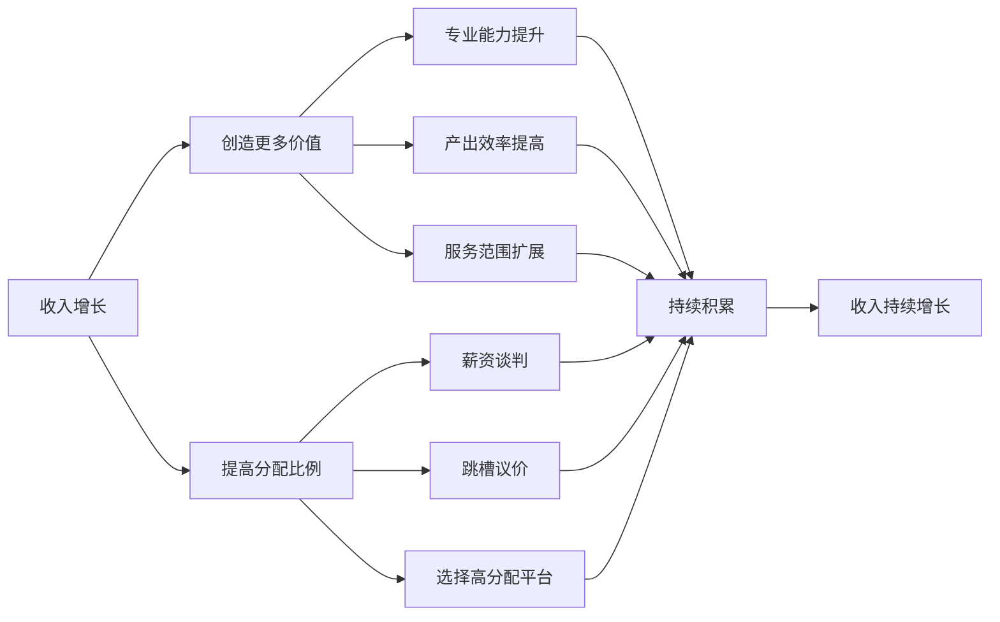
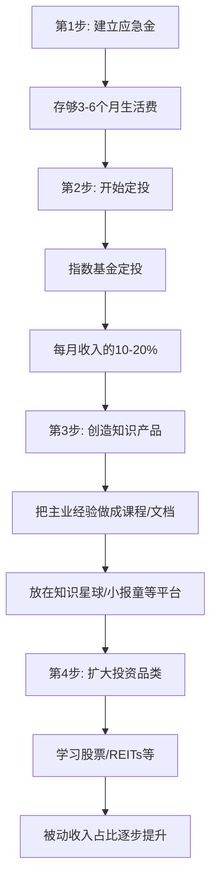
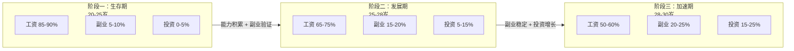
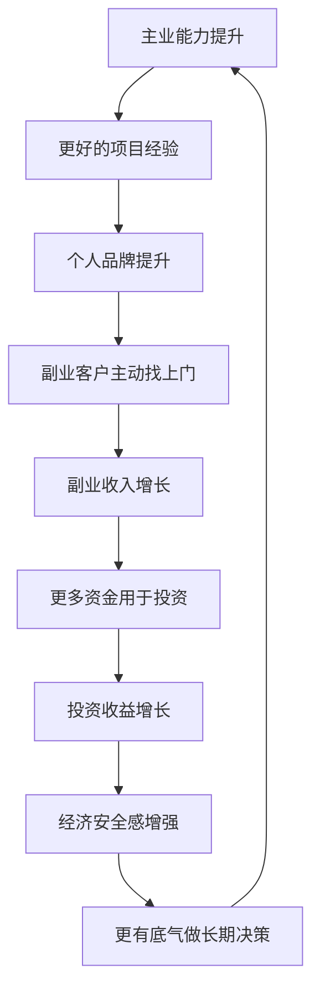

## 二、收入提升：如何快速增加收入

20-30岁是人生中收入增长潜力最大的十年。根据国家统计局数据，中国城镇居民25-34岁年龄段的收入增速是整体平均水平的1.5-2倍。问题不在于"能不能涨收入"，而在于你是否有一套系统的方法来驱动收入增长。本节将从主动收入提升、副业开发、收入结构优化三个维度，给出可执行的增长路径。

### 2.1 收入增长的基本逻辑

在讨论具体策略之前，先理解收入的本质逻辑：**你的收入 = 你创造的价值 × 你能拿到的分配比例**。

很多人只关注"怎么多赚钱"，却忽略了这个底层公式。提升收入只有两条路：

1. **创造更多价值**：提升专业能力、拓展服务范围、提高产出质量
2. **提高分配比例**：谈判技巧、跳槽议价、选择分配效率更高的平台

两条路缺一不可。能力强但不会谈判，等于把钱白白送给公司；会谈判但能力弱，短期可能得逞，长期必然被市场淘汰。



### 2.2 提升主动收入的系统策略

主动收入是你用时间和技能换来的钱，是20-30岁阶段的主要收入来源。提升主动收入不是靠"努力加班"，而是靠系统性地提升自己的市场价值。

#### 2.2.1 成为领域专家：从"能干活"到"不可替代"

大多数人在职场的前5年处于"能干活"的阶段——领导交代什么做什么，完成质量还行，但换个人也能做。要快速提升收入，必须尽快进入"不可替代"阶段。

**能力进阶的四个层级：**

| 层级 | 描述 | 市场薪资分位 | 典型特征 |
|------|------|:---:|------|
| L1 执行层 | 能完成标准化任务 | 25-50% | 按指令做事，需要指导 |
| L2 熟练层 | 能独立处理复杂任务 | 50-75% | 能独当一面，偶尔需要帮助 |
| L3 专家层 | 能解决别人解决不了的问题 | 75-90% | 团队核心，疑难问题终结者 |
| L4 影响力层 | 能定义问题和方向 | 90%+ | 行业有知名度，猎头主动找 |

**从L1到L3的具体路径：**

**第一步：找到你的"稀缺技能组合"。** 单一技能容易被替代，但如果你能把两个不常见但相关的技能组合起来，你的稀缺性就大大提升。比如：

- 程序员 + 金融知识 = 量化开发工程师（年薪50-100万）
- 设计师 + 数据分析 = 增长设计师（年薪30-60万）
- 销售 + 技术背景 = 技术型销售/解决方案架构师（年薪40-80万）
- 运营 + 编程能力 = 自动化增长工程师（年薪30-50万）

**第二步：建立"T型能力结构"。** 在一个领域做深（T的竖线），同时在相关领域保持基本了解（T的横线）。竖线决定你的专业深度，横线决定你的协作宽度和跨界能力。

**第三步：用"输出倒逼输入"。** 不要只是默默学习，要通过写技术博客、做内部分享、开源项目贡献等方式输出。输出有三个好处：加深理解、建立个人品牌、让领导看到你的成长。每周花2-3小时写一篇技术总结或工作复盘，半年后你会发现自己的认知深度远超同龄人。

#### 2.2.2 薪资谈判：拿到你应得的钱

很多人不好意思谈钱，觉得"好好干活领导自然会看到"。现实是：**不主动争取的加薪，大概率不会发生**。根据智联招聘的调研数据，主动提出加薪的员工中，约60%获得了不同程度的加薪；而从未提过的员工，只有30%在两年内获得了有意义的涨薪。

**谈判前的准备工作：**

1. **摸清市场行情。** 使用Boss直聘、脉脉、拉勾等平台搜索同岗位薪资范围。也可以通过猎头、前同事、行业社群了解。关键数据点：同城市、同行业、同经验年限的薪资中位数和75分位数。
2. **整理你的贡献清单。** 不要空口说"我很努力"，要用数据说话：你负责的项目带来了多少收入/节省了多少成本？你解决了什么关键问题？你的KPI完成情况如何？
3. **选择合适的时机。** 最佳时机：项目成功交付后、年度绩效评估前1个月、公司业绩好的时候。最差时机：公司裁员期、你的项目刚出问题、领导正焦头烂额的时候。

**谈判的具体话术框架：**

> "领导，我想跟您聊聊我的薪资情况。过去一年我主要做了三件事：[具体成果1]、[具体成果2]、[具体成果3]。我了解了一下市场行情，像我这个经验和能力水平的薪资大概在[X-Y]范围。我现在是[Z]，希望能调整到[目标数]，您看这个想法是否合理？"

**谈判中的关键原则：**

- **用事实和数据，不用情绪。** 不要说"我觉得不公平"，要说"我的产出是X，市场价是Y"。
- **给出范围而非精确数字。** 说"希望在25-30K之间"比说"我要28K"更有回旋余地。
- **准备好被拒绝的预案。** 如果公司暂时无法加薪，可以谈判其他福利：远程办公、培训预算、更多年假、期权/股票、晋升时间表。
- **不要用"别人给我开了offer"来威胁。** 这会让领导觉得你已经不忠诚了。如果真的有offer，更好的说法是"我收到了一些外部机会，但更希望在公司内部发展"。

#### 2.2.3 跳槽涨薪：战略性换赛道

跳槽是20-30岁阶段涨薪最快的方式之一。数据显示，同行业跳槽的平均涨幅在20-40%，跨行业跳槽如果技能匹配度高，涨幅可达30-60%。

**什么情况下应该跳槽：**

| 情况 | 是否跳槽 | 理由 |
|------|:---:|------|
| 薪资低于市场30%以上 | ✅ 跳 | 内部涨薪很难追平差距 |
| 连续2年没有实质性晋升 | ✅ 跳 | 说明上升通道被堵死 |
| 学不到新东西了 | ✅ 跳 | 停滞是最大的职业风险 |
| 刚入职不到1年 | ❌ 别跳 | 简历太花，HR会质疑稳定性 |
| 因为一时情绪想走 | ❌ 先冷静 | 情绪期做决定，后悔概率极高 |
| 领导刚承诺给你大项目 | ❌ 观望 | 等项目做完再评估 |

**跳槽的操作流程：**

1. **在职状态下开始看机会。** 永远不要裸辞后找工作，你的议价能力会大打折扣。
2. **更新简历和LinkedIn/脉脉主页。** 简历重点突出量化成果，而不是罗列职责。
3. **先面2-3家"练手感"的公司。** 不要一上来就面最想去的公司，先通过面试找回状态、了解市场行情。
4. **拿到offer后评估整体package。** 不要只看月薪，要算年度总收入（base + 奖金 + 股票 + 福利），同时考虑通勤时间、成长空间、行业前景。
5. **优雅地提离职。** 做好交接，保持关系。职场很小，前领导、前同事可能成为你未来的贵人。

**跳槽频率的黄金法则：**

- 每份工作至少待满18-24个月（太短不稳定，太长可能停滞）
- 30岁前跳2-3次是合理的
- 每次跳槽要有明确的"升级"：要么薪资涨，要么职级涨，要么能力涨。如果三个都没有，这次跳槽就是失败的

#### 2.2.4 利用平台杠杆：选对平台比努力更重要

同样的能力，在不同平台的收入可能差2-5倍。这不是夸张——一个在小公司做后端开发的程序员，月薪可能15K；同样的技术能力跳到字节跳动，总包可能40-60万/年。

**平台选择的评估维度：**

| 维度 | 高分信号 | 低分信号 |
|------|------|------|
| 行业增速 | 年增长30%+的行业 | 成熟或衰退行业 |
| 公司规模 | 头部公司或高速成长期公司 | 夕阳企业 |
| 分配机制 | 有股权/期权、利润分享 | 纯固定工资、无激励 |
| 学习资源 | 有大牛同事、完善培训体系 | 野蛮生长、没有指导 |
| 晋升空间 | 组织扩张、新业务线多 | 架构固化、萝卜坑 |

**关键认知：** 20-25岁，优先选择"能学到东西"的平台，薪资可以不是最高；25-30岁，开始关注"薪资 + 成长"的平衡；28岁以后，如果前期积累到位，可以选择"高薪 + 高挑战"的平台。

### 2.3 副业收入：从0到1的开发路径

副业不是"找个兼职赚零花钱"，而是在主业之外建立第二个收入引擎。好的副业应该具备三个特征：**能利用主业技能**、**有复利效应**、**不影响主业发展**。

> 副业选择、发展技巧和具体案例在本书"九、副业发展技巧"中有详细展开，这里重点讨论收入提升视角下的副业定位和选择框架。

#### 2.3.1 副业的四种类型

| 类型 | 描述 | 时薪范围 | 成长性 | 举例 |
|------|------|:---:|:---:|------|
| 技能变现型 | 直接出售专业技能 | 100-500元/h | ⭐⭐ | 接外包、做咨询、代运营 |
| 内容创作型 | 通过内容吸引流量变现 | 初期极低，后期高 | ⭐⭐⭐⭐ | 自媒体、知识付费、课程 |
| 平台套利型 | 利用信息差或资源整合 | 50-300元/h | ⭐⭐ | 代购、中间商、撮合交易 |
| 产品型 | 创建可复制的产品 | 前期投入大 | ⭐⭐⭐⭐⭐ | SaaS工具、实体产品、App |

**选择策略：**

- **20-25岁**：优先选择"技能变现型"，快速验证市场需求，同时积累作品集
- **25-28岁**：逐步过渡到"内容创作型"或"产品型"，开始建立复利
- **28-30岁**：如果副业收入稳定超过主业的30%，可以考虑是否需要转型

#### 2.3.2 副业启动的最小可行方案

不要等到"准备好了"才开始。用MVP（最小可行产品）思维启动副业：

**第一周：市场验证**
- 在朋友圈、社群、闲鱼发布你的服务/产品
- 定一个低价（甚至免费），目标是拿到3-5个真实客户
- 收集反馈，确认需求是否真实存在

**第二周：定价和流程优化**
- 根据反馈调整服务内容
- 设定合理价格（初期可以低于市场价20-30%，快速获客）
- 建立标准化的服务流程，减少每单的沟通成本

**第三周起：稳定获客**
- 把成功案例做成作品集/案例库
- 在目标客户聚集的平台持续输出内容
- 通过老客户转介绍获取新客户

**副业收入预期管理：**

| 阶段 | 时间 | 月收入预期 | 关键里程碑 |
|------|------|:---:|------|
| 冷启动期 | 第1-3个月 | 0-2,000元 | 拿到第一批付费客户 |
| 验证期 | 第3-6个月 | 2,000-5,000元 | 找到稳定的获客渠道 |
| 增长期 | 第6-12个月 | 5,000-15,000元 | 形成口碑和复购 |
| 稳定期 | 12个月+ | 15,000元+ | 可以选择是否全职转型 |

### 2.4 被动收入：让钱为你工作

被动收入是"睡后收入"——你睡觉的时候也在产生的收入。20-30岁阶段，被动收入的占比通常很低（0-10%），但越早开始积累，复利效应越明显。

> 被动收入的具体投资策略在"四、投资入门"中有详细展开，这里重点讨论被动收入的来源分类和启动路径。

#### 2.4.1 被动收入的三大来源

**来源一：投资收益**
- 指数基金定投：年化收益6-12%，几乎零门槛
- 股票分红：选择稳定分红的蓝筹股，年化3-5%的分红收益
- 债券/理财：年化3-5%，风险极低
- 房产租金：门槛高，但20-30岁可以先了解REITs（房地产信托基金）

**来源二：知识产品**
- 在线课程：录制一次，反复销售
- 电子书/付费文档：一次创作，持续收入
- 付费社群/会员制：持续提供价值，持续收费

**来源三：数字资产**
- 自媒体账号：积累粉丝后通过广告、带货变现
- 工具/模板：Notion模板、PPT模板、代码组件等
- 域名/数字藏品：风险较高，不建议作为主要方向

#### 2.4.2 被动收入的启动路径

对于20-30岁、本金有限的年轻人，推荐的启动顺序是：



**关键提醒：** 不要幻想"被动收入 = 不用工作"。前期建立被动收入体系需要大量的主动投入。被动的意思是"建好之后维护成本低"，不是"什么都不做就有钱"。

### 2.5 收入结构优化：从单一到多元

#### 2.5.1 收入结构的三个阶段



#### 2.5.2 收入结构优化的实操方法

**Step 1：摸清现状**

用这张表记录你当前的收入结构：

```markdown
| 收入来源 | 月均收入 | 占比 | 稳定性(1-5) | 成长性(1-5) |
|----------|----------|------|-------------|-------------|
| 主业工资 | _____ 元 | ___% | ___ | ___ |
| 副业收入 | _____ 元 | ___% | ___ | ___ |
| 投资收益 | _____ 元 | ___% | ___ | ___ |
| 其他     | _____ 元 | ___% | ___ | ___ |
| **合计** | _____ 元 | 100% | - | - |
```

**Step 2：设定目标**

根据你所处的阶段，设定6-12个月后的目标收入结构。目标要具体：不是"增加副业收入"，而是"副业月收入从0提升到3000元"。

**Step 3：制定行动计划**

将目标拆解为每月的行动：

- 如果目标是提升主业收入 → 每月投入X小时学习核心技能、每季度和领导做一次发展对话
- 如果目标是启动副业 → 每周投入5-10小时、第一个月完成市场验证
- 如果目标是增加投资收入 → 先存够应急金，然后开始每月定投

**Step 4：每月复盘**

每月最后一天花30分钟做一次收入复盘：
- 本月各收入来源的实际金额是多少？
- 和目标差距多少？原因是什么？
- 下个月需要调整什么？

### 2.6 收入提升的常见误区

#### 误区一：用时间换钱，而不是用价值换钱

"我每天加班到10点，为什么工资还是不涨？"——因为工资不是按小时计费的，而是按你创造的价值计费的。如果你加班做的都是低价值的重复劳动，那加班只会让你更累，不会让你更贵。

**纠正方法：** 每周问自己一次——"这周我做的事情中，哪些是可以被替代的？哪些是我的独特贡献？"把更多时间花在后者上。

#### 误区二：只关注月薪，忽视总体回报

很多人跳槽时只看月薪涨了多少，忽略了：
- 年终奖的差异（有的公司月薪低但年终奖4-6个月）
- 股票/期权的价值（尤其是高速成长的公司）
- 隐性福利（补充公积金、商业保险、培训预算、免费三餐）
- 成长机会（大平台的背书、项目经验、人脉积累）

**纠正方法：** 用"年度总包"来评估，而不是月薪。年度总包 = 12个月工资 + 年终奖 + 股票/期权年化价值 + 福利折算。

#### 误区三：过早追求被动收入

有些年轻人刚工作1-2年，本金只有几万块，就开始花大量时间研究"被动收入"。几万块的本金，即使年化10%，一年也就几千块的收益。这个时间用来提升主业技能，收入增幅可能是几万甚至几十万。

**纠正方法：** 20-25岁阶段，投资回报率最高的事情是投资自己。把80%的精力放在提升主动收入上，用20%的精力学习投资知识和建立投资习惯（比如每月定投1000元，金额不重要，习惯才重要）。

#### 误区四：副业影响主业

副业的前提是主业稳定且有竞争力。如果因为副业导致主业表现下滑，那就本末倒置了——主业是你当前最大的收入来源，也是副业的技能基础。

**纠正方法：** 设定明确的时间边界。工作日专注主业，周末和晚上分配固定时间给副业。如果副业需要占用工作时间，说明你的副业方向选错了。

#### 误区五：高估短期收入，低估长期收入

很多人在选择职业方向时，被眼前的高薪吸引，忽略了长期的成长空间。比如某些传统行业的初级岗位薪资可能比互联网高，但5年后的天花板可能远低于后者。

**纠正方法：** 用"10年总收入"而非"起薪"来评估一份工作。计算公式：10年总收入 ≈ 第1年薪资 × (1 + 年均增长率)^10的积分。如果行业A起薪15K但年增长5%，行业B起薪10K但年增长15%，10年后B的总收入远超A。

### 2.7 进阶策略：从线性收入到指数收入

#### 2.7.1 理解收入增长的三种模式

| 模式 | 特征 | 举例 | 上限 |
|------|------|------|------|
| 线性收入 | 投入1小时赚1小时的钱 | 上班、接单、开出租车 | 受限于时间总量 |
| 杠杆收入 | 投入1次，多次变现 | 写书、录课、写代码产品 | 受限于受众规模 |
| 资本收入 | 钱生钱 | 投资、房产、入股 | 受限于本金规模 |

20-30岁阶段，你主要在线性收入模式中。但你应该有意识地开始向杠杆收入过渡：

- 把解决问题的方法论写成文档/课程
- 把重复性工作自动化（写脚本、建模板）
- 把个人经验变成可复用的工具或框架

#### 2.7.2 建立你的"收入飞轮"

收入飞轮是指各收入来源之间相互促进、形成正反馈循环的结构：



**飞轮的关键是找到你的"第一推动力"——通常是主业能力的提升。** 当你的主业足够强时，副业会变得更容易（因为你的专业能力就是最好的获客工具），投资也会变得更有底气（因为有稳定的高收入做后盾）。

#### 2.7.3 收入提升的时间分配建议

对于20-30岁的职场人，建议的时间分配如下：

| 活动 | 每周时间 | 优先级 | 预期回报 |
|------|:---:|:---:|------|
| 主业核心工作 | 40-50h | 最高 | 工资 + 晋升 |
| 专业技能学习 | 5-8h | 高 | 能力提升 → 收入增长 |
| 副业开发 | 5-10h | 中 | 额外收入 + 技能拓展 |
| 投资学习与操作 | 2-3h | 中 | 被动收入增长 |
| 人脉维护 | 2-3h | 中 | 信息差 + 机会 |
| 健康管理 | 5-7h | 高 | 持续生产力的基础 |

**注意：** 健康管理不是浪费时间，而是收入增长的基础。一个长期熬夜、身体垮掉的人，收入增长会在某个节点断崖式下降。

### 2.8 本节核心要点

1. **收入 = 价值 × 分配比例**，两条腿走路才稳
2. **成为领域专家**比"更努力"更重要——找到你的稀缺技能组合
3. **主动谈判**，不要等领导良心发现——60%的主动加薪申请都能成功
4. **跳槽是工具**，不是目的——每次跳槽要有明确的"升级"
5. **副业要选对方向**——能利用主业技能、有复利效应、不影响主业
6. **被动收入越早开始越好**，但20-25岁阶段优先投资自己
7. **优化收入结构**——从单一工资走向"工资 + 副业 + 投资"三足鼎立
8. **避免常见误区**——不加班换钱、不算总包、不本末倒置
9. **建立收入飞轮**——让各收入来源相互促进，形成正反馈循环
