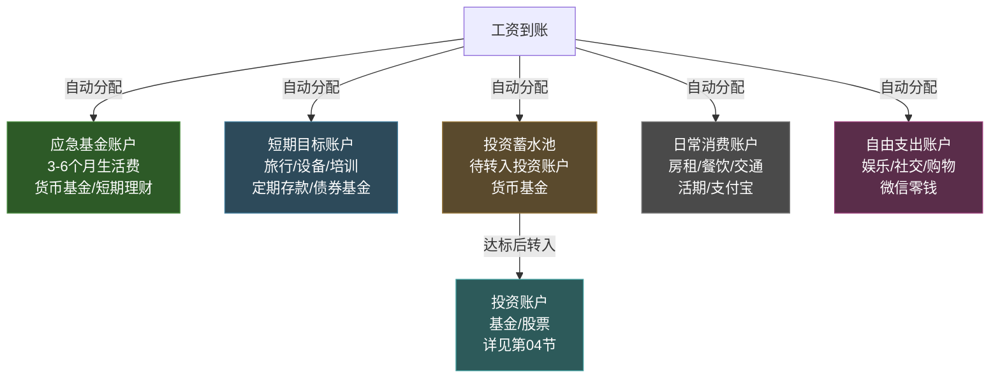
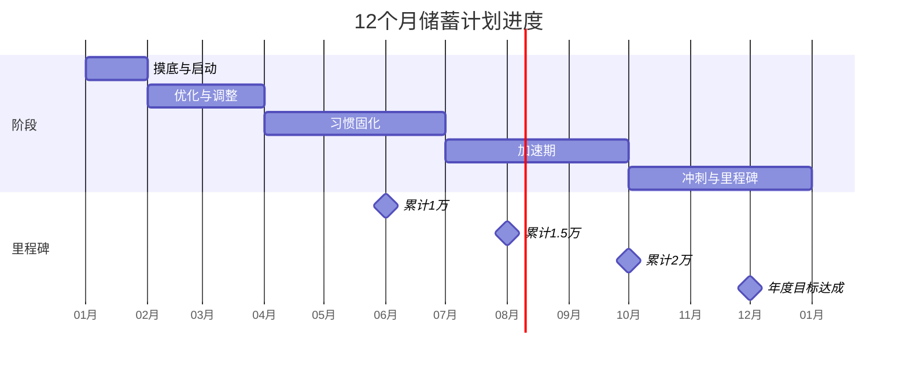

## 三、储蓄习惯：如何存下第一桶金

"第一桶金"没有统一标准——对月薪5000的应届生来说，可能是3万元应急基金；对月薪15000的程序员来说，可能是10万元投资启动资金。但无论金额大小，**第一桶金的本质是"储蓄纪律的胜利"**。它证明你具备延迟满足的能力，而这恰恰是未来一切财富积累的起点。

本节不是教你"省钱的100个小技巧"——那种清单式的内容在网上随处可见。我们要做的是从根本上理解储蓄的心理机制、建立可持续的储蓄系统、选择适合自己的储蓄策略，并用真实的数字验证效果。

---

### 3.1 为什么储蓄比投资更重要

很多年轻人急着学投资、买基金、炒股票，却连一个月的应急资金都拿不出来。这就像一个不会游泳的人急着学冲浪——本末倒置。

#### 3.1.1 储蓄是投资的前置条件

投资需要本金。没有储蓄，投资就是空中楼阁。更关键的是，**没有储蓄习惯的人，即使偶然获得一笔钱（比如年终奖），也会在短时间内花掉**。行为经济学研究发现，人们对"意外之财"的消费倾向远高于"辛苦赚来的钱"——这就是所谓的"心理账户"效应（Richard Thaler，2017年诺贝尔经济学奖得主）。

#### 3.1.2 储蓄率比收入更重要

一个反直觉的事实：**决定你财富积累速度的不是收入高低，而是储蓄率**。

| 人物 | 月收入 | 月支出 | 月储蓄 | 储蓄率 | 年储蓄额 |
|:---:|:---:|:---:|:---:|:---:|:---:|
| 小A | 8,000 | 5,600 | 2,400 | 30% | 28,800 |
| 小B | 15,000 | 13,500 | 1,500 | 10% | 18,000 |
| 小C | 8,000 | 4,000 | 4,000 | 50% | 48,000 |

小B的收入是小A的近2倍，但年储蓄额反而少了37%。小C和小A收入相同，但储蓄率高20个百分点，年储蓄额多了67%。**收入是上限，储蓄率才是你真正能留住的钱。**

#### 3.1.3 储蓄带来的心理红利

储蓄不只是数字增长，它会产生显著的心理正反馈：

- **安全感：** 当你银行卡里有3个月的生活费时，你面对老板的底气完全不同。你不会因为害怕失业而接受不合理的要求。
- **选择权：** 有了储蓄，你可以拒绝一份烂offer，等待更好的机会；可以在身体不适时休息，而不是带病硬撑。
- **投资入场券：** 储蓄到一定规模后，你可以开始投资，让钱生钱。这是从"用时间换钱"到"用钱生钱"的质变。
- **自信与掌控感：** 能控制自己消费欲望的人，在其他方面也往往更有自控力。

---

### 3.2 储蓄的心理学：为什么你存不下钱

在讨论"怎么存"之前，必须先理解"为什么存不下"。储蓄失败的根源通常不是收入不够，而是心理机制在作祟。

#### 3.2.1 即时满足 vs 延迟满足

人类大脑天生偏好即时奖励。神经科学研究表明，当人们面临"现在消费"和"未来储蓄"的选择时，大脑的边缘系统（负责情绪和冲动）会压过前额叶皮层（负责理性规划）。这不是你意志力薄弱，而是进化留下的本能——我们的祖先面对食物时必须"现在就吃"，因为没有冰箱。

**破解方法：** 不要依赖意志力，而是用系统来约束自己。自动化储蓄（见3.3.1节）就是把"延迟满足"变成"默认行为"，绕过意志力的消耗。

#### 3.2.2 生活方式膨胀（Lifestyle Inflation）

这是20-30岁最大的储蓄杀手。你月薪5000时，住在合租房、骑共享单车、自己做饭；月薪涨到15000后，你搬进了独居公寓、打车通勤、天天外卖。收入翻了3倍，储蓄可能一分钱没多。

这种现象在心理学中叫"享乐适应"（Hedonic Adaptation）：人对物质享受的满足感会快速消退，你需要不断升级消费才能维持同样的快乐水平。这是一个永无止境的陷阱。

**数据参考：** 中国人民银行2024年数据显示，25-35岁城镇居民的平均储蓄率约为15%，但收入最高的25%人群中，储蓄率中位数达到35%以上。差距不在收入，在于他们控制住了生活方式膨胀。

#### 3.2.3 社交压力与攀比消费

"同事都换了iPhone 16"、"朋友都去了日本旅游"、"同学都买了车"——社交压力是年轻人消费超支的重要推手。社交媒体放大了这种效应：你每天在朋友圈看到的都是精心策划的"美好生活"，却看不到别人信用卡账单上的数字。

**破解方法：** 建立"财务边界感"。你的消费决策应该基于自己的财务目标，而不是别人的消费水平。一个实用技巧：每次面对社交性消费冲动时，问自己——"如果没有人看到我用/做这件事，我还会花这个钱吗？"

#### 3.2.4 "以后赚更多"的幻觉

很多年轻人的逻辑是："现在工资低，存不了多少，等以后赚多了再存。"这个逻辑有两个致命缺陷：

1. **习惯不会自动改变。** 如果你月薪5000时月光，月薪20000时大概率还是月光——因为你的消费习惯已经固化了。
2. **"以后"永远不会来。** 人总是高估未来的收入增长，低估未来的支出压力。等你月薪20000时，你可能有了房贷、车贷、孩子，可支配收入反而更少。

**正确做法：** 从第一份工资开始储蓄，哪怕只存10%。重点不是金额，而是建立"收入-储蓄=支出"的思维模式（而非"收入-支出=储蓄"）。

---

### 3.3 五大储蓄方法：总有一款适合你

储蓄方法没有"最好的"，只有"最适合你的"。下面介绍五种经过验证的方法，从最简单到最系统化。

#### 3.3.1 先支付自己法（Pay Yourself First）

**核心原则：** 发工资当天，先把要存的钱转走，剩下的才是可支配收入。

这是最简单、最有效、最不需要意志力的方法。它的心理学基础是"默认效应"——人倾向于接受默认选项。当你把储蓄设为"默认行为"（自动转账），消费自然会适应剩余的金额。

**具体操作步骤：**

1. 开一张独立的储蓄卡（不要绑定任何支付软件）
2. 设置工资卡的自动转账：发工资次日，自动转出目标储蓄金额到储蓄卡
3. 剩下的钱就是你这个月的全部可支配收入
4. 不要动储蓄卡里的钱（除非真正的紧急情况）

**储蓄比例建议：**

| 收入水平 | 建议储蓄率 | 说明 |
|:---:|:---:|------|
| 月收入 < 5,000 | 10-15% | 收入低时重在建立习惯，金额不重要 |
| 月收入 5,000-10,000 | 15-25% | 开始有实质积累，但仍需保证生活质量 |
| 月收入 10,000-20,000 | 25-35% | 收入增长期，关键期防生活方式膨胀 |
| 月收入 > 20,000 | 35-50% | 高储蓄率阶段，为投资和大目标蓄力 |

**关键提醒：** 储蓄率不是越高越好。如果储蓄导致你每天吃泡面、不敢社交、精神压力巨大，这个储蓄率就是不可持续的。**可持续的储蓄率 = 你能坚持3年以上不痛苦的比例。**

#### 3.3.2 52周阶梯储蓄法

**核心原则：** 每周递增存入一定金额，52周后形成一笔可观的储蓄。

这是一种利用"渐进承诺"心理的方法——从小额开始，逐渐加码，让储蓄像健身一样成为习惯。

**操作方式（以每周递增10元为例）：**

| 周数 | 本周存入 | 累计储蓄 |
|:---:|:---:|:---:|
| 第1周 | 10元 | 10元 |
| 第2周 | 20元 | 30元 |
| 第3周 | 30元 | 60元 |
| ... | ... | ... |
| 第26周 | 260元 | 3,510元 |
| ... | ... | ... |
| 第52周 | 520元 | 13,780元 |

一年下来，累计储蓄 **13,780元**。如果你的基数是每周递增20元，总额就是 **27,560元**。

**变体：反向52周法。** 如果你担心后期金额太大坚持不下来，可以从大额开始，每周递减。这样前几周的高储蓄会给你强烈的成就感，后期金额变小反而更容易坚持。

**适用人群：** 收入不固定（如自由职业者、销售）、刚开始培养储蓄习惯的新手、想用"游戏化"方式存钱的年轻人。

#### 3.3.3 信封预算法（Envelope Method）

**核心原则：** 把月收入分成若干"信封"，每个信封对应一个消费类别，花完即止。

这是最古老的预算方法之一，至今仍然有效，因为它把抽象的数字变成了具象的"额度"——你的大脑更容易理解"这个信封里还有多少钱"，而不是"我的总预算还剩多少"。

**现代版操作（用多个银行账户代替信封）：**

1. 开设以下账户（可以用同一银行的不同子账户，或不同银行的账户）：

| 账户名称 | 占比 | 用途 |
|:---:|:---:|------|
| 储蓄账户 | 20-30% | 长期储蓄，不绑定支付 |
| 必要支出账户 | 40-50% | 房租、水电、交通、吃饭 |
| 自由支出账户 | 15-20% | 娱乐、社交、购物 |
| 学习成长账户 | 5-10% | 课程、书籍、培训 |
| 应急备用账户 | 5% | 突发支出（修手机、看病等） |

2. 工资到账后，立即按比例分配到各账户
3. 每个账户独立管理，一个花完了就不能从其他账户"借"

**进阶技巧：** 在自由支出账户中，如果某个月有结余，不要转回储蓄账户——把它留着，累积到够买一个你真正想要的东西。这给了你"延迟消费"的奖励，强化储蓄正反馈。

#### 3.3.4 零基预算法（Zero-Based Budgeting）

**核心原则：** 每一分钱都要有去处——收入减去所有支出（包括储蓄）等于零。

这不意味着把钱全部花光，而是说"储蓄"本身就是一项"支出"——你把钱"花"在了未来的自己身上。

**操作步骤：**

1. 列出本月所有预期收入（工资、奖金、副业收入等）
2. 列出所有预期支出，包括：
   - 固定支出（房租、水电、话费、订阅服务）
   - 必要支出（吃饭、交通、日用品）
   - 储蓄目标（应急基金、投资、大目标储蓄）
   - 自由支出（娱乐、社交、购物）
3. 调整各项金额，直到 **收入 - 支出 = 0**
4. 如果有"多余"的钱，主动分配到储蓄或投资中

**月度零基预算模板：**

```text
本月收入：¥________

一、固定支出（必付）
  房租：¥________
  水电燃气：¥________
  手机话费：¥________
  交通月卡：¥________
  订阅服务（视频/音乐/云存储）：¥________
  固定支出小计：¥________

二、必要支出（可调节）
  餐饮：¥________
  日用品：¥________
  服装（均摊）：¥________
  必要支出小计：¥________

三、储蓄目标（优先级排序）
  应急基金：¥________
  投资本金：¥________
  大目标储蓄（旅行/设备/培训）：¥________
  储蓄目标小计：¥________

四、自由支出
  娱乐：¥________
  社交聚餐：¥________
  购物：¥________
  自由支出小计：¥________

五、差额调整
  收入 - 总支出 = ¥________（应为0）
```

**适用人群：** 喜欢掌控细节的人、收入波动较大需要精确规划的人、想找出"钱都花到哪里去了"的人。

#### 3.3.5 目标驱动储蓄法

**核心原则：** 为一个具体的、有时间节点的目标储蓄——"我要在12个月内存够30,000元去日本旅行"比"我要多存点钱"有效100倍。

心理学研究表明，具体的、有截止日期的目标比模糊的愿望更能激发行动。当你有一个清晰的目标时，每一次拒绝消费冲动都有了理由——"我不买这个，因为我在攒钱去日本。"

**操作方法：**

1. **定义目标：** 具体金额 + 截止日期 + 用途
   - 好的目标："2026年12月31日前存够30,000元，用于日本旅行"
   - 坏的目标："存多点钱"

2. **拆解到月/周：** 30,000元 ÷ 12个月 = 2,500元/月 = 625元/周

3. **建立可视化追踪：** 用Excel、记账App或手绘进度条，每周更新一次进度

4. **设置里程碑奖励：** 每达成25%的进度，给自己一个小奖励（从自由支出账户出）

**推荐的"第一桶金"目标阶梯：**

| 阶段 | 目标 | 金额参考 | 意义 |
|:---:|------|:---:|------|
| 第一阶段 | 1个月应急基金 | 月支出×1 | 应对突发失业、医疗 |
| 第二阶段 | 3个月应急基金 | 月支出×3 | 安全感的基础 |
| 第三阶段 | 投资启动金 | 3-5万元 | 开始定投的门槛 |
| 第四阶段 | 6个月应急基金 | 月支出×6 | 可以从容应对重大变故 |
| 第五阶段 | "选择权基金" | 10-20万元 | 可以辞职、转行、创业 |

---

### 3.4 储蓄工具与账户体系

光有方法不够，还需要合适的工具来执行。下面按优先级排列，从最高优先级开始。

#### 3.4.1 第一层：应急基金账户

**目的：** 放3-6个月的生活费，应对失业、疾病、意外维修等突发情况。

**选择标准：** 安全性 > 流动性 > 收益性。这个账户的钱需要随时能取出来，绝对不能有亏损风险。

**推荐工具：**

| 工具 | 年化收益 | 流动性 | 安全性 | 适合场景 |
|------|:---:|:---:|:---:|------|
| 货币基金（余额宝/零钱通） | 1.5-2.5% | T+0 | 高 | 日常应急，随用随取 |
| 银行活期存款 | 0.2-0.3% | 即时 | 极高 | 需要绝对安全的场景 |
| 短期银行理财（T+1） | 2.5-3.5% | T+1 | 高 | 应急基金的主体部分 |
| 国债逆回购 | 1.5-3%（波动） | 到期自动到账 | 极高 | 节假日前操作，收益较高 |

**具体配置建议（以月支出5000元为例，目标3个月应急基金 = 15,000元）：**

- 5,000元放余额宝/零钱通（即时可用）
- 10,000元放银行短期理财或大额存单（T+1可用）

#### 3.4.2 第二层：短期目标储蓄账户

**目的：** 为1-3年内的具体目标存钱（旅行、设备、培训、婚礼等）。

**选择标准：** 收益性 > 安全性 > 流动性。因为有明确时间节点，可以接受稍低的流动性来换取更高收益。

**推荐工具：**

| 工具 | 年化收益 | 锁定期 | 适合目标 |
|------|:---:|:---:|------|
| 银行定期存款 | 1.5-2.5% | 3个月-3年 | 金额确定、时间确定的目标 |
| 大额存单（20万起） | 2.0-2.8% | 1-3年 | 储蓄到20万以上时 |
| 国债 | 2.5-3.0% | 3-5年 | 偏好绝对安全的保守型 |
| 债券基金 | 3-5% | 无锁定期，但建议持有1年以上 | 能接受小幅波动的人 |

#### 3.4.3 第三层：投资本金蓄水池

**目的：** 为定投基金、股票等投资积累本金。这部分钱在攒够一定金额后，会转入投资账户。

**选择标准：** 灵活性 > 收益性。需要能随时转入投资账户。

**推荐工具：**

- 货币基金（方便随时转入基金账户）
- 银行活期（最灵活，但收益最低）
- 短期理财（如果投资是按月定投，可以选择月度到期的理财）

#### 3.4.4 账户体系架构图



---

### 3.5 实战：从零开始的12个月储蓄计划

理论讲完了，下面是一个可以直接照着执行的计划。假设你月薪8,000元，月支出6,000元，当前零储蓄。

#### 3.5.1 第1个月：摸底与启动

**目标：** 了解自己的真实消费情况，建立储蓄系统。

**具体行动：**

1. **记账7天。** 用记账App（推荐"随手记"或"钱迹"）记录每一笔支出，无论金额大小。目的不是控制消费，而是了解钱花在哪里。
2. **分类统计。** 7天后，把支出分为四类：必要固定（房租水电）、必要弹性（吃饭交通）、可选消费（娱乐购物）、冲动消费（事后后悔的支出）。
3. **开立储蓄账户。** 去银行开一张新卡（不绑定任何支付App），或在支付宝/微信中创建一个单独的"储蓄"账户。
4. **设置自动转账。** 工资卡设置每月发薪次日自动转出1,000元（12.5%的储蓄率）到储蓄账户。
5. **剩余5,000元就是本月的全部预算。** 不够花？那就想办法减少非必要支出。

**本月预期储蓄：1,000元**

#### 3.5.2 第2-3个月：优化与调整

**目标：** 找到可持续的消费结构，逐步提高储蓄率。

**具体行动：**

1. **砍掉冲动消费。** 回顾第一个月的记账数据，找出冲动消费项（通常是外卖升级、凑单购买、订阅服务），直接取消。
2. **优化必要弹性支出。** 吃饭不能省，但可以从"每天外卖"变成"工作日带饭+周末外食"，通常能省30-40%的餐饮费。
3. **评估订阅服务。** 视频会员、音乐会员、云存储、健身卡——逐个评估过去一个月是否真正使用了。未使用的立即取消。
4. **第3个月起，自动转账提高到1,500元。**

**预期月储蓄：1,000-1,500元 | 累计储蓄：3,500-4,000元**

#### 3.5.3 第4-6个月：习惯固化

**目标：** 储蓄成为"默认行为"，不再需要意志力。

**具体行动：**

1. **审视是否有生活方式膨胀。** 是否因为"存了点钱"就开始犒劳自己？注意控制。
2. **找到"免费快乐"。** 跑步、阅读、做饭、逛公园、看纪录片——建立不花钱或少花钱的快乐来源，减少对消费的依赖。
3. **开始学习理财知识。** 读《小狗钱钱》《富爸爸穷爸爸》或关注靠谱的理财公众号，为下一步投资做准备。

**预期月储蓄：1,500元 | 累计储蓄：8,000-9,500元**

#### 3.5.4 第7-9个月：加速期

**目标：** 开源节流双管齐下，加速储蓄。

**具体行动：**

1. **尝试增加收入。** 是否有涨薪机会？能否做些小副业（如兼职翻译、设计、写作）？哪怕每月多500元收入，全部存入储蓄账户。
2. **清理闲置物品。** 在闲鱼上卖掉不用的电子产品、衣服、书籍。所得收入全部存入储蓄账户。
3. **使用"等24小时"规则。** 任何超过200元的非必要消费，等24小时再决定。你会发现大部分冲动会在24小时内消退。

**预期月储蓄：1,500-2,000元 | 累计储蓄：12,500-15,500元**

#### 3.5.5 第10-12个月：冲刺与里程碑

**目标：** 突破2万元大关，建立完整的应急基金。

**具体行动：**

1. **年终奖/十三薪全部储蓄。** 如果有年终奖，至少存入50%，理想情况下存入80%。
2. **复盘全年储蓄情况。** 计算实际储蓄率，与目标对比，找出差距原因。
3. **设定下一年的目标。** 有了第一年的基础，第二年可以把储蓄率提高到25-30%，并开始学习投资。

**预期月储蓄：1,500-2,000元 | 年度累计储蓄：20,000-25,000元**

#### 3.5.6 12个月储蓄进度表



---

### 3.6 提高储蓄率的12个实操技巧

以下技巧按"节流"和"开源"两类排列。节流见效快但有上限，开源见效慢但没有天花板。

#### 3.6.1 节流类技巧

**技巧1：外卖降级。** 从品牌连锁外卖换成普通餐馆外卖，或从外卖降级为便利店便当。平均每天能省5-10元，一个月省150-300元。更大的降级：每周带饭3天，每月可省500-800元。

**技巧2：订阅审计。** 每季度做一次订阅服务审计。列出所有自动扣费项目，逐个问自己"过去30天我用了几次？"使用次数低于3次的直接取消。很多人每月有200-500元花在"忘记取消的订阅"上。

**技巧3：社交预算。** 每月给自己设定一个社交聚餐预算（比如500元），花完就不再参加需要花钱的聚会。学会说"这个月预算用完了，下次再约"——真正的朋友不会因此疏远你。

**技巧4：购物冷静期。** 超过300元的非必要消费，强制等待72小时。超过1000元的，等待7天。很多冲动消费在冷静期后会自行消退。

**技巧5：使用现金或限定额度的支付方式。** 研究表明，用现金支付比刷卡/扫码更"痛"，因此会减少消费。现代版做法：把每月自由支出的钱转到一个单独的微信/支付宝账户，只用这个账户消费。

**技巧6：批量采购日用品。** 纸巾、洗衣液、洗发水等消耗品，在电商大促时批量购买，通常能省20-30%。但注意：只买你确定会用的东西，不要因为"便宜"而囤不需要的货。

#### 3.6.2 开源类技巧

**技巧7：工资谈判。** 每次涨薪或跳槽时，把涨薪部分的50-100%直接加入自动储蓄转账额。你的生活已经适应了原来的工资水平，涨薪部分完全可以全部存下来。

**技巧8：闲置变现。** 每半年清理一次家里的闲置物品（电子产品、衣服、书籍、家具），在闲鱼上出售。大多数人家里至少有3000-10000元的"沉睡资产"。

**技巧9：技能变现。** 如果你有写作、设计、翻译、编程、摄影等技能，可以在业余时间接一些小项目。收入全部存入储蓄账户，不动用一分钱。

**技巧10：利用信用卡返现（仅限有纪律的人）。** 如果你能做到每月全额还款、绝不分期，信用卡的返现和积分可以帮你省下1-3%的日常消费。但如果你有任何"先消费后还款"的倾向，请远离信用卡。

**技巧11：薅"低垂的果实"。** 合理利用各种优惠：话费充值折扣（支付宝/微信经常有）、公交地铁月卡、员工福利（有些公司的餐补/交通补/住房补你不申请就没有）。

**技巧12：存下"意外收入"。** 退款、红包、中奖、退税——任何计划外的收入，全部存入储蓄账户。这是"意外之财"最好的归宿。

---

### 3.7 常见误区与纠正

#### 误区1："等我赚更多再存"

**为什么错：** 储蓄是习惯，不是数学题。月入5000存不下钱的人，月入20000大概率也存不下——因为消费习惯会随收入同步膨胀。

**正确做法：** 从现在开始，从10%开始。金额不重要，习惯才重要。

#### 误区2："存钱太痛苦了，人生苦短要享受"

**为什么错：** 这是一种"虚假二选一"。储蓄不等于苦行僧——你不需要戒掉所有娱乐和享受。关键是在"当下享受"和"未来保障"之间找到平衡。

**正确做法：** 保留你的"快乐支出"，但设定预算上限。比如每月娱乐预算500元，在这个范围内尽情享受，但不超支。

#### 误区3："存银行跑不赢通胀，不如花了"

**为什么错：** 这个逻辑的错误在于"不存银行"推导出"花了"，而正确推导应该是"不存银行，那就投资基金/理财"。另外，即使是低收益的银行存款，也比花光了强——1%的收益 > 0%的收益 > -100%（花光）。

**正确做法：** 先建立3个月应急基金（放货币基金），再考虑更高收益的投资。投资和储蓄不矛盾，它们是不同阶段的不同策略。

#### 误区4："记账太麻烦了，坚持不下来"

**为什么错：** 记账的目的不是记一辈子，而是搞清楚"钱花在哪里了"。你只需要认真记1-2个月，摸清自己的消费结构后，就可以停止逐笔记账——因为你已经建立了预算意识。

**正确做法：** 先记2个月，找到消费模式，然后切换到"只追踪大类支出"的简化模式（比如只看本月餐饮总支出、娱乐总支出是否超标）。

#### 误区5："我存的钱会被通货膨胀吃掉"

**为什么错：** 这是用投资的逻辑来否定储蓄，但储蓄和投资的功能完全不同。储蓄的首要功能是"安全性和流动性"，不是"收益性"。你的应急基金不需要跑赢通胀，它需要的是在你失业时能随时取出来付房租。

**正确做法：** 分层管理——应急基金追求安全和流动（货币基金），投资本金追求收益（基金/股票），两者各司其职。

#### 误区6："朋友都买房了，我存钱有什么用，房价涨得比利息快"

**为什么错：** 首先，买房需要首付，首付来自储蓄——没有储蓄连买房的资格都没有。其次，2020年之后的中国房地产市场已经不再是"闭眼买就涨"的时代，盲目加杠杆买房的风险远大于储蓄。

**正确做法：** 先存够应急基金，再根据自己的城市、收入和房价收入比来决定是否买房。不要因为"别人都买了"就冲动入场。

---

### 3.8 不同收入水平的储蓄策略

储蓄策略不能一刀切。月入4000和月入20000的人，面临的问题完全不同。

#### 3.8.1 月入3,000-5,000元：建立习惯期

**核心目标：** 存下第一个1万元。

**策略重点：**
- 储蓄率目标：10-15%（300-750元/月）
- 优先建立"先支付自己"的自动转账系统
- 砍掉所有非必要的固定支出（多余的订阅、不常用的会员）
- 不要在这个阶段学习投资——本金太小，收益不值得花时间研究
- 把精力放在提升收入上（学技能、争取加薪、找更好的工作）

**时间预期：** 12-24个月存到1万元。

#### 3.8.2 月入5,000-10,000元：加速积累期

**核心目标：** 建立3个月应急基金（约1.5-3万元）。

**策略重点：**
- 储蓄率目标：20-30%（1,000-3,000元/月）
- 抵制生活方式膨胀——收入增长的部分全部存入
- 开始记账1-2个月，摸清消费结构
- 建立分层储蓄账户体系（应急基金 + 短期目标 + 投资蓄水池）
- 开始学习基础理财知识

**时间预期：** 8-18个月建立完整的应急基金。

#### 3.8.3 月入10,000-20,000元：系统化储蓄期

**核心目标：** 建立6个月应急基金 + 积累投资本金。

**策略重点：**
- 储蓄率目标：30-40%（3,000-8,000元/月）
- 使用零基预算法精确管理每一笔钱
- 开始定投指数基金（每月1000-3000元）
- 关注"隐性支出"：不必要的社交应酬、过度保险、高价但低频使用的服务
- 考虑是否需要优化住房成本（合租 vs 独居的权衡）

**时间预期：** 12-24个月建立完整财务基础。

#### 3.8.4 月入20,000元以上：财富加速期

**核心目标：** 储蓄率最大化，为重大财务目标积累。

**策略重点：**
- 储蓄率目标：40-60%
- 警惕"高收入陷阱"——收入越高，社交压力越大，越容易消费升级
- 建立完整的资产配置方案（详见本章第04节"投资入门"）
- 考虑税务优化（公积金最大化、专项附加扣除等）
- 开始为长期目标（买房/创业/深造）做专项储蓄

---

### 3.9 储蓄的进阶思维

#### 3.9.1 储蓄率的"复利效应"

储蓄率的提高不仅增加储蓄金额，还减少支出基数，产生双重效果。

假设月收入10,000元：

| 储蓄率 | 月储蓄 | 月支出 | 年储蓄 | 年支出 |
|:---:|:---:|:---:|:---:|:---:|
| 10% | 1,000 | 9,000 | 12,000 | 108,000 |
| 20% | 2,000 | 8,000 | 24,000 | 96,000 |
| 30% | 3,000 | 7,000 | 36,000 | 84,000 |
| 50% | 5,000 | 5,000 | 60,000 | 60,000 |

从10%提到30%，储蓄额从12,000跳到36,000——增长了200%。而你的收入没有任何变化。**提高储蓄率是不需要换工作就能实现的"加薪"。**

更深远的影响：储蓄率越高，你实现"财务自由"所需的本金就越少。如果你每月只需要5,000元就能生活，那么被动收入达到5,000元/月就自由了；如果你每月需要20,000元，自由的门槛就是前者的4倍。

#### 3.9.2 从"省钱"到"买时间"

低层次的储蓄是"少花钱"，高层次的储蓄是"把钱花在刀刃上"。

一个例子：你花2小时坐公交省钱 vs 花30元打车省1.5小时。如果你用这1.5小时学习一个能涨薪的技能，长期回报远超30元。

**判断标准：** 把你的时间价值（月收入÷月工作小时数）作为参考。如果一项节省的时间能被用于更高价值的活动，那就不应该为了省钱而浪费时间。

#### 3.9.3 "够用就好"的极简思维

消费的边际效用递减——第一双鞋给你100%的满足感，第二双可能只有30%，第三双只有10%。

极简不是苦行，而是**只保留真正带来价值的东西**。当你不再为了"拥有"而消费，而是为了"使用"和"体验"而消费时，你会发现生活质量提高了，支出反而降低了。

---

### 3.10 本节小结

储蓄不是投资的对立面，而是投资的地基。没有储蓄纪律的人，不可能成为成功的投资者。本节的核心要点：

1. **储蓄率比收入更重要。** 决定你财富积累速度的不是赚多少，而是留多少。
2. **用系统代替意志力。** 自动转账、分账户管理、先支付自己——让储蓄成为"默认行为"。
3. **选择适合自己的方法。** 先支付自己法最省心，信封法最精细，目标法最有动力。
4. **分层管理储蓄。** 应急基金、短期目标、投资蓄水池各司其职。
5. **从现在开始。** 哪怕只存100元，也比"等以后再说"强一万倍。
6. **警惕生活方式膨胀。** 收入增长时，储蓄率应该同步甚至超比例增长。

记住：**第一桶金不是一笔巨款，而是一个习惯。** 当你能在任何收入水平下都坚持储蓄时，你就掌握了财富积累的底层密码。接下来的"投资入门"一节，将教你如何让这些储蓄为你工作。
