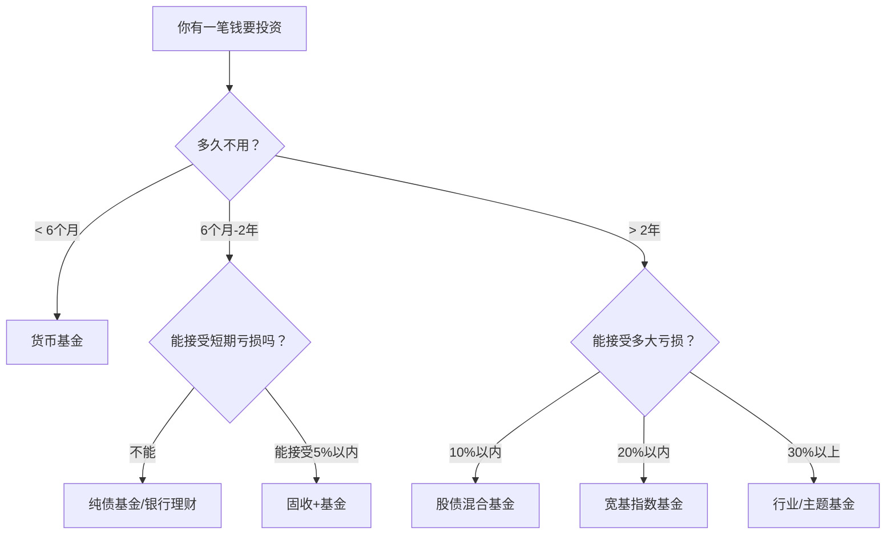
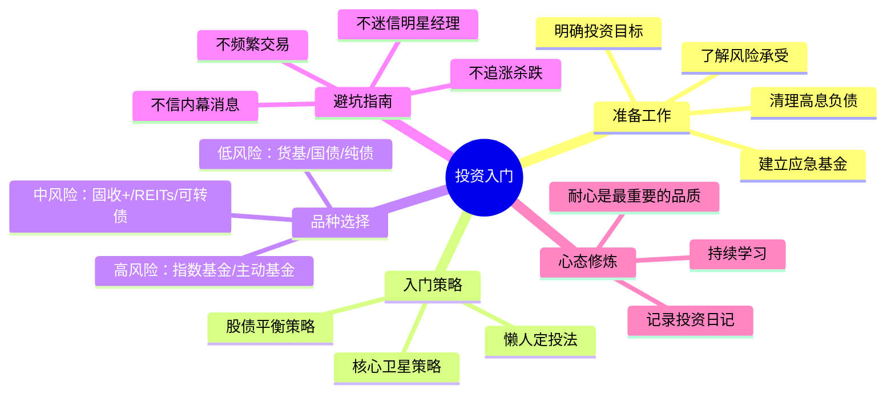

## 四、投资入门：如何开始你的投资之路

> 投资不是有钱人的专利，而是每个人从第一笔工资开始就应该学习的生存技能。20-30岁的你，拥有最宝贵的资产——时间。复利需要时间发酵，而你恰好拥有最多的时间。

### 1. 为什么要现在就开始投资

#### 1.1 复利的数学真相

爱因斯坦（据传）说过："复利是世界第八大奇迹。"这不是鸡汤，而是数学事实。

假设年化收益率 8%（沪深300长期年化约 7-9%）：

| 开始年龄 | 每月投入 | 投资年限 | 60岁时总额 | 其中收益 |
|----------|----------|----------|------------|----------|
| 22岁 | 1000元 | 38年 | 约353万 | 约293万 |
| 30岁 | 1000元 | 30年 | 约150万 | 约114万 |
| 40岁 | 1000元 | 20年 | 约59万 | 约35万 |

**晚开始8年，最终少了一倍多。** 这就是时间在复利公式中的威力。公式本身很简单：

```text
终值 = 本金 × (1 + 收益率)^年数
```

但"年数"这个指数变量，让时间成为投资中最重要的杠杆。

#### 1.2 20-30岁投资的独特优势

- **容错成本低**：即使亏损，你有几十年时间恢复。30岁亏5万和50岁亏5万，影响完全不同
- **可承受更高波动**：年轻人可以配置更多权益类资产，长期看股票收益远超存款
- **学习成本最低**：用小资金交学费，比以后用大资金交学费划算得多
- **养成习惯比赚多少钱更重要**：22岁月投500元的意义不在于那500元，而在于"月月投"这个习惯

#### 1.3 不投资的真实代价

很多人觉得"我不投资，钱放银行最安全"。但通货膨胀每年都在偷走你的购买力：

- 中国近10年平均CPI约 2-3%，实际生活成本涨幅更高
- 100元放银行活期（年化0.2%），10年后购买力约等于今天的82元
- 如果考虑房价、教育、医疗等真实生活成本，贬值速度更快

**不投资本身就是一种投资——你在赌通胀不会侵蚀你的财富。** 这是一个大概率会输的赌注。

---

### 2. 投资前的四大准备工作

很多人急于"买什么"，却忽略了更重要的准备工作。投资前的准备决定了你投资的成败。

#### 2.1 清理高息负债

**原则：先还债，再投资。**

任何利率超过投资预期收益的债务，都应该优先偿还：

| 债务类型 | 典型年利率 | 策略 |
|----------|-----------|------|
| 信用卡分期 | 13-18% | 立即还清，没有商量余地 |
| 花呗/白条分期 | 10-16% | 优先还清 |
| 消费贷 | 6-12% | 计划性还清 |
| 房贷 | 3-4% | 可以不提前还，投资收益可能更高 |
| 亲友无息借款 | 0% | 按约定还，不影响投资 |

逻辑很简单：信用卡分期18%的利率，意味着你投资需要赚到18%以上才能覆盖这个成本。A股长期年化也就7-9%，所以**先还信用卡再投资，相当于你做了一笔年化18%的无风险投资**。

#### 2.2 建立应急基金

投资的钱应该是"3-6个月不用的钱"。在开始投资之前，先存够应急基金：

- **目标金额**：3-6个月基本生活支出（房租+吃饭+交通+必要开支）
- **存放位置**：货币基金（如余额宝、零钱通），年化1.5-2%，随时可取
- **绝对不能动用投资账户的钱来应急**

为什么必须先有应急基金？因为如果你没有应急资金，一旦遇到突发情况（失业、生病、意外），就只能在最不该卖的时候被迫卖出投资——而市场下跌时往往是人生最困难的时期，两者叠加会让你遭受双重打击。

#### 2.3 明确投资目标和期限

不同目标对应不同策略：

| 目标 | 期限 | 风险承受 | 适合品种 |
|------|------|----------|----------|
| 3个月后旅游 | <1年 | 极低 | 货币基金、短债基金 |
| 2年后买车首付 | 1-3年 | 低 | 纯债基金、银行理财 |
| 5年后结婚/买房 | 3-5年 | 中 | 股债混合基金 |
| 10年以上财富增值 | >5年 | 中高 | 指数基金、主动基金 |
| 30年后养老 | >20年 | 高 | 高比例权益资产 |

**核心原则：短期用钱不投资，长期不用的钱才投资。**

#### 2.4 了解自己的风险承受能力

风险承受能力有两个维度：

**客观维度（你能承受多大亏损）：**
- 收入稳定性：公务员 vs 自由职业者，承受能力不同
- 负债情况：有房贷的人风险承受能力低于无负债者
- 家庭负担：独身 vs 有孩子，差异巨大
- 可投资金额占总资产比例：比例越高，越需要谨慎

**主观维度（你能睡好觉的最大亏损）：**
- 想象你的投资账户明天跌了30%，你是什么反应？
  - A. 赶紧卖，止损 → 低风险承受
  - B. 有点慌，但先看看 → 中风险承受
  - C. 好机会，加仓 → 高风险承受
- 如果你的回答是A，即使客观上你"应该"配股票，也不应该配太高比例

---

### 3. 投资品种全景图

#### 3.1 低风险品种（年化 1-4%）

**货币基金**
- 本质：投资短期债券、银行存款等低风险资产
- 特点：几乎不亏损，T+0或T+1赎回，流动性极好
- 代表产品：余额宝（天弘余额宝）、零钱通（华夏财富宝）
- 适合场景：应急基金、短期闲置资金
- 当前收益：年化 1.5-2%

**国债**
- 本质：国家信用背书的债券
- 特点：安全性最高（仅次于存款保险），收益稳定
- 购买渠道：银行柜台、网银、证券账户（记账式国债）
- 储蓄国债：3年期约2.5%，5年期约2.7%
- 适合场景：追求绝对安全的长期资金

**银行存款（含大额存单）**
- 50万以内受存款保险保障
- 大额存单（20万起）：1年期约1.8%，3年期约2.5%
- 结构性存款：收益浮动，可能略高于普通存款
- 注意：提前支取按活期计息，流动性差

**纯债基金**
- 本质：100%投资债券，不参与股票
- 代表基金：招商产业债、易方达稳健收益等
- 历史收益：年化 3-5%，偶尔短期亏损（1-2%）
- 持有建议：至少持有半年以上

#### 3.2 中等风险品种（年化 4-8%）

**固收+基金**
- 本质：80%债券 + 20%股票的组合
- 目标：在债券基础上争取额外收益
- 波动：年化波动约3-8%，最大回撤约5-10%
- 适合：稳健型投资者，1-3年不用的钱

**REITs（不动产投资信托基金）**
- 本质：投资不动产项目（高速公路、产业园、仓储等），获取租金和增值收益
- 中国REITs：2021年推出，目前已有30+只
- 特点：有强制分红（不低于可供分配金额的90%），流动性好
- 风险：价格波动、底层资产运营风险、利率风险

**可转债**
- 本质：可以转换为股票的债券
- 特点：下有保底（债券属性），上不封顶（股票属性）
- 策略：双低策略（低价+低溢价率），长期年化约10-15%
- 风险：信用风险、强赎风险、流动性风险

#### 3.3 高风险品种（年化 8-15%+，波动大）

**指数基金（ETF/LOF/联接基金）**
- 本质：跟踪特定指数，被动投资一篮子股票
- 核心优势：
  - 费率低（管理费0.5% vs 主动基金1.5%）
  - 不依赖基金经理能力
  - 长期跑赢大多数主动基金
  - 永远存在，不会清盘
- 主要指数：

| 指数名称 | 代码 | 特点 | 适合场景 |
|----------|------|------|----------|
| 沪深300 | 000300 | A股最大300家公司 | 核心配置 |
| 中证500 | 000905 | 中等市值500家 | 成长配置 |
| 中证1000 | 000852 | 小市值1000家 | 高弹性配置 |
| 创业板指 | 399006 | 科技成长型 | 偏进攻 |
| 红利指数 | 000015 | 高股息蓝筹 | 偏防守 |
| 标普500 | SPX | 美股大盘 | 全球配置 |
| 纳斯达克100 | NDX | 美股科技 | 科技配置 |

**主动型股票基金**
- 本质：基金经理主动选股
- 优势：可能获得超额收益
- 劣势：依赖基金经理、费率高、业绩不持续
- 选基要点：
  1. 基金经理任职5年以上
  2. 穿越牛熊周期（经历过2015、2018、2022年）
  3. 长期业绩排名前30%
  4. 规模5-100亿（太小流动性差，太大难操作）
  5. 回撤控制能力（同类中回撤较小）

**个股投资**
- 最高风险，最高潜在收益
- 不建议新手直接买个股
- 至少先投资指数基金1-2年，积累认知后再考虑
- 如果要买，单只股票不超过总资产的10%

#### 3.4 品种选择决策树



---

### 4. 新手投资的三大入门策略

#### 4.1 策略一：懒人定投法（最适合新手）

**原理：** 每月固定日期、固定金额买入同一只基金，不择时、不判断。

**为什么定投有效：**
- 自动实现"低买多、高买少"——市场跌时同样金额买更多份额，摊低成本
- 消除择时焦虑——没有人能持续准确预测市场底部和顶部
- 强制储蓄——把投资变成和房租一样的固定支出
- 利用波动——波动越大，定投的"微笑曲线"效果越明显

**具体操作：**

```text
第一步：选择标的
  - 推荐：沪深300指数基金 或 中证500指数基金
  - 产品示例：
    · 天弘沪深300ETF联接A（000961）
    · 易方达中证500ETF联接A（007028）
    · 华夏沪深300ETF联接A（000051）

第二步：设置定投计划
  - 金额：月收入的10-30%（量力而行）
  - 频率：月定投（每月发工资后第二天）
  - 渠道：支付宝/天天基金/蛋卷基金（选费率低的）
  - 设置自动扣款，然后忘记它

第三步：坚持至少3年
  - 定投的微笑曲线需要时间呈现
  - 市场下跌时不要停止，那恰恰是低成本积累份额的好时机
  - 市场大涨时不要加码，保持纪律

第四步：止盈不止损
  - 设定目标收益率：累计收益达到30-50%时分批止盈
  - 不设止损：定投本身就是分摊成本的策略
  - 止盈后继续定投，周而复始
```

**定投的微笑曲线：**


#### 4.2 策略二：核心-卫星策略

**原理：** 70-80%资金放在"核心"（宽基指数），20-30%放在"卫星"（行业/主题基金）。

**核心资产（70-80%）：**
- 沪深300指数基金（大盘蓝筹）
- 中证500指数基金（中盘成长）
- 可选：标普500指数基金（全球配置）

**卫星资产（20-30%）：**
- 根据你对行业的理解选择
- 例如：你从事互联网行业，可以配一点科技ETF
- 例如：你看好新能源，可以配一点新能源ETF
- 卫星资产可以适度择时，核心资产不要择时

**具体配置示例（月投3000元）：**

| 资产类别 | 比例 | 月投金额 | 具体基金 |
|----------|------|----------|----------|
| 沪深300 | 40% | 1200元 | 天弘沪深300ETF联接 |
| 中证500 | 30% | 900元 | 易方达中证500ETF联接 |
| 标普500 | 10% | 300元 | 博时标普500ETF联接 |
| 科技/新能源 | 20% | 600元 | 根据个人判断选择 |

#### 4.3 策略三：股债平衡策略

**原理：** 同时持有股票基金和债券基金，通过定期再平衡降低波动。

**经典比例：**
- 进取型（25-30岁）：股7债3
- 平衡型（30-35岁）：股6债4
- 稳健型（35岁+）：股5债5

**操作方法：**
1. 初始按比例配置
2. 每半年或每年检查一次比例
3. 如果股市大涨导致股票占比超过目标（如从70%涨到80%），卖出部分股票基金，买入债券基金
4. 如果股市大跌导致股票占比低于目标（如从70%降到55%），卖出部分债券基金，买入股票基金

**为什么再平衡有效：** 本质是纪律化的"高抛低吸"——在股票贵的时候卖一些，在股票便宜的时候买一些。不需要判断市场，只需要遵循规则。

---

### 5. 开户与实操指南

#### 5.1 选择投资渠道

| 渠道 | 优势 | 劣势 | 适合品种 |
|------|------|------|----------|
| 支付宝/蚂蚁财富 | 操作简单、产品丰富、费率低（1折） | 基金种类不如券商全 | 基金定投 |
| 天天基金 | 基金种类最全、费率低（1折） | 界面略复杂 | 基金投资 |
| 券商APP（华泰/中信等） | ETF买卖零佣金、可打新股、可转债 | 开户流程稍复杂 | ETF/可转债/个股 |
| 银行APP | 信任感强 | 费率高（4-6折）、产品少 | 不推荐 |

**建议组合：**
- 基金定投 → 支付宝或天天基金（1折费率 + 自动定投）
- ETF交易 → 券商APP（零佣金 + 实时买卖）
- 两个账户就够了，不要搞太多

#### 5.2 基金费率计算

费率看似不起眼，长期影响巨大。假设投资30年，年化收益8%：

| 年费率 | 30年后10万变成 | 差异 |
|--------|---------------|------|
| 0.5%（指数基金） | 约90万 | 基准 |
| 1.5%（主动基金） | 约67万 | 少23万 |
| 2.0%（高费率基金） | 约57万 | 少33万 |

**选基金时，费率是唯一确定的变量。** 业绩不确定，但费率是确定的成本。同类型基金，永远选费率低的。

**必须关注的费率：**
- 管理费：指数基金0.5% vs 主动基金1.5%
- 托管费：通常0.1-0.25%
- 申购费：通过第三方平台通常打1折（0.15%）
- 赎回费：持有7天内1.5%（惩罚性），持有2年以上通常免收
- 销售服务费：C类份额收取，适合短期持有

#### 5.3 A类 vs C类基金

同一基金通常有A类和C类份额：

| 对比项 | A类 | C类 |
|--------|-----|-----|
| 申购费 | 有（1折后0.15%） | 无 |
| 销售服务费 | 无 | 0.2-0.4%/年 |
| 适合持有期 | >1年 | <1年 |
| 定投选择 | √ 推荐 | × |

**定投选A类，短期波段选C类。** 大多数新手应该选A类做长期定投。

#### 5.4 实操：你的第一次基金定投

```text
以支付宝为例，第一次定投的操作步骤：

1. 打开支付宝 → 搜索"基金"
2. 搜索"000961"（天弘沪深300ETF联接A）
3. 点击"定投"
4. 设置金额（建议从500元开始，别一上来就太多）
5. 设置周期：每月
6. 设置扣款日：发工资后第2天（比如每月16号）
7. 确认 → 完成

然后，忘掉它。
不要每天看收益，不要频繁操作。
每个月看一次就够了。
```

---

### 6. 投资中的常见误区与纠正

#### 6.1 误区一：追涨杀跌

**表现：** 看到某基金涨得好就买入，跌了就卖出。

**纠正：**
- 过去一年涨幅最大的基金，未来一年大概率表现平庸甚至亏损
- 这叫做"均值回归"，是金融学中最稳健的规律之一
- 正确做法：定投+再平衡，用纪律代替情绪

**真实数据：** 2020年底，大量散户追买"明星基金"（当时涨幅50-100%），2021年这些基金平均亏损15-30%。追涨买入的人反而成了接盘侠。

#### 6.2 误区二：频繁交易

**表现：** 今天买明天卖，或者频繁在不同基金之间切换。

**纠正：**
- 每次交易都有成本（申购费+赎回费+时间成本）
- 基金申赎通常T+1到账，频繁交易意味着大量资金处于"在途"状态
- 数据显示：持有期<1个月的基民，亏损概率超过60%；持有期>3年，亏损概率低于10%
- **基金不是股票，不需要也不应该频繁交易**

#### 6.3 误区三：迷信"明星基金经理"

**表现：** 只买某个"网红"基金经理的产品。

**纠正：**
- 基金经理的历史业绩不代表未来表现（监管要求必须写的这句话是真的）
- 2019-2020年的"明星经理"，2021-2022年大面积跑输指数
- 能力圈有边界——管理5亿和管理500亿完全不是一回事
- 正确做法：核心配置指数基金，卫星可以选主动基金但要分散

#### 6.4 误区四：只看收益不看风险

**表现：** 选基金只看过去一年涨了多少。

**纠正：**
- 收益和风险是一体两面，高收益必然伴随高风险
- 关注指标：
  - 最大回撤：历史上最多亏过多少？你能承受吗？
  - 夏普比率：每承担1%风险获得多少超额收益（越高越好）
  - 波动率：净值上下波动的剧烈程度
- 两只基金A年化15%最大回撤50%，B年化10%最大回撤15%，对大多数人来说B是更好的选择

#### 6.5 误区五：亏了就"装死"不止损

**表现：** 基金亏了30%，不去分析原因，只是放着等回本。

**纠正：**
- 对于指数基金定投，确实不需要止损——长期来看A股宽基指数会创新高
- 但对于行业基金、个股，亏损可能是基本面恶化的信号
- 关键区分：是"市场整体下跌导致的亏损"还是"你买的东西本身出了问题"
- 前者是定投的好时机，后者需要重新评估

#### 6.6 误区六：相信"内幕消息"和"大师带单"

**表现：** 加入荐股群、听信"老师"推荐、付费跟投。

**纠正：**
- 如果真有稳赚的方法，为什么要卖给你？
- 99%的荐股群是骗局，剩下1%是灰色地带
- 任何承诺"稳赚不赔""年化30%+"的都是骗局，没有例外
- 真正的投资能力需要自己学习，无法外包

---

### 7. 进阶知识：资产配置理论

#### 7.1 现代投资组合理论（MPT）

诺贝尔经济学奖得主马科维茨提出：**不要把所有鸡蛋放在一个篮子里。**

核心思想：
- 单个资产的风险不重要，重要的是资产之间的相关性
- 通过组合低相关性的资产，可以在不降低收益的情况下降低风险
- 这就是为什么"股+债"组合比单纯持有股票的风险收益比更好

**A股和债券的相关性很低甚至为负：**
- 股市涨时，债市可能跌（资金从债市流向股市）
- 股市跌时，债市往往涨（避险资金流入债市）
- 同时持有两者，波动大幅降低

#### 7.2 全球资产配置

不要只投资A股。全球配置可以分散单一国家的系统性风险：

| 市场 | 代表指数 | 近10年年化 | 特点 |
|------|----------|-----------|------|
| A股大盘 | 沪深300 | 约7% | 波动大，周期性强 |
| A股中小盘 | 中证500 | 约5% | 弹性更大 |
| 美股大盘 | 标普500 | 约12% | 长牛慢牛 |
| 美股科技 | 纳斯达克100 | 约17% | 高增长高波动 |
| 港股 | 恒生指数 | 约1% | 估值低，修复空间大 |
| 新兴市场 | MSCI新兴市场 | 约3% | 高风险高潜力 |

**建议：** 通过QDII基金投资海外市场，如博时标普500ETF联接（050025）、华夏纳斯达克100ETF联接（270042）。

#### 7.3 生命周期资产配置

随着年龄增长，逐步降低风险资产比例：

```text
22-25岁：股8债2 → 积累阶段，追求增长
26-30岁：股7债3 → 仍然以增长为主
31-35岁：股6债4 → 开始平衡
36-40岁：股5债5 → 平衡型
41-50岁：股4债6 → 偏防守
51-60岁：股3债7 → 保守型
```

这是一个框架，具体比例要根据你的风险承受能力和财务目标调整。

---

### 8. 投资心态修炼

#### 8.1 最重要的投资品质：耐心

沃伦·巴菲特99%的财富是在50岁之后赚到的。投资的秘诀不是找到暴涨的标的，而是以合理的回报率坚持足够长的时间。

**你需要接受的事实：**
- 投资不会让你一夜暴富（如果追求暴富，你不是在投资，是在赌博）
- 大部分时间市场是无聊的——涨涨跌跌，没有故事
- 真正赚钱的机会出现在恐慌中（2018年底、2020年3月、2022年10月）
- 但你只能在事后才知道那是"好机会"，所以最好的策略就是一直待在市场里

#### 8.2 记录你的投资日记

每次做投资决策时，记录：
1. 日期和操作（买了什么、卖了什么、金额）
2. 决策理由（为什么这么做）
3. 当时的情绪状态（冷静？焦虑？贪婪？恐惧？）
4. 事后复盘（3个月后回头看，决策对不对？情绪有没有影响判断？）

这个习惯能帮你识别自己的行为模式，逐步减少情绪化决策。

#### 8.3 保持学习

推荐学习路径：

```text
入门：  《小狗钱钱》→《穷爸爸富爸爸》→《基金定投大全》
进阶：  《漫步华尔街》→《聪明的投资者》→《投资最重要的事》
深入：  《证券分析》→《估值》→《周期》
中国：  《指数基金投资指南》(银行螺丝钉)→《定投十年财务自由》
```

但最重要的一条：**先开始，再学习。** 用500元/月开始定投，边投资边学习，比读10本书再开始更有价值。因为你需要在真实的投资过程中体验波动、感受情绪、犯小错误——这些是书本无法教你的。

---

### 9. 一个20-30岁新手的完整行动方案

**第1个月：准备阶段**
- [ ] 清算所有高息负债（信用卡分期、花呗分期）
- [ ] 开通货币基金账户，开始存应急基金
- [ ] 计算每月可投资金额（收入 - 支出 - 应急储蓄 = 可投资金额）
- [ ] 下载支付宝/天天基金APP，熟悉界面

**第2个月：开始定投**
- [ ] 开通基金账户
- [ ] 设置沪深300指数基金定投（月投可投资金额的50%）
- [ ] 设置中证500指数基金定投（月投可投资金额的30%）
- [ ] 设置自动扣款，每月工资日后第二天

**第3-6个月：建立习惯**
- [ ] 坚持定投，不要中断
- [ ] 每月只看一次收益，不频繁查看
- [ ] 开始阅读投资入门书籍
- [ ] 学习基金的基本知识（净值、份额、费率）

**第7-12个月：优化配置**
- [ ] 评估是否需要加入债券基金（如果波动让你不安）
- [ ] 考虑是否需要全球配置（标普500基金）
- [ ] 学习资产配置的基本原理
- [ ] 总结过去半年的投资体验，记录情绪变化

**第2-3年：进阶提升**
- [ ] 学习估值方法（PE、PB、股息率）
- [ ] 尝试核心-卫星策略
- [ ] 了解可转债、REITs等新品种
- [ ] 根据收入增长逐步提高定投金额

---

### 10. 常见问题解答

**Q：我每个月只有500元，值得投资吗？**
A：绝对值得。500元/月，年化8%，30年后约75万。更重要的是，你养成了投资习惯，未来收入增加后可以无缝增加投入。

**Q：现在是投资的好时机吗？**
A：这个问题本身就是陷阱。没有人能持续准确判断市场时机。对定投者来说，任何时候都是好时机——市场跌了你能买更便宜的份额，市场涨了你之前买的在赚钱。

**Q：应该买多少只基金？**
A：新手2-3只就够了。沪深300+中证500已经覆盖了A股80%的市值。买太多基金反而增加了管理难度，而且很多基金持仓重叠。

**Q：基金亏了怎么办？**
A：先区分是"市场整体下跌"还是"你选的基金有问题"。如果是前者（比如沪深300从5000跌到3500），继续定投甚至加码，这是低价积累份额的好机会。如果是后者（你买的某行业基金因为行业政策变化而暴跌），重新评估这个行业是否还有长期投资价值。

**Q：要不要买黄金/比特币/其他另类资产？**
A：在你建立好基础的股债组合之前，不建议。黄金可以作为小比例配置（5-10%）用于对冲极端风险。比特币等加密货币波动极大，不属于传统投资范畴，如果要参与，用你"完全亏掉也不心疼"的钱。

**Q：听说某某基金年化30%，是真的吗？**
A：短期可能，长期几乎不可能。全球最顶尖的投资者，长期年化也就15-20%。任何承诺年化30%+的，要么是在特定牛市期间的幸存者偏差，要么是骗局。正常的投资预期应该是：年化6-10%，中间会有20-30%的波动。

---

### 11. 本节核心要点回顾



> **记住：投资是一场马拉松，不是百米冲刺。20-30岁的你，最大的优势是时间。从今天开始，哪怕只投500元/月，30年后的你都会感谢今天的自己。**
