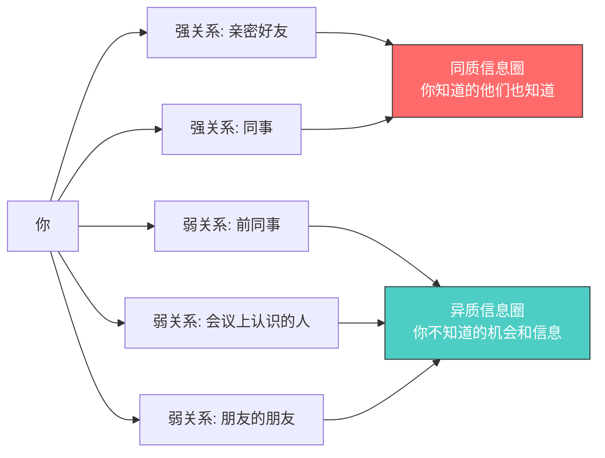
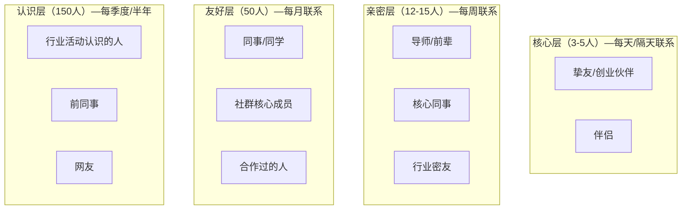
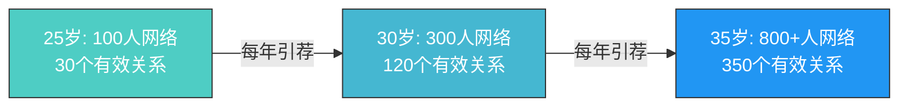

## 五、人脉构建：如何建立有价值的人际关系

> "你的网络就是你的净资产。" —— 波特·盖尔（Porter Gale）

在20-30岁的积累期，人脉的价值常常被两种极端观点扭曲：一种认为"人脉就是一切"，于是疯狂加微信、换名片，通讯录里躺着上千个联系人却从不联系；另一种认为"实力才是一切"，埋头苦干，认为社交是浪费时间。这两种观点都错了。

**真正的人脉，不是你认识多少人，而是在你需要帮助时，有多少人愿意且有能力帮你。** 这是一个关于"关系质量"而非"关系数量"的命题。斯坦福大学社会学家马克·格兰诺维特（Mark Granovetter）的经典研究《弱关系的力量》揭示了一个反直觉的事实：**真正给你带来关键机会的，往往不是你的亲密好友（强关系），而是那些你偶尔联系的熟人（弱关系）**。因为亲密好友和你处于同一个信息圈，而弱关系连接着你不知道的世界。

理解这个底层逻辑之后，我们才能系统地构建真正有价值的人际关系。

---

### 一、人脉的底层逻辑：关系资本理论

#### 1.1 什么是社会资本

法国社会学家皮埃尔·布迪厄（Pierre Bourdieu）在1986年首次系统定义了"社会资本"（Social Capital）：**个人或群体通过拥有的持久性关系网络而获得的实际或潜在资源的总和**。

与金融资本（钱）和人力资本（技能）不同，社会资本有三个独特属性：

| 属性 | 金融资本 | 人力资本 | 社会资本 |
|------|----------|----------|----------|
| 存储方式 | 银行账户 | 大脑和身体 | 人际关系网络 |
| 积累速度 | 线性增长 | 逐步积累 | 指数级爆发 |
| 贬值风险 | 通胀侵蚀 | 技术过时 | 关系疏远 |
| 可转移性 | 完全可转移 | 部分可转移 | 高度情境化 |
| 杠杆效应 | 低（本金有限） | 中（一人之力） | 高（网络效应） |

社会资本的核心特征是**网络效应**：你的关系网络每增加一个节点，整个网络的价值不是线性增加，而是指数级增加。这类似于梅特卡夫定律（Metcalfe's Law）——网络的价值与节点数的平方成正比。

#### 1.2 弱关系的力量

格兰诺维特在1973年的研究中发现，在找工作这件事上，**83%的人是通过"偶尔联系的人"（弱关系）获得信息的**，只有17%是通过"经常联系的亲密好友"（强关系）。

为什么？可以用一个信息理论的框架来理解：



强关系的信息价值低，不是因为他们不想帮你，而是因为你们在同一个信息圈里——你知道的机会他们也知道，他们知道的机会你也知道。**弱关系的价值在于它跨越了不同的社交圈子，成为信息的"桥梁"。**

但这并不意味着强关系不重要。后来的研究者罗纳德·伯特（Ronald Burt）提出了"结构洞"（Structural Holes）理论，进一步完善了这个框架：

- **弱关系**提供信息——让你知道"有什么机会"
- **强关系**提供影响力——帮你在关键时刻"推动决策"
- **桥接关系**（连接不同圈子的人）提供控制——让你成为信息枢纽

#### 1.3 邓巴数：你的社交带宽是有限的

英国人类学家罗宾·邓巴（Robin Dunbar）通过研究灵长类动物的大脑皮层比例，提出了著名的"邓巴数"（Dunbar's Number）：**人类能够维持的稳定社交关系上限约为150人**。

这个150人还可以进一步分层：

| 层级 | 人数 | 关系特征 | 互动频率 | 对应场景 |
|------|------|----------|----------|----------|
| 核心层 | 3-5人 | 极度亲密，危机时的依靠 | 每天或隔天 | 伴侣、挚友、创业合伙人 |
| 亲密层 | 12-15人 | 深度信任，相互了解近况 | 每周至少一次 | 好友、核心团队成员 |
| 友好层 | 50人 | 社交互动频繁，互有好感 | 每月1-2次 | 同事、同学、兴趣社群核心成员 |
| 认识层 | 150人 | 能叫出名字，了解基本背景 | 每季度或半年 | 行业活动认识的人、前同事 |
| 泛社交层 | 500-1500人 | 能认出脸，有基本印象 | 年度或不定期 | 社交媒体上的联系人 |

这个分层告诉我们一个关键道理：**不要试图和所有人建立深度关系，你的认知带宽不允许。** 正确的策略是——对不同层级的关系采用不同的维护策略。

---

### 二、20-30岁的人脉构建策略

#### 2.1 两个阶段的策略差异

根据本章的整体框架，人脉构建同样分为两个阶段：

**20-25岁：广泛链接期**

这个阶段的核心是"播种"——通过大量接触不同领域、不同层级的人，建立初始关系网络。具体策略：

- **参加行业活动和会议：** 至少每两周参加一次线下活动。选择标准：有你感兴趣的议题、有你想要接触的人群、有机会与人深入交流（纯听讲座的活动价值较低）。
- **加入专业社群：** 不要只加微信群，要选择有质量门槛的社群。付费社群通常优于免费社群，因为付费本身就是一层筛选。
- **利用校友网络：** 校友是最容易建立信任的关系——共同的母校是一个天然的信任锚点。参加校友会活动，主动联系同校学长学姐。
- **做"连接者"：** 当你发现两个人互相需要但不认识时，主动做介绍人。这个行为的成本几乎为零，但会同时加深你与两个人的关系。

**25-30岁：精准深耕期**

这个阶段的核心是"修剪"——淘汰无效社交，把有限的时间精力集中在5-10个核心关系上。具体策略：

- **建立"人脉组合"：** 像管理投资组合一样管理你的人脉。你的"关系组合"应该包含：一个在你职业领域比你资深的导师、一个跨行业但价值观相似的密友、一个信息灵通的"消息灵通人士"、一个擅长具体技术的"实干家"、一个在政府部门或公共机构有资源的人。
- **从"社交"转向"共建"：** 最深度的关系不是靠饭局建立的，而是靠共同完成一件事情建立的。一起做一个项目、共同组织一次活动、合伙做一个副业——这些"共建"经历会产生远超社交的信任和默契。
- **建立定期维护机制：** 对核心层的5-10个人，建立每月至少一次深度交流的机制。不需要正式的"见面聊"，可以是一次视频通话、一次信息分享、一次共同参加的活动。

#### 2.2 人脉构建的"价值交换"模型

很多人对"人脉"有误解，认为人脉就是"求人办事"。实际上，**可持续的人脉关系本质上是价值交换**——不是功利的交易，而是双向的价值流动。

你可能觉得"我只是一个刚工作的年轻人，没什么价值可以交换"。这是一个认知误区。价值不等于金钱或权力，它可以是多种形式的：

| 价值类型 | 具体形式 | 适合20-25岁 | 适合25-30岁 |
|----------|----------|:-----------:|:-----------:|
| 信息价值 | 行业资讯、新兴趋势、技术动态 | ✅ | ✅ |
| 技能价值 | 帮忙做PPT、数据分析、写代码、翻译 | ✅ | ✅ |
| 连接价值 | 介绍合适的人互相认识 | ✅ | ✅ |
| 情绪价值 | 倾听、鼓励、提供不同的视角 | ✅ | ✅ |
| 时间价值 | 帮忙跑腿、查资料、整理文档 | ✅ | ❌（逐步减少） |
| 资源价值 | 提供资金、渠道、平台 | ❌ | ✅（逐步增加） |

**关键原则：先提供价值，再寻求回报。** 这不是让你做老好人，而是建立一种"互惠预期"——当你持续为他人提供价值时，你自然成为他人愿意帮助的人。

哈佛商学院教授亚当·格兰特（Adam Grant）在《Give and Take》一书中将人分为三类：给予者（Giver）、索取者（Taker）和互利者（Matcher）。研究发现，**给予者在长期来看是最成功的，但也是最容易失败的**——区别在于他们是否设立了健康的边界。

作为20-30岁的年轻人，最佳策略是：**做一个"有策略的给予者"**——

1. **有选择地给予：** 不是无差别地对所有人好，而是把精力集中在那些懂得感恩、有潜力、会回报的人身上。
2. **给予有上限：** 如果你发现自己总是付出而对方从不回应，这就是一个信号——这段关系可能不值得继续投入。
3. **给予要可见：** 你的付出不需要声张，但也不应该被埋没。适度让对方知道你的帮助是有成本的，这会让对方更珍惜你的善意。

---

### 三、实操框架：从零开始构建你的关系网络

#### 3.1 第一步：盘点现有关系

在开始"建设"之前，先做一次"审计"。拿出一张纸（或打开一个表格），把你现有的重要关系列出来，按以下维度评估：

```text
关系审计模板
============
姓名：___________
关系类型：导师 / 同行 / 跨行业 / 朋友 / 其他
认识时间：___________
互动频率：每天 / 每周 / 每月 / 每季度 / 很少
关系深度：1-5分（1=点头之交，5=可以托付性命）
价值方向：他能给我什么 / 我能给他什么
潜力评估：这段关系未来3年可能带来什么
行动建议：_____________
```

大多数人在做完这个审计后会发现两个事实：

1. **80%的社交时间花在了20%的关系上**，但这些关系不一定是最有价值的。
2. **有很多高潜力的关系被你忽视了**——那些你认识但很少联系的人，可能正是最有价值的弱关系。

#### 3.2 第二步：绘制你的关系地图

用一个简单的同心圆模型来可视化你的关系网络：



绘制完成后，问自己三个问题：

1. **有没有空缺？** 比如你的圈子里完全没有跨行业的人，或者没有比你资深的导师。
2. **有没有失衡？** 比如核心层全是同事，这意味着你的社交圈和工作圈完全重叠，一旦换工作就可能失去大部分关系。
3. **有没有"僵尸关系"？** 那些你曾经很亲近但已经很久没联系的人，是否值得重新激活？

#### 3.3 第三步：制定主动社交计划

基于关系地图的分析，制定一个具体的社交行动计划：

**周计划模板：**

```text
本周社交行动计划
================
[ ] 联系1个亲密层的人：___________（方式：_______）
[ ] 联系1个友好层的人：___________（方式：_______）
[ ] 参加1次行业活动/社群讨论
[ ] 为1个人提供帮助/分享有价值的信息
[ ] 记录本周社交笔记（在CRM或笔记本中更新）
```

**月度复盘问题：**

1. 本月新增了几个有价值的认识？
2. 本月维护了几个重要关系？
3. 本月为他人提供了什么价值？
4. 本月从关系中获得了什么信息或机会？
5. 下个月的社交重点是什么？

#### 3.4 第四步：建立关系维护系统

不要依赖记忆来维护关系——人脑不擅长这个。建立一个简单的系统：

**工具选择（从轻到重）：**

| 工具 | 适合人群 | 优势 | 劣势 |
|------|----------|------|------|
| 备忘录/笔记App | 刚开始社交规划的人 | 零成本，随时记录 | 无提醒，不易检索 |
| 微信标签+朋友圈互动 | 社交需求较简单的人 | 不需要额外工具 | 功能有限 |
| Notion/飞书多维表格 | 喜欢系统化管理的人 | 灵活，可定制 | 需要时间维护 |
| 专业CRM工具 | 社交网络较大、有商业目的的人 | 功能完善，自动提醒 | 学习成本高 |

**最低可行系统（MVP）——微信标签法：**

1. 把微信好友按关系层级打标签：核心、亲密、友好、认识
2. 每周一花10分钟浏览各标签下的好友，找到需要联系的人
3. 对于需要维护的关系，用以下方式自然地保持联系：
   - 分享一篇你认为对方会感兴趣的文章
   - 对方朋友圈发了动态，认真评论（不是点赞）
   - 遇到与对方领域相关的新闻/信息，发消息告知
   - 节假日发送个性化的祝福（不是群发模板）

---

### 四、向上社交：如何接触比你高层级的人

向上社交是20-30岁人脉构建中最重要也最难的部分。你想要接触的那些人——行业前辈、公司高管、成功创业者——他们的时间是最稀缺的资源，凭什么给你？

#### 4.1 向上社交的核心原则

**原则一：不要"求"，要"给"。**

大多数人向上社交的方式是："X老师，能不能请您吃个饭，我想请教一些问题？" 这句话的潜台词是："请花您一小时的宝贵时间来免费帮我。" 对于一个每天收到几十条类似消息的人来说，这是一个负价值请求。

正确的做法是先提供价值。比如：

- "X老师，我注意到您最近在关注A领域，我刚好做了一些研究，整理了一份笔记，分享给您参考。"
- "X老师，我读了您关于B的文章，发现了一些相关的数据，补充在了这张图里。"
- "X老师，我帮您把C会议的要点整理成了摘要。"

这些行为的共同特点是：**花你的廉价时间，节省对方的昂贵时间。** 这就是最高效的价值交换。

**原则二：不要仰视，要平视。**

向上社交最大的心理障碍是"仰视心态"——觉得对方太厉害了，自己不配。这种心态会让你表现得紧张、不自然，反而降低了对方和你交流的意愿。

正确的心态是：**我尊重你的成就，但我们是平等的个体。** 我有我的问题和困惑，你有你的经验和见解，我们之间的交流是互利的——你获得了新鲜视角和信息，我获得了指导和启发。

**原则三：要具体，不要笼统。**

"想请教一些问题"是最糟糕的开场白。它让对方不知道要花多少时间、讨论什么话题、需要做什么准备。

正确的方式是：**提出一个具体、有边界的问题。** 比如：

- "我在做X项目时遇到了Y问题，尝试了Z方法但效果不好。我查了A和B资料，但还是没找到答案。您在这个领域有丰富的经验，能否给我一个方向性的建议？（预计占用您5分钟）"

这个请求之所以有效，是因为它展示了：你已经做了功课（不是伸手党）、你的问题有边界（不会变成无底洞）、你尊重对方的时间。

#### 4.2 向上社交的具体渠道

| 渠道 | 适用场景 | 操作难度 | 成功率 |
|------|----------|:--------:|:------:|
| 行业会议/活动 | 认识行业大咖 | 中 | 低（竞争激烈） |
| LinkedIn/脉脉 | 直接触达行业人士 | 低 | 中（取决于消息质量） |
| 共同朋友介绍 | 建立初始信任 | 中 | 高（有信任背书） |
| 内容平台互动 | 通过评论/分享建立存在感 | 低 | 中（需要持续） |
| 参与对方的项目/课程 | 自然地建立关系 | 高 | 高（有共同经历） |
| 被引荐/推荐 | 最高效的方式 | 高 | 最高 |

**成功率最高的策略是"间接路径"**——不要直接联系目标人物，而是先和他圈子里的人建立关系，通过中间人的引荐来接触。这种方式自带信任背书，成功率远高于冷启动。

#### 4.3 向上社交的常见错误

**错误一：一上来就求帮忙找工作/内推。** 这等于在说"我们的关系就是你帮我"。正确做法：先建立多次有价值的互动，在关系自然发展到一定程度后再提出请求。

**错误二：在公开场合让人难堪。** 比如在大会上当众问一个尖锐的问题让对方下不来台，你以为展示了自己，实际上对方记住的是"这个人让我难堪了"。

**错误三：过度刷存在感。** 在对方每条动态下都留言、每隔几天就发消息，这不是维护关系，是打扰。**社交的最高境界是让对方觉得你"不卑不亢，恰到好处"。**

**错误四：只和一个人深度绑定。** 把所有社交精力都放在一个"贵人"身上是非常危险的策略——如果这个人换了赛道、出了问题，你就失去了整个关系网络。正确做法是维护一个"导师组合"，每个导师在不同维度给你不同的帮助。

---

### 五、横向社交：如何与同龄人建立深度连接

如果向上社交是"获取信息和资源"，横向社交就是"建立联盟"。25-30岁的同龄人，在10年后会成为各行各业的中坚力量。今天你和他们的连接，就是未来你最强大的跨行业资源网络。

#### 5.1 横向社交的核心策略

**策略一：寻找"互补型"而非"相似型"的朋友。**

人类天性喜欢和自己相似的人待在一起（社会心理学称之为"同质性偏好"），但最有价值的横向关系往往是互补的。你的关系网络里应该有：

- **不同行业的人：** 一个程序员、一个市场营销人、一个金融从业者、一个教育工作者——他们的视角和信息完全不同。
- **不同能力的人：** 你擅长数据分析，对方擅长内容创作；你擅长技术实现，对方擅长商业模式设计。
- **不同性格的人：** 如果你偏内向理性，找一个外向感性的朋友；如果你偏保守，找一个敢于冒险的朋友。

**策略二：通过"共建"建立深度关系。**

最牢固的横向关系不是通过饭局建立的，而是通过共同完成一件事情建立的。具体的共建形式包括：

- **共同做一个副业项目：** 你出技术，对方出运营；你出内容，对方出渠道。
- **共同组织一个社群/活动：** 比如行业读书会、技术分享会、创业交流会。
- **共同学习一项新技能：** 比如一起考证、一起参加培训、一起读MBA。
- **互相做个"顾问"：** 定期见面，互相汇报近况，给对方提建议。

这些共同经历产生的信任和默契，远超无数次饭局和微信聊天。

**策略三：做关系网络中的"连接者"。**

在你的关系网络中，谁是最有价值的人？不是最有钱的，不是最有名的，而是**连接了最多不同圈子的人**——这就是"连接者"。

成为一个好的连接者，需要三个能力：

1. **信息收集能力：** 了解每个人擅长什么、需要什么。
2. **匹配能力：** 能够快速判断"谁和谁应该认识"。
3. **撮合能力：** 能够用自然、不尴尬的方式介绍两个人认识。

一个好的介绍话术模板：

> "介绍你们认识一下。[A]，这是[B]，他在做[领域]，最近在[项目/方向]上取得了[具体成果]。[B]，这是[A]，他是[领域]的专家，我觉得你们在[共同话题]上可以有很多交流。"

这段话的要点是：**双向介绍，双方都展示了价值，指出了共同话题，让对话能够自然开始。**

#### 5.2 横向社交的渠道与方法

**线下渠道：**

| 渠道 | 优势 | 注意事项 |
|------|------|----------|
| 行业沙龙/分享会 | 有共同话题，交流门槛低 | 选择有互动环节的活动 |
| 兴趣社群（跑步、读书、桌游） | 轻松自然，容易建立个人层面的了解 | 不要太功利，先交朋友再谈合作 |
| 行业培训/课程 | 同学关系天然有信任基础 | 课后保持联系，不要上完课就断了 |
| 创业孵化器/联合办公空间 | 大量同频的创业者和自由职业者 | 积极参与公共活动 |

**线上渠道：**

| 渠道 | 优势 | 注意事项 |
|------|------|----------|
| 专业社群（知识星球、Discord） | 质量高，主题聚焦 | 先输出价值，再建立关系 |
| 开源社区（GitHub） | 通过贡献代码建立技术信任 | 持续参与比一次性贡献更有效 |
| 内容平台（知乎、B站、公众号） | 通过内容吸引同频的人 | 互动是双向的，要回复评论 |
| 行业论坛/V2EX/SegmentFault | 信息密度高，从业者聚集 | 参与讨论展示专业度 |

---

### 六、数字时代的人脉管理

#### 6.1 微信社交的高级策略

微信是中国人维护关系的主要工具，但大多数人只用了它20%的功能。

**标签系统搭建：**

```text
关系层级标签：
  ├── 核心（3-5人）
  ├── 亲密（12-15人）
  ├── 友好（50人）
  └── 认识（150人）

来源标签：
  ├── 校友-XX大学
  ├── 前司-XX公司
  ├── 活动-XX会议
  └── 社群-XX群

能力标签：
  ├── 技术大牛
  ├── 商业敏锐
  ├── 资源丰富
  └── 内容创作者
```

**朋友圈互动策略：**

朋友圈是维护弱关系最低成本的方式。但大多数人只是"刷一刷，点个赞"，这几乎没有社交价值。有效的策略是：

1. **认真评论，而不是点赞。** 一条有内容的评论（"这个观点很有启发，我在XX项目中也遇到过类似的情况……"）比100个赞更有价值。
2. **分享有价值的内容到朋友圈。** 不要只发吃喝玩乐，定期分享行业观点、读书笔记、工作思考——这会让你在弱关系眼中保持"专业形象"。
3. **针对特定人群发可见内容。** 微信的"部分可见"功能可以让你针对不同标签的人分享不同的内容。

#### 6.2 线上社交的黄金法则

**法则一：延迟满足，不要急于求成。**

线上建立信任需要时间。一个有效的节奏是：

```text
第1次互动：评论/回复对方的内容
第2次互动：私信分享一个对方可能感兴趣的信息
第3次互动：提出一个具体的小问题
第4次互动：约一个简短的线上交流（15-30分钟）
第5次互动：线下面基/深度交流
```

这个过程通常需要1-3个月。急于跳过这些步骤直接"约饭请教"，成功率极低。

**法则二：建立"可搜索性"。**

让你自己在搜索引擎和社交平台上"被找到"。具体做法：

- 在知乎、GitHub、公众号等平台持续输出专业内容
- 确保你的LinkedIn/脉脉资料是最新的、专业的
- 在行业论坛和社群中有一定的发言记录

当有人搜索"XX领域+你的城市"时，你能够出现在结果中，这就是最好的被动社交。

**法则三：管理你的"社交能量"。**

社交不是无限的资源。内向的人尤其需要注意管理社交能量——一周安排太多社交活动会导致疲劳，反而降低社交质量。

一个实用的能量管理框架：

- **内向型性格：** 每周1-2次线下社交活动，其余时间用线上方式维护关系。社交活动后给自己留出独处恢复的时间。
- **外向型性格：** 可以安排更多社交活动，但要注意深度——参加10个活动但都是浅尝辄止，不如深入参与3个活动。
- **通用建议：** 每周留出至少一个完整的"社交日"，集中处理社交事务（约人见面、回复消息、维护关系），其余时间专注于工作和学习。

---

### 七、人脉维护的常见误区与纠正

#### 误区一：把"加微信"当作"建立人脉"

**症状：** 参加一次活动加了50个人的微信，觉得自己的人脉扩展了。但这些人大部分再也没有联系过。

**真相：** 加微信只是建立了"通讯渠道"，不是建立了"关系"。关系的建立需要时间、互动和信任的累积。

**纠正：** 每次活动后，花10分钟给新加的人发一条个性化的消息（"今天在XX活动上听了你的分享，关于XX的观点很有启发"）。然后在接下来的一个月内，找机会与其中3-5人进行更深入的交流。

#### 误区二：只维护"有用"的关系

**症状：** 判断一个人"有没有用"才决定要不要维护关系。觉得对方"用不上"就疏远了。

**真相：** 你无法准确预测谁未来会变得"有用"。今天看起来"没用"的人，5年后可能成为某个领域的专家。而且，功利化的社交方式会被人感知到——没有人喜欢被当作"工具人"。

**纠正：** 用"这个人是否有趣/有潜力/价值观相似"来判断是否维护关系，而不是"这个人对我有没有直接利益"。

#### 误区三：社交=吃饭喝酒

**症状：** 所有的社交活动都是吃饭、喝酒、唱K。觉得不去饭局就不算社交。

**真相：** 饭局是最低效的社交方式——大家喝酒吹牛，第二天什么都不记得。真正有价值的社交发生在有共同活动、有深度交流的场景中。

**纠正：** 用"共建型"社交替代"消费型"社交。一起运动、一起做项目、一起参加培训、一起旅行——这些共同经历产生的连接远比饭局深刻。

#### 误区四：维护关系=打扰别人

**症状：** 总觉得联系别人是"打扰"，不好意思主动发消息、约人见面。

**真相：** 大多数人和你一样想，但都在等对方先联系。你不主动，对方也不主动，关系就这样慢慢淡了。

**纠正：** 把维护关系当作一种"习惯"而非"打扰"。找一个自然的借口：分享一篇好文章、祝贺对方的新成就、问候一下近况。关键是要真诚，不要让人觉得你在"没话找话"。

#### 误区五：忽视"非功利性关系"

**症状：** 只重视能带来职业帮助的关系（同事、领导、客户），忽视兴趣爱好、家庭生活中的关系。

**真相：** 人生不只是工作。那些在你低谷时陪伴你的朋友、在你迷茫时鼓励你的家人、和你一起运动的伙伴——这些"非功利性关系"对你的幸福感和心理健康至关重要。而心理健康是一切成就的基础。

**纠正：** 在你的关系维护计划中，专门留出时间给家人和挚友。他们不需要你"有用"，只需要你"在"。

---

### 八、高阶话题：人脉的复利效应

#### 8.1 社交资本的复利

如果你在25岁时拥有一个包含100人的有效关系网络，其中30人每年能为你提供一次有价值的信息或机会，到35岁时，假设每个人又为你引荐了2个新关系，你的有效网络将扩展到300+人。这就是社交资本的复利效应。



但这有一个前提：**你必须持续投入时间维护这些关系**。社交资本和金融资本一样，不维护就会贬值。一个3年没联系的人，你已经不是他的"关系"了，只是通讯录里的一个名字。

#### 8.2 从人脉到影响力

人脉的终极价值不是"认识谁"，而是**通过关系网络放大你的影响力**。在25-30岁这个阶段，你应该开始思考：

1. **我能不能成为某个圈子里的"信息枢纽"？** 如果你的朋友圈里，不同行业的人在遇到跨领域问题时第一个想到的就是你，你就成了一个"枢纽节点"——这比你认识多少人都更有价值。

2. **我能不能通过关系网络做一些"一个人做不了的事"？** 比如组织一个跨行业的项目、撮合一个商业合作、发起一个公益行动。这些事情的影响力远超你个人能力的边界。

3. **我的关系网络是否有"不可替代性"？** 如果你的关系网络只是"认识一些人"，那你随时可以被替代。但如果你连接了两个本来不相关的圈子，而这个连接产生了独特的价值，你就变得不可替代。

#### 8.3 人脉与个人品牌的协同

回到本章的整体框架，人脉构建和前文讨论的个人品牌是相互增强的关系：

- **个人品牌让你更容易被发现** → 减少社交的冷启动成本
- **人脉网络扩大你的传播范围** → 加速个人品牌的建立
- **个人品牌为你提供社交货币** → 让你在关系中有更多"可交换的价值"
- **人脉网络提供真实反馈** → 帮你校准个人品牌的定位

最理想的状态是：你的个人品牌吸引人们主动来找你，而你的人脉网络让你能够高效地回应和整合这些机会。

---

### 九、本节核心要点总结

| 原则 | 要点 | 行动建议 |
|------|------|----------|
| 弱关系理论 | 真正的机会来自弱关系 | 保持和维护150人左右的弱关系网络 |
| 价值交换 | 可持续的关系基于双向价值 | 先提供价值，再寻求回报 |
| 分层管理 | 不同层级的关系需要不同的维护策略 | 建立标签系统，定期审视关系组合 |
| 向上社交 | 接触高层级的人需要策略 | 先提供价值，具体请求，尊重时间 |
| 横向联盟 | 同龄人是未来最重要的资源 | 通过"共建"而非"饭局"建立深度关系 |
| 数字管理 | 工具化管理你的关系网络 | 建立标签系统和定期联系机制 |
| 避免误区 | 功利化社交是最大的陷阱 | 用真诚和长期主义来指导社交行为 |
| 复利效应 | 社交资本会指数级增长 | 持续投入，耐心等待回报 |

**最后一条建议：社交的终极目标不是"认识更多人"，而是"成为一个值得被认识的人"。** 当你持续提升自己的能力、扩大自己的视野、输出自己的价值时，高质量的关系会自然向你聚集。这不是心灵鸡汤，这是社会资本理论的核心发现——**你的关系网络的质量，永远无法超越你自身的质量。**
