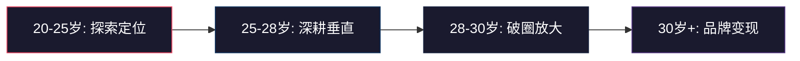
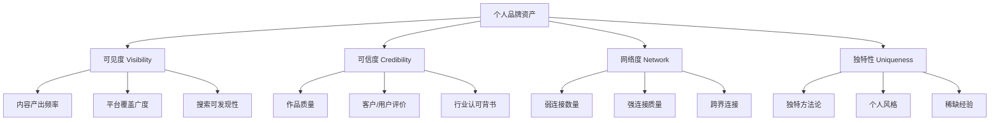
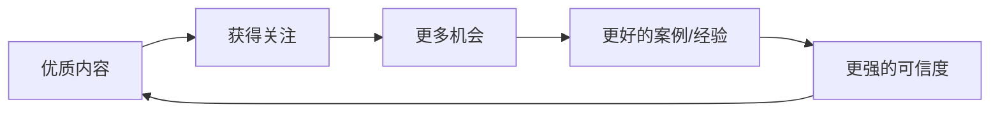
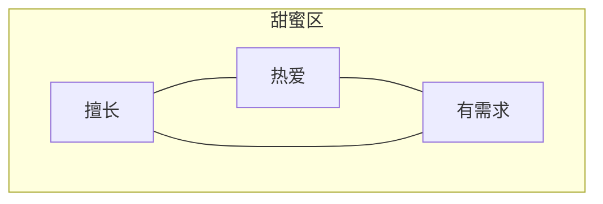
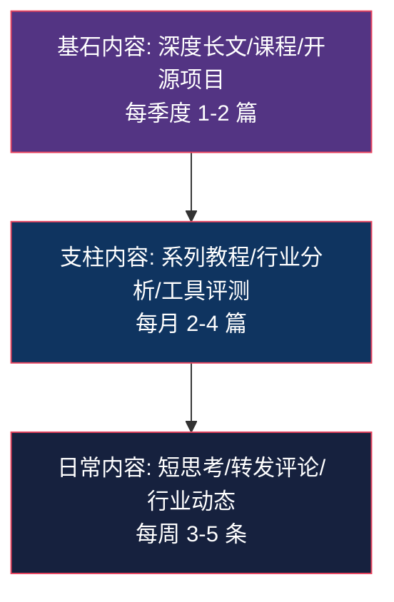
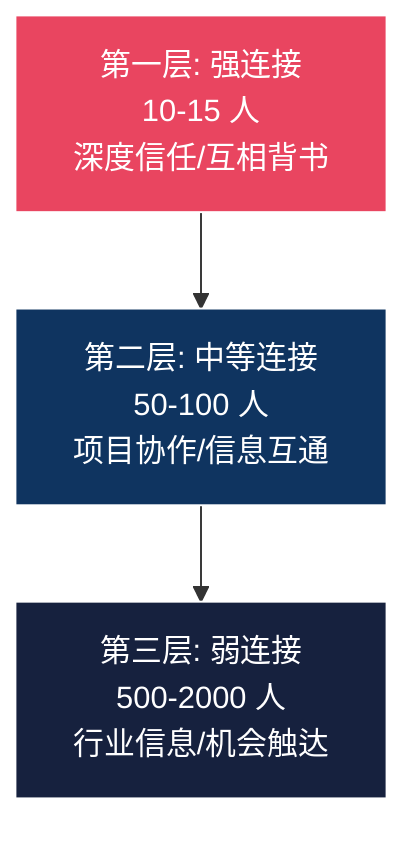
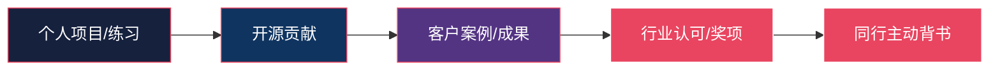
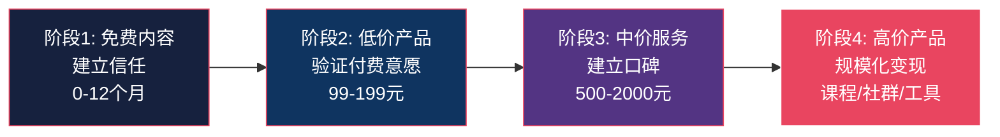

## 六、个人品牌：如何在行业内建立影响力

### 1. 为什么 20-30 岁是建立个人品牌的黄金窗口

个人品牌不是名人的专利。它指的是：当你不在场时，别人如何描述你、评价你、记住你。每一次交付质量、每一条朋友圈、每一次公开表达，都在为你的个人品牌投票。

20-30 岁建立个人品牌有三个结构性优势：

**时间复利效应**。25 岁开始持续输出，到 30 岁就有 5 年的内容资产和行业认知积累。同样的内容量，30 岁开始只能积累到 35 岁。品牌是时间的朋友——越早开始，复利越大。

**试错成本低**。这个阶段没有房贷、家庭等刚性支出压力，可以大胆尝试不同定位。失败了换一个方向重来，代价不过几个月时间。到了 35 岁，一次定位失误可能意味着收入断档。

**行业新人红利**。作为行业新人，你的视角天然具有"初学者同理心"，这恰恰是内容创作的稀缺资源。资深人士讲不清楚的入门痛点，你能精准捕捉。

### 2. 个人品牌的底层逻辑

#### 2.1 品牌 = 认知占位

个人品牌的本质是在目标受众大脑中占据一个认知位置。这个位置由三个要素决定：

| 要素 | 含义 | 示例 |
|------|------|------|
| **领域** | 你在哪个圈子被认可 | "前端性能优化"而非泛泛的"程序员" |
| **能力** | 你能解决什么具体问题 | "帮电商网站把首屏加载时间压到 1 秒内" |
| **差异** | 你和同领域的人有什么不同 | "用 Rust 重写 Node.js 性能瓶颈模块" |

三者缺一不可。只有领域没有能力，是纸上谈兵；只有能力没有差异，泯然众人；只有差异没有领域，不知道你到底是谁。

#### 2.2 品牌资产的四个维度

**可见度**决定有多少人知道你。**可信度**决定知道你的人是否信任你。**网络度**决定信任你的人能否为你带来新机会。**独特性**决定这些机会是否只属于你。

四个维度的优先级：先建立可信度（用作品说话），再提升可见度（让更多人看到），同时经营网络度（连接关键节点人物），持续强化独特性（形成不可替代性）。

#### 2.3 个人品牌的飞轮效应

个人品牌一旦进入正循环，会产生自我强化的飞轮：

关键在于启动阶段——飞轮从静止到转动需要最大的力。这个"力"就是你前 6 个月的持续高质量输出，即使没有即时回报。

### 3. 定位：找到你的品牌支点

#### 3.1 定位三圈模型

找到三个圆的交集：

- **你擅长什么**（能力圈）：你做得比大多数人好的事
- **你热爱什么**（兴趣圈）：你愿意免费花时间钻研的事
- **市场需要什么**（需求圈）：有人愿意为此付费或花注意力的事

**常见误区**：只看"市场需求大"就冲进去。没有能力和热爱支撑，你会在 3 个月内放弃。

#### 3.2 垂直细分的"一厘米宽、一公里深"策略

不要做"懂 Python 的程序员"，要做"用 Python 做量化交易的工程师"。不要做"设计师"，要做"专注 B2B SaaS 产品 Landing Page 转化率优化的设计师"。

垂直细分的判断标准：

| 维度 | 过窄的信号 | 合适的信号 | 过宽的信号 |
|------|-----------|-----------|-----------|
| 受众规模 | 全国不到 1000 人关心 | 1 万-50 万目标人群 | 和"互联网从业者"一样大 |
| 内容持续性 | 写 10 篇就写完了 | 可以持续写 100 篇以上 | 每篇都泛泛而谈 |
| 变现路径 | 找不到付费场景 | 有明确的服务/产品场景 | 不知道谁会为此付钱 |
| 竞争格局 | 完全空白（可能没需求） | 有 3-10 个成熟玩家 | 头部已被垄断 |

#### 3.3 定位声明模板

用一句话说清楚你是谁、服务谁、解决什么问题：

> 我是 [名字]，帮助 [目标人群] 通过 [方法/手段] 实现 [具体结果]。

示例：
- "我是张明，帮助 0-3 年经验的前端工程师通过系统化刷题+项目实战拿到大厂 Offer。"
- "我是李薇，帮助独立开发者通过 SEO + 内容营销实现产品月收入破万。"

这句话将成为你所有平台 Bio、演讲开场、社交场合自我介绍的核心素材。

### 4. 内容策略：用内容建立权威

#### 4.1 内容金字塔

**基石内容**（Cornerstone Content）：是你最有分量的作品。一篇 5000 字以上的深度分析、一个完整的开源项目、一套系统课程。这类内容建立权威感，会被反复引用和传播。每季度产出 1-2 篇足够。

**支柱内容**（Pillar Content）：系统化的中等篇幅内容。比如"Vue3 性能优化系列"（5 篇）、"2026 前端工具链全景图"。这类内容展示你的专业深度，每月 2-4 篇。

**日常内容**（Daily Content）：保持存在感的轻量内容。转发行业新闻时加上自己的独到见解、回答社区问题、分享工作中的小发现。每周 3-5 条。

#### 4.2 内容选题的四个来源

| 来源 | 方法 | 产出示例 |
|------|------|---------|
| **痛点驱动** | 收集目标受众最常问的问题 | "为什么你的 Webpack 构建要 5 分钟？5 个立即生效的优化方案" |
| **经验萃取** | 把自己的项目经验抽象成方法论 | "我在日活千万的项目中学到的 5 个缓存设计原则" |
| **趋势解读** | 对新技术/行业事件给出专业判断 | "React Server Components 到底解决了什么问题？一年后的真实体验" |
| **对比测评** | 横向对比工具/方案/框架 | "2026 年 5 大 JS 状态管理方案深度对比：性能、DX、生态全面评测" |

#### 4.3 内容创作的"钩子-骨架-肌肉"框架

每篇内容都应遵循这个结构：

**钩子**（前 3 句话）：制造认知冲突或好奇心。不要以"今天我们来聊聊 XX"开头。
- 差："本文介绍一下 React Hooks 的使用方法。"
- 好："你的 React 组件每天重新渲染 3000 次，其中 2800 次是完全不必要的。看完这篇，你能砍掉其中的 90%。"

**骨架**（逻辑结构）：用清晰的层级组织信息。每个 H2 是一个独立论点，H3 是支撑论据。

**肌肉**（具体细节）：代码示例、数据对比、真实截图、操作步骤。空洞的论述是骨头没肉，读者看完记不住任何东西。

#### 4.4 长青内容 vs 时效内容

| 类型 | 生命周期 | 占比建议 | 示例 |
|------|---------|---------|------|
| 长青内容 | 2-5 年不过时 | 60% | 算法原理、设计模式、职业规划方法论 |
| 时效内容 | 3-6 个月热度 | 30% | 新框架评测、行业事件分析、年度盘点 |
| 互动内容 | 1-2 周活跃期 | 10% | 投票、问答、挑战赛 |

长青内容是品牌资产的核心。一篇好的长青文章可以在 3 年内持续带来搜索流量和新关注者。

### 5. 平台选择与运营策略

#### 5.1 主流平台特性对比

| 平台 | 内容形式 | 流量机制 | 适合阶段 | 品牌建设效率 |
|------|---------|---------|---------|-------------|
| **GitHub** | 代码/项目/文档 | 搜索+推荐 | 所有阶段（技术人必备） | ★★★★★ |
| **掘金/思否** | 技术长文 | 推荐+搜索 | 起步期 | ★★★★ |
| **知乎** | 问答+专栏 | 搜索+推荐 | 起步期-成长期 | ★★★★ |
| **公众号** | 图文 | 社交传播 | 成长期 | ★★★ |
| **B 站** | 视频教程 | 推荐算法 | 成长期 | ★★★★ |
| **Twitter/X** | 短内容+Thread | 社交传播 | 所有阶段 | ★★★ |
| **小红书** | 图文/短视频 | 推荐算法 | 成长期（非技术受众） | ★★★ |
| **个人博客** | 所有形式 | SEO | 所有阶段（长期资产） | ★★★★★ |

#### 5.2 平台组合策略：1+2 模型

不要同时运营 5 个平台。选择 1 个主阵地 + 2 个辅助平台：

- **主阵地**：你投入 70% 精力的平台，内容最完整、最深度
- **辅助平台 A**：将主阵地内容改编后分发（降低创作成本）
- **辅助平台 B**：用于社交互动和获取灵感

**推荐组合**（技术领域）：
- 主阵地：GitHub + 个人博客（技术人的核心资产）
- 辅助 A：掘金/知乎（内容分发，获取搜索流量）
- 辅助 B：Twitter/X（行业社交，连接同行）

#### 5.3 SEO 思维：让内容持续被发现

个人博客和知乎等内容平台的内容会被搜索引擎收录。一篇 SEO 友好的文章可以在几年内持续带来新读者。

关键 SEO 实操：

1. **关键词研究**：用 Google Keyword Planner 或 5118 查找目标关键词的搜索量和竞争度。选择搜索量 500-5000/月、竞争度中低的长尾关键词。
2. **标题优化**：标题必须包含核心关键词，同时制造好奇心。"React 性能优化"不如"React 性能优化：从 3 秒到 0.3 秒的 7 个实战技巧"。
3. **结构化内容**：使用 H2/H3 标题层级、列表、表格，让搜索引擎理解内容结构。
4. **内链外链**：在文章中链接到自己的其他相关内容（内链），以及权威来源（外链）。

### 6. 网络建设：从弱连接到强背书

#### 6.1 社交资本的三层结构

**弱连接的力量**（格兰诺维特理论）：带来新机会的往往不是亲密朋友（强连接），而是不太熟的人（弱连接）。因为强连接和你处于同一个信息圈，而弱连接能带来你圈子之外的信息和机会。

但这不意味着弱连接越多越好。关键是弱连接的**质量**——连接的是否是不同圈子、不同领域的关键节点人物。

#### 6.2 高效社交的五个策略

**策略一：先给予，后索取**

在社交初期，你的目标不是"获取资源"，而是"创造价值"。具体做法：

- 在社区中高质量地回答问题
- 主动分享对你有用的资源和信息
- 帮助他人连接他们需要的人脉
- 为他人的项目提供建设性反馈

**策略二：成为连接器**

连接器是指"认识 A 需要 B，就把 A 和 B 连接起来"的人。这个角色的价值在于：你是信息和资源的枢纽节点，所有人都需要通过你来获取跨圈资源。

**策略三：创造"共同经历"**

共同经历是建立信任最快的方式。一起做一个开源项目、一起组织一次技术分享、一起写一篇联合文章。这些共同创造的成果会成为你们关系的锚点。

**策略四：定期维护关系**

用一个简单的 CRM 系统（甚至只是一个 Excel 表格）记录关键联系人：

| 字段 | 说明 |
|------|------|
| 姓名 | - |
| 领域 | 他们的专业方向 |
| 近况 | 最近在做什么 |
| 上次联系 | 日期 |
| 互动频率建议 | 每月/每季度/每半年 |
| 能提供的价值 | 他们可能需要什么 |
| 备注 | 其他重要信息 |

每季度检查一次，给超过 3 个月没联系的重要联系人发一条有价值的信息（不是"在吗"，而是"看到这篇文章想到你之前提到的 XX 问题，觉得可能有用"）。

**策略五：参与或组织线下活动**

线下见面的信任建立效率是线上的 10 倍。参加行业会议、技术 Meetup、读书会。如果当地没有合适的活动，自己组织一个小型沙龙（3-8 人即可），你作为组织者自然成为节点人物。

### 7. 可信度建设：从"说得好"到"做得好"

#### 7.1 作品集比简历重要 100 倍

在个人品牌领域，"show, don't tell"是铁律。你说你擅长性能优化，不如直接展示一个开源项目的性能提升 PR（含 before/after 数据）。

可信度建设的阶梯：

**起步阶段**（0-6 个月）：做个人项目。写一个解决实际问题的工具、做一个完整的案例分析、复现一篇论文的实验结果。关键是**完整度**和**可验证性**。

**成长阶段**（6-18 个月）：参与开源。给知名项目提 PR、修复 Bug、完善文档。开源贡献是最硬的背书——代码是公开的，任何人都能验证你的能力。

**成熟阶段**（18 个月+）：积累客户案例。用数据说话："帮客户 X 将页面加载时间从 4.2 秒优化到 0.8 秒，转化率提升 23%"。

#### 7.2 获取社会证明的 7 种方式

1. **GitHub Star 和 Fork 数**：开源项目的受欢迎程度
2. **文章阅读量和互动数据**：内容的传播力
3. **客户评价和推荐信**：来自真实服务对象的背书
4. **行业大 V 的引用或转发**：来自权威人士的认可
5. **演讲邀请**：被邀请分享说明你被视为该领域的专家
6. **媒体采访或报道**：第三方媒体的客观报道
7. **证书和认证**：行业权威机构的认证（权重最低，但有总比没有好）

#### 7.3 演讲与分享：15 分钟建立深度信任

一次 15 分钟的技术分享，抵得上 10 篇博客文章的信任建立效率。因为演讲是实时的、不可伪造的，观众能直接判断你的专业水平。

演讲机会的获取路径：

1. **内部分享**：公司内部 Tech Talk，零门槛起步
2. **社区 Meetup**：本地技术社区的定期聚会，通常需要提交议题
3. **线上直播**：B 站/视频号技术直播，门槛最低
4. **行业会议**：需要有一定积累后申请，含金量最高

**第一次演讲的准备清单**：

- [ ] 选择你最熟悉的一个技术主题（不要选太大的题目）
- [ ] 准备 20-30 页幻灯片（每页一个核心信息）
- [ ] 至少包含 2 个代码演示或 Live Demo
- [ ] 排练 3 次以上，每次计时
- [ ] 录制一次排练视频回看，检查口头禅和肢体语言
- [ ] 准备 3 个可能的观众提问及回答

### 8. 变现路径：从影响力到收入

#### 8.1 个人品牌的五种变现模式

| 模式 | 启动门槛 | 收入天花板 | 时间投入 | 示例 |
|------|---------|-----------|---------|------|
| **求职加分** | 低 | 中（薪资溢价 20-50%） | 已有投入的副产品 | GitHub 项目被面试官看到 |
| **技术咨询** | 中 | 高（500-2000 元/小时） | 按项目计费 | 帮企业做架构评审 |
| **内容付费** | 中 | 中高（月入 1-5 万） | 前期高，后期被动 | 付费专栏、在线课程 |
| **社群运营** | 高 | 高（月入 2-10 万） | 持续运营 | 付费知识星球/会员群 |
| **产品变现** | 高 | 极高（无上限） | 持续迭代 | SaaS 工具、模板、插件 |

#### 8.2 变现阶段模型

**关键原则**：不要在还没有建立足够信任时就急于变现。过早收费会损害品牌。但也不要永远免费——免费内容吸引来的人不一定是你的目标客户。

#### 8.3 咨询定价策略

如果你选择技术咨询作为变现方式，定价参考：

| 经验年限 | 建议时薪（元） | 定价依据 |
|---------|--------------|---------|
| 1-2 年 | 200-500 | 有独特实操经验 |
| 3-5 年 | 500-1000 | 有成功案例和行业口碑 |
| 5 年以上 | 1000-3000 | 有行业影响力和稀缺专业能力 |

定价公式参考：时薪 = 你的目标年收入 ÷ 1000（假设每年有效咨询时间 1000 小时）。如果目标年收入 50 万，时薪应为 500 元。

### 9. 案例分析：个人品牌的三种典型路径

#### 9.1 技术开源路径

**案例**：某前端工程师从 2022 年开始在 GitHub 维护一个 Vue3 组件库。

- **第 1 年**：持续迭代组件，写技术博客记录设计决策，Star 数从 0 到 2000
- **第 2 年**：组件库被几家中型公司采用，收到第一个企业咨询邀请
- **第 3 年**：Star 数破万，出版技术书籍，开始做付费技术顾问（时薪 1500 元）

**关键动作**：选择了一个有真实需求的垂直领域（Vue3 企业级组件库当时空白），坚持每周提交代码，每两周写一篇技术博客。

#### 9.2 内容输出路径

**案例**：某数据分析师从 2023 年开始在知乎写数据分析教程。

- **第 1-3 个月**：每天回答 2 个数据分析相关问题，写 3 篇深度教程
- **第 4-6 个月**：知乎关注者破 5000，收到出版社邀约
- **第 7-12 个月**：开设付费专栏（定价 199 元），首月售出 300 份
- **第 2 年**：开设系统课程（定价 999 元），年收入突破 30 万

**关键动作**：选择了"数据分析"这个搜索需求大但优质内容稀缺的赛道，坚持日更回答，每篇教程都包含真实数据集和可运行代码。

#### 9.3 社群运营路径

**案例**：某后端工程师从 2024 年开始运营 Go 语言学习社群。

- **前 3 个月**：免费微信群，每天分享 Go 语言学习资料和解答问题
- **第 4 个月**：开设付费知识星球（年费 199 元），首月 200 人加入
- **第 6 个月**：组织线上编程挑战赛，社群活跃度大幅提升
- **第 12 个月**：付费会员 800 人，加上企业培训收入，年收入 25 万

**关键动作**：前期用 3 个月免费运营建立信任和口碑，转付费时已有足够多的"铁粉"做种子用户，后续靠活动和口碑自然增长。

### 10. 常见误区与纠正

#### 误区一：等我足够厉害了再开始

**真相**：你永远觉得不够厉害。"学习型内容"本身就是有价值的内容——把你学习过程中的困惑、探索、突破记录下来，对和你处于同一阶段的人有巨大价值。

**纠正**：今天就开始。写你的第一篇技术博客，哪怕只有 500 字，哪怕你觉得"这谁不知道"。记住，你比目标受众早一步就够了，不需要早十步。

#### 误区二：追求全平台覆盖

**真相**：同时运营 5 个平台 = 每个平台都做不好。内容创作的瓶颈不是分发渠道，而是持续产出高质量内容的能力。

**纠正**：选 1 个主阵地深耕，内容成熟后再做跨平台分发。分发时做适当改编（调整格式、标题、长度），不要简单复制粘贴。

#### 误区三：只输出不输入

**真相**：持续输出而不补充新知识，6 个月后你的内容就会开始重复和肤浅。

**纠正**：保持"输入-处理-输出"的节奏。每天阅读 30 分钟行业资讯，每周深度阅读 1 篇技术论文或长文，每月读 1 本相关书籍。把输入转化为输出：读完一篇文章后写一篇读后感或实践笔记。

#### 误区四：追热点而丢定位

**真相**：追热点带来的流量是暂时的，而且会模糊你的品牌定位。关注者不知道你到底是做什么的。

**纠正**：热点可以追，但必须和你的定位相关，并且用你的专业视角来解读。不相关的热点果断放弃。

#### 误区五：把数据当目标

**真相**：粉丝数、阅读量是虚荣指标。1000 个精准的目标受众，比 10 万个路人粉有价值得多。

**纠正**：关注转化指标——多少人因为你的内容联系你、多少人购买了你的产品、多少人引用了你的工作。质量永远大于数量。

#### 误区六：忽视负面反馈

**真相**：完全没有负面反馈可能意味着你的内容没有触及任何有争议的观点——也就是没有深度。

**纠正**：区分"噪音型负面反馈"（人身攻击、无理由差评）和"有价值的批评"（指出逻辑漏洞、补充不同视角）。前者忽略，后者感谢并回应。

### 11. 进阶策略：从个人品牌到品牌资产

#### 11.1 个人品牌的护城河

当你的品牌建立到一定程度后，需要思考如何让它变得不可替代：

**方法论护城河**：创造自己的术语和框架。比如"渐进式品牌建设模型""技术内容金字塔"——当别人开始引用你的术语时，你的品牌就嵌入了行业话语体系。

**社区护城河**：围绕你的品牌建立一个活跃的社区。社区的价值在于网络效应——成员之间的连接越多，社区越难被替代。

**数据护城河**：积累了大量独家的行业数据、案例库、工具集。这些数据资产是后来者无法快速复制的。

#### 11.2 品牌延伸与跨界

当主品牌稳固后，可以通过以下方式扩展：

- **从文字到视频**：在 B 站/YouTube 开设频道
- **从个人到团队**：招募协作者，建立品牌矩阵
- **从技术到商业**：从技术分享延伸到创业、投资领域
- **从线上到线下**：组织线下活动、训练营、工作坊

每次延伸都要确保新领域能借助已有品牌的势能，而不是从零开始。

#### 11.3 长期主义的心态建设

个人品牌建设是一场马拉松，不是百米冲刺。前 6 个月几乎看不到任何回报——这是最正常的。90% 的人在第 3 个月放弃。

给自己设定合理的过程目标而非结果目标：

| 结果目标（不可控） | 过程目标（可控） |
|-------------------|-----------------|
| 3 个月粉丝破万 | 每周发布 2 篇高质量内容 |
| 半年内月入过万 | 每月完成 1 个完整案例 |
| 一年内成为行业 KOL | 每季度做 1 次公开分享 |

关注你能控制的事情（输出频率、内容质量、学习深度），把结果交给时间。

### 12. 个人品牌自检清单

每月用这个清单评估你的品牌建设进展：

| 维度 | 检查项 | 状态 |
|------|--------|------|
| **定位** | 能否用一句话说清你是谁 | □ |
| **定位** | 你的内容是否足够垂直聚焦 | □ |
| **内容** | 本月是否产出了至少 1 篇深度内容 | □ |
| **内容** | 是否有至少 1 篇长青内容资产 | □ |
| **可见度** | 是否有新的人通过内容发现你 | □ |
| **可信度** | 本月是否有新的作品/案例可以展示 | □ |
| **网络** | 本月是否结识了 3 个以上新的行业联系人 | □ |
| **网络** | 是否维护了现有重要联系人的关系 | □ |
| **变现** | 是否有人主动付费咨询或购买你的产品 | □ |
| **学习** | 本月是否深度学习了新知识并输出 | □ |

如果连续 2 个月有 3 项以上未达标，说明你的品牌建设策略需要调整。

### 13. 本节总结

个人品牌是 20-30 岁最值得投资的无形资产。它的核心公式是：

> **个人品牌 = 垂直定位 × 持续输出 × 时间复利**

三个关键行动：

1. **今天就确定你的定位**：用"三圈模型"找到你的甜蜜区，用"定位声明"一句话说清你是谁
2. **本周就开始输出**：选择一个主平台，发第一篇内容。质量可以慢慢提升，但开始的日期不能一直推迟
3. **每月复盘一次**：用自检清单评估进展，调整策略，但不要频繁更换定位

记住：个人品牌不是一夜之间建成的。它是你每天的专业表现、每次的内容输出、每段的行业关系的长期累积。20-30 岁的每一天都在为你的品牌投票——问题只是，你想让这些票投给什么样的你。
