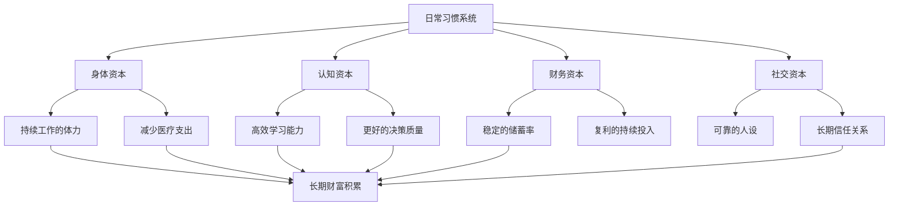

## 七、生活习惯：为长期成功打下基础

### 为什么生活习惯是财富积累的隐形地基

大多数关于财富积累的讨论聚焦于"做什么"——投资什么、跳槽去哪、副业做什么。但一个被严重低估的事实是：**你每天重复做的事情，决定了你能否持续执行任何财务计划。**

斯坦福大学行为设计实验室创始人 BJ Fogg 的研究表明，人类 40% 以上的日常行为是习惯驱动的，而非理性决策。这意味着你每天有将近一半的行为是"自动驾驶"状态。如果这些自动行为是健康的、高效的、有利于长期目标的，你不需要消耗意志力就在持续进步；反之，你需要不断与自己的惯性对抗，意志力耗尽只是时间问题。

20-30 岁是习惯形成的黄金窗口期。神经科学研究表明，大脑的前额叶皮层（负责自控和规划）在 25 岁左右才完全成熟，而习惯回路（基底神经节）在此前已经高度可塑。这个阶段建立的习惯，会像操作系统一样在后台运行数十年。



### 一、习惯科学：理解你为什么总是"坚持不下来"

在谈具体习惯之前，必须先理解习惯的运作机制。大多数人"坚持不下来"不是因为意志力差，而是方法错了。

#### 1.1 习惯回路：提示→渴求→反应→奖赏

MIT 研究人员发现，所有习惯都遵循相同的神经回路模式（Charles Duhigg 在《习惯的力量》中将其总结为"习惯回路"）：

| 阶段 | 机制 | 示例（晨跑习惯） |
|------|------|------------------|
| **提示（Cue）** | 触发大脑启动自动行为的信号 | 闹钟响起、跑鞋放在床边 |
| **渴求（Craving）** | 提示引发的欲望或期待 | 想要跑后的清爽感和成就感 |
| **反应（Response）** | 实际执行的行为 | 穿上跑鞋出门跑步 |
| **奖赏（Reward）** | 行为带来的满足感 | 内啡肽释放、打卡记录+1 |

理解这个回路的关键意义在于：**你不需要依赖意志力，你需要设计环境让好习惯的回路自动运转。**

#### 1.2 身份驱动 vs. 目标驱动

James Clear 在《Atomic Habits》中提出了一个深刻的观点：大多数人试图用目标驱动习惯（"我要存 10 万块"），但真正持久的改变来自身份驱动（"我是一个储蓄者"）。

两种驱动方式的对比：

| 维度 | 目标驱动 | 身份驱动 |
|------|----------|----------|
| 思维模式 | "我要完成这个目标" | "我要成为这样的人" |
| 失败后的反应 | "我失败了，放弃吧" | "这不像我会做的事" |
| 持续性 | 达成目标后容易停止 | 持续运转，没有终点 |
| 心理负担 | 每天都在"忍耐" | 自然而然，无需消耗意志力 |

**实操方法**：写下你想成为的人的描述（不是目标），然后问自己："一个注重财务健康的人在这种情况下会怎么做？"用这个问题引导日常决策。

#### 1.3 习惯叠加与环境设计

BJ Fogg 的"微习惯"理论和 James Clear 的"习惯叠加"策略是两个最强力的工具：

**习惯叠加公式**：在\[已有习惯\]之后，我会\[新习惯\]。

示例：
- 刷完牙后，我会检查今天的第一条待办事项
- 打开电脑后，我会先记录今天的三件要事
- 午饭后，我会花 15 分钟阅读行业资讯
- 到家后，我会把钱包里的消费小票录入记账 App

**环境设计原则**：
- 让好习惯的提示无处不在（书放在桌上、App 放在手机首屏）
- 让坏习惯的触发条件消失（卸载短视频 App、不在卧室放零食）
- 减少启动摩擦（运动服前一晚摆好、便当前一晚做好）

### 二、七大核心生活习惯的系统构建

以下七个习惯覆盖了影响长期财富积累的关键维度。它们不是孤立的清单，而是一个相互支撑的系统。

#### 2.1 习惯一：晨间例行程序——掌控一天的开始

**为什么重要**：哈佛商学院的一项追踪研究发现，拥有固定晨间例行程序的职场人，其职业满意度和收入增长速度显著高于没有固定晨间程序的人。晨间程序的核心价值不在于"早起"本身，而在于在外界干扰开始之前，为自己设定一天的优先级和心理状态。

**晨间程序的设计框架（适合 20-30 岁职场人）**：

| 时间 | 活动 | 时长 | 目的 |
|------|------|------|------|
| 起床后 0-5 分 | 喝水 + 拉伸 | 5 分钟 | 唤醒身体，补充夜间水分流失 |
| 起床后 5-15 分 | 冥想或深呼吸 | 10 分钟 | 降低皮质醇，提升专注力 |
| 起床后 15-30 分 | 日记/计划 | 15 分钟 | 明确今日优先级，减少决策疲劳 |
| 起床后 30-60 分 | 学习/阅读 | 30 分钟 | 利用早晨认知资源最充沛的时段 |
| 起床后 60-90 分 | 早餐 + 准备出门 | 30 分钟 | 稳定血糖，从容出门 |

**注意事项**：
- 不要一开始就执行完整的 90 分钟程序。从 15 分钟开始，每周增加 5 分钟
- 晨间程序的关键是"固定"，不是"完美"。即使只做 3 件事，只要每天都做，效果远超偶尔做 10 件事
- 起床时间应比出门时间早至少 90 分钟。否则晨间程序会变成晨间焦虑

**常见误区**：
- ❌ 把手机当第一个"晨间活动"——刷手机会触发被动反应模式，把主动权交给了外部信息
- ❌ 晨间程序太复杂导致放弃——3 个步骤的程序坚持 30 天，胜过 10 个步骤的程序坚持 3 天
- ❌ 跟风模仿名人作息——每个人的生物钟不同，找到自己的最佳起床时间比盲目早起更重要

#### 2.2 习惯二：记账与财务审视——让钱的流向透明

**为什么重要**：记账不是为了省钱，而是为了获得"财务能见度"。PNC Wealth Management 的调查显示，定期追踪支出的人，其储蓄率比不追踪的人高出 20-30%。原因很简单：当你清楚地知道钱去了哪里，消费决策会自动变得更理性。

**记账系统搭建步骤**：

第一步：选择工具。推荐分级方案：
- 入门级：手机记账 App（随手记、MoneyWiz、YNAB），每天花 1 分钟记录
- 进阶级：电子表格模板（Google Sheets），每周汇总分析
- 专业级：复式记账（Beancount、GnuCash），适合有投资收入的阶段

第二步：建立分类体系。建议使用以下分类：

| 一级分类 | 二级分类 | 说明 |
|----------|----------|------|
| 必要支出 | 房租、水电、通勤、基础餐饮 | 生存底线，不可压缩 |
| 发展支出 | 课程、书籍、工具、体检 | 投资自己，优先保障 |
| 社交支出 | 聚餐、礼物、人情往来 | 社交资本投入 |
| 享受支出 | 娱乐、旅行、购物 | 生活品质，可弹性调整 |
| 储蓄投资 | 定存、基金、股票、应急金 | 未来的自己 |

第三步：设置固定审视时间。每周日晚上花 15 分钟回顾本周支出，每月 1 号花 30 分钟做月度总结。

**关键指标——储蓄率**：

```text
储蓄率 = (月收入 - 月支出) / 月收入 × 100%
```

| 储蓄率 | 评价 | 对应行为模式 |
|--------|------|-------------|
| < 10% | 危险区 | 入不敷出或消费无度 |
| 10-20% | 及格线 | 有基本储蓄意识 |
| 20-30% | 良好 | 有清晰的财务规划 |
| 30-50% | 优秀 | 高度自律，目标明确 |
| > 50% | 极简主义 | 需要确认是否牺牲了必要的生活品质 |

#### 2.3 习惯三：每日运动——最被低估的财富投资

**为什么重要**：运动不仅关乎健康，更直接影响工作表现和收入潜力。《柳叶刀》2018 年发表的一项涉及 120 万人的研究表明，每周运动 3-5 次、每次 45 分钟的人，其心理健康状态最佳，因病缺勤天数比不运动的人少 43%。按中国一线城市日均工资 300-500 元计算，每年因少生病而节省的收入损失就达数千元。

运动对认知能力的影响同样显著：
- 有氧运动后 2 小时内，BDNF（脑源性神经营养因子）水平升高，学习效率提升 20-30%
- 长期运动者的海马体体积更大，记忆力更好
- 运动后的前额叶皮层活跃度更高，决策质量更好

**适合 20-30 岁职场人的运动方案**：

| 时间段 | 运动类型 | 频率 | 时长 | 预算 |
|--------|----------|------|------|------|
| 工作日早晨 | 跑步/跳绳 | 3次/周 | 30分钟 | 0元（跑步）|
| 工作日午休 | 散步/拉伸 | 每天 | 15分钟 | 0元 |
| 周末 | 力量训练/游泳/球类 | 1-2次/周 | 60分钟 | 50-200元/月 |
| 通勤路上 | 骑车/快走 | 每天 | 30分钟 | 0元 |

**最低可行运动量**：如果以上都做不到，每天快走 30 分钟（约 4000 步）。这已经是 WHO 推荐的最低标准，可以在通勤中完成。

#### 2.4 习惯四：固定阅读与学习——认知复利的引擎

**为什么重要**：查理·芒格说过："我这辈子遇到的聪明人，没有一个不是每天都在阅读的。"阅读的价值不在于记住每一个知识点，而在于持续构建思维模型和知识网络。每读一本好书，你的决策工具箱里就多了一套框架，而决策质量是影响财富积累的最关键变量。

**阅读习惯的构建方法**：

第一阶段（第 1-4 周）：建立阅读触发器
- 选择固定的阅读时间和地点（如睡前 30 分钟在床上）
- 从薄的、自己感兴趣的书开始，不要一上来就啃经典
- 目标：每天读 10 页。这是极低的门槛，几乎不会失败

第二阶段（第 5-12 周）：扩展阅读量
- 增加到每天 20-30 页（约 30-45 分钟）
- 开始混合不同类型的书：专业书 + 通识书 + 传记
- 建立读书笔记系统（Notion、Obsidian 或纸质笔记本）

第三阶段（第 13 周以后）：形成知识体系
- 每月读 2-4 本书，涵盖不同领域
- 用费曼学习法检验理解深度：能用自己的话讲给别人听才算真正理解
- 将阅读中获得的知识与实际工作/投资决策挂钩

**推荐书单结构**（20-30 岁积累期）：

| 类别 | 推荐方向 | 每年数量 |
|------|----------|----------|
| 财务/投资 | 基础理财、投资哲学、经济思维 | 4-6 本 |
| 职业发展 | 行业知识、管理技能、沟通表达 | 4-6 本 |
| 心理/认知 | 行为经济学、决策科学、习惯科学 | 2-3 本 |
| 通识/传记 | 历史、科学、企业家传记 | 3-5 本 |

**碎片时间学习矩阵**：

| 碎片时长 | 学习方式 | 示例 |
|----------|----------|------|
| 2-5 分钟 | 闪卡复习（Anki） | 复习昨天标注的术语/概念 |
| 5-15 分钟 | 听播客/有声书 | 通勤路上听 1 集播客 |
| 15-30 分钟 | 深度阅读 | 午休读 15 页书 |
| 30-60 分钟 | 课程学习 | 网课/教程的 1 个章节 |

#### 2.5 习惯五：睡眠管理——最高效的"投资"

**为什么重要**：睡眠不足的代价远超大多数人的想象。芝加哥大学的一项经典实验表明，连续 6 天每晚只睡 4 小时的人，血糖调节能力下降到糖尿病前期水平，皮质醇（压力激素）水平升高 37%，甲状腺功能下降到 60 岁老人的水平。这些生理变化直接转化为：决策质量下降、创造力降低、免疫力下降、工作效率暴跌。

沃顿商学院教授 Adam Grant 指出：**"睡眠不是从工作中偷来的时间，它是让你的工作更有价值的投资。"**

**睡眠优化的实操清单**：

环境层面：
- 卧室温度保持在 18-22°C（研究表明这是最佳睡眠温度区间）
- 使用遮光窗帘，确保卧室足够暗
- 如果环境噪音不可控，使用白噪音或耳塞
- 床只用于睡觉和亲密关系，不在床上工作或刷手机

行为层面：
- 固定就寝时间和起床时间（误差不超过 30 分钟），包括周末
- 睡前 1 小时停止使用电子设备，或使用夜间模式 + 防蓝光眼镜
- 睡前 2 小时内不摄入咖啡因（咖啡因的半衰期约 5-6 小时）
- 建立睡前仪式：洗漱→阅读→拉伸→入睡，作为大脑的"关机信号"

量化追踪：
- 使用手环/手表追踪睡眠周期（深睡、浅睡、REM 的比例）
- 目标：每晚 7-8 小时睡眠，深睡占比 15-20%，REM 占比 20-25%
- 每周回顾睡眠数据，找出影响睡眠质量的变量

#### 2.6 习惯六：定期复盘与计划——避免"低水平勤奋"

**为什么重要**：很多人每天忙忙碌碌，一年下来却感觉没有实质性进步。问题不在于不够努力，而在于缺少复盘——重复同样的错误，抓不住关键机会。军事领域的"事后回顾"（After Action Review, AAR）方法论被广泛应用于商业和个人发展，其核心是：对比预期与实际，找出差距的原因，形成可复用的经验。

**复盘系统的三层结构**：

每日复盘（5 分钟，睡前完成）：
1. 今天最重要的 3 件事完成情况如何？
2. 有什么事做得好？为什么做得好？（归因到可复制的行为）
3. 有什么事做得不好？下次遇到类似情况可以怎么改进？
4. 明天最重要的 1 件事是什么？

每周复盘（30 分钟，周日晚上完成）：
1. 本周的核心目标完成率是多少？
2. 本周的时间分配是否合理？（对照时间记录）
3. 本周学到了什么新知识或技能？
4. 本周的财务状况如何？（对照记账数据）
5. 下周的 3 个核心目标是什么？

每月复盘（1-2 小时，月末完成）：
1. 本月的收入/支出/储蓄率数据
2. 职业发展的关键进展和瓶颈
3. 人脉关系的维护和拓展情况
4. 健康指标的变化（体重、运动频率、睡眠质量）
5. 下月的 3 个核心目标和行动计划

**复盘工具推荐**：
- 纸质笔记本：适合喜欢手写的人，书写过程本身有助于思考
- Notion/Obsidian：适合数字化管理，可建立模板、设置提醒
- Bullet Journal：介于两者之间，灵活且有结构

#### 2.7 习惯七：社交维护——弱关系的持续投资

**为什么重要**：社会学家 Mark Granovetter 的经典研究"弱关系的力量"发现，大多数工作机会和关键信息来自"弱关系"（偶尔联系的熟人）而非"强关系"（亲密朋友）。但弱关系需要主动维护，否则会自然衰减至零。20-30 岁是社交网络快速扩展的阶段，如果不在这个时期建立维护习惯，30 岁后会发现人脉圈子越来越窄。

**社交维护的最小可行系统**：

将你的社交关系分层管理：

| 层级 | 人数 | 维护频率 | 维护方式 |
|------|------|----------|----------|
| 核心圈（至亲/挚友） | 5-10 人 | 每周 | 深度交流、共同活动 |
| 重要圈（好友/关键同事） | 20-30 人 | 每月 | 聚餐、电话、分享有用信息 |
| 弱关系圈（行业人脉/旧友） | 100-200 人 | 每季度 | 点赞/评论、节日问候、转发有价值的内容 |

**低成本高效果的维护动作**：
- 看到对方可能感兴趣的文章/机会，随手转发并附一句说明
- 对方朋友圈/动态有实质性内容时，写一条走心的评论（不是"👍"）
- 记住对方提到过的重要事件（换工作、搬家、生子），在合适时机关心
- 逢年过节发个性化祝福，而非群发模板

### 三、习惯养成的实战策略

知道了"什么习惯重要"只是第一步，真正的挑战是"如何让它持续运转"。

#### 3.1 两分钟规则

任何新习惯的起始版本都应该能在 2 分钟内完成：

| 目标习惯 | 2 分钟版本 |
|----------|-----------|
| 每天跑步 30 分钟 | 穿上跑鞋，出门走 2 分钟 |
| 每天阅读 1 小时 | 读 1 页书 |
| 每天冥想 15 分钟 | 坐下来，深呼吸 3 次 |
| 每天记账 | 打开记账 App，记录 1 笔 |
| 每天写日记 | 写 1 句话 |

这个策略的原理是：**先建立"出现"的习惯，再提高标准。** 你不需要在第一天就做到完美，你需要的是每天都出现。

#### 3.2 习惯追踪与奖赏机制

**视觉追踪法**：在显眼的地方（书桌旁、冰箱上）放一张月历，每完成一天的习惯就画一个 ✅。连续的链条会形成强大的心理动力——你不想断掉它（"不要打破链条"策略，源自 Jerry Seinfeld）。

**奖赏设计原则**：
- 奖赏应该在行为后立即出现（延迟奖赏对习惯形成的强化作用较弱）
- 奖赏应该与习惯方向一致（运动后的奖赏可以是一杯好咖啡，而不是一桶炸鸡）
- 每周给自己一个小奖赏（看完一部电影、买一本想读的书），每月给一个中等奖赏（一顿好餐厅、一件想买的东西）

#### 3.3 处理失败：反弹预案

所有习惯都会被打断——出差、生病、加班、情绪低落。关键不是"永远不断"，而是"断了之后怎么快速恢复"。

**反弹预案模板**：

```text
触发条件：连续 2 天没有执行习惯 X
反弹动作：
1. 不要自责，自责消耗意志力且无助于恢复
2. 立即执行"2 分钟版本"，重新启动回路
3. 分析中断原因——是外部干扰还是内部阻力？
4. 如果是外部干扰（出差），准备便携版本（出差时的替代方案）
5. 如果是内部阻力（不想做），降低难度或调整时间
```

#### 3.4 社会监督与环境塑造

**找一个"习惯伙伴"**：与朋友约定互相监督，每天互发打卡记录。社会压力是最有效的行为约束之一。

**加入相关社群**：跑步加入跑团，读书加入读书会，理财加入理财社群。群体规范会潜移默化地影响你的行为标准。

**塑造物理环境**：
- 想多喝水→在桌上放一个大水杯
- 想少刷手机→把手机放在另一个房间充电
- 想多读书→在沙发旁放一本打开的书
- 想早起晨跑→跑鞋放在卧室门口

### 四、20-30 岁各阶段的习惯优先级

不同人生阶段的习惯优先级不同。以下是基于大多数 20-30 岁人群的通用建议：

| 年龄段 | 最高优先级习惯 | 原因 |
|--------|---------------|------|
| 20-23 岁（校园/初入职场） | 阅读 + 记账 + 运动 | 此时可塑性最强，学习效率最高 |
| 24-26 岁（职业起步期） | 晨间程序 + 复盘 + 睡眠 | 工作节奏加快，需要系统化管理 |
| 27-30 岁（职业上升期） | 全部七个习惯 | 收入增长带来复杂性，需要全方位管理 |

### 五、常见误区与纠正

**误区一："我要养成 10 个好习惯"**
- 纠正：同时改变太多习惯会导致全部失败。每次只引入 1 个新习惯，稳定运行 30 天后再加下一个。

**误区二："我需要更多意志力"**
- 纠正：意志力是有限资源（自我损耗理论）。与其增强意志力，不如减少对意志力的依赖——设计环境，让好习惯更容易执行，坏习惯更难触发。

**误区三："早起的人更成功"**
- 纠正：早起本身没有魔力。关键是有一段不受干扰的时间做高价值的事。如果你是夜猫子，深夜 2 小时的高效工作同样有价值。

**误区四："习惯一旦养成就不会消失"**
- 纠正：习惯回路会因为长期不执行而衰减（虽然不会完全消失）。如果因为出差/生病中断了一段时间，需要有意识地重新激活。

**误区五："我要等到状态好的时候再开始"**
- 纠正：状态好的时候你不需要习惯，状态差的时候才需要。习惯的价值恰恰在于：即使你不想做，它也能让你最低限度地执行。2 分钟版本永远可以做。

### 六、习惯系统的投入产出分析

最后，让我们算一笔账。以下假设你从 25 岁开始建立这七个习惯，持续到 60 岁：

| 习惯 | 年化有形收益估算 | 35 年复利效应 |
|------|----------------|--------------|
| 记账（提升储蓄率 10%） | 年均多存 8000-15000 元 | 投资后复利累积 50-120 万 |
| 运动（减少病假 + 更好状态） | 年均节省 3000-8000 元 | 避免一次重大疾病可省 10-50 万 |
| 睡眠（提升工作效率 15%） | 年均增收 5000-20000 元 | 职级提升带来的收入差达百万级 |
| 阅读（更好的决策） | 无法精确量化 | 避免一次重大错误决策可能价值数十万 |
| 复盘（避免重复错误） | 无法精确量化 | 加速晋升周期 1-3 年 |

**这些习惯的总投入**：每天约 2-3 小时。**潜在回报**：数十年的职业竞争优势和数十万到数百万的财富差异。

### 本节核心要点

1. 习惯不是靠意志力维持的，而是靠系统设计——提示、渴求、反应、奖赏的回路
2. 身份驱动比目标驱动更持久："我要成为这样的人"优于"我要完成这个目标"
3. 七大核心习惯：晨间程序、记账、运动、阅读、睡眠、复盘、社交维护
4. 每次只培养一个习惯，从 2 分钟版本开始，稳定 30 天后再升级
5. 失败是正常的，关键是建立反弹预案——断了能快速恢复
6. 20-30 岁是习惯形成的黄金窗口，此时建立的习惯将运行数十年
7. 习惯的投入产出比极高：每天 2-3 小时的投入，换取数十年的复利回报
