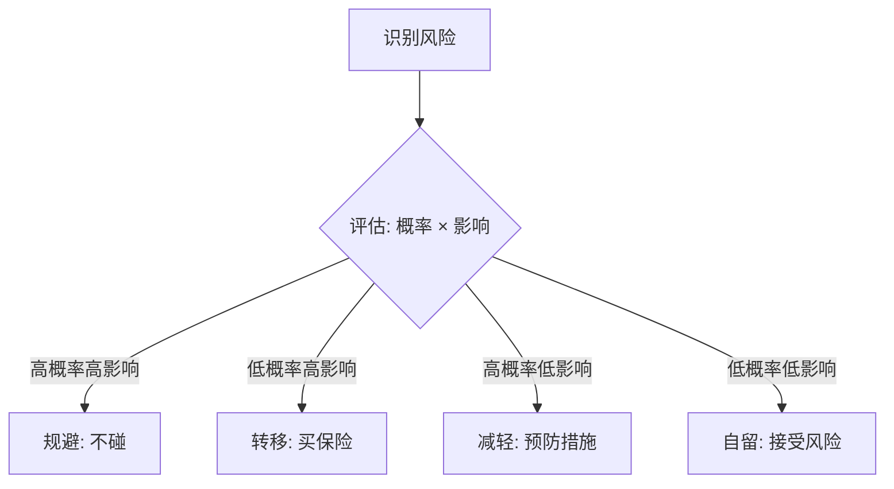
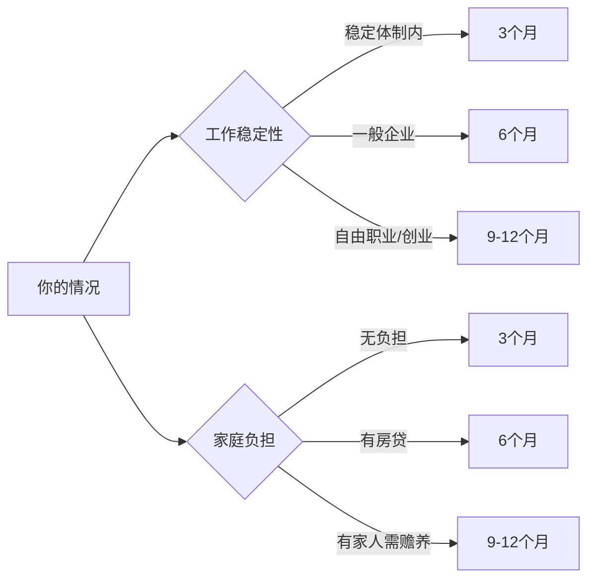
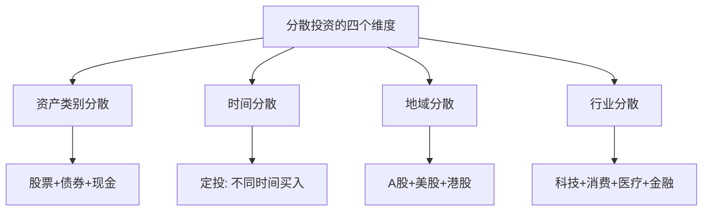
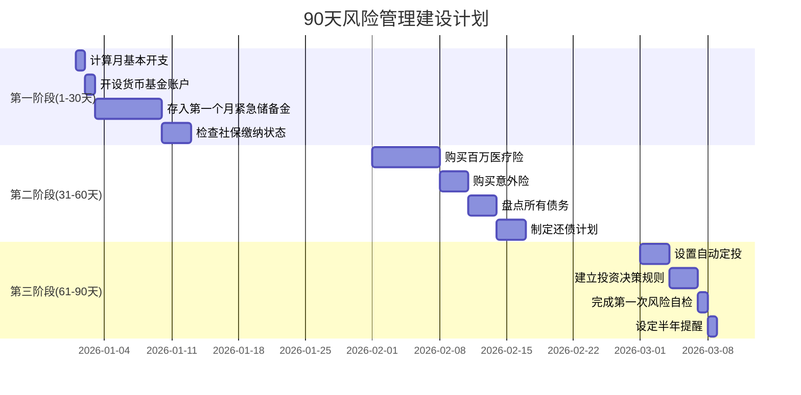

## 八、风险管理：如何保护你的积累

> "投资的第一条规则是不要亏钱，第二条规则是不要忘记第一条。" —— 沃伦·巴菲特

你在前几节学了储蓄、投资、副业、人脉构建，这些都在帮你"做加法"。但财富积累有一个容易被忽视的真相：**积累期最大的敌人不是收益率太低，而是一次意外把所有积累清零。**

一个25岁月薪1.5万的程序员，存了3年攒下20万。一场大病，住院+手术+康复花了18万。三年积累，一夜回到起点。更残酷的是，他还失去了三个月的工作收入。这不是假设——这是无数真实案例的缩影。

风险管理不是"有钱了才需要考虑的事"，恰恰相反，**越是在积累初期、底子越薄的时候，风险的杀伤力越大**。这就好比一棵小树苗，一场大风就能连根拔起；而一棵大树，同样的风只能吹落几片叶子。你的积累越少，每一笔意外支出的破坏力就越强。

本节会帮你建立一套系统的风险管理框架：识别你面临的风险类型，量化风险的影响，选择合适的转移或对冲手段，最终构建一张不会被轻易击穿的"安全网"。

---

### 1. 风险管理的底层逻辑

#### 1.1 什么是风险

风险不是"坏事发生"，而是**"实际结果与预期结果的偏离"**。这种偏离可以是向下的（亏损、失业），也可以是向上的（意外获得机会）。但在财富管理语境中，我们主要关注下行风险——那些会让你损失金钱、时间或健康的事情。

#### 1.2 风险管理的四种策略

面对任何一种风险，你只有四种选择：

| 策略 | 含义 | 适用场景 | 举例 |
|------|------|----------|------|
| **规避** | 彻底不碰风险源 | 风险大且无法控制 | 不参与传销、不借钱炒股 |
| **转移** | 把风险转嫁给第三方 | 风险概率低但损失大 | 买保险、合同条款约束 |
| **减轻** | 降低风险发生概率或损失 | 风险可部分控制 | 定期体检、分散投资 |
| **自留** | 自己承担风险后果 | 风险小、成本可控 | 日常小额开支波动 |



#### 1.3 积累期面临的核心风险清单

在20-30岁这个阶段，你需要警惕以下六大类风险：

| 风险类别 | 具体表现 | 潜在损失 | 典型案例 |
|----------|----------|----------|----------|
| **健康风险** | 重大疾病、意外伤残 | 医疗费+收入中断 | 急性阑尾炎手术费1-3万，癌症治疗费20-80万 |
| **职业风险** | 失业、行业衰退、技能过时 | 收入归零 | 互联网裁员潮，35岁危机 |
| **投资风险** | 本金亏损、踩雷暴雷 | 积累缩水 | P2P暴雷、股票腰斩、加密货币归零 |
| **法律风险** | 债务纠纷、合同陷阱、知识产权 | 经济赔偿+信用受损 | 网贷利滚利、租房合同纠纷 |
| **信用风险** | 征信受损、被列入失信名单 | 贷款受限、生活不便 | 信用卡逾期、贷款担保连带责任 |
| **心理风险** | 决策失误、冲动行为、焦虑抑郁 | 错失机会+额外损失 | 恐慌性抛售、报复性消费 |

---

### 2. 紧急储备金：你的第一道防线

#### 2.1 为什么紧急储备金是一切的基础

在谈任何保险、投资策略之前，**你必须先有一笔随时可动用的紧急储备金**。这是风险管理的地基——没有这个地基，上面建的任何东西都可能坍塌。

紧急储备金的作用是：当意外发生时，你不需要卖股票、不需要借钱、不需要刷信用卡分期，就能扛过这段时期。

#### 2.2 应该存多少

一个被广泛接受的标准是 **3-6个月的基本生活开支**。但具体金额取决于你的个人情况：



**具体计算方法：**

```text
月基本开支 = 房租/房贷 + 餐饮 + 交通 + 通讯 + 水电 + 基本日用品
紧急储备金 = 月基本开支 × 对应月数

举例：
月基本开支 4000元 × 6个月 = 24000元
这就是你的紧急储备金目标。
```

#### 2.3 紧急储备金放哪里

紧急储备金的核心要求是：**安全、随时可取、损失最小**。不是用来赚收益的，是用来保命的。

| 存放方式 | 年化收益 | 流动性 | 安全性 | 推荐指数 |
|----------|----------|--------|--------|----------|
| 银行活期 | 0.2-0.3% | 即时 | 极高 | ★★★★★ |
| 货币基金（余额宝/零钱通） | 1.5-2.5% | T+0/T+1 | 极高 | ★★★★★ |
| 银行定期（3个月） | 1.3-1.8% | 到期可取 | 极高 | ★★★☆☆ |
| 短债基金 | 2-3% | T+1 | 高 | ★★★★☆ |

**推荐方案：** 把紧急储备金分成两部分：
- **第一层（1个月生活费）：** 放在银行活期或支付宝/微信零钱，确保秒到账。
- **第二层（剩余部分）：** 放在货币基金中，收益略高，T+0到账也足够快。

#### 2.4 如何快速建立紧急储备金

如果你目前没有紧急储备金，以下是分阶段的行动方案：

**第一阶段（第1-2个月）：** 存下1个月生活费
- 暂停所有非必要开支
- 每月工资到账后，第一个操作是转入货币基金
- 目标：3000-5000元

**第二阶段（第3-6个月）：** 存到3个月
- 建立"先储蓄后消费"的自动转账习惯
- 每月存入工资的20-30%
- 目标：1-2万元

**第三阶段（第7-12个月）：** 达到6个月
- 收入提升后加大储蓄比例
- 紧急储备金到位后，再开始投资
- 目标：2-4万元

**关键原则：紧急储备金到位之前，不要做任何有风险的投资。** 你没有安全垫就去投资，就像不系安全带就上高速。

---

### 3. 保险：用小钱锁定大风险

#### 3.1 为什么年轻人也需要保险

很多20多岁的年轻人有一个误区："我还年轻，身体好，不需要保险。"这个想法的错误在于：**保险保的不是"现在会生病"，而是"万一发生时你承受不起"。**

一次严重的交通意外，ICU住院一个月的费用可以轻松超过50万。25岁的你，50万存款在手吗？如果没有，保险就是你唯一的救命稻草。

而且，**越年轻买保险越便宜**。同一份重疾险，25岁投保和35岁投保，保费可能相差30-50%。保险公司在你健康的时候最愿意卖给你——等你有了健康问题，要么买不了，要么贵得离谱。

#### 3.2 积累期必备的四大险种

**① 医保（社保）—— 最基础的保障**

如果你有工作，单位一定会给你交职工医保。如果没有工作或者自由职业，一定要自己交居民医保（每年几百元）。医保是国家给的福利，报销比例高、覆盖范围广，是所有商业保险的基础。

医保的局限：报销有上限（通常10-30万），进口药和特殊治疗不报销，异地就医有比例折扣。所以医保是"保底"，不是"全覆盖"。

**② 百万医疗险 —— 补充医保的缺口**

百万医疗险是商业保险中性价比最高的险种，没有之一。它的作用是：**在医保报销之后，对剩余的医疗费用进行二次报销。**

核心保障内容：
- 住院医疗费用（含手术、药品、检查）
- 特殊门诊（化疗、透析等）
- 门诊手术
- 住院前后门急诊

20-30岁健康人群的保费：**每年100-300元**，保额通常为100-400万。

挑选要点：
- 保证续保期限（至少6年，最好20年）
- 免赔额（通常1万，越低越好）
- 外购药保障（有没有、报销比例多少）
- 增值服务（住院垫付、就医绿通、质子重离子）

推荐产品类型：好医保、长相安、医享无忧等（具体产品随市场更新，购买前对比最新条款）。

**③ 意外险 —— 杠杆率最高的险种**

意外险保障因意外导致的身故、伤残和医疗费用。它的特点是：**保费极低，保额极高。**

20-30岁的保费：**每年100-200元**，保额50-100万。

意外险的关键条款：
- 意外身故/伤残：直接赔付保额
- 意外医疗：报销因意外产生的门诊和住院费用
- 猝死保障（部分产品含）
- 住院津贴（每天补贴100-200元）

**④ 定期寿险 —— 对家人的责任**

如果你有房贷、有父母需要赡养、或者有家庭负担，定期寿险是必须的。它的作用是：**如果你不幸身故或全残，保险公司赔付一笔钱给你的家人。**

20-30岁的保费：**每年500-1000元**，保额50-100万。

定期寿险的要点：
- 保障期限覆盖到60-65岁（覆盖房贷还清、子女成年）
- 保额至少覆盖房贷余额+3-5年家庭开支
- 选择纯保障型（不选返还型，返还型性价比低）

#### 3.3 重疾险：要不要买？

重疾险是保险讨论中争议最大的险种。它的作用是：确诊重大疾病后，一次性赔付一笔钱，用于治疗和康复期间的生活开支。

**积累期重疾险的利弊分析：**

| 维度 | 优势 | 劣势 |
|------|------|------|
| 保障 | 确诊即赔，不限用途 | 保费高（每年3000-6000元） |
| 时机 | 年轻健康时保费低 | 占用大量保费预算 |
| 心理 | 给自己一个安全网 | 容易买到不合适的产品 |

**建议策略：**
- 如果年收入超过15万且保费预算充足（不超过年收入5%），可以买一份30-50万的定期重疾险
- 如果年收入不高，优先用"百万医疗险+意外险"组合，先把基础保障做足
- 不要买返还型重疾险，不要买捆绑销售的产品，只买纯消费型

#### 3.4 保险配置方案

根据收入水平，推荐以下配置方案：

| 月收入 | 年保费预算 | 推荐配置 | 年保费 |
|--------|-----------|----------|--------|
| 5000以下 | 500-1000元 | 居民医保+百万医疗+意外险 | ~500元 |
| 5000-10000 | 1000-3000元 | 职工医保+百万医疗+意外险+定期寿险 | ~1500元 |
| 10000-20000 | 3000-5000元 | 以上全部+定期重疾险 | ~4000元 |
| 20000以上 | 5000-8000元 | 以上全部+提高保额 | ~6000元 |

**保险购买的三条铁律：**
1. **先保障后理财**：先把保障类保险买够，再考虑年金、增额终身寿等理财型保险
2. **先大人后小孩**：给家庭经济支柱先买，孩子有医保+医疗险+意外险就够
3. **先保额后期限**：预算有限时，宁可缩短保障期限，也要把保额做足

---

### 4. 投资风险管理

#### 4.1 认识风险与收益的关系

投资世界有一条铁律：**收益是风险的补偿。** 没有低风险高收益的投资——如果有，大概率是骗局。

| 资产类别 | 预期年化收益 | 最大回撤 | 适合人群 |
|----------|------------|----------|----------|
| 银行存款/国债 | 2-3% | 0% | 所有人 |
| 货币基金 | 1.5-2.5% | ~0% | 所有人 |
| 债券基金 | 3-5% | -5~-10% | 稳健型 |
| 混合基金 | 5-10% | -15~-30% | 平衡型 |
| 股票基金/指数基金 | 8-12% | -30~-50% | 积极型 |
| 个股 | 不确定 | -50~-100% | 高风险承受能力 |

#### 4.2 分散投资：不要把鸡蛋放在一个篮子里

分散投资是投资风险管理最核心的方法。它不是简单地"买很多只基金"，而是在多个维度上进行分散：



**实操建议：**
- 核心配置（60-70%）：宽基指数基金（如沪深300、中证500）
- 卫星配置（20-30%）：行业指数基金或债券基金
- 现金储备（10%）：货币基金，随时可调仓

#### 4.3 定投：用时间平滑风险

定期定额投资（定投）是积累期最适合的投资方式。它的原理是：**在价格高时少买、价格低时多买，长期来看拉低平均成本。**

定投的风险管理价值：
- 不需要择时，避免"买在高点"的心理焦虑
- 强制储蓄，养成纪律性投资习惯
- 长期持有，利用复利效应

**定投实操指南：**

```text
第1步：选择一个宽基指数基金（沪深300或中证500）
第2步：设定每月定投金额（建议工资的10-20%）
第3步：设定扣款日期（发工资后第二天自动扣款）
第4步：坚持至少3年以上，不要中途停止
第5步：当市场大跌20%以上时，如果有余钱，可以加倍定投
```

#### 4.4 投资中的风险管理红线

**必须严格遵守的规则：**

1. **不用借来的钱投资。** 杠杆投资（借钱炒股、融资融券）在积累期是绝对禁区。赢了你赚得不多，输了你可能背一身债。
2. **不把所有钱投入同一标的。** 即使你非常看好某只股票，也不要超过总投资金额的20%。
3. **设置止损线。** 单笔投资亏损超过15-20%时，强制自己重新审视投资逻辑，而不是"等它涨回来"。
4. **不投自己不懂的东西。** 如果一个投资产品你无法用三句话解释清楚它的赚钱逻辑，就不要碰。
5. **警惕高收益承诺。** 年化收益超过10%的"保本"产品，100%是骗局。记住这句话：你在盯着别人的利息，别人在盯着你的本金。

#### 4.5 常见的投资风险陷阱

| 陷阱 | 识别方法 | 应对策略 |
|------|----------|----------|
| P2P/网络借贷 | 承诺高收益+低风险 | 不碰任何P2P |
| 荐股群/老师带单 | 先让你赚小钱再亏大钱 | 拉黑所有荐股群 |
| 虚拟货币/空气币 | 白皮书写得天花乱坠 | 不投不了解的币种 |
| 私募/原始股骗局 | "上市后翻10倍" | 只通过正规渠道投资 |
| 传销式理财 | 拉人头返利 | 立即远离 |

---

### 5. 职业风险管理

#### 5.1 职业风险是积累期最大的隐性风险

很多人关注投资风险，却忽略了职业风险。但对于20-30岁的人来说，**工资收入是主要收入来源，职业风险对财务的冲击远大于投资风险。**

举例对比：
- 投资亏损10%（假设投资10万）：损失1万元
- 失业3个月（假设月薪1万）：损失3万+社保自缴约5000元+求职成本

职业风险包括：
- 公司裁员或倒闭
- 行业整体衰退
- 技能过时被市场淘汰
- 健康问题导致无法工作
- 人际冲突或职场政治

#### 5.2 建立职业安全网

**第一层：核心技能护城河**

确保你在某个领域有不可替代（或难以替代）的技能。具体方法：
- 每年学习1-2项与核心技能相关的新技术
- 保持对行业趋势的敏感度
- 在团队中承担关键模块或项目

**第二层：行业人脉网络**

前文"人脉构建"一节已详细论述。这里强调一点：**在你不需要找工作的时候就开始维护人脉。** 等到失业了再去找人帮忙，效果会大打折扣。

**第三层：副业收入缓冲**

前文"副业发展"一节的核心价值之一，就是为你提供**收入的第二条腿**。当主业出问题时，副业能帮你撑过过渡期。理想的副业收入应至少能覆盖基本生活开支的30-50%。

**第四层：3-6个月的紧急储备金**

这个在前面已经详细讲过。它是你应对失业的最后一道经济防线。

#### 5.3 职业风险的预警信号

出现以下信号时，你需要提高警惕，提前准备：

- 公司连续两个季度业绩下滑
- 部门开始"优化"流程，减少人力依赖
- 你的工作内容越来越容易被自动化替代
- 行业内多家公司开始裁员
- 你的薪资连续两年没有增长
- 领导对你的态度明显变化

**应对策略：** 出现2个以上信号时，立即更新简历、激活人脉、开始看外部机会。不要等到被裁才行动。

---

### 6. 法律风险管理

#### 6.1 积累期常见的法律风险

20-30岁的人容易在以下场景中踩法律坑：

**租房合同纠纷**
- 退租时房东不退押金
- 合同中隐藏不合理的违约条款
- 二房东卷款跑路

**借贷与担保**
- 为朋友/亲戚做贷款担保（承担连带还款责任）
- 网贷平台的高利贷和暴力催收
- 信用卡套现和逾期

**劳动权益**
- 公司不签劳动合同或不交社保
- 被违法辞退时不知道如何维权
- 竞业协议的法律约束

**知识产权**
- 工作中创造的成果归属不清
- 使用盗版软件的法律风险
- 副业与主业的利益冲突

#### 6.2 法律风险管理的基本原则

1. **凡事留证据。** 重要的沟通（尤其是涉及钱的）尽量用文字（微信/邮件），不要只口头约定。
2. **签合同前读条款。** 每一份合同、每一份协议，在签字之前至少通读一遍。重点关注违约条款、赔偿责任、退出机制。
3. **不轻易做担保。** 为别人的贷款做担保，就是在用你的信用和资产承担风险。99%的情况下应该拒绝。
4. **了解基本法律常识。** 劳动法、合同法、消费者权益保护法——不需要成为法律专家，但要知道自己有什么权利。

#### 6.3 债务管理的法律红线

积累期的债务管理至关重要。以下是区分"好债"和"坏债"的标准：

| 类型 | 特征 | 举例 | 策略 |
|------|------|------|------|
| **好债** | 能产生收益、利率合理 | 房贷（自住刚需）、教育贷款 | 可以有，控制在收入30%以内 |
| **中性债** | 不产生收益但必要 | 信用卡分期（小额） | 尽快还清，不扩大 |
| **坏债** | 高利率、用于消费 | 网贷、信用卡取现、消费贷 | 立即停止，优先还清 |

**债务管理的黄金法则：**
- 月还款总额不超过月收入的30%
- 不要以贷养贷（用A的贷款还B的利息）
- 信用卡每月全额还清，不只还最低还款
- 远离任何年化利率超过15%的借贷产品

---

### 7. 心理风险管理

#### 7.1 为什么心理风险最容易被忽视

投资亏钱、职业受挫、法律纠纷——这些风险你能看到、能感受到。但有一种风险是无声的：**你自己的心理偏差。**

行为金融学研究表明，人类在面对财务决策时有系统性的认知偏差。这些偏差不会消失，但你可以学会识别和管理它们。

#### 7.2 影响积累的六大心理偏差

| 偏差 | 表现 | 对积累的影响 | 应对方法 |
|------|------|-------------|----------|
| **损失厌恶** | 亏100元的痛苦是赚100元快乐的2倍 | 不敢投资，错过增长机会 | 用定投替代择时，不看短期盈亏 |
| **锚定效应** | 被第一个看到的数字影响判断 | "它之前涨到过50，现在才30肯定能涨回去" | 基于基本面做决策，不看历史价格 |
| **从众心理** | 别人买什么我也买什么 | 追涨杀跌，高买低卖 | 建立自己的投资体系，不跟风 |
| **过度自信** | 高估自己的判断能力 | 频繁交易、重仓押注 | 记录每次决策和结果，用数据检验自己 |
| **即时满足** | 偏好当下的消费而非未来的收益 | 月光、无法储蓄 | 自动化储蓄，让消费发生在储蓄之后 |
| **沉没成本** | 因为已经投入而不愿放弃 | 继续持有亏损的资产 | 问自己"如果现在手里没有这只基金，我会买入吗？" |

#### 7.3 构建决策纪律

对抗心理偏差最有效的方法不是"意志力"，而是**提前建立规则，让规则替你做决定**：

```text
投资决策规则清单（示例）：
1. 每月固定日期定投，金额不随心情变化
2. 单只基金仓位不超过总资产的20%
3. 亏损超过20%时，暂停加仓，花1周时间重新评估
4. 不在深夜做任何投资决策
5. 不在情绪激动（愤怒、焦虑、极度兴奋）时做任何财务决策
6. 每季度检视一次资产配置，不做频繁调整
```

---

### 8. 构建个人风险管理框架

#### 8.1 风险管理自检清单

每半年做一次风险管理自检，确保你的"安全网"没有漏洞：

**经济安全**
- [ ] 紧急储备金是否维持在3-6个月生活费？
- [ ] 保险是否齐全（医保+百万医疗+意外险）？
- [ ] 保单是否在有效期内？
- [ ] 债务比例是否在可控范围内（<30%收入）？

**职业安全**
- [ ] 核心技能是否有更新？
- [ ] 行业人脉是否在维护？
- [ ] 简历是否是最新的？
- [ ] 副业/第二收入是否在运转？

**法律安全**
- [ ] 重要合同是否都留有备份？
- [ ] 是否有任何未处理的法律纠纷？
- [ ] 社保/公积金是否正常缴纳？

**心理安全**
- [ ] 是否有定期运动/放松的习惯？
- [ ] 是否在情绪正常时做财务决策？
- [ ] 是否有可以倾诉/咨询的人？

#### 8.2 风险管理的时间投入

风险管理不需要你每天花大量时间。以下是合理的时间安排：

| 频率 | 事项 | 预计耗时 |
|------|------|----------|
| 每月 | 检查账单、确认自动扣款正常 | 15分钟 |
| 每季度 | 检视资产配置、调整投资比例 | 30分钟 |
| 每半年 | 保险自检、更新紧急储备金 | 1小时 |
| 每年 | 全面风险评估、保险续保检查 | 2小时 |
| 随时 | 关注行业动态、维护人脉 | 日常习惯 |

#### 8.3 从零开始的90天行动计划

如果你目前没有任何风险管理措施，按以下节奏在90天内建立基础防线：



---

### 9. 常见误区与纠正

**误区一："我还年轻，不需要风险管理"**
纠正：年轻恰恰是风险管理成本最低的时候——保费便宜、试错成本低、恢复能力强。等到出了事再补救，代价会高出数倍。

**误区二："买了保险就够了"**
纠正：保险只是风险管理的一部分。紧急储备金、职业安全网、法律意识、心理纪律——这些缺一不可。保险转移的是大额低概率风险，日常风险需要你自己管理。

**误区三："存够6个月生活费就可以高枕无忧了"**
纠正：紧急储备金是动态的。随着你的生活成本变化（搬家、结婚、生子），储备金额度也需要相应调整。每年至少检查一次。

**误区四："分散投资就是买很多只基金"**
纠正：真正的分散是跨资产类别（股票+债券+现金）和跨地域（A股+港股+美股），而不是买10只A股基金——它们可能同时下跌。

**误区五："副业可以当紧急储备金用"**
纠正：副业收入不稳定，不能替代紧急储备金。但如果副业已经成熟且现金流稳定（连续12个月以上），可以适当减少储备金额度。

**误区六："投资亏了就等它涨回来"**
纠正：这叫"处置效应"——不愿意承认亏损。如果一只基金的基本面恶化了（基金经理更换、投资风格漂移、行业逻辑改变），及时止损比死扛更理性。但如果是指数基金的短期波动，坚持定投反而是正确策略。

---

### 10. 本节总结

风险管理的核心不在于"花多少钱买保险"或"买多少种基金"，而在于建立一种**系统性思维**：在任何决策之前，先问自己——如果最坏的情况发生，我能承受吗？

积累期的风险管理有三个层次：

| 层次 | 内容 | 目标 |
|------|------|------|
| **基础层** | 紧急储备金+医保+百万医疗+意外险 | 确保一次意外不会让你返贫 |
| **进阶层** | 定投纪律+职业安全网+法律意识 | 确保收入来源不会轻易断裂 |
| **高阶层** | 心理纪律+系统性风险评估+动态调整 | 确保决策质量不会因情绪而下降 |

**最后的话：** 你现在做的每一个风险防范动作，都是在给未来的自己写一张保险单。也许10年后你会庆幸自己25岁就买了那份百万医疗险，也许你会感谢自己在28岁建立了紧急储备金、在一次意外中不需要向任何人借钱。风险管理不是让人焦虑的事，恰恰相反——**当你知道自己的底线在哪里，你反而可以更安心地去冒险。** 这就是风险管理的终极意义：不是消灭风险，而是让你有能力驾驭风险。
