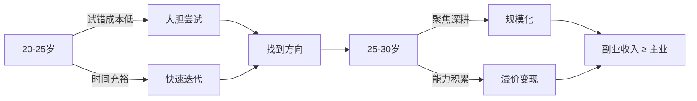
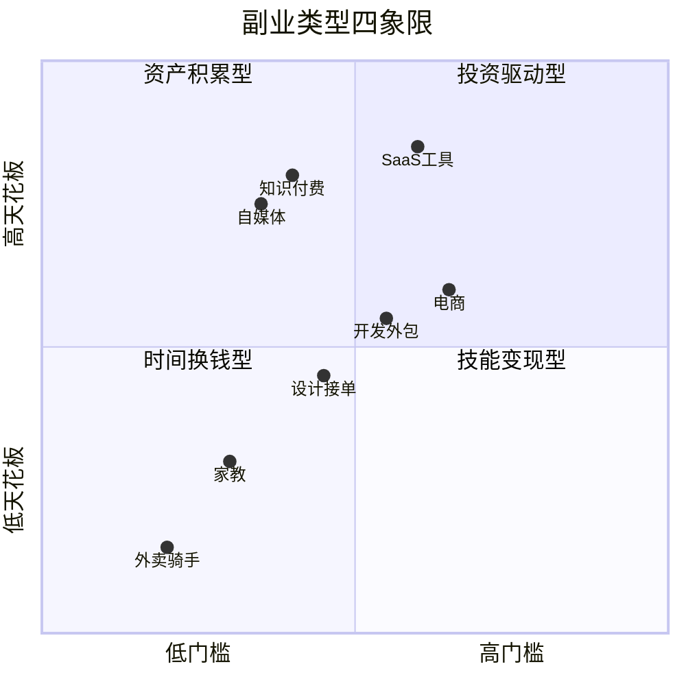
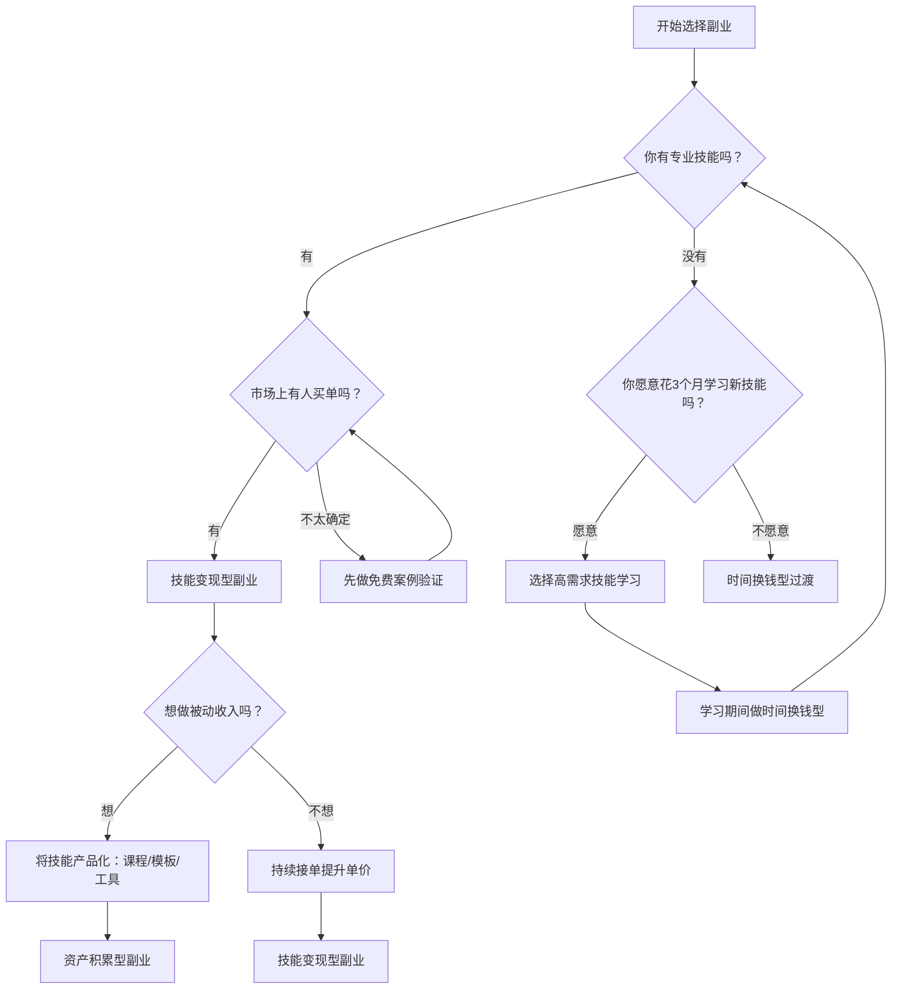

## 九、副业发展技巧

在 20-30 岁的积累期，仅靠主业工资很难实现财富的快速积累。副业不是"加班换钱"的另一个版本，而是用**杠杆思维**将你的技能、时间和资源转化为第二条收入曲线。本章将系统拆解副业从 0 到 1 再到规模化的完整路径，帮助你在不影响主业的前提下，构建可持续的副业收入体系。

### 9.1 为什么 20-30 岁是副业的黄金窗口

#### 9.1.1 时间红利

20-30 岁的你通常还没有沉重的家庭负担，晚上和周末的时间相对可控。这个阶段的时间投入产出比最高——你有足够的时间去试错、去积累、去等待复利效应显现。

#### 9.1.2 学习红利

这个年龄段的学习能力和适应能力处于巅峰。新工具、新平台、新趋势，你能比年长 10 岁的人更快上手。副业的本质是**将能力变现**，而学习新能力的速度就是你的竞争力。

#### 9.1.3 风险承受力

年轻人的试错成本最低。失败了损失的只是时间，而时间在这个阶段是最充裕的资源。等到 35 岁有房贷、有孩子，试错成本会急剧上升。



### 9.2 副业类型全景图

不是所有副业都值得做。按照**时间投入**和**收入天花板**两个维度，副业可以分为四大类：

#### 9.2.1 时间换钱型（低门槛、低天花板）

这类副业用固定时间换取固定报酬，本质是"第二份打工"。

| 类型 | 典型形式 | 时薪范围 | 适合人群 |
|------|----------|----------|----------|
| 平台接单 | 外卖骑手、网约车司机、代驾 | 20-50 元 | 需要即时现金流 |
| 任务平台 | 数据标注、问卷调查、App 测试 | 10-30 元 | 碎片时间利用 |
| 线下兼职 | 活动执行、促销员、家教 | 50-200 元 | 有特定技能 |

**核心局限**：无法积累资产，停止劳动即停止收入。适合短期过渡，不适合作为长期策略。

#### 9.2.2 技能变现型（中等门槛、中等天花板）

将你的专业技能或兴趣技能打包成服务出售。

| 类型 | 典型形式 | 单次收入 | 适合人群 |
|------|----------|----------|----------|
| 设计服务 | Logo设计、UI设计、海报制作 | 500-5000 元 | 设计师/美术生 |
| 开发外包 | 小程序开发、网站搭建、爬虫定制 | 3000-30000 元 | 程序员 |
| 内容创作 | 公众号代写、短视频剪辑、文案策划 | 500-5000 元 | 文字/视频工作者 |
| 咨询服务 | 职业规划、简历优化、留学申请 | 500-3000 元/次 | 有行业经验者 |
| 翻译服务 | 文档翻译、字幕翻译、口译 | 100-500 元/千字 | 外语能力强者 |

**核心优势**：每做一个项目，技能都会提升，报价可以逐步提高。

#### 9.2.3 资产积累型（较高门槛、较高天花板）

创建一次、反复售卖的数字资产或内容资产。

| 类型 | 典型形式 | 收入模式 | 建设周期 |
|------|----------|----------|----------|
| 知识付费 | 在线课程、付费专栏、电子书 | 持续被动收入 | 3-6 个月 |
| 自媒体 | 公众号、B站、抖音、小红书 | 广告+带货+品牌合作 | 6-12 个月 |
| SaaS 工具 | 小工具、Chrome 插件、微信小程序 | 订阅/广告收入 | 3-12 个月 |
| 数字产品 | 模板、素材包、字体、图标库 | 持续被动收入 | 1-3 个月 |

**核心优势**：前期投入时间，后期持续产出。典型的"睡后收入"模式。

#### 9.2.4 投资驱动型（高门槛、高天花板）

用资金或资源投入撬动收益。

| 类型 | 典型形式 | 资金门槛 | 风险等级 |
|------|----------|----------|----------|
| 电商/代购 | 淘宝店、拼多多、跨境电商 | 5000-50000 元 | 中等 |
| 实体投资 | 自助设备、共享经济、加盟 | 20000-100000 元 | 较高 |
| 内容MCN | 孵化账号矩阵、签约达人 | 10000-50000 元 | 中等 |



### 9.3 选择副业的决策框架

盲目跟风是副业失败的头号原因。用以下框架做出理性决策。

#### 9.3.1 三维评估模型

**维度一：能力匹配度（你能不能做）**

列出你当前具备的所有技能，包括主业技能和兴趣技能：

- **硬技能**：编程、设计、写作、数据分析、外语、视频剪辑
- **软技能**：沟通表达、项目管理、教学能力、审美品味
- **行业知识**：你所在行业的内幕信息、行业资源、人脉关系

**维度二：市场需求度（有没有人买单）**

验证方法：

1. **搜索验证**：在淘宝、闲鱼、猪八戒、知乎等平台搜索相关服务，看有没有人在做、定价多少、销量如何
2. **社群验证**：在相关社群（微信群、豆瓣小组、Reddit）观察有没有人在问相关问题
3. **朋友圈验证**：发一条朋友圈问"有没有人需要 XXX 服务"，看反馈

**维度三：时间投入度（你有没有时间做）**

诚实评估你每周能投入多少时间：

| 每周可用时间 | 建议副业类型 |
|-------------|-------------|
| 5 小时以下 | 数字产品、被动收入型 |
| 5-10 小时 | 技能接单、内容创作 |
| 10-20 小时 | 项目制外包、电商运营 |
| 20 小时以上 | 慎重考虑，避免影响主业 |

#### 9.3.2 副业选择决策树



#### 9.3.3 红灯信号：这些副业不要碰

| 红灯信号 | 具体表现 | 原因 |
|----------|----------|------|
| 需要先交钱才能开始 | "交 3980 元加入我们的代理体系" | 99% 是割韭菜或传销 |
| 承诺固定高回报 | "每天 2 小时月入过万" | 违背基本经济规律 |
| 模式不清晰 | 说不清楚钱从哪里来 | 大概率涉及灰色地带 |
| 需要发展下线 | 收入主要来自拉人头 | 传销特征 |
| 违法擦边 | 灰色项目、博彩引流 | 法律风险极大 |

### 9.4 副业从 0 到 1 的完整路径

#### 9.4.1 第一阶段：验证期（第 1-4 周）

**目标**：用最小成本验证副业方向是否可行。

**步骤一：定义最小可行服务（MVS）**

不要一上来就想做完美产品。先定义一个最简单的服务版本：

- 设计师：先做 3 个免费 Logo 设计，积累案例
- 程序员：先接一个小需求，哪怕只收 500 元
- 写作者：先在公众号/知乎发 10 篇文章，看阅读量

**步骤二：找到第一批客户**

| 渠道 | 操作方法 | 转化率 |
|------|----------|--------|
| 朋友圈 | 发布服务介绍+案例 | 5-10% |
| 闲鱼 | 上架服务，优化标题和图片 | 3-8% |
| 豆瓣小组 | 在相关小组发帖 | 2-5% |
| 知乎回答 | 回答相关问题+引流 | 1-3% |
| 猪八戒/一品威客 | 注册接单 | 5-15% |
| 即刻/小红书 | 发布作品展示 | 2-5% |

**步骤三：收集反馈并迭代**

第一批客户是最好的老师。重点关注：

- 客户最常问的问题是什么？（需求洞察）
- 客户最满意的是什么？（核心价值点）
- 客户觉得哪里不够好？（改进方向）
- 客户愿意推荐给别人吗？（口碑潜力）

#### 9.4.2 第二阶段：稳定期（第 2-3 个月）

**目标**：建立稳定的客户来源和服务流程。

**定价策略**

新手常犯的错误是定价过低。合理的定价方法：

```text
定价 = 你的时薪目标 × 该任务预估耗时 × 1.5（留出沟通和修改余量）
```

示例：你希望时薪 100 元，一个 Logo 设计预估 3 小时，则定价为 100 × 3 × 1.5 = 450 元。

**提价节奏**：每完成 5-10 个项目，提价 20-30%。当你的接单率（成交/咨询）超过 60% 时，说明定价偏低，可以提价。

**服务流程标准化**

将重复性工作模板化，提高效率：

1. **需求确认模板**：标准化的需求问卷，减少沟通成本
2. **合同/协议模板**：保护双方权益，明确交付标准
3. **交付清单**：每次交付前的自检清单
4. **售后流程**：修改次数、响应时间、售后期限

#### 9.4.3 第三阶段：增长期（第 3-6 个月）

**目标**：扩大客户来源，提高客单价。

**流量矩阵搭建**

不要依赖单一渠道。建议同时运营 2-3 个渠道：

| 渠道类型 | 具体渠道 | 运营重点 |
|----------|----------|----------|
| 搜索流量 | 知乎、百度、小红书搜索 | 长期 SEO，持续输出 |
| 社交流量 | 朋友圈、微信群、社群 | 口碑传播，老带新 |
| 平台流量 | 猪八戒、闲鱼、Fiverr | 平台规则优化 |
| 内容流量 | 公众号、B站、抖音 | 内容吸引精准客户 |

**提高客单价的三种方法**：

1. **服务升级**：从单一服务扩展为套餐服务。例如从"设计 Logo"升级为"品牌视觉方案（含Logo+名片+海报）"
2. **能力升级**：学习更高阶的技能，进入更高价位市场
3. **定位升级**：从"接单"转变为"顾问"，从执行者变为策略者

### 9.5 时间管理：主业与副业的平衡术

副业最大的敌人不是能力不足，而是时间不够。

#### 9.5.1 时间审计法

先搞清楚你的时间到底花在哪里了：

1. 记录一周的时间使用情况（精确到 30 分钟）
2. 标记三类时间：**产出时间**（直接创造价值）、**消耗时间**（通勤、开会、刷手机）、**恢复时间**（睡眠、运动、放松）
3. 从消耗时间中找出可以压缩或优化的部分

大多数人的消耗时间占比在 40-60%，这意味着你有巨大的优化空间。

#### 9.5.2 时间块工作法

将副业时间固定在每天的特定时段，形成习惯：

```text
工作日时间块示例：
┌─────────────────────────────────────┐
│ 06:30-07:30  副业核心工作（1小时）    │
│ 12:00-12:30  副业回复消息（30分钟）   │
│ 21:00-22:30  副业内容创作（1.5小时）  │
│                                      │
│ 周末：                               │
│ 09:00-12:00  副业深度工作（3小时）    │
│ 14:00-16:00  副业学习提升（2小时）    │
└─────────────────────────────────────┘
每周副业时间投入：约 15 小时
```

#### 9.5.3 精力管理优先于时间管理

不是所有时间段的质量都一样。识别你的**高能量时段**，把最重要的副业工作安排在这个时段：

- **早起型**（5:00-7:00 是巅峰）：早起 1-2 小时做创造性工作
- **晚睡型**（21:00-24:00 是巅峰）：利用晚间做深度工作
- **碎片型**（只有零散时间）：适合做回复消息、收集素材等低认知负荷任务

### 9.6 副业的法律与税务合规

#### 9.6.1 与主业的法律冲突

在开始副业前，务必检查以下事项：

| 检查项 | 具体内容 | 风险等级 |
|--------|----------|----------|
| 劳动合同条款 | 是否有竞业限制、兼职限制条款 | 高 |
| 公司规章制度 | 是否明确禁止员工兼职 | 中 |
| 知识产权归属 | 副业成果是否会涉及主业知识产权 | 高 |
| 利益冲突 | 副业是否与主业存在竞争关系 | 高 |

**安全做法**：

- 仔细阅读劳动合同中的竞业限制和兼职条款
- 副业方向尽量与主业不构成直接竞争
- 不在工作时间从事副业
- 不使用公司的设备、资源和信息做副业
- 必要时咨询劳动法律师

#### 9.6.2 税务处理

副业收入同样需要依法纳税：

**个人劳务报酬**：单次收入不超过 800 元免税；800-4000 元减除 800 元费用后按 20% 税率；4000 元以上减除 20% 费用后按 20% 税率（畸高收入加成征收）。

**个体工商户**：如果副业收入稳定且较高，可以注册个体工商户，享受小规模纳税人优惠政策。年收入 120 万以内（月 10 万以内）免征增值税。

**操作建议**：

- 保留所有收入凭证和支出凭证
- 年收入超过 12 万元需要自行申报
- 达到一定规模后考虑注册个体工商户或公司
- 使用"个人所得税"App 汇算清缴

### 9.7 副业规模化：从个人到团队

当副业收入稳定在每月 5000 元以上，且需求持续增长时，可以考虑规模化。

#### 9.7.1 规模化的三种路径

**路径一：提高单价（不增加工作量）**

从"做更多"转变为"收更多"。通过提升定位、积累口碑、优化服务来提高客单价。

- 初级设计师：500 元/Logo → 资深品牌顾问：5000 元/品牌方案
- 普通翻译：100 元/千字 → 专业领域翻译：300 元/千字

**路径二：产品化（脱离时间束缚）**

将服务转化为可以重复售卖的产品：

| 服务 | 产品化形式 | 收入模式 |
|------|-----------|----------|
| 设计接单 | 设计模板/素材包 | 持续被动销售 |
| 编程外包 | SaaS 工具/Chrome 插件 | 订阅/广告 |
| 课程辅导 | 录制在线课程 | 一次性制作，持续销售 |
| 咨询顾问 | 付费社群/知识星球 | 年费制 |

**路径三：团队化（杠杆化经营）**

当需求超过个人产能时：

1. **外包协作**：将部分工作外包给其他自由职业者，你负责获客和质控
2. **建立小团队**：招募 1-2 名兼职人员，按项目分成
3. **工作室模式**：注册工作室，规范化运营

#### 9.7.2 规模化的时机判断

| 信号 | 说明 |
|------|------|
| 接单率 > 80% | 你拒绝的客户比成交的多 |
| 交付周期排满 | 客户需要等 2 周以上才能开始 |
| 客单价见顶 | 提价后成交率明显下降 |
| 重复性工作多 | 大量时间花在低价值的执行上 |

当以上信号出现 2 个以上，就是规模化的时机。

### 9.8 副业的常见误区与应对

#### 误区一：追风口

**表现**：什么火做什么，ChatGPT 火了做 AI 课程，小红书火了做小红书运营。

**问题**：等你入场时，红利期往往已经过去。而且你不具备核心竞争力，只能做最低端的卷。

**正解**：选择与你的核心技能和长期规划一致的方向。风口只是放大器，不是发动机。

#### 误区二：完美主义

**表现**：产品还没做好就不敢上线，课程录了又录总觉得不够完美。

**问题**：过度追求完美导致永远无法开始，错失市场窗口。

**正解**：MVP 思维。先发布 60 分的版本，根据反馈迭代到 80 分。完美是迭代出来的，不是准备出来的。

#### 误区三：低估运营成本

**表现**：只看到收入，忽略了时间成本、工具成本、学习成本、沟通成本。

**问题**：实际时薪远低于预期，甚至不如加班费。

**正解**：用"时薪"而非"总收入"来衡量副业价值。每次做完项目，实际计算一下你的时薪：

```text
实际时薪 = (项目收入 - 直接成本) / 实际投入时间
```

如果时薪低于 50 元，说明方向或效率需要调整。

#### 误区四：影响主业

**表现**：白天工作无精打采，会议走神，产出下降。

**问题**：主业才是你当前最稳定的收入来源和最大的资产。副业搞砸了可以重来，主业搞砸了代价很大。

**正解**：严格隔离主业和副业的时间。主业工作时间内 100% 投入主业。如果精力不够，宁可减少副业投入。

#### 误区五：孤军奋战

**表现**：一个人闷头干，不交流、不学习、不求助。

**问题**：信息闭塞，重复踩坑，缺乏反馈。

**正解**：加入 2-3 个相关社群，关注 3-5 个行业标杆，定期复盘和交流。副业路上的很多坑，别人已经踩过了。

### 9.9 副业发展的关键里程碑

设定清晰的里程碑，用数据驱动决策：

| 里程碑 | 核心指标 | 达成标准 | 达成后的行动 |
|--------|----------|----------|-------------|
| M1：验证完成 | 付费客户数 | ≥ 3 个付费客户 | 进入稳定期 |
| M2：稳定收入 | 月收入 | 连续 3 个月 ≥ 2000 元 | 扩大渠道 |
| M3：时薪达标 | 实际时薪 | ≥ 80 元/小时 | 考虑提价或产品化 |
| M4：被动收入 | 被动收入占比 | ≥ 30% | 加大产品化投入 |
| M5：超越主业 | 月收入 | ≥ 主业收入的 80% | 考虑全职投入 |

### 9.10 实战案例拆解

#### 案例一：程序员的技术博客变现路径

**背景**：某前端开发工程师，工作 2 年，月薪 15000 元。

**路径**：

1. **第 1-3 个月**：在掘金和知乎每周发 2 篇技术文章，积累 50 篇
2. **第 4-6 个月**：文章带来自然流量，开始接技术广告（单篇 500-2000 元）
3. **第 7-9 个月**：粉丝积累到 1 万+，开始接外包项目咨询
4. **第 10-12 个月**：录制前端课程上架网易云课堂，定价 199 元

**一年成果**：技术文章广告收入 2 万+，外包咨询 5 万+，课程销售 8 万+，总计 15 万+，相当于多了 10 个月工资。

#### 案例二：设计师的模板化变现路径

**背景**：某 UI 设计师，工作 3 年，擅长 Figma。

**路径**：

1. **第 1-2 个月**：设计 5 套高质量 Figma UI Kit，上架 Gumroad 和站酷
2. **第 3-4 个月**：根据销量数据优化畅销模板，增加变体
3. **第 5-8 个月**：积累到 20 套模板，每月被动收入 3000-5000 元
4. **第 9-12 个月**：开始做设计教程，从卖模板扩展到卖课程

**关键数据**：单套模板定价 29-99 元，平均月销 100-300 份，毛利率 90%+（平台抽成除外）。

### 9.11 副业工具箱

| 类别 | 工具 | 用途 | 费用 |
|------|------|------|------|
| 获客 | 闲鱼、小红书、知乎 | 展示作品、引流获客 | 免费 |
| 沟通 | 微信、飞书 | 客户沟通 | 免费 |
| 合同 | e签宝、法大大 | 电子合同签署 | 免费/付费 |
| 收款 | 微信、支付宝、PayPal | 收款 | 手续费 |
| 记账 | 随手记、Excel | 收支记录 | 免费 |
| 项目管理 | 飞书多维表格、Notion | 项目跟踪 | 免费 |
| 设计 | Figma、Canva | 作品制作 | 免费/付费 |
| 内容 | 剪映、CapCut | 视频剪辑 | 免费 |
| 税务 | 个人所得税 App | 申报纳税 | 免费 |

### 9.12 本节核心要点回顾

1. **选对方向比努力更重要**：用三维评估模型（能力、需求、时间）选择副业方向
2. **先验证再投入**：用最小可行服务在 4 周内验证市场，避免盲目投入
3. **用时薪衡量价值**：副业的实际时薪低于 50 元就需要调整方向或提升效率
4. **资产化思维**：从一开始就思考如何将服务转化为可重复售卖的产品
5. **合规经营**：检查劳动合同限制，依法纳税，保护知识产权
6. **主业为本**：副业是锦上添花，不能以牺牲主业为代价
