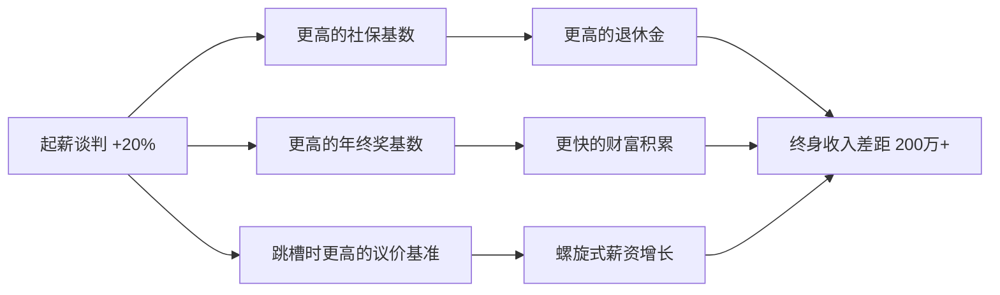
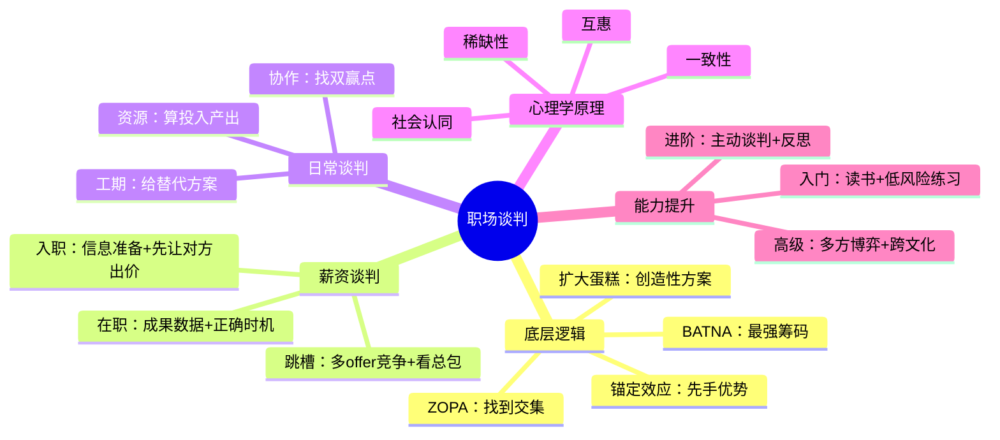

## 十、职场谈判技巧

### 10.1 为什么20-30岁必须学会谈判

哈佛商学院的研究显示，**会谈判的人在整个职业生涯中比不会谈判的人多赚超过100万美元**。更关键的是，20多岁的一次成功薪资谈判，其影响会随时间指数放大——假设你25岁时通过谈判将起薪从月薪8000元谈到10000元，按每年5%的涨幅计算，到60岁时累计差额超过**200万元**。这还不包括基于更高基数的社保缴纳、年终奖、股权激励等衍生收益。

谈判不是"讨价还价"，而是一种**价值交换的沟通能力**。它决定了你能拿到多少资源、多大的舞台、多快的晋升速度。很多年轻人误以为"好好干活自然会被看到"，但现实是：**不主动争取的资源，大概率不会主动落到你头上。**

#### 谈判能力的复利效应



### 10.2 谈判的底层逻辑：四个核心概念

在学习具体技巧之前，必须理解四个谈判学的基础概念。这些概念来自哈佛谈判项目（Harvard Negotiation Project）的经典研究成果。

#### 10.2.1 BATNA（最佳替代方案）

**BATNA**（Best Alternative to a Negotiated Agreement）即"如果这次谈判谈崩了，你的最佳退路是什么"。BATNA是谈判中最重要的变量——**你的BATNA越强，谈判筹码越大。**

| 场景 | BATNA强度 | 谈判优势 |
|------|-----------|----------|
| 手握3个offer谈薪资 | 极强 | 可以强势要求，不满足就走 |
| 在职状态谈加薪 | 较强 | 有退路，不急于一时 |
| 裸辞后面试谈薪资 | 较弱 | 有时间压力，容易让步 |
| 失业6个月后谈薪资 | 极弱 | 被动接受，缺乏议价空间 |

**核心原则：永远在BATNA最强的时候谈判。** 这意味着：在职时看机会，而不是走投无路时才找工作；有多个选项时才谈条件，而不是只有一个选择时提要求。

**如何构建强BATNA：**

1. **在职期间保持市场活跃度。** 每季度至少和1-2个猎头保持联系，了解自己的市场定价。不是为了跳槽，而是为了知道自己值多少。
2. **维护行业人脉网络。** 60%的优质机会来自人脉推荐，而非公开招聘。定期参加行业活动、维护LinkedIn/脉脉档案。
3. **持续提升硬技能。** 你的BATNA本质是"别人愿意为你付多少钱"，这取决于你解决问题的能力稀缺性。
4. **保持财务缓冲。** 有6个月以上的生活费储备，让你在谈判中不会因为经济压力而被迫接受不满意的条件。

#### 10.2.2 ZOPA（可达成协议的空间）

**ZOPA**（Zone of Possible Agreement）是双方都能接受的条件区间。只有当你的底线和对方的上限有交集时，谈判才可能成功。

**示例：薪资谈判中的ZOPA**

```text
你的期望薪资范围：15,000 - 20,000元/月
你的底线（低于此不接受）：14,000元/月

公司的预算范围：12,000 - 18,000元/月
公司的上限（高于此不批）：18,000元/月

ZOPA = 14,000 ~ 18,000元/月
最优结果（对你）= 18,000元/月
最优结果（对公司）= 14,000元/月
最终落点取决于谈判能力
```

**关键洞察：** 很多人谈判失败，不是因为没有ZOPA，而是因为信息不对称——你不知道对方的区间在哪里。所以谈判前的信息收集至关重要。

#### 10.2.3 锚定效应（Anchoring Effect）

诺贝尔经济学奖得主丹尼尔·卡尼曼的研究表明，**人类在做决策时会过度依赖第一个接收到的数字信息**，这就是锚定效应。

在谈判中，**谁先出价谁就设定了锚点**。但"先出价"是优势还是劣势，取决于你是否掌握了足够的市场信息：

- **你掌握信息时 → 先出价。** 如果你清楚知道市场行情（比如同类岗位薪资中位数是20K），你可以报一个略高的数字（比如22K），把谈判拉到对你有利的区间。
- **你缺乏信息时 → 让对方先出价。** 如果你不确定这个岗位的预算范围，贸然报价可能远低于对方预算（你报15K，对方预算其实是25K），或者远高于对方承受范围导致直接出局。

#### 10.2.4 创造性解决方案（Expanding the Pie）

初级谈判者只关注"切蛋糕"——你多拿一点我就少拿一点。高级谈判者会**把蛋糕做大**——找到双方都看重但成本不同的交换维度。

**示例：** 公司薪资预算确实只有15K，但你可以谈判：
- 签字费/入职奖金（一次性，公司更容易批）
- 试用期缩短（早拿全额薪资）
- 远程办公天数（节省通勤成本，公司零成本）
- 培训预算（公司有专门的培训经费池）
- 股票/期权（长期收益可能远超薪资差额）
- 弹性工作时间（提升生活质量）
- 年假天数（增加休息时间）
- 绩效考核周期缩短（更快涨薪机会）

### 10.3 薪资谈判：全流程实战指南

薪资谈判是20-30岁最频繁、回报最高的谈判场景。以下是完整的实战流程。

#### 10.3.1 谈判前的信息准备

**信息就是力量。** 谈判中80%的优势来自准备阶段，而非谈判桌上的表现。

**必须收集的信息清单：**

| 信息类别 | 具体内容 | 获取渠道 |
|----------|----------|----------|
| 市场薪资 | 同城同岗位薪资中位数、P25/P75 | 薪酬报告、猎聘/脉脉、Levels.fyi |
| 公司情况 | 融资阶段、盈利状况、近期裁员/扩招 | 企查查、36氪、公司财报 |
| 岗位紧急度 | 该岗位招了多久、面试了几轮 | 猎头、面试中观察 |
| 个人筹码 | competing offers、稀缺技能、行业经验 | 自我评估 |
| 福利体系 | 五险一金基数、年终奖规则、股权结构 | Offer letter、Glassdoor |

**国内主要薪资查询渠道：**

- **看准网/脉脉：** 用户匿名分享真实薪资，样本量大，适合了解大众区间
- **猎聘/Boss直聘：** 岗位薪资范围直接标出，了解企业端的预算
- **拉勾网：** 互联网行业薪资透明度较高
- **猎头：** 最精准的信息来源，但需要建立猎头关系网
- **同事/前同事：** 同公司或同行业的真实数据，需要信任基础

#### 10.3.2 面试中的薪资博弈

**阶段一：早期面试——模糊处理**

面试初期HR问"你的期望薪资是多少"，不要直接给具体数字。这个阶段你的目标是展示价值，不是谈价格。

**话术模板：**

> "薪资当然重要，但我更看重的是这个岗位的发展空间和团队。我相信如果双方都确定了合作意向，薪资一定能谈到双方都满意的水平。方便了解一下这个岗位的薪资范围吗？"

> "我目前的综合年收入在XX万左右（可以适当上浮10-15%），我希望新的机会能有一定的涨幅。具体数字我们可以后续再聊。"

**阶段二：拿到口头Offer后——正式谈判**

当对方明确表示要录用你时，这是谈判的黄金窗口。此时你的BATNA最强——对方已经投入了大量面试成本，不想轻易放弃你。

**关键原则：**

1. **永远表达感谢和兴趣，再提条件。** "非常感谢给我这个机会，我对这个岗位很感兴趣。关于薪资部分，我希望我们能聊聊。"
2. **用数据说话，不用感觉。** "根据我了解的市场数据，这个岗位的P75薪资在XX万左右"比"我觉得应该再高一点"有说服力100倍。
3. **给理由，不只是提要求。** "考虑到我在XX领域有5年经验，且目前手上有另一个XX万的offer，我希望薪资能调整到XX。"
4. **留出协商空间。** 如果你期望20K，报22-23K，给对方"赢"的感觉。

**阶段三：拿到书面Offer后——最后确认**

书面Offer是谈判的最后机会。一旦签字，短期内很难再改。检查清单：

- 基本工资是否与口头确认一致
- 试用期时长和试用期薪资比例（法定不低于80%）
- 五险一金缴纳基数（按实际工资还是最低基数）
- 年终奖的发放条件和计算方式
- 股票/期权的归属时间表（vesting schedule）
- 竞业限制条款的范围和补偿

#### 10.3.3 在职加薪谈判

在职加薪比入职谈判更难，因为你已经有了沉没成本（熟悉环境、团队关系），公司也知道这一点。但方法得当，成功率依然很高。

**最佳时机（按优先级排序）：**

1. **绩效考核后。** 刚拿到好评级/优秀评级，公司正认可你的价值。
2. **完成重大项目后。** 你刚交付了一个有可见成果的项目，价值感最强。
3. **承担新职责前。** 公司要给你加任务，这是谈判的天然窗口——"加量不加价"是不合理的。
4. **公司业绩好的时候。** 预算充足，审批更容易通过。
5. **年度调薪窗口前1-2个月。** 提前让领导有时间走流程。

**最差时机：**

- 公司刚裁员/缩减预算
- 你刚犯了错误或绩效一般
- 领导正忙于应对紧急事务
- 入职不满一年（除非有特殊贡献）

**在职加薪的话术框架：**

```text
第一步：陈述事实（不是抱怨）
"过去一年，我负责了XX项目，实现了XX成果（用数据量化）。"

第二步：表达意愿
"我非常看好团队的发展方向，希望能长期在这里深耕。"

第三步：提出请求
"基于我的贡献和市场薪资水平，我希望薪资能调整到XX。"

第四步：给领导台阶
"如果短期内薪资调整有困难，我理解流程需要时间。
我们可以先确定一个方向，我配合走必要的审批流程。"
```

**重要提醒：永远不要用"不加薪就辞职"来威胁。** 即使这次成功了，你在领导眼中也会变成"不稳定因素"，未来的信任和机会都会大打折扣。谈判是合作，不是对抗。

#### 10.3.4 跳槽谈判的特殊策略

跳槽是薪资跳跃最大的机会（通常涨幅20-50%），但也是最容易踩坑的场景。

**必须避开的五个坑：**

1. **不要透露当前真实薪资。** 在很多城市，询问前薪资已经不合法（如纽约、加州），国内虽然没有明确法规，但你完全可以说"我更关注这个岗位的市场价值"。如果你当前薪资偏低（比如被压价入职），透露真实数字会被用来锚定你的新薪资。
2. **不要只看月薪，要看总包。** 一个25K×12薪+0年终的offer，不一定比20K×12薪+6个月年终的好。把所有收入项（基本工资、年终奖、签字费、股票、补贴）加总后比较。
3. **不要因为"涨了30%"就满足。** 如果你的市场价值是50K，当前被低估到20K，涨30%到26K依然是被低估。关键是看你是否拿到了市场公允价格。
4. **不要同时只谈一家。** 尽量让2-3个offer在时间线上重叠，这样你的BATNA最强。可以主动加速或减速面试节奏来对齐时间。
5. **不要口头承诺就算数。** 所有谈判结果必须体现在书面Offer中。口头说的"半年后调薪"如果没有写进合同，等于没说。

### 10.4 晋升谈判：从"等着被提拔"到"主动争取"

很多职场人有一个误区：以为"只要干得好，领导自然会提拔我"。事实是，领导每天要管很多人，**不主动表达晋升意愿的人，很容易被忽略**。

#### 10.4.1 晋升前的铺垫工作（至少提前6个月）

晋升不是在晋升季提出来的，而是在之前6个月就开始布局：

1. **明确晋升标准。** 主动找领导问清楚："要做到什么程度才能晋升到下一级？"把模糊的标准变成可执行的清单。
2. **对标高一级的能力要求。** 不要等到晋升了才开始做高级的事，而是提前按照下一级的标准来工作。领导看到你已经在做高级的活，晋升只是水到渠成。
3. **积累可量化的成果。** 每月记录自己的关键贡献，包括数据指标、项目成果、获得的认可。晋升答辩时这些就是你的弹药库。
4. **获取利益相关者的背书。** 晋升通常需要多方评估（直属领导、跨部门合作方、高层）。提前在日常合作中建立良好印象。

#### 10.4.2 晋升谈判的话术

```text
场景：和领导一对一沟通时

"领导，我想和您聊聊我的职业发展。
过去一年我负责了XX、XX项目，分别达成了XX和XX的成果。
我目前在XX级别已经两年了，按照团队的晋升标准，
我认为自己已经具备了XX级别的能力。
想请教您，从您的角度看，我还有哪些需要补齐的地方？
如果条件成熟，我希望能在下一次晋升窗口中被考虑。"
```

**关键点：**
- 不要问"我能不能晋升"（封闭式问题），而要问"我还需要做什么"（建设性问题）
- 让领导成为你的"教练"而不是"裁判"，把对抗关系变成合作关系
- 如果领导给出了具体改进方向，认真执行并在2-3个月后跟进反馈

### 10.5 日常工作中的微观谈判

谈判不只是坐在谈判桌前的大事件。日常工作中的"微观谈判"频率更高，同样影响深远：

#### 10.5.1 工期谈判

**场景：** 领导要求一周内完成一个需要两周的项目。

**错误应对：** "好的，我尽量。"（然后加班到崩溃，交付质量差，还显得能力不行）

**正确应对：**

```text
"这个项目我评估了一下，完整的交付需要10个工作日。
如果要压缩到5天，我建议我们可以调整方案：
方案A：先交付核心功能（70%范围），剩余部分第二周补齐
方案B：砍掉XX功能模块，聚焦在最关键的部分
方案C：我需要XX同事协助处理YY模块，这样可以并行推进
您觉得哪个方案更合适？"
```

**核心逻辑：不要只说"不行"，要给出替代方案让领导选择。** 这把"你vs领导"的对抗变成了"你们一起解决问题"的合作。

#### 10.5.2 资源争取

**场景：** 你需要额外的人力/预算/工具来完成任务。

**谈判框架：**
1. **说清投入产出比。** "申请2万元购买XX工具，可以将每月的报表生成时间从3天缩短到2小时，一年节省约30个人天。"
2. **提供选项而非单一方案。** "我们可以买A工具（2万/年），也可以买B工具（5000/年但功能少一些），或者临时外包（3000/月）。"
3. **降低决策风险。** "B工具提供30天免费试用，我们可以先试用再决定是否购买。"

#### 10.5.3 跨部门协作谈判

**场景：** 需要其他团队配合你的项目优先级。

**关键策略：**
1. **找到双赢点。** 不要说"我的项目很紧急，你需要配合我"，而是说"这个项目完成后，你们部门的XX指标也能提升"。
2. **用高层共识推动。** 如果两个部门的领导已经对齐了优先级，执行层的阻力会大幅减少。
3. **交换资源。** "这次你帮我优先处理XX，下次你们的YY需求我也会优先排期。"
4. **设定明确的时间和交付标准。** "需要你们在X月X日前提供YY数据，格式要求是ZZ，有问题随时沟通。"

### 10.6 谈判心理学：影响对方决策的六个原理

罗伯特·西奥迪尼在《影响力》中总结了六个说服原理，这些原理在职场谈判中极其有效：

#### 10.6.1 互惠原理

**原理：** 人们倾向于回报他人的善意。

**谈判应用：** 在谈判前先给对方一个"礼物"——分享一个有价值的行业信息、帮忙解决一个小问题、推荐一个候选人。当你说"我希望薪资能到XX"时，对方会因为之前的"人情债"更愿意配合。

#### 10.6.2 社会认同原理

**原理：** 人们会参考他人的行为来做决策。

**谈判应用：** "据我了解，我们行业同等资历的XX岗位薪资普遍在XX-XX范围。" 这不是在威胁，而是在帮对方的审批找一个"市场公允"的理由。

#### 10.6.3 稀缺性原理

**原理：** 越稀缺的东西越有价值。

**谈判应用：** "我目前手上有另外两个offer，时间上需要在本周内做决定。" 但要注意：必须是真实的，不要编造虚假offer——职场圈子很小，谎言被拆穿的代价远大于一次谈判的收益。

#### 10.6.4 一致性原理

**原理：** 人们倾向于保持言行一致。

**谈判应用：** 在面试过程中，引导对方多次认可你的价值——"所以您也认为XX能力是这个岗位最关键的？""您觉得我在XX方面的经验确实能帮到团队？"当对方多次肯定你之后，再谈薪资时他就很难说"你不值这个价"。

#### 10.6.5 权威原理

**原理：** 人们倾向于服从权威。

**谈判应用：** 引用权威数据源——行业薪酬报告（如怡安翰威特、美世咨询）、知名公司的薪资公开数据、行业KOL的分析文章。这比"我觉得我值XX"有说服力得多。

#### 10.6.6 喜好原理

**原理：** 人们更愿意给自己喜欢的人好处。

**谈判应用：** 谈判不是冷冰冰的数据对决。建立良好的个人关系、展现积极的工作态度、在面试中展现文化契合度——这些"软因素"会直接影响对方愿意给你的条件。

### 10.7 谈判中的禁忌清单

以下是职场谈判中最常见的致命错误：

| 错误 | 为什么是错的 | 正确做法 |
|------|------------|----------|
| 撒谎（伪造offer、虚报薪资） | 职场圈子很小，一旦被发现信用归零 | 可以不透露，但不要编造 |
| 情绪化（愤怒、哭泣、威胁） | 让对方觉得你不专业、不稳定 | 保持冷静，必要时暂停谈判 |
| 只谈自己需要，不考虑对方 | 对方没有动力帮你争取 | 说清你能为公司创造什么价值 |
| 每个条件都要赢 | 把对方逼到墙角，关系破裂 | 选择2-3个核心诉求，其余可以灵活 |
| 接受口头承诺 | 口头说的随时可以反悔 | 所有条件必须书面确认 |
| 给最后通牒（"不答应就走"） | 即使赢了也是最后一次赢 | 表达底线但留有余地 |
| 谈判中主动降价 | 说明你之前的报价心虚 | 报了就坚持，让对方来还价 |
| 没有准备好就上谈判桌 | 被对方牵着鼻子走 | 至少花2-3天做信息准备 |

### 10.8 不同性格的谈判策略

不是每个人天生都擅长"硬碰硬"的谈判。不同性格的人需要用不同的方式发挥优势。

#### 10.8.1 内向型：用准备碾压

内向者的优势是深度思考和充分准备。策略：
- 提前把所有可能的问题和回应写下来，反复演练
- 用邮件/文档做"书面谈判"，给自己思考时间
- 一对一沟通优于多人会议，选择对你有利的场景
- 用数据和逻辑说话，而非口才和气场

#### 10.8.2 外向型：用关系润滑

外向者的优势是人际沟通和建立信任。策略：
- 在正式谈判前多次非正式交流，建立良好关系
- 善用幽默和共情缓解紧张气氛
- 注意不要因为聊得太开心而忘了正事
- 控制语速，关键数字要说清楚、重复一遍

#### 10.8.3 事实型：用数据说话

重事实的人适合用结构化的方式谈判：
- 准备一份简洁的"价值证明"文档（你的成果、市场数据、竞对offer）
- 用表格对比不同方案的优劣
- 给领导一个可以直接用于向上汇报的"理由清单"

#### 10.8.4 关系型：用共赢框架

重关系的人适合用合作的方式谈判：
- 强调"我们"而非"我"——"我希望和团队一起走得更远"
- 把谈判包装成"共同规划"而非"讨价还价"
- 表达对公司/领导的感恩和忠诚，再提诉求

### 10.9 谈判后的关键动作

谈判不是在"达成共识"那一刻结束的。后续动作同样重要：

1. **24小时内发确认邮件。** 把谈判达成的所有条件以书面形式确认，抄送相关人。模板："感谢今天的沟通，确认一下我们达成的共识：1.XX 2.XX 3.XX。如有理解偏差请指正。"
2. **兑现你在谈判中做的承诺。** 如果你说"给我涨薪我会承担更多职责"，那就必须做到。否则下次谈判的信任基础就没了。
3. **记录谈判经验。** 记录什么策略有效、什么话术打动了对方、哪些反对意见你没预料到。这是你的"谈判日志"，下次会越来越好。
4. **维护关系。** 不要因为谈判过程中的分歧而影响日常工作关系。主动释放善意——"上次的事情感谢您的支持"。

### 10.10 不同场景的谈判速查表

| 场景 | 核心策略 | 关键话术 | 注意事项 |
|------|----------|----------|----------|
| 入职谈薪 | 先让对方出价，用市场数据锚定 | "想了解岗位的薪资范围" | 不要报当前真实薪资 |
| 在职加薪 | 用成果数据+市场行情双轮驱动 | "基于过去一年的XX成果..." | 选对时机，不要威胁 |
| 跳槽谈薪 | 同时拿多个offer，制造竞争 | "目前在考虑几个机会..." | 看总包，不只看月薪 |
| 晋升谈判 | 提前6个月铺垫，对标高一级标准 | "还需要补齐什么能力？" | 让领导做教练而非裁判 |
| 工期谈判 | 不说不行，给替代方案 | "如果要压缩，方案有..." | 量化风险和影响 |
| 资源争取 | 算投入产出比，降低决策风险 | "投入X可节省Y..." | 提供多选项 |
| 跨部门协作 | 找双赢点，用高层共识推动 | "这对你们的XX也有帮助" | 用交换思维 |

### 10.11 谈判能力的系统提升路径

谈判是一项可以通过刻意练习持续提升的技能。以下是分阶段的提升路径：

**入门阶段（0-6个月）：**
- 阅读《谈判力》（Getting to Yes）和《掌控谈话》（Never Split the Difference）
- 在低风险场景中练习（买东西、和客服沟通、和朋友协商聚餐地点）
- 每次谈判后记录反思

**进阶阶段（6-18个月）：**
- 主动发起一次加薪谈判，不论结果如何
- 参加模拟谈判工作坊或Toastmasters
- 学习行为经济学基础知识（《思考，快与慢》《助推》）
- 练习"换位思考"——每次谈判前先写出对方的BATNA和诉求

**高级阶段（18个月+）：**
- 能够处理多方博弈（不只是双方谈判）
- 掌握跨文化谈判技巧（和不同背景的人谈判）
- 能够在高压环境下保持冷静并做出理性判断
- 建立自己的谈判框架和话术库

### 10.12 本节核心要点



**记住：谈判不是零和游戏。** 最好的谈判结果是双方都觉得"我赚到了"。在职场中，你的谈判对象可能是你未来的领导、同事、合作伙伴。赢了一场谈判但输了一段关系，是最亏的交易。**带着善意去谈判，用数据和逻辑去说服，用同理心去理解对方的约束——这才是20-30岁最值得投资的职场技能。**
