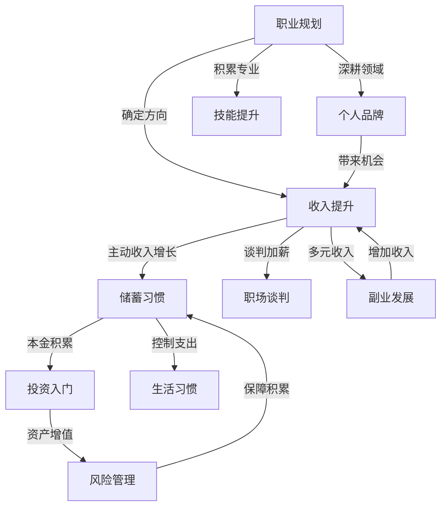
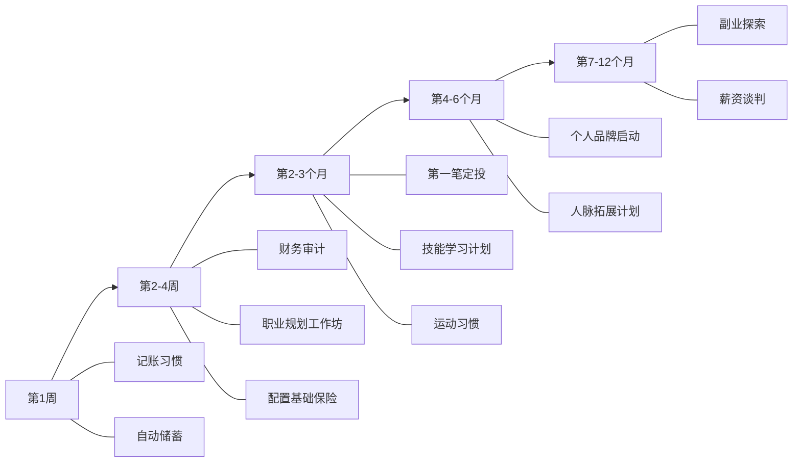

## 十一、本节总结：核心技巧全景回顾与行动框架

前面十节内容覆盖了20-30岁积累期最核心的十个能力模块。本节不是简单的"重复一遍"，而是从全局视角重新审视这些技巧之间的关系，帮你建立一套**可执行的系统**，而不是一堆零散的"建议"。

---

### 1. 十大核心技巧的全景图

这十个技巧不是并列关系，它们之间存在清晰的逻辑链条和依赖关系：

**核心逻辑**：职业规划是起点（选对赛道），收入提升是引擎（增加现金流），储蓄习惯是管道（把收入转化为本金），投资入门是加速器（让钱生钱），风险管理是安全网（保护已有积累）。个人品牌、技能提升、人脉构建是**放大器**——它们不直接产生收入，但能放大其他所有环节的效果。生活习惯是地基——没有健康的身体和高效的时间管理，上面所有环节都运转不起来。职场谈判和副业发展是**增量手段**——在既有框架上额外增加收入。

---

### 2. 各技巧核心要点速览

下面用一张表把十个技巧的关键信息压缩在一起，方便随时查阅：

| 技巧 | 一句话核心 | 关键动作 | 优先级 | 见效周期 |
|------|-----------|---------|--------|---------|
| 职业规划 | 选对行业比努力重要10倍 | 三维度匹配：兴趣×能力×市场 | ★★★★★ | 1-3年 |
| 收入提升 | 收入=行业天花板×专业位置×谈判能力 | 专业深耕+适时跳槽+副业探索 | ★★★★★ | 6-18个月 |
| 储蓄习惯 | 储蓄率是积累期最重要的财务指标 | 工资到账自动转存30%，先储蓄后消费 | ★★★★★ | 立即 |
| 投资入门 | 不是选对股票，而是坚持长期投资 | 从宽基指数基金定投起步，500元即可 | ★★★★☆ | 3-5年 |
| 人脉构建 | 人脉质量>数量，价值交换是本质 | 先提升自身价值，再精准社交 | ★★★★☆ | 1-3年 |
| 个人品牌 | 专业能力×内容输出×传播范围 | 每周输出1篇专业内容，持续6个月 | ★★★☆☆ | 6-12个月 |
| 生活习惯 | 健康是1，其他都是后面的0 | 运动3次/周+睡眠7-8小时+深度工作2小时/天 | ★★★★☆ | 立即 |
| 风险管理 | 不让意外摧毁你的积累 | 社保→医疗险→意外险→重疾险 | ★★★★☆ | 立即 |
| 副业发展 | 用主业技能做自由职业→产品化→被动收入 | 选择与主业协同的副业方向 | ★★★☆☆ | 3-12个月 |
| 职场谈判 | 用数据而非情绪说话 | 做好市场薪资调研，锚定效应+BATNA | ★★★★☆ | 1-3个月 |

**优先级说明**：五星是"必须立即行动"的项目，四星是"本月内启动"，三星是"本季度内规划"。这不是说三星不重要，而是五星项目是其他一切的基础。

---

### 3. 十大技巧之间的乘法效应

单独做好其中一两个技巧，效果有限。真正产生质变的是**多技巧协同**：

**场景一：只做储蓄**
月入1万，储蓄率30%，月存3000元，一年3.6万，五年18万。看起来不错，但如果没有投资，这18万在通胀侵蚀下购买力不断缩水。

**场景二：储蓄+投资**
同样的30%储蓄率，但把储蓄定投到年化8%的指数基金。五年后总资产约21.5万，其中收益3.5万。收益还不惊人，但习惯已经建立。

**场景三：职业提升+储蓄+投资**
通过职场谈判和技能提升，三年后月入从1万涨到1.5万。储蓄率保持30%，月存4500元。加上前两年的积累和投资收益，五年后总资产约40万。收入增长+储蓄纪律+投资复利的乘法效应开始显现。

**场景四：全方位协同**
在场景三的基础上，增加个人品牌（带来副业机会）和人脉构建（带来更好的职业机会）。五年后月入可能达到2万+，副业月入3000-5000，储蓄率40%，投资组合年化10%。五年后总资产可能达到80-100万。

这就是为什么本章把这十个技巧放在一起讲——**它们不是十个独立的"待办事项"，而是一个系统的十个齿轮**。任何一个齿轮不转，整个系统的效率都会大打折扣。

---

### 4. 两个阶段的执行策略

根据章节概览中的阶段划分，这十个技巧在20-25岁和25-30岁的侧重点完全不同：

#### 20-25岁：探索与建立期

这个阶段的核心是**试错和建立基础系统**。

| 技巧 | 20-25岁重点 | 具体行动 |
|------|------------|---------|
| 职业规划 | 尝试2-3个方向，快速筛选 | 每个方向至少坚持6个月再评估 |
| 收入提升 | 保住底线，控制预期 | 首要目标是"不月光"，而非高薪 |
| 储蓄习惯 | 建立自动化储蓄系统 | 储蓄率≥20%，先储蓄后消费 |
| 投资入门 | 开户+第一笔定投 | 500元/月定投沪深300指数基金 |
| 人脉构建 | 广泛链接，建立初步网络 | 每月参加1次行业活动 |
| 个人品牌 | 选定平台，开始输出 | 不求粉丝量，只求持续性 |
| 生活习惯 | 建立基本运动和作息习惯 | 每周3次运动，固定起床时间 |
| 风险管理 | 配置基础保险 | 社保+百万医疗险+意外险 |
| 副业发展 | 不急于发展副业 | 优先把主业做到合格水平 |
| 职场谈判 | 学习谈判思维 | 了解市场薪资水平，积累谈判资本 |

**20-25岁最常犯的错误**：跳过"探索"直接"深耕"。很多人一毕业就急着确定方向，结果选了一个不适合自己的赛道，三五年后不得不重新开始。这个阶段的试错是有价值的——前提是你每次尝试都有明确的验证目标。

#### 25-30岁：深耕与加速期

这个阶段的核心是**聚焦和放大**。

| 技巧 | 25-30岁重点 | 具体行动 |
|------|------------|---------|
| 职业规划 | 确定方向，深度积累 | 在选定领域做到前20% |
| 收入提升 | 加速增长，多元化 | 升职加薪+副业+投资三管齐下 |
| 储蓄习惯 | 提高储蓄率 | 目标30%以上，收入增长部分50%用于储蓄 |
| 投资入门 | 系统化资产配置 | 定投金额提升到收入的20-30% |
| 人脉构建 | 精准深耕，淘汰无效社交 | 聚焦5-10个核心关系 |
| 个人品牌 | 产生实际回报 | 猎头/合作方开始主动找你 |
| 生活习惯 | 优化效率 | 深度工作时间增加到3-4小时/天 |
| 风险管理 | 完善保险组合 | 增加重疾险、定期寿险 |
| 副业发展 | 从技能变现到产品化 | 把专业能力打包成课程/咨询/工具 |
| 职场谈判 | 实战运用 | 每年至少一次正式薪资谈判 |

**25-30岁最常犯的错误**：继续"探索"不聚焦。到了25岁，你应该已经通过前五年的尝试找到了大致方向。这个阶段再频繁切换赛道，就是在浪费最宝贵的加速期。

---

### 5. 常见的执行陷阱与应对

知道"该做什么"和"能做到"之间隔着巨大的鸿沟。以下是最常见的执行陷阱：

#### 陷阱一：信息过载导致的行动瘫痪

**表现**：读了大量理财/职业发展/个人成长的文章和书籍，感觉"什么都懂了"，但什么都没做。

**破解方法**：采用"最小可行行动"策略。不要试图同时启动所有十个技巧，先从最容易见效的两个开始——储蓄习惯（立即见效）和投资入门（建立习惯）。当这两个成为自动化行为后，再逐步增加其他技巧。

#### 陷阱二：完美主义导致的拖延

**表现**："等我研究清楚了再开始投资"、"等我找到真正热爱的行业再深耕"、"等我准备好再开始写内容"。

**破解方法**：接受"70分的开始"优于"100分的计划"。500元的定投不需要你成为投资专家；一篇质量一般的文章比一个永远在酝酿的"完美"系列有价值得多。行动中学习的效率远高于"准备好了再开始"。

#### 陷阱三：短期看不到效果就放弃

**表现**：定投3个月发现收益是负的就停止；写了一个月公众号发现没人看就放弃；记了两个月账觉得"太麻烦"就不记了。

**破解方法**：理解各技巧的见效周期。储蓄是即时见效的（当月就能看到余额增加），投资需要3-5年才能看到复利效果，个人品牌需要6-12个月才能看到反馈，人脉构建的效果可能在3年后某个关键时刻才显现。**用"系统"思维替代"目标"思维**——不要盯着"赚了多少钱"或"涨了多少粉"，而是问自己"系统是否在运转"。

#### 陷阱四：只学不做，用"学习"替代"行动"

**表现**：收藏了100篇投资文章但没开过基金账户；买了5本职业规划的书但没写过一份职业规划；关注了20个理财博主但没记过一天账。

**破解方法**：设定"学做比"——每花1小时学习，必须花2小时实践。看完一篇基金定投的文章，当天就去开户并设置第一笔定投。读完一个记账方法论，今天就开始记录第一笔支出。

#### 陷阱五：孤立执行，缺乏反馈

**表现**：自己默默记账、默默投资、默默学习，从不和任何人交流，不知道自己的做法对不对，也没有外部压力督促自己坚持。

**破解方法**：找一个"积累伙伴"或加入一个有同样目标的社群。每月互相复盘一次财务状况和目标进展。外部的承诺和反馈机制能把坚持的概率提高3倍以上（这是行为科学的研究结论，不是鸡汤）。

---

### 6. 核心技巧的优先级排序：从零开始的行动路径

如果你现在什么都没做，以下是最优的启动顺序：

**第一步（第1周）：建立记账习惯和自动储蓄**
这是所有积累的起点。没有记账，你不知道钱去了哪里；没有自动储蓄，你永远存不下钱。具体操作：下载一个记账App（推荐随手记或MoneyWiz），记录今天的每一笔支出；设置发工资当天自动转存30%到专用储蓄账户。

**第二步（第2-4周）：财务审计+职业规划+基础保险**
花1小时做一次完整的财务状况审计（资产、负债、收支、储蓄率）；花2小时做一次职业规划工作坊（三维度匹配、3/5/10年目标）；花30分钟配置百万医疗险和意外险（每年几百元，关键时刻能救命）。

**第三步（第2-3个月）：启动投资+技能学习+运动习惯**
开通基金账户，设置第一笔500元/月的沪深300指数基金定投；制定一个与职业相关的技能学习计划（每天30分钟）；建立每周3次、每次30分钟的运动习惯。

**第四步（第4-6个月）：个人品牌+人脉拓展**
开始每周输出1篇与专业相关的内容（知乎回答、公众号文章、GitHub项目）；每月参加1次行业活动或线上社群。

**第五步（第7-12个月）：副业探索+薪资谈判**
在主业稳定的基础上，尝试与主业协同的副业方向；做一次正式的薪资谈判（前提是已经积累了足够的谈判资本）。

---

### 7. 自检清单：你的积累系统运转得如何？

完成本节学习后，用以下清单评估你当前的状态。这不是打分，而是帮你识别**最大的短板**在哪里——短板就是你下一步应该优先解决的问题：

#### 基础层（必须达标）

- [ ] 我有记账习惯，知道每月的钱花在了哪里
- [ ] 我的储蓄率≥20%，且是自动执行的
- [ ] 我有3个月以上生活费的紧急备用金
- [ ] 我配置了基础保险（社保+百万医疗+意外险）
- [ ] 我有规律的运动习惯（每周≥3次）

#### 进阶层（6-12个月内达标）

- [ ] 我已经开始了投资（哪怕只是500元/月的定投）
- [ ] 我有清晰的3年职业规划
- [ ] 我每天在技能提升上投入≥30分钟
- [ ] 我有稳定的内容输出渠道（文章/视频/开源项目）
- [ ] 我过去一年认识了10个以上有价值的新朋友

#### 高阶层（12-24个月内达标）

- [ ] 我的收入来源≥2个（主业+副业或投资收益）
- [ ] 我在所在领域有一定知名度（猎头/合作方主动联系）
- [ ] 我的储蓄率≥30%，且随着收入增长同步提升
- [ ] 我能清晰地说出自己的市场价值和核心竞争力
- [ ] 我有完整的资产配置方案（不仅仅是定投）

**评估方法**：数一数你打了多少个勾。基础层全部达标=你已经超过了70%的同龄人。进阶层全部达标=你已经走在了正确的轨道上。高阶层全部达标=你在30岁时将拥有绝大多数人到40岁才能达到的积累水平。

---

### 8. 从核心技巧到下一阶段

本节总结了20-30岁积累期的十个核心技巧。但技巧只是"术"，真正的"道"是理解这十年的战略意义——你做的每一件事都在为未来三十年的财富增长打地基。

如果你已经理解了这些技巧背后的逻辑，接下来要做的不是"学更多"，而是"做起来"。回顾上面的行动路径，从第一步开始，今天就执行。

在后续的"技能提升的系统方法"和"社交资本的积累策略"两节中，我们将对其中两个关键技巧进行更深入的展开。而在"实战案例"部分，你会看到这些技巧在真实场景中是如何协同运作的。

**记住：积累期的核心公式——**

> **20-30岁积累效果 = 职业选择 × 学习投入 × 储蓄率 × 投资开始时间 × 人脉质量**

五个变量是乘法关系。任何一个为零，结果就是零。但哪怕每个变量只是"及格"水平，乘法效应也会产生远超你预期的结果。

现在就开始。
