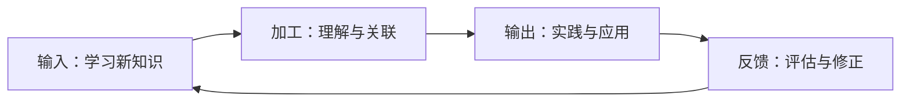
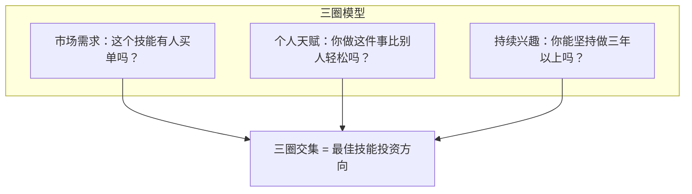
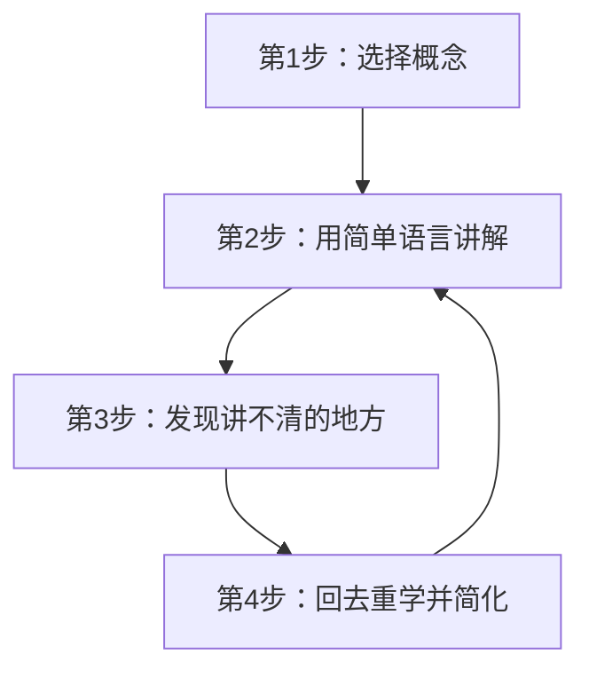
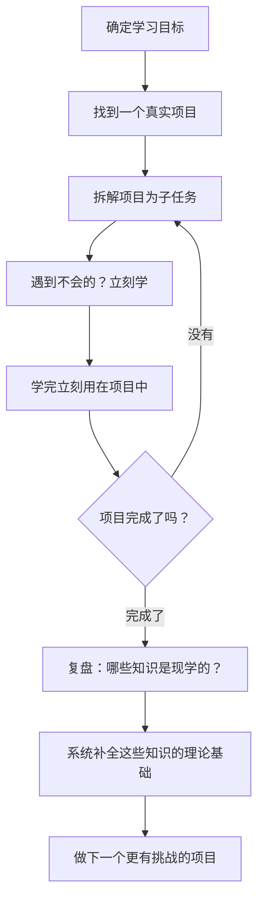

## 十二、技能提升的系统方法

> 技能是你唯一不会被没收的资产。市场可以崩盘，公司可以倒闭，但长在你身上的能力，永远是你的。

20-30岁是技能积累的黄金窗口期。这个阶段你的时间成本最低、学习能力最强、试错代价最小。但"努力学习"和"有效提升"之间存在巨大鸿沟——很多人学了五年，只是把第一年的经验重复了五遍。本节提供一套经过验证的系统方法，让你的每一小时学习都能产生可衡量的回报。

### 1. 技能提升的底层逻辑

#### 1.1 什么是"系统方法"

系统方法 ≠ 制定学习计划。它是一个包含**输入→加工→输出→反馈**四个环节的完整闭环：



缺少任何一个环节，学习效率都会断崖式下降：

- 只输入不加工 → 知识囤积症，收藏了500个教程从未打开
- 只加工不输出 → 纸上谈兵，面试时能说但工作中不能做
- 只输出不反馈 → 低水平重复，做了三年还是初级水平

#### 1.2 技能的三层结构

任何技能都可以拆解为三个层次，提升时必须按层推进：

| 层次 | 定义 | 举例（编程技能） | 举例（沟通技能） |
|------|------|-----------------|-----------------|
| **基础层** | 该领域的基本概念和操作 | 变量、循环、函数 | 倾听、表达、提问 |
| **应用层** | 在真实场景中组合运用 | 构建完整项目 | 主持会议、商务谈判 |
| **创新层** | 形成独特方法论或创造新范式 | 设计架构、开源贡献 | 培训他人、出书立说 |

**关键认知**：大多数人卡在基础层和应用层之间的"知道但做不到"地带。突破这个瓶颈的方法不是学更多理论，而是增加高质量的输出和反馈。

#### 1.3 20-30岁的技能投资策略

这个阶段的技能选择应遵循"三圈模型"：



- **只满足市场需求**：能赚钱但容易倦怠（如纯数据录入）
- **只满足个人天赋**：有天赋但无法变现（如很多"兴趣爱好"）
- **只满足持续兴趣**：热情但缺乏回报（如冷门领域的钻研）
- **三圈交集**：既赚钱、又擅长、还热爱——这就是你的"甜蜜区"

### 2. 技能选择：学什么比怎么学更重要

#### 2.1 技能的市场价值评估

在投入时间之前，先做一次冷静的市场调研。以下是评估框架：

**评估维度与权重：**

| 维度 | 权重 | 评估方法 | 得分标准（1-5分） |
|------|------|----------|-------------------|
| 市场需求量 | 25% | 招聘网站搜索该技能的岗位数量 | 5分：岗位数>10万；1分：<1000 |
| 薪资溢价 | 20% | 对比有/无该技能的同岗位薪资差距 | 5分：溢价>50%；1分：无溢价 |
| 可迁移性 | 20% | 该技能能用在多少个行业/岗位 | 5分：几乎所有行业；1分：单一行业 |
| AI替代难度 | 15% | AI能在多大程度上替代该技能 | 5分：几乎无法替代；1分：已被替代 |
| 学习曲线 | 10% | 从零到能用需要多长时间 | 5分：<3个月；1分：>2年 |
| 资源可得性 | 10% | 学习资源是否充足、是否免费 | 5分：大量免费优质资源；1分：几乎无资源 |

**2026年高价值技能参考：**

| 技能类别 | 具体技能 | 综合评分 | 适合人群 |
|----------|---------|---------|---------|
| 技术类 | Python/数据分析 | ★★★★★ | 逻辑思维强、愿意与数据打交道 |
| 技术类 | AI提示工程/AI应用开发 | ★★★★☆ | 对新技术敏感、愿意持续学习 |
| 设计类 | UI/UX设计 | ★★★★☆ | 有审美、同理心强 |
| 商业类 | 项目管理（PMP等） | ★★★★☆ | 沟通能力强、擅长协调 |
| 内容类 | 短视频制作/运营 | ★★★★☆ | 有创意、了解年轻用户 |
| 销售类 | B2B销售/大客户管理 | ★★★★★ | 抗压能力强、善于建立关系 |
| 语言类 | 英语商务沟通 | ★★★★☆ | 有基础、愿意开口练习 |

#### 2.2 T型人才策略

20-30岁最优的技能组合策略是"T型结构"：

- **横向（广度）**：掌握3-5个领域的基础知识，能与不同领域的人对话
- **纵向（深度）**：在一个核心领域做到前10%，成为"被需要"的人

**实操建议：**

```text
核心技能（深度，投入60%时间）
├── 例：Python后端开发
│   ├── 精通：Django/FastAPI、数据库优化、系统设计
│   ├── 熟练：Docker、CI/CD、云服务
│   └── 了解：前端基础、产品思维、项目管理
│
辅助技能1（中度，投入20%时间）
├── 例：数据分析
│   ├── 熟练：SQL、Pandas、数据可视化
│   └── 了解：机器学习基础、统计学
│
辅助技能2（浅度，投入10%时间）
├── 例：技术写作
│   └── 能写清晰的技术文档和博客
│
软技能（贯穿始终，投入10%时间）
├── 沟通表达、时间管理、向上管理
```

#### 2.3 避免"技能选择陷阱"

| 陷阱 | 表现 | 纠正方法 |
|------|------|---------|
| **跟风学习** | 看到什么火就学什么，一年换了5个方向 | 先做三圈评估，选定后至少坚持6个月 |
| **证书陷阱** | 花大量时间考证，但证书在目标行业无用 | 先调研目标岗位JD，看是否要求该证书 |
| **完美准备** | "等我学完X再开始做Y"，永远在准备 | 设定"最小可用技能"标准，边做边学 |
| **低价值勤奋** | 每天学8小时但都是基础内容的重复 | 用"舒适区-学习区-恐慌区"评估学习内容 |
| **孤岛技能** | 学了一个与现有技能不关联的新技能 | 优先学能与现有技能产生"组合效应"的技能 |

### 3. 学习方法：科学高效的技能习得

#### 3.1 费曼学习法——用"教"来学

费曼学习法的核心是：**如果你不能用简单的语言向一个外行解释清楚，说明你还没有真正理解。**

**四步流程：**



**实操模板：**

```text
我要学习的概念：_______________

用一句话解释（假设对方是10岁小孩）：
→ _______________

如果对方追问"为什么"，我能继续解释吗？
→ 能 / 不能（如果不能，标记为需要深入学习的点）

我用了哪些专业术语？能替换成日常用语吗？
→ _______________

我卡在哪里了？回去重学这部分：
→ _______________
```

**实际应用场景：**
- 学完一个技术概念后，写一篇博客解释它
- 在团队内部做一次10分钟的知识分享
- 在技术社区回答新手的问题
- 录一段2分钟的短视频讲解

#### 3.2 刻意练习——走出舒适区的科学方法

"一万小时定律"被严重误读了。关键不是时间，而是**刻意练习的质量**。真正的刻意练习有四个要素：

| 要素 | 说明 | 反面案例 |
|------|------|---------|
| **明确的改进目标** | 每次练习专注提升一个具体子技能 | "今天我要提高编程能力"（太模糊） |
| **在学习区练习** | 难度略高于当前水平，大约70%能做对 | 只做已经会的题目（舒适区） |
| **即时反馈** | 能马上知道哪里做得对、哪里做错 | 写完代码不运行、不测试、不review |
| **高度专注** | 练习时全神贯注，非机械重复 | 边刷视频边"学习" |

**如何为不同技能设计刻意练习：**

**编程技能：**
```text
练习目标：本周提升"错误处理"能力
具体做法：
1. 找3个开源项目的错误处理代码，逐行分析
2. 重构自己项目中5个函数的错误处理逻辑
3. 为重构后的代码编写单元测试覆盖边界条件
4. 请一位同事review，记录反馈
验证标准：重构后的代码在异常输入下不会crash，且错误信息对用户友好
```

**沟通技能：**
```text
练习目标：本周提升"结构化表达"能力
具体做法：
1. 每次发言前先用3秒在脑中列出"结论→原因→例子"
2. 在3次会议中刻意使用"总-分-总"结构发言
3. 每次会议后自我评估：是否在30秒内说清了核心观点？
4. 请一位信任的同事给反馈
验证标准：能在1分钟内清晰汇报一个项目进展
```

#### 3.3 间隔重复——对抗遗忘曲线

德国心理学家艾宾浩斯发现，遗忘在学习后立即开始，且速度先快后慢。间隔重复通过在最佳时间点复习来对抗遗忘：

| 复习次数 | 距首次学习 | 记忆保持率（无复习） | 记忆保持率（间隔复习） |
|----------|-----------|---------------------|----------------------|
| 第1次 | 1天后 | 33% | 90%+ |
| 第2次 | 3天后 | 25% | 90%+ |
| 第3次 | 7天后 | 20% | 95%+ |
| 第4次 | 14天后 | 15% | 95%+ |
| 第5次 | 30天后 | 10% | 97%+ |

**工具推荐：**
- **Anki**：最成熟的间隔重复软件，免费开源，支持自定义卡片
- **Obsidian + Spaced Repetition插件**：笔记和复习一体化
- **手动方法**：用笔记本记录关键知识点，按1-3-7-14-30天周期复习

**实操：把学到的知识变成Anki卡片**

```text
正面：什么是数据库索引？为什么能加速查询？
背面：
- 索引是一种数据结构（如B+树），存储了列值与行位置的映射
- 类比：书的目录——不用翻遍全书就能找到对应章节
- 代价：占用额外存储空间，且会降低写入速度（因为要同步更新索引）
- 最佳实践：在WHERE、JOIN、ORDER BY频繁使用的列上建索引
```

#### 3.4 项目驱动学习——以战代练

学习任何技能最快的方式不是"先学完再做"，而是"做一个真实项目，边做边学"。

**项目选择的SMART标准：**

- **S（Specific）**：目标明确，如"搭建一个个人博客网站"
- **M（Measurable）**：有可衡量的完成标准，如"能正常发布文章并被搜索引擎收录"
- **A（Achievable）**：难度略高于当前水平，但通过努力能在2-4周内完成
- **R（Relevant）**：与你的技能提升方向一致，不是随便找个有趣的项目
- **T（Time-bound）**：设定截止日期，避免无限拖延

**项目驱动学习的完整流程：**



**不同技能的项目示例：**

| 技能方向 | 入门项目 | 进阶项目 | 高级项目 |
|----------|---------|---------|---------|
| Python编程 | 爬取豆瓣Top250电影数据 | 搭建一个REST API服务 | 开发一个带用户系统的Web应用 |
| 数据分析 | 分析自己的消费记录 | 分析某行业公开数据集 | 为公司做一个数据仪表盘 |
| UI设计 | 重新设计一个App的登录页 | 设计一个完整的移动端App | 完成一套设计系统 |
| 写作 | 每周写一篇500字的读书笔记 | 运营一个垂直领域的公众号 | 出版一本电子书 |
| 英语 | 每天用英语写3句日记 | 用英语完成一个工作汇报 | 参加英语技术会议并演讲 |

### 4. 技能提升的实操系统

#### 4.1 个人技能提升计划表

用以下模板制定你的季度技能提升计划：

```markdown
## 季度技能提升计划（2026 Q3）

### 核心技能：Python数据分析

**当前水平**：能用Pandas做基础数据处理
**目标水平**：能独立完成端到端的数据分析项目，包含数据清洗、探索性分析、可视化和报告

**关键里程碑：**
- [ ] 第1-2周：完成Kaggle的"Pandas"微课程，掌握高级数据操作
- [ ] 第3-4周：用真实数据集完成第一个分析项目（消费数据分析）
- [ ] 第5-6周：学习Matplotlib/Seaborn数据可视化，完成3种图表的制作
- [ ] 第7-8周：学习统计基础（假设检验、回归分析）
- [ ] 第9-10周：完成一个完整的数据分析项目并发布到GitHub
- [ ] 第11-12周：复盘总结，输出一篇技术博客

**每日最小行动**：
- 工作日：30分钟练习（写代码或看教程）+ 15分钟Anki复习
- 周末：2小时项目实战

**验证标准**：
- 能在Kaggle竞赛中进入前50%
- GitHub上有2个完整的数据分析项目
- 能在面试中用数据讲故事
```

#### 4.2 每日学习时间管理

20-30岁的人通常面临"工作忙、时间少"的困境。以下是几种经过验证的时间安排方案：

**方案一：早起型（适合早起的人）**
```text
06:00-06:30  起床、洗漱
06:30-07:30  深度学习时间（核心技能，最需要脑力的内容）
07:30-08:00  早餐、通勤（听播客/有声书）
```

**方案二：碎片型（适合加班多的人）**
```text
通勤30分钟   → 听课程音频/播客
午休30分钟   → 做Anki复习/阅读技术文章
睡前30分钟   → 写学习笔记/复盘当天所学
周末集中3-4小时 → 项目实战
```

**方案三：番茄工作法型（适合注意力不集中的人）**
```text
设定25分钟专注学习 → 5分钟休息 → 重复
4个番茄钟后休息15-30分钟
每天完成4-6个番茄钟（2-3小时有效学习）
```

**关键原则：**
- 把学习时间安排在意志力最高的时段（通常是早上或刚下班后）
- 学习前关闭所有通知（微信、邮件、社交媒体）
- 使用Forest、专注面条等App辅助保持专注
- 学习时间的质量远比数量重要——2小时高度专注 > 5小时边学边玩

#### 4.3 学习资源筛选方法

互联网时代不缺学习资源，缺的是对资源的筛选能力。以下是筛选框架：

**资源质量评估清单：**

```text
□ 作者/机构是否有实际从业经验？（不是纯理论派）
□ 内容是否有明确的学习路径？（不是零散的知识点）
□ 是否有配套的练习/项目？（纯看视频是最低效的学习方式）
□ 是否是最新的？（技术类资源超过2年要谨慎）
□ 社区评价如何？（看评论区的真实反馈）
□ 是否有免费试看/试学？（先试再决定是否付费）
```

**各技能类型推荐资源获取渠道：**

| 技能类型 | 免费渠道 | 付费渠道（性价比优先） |
|----------|---------|---------------------|
| 编程 | freeCodeCamp、菜鸟教程、GitHub Trending | 极客时间、Udemy（等打折） |
| 数据分析 | Kaggle Learn、Pandas官方文档 | DataCamp、和鲸社区 |
| 设计 | Figma社区、Dribbble | 优设网、站酷高高手 |
| 英语 | BBC Learning English、播客 | 多邻国、Cambly |
| 商业/管理 | 哈佛商业评论精选、得到听书 | MBA智库、混沌学园 |

#### 4.4 构建个人知识管理系统

学习的内容如果不用系统管理，3个月后你会忘记80%。推荐以下知识管理架构：

```text
知识库/
├── 00-Inbox/           # 收件箱：临时收集的信息，每周清理
├── 01-Projects/        # 项目笔记：与当前项目相关的知识
├── 02-Areas/           # 领域笔记：按技能领域分类
│   ├── 编程/
│   │   ├── Python/
│   │   ├── 数据库/
│   │   └── 系统设计/
│   ├── 数据分析/
│   ├── 设计/
│   └── 沟通表达/
├── 03-Resources/       # 资源库：收藏的教程、工具、参考链接
├── 04-Archives/        # 归档：已完成项目和过期内容
└── Templates/          # 模板：学习笔记模板、项目复盘模板
```

**学习笔记模板（每次学完一个知识点后填写）：**

```markdown
## 知识点：_______________

### 一句话总结
（用一句通俗的话说清楚这是什么）

### 核心原理
（为什么是这样？底层机制是什么？）

### 实际应用场景
（我在什么情况下会用到这个？）

### 代码/示例
（写下可运行的示例）

### 与其他知识点的关联
（这个知识点和我已知的哪些知识有关联？）

### 待深入的问题
（还有什么不理解的？需要进一步学习的？）

### 创建日期 | 标签 | 来源
```

### 5. 反馈与迭代：让进步可见

#### 5.1 建立反馈回路

没有反馈的学习就像在黑暗中射箭——你不知道自己偏了多远。

**四种反馈来源（按及时性排序）：**

| 反馈来源 | 及时性 | 质量 | 适用场景 |
|----------|--------|------|---------|
| **自动化测试/工具** | 即时 | 精确 | 编程（单元测试、lint）、写作（语法检查） |
| **同行Review** | 1-3天 | 高 | 代码review、文稿互审、作品互评 |
| **导师/上级反馈** | 1-2周 | 最高 | 定期1on1、找mentor、参加code review |
| **市场反馈** | 1-3月 | 真实 | 面试结果、客户评价、项目成果数据 |

**实操建议：**
- 编程：每段代码写完先跑测试，再找人review
- 写作：每篇文章发布后看阅读量、评论、转发数据
- 设计：把作品发到Dribbble/站酷，看真实用户的反馈
- 沟通：每次重要会议/汇报后复盘——对方的反应如何？是否理解了你的意思？
- 英语：用Grammarly检查写作，用语音识别工具检查发音

#### 5.2 月度技能复盘

每月花1小时做一次技能复盘，用以下模板：

```markdown
## 月度技能复盘（2026年6月）

### 本月学了什么？
1. _______________
2. _______________
3. _______________

### 产出了什么？
- 项目/作品：_______________
- 代码/文档：_______________
- 分享/文章：_______________

### 哪些学习是有效的？（保留）
- _______________

### 哪些学习是无效的？（停止）
- _______________

### 下月要调整什么？
- _______________

### 技能自评（1-10分）
| 技能 | 上月 | 本月 | 目标 |
|------|------|------|------|
| ___  | __   | __   | __   |
```

#### 5.3 量化进步的指标体系

"感觉进步了"不可靠，需要可量化的指标：

| 技能方向 | 量化指标 | 数据来源 |
|----------|---------|---------|
| 编程 | GitHub提交频率、代码review通过率、LeetCode通过题数 | GitHub Insights、LeetCode个人主页 |
| 数据分析 | 完成的分析项目数、Kaggle排名 | Kaggle个人主页 |
| 设计 | Dribbble作品数及点赞数、设计项目交付速度 | Dribbble数据、项目管理工具 |
| 写作 | 发布文章数、阅读量、粉丝增长 | 公众号/博客后台数据 |
| 英语 | 词汇量测试分数、口语流利度评分 | TestYourVocab、ELSA Speak |
| 沟通 | 汇报被采纳率、会议发言频率 | 自我记录 |

### 6. 常见误区与纠正

#### 6.1 "学完再做"谬误

**误区**：很多人认为必须系统学完一门课程/一本书，才有资格开始实践。

**真相**：学习的80%发生在实践中，只有20%发生在"学"的过程中。边做边学的效率是"先学再做"的3-5倍。

**纠正方法**：用"最小可用技能"标准——学到能开始做项目的程度就立刻动手。遇到不会的再回头学。

#### 6.2 "收藏=学会"幻觉

**误区**：收藏了大量教程、文章、课程，感觉"以后会看"，但从不回头看。

**真相**：收藏行为给大脑发送了一个"已完成"的信号，实际上什么都没学。

**纠正方法**：
- 每周清理一次收藏夹，超过2周没看的直接删除
- 收藏时强制自己写一句"我要从这个资源里学到什么"
- 用"即时学习"替代"以后再看"——看到好资源，现在就花15分钟看核心部分

#### 6.3 "多线程学习"陷阱

**误区**：同时学习3-5个技能，觉得这样效率更高。

**真相**：频繁切换学习领域的认知成本极高。研究表明，任务切换会导致40%的效率损失。

**纠正方法**：
- 同一时期最多聚焦1个核心技能 + 1个辅助技能
- 用"季度主题"制：每个季度主攻一个方向
- 不同技能安排在不同时间段（如早上学编程，通勤听英语）

#### 6.4 "速成心态"

**误区**：期望通过一个"21天速成班"就掌握一项技能。

**真相**：任何值得掌握的技能都需要持续投入。速成只能让你达到"入门"水平，而入门水平在市场上几乎没有溢价。

**纠正方法**：
- 对自己诚实：给自己一个合理的时间预期（核心技能通常需要6-12个月）
- 关注过程而非结果：把"每天学习1小时"作为目标，而不是"3个月精通Python"
- 记录进度日志：定期回看，你会发现自己比想象中进步更大

### 7. 进阶：从技能学习者到技能创造者

#### 7.1 输出倒逼输入——用"教"来"学"的高级版

当你在某个领域积累了足够经验后，开始输出内容：

| 输出形式 | 难度 | 影响力 | 适合阶段 |
|----------|------|--------|---------|
| 写技术博客 | ★★☆ | 中 | 入门6个月后 |
| 在社区回答问题 | ★★☆ | 低-中 | 入门3个月后 |
| 录教学视频 | ★★★ | 高 | 1年以上经验 |
| 做技术分享/演讲 | ★★★☆ | 高 | 2年以上经验 |
| 写书/出课程 | ★★★★ | 很高 | 3年以上经验 |
| 开源项目 | ★★★★★ | 最高 | 技术深度足够时 |

**输出的额外收益：**
- 建立个人品牌和行业影响力
- 收到来自同行的反馈和建议
- 形成"学习→输出→反馈→改进"的正循环
- 为未来的跳槽、创业积累作品集

#### 7.2 构建个人技能护城河

当你的技能达到一定水平后，要开始思考如何构建"护城河"——让别人难以轻易复制你的竞争力：

**四种护城河：**

1. **深度护城河**：在某个细分领域做到极致，成为公认的专家
   - 例：不是"会做数据分析"，而是"电商行业的用户行为分析专家"

2. **组合护城河**：将2-3个技能组合成独特的竞争优势
   - 例：编程 + 数据分析 + 行业知识 = "能写代码的行业分析师"

3. **成果护城河**：积累可展示的高质量作品和项目成果
   - 例：GitHub上的高星项目、行业内知名的技术博客、被广泛使用的开源工具

4. **网络护城河**：与行业内的关键人物建立深度连接
   - 例：成为某个技术社区的核心贡献者、在行业会议上做分享

#### 7.3 长期主义：技能复利

技能的提升遵循复利效应——前期积累缓慢，后期增长加速：

```text
第1年：学习基础 → 收入增长10-20%
第2年：形成能力 → 收入增长20-40%（开始有溢价）
第3年：建立口碑 → 收入增长50-100%（被动机会开始出现）
第5年：成为专家 → 收入可能是第1年的3-5倍
```

**关键心态**：
- 前6个月看不到明显回报是正常的，不要因此放弃
- 选择一个方向，至少坚持18个月再评估是否需要调整
- 技能投资的回报不是线性的，而是阶梯式的——积累到一定程度会突然"开窍"

### 8. 行动清单：从今天开始

| 优先级 | 行动 | 时间投入 | 完成标准 |
|--------|------|---------|---------|
| 🔴 立即 | 用"三圈模型"确定你的核心技能方向 | 2小时 | 写出3个候选方向并评分 |
| 🔴 立即 | 制定本季度的技能提升计划 | 1小时 | 填写"季度技能提升计划表" |
| 🟡 本周 | 搭建个人知识管理系统 | 2小时 | 用Obsidian/Notion创建知识库结构 |
| 🟡 本周 | 找到一个适合当前水平的实战项目 | 1小时 | 确定项目并拆解为子任务 |
| 🟢 本月 | 安装Anki并制作第一批学习卡片 | 30分钟 | 创建20张以上卡片 |
| 🟢 本月 | 找到一位可以定期交流的同行或导师 | 持续 | 建立每周或每两周的交流机制 |
| 🔵 持续 | 每日执行最小学习行动 | 30-60分钟/天 | 连续21天不间断 |
| 🔵 持续 | 每月做一次技能复盘 | 1小时/月 | 填写"月度技能复盘模板" |

> 最好的开始时间是十年前，其次是现在。不要等到"准备好了"再开始——你永远不会"准备好"。打开编辑器，写下第一行代码；打开文档，写下第一段文字；打开日程表，预约第一小时学习时间。系统方法的价值不在于让你一步到位，而在于让你的每一步都在正确的方向上。
