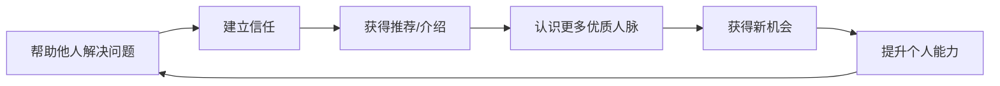
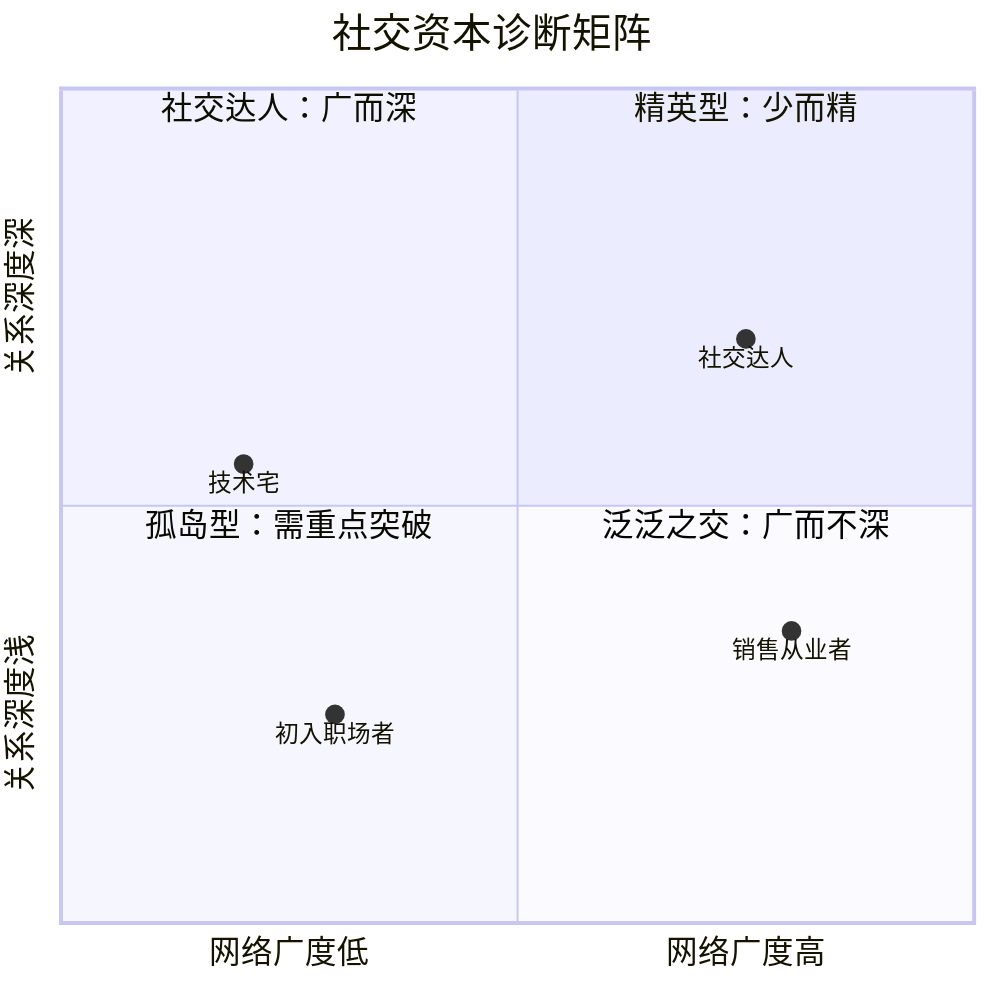
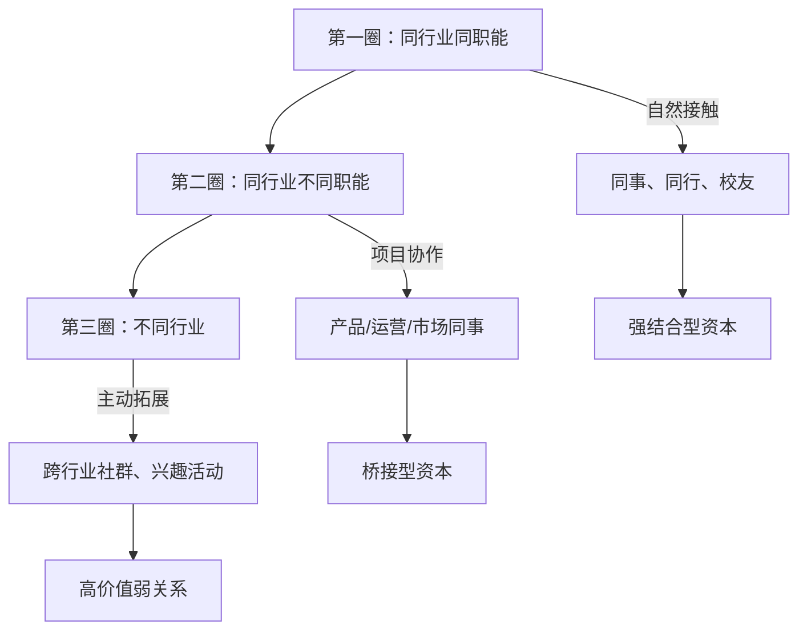
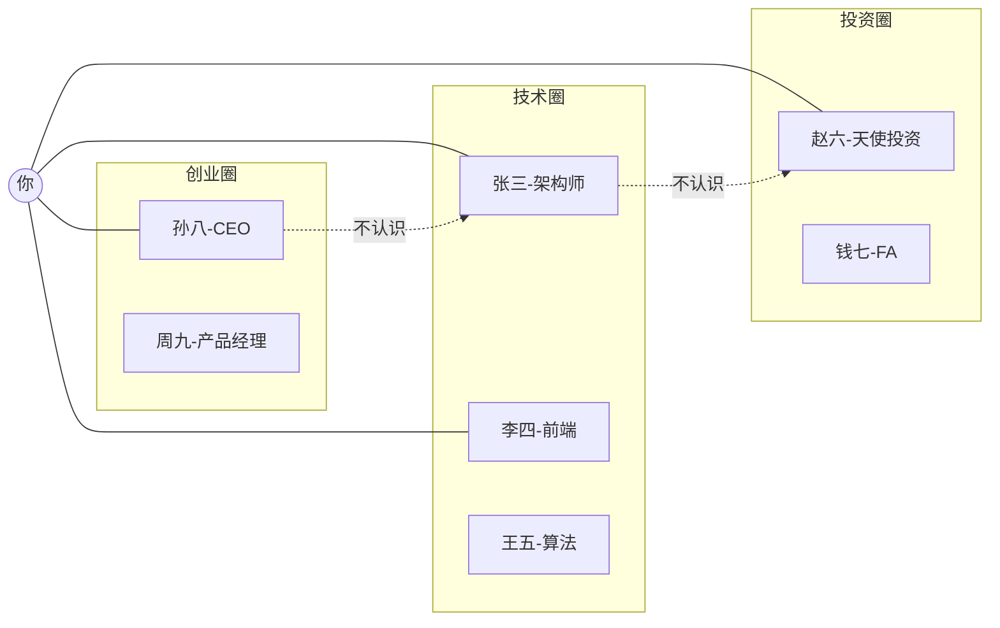

## 十三、社交资本的积累策略

社交资本是20-30岁积累期中容易被忽视却极具杠杆效应的资产。它不同于单纯的人脉数量，而是指嵌入在社会关系网络中的实际可调用资源——包括信任、信息渠道、合作机会和集体行动能力。哈佛大学教授罗伯特·帕特南在《独自打保龄》中指出：社交资本是"社会组织的特征，如信任、规范和网络，它们能够通过促进协调行动来提高社会效率"。

对20-30岁的年轻人而言，社交资本的积累有一个独特的窗口期：这个阶段的职业流动性高、社交圈层正在形成、试错成本相对较低。错过这个窗口，30岁以后再想系统性地建立高质量社交网络，难度会呈指数级上升。

---

### 1. 社交资本的理论基础

#### 1.1 三种社交资本类型

社会学家詹姆斯·科尔曼和罗伯特·帕特南将社交资本分为三种核心类型：

| 类型 | 定义 | 典型场景 | 积累难度 | 变现路径 |
|------|------|----------|----------|----------|
| **结合型资本（Bonding）** | 强关系网络中的深度信任与互惠 | 核心朋友圈、创业合伙人、家族网络 | 高（需长期经营） | 资源共享、联合创业、紧急互助 |
| **桥接型资本（Bridging）** | 弱关系网络中的信息桥梁作用 | 行业会议认识的人、跨领域社群 | 中（需主动拓展） | 信息差套利、跨界合作、新机会获取 |
| **链接型资本（Linking）** | 跨越社会阶层的垂直关系 | 与行业大佬的连接、校友中的高层 | 高（需价值对等） | 资源引入、政策信息、高端推荐 |

20-30岁的策略重心应放在**桥接型资本**上——这类资本的投入产出比最高，也最容易在这个阶段通过参加行业活动、线上社群、跨领域项目来快速积累。

#### 1.2 邓巴数与关系分层

人类学家罗宾·邓巴提出，人类大脑能够维持的稳定社交关系上限约为150人（邓巴数）。但这150人并非等权重分布：

- **核心层（5人）**：你的"深夜可以打电话"的人，完全信任，双向深度投入
- **亲密层（15人）**：每月至少联系一次，彼此了解近况，可以互相帮忙
- **友好层（50人）**：每季度联系，有共同话题，遇到合适机会会想到对方
- **熟人层（150人）**：认识且能叫出名字，偶尔互动，弱关系节点

**实操建议**：不要试图同时维护150个深度关系。把精力集中在核心层和亲密层的建设上，同时通过弱关系网络保持信息流通。每隔一个季度，审视一下你的"150人名单"，淘汰掉失去连接的关系，补充新的弱关系节点。

#### 1.3 社交资本的复利效应

社交资本与金融资本一样具有复利效应，但有一个关键区别：社交资本的"利率"取决于你提供价值的能力。

这个飞轮一旦转起来，社交资本的增长曲线会越来越陡。但启动飞轮需要一个前提条件——你必须先有可以输出的价值。这就是为什么社交资本的积累通常要从技能积累开始。

---

### 2. 社交资本的评估模型

在投入精力积累社交资本之前，你需要先评估自己当前的社交资本存量，然后有针对性地补强。

#### 2.1 社交资本自检清单

以下是一个可量化的自评框架，满分100分：

**网络广度（25分）**
- 你认识多少个不同行业的人？（0-5分：仅本行业；6-10分：跨3个行业以上）
- 你的社交媒体联系人中，有多少是你真正认识的？（0-5分）
- 你是否定期参加行业外的社交活动？（0-5分）
- 你是否有至少一个跨城市的社交节点？（0-5分）
- 你的社交圈是否覆盖了不同年龄段（比你大10岁和小5岁的人）？（0-5分）

**关系深度（25分）**
- 你有多少人可以在需要时提供实质性帮助（介绍工作、借大额资金、推荐客户）？（0-5分）
- 你的核心5人圈中，有多少人是互相深度信任的？（0-5分）
- 你最近一次帮朋友解决重大问题是什么时候？（0-5分）
- 你的社交关系是否覆盖了工作、学习、生活三个维度？（0-5分）
- 当你遇到困难时，有多少人会主动关心你？（0-5分）

**价值输出能力（25分）**
- 你在社交圈中被公认为"擅长某件事"吗？（0-5分）
- 你是否有至少一个可以持续输出价值的平台（公众号、社群、技术博客）？（0-5分）
- 别人找你帮忙时，你能在多大比例上真正帮到？（0-5分）
- 你是否有意识地定期为社交圈贡献信息或资源？（0-5分）
- 你的社交互动中，"给予"和"获取"的比例是否健康（至少1:1）？（0-5分）

**信息获取效率（25分）**
- 重要行业消息传到你耳中的时间差（比公开报道早多久）？（0-5分）
- 你是否能通过社交关系获取非公开信息（如公司内部情况、真实薪资水平）？（0-5分）
- 你的信息来源是否多元（线上社群、线下活动、一对一交流）？（0-5分）
- 你是否能区分"信息噪声"和"有价值的信息"？（0-5分）
- 你是否有至少2个不同领域的信息渠道？（0-5分）

**评分解读**：
- 80-100分：社交资本充沛，重点维护现有网络质量
- 60-79分：基础扎实，需要在薄弱维度针对性补强
- 40-59分：有一定基础但明显短板，需要系统性规划
- 0-39分：社交资本严重不足，应将其作为优先级最高的积累目标

#### 2.2 社交资本诊断矩阵

完成自评后，用以下矩阵定位你的社交资本发展阶段：

- **孤岛型**（左下）：社交资本最薄弱，需要同时扩大网络和加深关系
- **泛泛之交**（右下）：认识很多人但关系不深，需要聚焦核心关系建设
- **精英型**（左上）：关系很深但网络太窄，需要主动拓展弱关系
- **社交达人**（右上）：理想状态，但仍需定期维护和更新

---

### 3. 社交资本积累的系统方法

#### 3.1 第一阶段：建立价值锚点（0-3个月）

社交资本的起点不是"认识更多人"，而是"成为值得认识的人"。

**核心动作：打造你的"社交货币"**

社交货币是你在社交交换中可以提供的价值。它可以是：

| 社交货币类型 | 具体形式 | 积累难度 | 适用场景 |
|-------------|---------|---------|---------|
| **专业能力** | 技术问题解答、行业分析、方案建议 | 中 | 行业社群、职业社交 |
| **信息差** | 行业早期消息、小众工具、内幕数据 | 低 | 弱关系网络、跨行业交流 |
| **连接能力** | 把合适的人介绍给合适的人 | 低 | 任何社交场合 |
| **情绪价值** | 倾听能力、幽默感、正能量 | 中 | 私人关系、长期维护 |
| **执行能力** | 靠谱交付、说到做到 | 中 | 合作关系、项目协作 |
| **视野与判断** | 趋势洞察、决策建议、风险预警 | 高 | 与高层级人士的交流 |

**实操步骤**：

1. **选定1-2种核心社交货币**：不要贪多。根据你的职业和性格，选择最容易输出的价值类型。程序员可以选择"专业能力"和"信息差"，销售从业者可以选择"连接能力"和"情绪价值"。

2. **找到输出平台**：
   - 技术人群：GitHub、技术博客、掘金/CSDN、技术社群
   - 职场人群：LinkedIn/脉脉、行业公众号、知识星球
   - 通用平台：朋友圈、微信群、线下行业聚会

3. **设定输出节奏**：每周至少输出一次有价值的内容。可以是一条行业观点、一篇技术文章、一个实用工具推荐，或者一个跨圈连接。

4. **追踪反馈**：记录你的输出带来的互动和反馈。哪些内容引发了讨论？哪些引来了求助？这些数据帮你校准社交货币的"汇率"。

#### 3.2 第二阶段：构建关系网络（3-6个月）

有了价值锚点后，开始系统性地拓展和深化关系。

**弱关系拓展的"三圈法则"**

**具体拓展渠道和操作方法**：

**线下渠道**（优先级最高，转化率最高）：

| 渠道 | 适合人群 | 频率建议 | 关键技巧 |
|------|---------|---------|---------|
| 行业峰会/论坛 | 所有人 | 每月1-2次 | 提前研究嘉宾名单，准备2-3个好问题，会后24小时内跟进 |
| 技术Meetup | 技术人员 | 每两周1次 | 主动做分享者，哪怕只讲10分钟 |
| 创业/投资活动 | 有创业意向者 | 每月1次 | 带着具体项目或问题去，不要空手社交 |
| 兴趣社群 | 所有人 | 每周1次 | 跑步、读书会、桌游——通过共同爱好建立信任 |
| 校友会 | 毕业5年内 | 每季度1次 | 主动承担组织工作，这是最好的曝光方式 |

**线上渠道**（覆盖面广但转化率较低）：

| 渠道 | 操作方法 | 注意事项 |
|------|---------|---------|
| 专业社群（微信群/Discord） | 每天回答1-2个问题，分享优质资源 | 不要只潜水，也不要刷屏 |
| 知识平台（知乎/掘金） | 定期发布高质量内容 | 回复评论要真诚，不要应付 |
| 社交媒体（Twitter/微博） | 分享行业观察、转发优质内容 | 保持观点独立性，不要跟风 |
| 开源项目（GitHub） | 参与知名项目贡献代码 | 从文档和小bug开始，建立信任 |

**线下社交的"三步跟进法"**：

这是把一次见面转化为持久关系的关键流程，大多数人在第一步就失败了——认识了人却不跟进，导致关系自然消亡。

第一步：**24小时黄金跟进**。见面后24小时内发一条消息，内容包含三个要素：①提到见面的具体场景（"昨天在XX技术大会上聊的"）；②提及你们聊过的具体内容（"你提到的那个性能优化方案"）；③提供一个即时价值（"我把那篇文章的链接发你"）。

第二步：**7天价值投递**。在见面后一周内，找一个理由再次联系。这个理由最好是提供价值而非索取：分享一篇相关文章、介绍一个可能对对方有用的人、推荐一个相关活动。

第三步：**30天关系确认**。一个月后，通过一个低压力的方式确认关系是否建立：请教一个对方擅长领域的问题、邀请参加一个小范围聚会、分享一个可能对对方有价值的机会。

#### 3.3 第三阶段：关系深化与分层（6-12个月）

网络建立后，需要对关系进行分层管理，把有限的精力投入到回报最高的关系上。

**关系分层管理表**

| 层级 | 人数上限 | 维护频率 | 投入时间/周 | 互动方式 |
|------|---------|---------|-----------|---------|
| 核心盟友 | 3-5人 | 每周 | 3-5小时 | 深度交流、资源共享、互相介绍机会 |
| 亲密关系 | 10-15人 | 每两周 | 2-3小时 | 定期聚餐/通话、互相帮忙、关注近况 |
| 活跃熟人 | 30-50人 | 每月 | 1-2小时 | 群聊互动、朋友圈点赞评论、偶尔私聊 |
| 弱关系池 | 100+人 | 每季度 | 0.5小时 | 群发节日问候、转发相关内容、活动邀请 |

**关系深化的关键时机**

不是所有关系都值得投入同等精力去深化。以下时机是深化关系的最佳窗口：

- **对方遇到困难时**：雪中送炭的价值远高于锦上添花。当朋友圈或群里看到对方遇到问题，第一时间提供实质性帮助。
- **共同经历事件时**：一起加班赶项目、一起参加比赛、一起出差——共同经历是建立深度信任的最快方式。
- **对方取得成就时**：真诚地祝贺并具体说明你欣赏的地方，比一句"恭喜"有效10倍。
- **你需要帮助时**：适当地向对方求助，反而能加深关系——这是心理学中的"富兰克林效应"。

#### 3.4 第四阶段：社交资本的系统运营（12个月以上）

进入稳定期后，社交资本的管理应该从"人肉维护"升级为"系统运营"。

**社交CRM系统搭建**

你不需要购买昂贵的CRM软件，一个简单的Notion数据库或Excel表格就够了。关键字段包括：

| 字段 | 说明 | 示例 |
|------|------|------|
| 姓名 | 对方名字 | 张三 |
| 认识时间和场景 | 建立连接的上下文 | 2024年3月，XX技术大会 |
| 所在行业/公司 | 基本背景信息 | 互联网/字节跳动/后端工程师 |
| 核心价值 | 对方能提供的价值 | 技术深度强，认识很多大厂架构师 |
| 关系层级 | 核心/亲密/活跃/弱关系 | 活跃熟人 |
| 最近联系日期 | 上次互动时间 | 2024-06-15 |
| 待办事项 | 需要跟进的事项 | 介绍他认识王五（做分布式系统的） |
| 个人备注 | 对方的兴趣爱好、近况等 | 喜欢跑步，最近在考虑跳槽 |

**每周社交复盘清单**（建议周日晚上花30分钟）：

1. 这周新增了哪些有价值的关系？记录到CRM
2. 哪些"活跃熟人"超过一个月没有互动？安排下周联系
3. 有没有人帮了我的忙还没感谢？立刻行动
4. 有没有人找我帮忙但我还没回复？24小时内处理
5. 下周有哪些社交机会（活动、聚会、线上讨论）？是否参加？

---

### 4. 不同场景的社交资本积累策略

#### 4.1 职场社交资本

20-30岁的职场新人，社交资本的主战场是公司内部和行业圈。

**向上管理：与上级和高层建立关系**

- 不要只在汇报工作时才接触上级。每周主动汇报一次进展（即使上级没要求），让对方对你的工作有掌控感。
- 在会议上提出有准备的问题，展示你的思考深度。
- 主动承担跨部门协作的桥梁角色——这是同时积累横向和纵向社交资本的最佳方式。
- 关键时刻敢于表达不同意见（前提是准备充分），高层欣赏有独立判断力的下属。

**同级网络：同事和同行**

- 不要只和自己团队的人吃饭。每周至少和一个跨部门同事共进午餐。
- 加入公司内部的兴趣群组（运动、读书、摄影），这是建立非工作关系的自然场景。
- 对同行保持善意——今天的技术同事可能是明天的创业合伙人或推荐人。

**行业网络：外部专业人士**

- 在技术社区（GitHub、Stack Overflow、掘金）保持活跃，但要注意质量而非数量。
- 每年参加2-3个行业会议，不是为了听演讲，而是为了在茶歇和社交环节建立连接。
- 参与开源项目是积累技术社交资本的最高效方式——代码贡献是最硬的"信用背书"。

#### 4.2 创业/副业社交资本

如果你有创业或发展副业的计划，社交资本的积累策略需要调整。

**种子用户网络**

在产品还在想法阶段时，就开始建立"种子用户群"。这群人不仅会成为你的第一批用户，还会提供真实反馈和口碑传播。具体做法：

1. 找到50个对你的方向感兴趣的人（通过垂直社群、朋友圈、行业论坛）
2. 建立一个专属群组（微信群/Telegram/Discord）
3. 定期分享进展，邀请他们参与产品设计讨论
4. 上线时给他们免费/优惠使用权限，请他们提真实意见

**供应商和合作伙伴网络**

- 参加行业展会，不是为了卖东西，而是为了认识供应链上的人
- 加入行业微信群，观察谁在活跃发言、谁在解决实际问题
- 通过介绍人牵线——中国商业文化中，信任传递是建立B2B关系最有效的方式

**投资人关系**

- 不要等到需要融资时才去认识投资人。提前1-2年开始建立关系。
- 参加创业路演和Demo Day，即使你不融资也可以旁听学习。
- 通过已融资的创始人介绍，这是进入投资人视野最有效的方式。

#### 4.3 线上社交资本

在数字时代，线上社交资本的重要性不亚于线下。

**个人IP化运营**

线上社交资本的核心是"让别人在搜索某个领域时能找到你"。具体策略：

1. **选择一个主阵地**：不要贪多平台运营。选一个最适合你目标受众的平台深耕。
   - 技术人群：GitHub + 技术博客
   - 商业人群：公众号 + 知识星球
   - 泛人群：小红书/B站 + 微信

2. **内容策略**：遵循"721法则"——70%干货内容（教程、分析、工具）、20%观点输出（行业判断、趋势分析）、10%个人生活（让人感觉你是个真实的人）。

3. **互动策略**：
   - 对每条评论都认真回复（至少前100个粉丝时期）
   - 主动在大V的内容下发表有价值的评论
   - 定期做Q&A或AMA（Ask Me Anything）

4. **变现路径**：

| 阶段 | 粉丝量级 | 变现方式 | 预期月收入 |
|------|---------|---------|-----------|
| 起步期 | 0-1000 | 不变现，专注内容质量 | 0元 |
| 成长期 | 1000-5000 | 咨询、小课、付费社群 | 1000-5000元 |
| 发展期 | 5000-2万 | 课程、企业合作、广告 | 5000-3万元 |
| 成熟期 | 2万+ | 品牌合作、产品化、投资 | 3万元以上 |

**注意**：不要为了涨粉而牺牲内容质量。1000个真正认可你的高质量粉丝，价值远大于10万个路人粉。

---

### 5. 社交资本的高级策略

#### 5.1 结构洞理论的应用

社会学家罗纳德·伯特提出的"结构洞"理论指出：连接两个互不相连群体的人，拥有最大的信息优势和控制优势。

**实操方法**：

1. **识别结构洞**：在你的社交网络中，找到那些互不认识但有潜在合作价值的人群。比如你的技术圈子和你的投资圈子之间可能存在结构洞。

2. **填充结构洞**：主动成为两个群体之间的桥梁。组织跨圈聚会、在不同群组中分享另一个群组的信息、为两边的人做精准介绍。

3. **收割价值**：结构洞位置让你成为"信息经纪人"，你会最早知道跨领域的机会、最容易获得各方的信任。

当你成为连接这三个圈子的唯一节点时，你就是信息和机会的枢纽。

#### 5.2 弱关系的批量激活

马克·格兰诺维特的"弱关系的力量"理论指出：最有价值的工作信息来自弱关系而非强关系——因为强关系和你信息重叠度高，弱关系才能带来全新的信息。

**弱关系激活策略**：

1. **定期"激活信号"**：在朋友圈或社交媒体上分享你的近况、需求或资源。比如"最近在研究AI Agent方向，有同好的朋友欢迎交流"。这不需要逐个联系，但会让弱关系知道你的当前状态。

2. **"请求式社交"**：每月给10个弱关系发一条有针对性的消息。不是群发问候，而是基于对方近况的精准消息："看到你最近在做XX方向，我这边正好有一些相关资源，需要的话可以分享给你。"

3. **"活动式社交"**：每季度组织一次小规模聚会（6-10人），邀请来自不同圈子但有共同兴趣的人。组织者的身份本身就是社交资本的放大器。

#### 5.3 社交资本的代际传承

一个经常被忽视的维度：20-30岁建立的社交关系，其价值在40-50岁时才会完全显现。你的大学同学、初入职场时的同事、早期创业时的伙伴，这些人会在20年后成为各行各业的中坚力量。

**长期策略**：

- 维护"校友网络"：参加校友会不是为了立刻获得什么，而是为了在20年后拥有一个遍布各行各业的信任网络。
- "慢关系"投资：与比你年长10-20岁的人建立关系。他们的经验和人脉会在你职业上升期发挥巨大作用。
- 跨代际社交圈：不要只和同龄人玩。加入包含不同年龄段的社群或组织。

---

### 6. 社交资本积累的常见误区

#### 6.1 误区一：把社交等同于"认识人"

**错误表现**：疯狂参加活动、扫微信、换名片，通讯录有3000人但找不到5个能帮忙的。

**纠正方法**：社交资本的单位不是"人数"而是"可调用的关系价值"。认识100个人但没人真正了解你、信任你，不如深度维护10个互相认可的关系。

#### 6.2 误区二：只索取不付出

**错误表现**：只在需要帮忙时才联系别人，平时从不主动提供价值。

**纠正方法**：遵循"先给后取"原则。每次社交互动前问自己："我能为对方提供什么价值？"如果答案是"没有"，先提升自己的价值输出能力。

#### 6.3 误区三：社交恐惧导致完全不社交

**错误表现**：以"内向""社恐"为由回避所有社交场合。

**纠正方法**：内向不是不社交的理由，而是需要找到适合内向者的社交方式。一对一深度交流、线上文字互动、写作输出——这些都是内向者擅长的社交方式。许多内向的技术大牛通过写博客和做开源，积累了比社交达人更强大的社交资本。

#### 6.4 误区四：功利心过重

**错误表现**：带着明确目的去社交，让人感觉到你的"算计"。比如刚认识就问能不能内推、加了微信就发广告。

**纠正方法**：社交资本的积累是长期博弈，不是一次性交易。真诚地关心对方、对对方的事情感兴趣、在没有利益关系时也保持互动——这才是长期策略。短期的功利社交可能得到一次帮助，但会烧掉未来所有的可能性。

#### 6.5 误区五：忽视弱关系维护

**错误表现**：只维护核心圈子，对弱关系完全不管。三年前加的同行微信再也没联系过。

**纠正方法**：弱关系是信息差的主要来源。每季度给弱关系发一条有针对性的消息（不是群发问候），分享一个可能对对方有用的信息。保持微弱但持续的连接。

#### 6.6 误区六：社交资本可以速成

**错误表现**：参加一个高端付费社群就以为拥有了高端人脉；加了大佬微信就以为搭上了关系。

**纠正方法**：社交资本的本质是信任，而信任需要时间积累。付费社群只是提供了接触机会，真正的关系建立需要你在这个圈子里持续输出价值、展现能力。不要幻想"一步到位"，社交资本的积累是一个需要耐心的长期过程。

---

### 7. 20-30岁社交资本积累的时间规划

| 年龄段 | 重点任务 | 目标 | 每周投入时间 |
|--------|---------|------|-------------|
| 20-23岁 | 深耕校园社交+实习圈 | 建立5个深度同学关系，认识10个行业前辈 | 3-5小时 |
| 23-25岁 | 职场内部社交+行业社群 | 在公司内部建立跨部门连接，加入2-3个行业社群 | 4-6小时 |
| 25-27岁 | 弱关系拓展+结构洞布局 | 建立跨行业连接，开始做信息经纪人 | 5-7小时 |
| 27-30岁 | 关系深化+个人IP建设 | 形成稳定的社交圈层，开始线上输出 | 5-8小时 |

---

### 8. 工具与资源推荐

| 工具/平台 | 用途 | 适用场景 |
|-----------|------|---------|
| Notion/Airtable | 社交CRM，记录人脉信息 | 关系管理和定期复盘 |
| 微信标签分组 | 对联系人进行层级分类 | 日常社交维护 |
| 飞书/钉钉 | 团队协作和内部社交 | 职场社交 |
| LinkedIn/脉脉 | 职业社交网络 | 行业连接和求职 |
| 即刻/Twitter | 兴趣社交和信息获取 | 线上弱关系维护 |
| 小报童/知识星球 | 付费社群运营 | 个人IP变现 |
| 活动行/互动吧 | 线下活动发现和报名 | 面对面社交拓展 |

---

### 9. 本节核心要点

1. **社交资本 ≠ 人脉数量**：社交资本是可调用的信任和资源，不是通讯录长度。
2. **先有价值输出，再有社交资本**：提升自身能力是一切社交的基础。
3. **弱关系比强关系更值钱**：新机会、新信息往往来自弱关系节点。
4. **结构洞位置最值钱**：连接不同圈子的人，拥有最大的信息和控制优势。
5. **社交资本需要系统运营**：用CRM工具管理关系，定期复盘维护节奏。
6. **长期主义**：20-30岁建立的关系，其真正的价值在40-50岁才会完全兑现。
7. **避免功利心**：真诚、持续的价值输出，是积累社交资本的唯一可持续路径。
