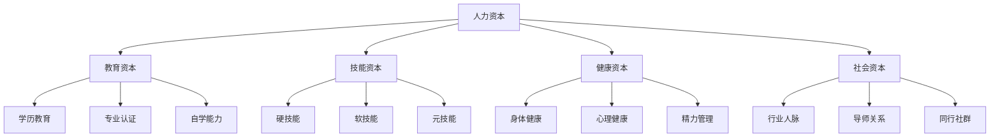

## 一、人力资本理论：你的最大资产是你自己

20-30岁，大多数人手里的金融资产几乎为零。银行存款可能只有几千到几万块，没有房产，没有股票，没有基金。但这个阶段，你拥有一项价值百万甚至千万的资产——你自己。经济学把这项资产叫做**人力资本**（Human Capital）。

理解人力资本理论，是整个积累期的理论基石。它回答了一个根本问题：**在你几乎没有金融资本的年纪，应该把时间和精力投到哪里？**

### 1. 什么是人力资本

#### 1.1 理论起源

人力资本理论由两位经济学家奠基：

- **西奥多·舒尔茨**（Theodore Schultz）：1960年在美国经济学会主席演说中正式提出人力资本概念，1979年获诺贝尔经济学奖。他指出，人的知识、技能和健康是一种资本形式，对经济增长的贡献远超物质资本。
- **加里·贝克尔**（Gary Becker）：1964年出版《人力资本》一书，系统建立了人力资本的微观经济学分析框架，1992年获诺贝尔经济学奖。他把教育和培训视为一种投资行为，而非单纯的消费。

核心命题非常简单：**你在教育、技能、健康和人际关系上的投入，本质上是一种投资，会在未来产生持续的经济回报。**

#### 1.2 人力资本的定义

人力资本是指**存在于人体之中的、能够在生产过程中产生经济价值的知识、技能、健康和经验的总和**。它与金融资本（钱）、社会资本（关系网络）、物质资本（设备房产）并列为个人财富的四大支柱。

用一个公式来理解：

```text
个人终身收入 ≈ 人力资本 × 市场溢价 × 时间
```

- **人力资本**：你的技能水平、知识深度、健康状态
- **市场溢价**：你所在的行业、城市、公司对你能力的定价倍数
- **时间**：你能够工作并产出价值的年限

#### 1.3 人力资本 vs 金融资本

很多人在20-30岁的困惑是："我没钱，怎么开始积累？"这个问题本身就暴露了一个认知盲区——把"积累"等同于"存钱"。

| 维度 | 人力资本 | 金融资本 |
|------|----------|----------|
| 初始形态 | 知识、技能、健康、经验 | 现金、存款、证券 |
| 增长方式 | 学习、实践、健康维护 | 储蓄、投资、复利 |
| 复利效应 | 技能提升→收入提升→更多资源投入学习 | 本金×回报率→利滚利 |
| 折旧风险 | 技能过时、健康恶化、行业衰退 | 通胀侵蚀、投资亏损 |
| 20-30岁占比 | 占个人总资产的80-95% | 占个人总资产的5-20% |
| 核心策略 | 投资自己，最大化长期收入 | 保本增值，控制风险 |

关键洞察：**在20-30岁这个阶段，你每花1小时学习新技能的边际回报，远远高于你花1小时多赚100块钱存起来的回报。**因为技能提升带来的收入增长是终身的、复利式的，而那100块钱的利息是线性的。

### 2. 人力资本的四大组成部分

人力资本不是单一维度的"学历"或"技能"，它是一个由四个子系统构成的复合资产。



#### 2.1 教育资本：你的知识底盘

教育资本包括你通过正规教育和持续学习获得的知识体系。它不仅指学历，更重要的是**可迁移的认知能力**和**持续学习的能力**。

**教育资本的三个层次：**

- **学历教育**：本科、硕士、博士。它提供了一个基础门槛——很多高薪岗位有学历硬性要求。但学历的价值在工作5年后迅速递减，取而代之的是实际能力和业绩。
- **专业认证**：CPA、CFA、PMP、AWS认证等。在特定行业，一个权威认证可以带来20-50%的薪资溢价。选择认证的原则是：行业认可度高、通过难度适中、与你的职业方向直接相关。
- **自学能力**：这是最被低估的教育资本。在知识更新周期从几十年缩短到几个月的今天，**学会学习**比学到什么更重要。掌握高效阅读、信息筛选、知识管理、刻意练习等元学习能力，是所有其他教育投资的放大器。

**关键数据：**

- 中国国家统计局数据：大学学历劳动者平均收入是高中学历的1.8-2.5倍（终身累计差距可达数百万）
- 但学历的边际收益递减：硕士vs本科的收入溢价通常在15-30%，博士vs硕士的溢价进一步收窄到10-20%（除学术和研发岗位外）
- Coursera 2024年报告：完成在线专业课程的学习者中，27%在6个月内获得了加薪或新工作机会

#### 2.2 技能资本：你的市场价值

技能资本是你能直接在市场上变现的能力。它是人力资本中最活跃、最直接产生收入的部分。

**技能的三个类别：**

**硬技能**（Hard Skills）——可量化、可验证的专业能力：
- 编程语言（Python、Java、Go等）
- 数据分析（SQL、Excel、Tableau、Power BI）
- 设计工具（Figma、Photoshop、Sketch）
- 财务建模（DCF、LBO、财务报表分析）
- 营销工具（SEO、SEM、社交媒体运营、内容营销）

**软技能**（Soft Skills）——决定你能走多远的人际和认知能力：
- 沟通表达：能清晰地向不同受众传达复杂想法
- 团队协作：能在跨职能团队中高效工作
- 领导力：能影响和激励他人朝着共同目标前进
- 问题解决：能在模糊和复杂的情境中找到可行方案
- 情绪管理：能在压力下保持理性和高效

**元技能**（Meta Skills）——放大其他所有技能的底层能力：
- **学习能力**：快速掌握新领域知识的能力
- **系统思维**：理解复杂系统中各要素相互关系的能力
- **写作能力**：清晰、有说服力地组织和表达思想的能力
- **编程/自动化思维**：用技术手段解决重复性问题的能力
- **批判性思维**：辨别信息真伪、评估论证质量的能力

**技能投资的ROI排序（基于20-30岁群体的长期收入影响）：**

| 技能 | 学习投入 | 收入提升潜力 | 适用范围 | 推荐优先级 |
|------|----------|-------------|----------|-----------|
| 编程/自动化 | 6-12个月 | 50-200% | 极广 | ★★★★★ |
| 数据分析 | 3-6个月 | 30-80% | 很广 | ★★★★★ |
| 英语（流利） | 12-24个月 | 20-100% | 极广 | ★★★★☆ |
| 公众演讲 | 3-6个月 | 15-50% | 很广 | ★★★★☆ |
| 写作/内容创作 | 6-12个月 | 20-80% | 很广 | ★★★★☆ |
| 项目管理 | 3-6个月 | 20-50% | 广 | ★★★☆☆ |
| 设计/视觉表达 | 3-6个月 | 15-40% | 中等 | ★★★☆☆ |

#### 2.3 健康资本：最容易被忽视的基础资产

健康是人力资本的**基础设施**。没有健康的身体和心理状态，其他所有资本都无法正常运转。

为什么在20-30岁就要重视健康？因为这个阶段建立的生活习惯，会决定你30-60岁这黄金工作年限的产出能力。一个25岁开始规律运动、合理饮食、充足睡眠的人，和一个25岁开始熬夜、久坐、暴饮暴食的人，到40岁时的精力差距可能是3-5倍。

**健康资本的三个维度：**

- **身体健康**：规律运动、合理饮食、充足睡眠、定期体检。这些不是"养生"，而是对你最重要的资产进行维护保养。
- **心理健康**：情绪稳定性、抗压能力、自我认知、人际边界。心理健康问题（焦虑、抑郁、职业倦怠）是20-30岁群体人力资本折旧的主要原因之一。
- **精力管理**：不是管理时间，而是管理你的身体和心理能量。在精力高峰期做高价值工作，在低谷期做低认知负担的事务。

**健康投资的隐性回报：**

- 运动：哈佛商学院研究显示，每周运动3次以上的高管，工作效率比不运动的同行高15-25%
- 睡眠：每晚7-8小时睡眠 vs 5-6小时，第二天的认知表现差距相当于血液酒精浓度0.05%（接近醉酒标准）的状态差异
- 饮食：稳定的血糖水平能减少下午的精力低谷，相当于每天多出1-2小时的高效工作时间

#### 2.4 社会资本：你的人脉网络

社会资本是指你通过人际关系网络获得的资源、信息和机会。在职业发展的中后期，社会资本对收入的影响甚至超过专业技能。

**社会资本的三个层次：**

- **行业人脉**：同行、前同事、行业会议上认识的人。他们提供行业信息、内推机会、合作可能。
- **导师关系**：比你资深5-10年的前辈。他们提供方向指导、避坑经验、关键决策建议。
- **同行社群**：与你水平相近、方向相似的一群人。他们提供信息共享、互相激励、合作创业的基础。

**社会资本的经济学逻辑：**

社会学家马克·格兰诺维特（Mark Granovetter）在1973年的研究中发现：**大多数人找到好工作，不是通过亲密朋友（强关系），而是通过普通熟人（弱关系）。**原因很简单——强关系（亲密朋友）和你的信息圈高度重叠，而弱关系（普通熟人）能连接到你接触不到的信息和机会。

这意味着：**在20-30岁，你应该有意识地拓展弱关系网络**——参加行业活动、加入专业社群、在社交媒体上输出专业内容、主动链接不同圈子的人。

### 3. 人力资本的复利效应

理解人力资本为什么重要，关键在于理解它的**复利增长机制**。

#### 3.1 技能复利

技能提升不是线性的，而是指数级的。原因有三个：

1. **技能组合效应**：单一技能的价值有限，但技能组合能创造独特价值。一个会编程的销售员，一个懂数据的产品经理，一个会写作的程序员——这些"斜杠组合"在市场上的溢价远超单一技能的加总。

2. **经验累积效应**：你在某个领域积累的经验越多，学习新相关知识的速度越快。一个有3年编程经验的人学习新框架，可能只需要1周；而一个零基础的人学同样的框架需要1-3个月。

3. **声誉复利**：你做得越好，越多人知道你，越多好机会找到你，你又能做得更好——这是一个正反馈循环。

**技能复利的数学模型：**

```text
终身收入 = Σ(基础收入 × (1 + 技能增长率)^年数 × 市场乘数)
```

假设两个人起点相同（月薪8000元），A每年技能增长5%，B不增长（0%）：

| 年数 | A的月收入 | B的月收入 | 累计收入差 |
|------|----------|----------|-----------|
| 第1年 | 8,000 | 8,000 | 0 |
| 第5年 | 9,792 | 8,000 | +8.3万 |
| 第10年 | 12,489 | 8,000 | +32.7万 |
| 第15年 | 15,933 | 8,000 | +76.5万 |
| 第20年 | 20,323 | 8,000 | +148.7万 |
| 第30年 | 33,039 | 8,000 | +466.2万 |

**仅仅5%的年均技能增长率差异，30年后累计收入差距超过460万元。**这就是人力资本复利的威力。

#### 3.2 人力资本的S曲线

人力资本的增长不是匀速的，它遵循S曲线规律：


- **起步期（0-2年）**：进步缓慢，付出很多但收获很少。这是最多人放弃的阶段。
- **快速增长期（2-7年）**：基础打好后，技能开始快速提升，收入也进入快速增长通道。
- **平台期（7-12年）**：增速放缓，需要寻找新的增长点（新技能、新领域、管理转型）。
- **突破或衰退**：能否突破平台期，决定了你30岁之后的职业高度。

**20-30岁的战略意义：** 你正处在S曲线的前两个阶段。现在投入的每一小时学习，都在为未来的指数增长奠定基础。

### 4. 人力资本投资的策略框架

知道了人力资本的重要性，下一步是：**怎么投？**

#### 4.1 投资决策矩阵

不是所有的人力资本投入都有相同的回报率。用以下矩阵评估每一项投资：

| | 高稀缺性 | 低稀缺性 |
|---|---------|---------|
| **高通用性** | 最优先投入（编程+行业知识） | 有选择投入（英语、写作） |
| **低通用性** | 战术性投入（特定工具/认证） | 谨慎投入（过于垂直的冷门技能） |

- **高稀缺性**：市场上掌握这个技能的人少，供不应求
- **高通用性**：这个技能在多个行业、多个岗位都有价值
- **最优先投入**：既稀缺又通用的技能，投资回报率最高

#### 4.2 投资的时间窗口

人力资本投资有一个重要的时间窗口效应：**越早投资，复利期越长，终身回报越大。**

假设你想学习数据分析技能，它能给你带来每年3万元的收入提升：

| 开始学习的年龄 | 复利年数（到60岁） | 终身额外收入 |
|--------------|-----------------|------------|
| 22岁 | 38年 | 约114万 |
| 25岁 | 35年 | 约105万 |
| 28岁 | 32年 | 约96万 |
| 32岁 | 28年 | 约84万 |
| 35岁 | 25年 | 约75万 |

每晚开始3年，终身收入减少约10万。这不是说32岁学就晚了，而是说**你现在的每一天都是你余生中最早的一天**。

#### 4.3 投入产出比最高的五类投资

基于人力资本理论和大量实证研究，以下是20-30岁阶段投入产出比最高的人力资本投资：

**第一，系统学习一项可迁移的硬技能。** 可迁移意味着你换行业、换岗位时它依然有价值。编程、数据分析、写作、设计、营销——这些都是跨越行业的通用技能。不要只学你当前岗位需要的技能，要学你能带到下一个岗位的技能。

**第二，建立个人知识管理系统。** 你读过的书、学到的知识、积累的经验，如果没有系统化地存储和检索，会随时间流失。建立一个可持续运转的知识管理系统（笔记系统、知识库、个人Wiki），让每一次学习都成为可复利的资产。推荐工具：Obsidian、Notion、Logseq。

**第三，投资健康基础设施。** 建立规律运动的习惯（每周3次，每次30分钟以上）、保证充足睡眠（7-8小时）、学习基础营养知识。这些投入的回报不在当下，而在未来20-30年的持续高产出。

**第四，有意识地拓展弱关系网络。** 每季度参加1-2次行业活动或线上社群讨论。在专业平台上持续输出内容（技术博客、行业观点、案例分析）。主动链接不同领域的人，保持信息来源的多样性。

**第五，寻找并投资高质量的导师关系。** 一个好导师能帮你少走3-5年弯路。投资方式包括：付费咨询、参加其课程/社群、为其提供价值（做助手、写案例、帮忙推广）以换取指导机会。

### 5. 人力资本投资的常见误区

#### 误区一：把学历等同于人力资本

很多人把"考上好大学"或"读个研究生"当作人力资本投资的全部。学历只是人力资本的入场券，不是终点。一个名校毕业但停止学习的人，5年后的人力资本价值可能不如一个普通学历但持续精进的人。

**纠正方法：** 学历拿到后，立即转向技能积累和实战经验。把"我能做什么"而不是"我是哪个学校毕业的"作为自我介绍的核心。

#### 误区二：只投资金融资本，忽视人力资本

有些人20岁就开始炒股、买基金、研究各种理财产品，却不愿意花3000块钱买一门技能课程。在20-30岁阶段，你投入1万元学习一项新技能的终身回报（可能数十万），远高于你投入1万元到股市的预期回报。

**纠正方法：** 在金融资产低于50万元的阶段，把可投资资金的30-50%用于人力资本投资（课程、书籍、工具、认证、健康管理）。

#### 误区三：学了不用，知识不转化为能力

很多人陷入"学习成瘾"——不断买课、读书、收藏文章，但从不实践。知识只有在被应用时才转化为人力资本。你读了100本商业书籍但从没做过一个商业项目，你的人力资本几乎为零。

**纠正方法：** 每学一个新技能，立即找一个真实项目去应用。学到SQL就去分析一个真实数据集，学到设计就去做一个真实的产品界面，学到写作就开始输出内容。

#### 误区四：忽视健康资本的维护

20多岁的身体恢复力强，很多人觉得"年轻就是资本"，熬夜加班、久坐不动、饮食随意。但健康资本的折旧是隐性的——你25岁熬的夜，35岁才开始还债。等到身体出问题再补救，成本和时间投入会高出数倍。

**纠正方法：** 把健康维护当作和工作学习同等重要的"任务"来安排。每周固定的运动时间、每晚7-8小时的睡眠、每年一次的体检——这些不是可选项，是必选项。

#### 误区五：在错误的方向上持续投入

有些人非常努力地学习和工作，但方向错了——在一个衰退行业里深耕、在一个夕阳技能上精进。方向错误的努力，不仅没有回报，还浪费了你最宝贵的时间。

**纠正方法：** 定期（每6-12个月）评估你的行业和技能方向：这个行业的未来5年趋势如何？我学的这项技能需求是在增长还是萎缩？我的同行都在往哪个方向转？

#### 误区六：忽视社会资本的积累

很多技术型人才只专注于提升专业能力，觉得"只要技术够强就行"。但在职业发展中后期，机会往往不是通过公开招聘获得的，而是通过人脉推荐。你认识谁、谁认识你、谁愿意为你背书——这些决定了你能接触到什么样的机会。

**纠正方法：** 从25岁开始有意识地建立职业社交网络。不需要刻意"社交"或"搞关系"，而是通过输出专业内容、参与行业讨论、帮助他人解决问题来自然地建立声誉和人脉。

### 6. 实操：人力资本自评与投资规划

#### 6.1 人力资本自评表

用以下框架评估你当前的人力资本状态（每项1-10分）：

**教育资本评估：**
- 学历层次和专业匹配度：___分
- 专业认证和资质：___分
- 持续学习的习惯和能力：___分
- 知识体系的完整度：___分

**技能资本评估：**
- 核心硬技能的市场竞争力：___分
- 软技能（沟通、协作、领导力）：___分
- 元技能（学习力、系统思维、写作）：___分
- 技能组合的独特性和稀缺性：___分

**健康资本评估：**
- 身体健康状态和运动习惯：___分
- 心理健康和情绪管理：___分
- 精力管理和作息规律：___分

**社会资本评估：**
- 行业人脉的广度和深度：___分
- 是否有导师或mentors：___分
- 是否参与有价值的社群或圈子：___分
- 个人品牌和专业声誉：___分

**总分解读：**
- **32-40分**：人力资本基础优秀，重点优化和变现
- **24-31分**：基础良好，找到短板重点补强
- **16-23分**：基础一般，需要系统性投资
- **8-15分**：基础薄弱，优先投资最高杠杆的领域

#### 6.2 人力资本投资规划模板

基于自评结果，制定未来12个月的人力资本投资计划：

```text
【未来12个月人力资本投资计划】

1. 最优先投资领域（投入40%精力）：
   - 具体目标：___
   - 学习路径：___
   - 投入资源：___（时间/金钱）
   - 里程碑：___
   - 验证方式：___

2. 次优先投资领域（投入25%精力）：
   - 具体目标：___
   - 学习路径：___
   - 投入资源：___
   - 里程碑：___
   - 验证方式：___

3. 基础维护领域（投入20%精力）：
   - 健康：___（运动/睡眠/饮食计划）
   - 社交：___（每月参加X次活动/每月输出X篇文章）
   - 知识管理：___（笔记系统/知识库维护）

4. 探索试错领域（投入15%精力）：
   - 尝试的新方向：___
   - 试错预算：___（时间/金钱上限）
   - 决策标准：___（什么情况下放弃/加码）
```

#### 6.3 关键指标追踪

人力资本投资和金融投资一样，需要定期追踪指标：

| 指标 | 追踪频率 | 目标 |
|------|---------|------|
| 技能增长 | 每季度 | 每季度掌握1个新子技能或深化1个现有技能 |
| 收入增长 | 每年 | 年均收入增长10-15%（含跳槽/晋升/副业） |
| 健康指标 | 每月 | 体重/体脂/运动频次/睡眠时长达标 |
| 人脉拓展 | 每月 | 每月新增2-3个有价值的弱关系连接 |
| 学习时长 | 每周 | 每周至少5小时结构化学习时间 |
| 知识输出 | 每月 | 每月至少1篇专业内容输出（文章/分享/案例） |

### 7. 进阶：人力资本理论的深层应用

#### 7.1 人力资本的"定价权"思维

当你的人力资本足够强大且稀缺时，你获得的不仅是更高的薪水，更是**定价权**——你能决定自己的工作条件、工作时间和合作对象。

定价权的三个层次：
- **Level 1 — 被挑选**：你在求职市场上投简历，雇主挑选你。你的定价权接近零。
- **Level 2 — 被需要**：雇主主动来找你，你有多个offer可选。你开始有议价空间。
- **Level 3 — 被追逐**：你定义自己的工作方式（远程、咨询、创业），市场适应你的条件。

从Level 1到Level 3的距离，就是你的人力资本积累量。

#### 7.2 人力资本与创业的关系

很多人在20-30岁会考虑创业。人力资本理论提供了一个重要视角：**创业的本质是把你的人力资本转化为商业资本。**

你的技能、知识、人脉、行业经验——这些都是创业的原始资本。在没有金融资本的阶段，你唯一能拿出来赌的就是你的人力资本。所以：

- **不建议在人力资本薄弱时创业**：你没有足够的行业认知、技能储备和人脉网络来降低创业风险。
- **建议先在职场积累3-5年人力资本**：深入了解一个行业、积累核心技能、建立行业人脉，然后再评估是否创业。
- **创业失败的最大成本不是金钱，而是时间**：如果你的人力资本足够强，创业失败后你还能回到职场甚至找到更好的机会。

#### 7.3 人力资本的"护城河"思维

在投资领域，沃伦·巴菲特强调"护城河"——企业抵御竞争的持久优势。对个人来说，你的人力资本也需要护城河：

- **T型能力结构**：在某个领域有很深的专业深度（竖线），同时在多个相关领域有基本能力（横线）。深度让你不可替代，广度让你适应变化。
- **稀缺技能组合**：单一技能容易被替代，但独特的能力组合很难被复制。一个既懂金融又懂编程的人，比单纯的金融分析师或单纯的程序员更稀缺。
- **持续学习的飞轮**：建立"学习→实践→输出→反馈→再学习"的正循环，让你的人力资本持续增值而不是随时间折旧。

#### 7.4 人力资本的代际视角

从更宏观的视角看，人力资本投资是**打破阶层固化最有效的手段**。金融资本可以继承，但人力资本不能——你父亲是百万富翁，不会自动让你成为一个优秀的程序员或管理者。

这也是为什么教育（正规和非正规）被称为"伟大的均衡器"——它让没有家庭背景的年轻人，通过自身努力获得与富家子弟竞争的能力。

但需要注意的是，教育资本的获取存在不平等——优质教育资源向优势阶层集中。因此，**在互联网时代，善用免费和低成本的在线学习资源（MOOC、开源社区、公开课程），是20-30岁年轻人缩小人力资本差距的关键策略。**

### 8. 核心要点总结

1. **你的最大资产是你自己。** 在20-30岁阶段，人力资本占你个人总资产的80-95%。投资自己的回报率远高于投资金融市场。

2. **人力资本由四个子系统构成：** 教育资本、技能资本、健康资本、社会资本。它们相互支撑，缺一不可。

3. **人力资本具有复利效应。** 每年5%的技能增长率差异，30年后累计收入差距超过460万元。越早投资，复利期越长。

4. **投资策略：** 优先投资稀缺且通用的技能，系统学习一项可迁移的硬技能，建立知识管理系统，投资健康，拓展弱关系网络，寻找高质量导师。

5. **避免六大误区：** 学历≠人力资本、不要只投金融资本忽视自身、学了要用、重视健康、选对方向、积累社会资本。

6. **人力资本决定你的定价权。** 从被挑选到被需要到被追逐，这个过程就是人力资本从量变到质变的过程。

7. **人力资本是最公平的资本。** 它不能继承、不能赠予、不能偷取——只能通过你自己的努力积累。这是普通人改变命运最可靠的路径。
