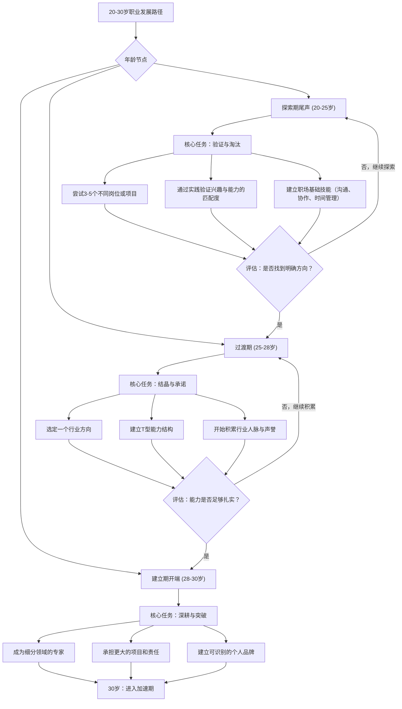
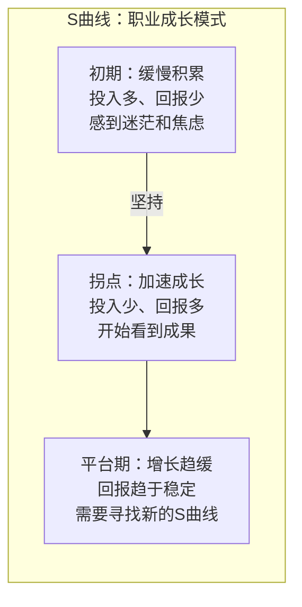
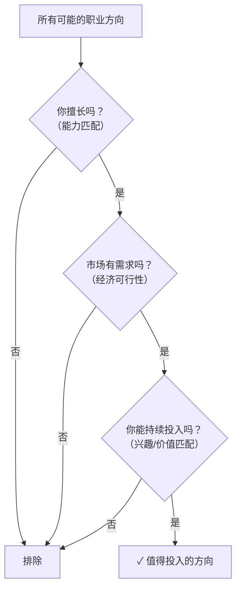

## 二、职业发展理论：如何规划你的职业生涯

20-30岁是职业生涯最关键的十年。你在这个阶段做出的选择——进入哪个行业、深耕什么技能、积累哪些资源——将决定你未来三十年的职业轨迹和收入水平。然而，大多数人在这个阶段靠直觉和运气做决策，而不是基于科学的职业发展理论。

本节将系统介绍六大经典职业发展理论，并将其转化为可执行的职业规划框架。掌握这些理论，你就拥有了比同龄人高出一个维度的职业决策能力。

### 2.1 舒伯职业发展阶段理论：你在人生哪个位置

#### 2.1.1 理论起源与核心思想

美国心理学家唐纳德·舒伯（Donald E. Super，1910-1994）在1953年提出了职业发展理论（Life-Span, Life-Space Theory），这是职业心理学领域最具影响力的理论之一。舒伯的核心观点是：**职业发展不是一次性的选择，而是一个贯穿一生的动态过程**。人在不同生命阶段有不同的职业任务和发展重心。

舒伯理论的两个核心概念：

- **职业自我概念（Career Self-Concept）**：你对自己在职业中是什么样的人的认知。它不是静态的，而是随着经验积累不断演化的。一个刚毕业的程序员可能认为自己是"写代码的人"，十年后可能认为自己是"用技术解决问题的人"。
- **职业成熟度（Career Maturity）**：个体在特定年龄段做出适当职业决策的心理准备程度。职业成熟度高的人能够：准确评估自己的兴趣和能力、收集有效的职业信息、做出负责任的职业选择、应对职业转换带来的不确定性。

#### 2.1.2 五个阶段详解

舒伯将人的一生划分为五个职业发展阶段，每个阶段都有独特的心理任务和发展主题：

| 阶段 | 年龄范围 | 核心任务 | 关键活动 | 心理主题 |
|------|---------|---------|---------|---------|
| 成长期 | 0-14岁 | 形成职业自我概念 | 模仿、幻想、兴趣探索 | "我能做什么" |
| 探索期 | 15-24岁 | 缩小职业选择范围 | 实习、兼职、职业咨询 | "我想做什么" |
| 建立期 | 25-44岁 | 在选定领域稳固地位 | 专业化、晋升、积累声誉 | "我正在成为什么" |
| 维持期 | 45-64岁 | 保持已有成就 | 更新技能、指导后辈 | "我如何保持竞争力" |
| 衰退期 | 65岁以上 | 逐步退出职业舞台 | 交接、退休规划、角色转换 | "我如何优雅退场" |

#### 2.1.3 20-30岁的特殊位置：探索→建立的临界转换

20-30岁横跨了舒伯理论中两个最关键的阶段——探索期的尾声和建立期的开端。这个位置赋予了你两个必须同时完成的任务：

**探索期残余任务（20-25岁）**：

- 完成自我能力的准确认知。你需要通过实际工作而非想象来验证自己的兴趣和能力。很多人在这个阶段发现自己大学选的专业和实际工作完全不匹配，这是正常的。
- 缩小选择范围。舒伯认为探索期的最终目标是将"可能的自我"从模糊变得清晰。你需要从"我什么都想试试"过渡到"我知道自己适合做什么"。
- 建立初始职业技能。包括沟通能力、时间管理、基本的职场礼仪和协作能力。

**建立期初始任务（25-30岁）**：

- **安定点（Crystallization）**：在25-30岁之间，你应该完成职业方向的"结晶化"——从模糊的想法变成明确的承诺。
- **专业化（Specialization）**：选择一个细分领域深耕，建立别人无法轻易替代的专业能力。
- **承诺（Commitment）**：对选定方向做出持续投入的心理承诺，不再频繁更换赛道。

#### 2.1.4 舒伯的"生活广度"与"生活空间"

舒伯后来扩展了他的理论，引入了**生活角色**的概念。他认为一个人在任何时点都在扮演多重角色：工作者、学生、家长、公民、休闲者、持家者。这些角色之间会相互影响。

对20-30岁的启示：你不可能只做一个"工作者"。你需要平衡工作与学习（持续提升）、工作与亲密关系（伴侣/家庭）、工作与休闲（防止倦怠）。很多人在25-30岁因为过度投入工作而牺牲了其他角色，最终导致职业倦怠或关系破裂，反而拖累了职业发展。

### 2.2 霍兰德职业兴趣理论：找到你的"职业人格"

#### 2.2.1 理论核心

美国心理学家约翰·霍兰德（John Holland）在1959年提出的职业兴趣理论是目前应用最广泛的职业匹配工具。霍兰德的核心假设是：**人格类型与职业环境的匹配程度决定了职业满意度和成就水平**。

霍兰德将人和职业环境分为六种类型（RIASEC）：

| 类型 | 代号 | 核心特征 | 典型职业 | 适合的工作环境 |
|------|------|---------|---------|--------------|
| 现实型 | R | 动手能力强，喜欢操作工具和机械 | 工程师、建筑师、飞行员、外科医生 | 明确的任务、可衡量的成果 |
| 研究型 | I | 好奇心强，喜欢分析和解决问题 | 数据科学家、研究员、程序员、精算师 | 允许独立思考、鼓励探索 |
| 艺术型 | A | 创造力强，不喜欢循规蹈矩 | 设计师、作家、导演、广告策划 | 灵活自由、鼓励自我表达 |
| 社会型 | S | 善于与人沟通，喜欢帮助他人 | 教师、心理咨询师、人力资源、销售 | 以人际关系为核心、团队协作 |
| 企业型 | E | 喜欢领导和影响他人，追求权力 | 管理者、律师、政治家、创业者 | 有竞争、能获得地位和影响力 |
| 常规型 | C | 注重细节，喜欢有条理的工作 | 会计、审计、行政管理、数据分析 | 结构化、规则清晰、可预测 |

#### 2.2.2 三维代码：你不是单一类型

大多数人是2-3种类型的组合，霍兰德用"三字母代码"表示。例如"RIA"表示现实型为主、研究型次之、艺术型再次。你的代码越明确，职业定位就越清晰。

**如何找到自己的霍兰德代码**：

1. **免费测评工具**：O*NET Interest Profiler（美国劳工部官方网站免费提供）、霍兰德职业兴趣量表（SDS自我导向搜索）。
2. **自我观察法**：记录两周内你做哪些事情时感到兴奋和投入，哪些事情让你感到厌烦和疲惫。
3. **他人反馈法**：问3-5个了解你的朋友："你觉得我最擅长什么？我在做什么事情时看起来最有活力？"
4. **工作回溯法**：回顾过去的工作和学习经历，标记出让你产生"心流"体验的任务类型。

#### 2.2.3 霍兰德理论的局限与修正

霍兰德理论有一个重要局限：它假设人格类型在成年后相对稳定，但现代研究表明，**人的兴趣和能力是可以培养的**。你可能现在对数据分析毫无兴趣，但当你发现自己通过数据驱动决策获得了显著成果后，"研究型"特征可能会被激活。

这意味着：不要仅凭"我对此没兴趣"就排除某个职业方向。兴趣往往是能力的副产品——你做得好的事情，自然会越来越感兴趣。这与后文将讨论的德雷福斯技能获取模型和纽波特的"职业资本"理论形成了互补。

### 2.3 施恩职业锚理论：什么对你真正重要

#### 2.3.1 什么是职业锚

MIT斯隆管理学院教授埃德加·施恩（Edgar Schein）在对MIT毕业生进行长达12年的追踪研究后，于1978年提出了**职业锚（Career Anchor）**理论。职业锚是指一个人在不得不做出职业选择时，无论如何都不会放弃的那种核心价值和能力。

施恩发现，人们在职业早期（尤其是25-30岁）会通过一系列试错来"发现"自己的职业锚。这个锚一旦形成，就会像磁铁一样影响你后续所有的职业决策——你选择什么公司、接受什么项目、为什么事情离职。

#### 2.3.2 八种职业锚详解

| 职业锚 | 核心驱动力 | 典型行为 | 适合的组织环境 |
|--------|----------|---------|--------------|
| 技术/职能能力 | 在专业领域做到极致 | 拒绝晋升管理岗以保持技术深度 | 有清晰技术等级的组织 |
| 管理能力 | 整合资源、影响组织方向 | 主动争取管理职责和跨部门项目 | 层级清晰、有晋升通道的组织 |
| 自主/独立 | 按自己的方式工作 | 讨厌被微观管理，喜欢弹性工作 | 远程友好、结果导向的组织 |
| 安全/稳定 | 可预测的职业路径 | 倾向于大公司、体制内 | 稳定的组织（国企、公务员） |
| 创业/创造 | 从零到一的创造过程 | 不断产生新想法，喜欢启动新项目 | 初创公司或大公司内部创业 |
| 服务/奉献 | 为社会或他人创造价值 | 选择有社会意义的工作 | 非营利组织、教育、医疗 |
| 挑战 | 不断克服高难度障碍 | 容易对重复性工作感到无聊 | 高竞争、高强度的环境 |
| 生活方式 | 工作与生活的平衡 | 拒绝以牺牲生活为代价的晋升 | 灵活、尊重个人时间的组织 |

#### 2.3.3 如何发现自己的职业锚

施恩设计了一套职业锚自我评估问卷，但更实用的方法是**行为倒推法**：

**练习：职业锚探测**

回顾你过去3年中做过的重大职业决策（选择工作、拒绝offer、离职、选项目），回答以下问题：

1. 在那次决策中，你最看重的是什么？
2. 有哪些因素是你可以妥协的？哪些是绝对不能妥协的？
3. 如果一份工作给你双倍薪资，但完全违背你的某个核心诉求，你会接受吗？
4. 你在工作中最让你愤怒或焦虑的场景是什么？（愤怒往往暴露了被触碰的职业锚）

如果你发现自己的所有重大决策背后都指向同一个驱动力，那就是你的职业锚。

#### 2.3.4 职业锚冲突与解决

现实中，很多人同时拥有2-3个较强的职业锚，它们之间可能会产生冲突。最常见的冲突组合：

- **技术能力 vs. 管理能力**：想保持技术深度，但也想要更高的职位和收入。解决方案：选择技术管理路线（Tech Lead、架构师）或专家路线（首席工程师、Fellow）。
- **自主独立 vs. 安全稳定**：想要自由，但也想要稳定收入。解决方案：先在稳定环境中积累能力和储蓄，再逐步过渡到更自主的工作方式（远程、自由职业、创业）。
- **挑战 vs. 生活方式**：喜欢高挑战的工作，但也想要生活平衡。解决方案：在工作中寻找"有挑战但不耗时"的任务类型，避免"低效忙碌"的陷阱。

### 2.4 德雷福斯技能获取模型：从新手到大师的五个阶段

#### 2.4.1 模型概述

斯图尔特·德雷福斯（Stuart Dreyfus）和休伯特·德雷福斯（Hubert Dreyfus）兄弟在1980年提出了技能获取模型（Dreyfus Model of Skill Acquisition），将技能习得划分为五个阶段。这个模型对于理解"为什么你觉得自己进步缓慢"以及"如何刻意加速技能提升"极为关键。

| 阶段 | 特征 | 依赖什么做决策 | 典型表现 |
|------|------|-------------|---------|
| 新手（Novice） | 学习规则和上下文无关的指令 | 严格的规则清单 | "按教程操作没问题，遇到报错就不知道怎么办" |
| 高级初学者（Advanced Beginner） | 开始识别情境中的模式 | 规则+少量经验判断 | "遇到类似问题能想起上次怎么解决的" |
| 胜任者（Competent） | 能制定计划并区分优先级 | 有意识的分析和计划 | "能独立负责一个项目，但需要刻意思考" |
| 精通者（Proficient） | 整体直觉把握+分析细节 | 直觉识别+分析验证 | "一眼看出哪里有问题，再用逻辑验证" |
| 专家（Expert） | 不再依赖规则，凭直觉行动 | 沉浸式的直觉判断 | "不需要想就知道怎么做，像呼吸一样自然" |

#### 2.4.2 每个阶段的停留时间

德雷福斯模型的一个重要发现是：**每个阶段的停留时间并不是固定的，取决于你的学习方法和练习强度**。

以编程为例（其他技能类似）：

- 新手→高级初学者：约3-6个月的持续实践
- 高级初学者→胜任者：约1-2年的项目经验
- 胜任者→精通者：约3-5年的刻意练习
- 精通者→专家：约7-10年的深度积累（大多数人到不了这个阶段）

关键洞察：**大多数人卡在"胜任者"阶段**。他们能够完成工作，但缺乏直觉性的判断力。要突破到精通者，你需要：

1. **大量暴露于多样化的真实案例**：不只是做重复性的工作，而是主动接触不同类型的问题。
2. **从错误中学习**：每次犯错后进行深度复盘，建立"模式-结果"的关联记忆。
3. **寻求高手的反馈**：找一个已经在精通者或专家阶段的人指导你，他们能看到你的盲点。

#### 2.4.3 20-30岁的关键策略

在20-30岁，你最高效的学习策略是：

1. **尽早进入"高级初学者"阶段**：通过高强度的实操（而非只看书）快速积累基本经验。
2. **在25岁前达到"胜任者"水平**：这意味着你能够在选定的领域独立负责项目。
3. **在30岁前向"精通者"冲刺**：这是职业发展加速的起点——精通者级别的专业能力能够显著提升你的市场价值和收入水平。

### 2.5 克朗伯兹计划性机缘理论：拥抱不确定性

#### 2.5.1 理论核心

斯坦福大学教授约翰·克朗伯兹（John Krumboltz）在1999年提出了一个颠覆性的观点：**最成功的职业发展往往不是计划出来的，而是"意外"的结果**。他将此称为"计划性机缘"（Planned Happenstance）。

这并不意味着不需要规划，而是说你应该：

- **保持开放性**：不要过度锁定某个方向，给自己保留探索的空间。
- **积极创造机缘**：主动接触新领域、新人、新想法，增加"好运"出现的概率。
- **识别和把握机会**：当意外机会出现时，你有能力判断它是否值得投入。

#### 2.5.2 五种关键技能

克朗伯兹认为，能够利用"计划性机缘"的人具备五种核心技能：

1. **好奇心（Curiosity）**：对新事物保持探索欲，愿意投入时间学习超出当前工作范围的知识。
2. **坚持性（Persistence）**：遇到挫折时不轻易放弃，能够从失败中恢复。
3. **灵活性（Flexibility）**：能够根据新信息调整自己的方向和计划。
4. **乐观性（Optimism）**：相信自己能够从任何经历中获得价值，包括失败的经历。
5. **冒险性（Risk-Taking）**：愿意在信息不完全的情况下采取行动。

#### 2.5.3 实操：如何为"计划性机缘"创造条件

**每月做一件超出舒适区的事**：

- 参加一个与你当前工作无关的行业活动或线上社群
- 和一个完全不同领域的人吃一次饭
- 阅读一本你平时不会读的书
- 学习一个你完全不懂的技能的入门课程

**记录"意外收获日志"**：

每个月末回顾：这个月发生了哪些"意外"？我从中学到了什么？这些意外是否指向了某个值得探索的新方向？

克朗伯兹的研究发现，许多成功人士的职业转折点——转行、创业、找到合作伙伴——都源于这种看似随机的接触。但如果你从不走出舒适区，这些"机缘"就永远不会发生。

### 2.6 纽波特职业资本理论：稀缺能力比热情更重要

#### 2.6.1 反常识的核心观点

乔治城大学计算机科学教授卡尔·纽波特（Cal Newport）在2012年出版的《优秀到不能被忽视》（So Good They Can't Ignore You）中提出了一个与主流"Follow Your Passion"截然相反的观点：**不要追随热情，而是通过积累稀缺的职业资本来"赚取"热情**。

纽波特的核心论证：

1. **"追随热情"是危险的建议**：大多数人在20岁时并没有明确的"热情"。强行寻找热情会导致频繁跳槽、持续焦虑、对现状不满。
2. **热情是能力的副产品**：你做得好的事情，你自然会越来越喜欢。反过来，你在某个领域做得不好时，很难对其产生真正的热情。
3. **职业资本（Career Capital）是你最宝贵的筹码**：稀缺的、有价值的技能和经验，是你与雇主或市场谈判的资本。

#### 2.6.2 职业资本的四个属性

纽波特认为，真正的职业资本必须满足四个条件：

| 属性 | 说明 | 举例 |
|------|------|------|
| 稀缺性 | 不是人人都能做的工作 | 掌握分布式系统设计 vs. 会写简单CRUD |
| 价值性 | 能为组织或客户创造显著价值 | 能优化系统性能节省百万成本 vs. 只是完成分配的任务 |
| 不可替代性 | 短期内难以找到替代者 | 在特定行业有深厚积累 vs. 通用技能 |
| 可迁移性 | 能力可以在不同组织间转移 | 技术能力可跨公司迁移 vs. 只会操作特定公司内部系统 |

#### 2.6.3 如何积累职业资本

纽波特提出了三种积累职业资本的路径：

**路径一：技能深度积累**

选择一个有价值的方向，投入大量时间进行刻意练习。纽波特强调"刻意练习"的概念——不是简单的重复工作，而是有明确目标、即时反馈、不断突破舒适区的练习。

实操方法：
1. 识别你所在领域中最有价值的技能（不是最容易学的技能）
2. 制定每周至少5小时的刻意练习计划
3. 找到能给你即时反馈的导师或同行
4. 持续记录你的进步和薄弱环节

**路径二：项目制积累**

主动承担有挑战性的项目，通过项目成果证明自己的能力。比"我学了三年Java"更有说服力的是"我独立设计并实现了一个日活百万的系统"。

**路径三：声誉积累**

通过写作、演讲、开源贡献等方式，在行业内建立可验证的专业声誉。声誉本身就是一种高价值的职业资本。

#### 2.6.4 两种工作思维模式

纽波特区分了两种对待工作的思维模式：

| 维度 | 工匠思维 | 激情思维 |
|------|---------|---------|
| 核心问题 | "我能为世界提供什么？" | "世界能给我什么？" |
| 关注点 | 技能的提升和作品的质量 | 工作是否让我感到满足 |
| 面对困难时 | "这正是提升能力的机会" | "这份工作可能不适合我" |
| 长期结果 | 持续积累职业资本→获得更多自主权和使命感 | 持续寻找"完美工作"→永远不满足 |

纽波特的建议是：在20-30岁，采用"工匠思维"。专注于把事情做到极致，而不是纠结这份工作是否是你的"天命"。当你足够强大时，你拥有选择的资本。

### 2.7 职业发展的S曲线：理解"缓慢期"和"爆发期"

#### 2.7.1 S曲线的三个阶段

职业发展通常遵循S曲线（Sigmoid Curve）模式，这个概念最早由管理学家查尔斯·汉迪（Charles Handy）在《非理性时代》中引入：

**初期（0-3年）**：这个阶段你的投入远大于回报。你需要学习大量新知识、适应职场规则、建立基本能力。收入增长缓慢，职位提升有限。很多人在这个阶段感到焦虑，怀疑自己是否选错了方向。**这是正常的。** 几乎所有领域的专家都经历过这个阶段。

**拐点（3-7年）**：当你的知识和经验积累到临界点时，成长会突然加速。你开始能够解决复杂问题、获得重要项目、被赋予更大责任。收入和职位也会在这个阶段出现跳跃式增长。很多人把这种"突然的爆发"归因于运气，但实际上是前几年积累的结果。

**平台期（7年以上）**：当你在当前方向上达到一定高度后，增长会再次放缓。这时你需要做出选择：在现有方向上继续深耕（可能收益递减），或者开辟新的S曲线（学习新技能、进入新领域）。

#### 2.7.2 为什么大多数人卡在初期

很多20-30岁的年轻人在职业发展的初期阶段就放弃了，原因包括：

1. **比较心理**：看到同龄人中少数"快速成功"的案例，误以为那才是常态。实际上，大多数人的职业成功都遵循S曲线，早期的积累是不可跳过的。
2. **即时满足期望**：习惯了社交媒体上的即时反馈，期待职业发展也能快速见效。但技能积累和职业资本的建立需要以年为单位的时间。
3. **方向频繁切换**：每次遇到困难就换方向，导致你永远停留在S曲线的初期阶段。换方向的代价是：之前积累的领域知识大部分作废，你需要从零开始。

#### 2.7.3 如何判断你的S曲线拐点是否即将到来

以下信号表明你正在接近拐点：

- 你解决问题的速度明显变快，不再需要频繁求助他人
- 你开始被邀请参与更重要的项目或决策
- 同行开始向你请教问题
- 猎头或行业内的机会主动找到你
- 你对所在领域的全局有了清晰的理解

如果你观察到这些信号，**不要在这个时候换方向**。再坚持6-12个月，拐点可能就会到来。

### 2.8 职业规划的实操框架

理论的价值在于实践。这一节将上述理论整合为一个可执行的职业规划框架。

#### 2.8.1 自我评估四象限

在做任何职业决策之前，你需要对自己有清晰的认知。使用以下四象限框架进行自我评估：

| 象限 | 评估维度 | 自问的问题 | 评估方法 |
|------|---------|----------|---------|
| 能力 | 你现在能做什么 | "我能独立完成哪些任务？哪些还需要指导？" | 列出过去一年的工作成果，标注独立完成的 |
| 兴趣 | 你做什么感到投入 | "什么事情让我忘记时间？什么任务我会拖延？" | 记录两周内的心流时刻 |
| 价值 | 什么对你最重要 | "我能接受什么？绝对不能接受什么？" | 职业锚测试 |
| 市场 | 什么能力有价值 | "我的技能在市场上的供需状况如何？" | 查看招聘网站同类岗位的薪资和要求 |

#### 2.8.2 职业方向筛选的"三环测试"

用三个条件过滤你的职业方向：

一个方向必须同时满足三个条件。只有"擅长+有需求"但你不感兴趣的工作，你会倦怠。只有"擅长+感兴趣"但市场没需求的工作，你养不活自己。只有"感兴趣+有需求"但你不擅长的工作，你会持续受挫。

#### 2.8.3 年度职业发展计划模板

每年花2-4小时做一次年度职业规划：

**第一步：回顾（Look Back）**
- 过去一年我学到了什么新技能？
- 我取得了哪些具体的工作成果？
- 我犯了哪些错误？从中学到了什么？
- 我的职业资本增长了多少？（用具体指标衡量）

**第二步：评估（Assess）**
- 我目前处于德雷福斯模型的哪个阶段？
- 我的S曲线处于哪个位置？
- 我的职业锚是否发生了变化？

**第三步：规划（Plan）**
- 未来一年我需要重点提升的1-2项核心技能是什么？
- 我要通过什么项目或任务来积累职业资本？
- 我要建立哪些新的行业连接？
- 我要避免哪些分散精力的事情？

**第四步：行动（Act）**
- 将年度目标拆解为季度里程碑
- 每月检查进度，每季度做一次小调整
- 建立"不做什么"清单——明确哪些事情即使有机会也不应该投入时间

#### 2.8.4 职业决策的"10-10-10"法则

当你面临重要的职业选择时（是否跳槽、是否转行、是否创业），使用"10-10-10"法则：

1. **10分钟后**：这个选择让我感觉如何？
2. **10个月后**：这个选择会让我的职业资本增加还是减少？
3. **10年后**：这个选择会让我的职业轨迹向更好的方向发展吗？

大多数人在做职业决策时只考虑了"10分钟后"的感受（冲动离职、被高薪诱惑），而忽略了"10个月后"和"10年后"的影响。一个好的职业决策应该在10个月和10年后的时间尺度上都能站得住脚。

### 2.9 常见误区与纠正

#### 误区一："找到热情再行动"

**错误逻辑**：我需要先找到自己真正热爱的事情，然后全身心投入。

**纠正**：根据纽波特的研究，大多数人没有一个等待被"发现"的热情。热情是在你投入时间和精力获得能力之后自然产生的。正确做法是：选择一个有价值的方向，投入足够长的时间（至少2-3年），在获得能力的过程中培养热情。

#### 误区二："第一份工作决定终身"

**错误逻辑**：我第一份工作选错了，以后就完了。

**纠正**：舒伯的理论表明，职业发展是终生的过程。20-30岁本身就是探索期，犯错是正常的。更重要的是，你在任何工作中积累的底层能力（沟通、解决问题、项目管理）都是可迁移的。关键不是选对第一份工作，而是在每一份工作中都最大化地积累职业资本。

#### 误区三："频繁跳槽能快速涨薪"

**错误逻辑**：每次跳槽涨薪30%，比在一家公司等着涨薪快多了。

**纠正**：短期来看，跳槽确实能带来薪资提升。但频繁跳槽（每1-2年换一次）会带来三个隐性成本：1）你无法积累深度的行业知识和复杂项目经验；2）你的简历会让HR质疑你的稳定性；3）你在每家公司都停留在S曲线的初期，永远无法到达拐点。最优策略是：在一家公司待到S曲线拐点（通常3-5年），然后带着积累的职业资本跳到更高的平台。

#### 误区四："只做本职工作就好"

**错误逻辑**：把分配给我的工作做好就行了，不需要额外投入。

**纠正**：如果你只做"被要求"的工作，你积累的只是基本胜任能力，而不是稀缺的职业资本。真正拉开差距的是你在本职工作之外的投入：学习新技能、主动承担额外项目、建立行业影响力。

#### 误区五："理论没用，干就完了"

**错误逻辑**：想那么多干嘛，先干起来再说。

**纠正**：没有方向的努力是最低效的。职业发展理论的价值在于：帮你看清自己处于哪个阶段、应该优先做什么、避免哪些陷阱。花几个小时理解这些理论，可能为你节省几年的弯路时间。

### 2.10 本节总结

职业发展不是一场短跑，而是一场需要战略思维的马拉松。本节介绍的六大理论构成了职业规划的完整知识框架：

| 理论 | 核心问题 | 对你的启发 |
|------|---------|----------|
| 舒伯阶段理论 | 你处于哪个发展阶段？ | 20-30岁必须完成从探索到建立的转换 |
| 霍兰德兴趣理论 | 你适合什么类型的工作？ | 用科学方法找到你的职业人格代码 |
| 施恩职业锚理论 | 什么对你最重要？ | 找到你不会妥协的核心价值 |
| 德雷福斯技能模型 | 你的技能处于哪个水平？ | 理解从新手到专家的必经之路 |
| 克朗伯兹机缘理论 | 如何应对不确定性？ | 主动创造机会而非被动等待 |
| 纽波特资本理论 | 如何建立竞争壁垒？ | 积累稀缺能力比追随热情更重要 |

记住：**理论是地图，行动是旅程**。光理解这些理论不会改变你的职业轨迹，但将它们转化为实际的行动计划——做自我评估、制定年度规划、坚持刻意练习、创造计划性机缘——会让你在20-30岁这个关键阶段做出远比同龄人更明智的职业决策。
