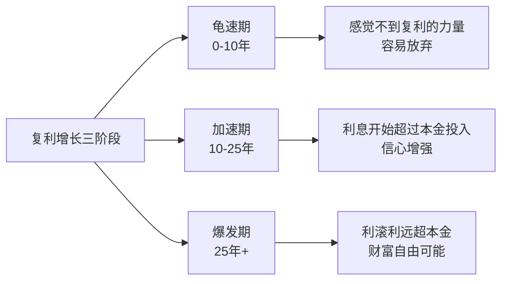
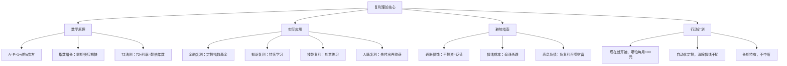

## 三、复利理论：时间是你最大的朋友

爱因斯坦曾说："复利是世界第八大奇迹。理解它的人赚取它，不理解的人支付它。"这句话虽然出处存疑，但道理千真万确。复利不是什么高深的金融概念，它本质上就是一个简单的数学规律——**利滚利**——加上一个你恰好拥有的最强武器：**时间**。

20-30岁的人最大的资本不是钱，而是时间。你可能月薪只有几千块，但你有30-40年让复利发挥作用。这篇文章会告诉你复利的数学原理、实际威力、具体应用方法，以及如何在20多岁就启动这个"自动赚钱机器"。

### 3.1 复利的数学原理

#### 3.1.1 单利 vs 复利：一字之差，天壤之别

要理解复利，先看它的对立面——单利。

**单利公式**：

```text
A = P × (1 + r × n)
```

**复利公式**：

```text
A = P × (1 + r)^n
```

其中：
- A = 最终金额（本息合计）
- P = 本金（初始投入）
- r = 年利率（以小数表示，如8%即0.08）
- n = 年数

单利只对原始本金计息，而复利对"本金+已产生的利息"一起计息。每一期的利息都会加入下一期的本金中，这就是"利滚利"。

**直观对比**：假设本金10万元，年利率10%。

| 年数 | 单利终值 | 复利终值 | 复利优势 |
|------|---------|---------|---------|
| 1年 | 11万 | 11万 | 相同 |
| 5年 | 15万 | 16.11万 | +1.11万 |
| 10年 | 20万 | 25.94万 | +5.94万 |
| 20年 | 30万 | 67.27万 | +37.27万 |
| 30年 | 40万 | 174.49万 | +134.49万 |
| 40年 | 50万 | 452.59万 | +402.59万 |

前10年差距不大，你可能觉得复利没什么了不起。但到第30年，复利是单利的4.36倍；到第40年，复利是单利的9.05倍。这就是为什么说"时间是复利最好的朋友"——时间越长，差距越惊人。

#### 3.1.2 复利增长的本质：指数函数

复利公式 A = P(1+r)^n 本质上是一个指数函数。在坐标图上，单利是一条直线，复利是一条向上弯曲的曲线。这条曲线的特点是：**前期增长缓慢，后期爆发式增长**。



很多人在"龟速期"就放弃了，因为他们看不到复利的效果。但如果你能坚持10年以上，就会进入"加速期"，这时候你的投资收益开始超过你每年的新增投入，财富增长进入正循环。

#### 3.1.3 连续复利与实际计算

上面的公式假设利息每年结算一次。实际上，很多理财产品是按月甚至按日计息。复利频率越高，最终收益越高。

**不同计息频率的差异**（本金10万，年利率10%，20年）：

| 计息频率 | 终值 | 与年复利的差异 |
|---------|------|--------------|
| 年复利 | 67.27万 | 基准 |
| 半年复利 | 68.74万 | +1.47万 |
| 季度复利 | 69.51万 | +2.24万 |
| 月复利 | 70.04万 | +2.77万 |
| 日复利 | 70.31万 | +3.04万 |
| 连续复利 | 70.34万 | +3.07万 |

虽然差异存在，但在普通投资场景下，计息频率的影响远小于**利率高低**和**投资时长**的影响。不要为了追求"日复利"而忽视产品本身的收益率和风险。

### 3.2 72法则：心算复利的瑞士军刀

#### 3.2.1 基本用法

72法则是一个估算复利效果的经验公式：**用72除以年利率（去掉百分号），得到资金翻倍所需的年数**。

```text
翻倍年数 ≈ 72 ÷ 年利率(%)
```

常见场景速查表：

| 年化收益率 | 翻倍所需年数 | 适用场景 |
|-----------|------------|---------|
| 2% | 36年 | 银行定期存款 |
| 3% | 24年 | 国债、货币基金 |
| 5% | 14.4年 | 债券基金 |
| 8% | 9年 | 指数基金长期均值 |
| 10% | 7.2年 | 股票型基金长期均值 |
| 12% | 6年 | 积极型投资组合 |
| 15% | 4.8年 | 高风险投资（不稳定） |
| 72% | 1年 | 借贷利率的"翻倍陷阱" |

最后一行特别重要：信用卡分期、网贷的实际年化利率往往在15%-36%之间，用72法则一算，你的债务每2-5年就翻一倍。这就是为什么说"不理解复利的人支付它"。

#### 3.2.2 72法则的变体

- **70法则**：更精确一点，用70代替72
- **115法则**：用115除以利率，得到资金变为3倍所需的年数
- **144法则**：用144除以利率，得到资金变为4倍所需的年数

例如年化收益率10%：
- 翻2倍：72 ÷ 10 = 7.2年
- 翻3倍：115 ÷ 10 = 11.5年
- 翻4倍：144 ÷ 10 = 14.4年

#### 3.2.3 72法则的精确度

72法则是一个近似公式，误差范围如下：

| 实际利率 | 72法则估算 | 精确值 | 误差 |
|---------|-----------|--------|------|
| 2% | 36年 | 35.0年 | +2.9% |
| 5% | 14.4年 | 14.2年 | +1.4% |
| 8% | 9年 | 9.0年 | 0% |
| 10% | 7.2年 | 7.27年 | -1.0% |
| 15% | 4.8年 | 4.96年 | -3.2% |

在4%-12%的常见投资收益率范围内，72法则的误差不超过2%，完全够用。

### 3.3 早投资的惊人差距

#### 3.3.1 10年差距，百万差距

复利最反直觉的地方在于：**开始投资的年龄每推迟10年，最终财富差距不是10年，而是几倍甚至十几倍**。

假设三个人都每月定投2000元，年化收益率10%：

| 投资者 | 开始年龄 | 投资年数 | 总投入 | 65岁时总资产 | 差距倍数 |
|--------|---------|---------|--------|------------|---------|
| 小张 | 22岁 | 43年 | 103.2万 | **1,162万** | 1.00x |
| 小王 | 25岁 | 40年 | 96万 | **886万** | 0.76x |
| 小李 | 30岁 | 35年 | 84万 | **586万** | 0.50x |
| 小赵 | 35岁 | 30年 | 72万 | **383万** | 0.33x |

小张比小李只多投了5年、多投入了19.2万，但最终多出**576万**。这19.2万的额外投入，通过复利放大了30倍。

更惊人的是，如果小张从22岁到27岁只投了5年（总投入12万），然后**完全停止投入**，到65岁时他仍有约**454万**——仍然超过30岁才开始、连续投了35年的小李（586万）。这说明了时间的威力：**早开始5年，抵得上晚开始多投30年**。

#### 3.3.2 你20多岁投入的每一块钱值多少

换一个角度来理解早投资的价值。假设年化收益率10%，你25岁投入的1元钱，到不同年龄时的价值：

| 投入时年龄 | 30岁时值 | 40岁时值 | 50岁时值 | 65岁时值 |
|-----------|---------|---------|---------|---------|
| 22岁 | 1.61元 | 6.12元 | 22.89元 | 188.94元 |
| 25岁 | 1.00元 | 3.79元 | 14.24元 | 117.39元 |
| 28岁 | — | 2.36元 | 8.85元 | 72.89元 |
| 30岁 | — | 1.00元 | 5.50元 | 45.26元 |

22岁投入的1块钱，到65岁变成**189块**。30岁投入的1块钱，到65岁变成**45块**。同样的1块钱，早投8年，价值差了4.2倍。

这就是为什么理财教练常说："最佳投资时间是十年前，其次是现在。"

#### 3.3.3 定期定额的复利效应：定投的力量

大多数人不是一次性投入大笔资金，而是每月从工资里拿出一部分来投资。这种"定期定额"的方式同样受益于复利。

**定投终值公式**：

```text
FV = PMT × [((1 + r)^n - 1) / r]
```

其中：
- FV = 终值
- PMT = 每期投入金额
- r = 每期收益率（年化收益率÷12）
- n = 总期数（年数×12）

**不同月投金额的累积效果**（年化10%，从22岁开始投到65岁）：

| 月投金额 | 总投入 | 65岁总资产 | 收益倍数 |
|---------|--------|-----------|---------|
| 500元 | 25.8万 | 290万 | 11.2倍 |
| 1000元 | 51.6万 | 581万 | 11.3倍 |
| 2000元 | 103.2万 | 1,162万 | 11.3倍 |
| 5000元 | 258万 | 2,905万 | 11.3倍 |
| 10000元 | 516万 | 5,810万 | 11.3倍 |

月投500元、坚持43年，最终近300万。这就是普通人通过复利实现财富自由的路径——不需要大笔启动资金，只需要**开始**和**坚持**。

### 3.4 人生多维复利：不只是钱的事

复利效应不只存在于金融市场。任何"产出反馈到投入"的正循环系统，都会产生复利效应。

#### 3.4.1 知识复利

知识是天然的复利资产：你今天学到的东西，会帮你明天更快地学到新东西。

**复利机制**：已有的知识构成"认知框架"，新知识被这个框架吸收和整合，形成更完善的框架。框架越完善，吸收新知识的速度越快、深度越深。

**具体例子**：
- 学编程：学会变量→学会函数→学会面向对象→理解设计模式→能设计整个系统架构。每一层都建立在前一层的基础上。
- 学投资：理解复利→理解资产配置→理解风险管理→理解宏观经济→能做出独立的投资判断。
- 学写作：积累素材→掌握结构→形成风格→建立影响力→能通过写作变现。

**知识复利的放大器**：
- **输出倒逼输入**：写文章、教别人、做分享，输出会暴露知识盲区，倒逼更深入的学习
- **跨领域连接**：不同领域的知识交叉会产生创新，T型人才的复合知识更有复利效应
- **系统化整理**：笔记、思维导图、知识库让知识积累可视化，避免"学了就忘"

#### 3.4.2 技能复利

技能复利比知识复利更直观：你练习得越多，技能越强，能接的项目越大，收入越高，然后有更多资源投入技能提升。

**技能复利曲线**：技能提升遵循"对数曲线"——初期进步飞快，之后越来越慢。但大多数人恰好在"进步变慢"的阶段放弃，错过了从"熟练"到"精通"的质变。

**突破技能瓶颈的三个方法**：
1. **刻意练习**：不重复已会的，专门练不会的。写100篇文章不一定会进步，但每篇都针对自己的弱项刻意改进，一定会进步。
2. **找反馈源**：师傅、同行评审、用户反馈。没有反馈的练习是盲目的。
3. **增加难度**：舒适区里没有成长。主动挑战超出当前能力的项目。

#### 3.4.3 人脉复利

人脉复利的核心机制：**信任是可以积累的，而信任会带来机会**。

- 你帮了A一个忙，A记住了你。
- A在某个场合推荐了你，你获得了B的信任。
- 你帮了B，B又推荐了你给C。
- 这个网络越来越大，机会越来越多。

**人脉复利的关键条件**：
1. **先付出**：复利的起点是"投入"，人脉的起点是"先帮别人"
2. **保持联系**：一次性的帮助不会产生复利，持续的互动才会
3. **真诚**：功利性的社交容易被识破，反而破坏信任
4. **成为节点**：不只是认识人，而是能连接不同圈子的人

#### 3.4.4 健康复利

健康复利是所有复利的基础——没有健康的身体，其他复利都无从谈起。

**正向健康复利**：每天运动30分钟→体能提升→精力更充沛→工作效率更高→收入可能提升→有更好的条件保持健康。

**负向健康复利**：久坐不动→体能下降→容易疲劳→工作效率降低→压力增大→更不注意健康→慢性病风险增加。

20-30岁建立的运动习惯、饮食习惯、睡眠习惯，会在30年后以"健康账单"或"健康红利"的形式兑现。这笔账远比投资账单更真实。

### 3.5 复利的敌人：什么在侵蚀你的财富

复利的威力是正向的，但有几个"敌人"在反向侵蚀你的财富增长。

#### 3.5.1 通货膨胀

中国过去20年的平均通胀率约为2.5%-3%。这意味着你银行账户里的钱每年都在贬值。

**通胀对复利的侵蚀**：

| 场景 | 名义年化收益 | 通胀率 | 实际年化收益 | 20年后10万的实际购买力 |
|------|------------|--------|------------|---------------------|
| 银行活期 | 0.25% | 2.5% | -2.25% | 6.38万 |
| 银行定期 | 2.0% | 2.5% | -0.5% | 9.05万 |
| 货币基金 | 2.5% | 2.5% | 0% | 10.00万 |
| 债券基金 | 5.0% | 2.5% | +2.5% | 16.39万 |
| 指数基金 | 8.0% | 2.5% | +5.5% | 29.18万 |

结论很清楚：把钱存在银行活期，20年后你的购买力缩水近40%。**不投资本身就是一种风险**。投资的首要目标不是赚大钱，而是**跑赢通胀**。

#### 3.5.2 交易成本

每次买卖都有成本：基金申购赎回费、股票佣金、印花税等。这些成本看似微小，但在复利效应下会大幅侵蚀收益。

假设每年交易成本为资产的1%，年化毛收益10%：

| 情况 | 净收益 | 30年后10万变 |
|------|--------|------------|
| 无交易成本 | 10% | 174.5万 |
| 年成本1% | 9% | 132.7万 |
| 年成本2% | 8% | 100.6万 |
| 年成本3% | 7% | 76.1万 |

1%的年成本差异，30年后导致**41.8万**的差距。这就是为什么指数基金（费率0.1%-0.5%）长期跑赢主动基金（费率1.2%-2.0%）的重要原因之一。

**降低交易成本的方法**：
- 选择低费率的指数基金（如沪深300指数基金管理费率0.5%以下）
- 减少交易频率，不做频繁买卖
- 长期持有，利用基金持有时间越长费率越低的规则
- 选择免申购费的平台（如天天基金、蚂蚁财富的C类份额）

#### 3.5.3 情绪成本

这是最容易被忽视、也是代价最大的复利杀手。

**追涨杀跌的代价**：晨星（Morningstar）的研究显示，基金投资者的实际回报率平均比基金本身的回报率低1.7%/年。原因很简单——人们总是在涨的时候买入、跌的时候卖出，完美地"高买低卖"。

**情绪成本的复利效应**：如果基金年化10%，但你因为情绪操作只拿到8.3%，30年后：
- 基金持有不动：10万→174万
- 你的情绪操作：10万→109万
- 损失：65万

65万就是你为"恐慌卖出"和"贪婪追高"付出的代价。

**对抗情绪成本的方法**：
1. **自动化投资**：设置自动定投，消除人为决策
2. **不看短期行情**：只看季度或年度报告，不盯日线
3. **写下投资纪律**：提前制定规则并严格执行
4. **理解波动是正常的**：股市年波动率约20%，短期涨跌不代表趋势

#### 3.5.4 税收

中国目前对个人股票投资收益暂不征收资本利得税，基金分红也暂不征税。但未来政策可能变化。在其他国家，税收是复利的重要侵蚀因素。

即使在当前政策下，也需要注意：
- 基金分红再投资可能有手续费
- 频繁换手会产生隐性成本
- 选择红利再投资（而非现金分红）才能最大化复利

### 3.6 复利实操指南：20-30岁如何启动复利引擎

#### 3.6.1 第一步：建立复利思维

在做任何投资之前，先建立正确的思维模式：

**长期思维**：复利需要时间才能发挥作用。如果你期望1-2年就看到显著效果，你注定会失望。设定最短10年的投资期限。

**纪律思维**：复利的敌人是中断。一旦开始定投，就不要因为市场下跌而停止。下跌反而是"打折买入"的好机会。

**概率思维**：任何单一投资都可能亏损，但分散投资长期来看几乎必然盈利。沪深300指数从2005年到2025年的年化收益率约为9%-10%，中间经历了多次大幅下跌。

#### 3.6.2 第二步：计算你的复利目标

用这个简单模板来计算你的目标：

```text
目标退休年龄：60岁
预期寿命：85岁
退休后每年需要的生活费：20万（按今天的购买力）
退休时需要的本金：20万 × 25 = 500万（4%安全提取率）
当前年龄：25岁
投资期限：35年
预期年化收益率：8%
每月需要定投的金额：X

FV = X × [((1 + 0.08/12)^420 - 1) / (0.08/12)] = 500万
解方程：X ≈ 2,897元/月
```

也就是说，如果你25岁开始每月定投约2900元到年化8%的投资组合中，60岁就能拥有500万（按今天的购买力计算）。如果你的目标更早实现财务自由，可以提高月投金额或追求更高的收益率。

#### 3.6.3 第三步：选择复利载体

不同投资工具的复利效果不同：

| 投资工具 | 预期年化收益 | 复利频率 | 适合阶段 | 风险等级 |
|---------|------------|---------|---------|---------|
| 货币基金 | 2%-3% | 日复利 | 应急金存放 | 极低 |
| 国债/定期 | 2.5%-3.5% | 年/半年 | 保本需求 | 低 |
| 债券基金 | 4%-6% | 日复利 | 稳健配置 | 中低 |
| 沪深300指数基金 | 8%-12%（长期） | 日复利 | 核心配置 | 中 |
| 中证500指数基金 | 9%-13%（长期） | 日复利 | 增长配置 | 中高 |
| 股票/个股 | 不确定 | — | 进阶投资者 | 高 |

**20-30岁的推荐配置**：
- 应急金（3-6个月生活费）：货币基金
- 核心配置（60%-70%）：宽基指数基金（沪深300+中证500）
- 稳健配置（20%-30%）：债券基金
- 机动资金（0%-10%）：学习投资用的"学费"

#### 3.6.4 第四步：设定自动定投

定投是复利的最佳伴侣。它的优势在于：

1. **强制储蓄**：工资到账自动扣款，避免"先花后存"
2. **平均成本**：市场高时买少、低时买多，自动摊薄成本
3. **消除情绪**：不用纠结"现在该不该买"
4. **门槛低**：很多基金10元就能定投

**定投设置建议**：
- 发工资后第2天自动扣款（确保账户有钱）
- 选择红利再投资（而非现金分红）
- 设置后至少1年内不要调整
- 市场大跌时考虑额外加投（有闲钱的前提下）

#### 3.6.5 第五步：定期复盘，但不要频繁操作

**复盘频率**：每季度看一次投资组合，每年做一次再平衡。

**再平衡**：当股票基金占比偏离目标超过5%时，通过买入/卖出恢复到目标比例。例如目标是70%股票基金+30%债券基金，如果涨到80%股票基金+20%债券基金，就卖掉10%的股票基金、买入债券基金。

再平衡的意义：强制"高卖低买"，降低组合波动，同时保持目标风险水平。

### 3.7 复利的认知陷阱

#### 陷阱一：高估短期收益，低估长期收益

很多人看到年化8%觉得"太低了"，但用72法则算一下，9年就能翻倍，27年就能翻8倍。复利的力量在于持久，不在于单次暴利。

#### 陷阱二：追求高收益而忽视风险

年化20%确实比8%翻倍更快，但高收益必然伴随高风险。一次大亏（跌50%）需要涨100%才能回本。复利最怕的不是收益低，而是**中断**——一次大亏可能把你打回原形。

**数学解释**：如果你亏了50%，需要涨100%才能回本。亏得越多，回本越难。

| 亏损幅度 | 回本所需涨幅 |
|---------|------------|
| -10% | +11.1% |
| -20% | +25% |
| -30% | +42.9% |
| -50% | +100% |
| -70% | +233% |
| -90% | +900% |

#### 陷阱三："等有钱了再投资"

这是最常见的借口。但复利的威力在于时间，不在于金额。每月投100元，年化10%，30年后也有近22万。与其等"有钱了"，不如现在就开始，哪怕只有一点点。

#### 陷阱四：只看收益率不看最大回撤

一个年化15%但中间曾经跌过60%的投资组合，和一个年化10%但最大回撤只有20%的组合，后者对大多数人来说更好。因为前者很可能让你在暴跌时恐慌卖出，完美错过后续的反弹。

#### 陷阱五：忽视负复利

复利不仅有正向的，也有负向的。信用卡循环利息（年化15%-18%）、网贷（年化20%-36%）、消费贷，这些"负复利"会以同样惊人的速度吞噬你的财富。

**优先偿还高息债务**：如果你有年化超过10%的债务，优先还债比投资更划算。因为还债相当于获得一个"无风险的、等于债务利率的收益率"。

### 3.8 复利实战案例

#### 案例一：普通上班族的复利之路

小林，25岁，月薪8000元，每月定投3000元到沪深300指数基金。

| 年龄 | 年度投入 | 累计投入 | 资产总值（假设年化8%） | 当年投资收益 |
|------|---------|---------|---------------------|------------|
| 25岁 | 3.6万 | 3.6万 | 3.73万 | 0.13万 |
| 28岁 | 3.6万 | 14.4万 | 16.71万 | 1.15万 |
| 30岁 | 3.6万 | 21.6万 | 26.53万 | 2.33万 |
| 35岁 | 3.6万 | 39.6万 | 58.23万 | 6.23万 |
| 40岁 | 3.6万 | 57.6万 | 109.83万 | 12.23万 |
| 45岁 | 3.6万 | 75.6万 | 194.03万 | 20.43万 |
| 50岁 | 3.6万 | 93.6万 | 330.09万 | 32.09万 |
| 55岁 | 3.6万 | 111.6万 | 545.93万 | 47.93万 |
| 60岁 | 3.6万 | 129.6万 | 885.25万 | 69.25万 |

关键观察：
- 30岁时，投资收益2.33万已经超过了月工资收入的一部分
- 40岁时，累计投资收益（52.23万）超过了累计投入（57.6万），"钱开始生钱"
- 60岁时，总资产885万，其中755.65万是复利产生的收益

#### 案例二：复利的"双面性"

小陈和小张都是25岁，月薪1万。

小陈：每月信用卡分期消费3000元，实际年化利率约15%。10年后，他累计支付了约12万利息。

小张：每月信用卡全额还款，把省下的3000元做定投（年化8%）。10年后，他的投资组合价值约55万。

同样是每月3000元，一个在给银行打工（负复利），一个在让时间为自己打工（正复利）。10年差距67万，30年差距可能是几百万。

#### 案例三：知识复利的变现

小王从22岁开始每天花1小时学习Python。第一年他只能写简单的脚本；第三年他能做数据分析项目，副业月入2000元；第五年他成为技术主管，月薪翻倍；第八年他开始做技术咨询，时薪500元。

每天1小时×365天×8年 = 2920小时的学习时间，换来了收入从8000元到月入3万+的飞跃。这就是知识复利：前期投入看不到回报，但后期回报远超投入。

### 3.9 复利的哲学：延迟满足与长期主义

复利理论最终指向一个朴素的人生哲学：**延迟满足，长期主义**。

这个世界鼓励即时消费：分期付款让你"现在就享受"，短视频让你"3秒获得快感"，社交媒体让你"即时获得点赞"。但复利告诉你：**最有价值的东西都需要时间**。

你今天省下的100元，30年后可能是3000元。你今天花1小时学的东西，5年后可能值10万元。你今天维护的一段关系，10年后可能带来一个改变人生的机遇。

20-30岁是你人生中"时间最充裕"的阶段。你可能没有多少钱，没有多少经验，没有多少人脉。但你有一样东西是40岁的人永远无法拥有的——**时间**。

善用时间，让复利为你工作。

### 3.10 本节要点回顾



**核心公式速查**：

| 公式 | 用途 | 示例 |
|------|------|------|
| A = P(1+r)^n | 一次性投入的终值 | 10万投10年@8% → 21.59万 |
| FV = PMT×[((1+r)^n-1)/r] | 定期定投的终值 | 月投2000@8%×30年 → 298万 |
| 72 ÷ 利率 | 翻倍年数估算 | 8%收益 → 9年翻倍 |
| 115 ÷ 利率 | 3倍年数估算 | 8%收益 → 14.4年3倍 |
| 144 ÷ 利率 | 4倍年数估算 | 8%收益 → 18年4倍 |

**记住**：复利的三要素是**本金、利率、时间**。20多岁的你可能没有太多本金，利率也由市场决定，但时间是完全属于你的。每一天的延迟，都是在放弃复利给你的时间红利。

现在就开始，这就是你能做的最好的投资决策。
