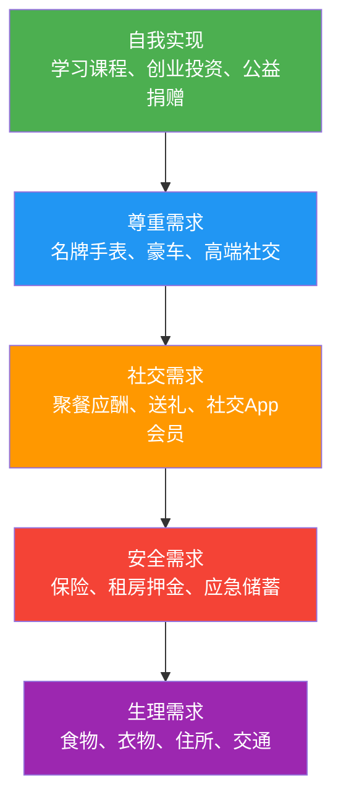
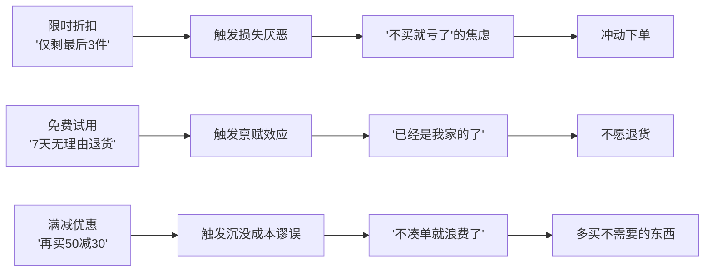
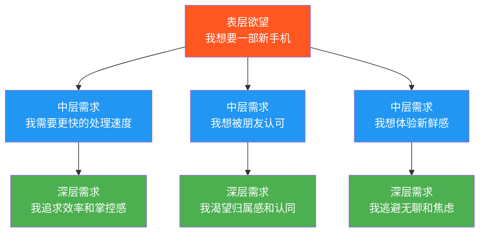
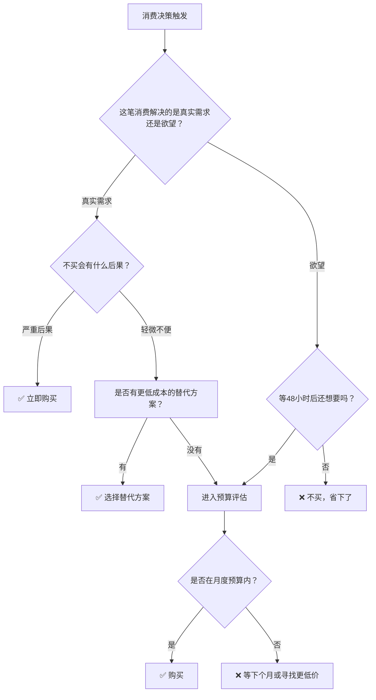

# 四、消费行为理论：如何管理你的欲望

## 1. 为什么20-30岁必须理解消费行为理论

20-30岁是消费欲望最旺盛、消费决策最容易失控的年龄段。这不是意志力的问题，而是由生理、心理和社会环境共同决定的客观规律。

**生理层面：** 前额叶皮层（负责理性决策和冲动控制）在25岁左右才完全发育成熟。这意味着20-25岁的年轻人在面对消费诱惑时，大脑的"刹车系统"本身就是不完善的。神经科学研究表明，年轻人看到心仪商品时，大脑伏隔核（奖赏中枢）的激活强度是30岁以上人群的1.5-2倍，而前额叶的抑制信号却弱得多。

**心理层面：** 刚刚获得经济独立的年轻人，天然地想要通过消费来确认"我长大了"、"我能掌控自己的生活"。这种心理需求本身没有问题，但如果缺乏对消费行为的理性认知，很容易被商家利用。

**社会环境层面：** 算法推荐、社交平台种草、直播带货、分期付款——现代消费环境被精心设计为"欲望放大器"。花呗、白条、信用卡让你感觉花的不是"真钱"，而分期付款更把一笔大额支出拆成了"每天只要几块钱"的心理幻觉。

**一个关键数据：** 根据央行发布的《2024年支付体系运行总体情况》，中国信用卡逾期半年未偿信贷总额超过1000亿元。其中25-35岁人群的逾期率是平均水平的1.8倍。这些数字背后，是无数个"我以为我还得起"的消费决策。

理解消费行为理论，不是要你变成一个苦行僧，而是要你**看透消费决策背后的心理机制，从而在"想要"和"需要"之间做出清醒的选择**。

---

## 2. 六大消费行为理论：从根源理解你的欲望

### 2.1 边际效用递减理论：为什么第一杯奶茶最香

**理论来源：** 边际效用递减是微观经济学的基石理论，由英国经济学家威廉·杰文斯（William Stanley Jevons）、奥地利经济学家卡尔·门格尔（Carl Menger）和法国经济学家莱昂·瓦尔拉斯（Léon Walras）在19世纪70年代各自独立提出，构成了"边际革命"的核心内容。

**核心原理：** 随着你消费同一种商品的数量增加，每新增一单位商品带来的满足感（效用）是递减的。

**生活中的例子：**

| 消费顺序 | 场景 | 边际效用 | 累计满足感 |
|----------|------|----------|------------|
| 第1杯奶茶 | 口渴时，第一口冰凉甜蜜 | ★★★★★ 极高 | ★★★★★ |
| 第2杯奶茶 | 还行，但没那么惊艳了 | ★★★ 中等 | ★★★★ |
| 第3杯奶茶 | 有点腻了，喝不下去 | ★ 低 | ★★★☆ |
| 第4杯奶茶 | 反感，甚至恶心 | ★★☆ 负效用 | ★★★ |

**对20-30岁的启示：**

这个理论揭示了一个关键事实——**更多的消费不等于更多的幸福**。当你买第3双同款运动鞋时，它带来的快乐远不如第1双；当你连续刷了2小时短视频后，继续刷下去已经不是享受而是空虚。

**实操应用——边际效用记账法：**

在日常记账中，给每一笔非必要消费标注"边际效用评分"（1-5分），一个月后回顾，你会发现：

- 评分4-5分的消费通常是值得的（第一次体验、解决真实需求）
- 评分2-3分的消费是"惯性消费"（习惯性购买、跟风购买）
- 评分1分的消费是"浪费"（买了就后悔、完全没用上）

将下个月的预算重点放在高评分消费上，砍掉低评分消费，你的生活质量不会下降，但支出可能减少30-40%。

### 2.2 马斯洛需求层次理论：你的消费在满足哪一层

**理论来源：** 美国心理学家亚伯拉罕·马斯洛（Abraham Maslow）于1943年在论文《人类动机理论》中提出，后在1954年著作《动机与人格》中完善。

**核心原理：** 人类需求像金字塔一样分层，从底层到顶层依次为：生理需求、安全需求、社交需求、尊重需求、自我实现需求。只有低层需求基本满足后，高层次需求才会成为主要驱动力。

**消费行为的层次映射：**



**对20-30岁的关键洞察：**

很多年轻人的消费问题不在于花钱太多，而在于**需求层次错位**——生理需求和安全需求尚未稳固，就开始大量消费在尊重需求和社交需求上。

**典型的层次错位表现：**

| 错位类型 | 具体表现 | 本质问题 |
|----------|----------|----------|
| 安全→尊重 | 没有应急储蓄，却买奢侈品包 | 用外在符号掩盖内在不安全 |
| 生理→社交 | 住着合租房，却每周请客吃饭 | 用社交消费维系脆弱的自尊 |
| 安全→自我实现 | 没有保险，却花几万报培训班 | 一次意外就能让所有投资归零 |
| 生理→尊重 | 吃着泡面，却分期买最新款iPhone | 需求倒置导致的系统性脆弱 |

**正确的消费优先级排序：**

1. **第一层：生理保障**（食物、基本衣物、住所、通勤）——占收入的40-50%
2. **第二层：安全垫**（应急基金、基本保险、社保）——占收入的10-15%
3. **第三层：社交维系**（合理社交、适度礼物）——占收入的5-10%
4. **第四层：自我提升**（书籍、课程、技能培训）——占收入的5-10%
5. **第五层：享受与投资**（旅行、兴趣爱好、投资理财）——剩余部分

**核心原则：先稳固底层，再追求上层。** 应急基金没存够3个月之前，任何第五层消费都应推迟。

### 2.3 享乐适应理论：为什么买了新手机三天就不兴奋了

**理论来源：** 美国心理学家菲利普·布里克曼（Philip Brickman）和唐纳德·坎贝尔（Donald Campbell）在1971年提出"享乐踏板"（Hedonic Treadmill）概念。后续研究由心理学家丹尼尔·卡尼曼（Daniel Kahneman）和经济学家理查德·伊斯特林（Richard Easterlin）等深化。

**核心原理：** 人类对快乐的感受具有适应性。无论是正面还是负面的生活变化，人们的情绪最终都会回归到一个相对稳定的"基准幸福水平"。

**经典研究数据：**

伊斯特林悖论（Easterlin Paradox）发现：在一个国家内部，收入较高的人确实比收入较低的人更幸福；但是，当整个国家的收入水平随时间增长后，国民的平均幸福水平并没有相应提高。

具体到个人消费层面：

- 中了彩票的人，6-12个月后幸福感回到基线水平
- 买了新车的人，3-6个月后新鲜感基本消失
- 换了新手机的人，1-2个月后就习惯了
- 搬进大房子的人，1年后不再觉得房子"大"

**这不是说消费没有意义，而是说：**

1. **物质消费的快乐是短暂的。** 一次性的物质购买带来的幸福感通常只能持续几天到几周。
2. **体验型消费比物质型消费更持久。** 旅行、学习新技能、与朋友共度时光带来的快乐，适应速度更慢，回忆时还能再次产生快乐（心理学称为"回忆红利"）。
3. **持续的小快乐优于一次性的大消费。** 每周一次的小确幸（一杯好咖啡、一本好书、一次散步）比攒三个月钱买一个奢侈品带来的总快乐更多。

**实操——快乐投资回报率（HROI）评估框架：**

在做消费决策前，用这个公式评估：

```text
HROI = 预期快乐总时长（小时） / 花费金额（元）
```

| 消费类型 | 花费 | 预期快乐时长 | HROI | 评级 |
|----------|------|--------------|------|------|
| 买一本好书 | 50元 | 20小时阅读+长期影响 | 0.40 | ★★★★★ |
| 和朋友聚餐 | 200元 | 3小时快乐+美好回忆 | 0.015 | ★★★★ |
| 买一双新鞋 | 800元 | 2周新鲜感 | 0.001 | ★★★ |
| 分期买名牌包 | 5000元 | 1个月兴奋 | 0.00006 | ★★ |
| 投资自己学技能 | 2000元 | 数年的能力提升 | 0.01+ | ★★★★★ |

### 2.4 心理账户理论：为什么你会觉得"红包里的钱更该花"

**理论来源：** 行为经济学之父理查德·塞勒（Richard Thaler）于1985年在论文《心理账户与消费者选择》中正式提出。塞勒因此理论及其他行为经济学贡献获得2017年诺贝尔经济学奖。

**核心原理：** 人们会在心理上把钱分到不同的"账户"中（如生活费、娱乐费、意外之财等），并对不同账户的钱采取不同的消费态度，尽管金钱本身是完全可替代的。

**典型的心理账户陷阱：**

| 心理账户 | 心理标签 | 行为偏差 | 实际情况 |
|----------|----------|----------|----------|
| 工资收入 | "辛苦钱" | 精打细算 | 合理 |
| 年终奖 | "额外收入" | 大手大脚 | 仍然是你的钱 |
| 红包/礼金 | "白来的钱" | 随意挥霍 | 仍然是你的钱 |
| 投资收益 | "赚来的钱" | 冒更大风险 | 仍然是你的钱 |
| 退款/返现 | "意外之财" | 立刻花掉 | 仍然是你的钱 |
| 省下的钱 | "省到就是赚到" | 用来买别的 | 未必真的省了 |

**一个经典实验：**

塞勒设计了两个场景：
- 场景A：你花150元买了一张话剧票，到了剧场发现票丢了，你会再买一张吗？
- 场景B：你打算到剧场买票，到了发现口袋里少了150元（但不知道怎么丢的），你还会买票吗？

两个场景的经济成本完全相同（都是损失150元+花150元买票），但大多数人选择场景A不再买票，场景B却会买票。原因就是心理账户——在场景A中，"看话剧"这个账户已经花了150元（买票），再花150元就"超支"了；而在场景B中，丢的150元来自"现金"账户，和"看话剧"账户无关。

**实操——破解心理账户的三个方法：**

**方法一：统一账户法。** 所有收入进入同一个"资金池"，不做心理分类。具体操作：所有收入（工资、奖金、红包、退款）统一转入一个主账户，再从主账户按预算比例分配到各个实际用途。

**方法二：冷静换算法。** 在花钱之前，把金额换算成"工作时间"。

```text
你的税后时薪 = 月税后收入 / 月实际工作小时数

例：税后月薪8000元，每月工作22天×8小时=176小时
税后时薪 = 8000 / 176 ≈ 45元/小时

一个5000元的包 = 你工作111小时（近14个工作日）
```

当你意识到一个包需要你连续工作两周半才能换来时，冲动消费的欲望往往会大幅下降。

**方法三：48小时规则。** 任何超过200元的非必要消费，强制等待48小时再决定。48小时后还想要，再买。研究表明，这个简单的延迟规则可以减少40-60%的冲动消费。

### 2.5 损失厌恶与禀赋效应：为什么"限时折扣"总能骗到你

**理论来源：** 丹尼尔·卡尼曼（Daniel Kahneman）和阿莫斯·特沃斯基（Amos Tversky）在1979年提出的"前景理论"（Prospect Theory）中首次系统描述了损失厌恶现象。卡尼曼因此获得2002年诺贝尔经济学奖。

**核心原理：** 损失厌恶——失去100元带来的痛苦，大约是得到100元带来的快乐的2-2.5倍。禀赋效应——一旦你"拥有"了某样东西（哪怕只是在购物车里），你对它的估价就会自动提高。

**商家如何利用这两种心理：**



**识别并抵抗营销心理操控的清单：**

| 营销手段 | 利用的心理机制 | 破解思路 |
|----------|----------------|----------|
| "限时特惠，仅剩XX件" | 损失厌恶+稀缺性偏误 | 问自己：如果没有"限时"标签，我还会买吗？ |
| "原价999，现价299" | 锚定效应 | 忽略原价，只问自己：这个东西值不值299？ |
| "满200减30" | 沉没成本谬误 | 算清楚：为了省30，多花100是否划算？ |
| "0元领/1元购" | 禀赋效应+承诺一致性 | 免费的东西往往最贵——你在用时间和注意力付费 |
| "分期免息" | 心理账户+支付脱敏 | 把总金额写在便签贴在付款页面旁 |
| "明星同款/博主推荐" | 社会认同+光环效应 | 他们的收入是你的几十倍，消费标准不适用 |
| "凑单包邮" | 损失厌恶（怕付运费） | 运费10元 vs 凑单多花50元，哪个更亏？ |

### 2.6 社会比较理论：为什么朋友圈让你更想花钱

**理论来源：** 美国社会心理学家利昂·费斯廷格（Leon Festinger）于1954年提出社会比较理论。后续研究者将其扩展到消费领域，形成了"炫耀性消费"（Thorstein Veblen, 1899）和"相对收入假说"（James Duesenberry, 1949）等理论。

**核心原理：** 人类有一种内在驱力，需要通过与他人比较来评估自己的能力和状况。在消费领域，这表现为"别人有的我也要有"、"我买的要比别人好"。

**社交媒体放大了社会比较的破坏力：**

在社交媒体出现之前，你比较的对象是身边的同事、邻居、同学——一个相对有限的范围。但现在：

- 朋友圈里，有人晒马尔代夫度假
- 小红书上，有人晒爱马仕包
- 抖音里，有人晒豪车别墅
- 你比较的不再是"身边的真实的人"，而是"所有人精心修饰过的最好一面"

**一个残酷的数学事实：** 假设你有500个微信好友，每个人每个月有1次"高光时刻"（晒旅游、晒美食、晒购物），你每天会看到约17条"别人过得比我好"的内容。这不是事实的全貌，但它会持续制造"我还不够好"的焦虑，驱动你通过消费来追赶。

**破除社会比较的三步法：**

**第一步：识别比较触发器。** 记录每次产生"我也想买"念头时的情境——是在刷朋友圈后？还是在逛商场时？还是听到同事谈论某品牌时？识别触发器是控制反应的第一步。

**第二步：切换比较维度。** 与其比较"谁买了什么"，不如比较"谁的财务状况更健康"。一个背着LV包但月光的人，和一个背着普通包但有10万存款的人，谁的财务状况更好？答案显而易见。

**第三步：建立"延迟比较"习惯。** 当你想因为比较而消费时，把这笔钱的金额记下来，存入一个"比较基金"账户。三个月后看这个账户的累计金额——它会成为你最强的"反消费"动力。

---

## 3. 消费行为的深层机制：欲望、习惯与身份认同

### 3.1 欲望的三层结构

消费欲望不是单一的"想买东西"，而是有清晰的层次结构：



**深层需求往往可以用更低成本的方式满足：**

| 深层需求 | 高成本满足方式 | 低成本满足方式 |
|----------|----------------|----------------|
| 追求效率 | 买最新款手机 | 清理现有手机存储+优化设置 |
| 渴望认同 | 买名牌服饰 | 在专业领域建立影响力 |
| 逃避无聊 | 逛街购物/刷短视频 | 学习新技能、运动、阅读 |
| 追求新鲜感 | 频繁换电子产品 | 探索新路线、尝试新食谱、认识新朋友 |
| 缓解焦虑 | 暴饮暴食/冲动消费 | 冥想、运动、写日记 |
| 追求安全感 | 囤积物品 | 建立应急基金和保险体系 |

### 3.2 消费习惯的形成与打破

**习惯回路模型：** 根据杜克大学习惯研究中心的研究，人类约40%的日常行为是习惯驱动而非有意识决策。消费习惯遵循"暗示→惯常行为→奖赏"的回路。

| 习惯回路 | 冲动消费示例 | 可替换的健康回路 |
|----------|--------------|------------------|
| 暗示：感到压力 | 惯常行为：打开淘宝买买买 | 奖赏：短暂的兴奋感 |
| 暗示：感到压力 | 惯常行为：出去跑步30分钟 | 奖赏：内啡肽释放+成就感 |
| 暗示：无聊刷手机 | 惯常行为：看到种草帖下单 | 奖赏：期待快递的兴奋 |
| 暗示：无聊刷手机 | 惯常行为：听一期播客/读一章书 | 奖赏：学到新知识的满足感 |

**打破消费习惯的五步法：**

1. **记录：** 连续7天记录每笔非必要消费，标注触发情绪（压力/无聊/社交压力/奖励自己）
2. **识别：** 找出最高频的触发情绪和消费场景
3. **替换：** 为每种触发情绪找到一个零成本或低成本的替代行为
4. **环境改造：** 删除购物App或将其移到手机最后一页；取消促销短信；退出种草群
5. **21天强化：** 坚持新行为21天，直到新习惯初步形成

### 3.3 消费与身份认同

社会学家让·鲍德里亚（Jean Baudrillard）在《消费社会》（1970）中指出：**在现代消费社会中，人们消费的不仅是商品的使用价值，更是商品的符号价值——它代表的身份、品味和社会地位。**

这对20-30岁的年轻人影响尤其大，因为这个年龄段正处于"身份建构"的关键期。你可能通过消费来表达"我是谁"：

- 穿某个品牌 = "我属于这个群体"
- 用某款手机 = "我是这样的人"
- 去某家咖啡馆 = "我有这种品味"

**问题在于：** 用消费建构的身份是脆弱的。它依赖于持续的金钱投入，一旦收入下降或消费降级，身份感就会崩塌。

**更健康的身份建构方式：**

| 维度 | 消费型身份（脆弱） | 能力型身份（坚固） |
|------|---------------------|---------------------|
| 专业 | "我用MacBook Pro" | "我能独立完成端到端项目" |
| 社交 | "我请客大方" | "我总能提供有价值的建议" |
| 健康 | "我穿Lululemon" | "我能跑完半程马拉松" |
| 审美 | "我买设计师品牌" | "我有自己的穿搭风格和审美体系" |

---

## 4. 实操工具箱：管理欲望的系统方法

### 4.1 消费决策矩阵

在做任何超过月收入5%的消费决策前，用这个矩阵评估：



### 4.2 消费欲望量化表

每当产生消费冲动时，填写这张表：

```markdown
日期：__________
我想买：__________
价格：__________
触发因素：□看到广告  □朋友推荐  □社交压力  □情绪消费  □真实需求
如果我不买，1天后的感受：__________
如果我不买，1周后的感受：__________
如果我不买，1个月后的感受：__________
这笔钱如果投资（年化8%），10年后值：__________
我的决策：□买  □不买  □延迟购买
```

最后一条的心理效果尤其强大——5000元如果以年化8%投资，10年后约10794元。你不是在"花5000元"，而是在"花掉未来的10794元"。

### 4.3 30天消费挑战

这是一个经过验证的、可操作的消费管理训练：

**第1周：观察期**
- 记录每一笔支出（包括1元的矿泉水）
- 不做任何改变，只是观察和记录
- 周末回顾：哪些支出是"如果不记账就想不起来的"？

**第2周：分类期**
- 将所有支出分为三类：必需（生存需要）、有价值（提升生活质量）、浪费（买了后悔或没用上）
- 计算三类支出的比例
- 目标：浪费类占比不超过10%

**第3周：削减期**
- 针对"浪费类"支出，制定具体的削减措施
- 实施"48小时规则"——所有非必需消费等48小时
- 取消至少1个自动续费的订阅服务

**第4周：优化期**
- 将省下的钱转入专用储蓄/投资账户
- 建立下个月的消费预算
- 总结30天的感受和数据变化

**预期成果：** 参与此类挑战的人平均能减少15-25%的月度支出，且生活满意度不降反升（因为减少了"买了后悔"的负面情绪）。

### 4.4 环境设计策略

行为经济学家理查德·塞勒和卡斯·桑斯坦（Cass Sunstein）在《助推》（Nudge, 2008）中指出：**改变环境比改变意志力有效得多。** 以下是经过验证的环境设计策略：

**数字环境改造：**

| 操作 | 具体做法 | 预期效果 |
|------|----------|----------|
| 卸载购物App | 手机上只保留一个购物App，且放在最后一页 | 减少随机浏览购物的频率60%+ |
| 关闭推送通知 | 关闭所有购物平台的推送通知 | 消除"被动触发"的消费暗示 |
| 取消免密支付 | 每次付款都要输入密码 | 增加"支付痛感"，减少冲动消费 |
| 清空购物车 | 每周日清空所有购物车 | 打断"放入购物车→习惯性下单"的回路 |
| 取消保存的地址和卡 | 删除一个快捷支付方式 | 增加购买的"摩擦力" |
| 使用消费提醒 | 设置银行/支付宝的单笔消费提醒 | 让每笔支出都"可见" |

**物理环境改造：**

- **不逛商场"消遣"。** 如果要逛，先列清单，只买清单上的东西。
- **不在饥饿时去超市。** 研究表明，饥饿状态下超市购物量平均增加20-30%。
- **把现金放在透明钱包里。** 看到现金减少比看数字更能让"支付痛感"生效。
- **在显眼位置放置财务目标。** 把"2026年存够10万"的便签贴在电脑旁、冰箱上、钱包里。

---

## 5. 常见消费误区与纠正

### 误区一："我值得拥有"式消费

**现象：** 辛苦工作了一周/一个月，觉得"应该犒劳一下自己"，然后进行大额消费。

**分析：** "犒劳自己"本身没有问题，问题在于大多数人选择的犒劳方式是消费，而不是休息、运动或社交。而且这种"应得感"会被商家利用——"你值得更好的"是最高级的营销话术之一。

**纠正：** 用非消费方式犒劳自己——睡个懒觉、看一部好电影（免费资源）、去公园散步、和朋友喝杯茶。如果一定要消费犒劳，提前在预算中设立"犒劳基金"（建议月收入的3-5%），花完即止。

### 误区二："便宜等于省钱"

**现象：** 因为打折而买了一堆用不上的东西，或者为了凑单满减买了不需要的商品。

**分析：** 省钱的定义不是"花了更少"，而是"该花的花，不该花的一分不花"。一件原价1000元、打折后300元但你永远不穿的衣服，不是"省了700元"，而是"浪费了300元"。

**纠正：** 买任何打折商品前问自己——"如果这个东西不打折、以现在的价格出售，我还会买吗？"如果答案是否，就不买。

### 误区三："分期付款没压力"

**现象：** 觉得分期每月只要几百块，"没什么感觉"就买了高价商品。

**分析：** 分期付款的核心问题是**支付脱敏**——把一笔大额支出拆成多笔小额支出，降低了你对总价的感知。花6000元买手机，如果一次性支付，你可能会犹豫；但如果"每月只要500元"，就显得微不足道。但总价并没有变。

**纠正：** 做分期决策时，只看总价，不看月供。问自己："如果必须一次性付全款，我还买吗？"如果答案是否，说明这个东西超出了你的实际消费能力。

### 误区四："投资自己永远不亏"

**现象：** 买了大量课程、书籍、训练营，但从未看完或完成。

**分析：** "投资自己"被过度神化了。真正的投资自己是**学到并用到**，而不是**买了就算**。一个买了100门课程但一门都没学完的人，和一个深入学完3门课程的人，后者才是真正的"投资自己"。

**纠正：** 购买任何学习产品前，先完成一个前置任务——找到该领域3个免费的高质量资源并学习至少20%。如果你连免费资源都无法坚持，付费也不会改变结果。实行"一进一出"规则——买一门新课之前，必须先完成一门已购买的课程。

### 误区五："别人有我也要有"

**现象：** 因为同事/朋友/社交媒体上的人拥有某样东西，自己也想买。

**分析：** 你看到的是别人的消费，看不到的是别人的收入、负债和财务状况。一个背着名牌包的人可能信用卡欠了5万；一个开着豪车的人可能每月还贷压力巨大。**你无法通过观察别人的消费来判断他们的真实财务状况。**

**纠正：** 建立自己的"财务仪表盘"——净资产、储蓄率、投资收益——用这些指标衡量自己的进步，而不是用消费品清单。

---

## 6. 进阶：消费行为的经济学与神经科学视角

### 6.1 前景理论与消费决策

卡尼曼和特沃斯基的前景理论揭示了消费决策中的系统性偏差：

**参考点依赖：** 人们对得失的判断不是基于绝对值，而是基于相对于某个"参考点"的变化。在消费中，商家通过设定"原价"来操纵你的参考点——原价999元、现价299元，让你觉得自己"赚了700元"，但实际上你"花了299元"。

**敏感度递减：** 从0元到100元的感知差异，远大于从900元到1000元的感知差异。这解释了为什么"满减"的门槛总是设在离你购物车金额不远的地方——让你觉得"再买一点就能省很多"。

**损失框架 vs 收益框架：** "不买你就亏了"（损失框架）比"买了你就赚了"（收益框架）更能驱动消费。限时折扣、限量发售、错过不再——所有这些话术都在利用损失框架。

### 6.2 多巴胺系统与消费成瘾

**神经科学基础：** 当你浏览商品、加入购物车、等待快递时，大脑释放的多巴胺（期待和渴望的神经递质）比你真正收到商品时还要多。这就是为什么"逛淘宝"本身就能带来快感——你在享受的是"期待"，而不是"拥有"。

**消费与成瘾的神经相似性：** 研究发现，强迫性购物者的大脑激活模式与物质成瘾者有显著相似之处——都是在"期待奖赏"阶段过度激活，在"获得奖赏"阶段快速脱敏。这解释了为什么"买完还想买"——因为快乐来自购买的过程，而非购买的结果。

**实际应对：** 如果你发现自己有"购物成瘾"的倾向（无法控制购买冲动、买完后悔但下次还买、需要不断增加消费金额才能获得同样的兴奋感），这不是意志力问题，而是大脑奖赏系统的问题。具体应对措施：

- 正念冥想：每天10分钟，增强对冲动的觉察能力
- 运动：有氧运动能自然调节多巴胺系统
- 寻求专业帮助：如果严重影响生活，考虑认知行为疗法（CBT）

### 6.3 行为经济学的"助推"在个人理财中的应用

"助推"理论由塞勒和桑斯坦提出，核心思想是：通过改变选择架构（choice architecture），在不限制自由的前提下引导更好的决策。

**自我助推策略：**

1. **默认选项设计：** 把工资卡设置为"自动转账到储蓄账户"——储蓄变成默认行为，不储蓄才需要主动操作。
2. **承诺机制：** 告知朋友或家人你的储蓄目标，利用社会压力增加执行力。也可以使用"承诺储蓄App"，未达标会有惩罚。
3. **简化选择：** 不要面对几十种投资产品做选择。设定一个简单的规则（如"每月工资的20%买入沪深300指数基金"），然后自动化执行。
4. **及时反馈：** 使用可视化工具（如记账App的月度报告）让消费数据"可见"——人类对不可见的数据缺乏反应。

---

## 7. 本节核心要点总结

| 维度 | 核心观点 | 实操建议 |
|------|----------|----------|
| 边际效用 | 更多消费≠更多快乐 | 对非必要消费标注效用评分，砍掉低分消费 |
| 需求层次 | 先稳固底层需求再追求上层 | 先建应急基金，再考虑享受型消费 |
| 享乐适应 | 物质快乐短暂，体验快乐持久 | 优先体验型消费（旅行、学习、社交），减少物质型消费 |
| 心理账户 | 钱是可替代的，别被"标签"迷惑 | 统一账户管理，所有收入进一个池子 |
| 损失厌恶 | 商家利用"怕亏"心理驱动消费 | 48小时规则+问"如果没有折扣标签，我还买吗" |
| 社会比较 | 别人展示的是精选瞬间，不是全貌 | 比较财务健康度，不比较消费品清单 |
| 欲望管理 | 深层需求可以用低成本方式满足 | 在消费前问"我真正需要的是什么" |
| 环境设计 | 改变环境比改变意志力有效 | 卸载多余购物App、关闭推送、取消免密支付 |

**最终原则：管理欲望不是消灭欲望，而是理解欲望的来源，用更聪明的方式满足真正的需求，把有限的资源投入到回报最高的地方。**

对20-30岁的你来说，今天省下的一笔冲动消费，经过复利的放大，可能在30年后变成一笔可观的财富。每一次清醒的消费决策，都是对未来自己的一次投资。
