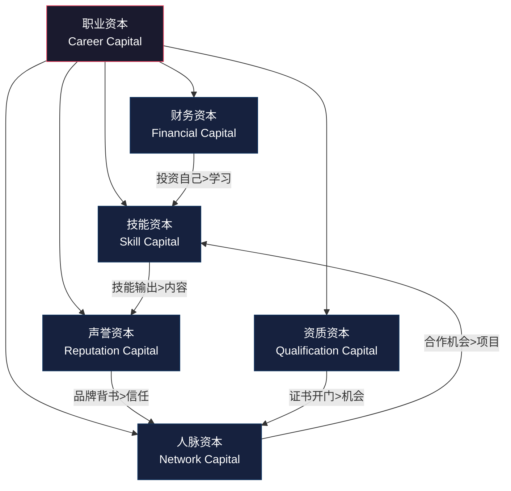
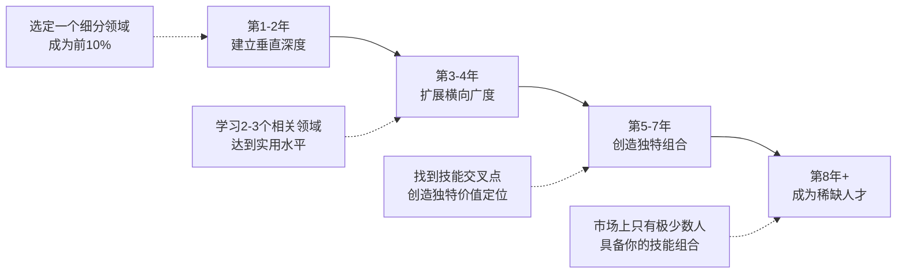
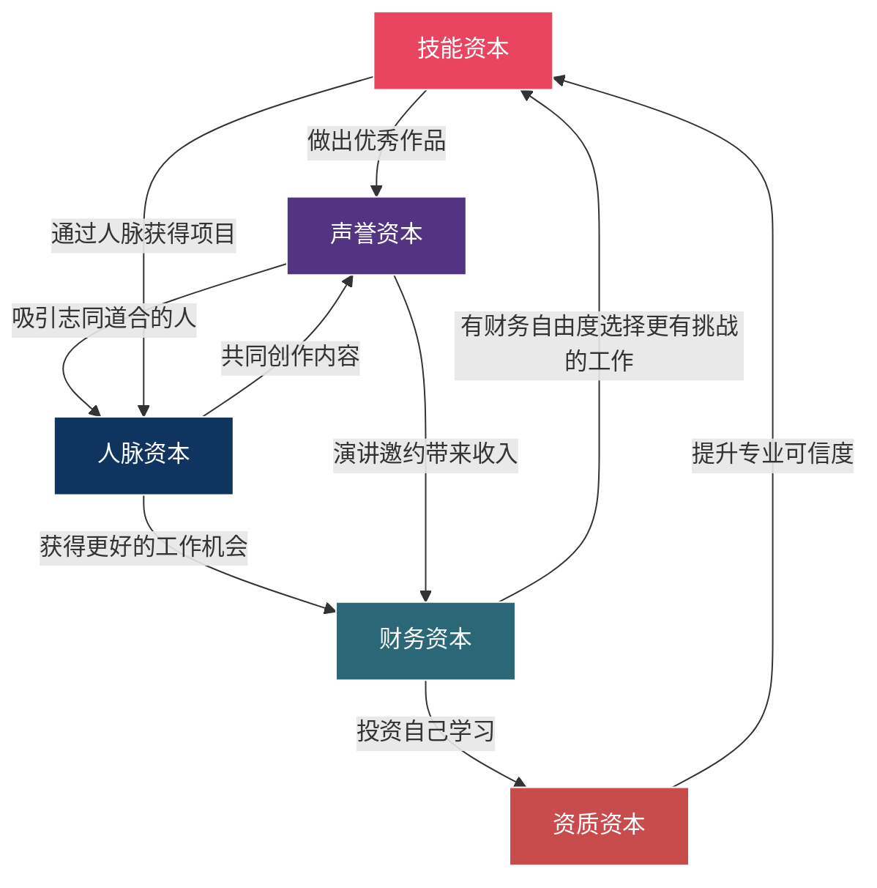

## 五、职业资本理论：如何提升你的市场价值

### 1. 什么是职业资本理论

#### 1.1 理论起源与核心思想

"职业资本"（Career Capital）这一概念由乔治城大学计算机科学教授卡尔·纽波特（Cal Newport）在其著作《优秀到不能被忽视》（*So Good They Can't Ignore You*）中系统阐述。纽波特通过研究大量成功职业人士的轨迹，提出了一个颠覆性的观点：**真正驱动职业成功的不是"追随激情"，而是积累稀缺且有价值的技能——即职业资本。**

这一理论的底层逻辑是：

- **激情是结果，不是原因。** 你不会因为热爱某件事而变得擅长，而是因为擅长了才会产生热爱。心理学研究支持这一观点——自我决定理论（Self-Determination Theory）指出，内在动机来源于三个要素：自主性（Autonomy）、胜任感（Competence）和归属感（Relatedness）。其中胜任感必须通过技能积累才能获得。
- **市场为稀缺买单。** 你的收入不由你的努力程度决定，而由你提供的价值在市场上的稀缺性决定。职业资本越稀缺，你的议价能力越强。
- **资本可以迁移和叠加。** 职业资本不是一次性的消耗品，而是可以跨岗位、跨行业迁移，并且会随时间复利增长的资产。

#### 1.2 为什么20-30岁是积累职业资本的黄金期

20-30岁这段时间具有独特的结构性优势：

| 维度 | 20-30岁的优势 | 30岁后的变化 |
|------|--------------|-------------|
| 学习速度 | 神经可塑性高，新技能习得快 | 学习曲线变缓，但深度理解增强 |
| 时间弹性 | 家庭负担轻，可投入大量时间 | 家庭责任增加，自由时间减少 |
| 试错成本 | 失败代价低，可以从头再来 | 转行成本高，沉没成本大 |
| 机会窗口 | 雇主对年轻人的"潜力"有溢价 | 雇主更看重"即战力"和过往成绩 |
| 复利时间 | 资本有30-40年复利期 | 复利期缩短 |

**关键认知：20-30岁不是用来"找到自己"的，而是用来"建造自己"的。** 每一年的延迟积累，都是复利时间的永久损失。

#### 1.3 职业资本的五维模型

在纽波特理论的基础上，结合中国职场环境和当代经济特征，职业资本可以拆解为五个相互关联的维度：

五个维度之间并非独立存在，而是形成正反馈循环：技能输出带来声誉，声誉吸引人脉，人脉带来机会和财务回报，财务资本支持进一步学习和获取资质，资质又增强技能的可信度。理解这个循环，是制定职业资本积累策略的前提。

---

### 2. 技能资本：你的核心竞争力

#### 2.1 什么是技能资本

技能资本是你所掌握的**稀缺且有价值的技能的总和**。它不仅包括硬技能（编程、设计、数据分析），还包括软技能（沟通、管理、谈判）以及元技能（学习能力、问题解决能力、系统思维）。

纽波特在研究中发现，有两种技能资本策略：

- **工匠型策略（Craftsman Strategy）：** 在一个领域深耕到极致，成为不可替代的专家。适合技术性强、知识壁垒高的领域（如芯片设计、量化交易、医学研究）。
- **嫁接型策略（Combinatorial Strategy）：** 将两个或多个领域的技能组合在一起，创造出独特的价值定位。例如：编程 + 法律 = 法律科技专家；数据分析 + 心理学 = 用户行为研究专家。

**20-30岁的最优策略：先工匠，后嫁接。** 前3-5年在一个领域建立深度，然后用嫁接策略创造差异化优势。

#### 2.2 技能选择的"市场价值矩阵"

不是所有技能都值得投入时间。选择技能时，用以下四象限矩阵评估：

|  | 高市场需求 | 低市场需求 |
|--|----------|----------|
| **高稀缺性** | ⭐ 黄金技能（全力投入） | 🔬 前沿技能（战略性储备） |
| **低稀缺性** | 📦 基础技能（达标即可） | ❌ 过时技能（避免投入） |

**2025-2030年的黄金技能方向：**

- **AI协作能力：** 不是会用ChatGPT，而是能将AI工具深度整合进工作流程，提升10倍效率的能力。具体包括：Prompt Engineering、AI辅助编程、AI驱动的数据分析、AI产品的设计思维。
- **系统架构能力：** 能够设计和优化复杂系统（技术系统、业务流程系统、组织系统）的能力。
- **跨文化沟通：** 在全球化和远程协作背景下，能够跨越文化差异进行有效沟通和协作的能力。
- **数据思维：** 不是会用Excel，而是能用数据驱动决策、用数据讲故事、用数据发现问题的能力。
- **深度专业能力：** 在任何领域成为前5%的专家——市场永远为顶级专业能力支付溢价。

#### 2.3 技能习得的科学方法

**刻意练习（Deliberate Practice）框架：**

安德斯·艾利克森（Anders Ericsson）的研究表明，技能习得不是简单的重复，而需要结构化的刻意练习：

1. **明确目标：** 不是"学好编程"，而是"能在30分钟内用Python实现一个REST API，并通过单元测试"。
2. **即时反馈：** 每次练习后立即获得反馈——代码review、测试结果、导师点评、用户反馈。
3. **舒适区边缘：** 练习内容的难度应略高于当前水平（大约高出10-20%），既不简单到无聊，也不困难到挫败。
4. **高度专注：** 刻意练习需要全神贯注，每天2-4小时的高质量练习远胜于8小时的低质量重复。

**技能习得的"100小时规则"：**

对于大多数技能，投入100小时的刻意练习就能从"完全不会"达到"可以实用"的水平。这比"10000小时规则"更适用于20-30岁的起步阶段：

| 投入时间 | 水平 | 适用场景 |
|---------|------|---------|
| 10小时 | 入门了解 | 决定是否值得深入 |
| 100小时 | 实用水平 | 可以在工作中应用 |
| 1000小时 | 熟练水平 | 可以独立完成复杂任务 |
| 5000小时 | 专家水平 | 可以指导他人 |
| 10000小时+ | 大师水平 | 可以创新和突破 |

**实操建议：用"技能冲刺"替代"长期计划"**

不要制定"一年学好XX"的计划，而是进行集中式的"技能冲刺"：

- 选择一个具体技能（如"用Python进行数据分析"）
- 设定2-4周的冲刺周期
- 每天投入2-3小时刻意练习
- 冲刺结束时产出一个可展示的作品（项目、报告、工具）
- 评估是否继续深入或切换到下一个技能

#### 2.4 技能资本的复利效应

技能之间不是简单的叠加关系，而是会产生"化学反应"。掌握的技能越多，新技能的边际价值越高：

- 编程 + 写作 = 技术影响力（技术博客、开源项目文档）
- 数据分析 + 行业知识 = 商业智能咨询能力
- 设计 + 心理学 = 用户体验设计专家
- 营销 + 数据分析 = 增长黑客能力
- 项目管理 + 技术背景 = CTO/技术VP路径

**"T型人才"策略的实操路径：**

---

### 3. 人脉资本：你的机会网络

#### 3.1 人脉资本的本质

人脉资本不是你认识多少人，而是**在你需要时，有多少人愿意并且能够帮助你**。管理学教授赫尔加·鲍莫尔（Herminia Ibarra）的研究表明，职业转型中最大的助力不是技能证书，而是弱关系网络（Weak Ties）——那些你不太熟但处于不同社交圈的人。

**弱关系理论（Weak Ties Theory）：**

社会学家马克·格兰诺维特（Mark Granovetter）的经典研究发现：人们获得工作机会的信息，更多来自"弱关系"（偶尔联系的熟人）而非"强关系"（亲密朋友）。原因是：

- 强关系的朋友和你处于同一个信息圈，知道的信息你也知道
- 弱关系的人处于不同的社交网络，能接触到你接触不到的信息和机会
- 弱关系的多样性决定了你能接触到的机会池的大小

#### 3.2 20-30岁的人脉建设策略

**阶段一：加入社群（20-23岁）**

- 加入2-3个与职业相关的高质量社群（技术社区、行业论坛、专业协会）
- 目标不是"认识人"，而是"被看见"——通过回答问题、分享经验、参与讨论来展示专业能力
- 选择标准：社群成员的专业水平应略高于你，但不至于高到你无法参与

**阶段二：建立深度连接（23-26岁）**

- 从社群中识别3-5个值得深交的人，建立定期交流机制（月度咖啡、季度聚餐）
- 寻找1-2个导师（Mentor）：不一定是行业大佬，但必须是比你走得远3-5年的人
- 主动为他人创造价值：介绍机会、分享资源、提供帮助——先付出，后收获

**阶段三：构建个人网络（26-30岁）**

- 从"参与者"转变为"连接者"——成为不同圈子之间的桥梁
- 建立"人脉地图"：梳理你的人脉网络，识别关键节点和薄弱环节
- 培养"给予者"心态：亚当·格兰特（Adam Grant）在《给予与索取》中的研究表明，长期来看，"给予者"（Givers）比"索取者"（Takers）和"互利者"（Matchers）更容易获得成功

#### 3.3 人脉维护的实操框架

| 人脉层级 | 人数 | 维护频率 | 维护方式 |
|---------|------|---------|---------|
| 核心圈（深度互信） | 5-10人 | 每周 | 深度交流、资源共享、互相支持 |
| 紧密圈（定期互动） | 20-30人 | 每月 | 聚餐、项目合作、信息分享 |
| 扩展圈（弱关系） | 100-200人 | 每季度 | 社交媒体互动、节日问候、行业资讯转发 |
| 外围圈（认识但不熟） | 500+人 | 不定期 | 朋友圈点赞、活动偶遇、社群互动 |

**维护工具与习惯：**

- 使用联系人管理工具（如Notion数据库、Airtable）记录关键信息：上次联系时间、对方近况、共同话题、可以帮忙的事情
- 每周花30分钟进行"人脉维护"：给2-3个久未联系的人发一条有价值的信息（不是"在吗？"，而是"看到这篇文章想到你，觉得你可能感兴趣"）
- 每次参加行业活动后，24小时内添加新认识的人并发送一条个性化的后续消息

#### 3.4 避免人脉建设的常见陷阱

- **陷阱一：只向上社交。** 只关注比自己厉害的人，忽视同龄人和下属。事实上，你今天的同龄人可能是10年后各行业的中坚力量，他们才是你最持久的人脉资产。
- **陷阱二：把社交当任务。** 刻意的、功利性的社交很容易被对方感知到，反而产生反感。真正有效的人脉建设是基于真实的兴趣和价值交换。
- **陷阱三：广而不深。** 认识1000个人但没有一个是真正的朋友，不如认识50个可以深度信任的人。人脉的质量远比数量重要。
- **陷阱四：只索取不付出。** 每次联系别人都是"帮我个忙"，从不主动提供价值。这样的人脉关系注定是不可持续的。

---

### 4. 声誉资本：你的个人品牌

#### 4.1 声誉资本的经济学解释

声誉资本的本质是一种**信号机制**。在信息不对称的市场中（雇主无法完全了解你的能力），声誉作为一种可信信号，降低了交易成本。

经济学家迈克尔·斯宾塞（Michael Spence）的信号理论指出：在劳动力市场上，求职者比雇主更了解自己的能力。为了解决这种信息不对称，求职者需要发出"信号"来证明自己的能力——而声誉就是最强大的信号之一。

**声誉资本的三个特征：**

- **积累慢、崩塌快：** 建立声誉需要数年持续输出，但一次重大失误就可能毁掉一切。这决定了声誉管理必须是长期战略，而非短期操作。
- **网络效应：** 声誉的价值随受众规模指数增长。10个人知道你很厉害，和10000个人知道你很厉害，带来的机会差距不是1000倍，而是可能是10000倍（因为机会会被二次传播）。
- **自我强化：** 高声誉带来更多机会，更多机会带来更多成功案例，更多成功案例进一步增强声誉。这是一个正反馈循环。

#### 4.2 20-30岁的声誉建设路径

**第一阶段：专业展示（起步期）**

在这个阶段，你还没有太多成果可以展示，重点是建立"专业存在感"：

- 维护一份专业的社交媒体档案（LinkedIn/脉脉/知乎/GitHub），突出你的专业方向和学习成果
- 在技术社区（GitHub、Stack Overflow、V2EX）积极回答问题，展示专业能力
- 记录和分享你的学习过程——即使是初学者的视角，对其他初学者也有价值

**第二阶段：内容输出（成长期）**

开始系统性地输出专业内容：

- **写作：** 每周或每两周产出一篇专业文章。不需要长篇大论，500-1500字的深度洞察即可。关键是持续输出，而非偶尔写一篇"大作"。
- **开源贡献：** 参与开源项目、发布自己的工具或库。代码是最有说服力的能力证明。
- **演讲分享：** 在技术meetup、公司内部分享、线上社区做技术分享。演讲能力是声誉资本的加速器。

**第三阶段：思想领导力（成熟期）**

当你在某个领域积累了足够的深度，开始输出独到的见解和方法论：

- 出版专业书籍或系列教程
- 在行业会议上发表主题演讲
- 成为媒体引用的行业专家
- 建立自己的付费社群或咨询业务

#### 4.3 内容输出的"100篇计划"

**每篇文章/视频/项目都是一个"资产"——它会持续为你带来曝光、机会和人脉。**

100篇高质量内容 = 一个自动运转的"机会吸引机器"。具体执行：

| 内容类型 | 频率 | 投入时间 | 产出目标 |
|---------|------|---------|---------|
| 短文/笔记 | 每周2-3篇 | 30-60分钟/篇 | 社交媒体、知乎回答 |
| 深度文章 | 每月2篇 | 3-5小时/篇 | 个人博客、行业媒体 |
| 教程/指南 | 每季度1篇 | 10-20小时/篇 | 技术社区、付费专栏 |
| 演讲/分享 | 每季度1次 | 5-10小时准备 | 线下/线上活动 |
| 开源项目 | 持续 | 碎片化时间 | GitHub、技术社区 |

#### 4.4 声誉风险管理

- **一致性原则：** 你的输出内容、社交行为、专业表现必须保持一致。一个在技术社区高谈阔论最佳实践的人，如果自己的代码质量很差，声誉会迅速崩塌。
- **透明度原则：** 犯错时坦诚承认，不要试图掩盖。人们更容易原谅坦诚的错误，而非刻意的隐瞒。
- **边界感原则：** 明确你的专业边界，不要在不擅长的领域发表权威性意见。"这个我不太了解"比"我觉得应该是这样"更能保护你的专业声誉。

---

### 5. 财务资本：你的职业自由度

#### 5.1 财务资本对职业发展的影响

财务资本不仅仅是"存钱"，它直接影响你的职业选择空间：

- **谈判筹码：** 当你有足够的储蓄时，你可以在薪资谈判中更有底气——你不需要这份工作来维持生存，因此可以拒绝不合理的offer。
- **试错空间：** 有6-12个月的生活费储备，你可以从容地进行职业转型、创业尝试或gap year学习，而不必因为经济压力而做出妥协。
- **投资能力：** 财务资本让你有能力投资自己——付费课程、行业会议、专业工具、健康保障——这些投资的回报率往往远高于金融市场。

#### 5.2 20-30岁的财务资本积累策略

**"3-3-3"储蓄法则：**

将月收入分为三个部分：

- 30%用于必要生活开支（房租、饮食、交通）
- 30%用于自我投资（学习、社交、健康）
- 30%用于储蓄和投资

剩余10%作为弹性预算。

**应急基金优先级最高：**

在做任何投资之前，先建立3-6个月的应急基金。这笔钱存在高流动性的账户中（如货币基金），只在真正紧急的情况下使用。应急基金的存在让你在面对职业风险时有更大的决策自由度。

**收入增长的"飞轮效应"：**

20-30岁的核心策略：**将大部分"投资预算"用在投资自己身上，而非金融市场。** 这个阶段，投资技能和人脉的回报率远高于股票和基金。

#### 5.3 财务资本与职业自由度的关系矩阵

| 储备月数 | 职业自由度 | 可以做的选择 |
|---------|----------|------------|
| 0-1个月 | 极低 | 必须接受任何工作机会 |
| 3个月 | 低 | 可以拒绝明显不合理的offer |
| 6个月 | 中等 | 可以主动寻找更好的机会 |
| 12个月 | 较高 | 可以尝试职业转型或创业 |
| 24个月+ | 极高 | 可以追求长期价值而非短期收入 |

---

### 6. 资质资本：你的可信凭证

#### 6.1 什么是资质资本

资质资本包括学历、专业证书、行业认证、获奖经历等**外部权威机构对你能力的背书**。它的核心价值在于降低信息不对称——当雇主无法直接评估你的能力时，资质作为一种"代理信号"（Proxy Signal）帮助他们做出判断。

**资质资本的两种类型：**

- **门槛型资质：** 没有就无法进入某些领域。如：执业医师资格证、法律职业资格证、注册会计师（CPA）。这些资质是刚性要求，没有讨论空间。
- **加分型资质：** 不是必须的，但能增强竞争力。如：PMP项目管理认证、AWS架构师认证、MBA学位。这些资质的价值取决于行业和岗位的具体需求。

#### 6.2 20-30岁的资质获取策略

**"按需获取"原则：**

不要为了"充实简历"而盲目考证。每获取一个资质前，先回答三个问题：

1. 这个资质在我的目标行业/岗位中是门槛型还是加分型？
2. 获取这个资质的投入（时间、金钱、精力）与预期回报是否匹配？
3. 这个资质的有效期和更新要求是什么？

**高ROI资质清单（2025年）：**

| 领域 | 推荐资质 | 投入 | 市场认可度 | 类型 |
|------|---------|------|----------|------|
| 软件开发 | AWS/Azure/GCP架构师认证 | 3-6个月 | ⭐⭐⭐⭐⭐ | 加分型 |
| 项目管理 | PMP认证 | 2-3个月 | ⭐⭐⭐⭐ | 加分型 |
| 数据分析 | Google数据分析证书 | 3-6个月 | ⭐⭐⭐⭐ | 加分型 |
| 网络安全 | CISSP/CISP | 6-12个月 | ⭐⭐⭐⭐⭐ | 门槛型 |
| 金融 | CFA一级 | 6-12个月 | ⭐⭐⭐⭐⭐ | 加分型 |
| 产品管理 | NPDP产品经理认证 | 2-3个月 | ⭐⭐⭐ | 加分型 |

**学历资本的特殊地位：**

在中国职场中，学历仍然是一种重要的信号机制。如果你的目标行业或企业有明确的学历门槛（如金融、咨询、大型互联网公司的管培生项目），那么在20-30岁期间提升学历（如在职硕士、MBA）可能是一项高回报投资。但要注意：

- 优先选择能同时扩展人脉的项目（如MBA、EMBA），一举两得
- 避免"为学历而学历"——如果目标行业不看重学历，把时间花在技能和项目上更有效
- 在职深造的最佳窗口期是25-30岁，此时既有一定工作经验（更容易被录取），又有足够的精力兼顾工作和学习

---

### 7. 五维资本的协同策略

#### 7.1 资本间的转化路径

五个维度的资本不是孤立存在的，它们之间可以相互转化：

#### 7.2 不同阶段的资本优先级

**20-23岁（起步期）：技能资本 > 资质资本 > 声誉资本**

- 核心任务：建立专业技能基础
- 关键行动：集中精力学习核心技能，获取1-2个高ROI资质，开始在社区建立存在感
- 不必急着：扩大人脉圈、追求高收入

**23-26岁（成长期）：技能资本 > 声誉资本 > 人脉资本**

- 核心任务：深化专业能力，开始系统性输出
- 关键行动：通过项目实践深化技能，开始持续的内容输出，加入高质量社群
- 可以开始：建立人脉网络，但以深度而非广度为主

**26-30岁（加速期）：声誉资本 > 人脉资本 > 财务资本**

- 核心任务：建立个人品牌，扩大影响力
- 关键行动：系统性输出内容，成为行业活跃参与者，建立导师关系
- 开始关注：财务规划，建立应急基金，为下一步职业选择积累财务自由度

#### 7.3 "资本组合"策略：像管理投资组合一样管理职业资本

将职业资本想象成一个投资组合，你需要在不同维度之间分配资源（时间、精力、金钱）：

| 维度 | 20-23岁占比 | 23-26岁占比 | 26-30岁占比 |
|------|-----------|-----------|-----------|
| 技能资本 | 50% | 40% | 30% |
| 声誉资本 | 10% | 25% | 30% |
| 人脉资本 | 10% | 15% | 20% |
| 财务资本 | 10% | 10% | 15% |
| 资质资本 | 20% | 10% | 5% |

这个比例不是固定的——根据你的行业、岗位和个人情况灵活调整。核心原则是：**在每个阶段，确保有一个维度是"主要投资方向"，同时其他维度不完全为零。**

---

### 8. 实操工具：职业资本审计与规划

#### 8.1 职业资本审计清单

每半年进行一次职业资本审计，评估各维度的当前状态：

**技能资本审计：**
- [ ] 我的核心技能在市场上的稀缺度如何？（1-10分）
- [ ] 过去6个月我掌握了哪些新技能？
- [ ] 我的技能组合是否形成了差异化优势？
- [ ] 有哪些高价值技能我还没有开始学习？

**声誉资本审计：**
- [ ] 我过去6个月产出了多少专业内容？
- [ ] 我在行业中的知名度是否在增长？
- [ ] 是否有人因为我的声誉主动找我合作/提供机会？
- [ ] 我的线上专业形象是否一致且专业？

**人脉资本审计：**
- [ ] 我的核心人脉圈（5-10人）是否健康且有深度？
- [ ] 我是否定期维护扩展人脉（弱关系）？
- [ ] 我的社交网络是否足够多样化（不同行业、不同层级）？
- [ ] 过去6个月，我通过人脉获得了哪些机会？

**财务资本审计：**
- [ ] 我的应急基金是否达到3-6个月生活费？
- [ ] 我是否在持续投资自己的技能和健康？
- [ ] 我的收入是否在增长？增长的主要来源是什么？
- [ ] 我是否因为财务压力做出了妥协职业决策？

**资质资本审计：**
- [ ] 我现有的资质是否与职业目标匹配？
- [ ] 是否有值得获取的新资质？
- [ ] 已有资质是否需要更新或维护？

#### 8.2 90天职业资本冲刺计划模板

| 周次 | 技能资本 | 声誉资本 | 人脉资本 | 财务资本 | 资质资本 |
|------|---------|---------|---------|---------|---------|
| 1-2 | 选定冲刺技能，开始刻意练习 | 撰写1篇文章 | 联系1位久未联系的人 | 审计财务状况 | 评估是否需要新资质 |
| 3-4 | 完成第一个练习项目 | 发布2篇内容 | 参加1次行业活动 | 制定储蓄计划 | 开始资质学习（如需要） |
| 5-6 | 深化练习，处理更复杂问题 | 在社区回答10个问题 | 与2位新认识的人深度交流 | 优化支出结构 | 持续学习 |
| 7-8 | 完成一个可展示的作品 | 分享项目成果 | 建立定期交流机制 | 评估投资自己ROI | 持续学习 |
| 9-10 | 将技能应用到工作中 | 发布项目复盘文章 | 参加行业分享/演讲 | 持续积累 | 准备考试（如需要） |
| 11-12 | 总结评估，规划下一冲刺 | 评估声誉增长 | 评估人脉质量 | 评估财务进展 | 参加考试（如需要） |

---

### 9. 常见误区与纠正

#### 误区一："激情驱动"误区

**错误认知：** "我应该先找到自己热爱的事情，然后再投入。"

**正确理解：** 激情是技能积累的产物，不是前提。当你在某个领域变得足够擅长，能够解决有意义的问题，获得同行的认可，激情自然会产生。纽波特的研究发现，大多数拥有"令人羡慕的职业"的人，他们的激情是在积累了大量职业资本之后才出现的。

**纠正方法：** 不要花时间"寻找激情"，而是选择一个有市场需求的领域，开始积累技能。在积累的过程中，你会自然发现自己的兴趣所在。

#### 误区二："证书万能"误区

**错误认知：** "多考几个证就能提升竞争力。"

**正确理解：** 证书是资质资本的一部分，但只是五个维度之一。一个拥有10个证书但没有实际项目经验、没有行业声誉、没有人脉网络的人，竞争力远不如一个证书不多但有丰富项目经验和行业影响力的人。

**纠正方法：** 证书只是"敲门砖"，不是"通行证"。每获取一个证书，都要配合相应的项目实践和内容输出，将资质资本转化为技能资本和声誉资本。

#### 误区三："人脉就是认识人"误区

**错误认知：** "多参加活动、多加微信就是积累人脉。"

**正确理解：** 人脉资本的价值不在于数量，而在于质量和互惠性。认识1000个人但没有一个是真正的朋友，不如认识50个可以深度信任、互相帮助的人。

**纠正方法：** 专注于建立深度关系，而非扩大社交圈。每认识一个新朋友，都要思考"我能为对方提供什么价值"，而非"对方能为我做什么"。

#### 误区四："年轻就该拼，不用在乎钱"误区

**错误认知：** "20多岁还年轻，赚多少花多少，以后再存钱。"

**正确理解：** 20-30岁是建立财务资本的关键期。这个阶段的财务资本不仅为未来的职业选择提供自由度，更重要的是，它为你投资自己提供了资金保障。没有财务资本，你可能不得不接受不理想的工作、错过高回报的学习机会、无法参加高价值的行业活动。

**纠正方法：** 从第一份工资开始就建立储蓄习惯，哪怕每月只存500元。关键是建立"先储蓄后消费"的习惯，而非储蓄金额的多少。

#### 误区五："只要技术好就行"误区

**错误认知：** "我技术过硬，不需要在意个人品牌和社交。"

**正确理解：** 技能资本是基础，但如果没有声誉资本和人脉资本，你的技能价值会大打折扣。市场不会自动发现你的能力——你需要主动发出信号，让正确的人知道你的存在和价值。

**纠正方法：** 即使你性格内向，也可以通过写作、开源贡献、技术博客等"低社交压力"的方式建立声誉和人脉。

#### 误区六："职业资本=简历好看"误区

**错误认知：** "多做几个项目、多考几个证、多认识几个人，简历好看就行。"

**正确理解：** 职业资本不是简历上的装饰品，而是你在市场上的真实竞争力。一个只有表面资本（简历好看但实际能力不足）的人，在面试、试用期、关键项目中很快就会暴露。

**纠正方法：** 专注于真正的能力提升和价值创造，而非"简历工程"。每一份职业资本的积累都应该是"实质大于形式"。

---

### 10. 进阶：职业资本的长期复利效应

#### 10.1 职业资本的"临界质量"效应

职业资本的积累不是线性的，而是存在一个"临界质量"（Critical Mass）——当你积累到一定程度时，机会会开始"自动"涌来。这个临界质量通常出现在积累期的第5-8年，表现为：

- 猎头主动联系你的频率明显增加
- 行业内开始有人主动认识你
- 你的内容输出开始被大范围传播
- 收入增长速度明显加快

**关键在于：在到达临界质量之前，你可能看不到明显的回报——这就是"欺骗期"（Deception Period）。** 很多人在这个阶段感到沮丧，转而频繁跳槽或转行，从而错过了即将到来的指数增长。保持耐心和持续投入，是实现职业资本复利效应的关键。

#### 10.2 职业资本的"护城河"效应

当你在五个维度都积累了足够的资本时，你会形成一道"职业护城河"——竞争对手很难在短期内复制你的综合优势：

- **技能护城河：** 多年的深度积累形成的隐性知识和直觉判断，无法通过短期学习获得
- **人脉护城河：** 长期建立的信任关系和行业网络，无法通过金钱购买
- **声誉护城河：** 多年持续输出积累的品牌影响力，无法通过短期营销复制
- **财务护城河：** 充足的财务储备带来的决策自由度，让你可以选择长期价值而非短期收入
- **资质护城河：** 门槛型资质本身就是行业壁垒

#### 10.3 从"积累者"到"创造者"

职业资本积累的终极目标不是"为别人工作更值钱"，而是获得足够的资本来创造自己的事业——无论是创业、自由职业、投资，还是构建自己的产品和品牌。

当你的五维资本足够强大时，你可以：

- 用技能资本创造产品或服务
- 用声誉资本吸引客户和合作伙伴
- 用人脉资本组建团队和获取资源
- 用财务资本支撑创业初期的现金流
- 用资质资本获取行业准入和信任背书

**这就是20-30岁积累期的终极意义：为30岁之后的自主选择打下基础。**
