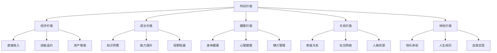
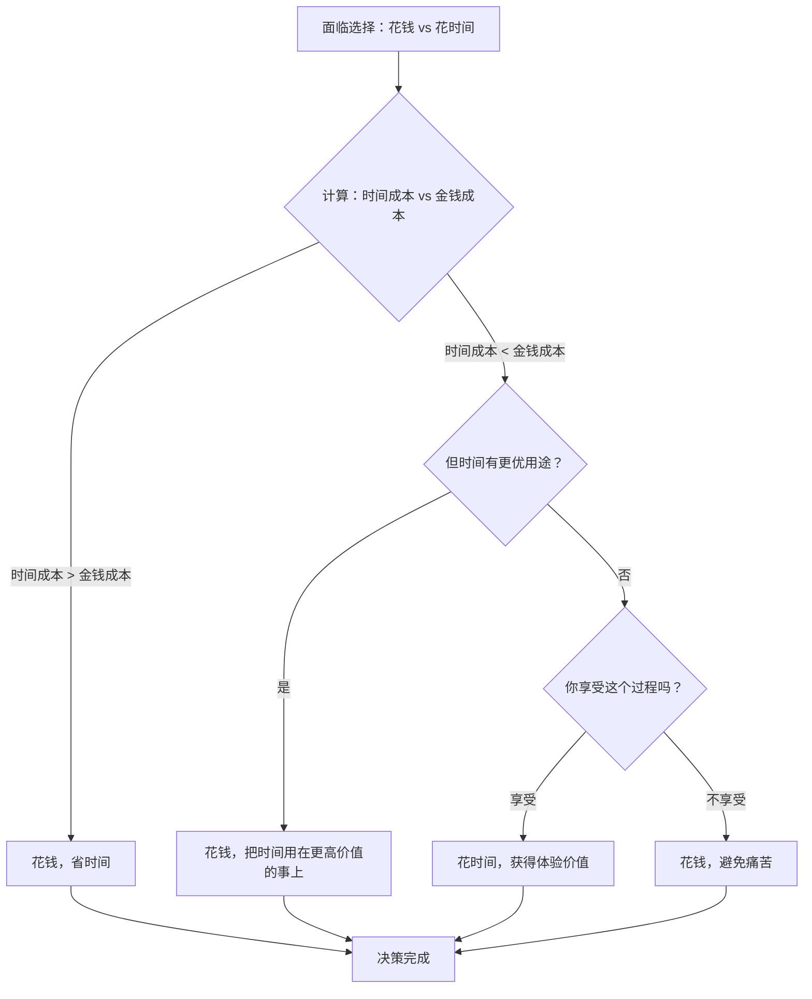
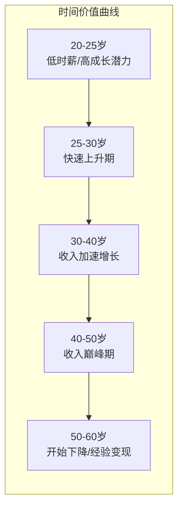

## 六、时间价值理论：你的时间值多少钱？

### 6.1 为什么你需要知道自己的时间值多少钱？

大多数人对自己的银行余额了如指胸，却对另一个更重要的数字一无所知——自己的时间到底值多少钱。

这不是一个哲学问题，而是一个数学问题。当你不知道自己的时间价值时，你会做出大量低质量决策：为了省30块钱坐1小时公交、花3小时比价省了15块、在免费但低效的工具上浪费整个下午。这些决策的共同特征是：你用高价值的时间换取了低价值的回报，而你浑然不觉。

**时间价值理论的核心命题**：每个人的时间都有一个隐含的"市场价"，这个价格决定了你在面临时间与金钱的交换时，应该做出怎样的选择。理解这个价格，是一切个人效率和财务决策的基础。

### 6.2 理论基础：从经济学到个人决策

#### 6.2.1 金融学中的时间价值

在金融学中，"货币的时间价值"（Time Value of Money, TVM）是一个基石概念：今天的一块钱比明天的一块钱更值钱，因为今天的钱可以投资产生收益。其核心公式为：

```text
FV = PV × (1 + r)^n
```

- `FV`：未来价值（Future Value）
- `PV`：现值（Present Value）
- `r`：收益率（Rate of Return）
- `n`：时间期数（Number of Periods）

这个概念反过来看，就是"未来的一块钱在今天值多少钱"——即折现（Discounting）：

```text
PV = FV / (1 + r)^n
```

#### 6.2.2 从货币时间价值到个人时间价值

将这个框架从金融领域迁移到个人时间管理，逻辑是完全一致的：

- 你的时间是一种**稀缺资源**，总量有限（每天24小时，一生约30000天）
- 时间一旦消耗，**无法储蓄、无法投资、无法回收**
- 不同用途的时间产生的**回报率**差异巨大

这意味着，你花在A活动上的1小时，不仅消耗了这1小时本身，还放弃了这1小时本可以用于B活动产生的收益——这就是**机会成本**。

#### 6.2.3 机会成本：看不见的最大成本

机会成本（Opportunity Cost）是经济学中最重要的概念之一，也是理解时间价值的关键。

**定义**：选择某个方案时，放弃的最优替代方案的价值。

举一个直观的例子：

> 小王是一名程序员，税后时薪约120元。周六他有两个选择：
> - 选项A：花4小时打扫房间，省下200元家政费
> - 选项B：花4小时学习一个新技术，可能带来未来的加薪或副业收入
>
> 表面上看，选A省了200元。但真正的成本是：200元（省下的钱） + 480元（4小时×120元时薪的放弃收益）= 680元的机会成本。
>
> 如果请家政花200元，自己用4小时学习，净收益 = 480元（时间价值） - 200元（家政费） = 280元。

这不是说学习一定比打扫房间好，而是说：**当你做选择时，必须考虑被放弃的那个选项的价值。**

### 6.3 如何计算你的时间价值？

#### 6.3.1 方法一：时薪法（最基础）

最直接的方法是用你的收入除以工作时间：

```text
时薪 = 年收入 / 年工作小时数
```

**计算示例**：

| 项目 | 数据 |
|------|------|
| 税后年收入 | 150,000 元 |
| 年工作天数 | 250 天（50周×5天） |
| 日工作小时 | 9 小时（含通勤） |
| 年工作小时 | 2,250 小时 |
| **时薪** | **66.7 元/小时** |

但这个计算有一个重要缺陷：它只计算了"坐在工位上"的时间。如果你把通勤、加班、工作焦虑导致的失眠都算进去，真实的"工作相关时间消耗"可能远超2250小时。

#### 6.3.2 方法二：清醒时间法（更精确）

更合理的计算方式是用你的**可支配清醒时间**作为分母：

```text
时间价值 = 年可支配收入 / 年可支配清醒时间
```

**计算示例**：

| 项目 | 数据 |
|------|------|
| 年税后收入 | 150,000 元 |
| 年固定支出（房租、饮食、交通） | 72,000 元 |
| 年可支配收入 | 78,000 元 |
| 每天清醒时间 | 16 小时 |
| 年清醒时间 | 5,840 小时 |
| 扣除工作+通勤+必要生活时间 | 约3,500 小时 |
| **可支配时间** | **约2,340 小时** |
| **每小时时间价值** | **33.3 元/小时** |

这个数字低于时薪法的66.7元，因为它反映了你**真正可以自由支配**的时间的价值。

#### 6.3.3 方法三：边际时间价值法（最实用）

对于决策而言，最关键的是**边际时间价值**——你额外多出一小时，用来做什么回报最高？

计算方法：

```text
边际时间价值 = 最优替代方案的回报 / 所需时间
```

**不同场景下的边际时间价值**：

| 场景 | 最优替代方案 | 边际时间价值 |
|------|-------------|-------------|
| 工作日晚上 | 接一个兼职项目（2小时赚300元） | 150元/小时 |
| 周末上午 | 学习一门高价值技能（长期回报折算） | 80-200元/小时 |
| 已经疲惫时 | 休息恢复精力（避免生病的机会成本） | 难以量化但极高 |
| 通勤路上 | 听播客学习 vs 刷短视频 | 学习的隐含价值更高 |

**关键洞察**：你的边际时间价值不是一个固定数字，它随着你的时间段、精力状态、可用选项而变化。一个精力充沛的周日上午和一个疲惫不堪的周五晚上，时间价值可能差5倍。

#### 6.3.4 方法四：终身收入折现法（最全面）

从职业生涯全周期来看，你的时间价值等于你一生预期收入的现值除以一生的工作时间：

```text
终身时间价值 = Σ(第t年收入 / (1+r)^t) / 总工作年限
```

**简化计算示例**（假设折现率5%）：

| 职业阶段 | 年龄 | 年均收入 | 工作年限 | 现值（折现后） |
|----------|------|----------|----------|---------------|
| 积累期 | 22-30 | 12万 | 8年 | 约82万 |
| 成长期 | 30-40 | 25万 | 10年 | 约154万 |
| 成熟期 | 40-50 | 40万 | 10年 | 约162万 |
| 巅峰期 | 50-60 | 50万 | 10年 | 约132万 |
| **合计** | | | **38年** | **约530万** |

折现后的终身总收入约530万，除以38年工作年限：

```text
终身时间价值 ≈ 530万 / (38年 × 2000小时/年) ≈ 69.7元/小时
```

这个数字的意义在于：它告诉你，如果你在22岁时浪费一小时，你浪费的不是当时赚的那50块钱，而是你整个职业生涯平均每小时创造的价值——约70块钱。

### 6.4 时间价值的四个关键维度

#### 6.4.1 维度一：时薪不等于时间价值

很多人把"时间价值"简单等同于"时薪"，这是一个严重的认知偏差。

**时薪的局限性**：

- 只衡量了**经济回报**，忽略了健康、关系、成长等非经济价值
- 只衡量了**当前状态**，没有考虑时间投入的长期复利效应
- 只衡量了**外部定价**，没有考虑个人的内在价值判断

**一个更完整的时间价值模型**：



这意味着：花1小时陪家人聊天，时薪是0，但关系价值可能极高；花1小时跑步，直接经济回报为0，但健康价值不可忽视。

#### 6.4.2 维度二：时间有"质量等级"

同样是一小时，质量可以天差地别。理解时间的质量等级，是优化时间配置的前提。

**时间质量金字塔**：

| 等级 | 时间类型 | 特征 | 典型场景 | 价值倍数 |
|------|---------|------|---------|---------|
| S级 | 心流时间 | 高度专注、创造力巅峰 | 深度编程、写作、战略思考 | 基准×5-10 |
| A级 | 高效时间 | 状态良好、注意力集中 | 学习新技能、核心工作任务 | 基准×2-5 |
| B级 | 普通时间 | 状态一般、能完成常规任务 | 回复邮件、例行会议 | 基准×1 |
| C级 | 低效时间 | 疲惫、注意力涣散 | 熬夜加班、刷手机消磨 | 基准×0.3-0.5 |
| D级 | 无效时间 | 完全无法产出 | 通勤堵车、等待排队 | 基准×0.1 |

**关键策略**：将S级和A级时间分配给最重要的事，用金钱"外包"D级和低效C级时间的消耗。

#### 6.4.3 维度三：时间的复利效应

与金钱一样，时间也存在复利效应。今天投入1小时学习的回报，不是线性的，而是指数增长的。

**技能学习的复利模型**：

假设你每天投入1小时学习Python编程：

| 时间节点 | 累计投入 | 能力水平 | 可能的时薪溢价 |
|---------|---------|---------|---------------|
| 第1个月 | 30小时 | 入门基础 | +0元/小时 |
| 第3个月 | 90小时 | 能写简单脚本 | +10元/小时 |
| 第6个月 | 180小时 | 能独立完成项目 | +30元/小时 |
| 第1年 | 365小时 | 中级开发者水平 | +50元/小时 |
| 第2年 | 730小时 | 可接外包项目 | +80元/小时 |
| 第3年 | 1095小时 | 高级水平/可转行 | +120元/小时 |

第1个月的30小时看似回报为零，但它是后续所有增长的基础。如果因为"看不到回报"而放弃，你就损失了整个复利链条。

**这就是为什么20-30岁的时间如此宝贵**：你在这个阶段投入的每一小时，都有30-40年的复利增长空间。同样1小时的学习，25岁投入比45岁投入的价值高出数倍，因为前者有更长的时间让复利发挥作用。

#### 6.4.4 维度四：时间的不可逆性

时间是唯一一种**绝对不可再生**的资源。金钱亏了可以再赚，健康受损可以恢复（一定程度上），但时间流逝就是永远流逝。

这意味着一个重要的推论：**时间决策的容错率比金钱决策低得多。**

| 资源类型 | 可恢复性 | 决策容错率 | 典型纠错成本 |
|---------|---------|-----------|-------------|
| 金钱 | 高（可以再赚） | 高 | 亏损可以弥补 |
| 健康 | 中（部分可恢复） | 中 | 需要时间和金钱 |
| 时间 | 零（绝对不可逆） | 零 | 无法弥补 |
| 机会 | 低（有时会有类似机会） | 低 | 可能永远错过 |

### 6.5 实操框架：基于时间价值做决策

#### 6.5.1 决策矩阵：该花钱还是花时间？

当你面临"花钱还是花时间"的选择时，用以下决策矩阵判断：



**实际案例对照表**：

| 决策场景 | 花时间方案 | 花钱方案 | 建议 |
|---------|-----------|---------|------|
| 做饭 vs 外卖 | 自己做（1小时，成本30元） | 点外卖（0时间，成本50元） | 时薪>20元且不喜欢做饭→外卖 |
| 打扫卫生 | 自己做（2小时） | 请保洁（200元） | 时薪>100元→请保洁 |
| 学Excel函数 | 自己摸索（5小时） | 买课程（199元，2小时学会） | 几乎总是买课更划算 |
| 通勤方式 | 公交（1小时，3元） | 打车（30分钟，40元） | 可用的30分钟价值>37元→打车 |
| 看电影 | 去电影院（往返2小时+票价60元） | 等流媒体上线（0额外时间） | 不急→等上线；社交需要→去影院 |

#### 6.5.2 时间价值审计：你的时间都去哪了？

要优化时间配置，第一步是知道时间花在了哪里。进行一次"时间价值审计"：

**步骤一：记录一周时间使用（精确到30分钟）**

使用时间追踪工具（如 Toggl、时间块、Forest）或简单的表格记录：

| 时间段 | 周一 | 周二 | 周三 | 周四 | 周五 | 周六 | 周日 |
|-------|------|------|------|------|------|------|------|
| 6:00-7:00 | 睡觉 | 睡觉 | 睡觉 | 睡觉 | 睡觉 | 睡觉 | 睡觉 |
| 7:00-8:00 | 通勤 | 通勤 | 通勤 | 通勤 | 通勤 | 睡觉 | 睡觉 |
| 8:00-9:00 | 工作 | 工作 | 工作 | 工作 | 工作 | 刷手机 | 刷手机 |
| ... | ... | ... | ... | ... | ... | ... | ... |

**步骤二：对每类活动标注时间质量等级和价值等级**

| 活动类别 | 周耗时 | 质量等级 | 经济价值 | 成长价值 | 优化建议 |
|---------|--------|---------|---------|---------|---------|
| 核心工作 | 35h | A级 | 高 | 高 | 保持，优化效率 |
| 通勤 | 10h | D级 | 零 | 低 | 听播客/有声书 |
| 刷短视频 | 12h | D级 | 零 | 零 | 大幅削减 |
| 学习新技能 | 3h | S级 | 中 | 极高 | 大幅增加 |
| 运动健身 | 4h | A级 | 低 | 高（健康） | 保持或增加 |
| 社交 | 6h | B级 | 低 | 中 | 优化质量 |

**步骤三：识别优化空间**

- **外包低价值时间**：通勤路上的时间（如果不能减少通勤，至少做有价值的事）
- **消灭黑洞时间**：无意识刷手机、无效会议、拖延导致的加班
- **保护高价值时间**：把最好的时间段留给最重要的事
- **投资成长时间**：每天至少1小时用于学习和技能提升

#### 6.5.3 "时间购买"清单

基于时间价值审计，制定你的"时间购买"清单——这些事情值得花钱外包或简化：

| 类别 | 具体事项 | 预估月成本 | 月省时间 | 等效时薪 | 是否购买 |
|------|---------|-----------|---------|---------|---------|
| 家务 | 保洁服务 | 400元 | 8小时 | 50元 | 时薪>50元则买 |
| 饮食 | 工作日午餐外食 | 300元差价 | 10小时 | 30元 | 几乎总是买 |
| 出行 | 打车代替公交 | 500元 | 15小时 | 33元 | 视情况 |
| 学习 | 付费课程代替自学 | 200元 | 10小时 | 20元 | 几乎总是买 |
| 工具 | 付费软件代替免费替代 | 100元 | 5小时 | 20元 | 几乎总是买 |
| 采购 | 超市代购/网购 | 50元 | 3小时 | 17元 | 视情况 |

### 6.6 20-30岁：时间价值最大化的黄金策略

#### 6.6.1 策略一：用时间换能力，而非用时间换钱

20-30岁最大的陷阱是：用全部时间换取当前的工资收入，而忽略了能力的积累。

**两种时间投资模式对比**：

| 模式 | 时间分配 | 5年后时薪 | 10年后时薪 | 终身收入估算 |
|------|---------|----------|----------|-------------|
| 模式A：纯打工 | 100%时间用于当前工作 | 80元 | 120元 | 约400万 |
| 模式B：能力投资 | 70%工作+30%学习/副业 | 120元 | 250元 | 约800万 |

模式B前期收入可能略低（因为30%时间没有直接变现），但长期回报是模式A的2倍。

**具体做法**：

- 每天至少留出1-2小时用于技能学习（编程、写作、数据分析、英语等高杠杆技能）
- 选择有**累积性**的工作内容——做完一次能持续产生价值的任务（如写教程、建系统、积累客户）
- 避免纯消耗性加班——如果加班只是重复劳动而非能力提升，长期来看是亏本的

#### 6.6.2 策略二：建立"时间价值下限"

给自己设定一个明确的时间价值下限，低于这个价格的时间交换一律不做。

**设定方法**：

```text
时间价值下限 = 当前时薪 × 0.5
```

如果你的时薪是80元，下限就是40元。这意味着：

- ✅ 花2小时比价能省200元（100元/小时 > 40元）→ 值得做
- ❌ 花1小时排队领免费赠品（价值30元，30元/小时 < 40元）→ 不值得
- ✅ 花50元打车省下1小时（50元/小时，且1小时可用于学习）→ 值得
- ❌ 为了省10块钱走路30分钟（20元/小时 < 40元）→ 不值得

**注意**：这个下限不是说"低于这个价格的事绝对不做"，而是一个提醒信号——当你选择做低价值的事时，你清楚地知道自己在做什么取舍。

#### 6.6.3 策略三：识别并消灭"时间黑洞"

"时间黑洞"是指那些不知不觉吞噬大量时间、却几乎没有回报的活动。

**常见时间黑洞**：

| 时间黑洞 | 典型周耗时 | 隐含月成本（按时薪50元） | 替代方案 |
|---------|-----------|----------------------|---------|
| 无意识刷短视频 | 14小时 | 2,800元 | 设定每日上限30分钟 |
| 无效社交应酬 | 6小时 | 1,200元 | 筛选高质量社交 |
| 过度比价购物 | 4小时 | 800元 | 设定时间上限，超时即买 |
| 追看低质量剧集 | 8小时 | 1,600元 | 只看高分作品，设定上限 |
| 沉迷新闻/热搜 | 5小时 | 1,000元 | 固定15分钟看摘要 |
| 完美主义拖延 | 6小时 | 1,200元 | "完成大于完美"原则 |
| **合计** | **43小时** | **8,600元/月** | |

每周43小时的时间黑洞，按50元/小时计算，相当于每月浪费8600元。一年就是10万+。

#### 6.6.4 策略四：打造"时间杠杆"

20-30岁最值得做的投资，是找到能**放大时间价值的杠杆**。

**四类时间杠杆**：

| 杠杆类型 | 原理 | 典型方式 | 杠杆倍数 |
|---------|------|---------|---------|
| 技能杠杆 | 用稀缺技能获取溢价 | 学习编程、数据分析、AI应用 | 2-5倍 |
| 工具杠杆 | 用工具放大产出效率 | 自动化脚本、AI助手、效率工具 | 3-10倍 |
| 内容杠杆 | 一次创作，多次变现 | 写书、做课程、建自媒体 | 10-100倍 |
| 资本杠杆 | 用钱生钱 | 投资理财、入股创业 | 视情况而定 |

**案例：内容杠杆的力量**

一个程序员花100小时写了一本技术电子书：
- 第1年：卖了500本，每本99元，收入49,500元 → 等效时薪495元/小时
- 第2年：持续卖300本，几乎不需要额外时间 → 等效时薪趋近无穷大
- 第3年：内容过时，需要更新20小时，再卖200本 → 等效时薪 200×99/20 = 990元/小时

这就是内容杠杆：一次投入，持续产出。20-30岁是建立这种杠杆的最佳时期。

#### 6.6.5 策略五：学会"花钱买时间"

这是20-30岁最难但最重要的认知转变之一。

很多年轻人因为收入不高，习惯性地用时间换钱。但正确的思路是：**在你能力范围内，尽可能用钱购买高价值时间。**

**购买时间的优先级排序**：

1. **学习类**：付费课程 > 免费自学（节省时间，获得体系化知识）
2. **工具类**：付费软件 > 免费替代品（提高效率，减少折腾）
3. **家务类**：保洁、代购 > 亲力亲为（释放周末时间）
4. **出行类**：打车/租车 > 公交（节省通勤时间）
5. **决策类**：付费咨询 > 自己摸索（避免踩坑，节省试错时间）

**一个心理关口**：很多20-30岁的人觉得"花钱买时间"是奢侈行为。但如果你算清楚账，会发现这往往是最理性的经济决策。花199元买一门课，省下20小时自学时间，把这20小时用于接一个2000元的兼职项目——净收益1801元。

### 6.7 进阶：时间价值的非线性特征

#### 6.7.1 时间价值的幂律分布

在你的人生中，大部分价值是由少数关键时间段创造的。这就是时间价值的幂律分布（Power Law）。

**示例**：一个创业者的10年

| 时间段 | 持续时间 | 创造的价值占比 |
|--------|---------|--------------|
| 找到产品-市场契合的那3个月 | 3个月 | 40% |
| 关键融资的2周 | 2周 | 20% |
| 签下第一个大客户的1天 | 1天 | 15% |
| 其余所有时间 | 9年11个月 | 25% |

这意味着：你需要在"平时"做好充分准备，以确保在关键时刻来临时，你能抓住它。那些看似"没有产出"的积累时间，实际上是在为关键时刻做铺垫。

#### 6.7.2 不同人生阶段的时间价值曲线



**20-30岁的特殊性**：

- **当前时间价值低**：时薪可能只有50-100元
- **未来时间价值高**：积累的技能和经验会在30-50岁产生巨大回报
- **时间成本低**：没有房贷、育儿等刚性支出，试错成本最低
- **时间总量充裕**：精力最旺盛的时期，可投入时间最多

**结论**：20-30岁是"用低价值时间换取高价值资产"的最佳窗口期。这里的"资产"包括技能、人脉、作品、投资本金。

#### 6.7.3 时间价值的"隐性通货膨胀"

有一个容易被忽视的现象：随着年龄增长，你的时间会"隐性涨价"——不是因为你赚得更多了，而是因为你的责任和义务增加了。

| 年龄 | 可支配时间占比 | 隐性时间成本 |
|------|--------------|-------------|
| 22岁单身 | 约60% | 低（只需对自己负责） |
| 28岁恋爱 | 约45% | 中（需要维护关系） |
| 32岁结婚 | 约35% | 中高（家庭责任增加） |
| 35岁有孩子 | 约20% | 极高（育儿占用大量时间） |
| 40岁上有老下有小 | 约15% | 极高（多重责任叠加） |

这意味着：你现在觉得"以后再学"的那些事，以后可能根本没有时间学。20-30岁每浪费的一小时，到了35岁可能需要花3小时才能弥补——如果还能弥补的话。

### 6.8 常见误区与纠正

#### 误区一："我时薪低，所以我的时间不值钱"

**错误逻辑**：因为我每小时只赚50块，所以我的时间只值50块。

**纠正**：你的时间价值不等于你的时薪。时薪只是你时间被雇佣时的价格，不是你时间的真实价值。一个时薪50元的人，如果用下班时间学习一个能让自己时薪翻倍的技能，那他的下班时间价值可能高达200元/小时（未来收益折现）。

#### 误区二："省钱就是赚钱"

**错误逻辑**：花3小时比价省了50块，等于赚了50块。

**纠正**：真正的等式是 `净收益 = 省的钱 - 时间的机会成本`。如果3小时的机会成本是150元，你实际上亏了100元。省钱只有在你的时间机会成本低于省钱效率时才划算。

#### 误区三："免费的才是最好的"

**错误逻辑**：能免费获得的东西，为什么要花钱？

**纠正**：免费的东西往往有隐性成本——时间。免费教程可能零散不成体系，花20小时学到的内容，付费课程2小时就能讲透。"免费"只是一个价格标签，不是成本的全部。

#### 误区四："忙碌等于有价值"

**错误逻辑**：我每天工作12小时，说明我的时间很值钱。

**纠正**：忙碌和有价值是两回事。很多人忙于低价值的重复劳动，而忽略了真正能提升时间价值的事。如果你每天12小时都在做同质化的工作，没有学习和成长，你的时间价值实际上在贬值——因为你的技能在被通货膨胀侵蚀。

#### 误区五："年轻有的是时间"

**错误逻辑**：我才25岁，浪费几年没关系，以后再努力也来得及。

**纠正**：这是最致命的误区。如前所述，25岁投入1小时的复利效应远高于35岁。更重要的是，20-30岁形成的习惯、积累的技能、建立的认知框架，会决定你之后几十年的人生轨迹。这个阶段浪费的时间，不是"以后补回来"这么简单——错过的窗口期可能永远不会再开。

### 6.9 工具推荐

#### 6.9.1 时间追踪工具

| 工具 | 平台 | 特点 | 适用场景 |
|------|------|------|---------|
| Toggl Track | 全平台 | 一键计时，报表丰富 | 项目时间追踪 |
| 时间块 | iOS/Android | 按块规划，可视化 | 日常时间管理 |
| Forest | iOS/Android | 种树模式，防沉迷 | 专注力训练 |
| RescueTime | Windows/Mac | 自动追踪电脑使用 | 发现时间黑洞 |
| aTimeLogger | iOS/Android | 分类记录，统计清晰 | 全面时间审计 |

#### 6.9.2 时间价值计算器

用一个简单的Python脚本来计算你的时间价值：

```python
def calc_time_value(annual_income, work_hours_per_week=45, 
                    work_weeks_per_year=50, free_hours_per_week=30):
    """计算多维度时间价值"""
    # 方法1：时薪法
    annual_work_hours = work_hours_per_week * work_weeks_per_year
    hourly_rate = annual_income / annual_work_hours
    
    # 方法2：清醒时间法
    annual_free_hours = free_hours_per_week * work_weeks_per_year
    free_hour_value = annual_income / annual_free_hours
    
    # 方法3：终身收入折现法（简化）
    # 假设收入年增长8%，折现率5%
    total_pv = 0
    current_income = annual_income
    for year in range(38):  # 22-60岁
        total_pv += current_income / (1.05 ** year)
        current_income *= 1.08
    lifetime_hourly = total_pv / (38 * annual_work_hours)
    
    print(f"=== 你的时间价值分析 ===")
    print(f"时薪法：{hourly_rate:.1f} 元/小时")
    print(f"可支配时间法：{free_hour_value:.1f} 元/小时")
    print(f"终身折现法：{lifetime_hourly:.1f} 元/小时")
    print(f"\n建议设定时间价值下限：{hourly_rate * 0.5:.0f} 元/小时")
    print(f"低于此价格的时间交换应谨慎考虑。")

# 示例：年收入15万
calc_time_value(150000)
```

输出结果：

```text
=== 你的时间价值分析 ===
时薪法：66.7 元/小时
可支配时间法：100.0 元/小时
终身折现法：142.3 元/小时

建议设定时间价值下限：33 元/小时
低于此价格的时间交换应谨慎考虑。
```

### 6.10 本章核心公式速查

| 公式 | 用途 | 表达式 |
|------|------|--------|
| 时薪 | 基础时间价值 | 年收入 / 年工作小时 |
| 可支配时间价值 | 自由时间的经济价值 | 年收入 / 年可支配小时 |
| 机会成本 | 决策时放弃的最优替代价值 | 最优替代方案的回报 |
| 时间购买效率 | 判断是否该花钱省时间 | 省的钱 / 花的时间 → 与时间价值比较 |
| 终身时间价值 | 全周期平均时间价值 | Σ(收入/(1+r)^t) / 总工作年限 |
| 技能投资回报 | 学习新技能的时薪溢价 | 学成后时薪 - 当前时薪 |
| 内容杠杆倍数 | 一次创作多次变现的效率 | 总收入 / 总投入时间 |

### 6.11 总结

时间价值理论不是让你成为一个斤斤计较的人，而是帮你建立一个**理性的决策框架**：

1. **知道自己的时间值多少钱**——这是所有时间决策的基础
2. **区分时间的质量等级**——把最好的时间用在最重要的事上
3. **理解时间的复利效应**——20-30岁的每一小时都有30-40年的增长空间
4. **学会花钱买时间**——在能力范围内，用低价值的金钱换取高价值的时间
5. **消灭时间黑洞**——无意识的时间浪费是最大的隐性亏损
6. **建立时间杠杆**——用技能、工具、内容放大单位时间的产出

记住：你的人生就是你如何使用时间的总和。你花在每件事上的时间，就是你对那件事投的票。当你真正理解了时间的价值，你就不会再轻易浪费它——因为你终于知道，那些被浪费的时间，本来可以变成什么。
