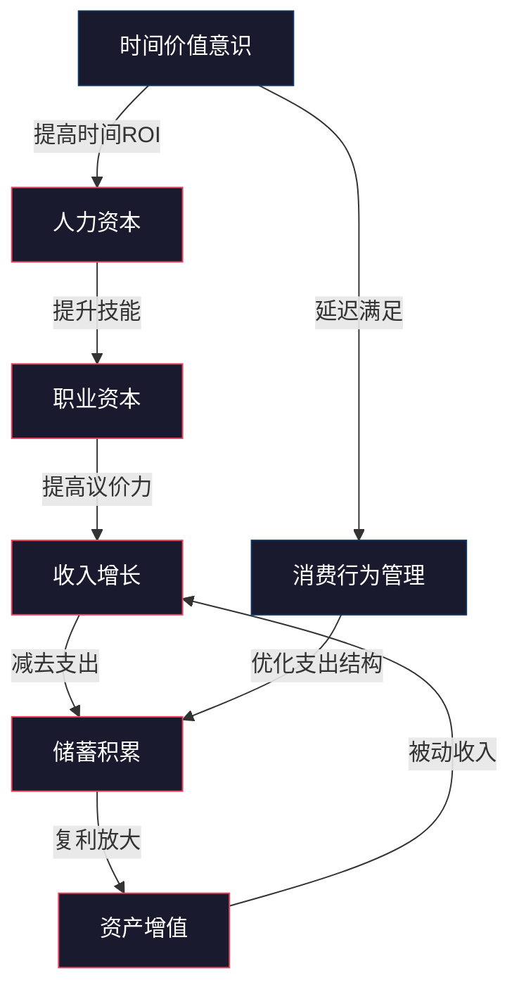
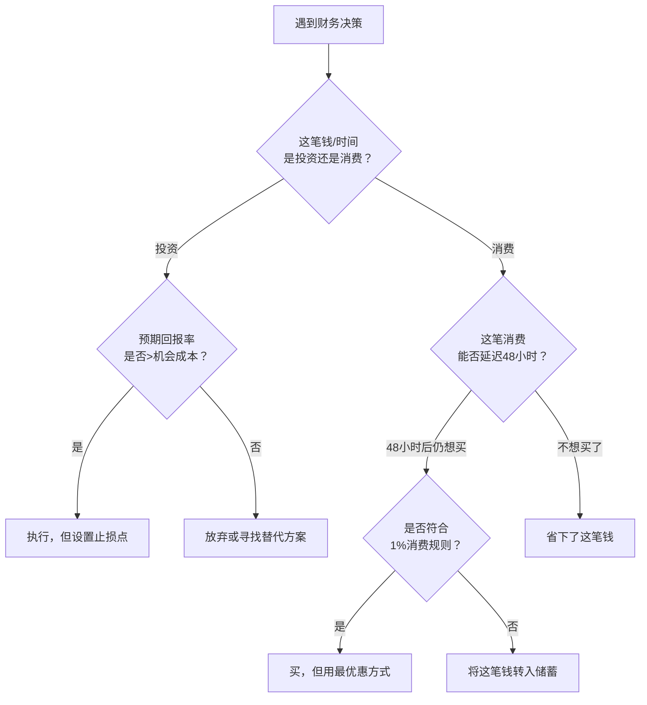

## 七、总结：积累期的科学基础

前六节分别从人力资本、职业发展、复利效应、消费行为、职业资本、时间价值六个维度拆解了20-30岁积累期的理论基础。本节将这些理论串联成一个完整的认知框架——不是简单罗列要点，而是回答一个核心问题：**为什么20-30岁是人生财富积累最关键的十年，以及如何用科学方法论指导这个阶段的每一个决策？**

### 7.1 积累期的底层逻辑：六大理论的统一模型

财富积累不是某个单一行为的结果，而是六个相互耦合的系统协同运作。用一张图来表达它们的关系：



这个模型揭示了一个关键事实：**六大理论不是并列关系，而是因果链条。** 人力资本决定职业资本，职业资本决定收入上限，消费行为决定留存比例，复利决定增长速度，时间价值决定一切的前提——因为所有这些过程都需要时间来发酵。

#### 7.1.1 因果链条的运作机制

**第一环：人力资本 → 职业资本**

人力资本理论告诉我们，20-30岁最大的资产不是存款，而是你自己。你的知识、技能、健康、精力构成了一台"赚钱机器"。但这台机器不是自动运转的——职业发展理论指出，你需要有意识地将通用人力资本（学历、基础能力）转化为专用人力资本（行业经验、稀缺技能），才能在劳动力市场上获得溢价。

具体来说：
- 通用人力资本（可迁移技能）决定了你的就业下限——不会失业
- 专用人力资本（行业深度）决定了你的收入上限——能拿高薪
- 两者的关系：通用是底盘，专用是引擎，缺一不可

**第二环：职业资本 → 收入增长**

收入增长有三条路径：主业加薪、副业开拓、投资收益。但在20-30岁阶段，三者的权重完全不同：

| 路径 | 20-25岁权重 | 25-30岁权重 | 说明 |
|------|------------|------------|------|
| 主业加薪 | 70% | 50% | 前期投入产出比最高 |
| 副业开拓 | 20% | 30% | 中期开始发力 |
| 投资收益 | 10% | 20% | 后期本金积累足够后才有效果 |

很多年轻人犯的错误是：主业还没站稳就去搞副业，或者本金只有几万块就研究量化交易。正确策略是——**先用主业把收入基数做大，再用副业做增量，最后用投资做乘数。**

**第三环：收入 → 储蓄（消费行为管理）**

消费行为理论的核心洞察是：人的消费欲望是生物本能，靠意志力对抗注定失败。有效的支出管理不是"少花钱"，而是"重构消费决策系统"：

- **环境设计**：卸载购物App、取消订阅、不逛商场——减少诱惑暴露
- **规则设计**：工资到账自动转30%到储蓄账户——用自动化替代自控力
- **价值设计**：把消费分为"体验型"和"物质型"——研究表明体验型消费带来的幸福感更持久

**第四环：储蓄 → 资产增值（复利放大）**

复利理论是整个积累期最强大的武器。它的威力不在于收益率高低，而在于时间长度。一笔钱在25岁投入和35岁投入，到60岁时的差距不是10年，而是数倍：

假设年化收益率8%，每月投入2000元：
- 从25岁开始，到60岁积累约 458万元
- 从35岁开始，到60岁积累约 187万元
- **晚10年起步，最终少赚271万元——这10年价值271万**

这就是为什么"时间就是金钱"不是比喻，而是数学事实。

**第五环：时间价值意识 → 全局优化**

时间价值理论是贯穿所有环节的元认知。它要求你用"时薪"思维来审视每一个决策：

- 花3小时比价省了50元 → 时薪16.7元 → 不如用这3小时学一个新技能
- 通勤2小时去便宜的理发店 → 把时间折算成钱，可能并不便宜
- 熬夜加班挣加班费 → 但如果因此生病，医疗成本+误工成本远超加班费

**时间价值意识的本质是：把隐性成本显性化，让每个决策都有机会成本的参照系。**

### 7.2 积累期的关键指标体系

理论要落地，必须量化。以下是20-30岁积累期需要追踪的核心指标：

#### 7.2.1 财务健康指标

| 指标 | 定义 | 20-25岁目标 | 25-30岁目标 | 计算公式 |
|------|------|------------|------------|---------|
| 储蓄率 | 每月储蓄占收入比 | ≥20% | ≥30% | (税后收入-支出)/税后收入 |
| 应急资金覆盖率 | 应急资金可覆盖月数 | 3个月 | 6个月 | 应急资金/月均支出 |
| 负债收入比 | 月还款占收入比 | ≤30% | ≤25% | 月还款额/税后收入 |
| 净资产增长率 | 年度净资产增幅 | ≥15% | ≥20% | (年末-年初净资产)/年初净资产 |
| 投资回报率 | 投资组合年化收益 | 跑赢通胀即可 | ≥8% | (年末市值-年初市值)/年初市值 |

#### 7.2.2 人力资本指标

| 指标 | 定义 | 目标 | 追踪方法 |
|------|------|------|---------|
| 时薪增长率 | 实际时薪年增幅 | ≥10% | 年薪/年工作小时数 |
| 技能溢价 | 相比同岗位平均薪资的溢价 | ≥20% | (你的薪资-岗位中位数)/岗位中位数 |
| 可迁移技能数量 | 可跨行业使用的技能 | ≥5项 | 每半年评估一次 |
| 行业人脉质量 | 能提供有效帮助的联系人 | ≥20人 | 季度复盘 |

#### 7.2.3 时间投资指标

| 指标 | 定义 | 目标 | 说明 |
|------|------|------|------|
| 高价值时间占比 | 用于学习/创造/健康的时间 | ≥30% | 每天至少4小时 |
| 被动收入时间比 | 被动收入对应的等效工作时间占比 | 持续提升 | 反映财务自由进度 |
| 时间浪费率 | 无目的刷手机/闲聊等时间 | ≤15% | 用屏幕时间统计追踪 |

### 7.3 积累期的三个阶段与里程碑

20-30岁不是铁板一块，它分为三个截然不同的子阶段，每个阶段的核心任务和策略重心都不同。

#### 7.3.1 探索期（20-23岁）：找到方向

**核心任务**：确定职业方向，建立基本财务习惯。

这个阶段最大的资产是试错成本低。刚进入职场，薪资不高，但也没有家庭负担，是尝试不同可能性的最佳窗口。

**关键里程碑**：
- 确定1-2个核心职业方向
- 建立记账习惯，了解自己的消费模式
- 存下第一个1万元应急资金
- 开始系统学习投资基础知识
- 月储蓄率达到15%以上

**典型错误**：
- 频繁跳槽但没有方向性——不是所有跳槽都是"探索"，有些只是逃避
- 过度追求薪资而忽视成长空间——起薪差3000元，5年后可能差3万
- 完全不储蓄，等"以后赚多了再存"——习惯比金额更重要

#### 7.3.2 加速期（23-27岁）：快速积累

**核心任务**：在确定的方向上快速提升专业能力，大幅提高收入。

这个阶段是收入增长最快的时期。如果在探索期找到了正确方向，现在应该进入了"能力-收入"的正循环：能力提升 → 承担更重要工作 → 收入增加 → 更多资源投入学习 → 能力进一步提升。

**关键里程碑**：
- 收入达到同龄人前20%
- 储蓄率达到25-30%
- 积累第一个10万净资产
- 开始系统投资（不是炒股，是资产配置）
- 建立个人品牌，行业内有一定知名度
- 副业开始产生可衡量的收入

**典型错误**：
- 收入增长但支出同步膨胀（生活方式通胀）——赚2万花1.8万，比赚1万花8000更危险
- 过早买房——高杠杆锁定现金流，丧失职业灵活性
- 忽视健康——高强度工作但不运动、不体检，30岁后身体会算总账

#### 7.3.3 巩固期（27-30岁）：建立系统

**核心任务**：将前两个阶段的积累固化为可复利增长的系统。

这个阶段的关键转变是：从"靠时间换钱"转向"靠系统赚钱"。无论是投资组合、副业收入、还是个人品牌，都需要从"手动挡"切换到"自动挡"。

**关键里程碑**：
- 净资产达到50-100万（因城市而异）
- 被动收入覆盖基本生活支出的20%以上
- 建立完整的投资组合（股债配比、保险覆盖）
- 核心技能达到行业前10%
- 有明确的3-5年财务规划
- 应急资金覆盖6个月以上支出

**典型错误**：
- 过度自信导致高风险投资——前10年积累可能一次冒进就归零
- 职业倦怠导致停滞——需要引入"第二曲线"而非放弃主线
- 被社会时钟绑架——结婚买房生子的"标准时间表"不适合所有人

### 7.4 积累期的决策框架

理论和指标之外，你需要一个日常决策的思维框架。以下是经过验证的四步决策法：

#### 7.4.1 财务决策四步法



**1%消费规则**：单价超过月收入1%的非必需消费，强制等待48小时并书面回答三个问题——
1. 这件东西我会在一周内用几次？
2. 一年后我会为买了它而高兴还是后悔？
3. 这笔钱如果投入投资，10年后值多少？

#### 7.4.2 时间投资决策矩阵

| | 短期有回报 | 长期有回报 |
|---|---|---|
| **低精力消耗** | 立即做（优化简历、联系猎头） | 规律做（每天阅读30分钟、维护人脉） |
| **高精力消耗** | 集中做（项目冲刺、面试准备） | 持续做（学习新技能、建立副业） |
| **无精力但有诱惑** | 限制做（社交应酬、追热点） | 谨慎做（考证、读MBA——先算ROI） |

### 7.5 积累期的科学基础：跨学科视角

财富积累不只是经济学问题，它涉及多个学科的交叉：

#### 7.5.1 行为经济学视角

丹尼尔·卡尼曼的研究揭示了人类决策的系统性偏差，这些偏差在20-30岁尤为危险：

**现状偏见**：倾向于维持现状，即使改变明显有利。表现为：不愿换工作、不愿调整投资组合、不愿改变消费习惯。对策是每年强制做一次"归零思考"——假设你今天从零开始，还会做同样的选择吗？

**损失厌恶**：损失100元的痛苦是获得100元快乐的2-2.5倍。表现为：死守亏损的投资不卖、不愿接受沉没成本。对策是设立预设止损点，用规则替代情绪。

**双曲贴现**：人倾向于高估当下收益、低估未来收益。表现为：宁愿今天拿500元也不要一年后拿1000元。对策是将长期目标拆解为短期里程碑，让未来的收益"现在就能看到"。

**锚定效应**：被第一个看到的数字影响判断。表现为：看到标价1000元打折到500元觉得很划算，实际上这件东西可能只值300元。对策是做任何消费决策前先独立评估价值，再看价格。

#### 7.5.2 心理学视角

**自我效能理论（班杜拉）**：人对自身能力的信念直接影响行动力。20-30岁建立"我能管好钱"的信念至关重要。方法是从小目标开始——先存1000元，再存1万，逐步建立信心。

**延迟满足（棉花糖实验）**：能够等待更大奖励的人，在财务上通常表现更好。但延迟满足不是压抑欲望，而是"重构选择"——不是"不买"，而是"用更好的方式买"或"先投资自己再消费"。

**心流理论（契克森米哈赖）**：当技能与挑战匹配时，人进入最佳体验状态。在职业发展中，找到心流区意味着你在做既有挑战性又能力所及的工作——这是收入增长最快的甜蜜点。

#### 7.5.3 社会学视角

**社会资本理论（布尔迪厄）**：你的社会网络本身就是一种资本。20-30岁是社交网络建立的黄金期——同学、同事、行业伙伴，这些人脉在30岁以后会以"机会"的形式变现。

**社会比较理论（费斯廷格）**：人天然会与他人比较。社交媒体放大了这种比较效应——看到同龄人晒豪车名包会产生焦虑，进而冲动消费。对策是减少社交媒体暴露，或者主动筛选信息源。

**阶层流动研究**：多项研究表明，20-30岁的职业选择和财务决策对终生产能的影响超过60%。这不是说30岁以后没有机会，而是说30岁以后改变的代价呈指数增长——有家庭负担、有职业惯性、有社会期待。

### 7.6 积累期常见认知陷阱与纠正

| 认知陷阱 | 典型表现 | 底层原因 | 纠正方法 |
|---------|---------|---------|---------|
| "我还年轻，以后再说" | 不储蓄、不投资、不学习 | 时间贴现偏差 | 计算"拖延成本"——每晚一年开始投资，到60岁少赚多少 |
| "钱是赚出来的不是省出来的" | 月入3万花2.8万 | 收入与支出的锚定效应 | 储蓄率=（收入-目标储蓄）后的余额，而非收入-支出后的剩余 |
| "投资就是炒股" | 频繁交易、追涨杀跌 | 把投机当投资 | 学习资产配置理论，用指数基金定投开始 |
| "买不起是因为赚得少" | 不断追求更高收入但永远不够 | 生活方式通胀 | 先定义"足够"，再追求更多 |
| "别人都是这样过的" | 跟风买房买车结婚 | 社会从众压力 | 写下自己的人生优先级，而非照搬社会模板 |
| "等我有钱了再理财" | 月入5000时不理财 | 认为理财需要大本金 | 从每月100元定投开始，建立系统比金额重要 |
| "高风险=高回报" | 把大部分资金投入高波动资产 | 混淆风险和波动 | 理解风险调整后收益，用夏普比率评估投资 |
| "只要努力就能成功" | 用战术勤奋掩盖战略懒惰 | 线性思维 | 定期复盘方向是否正确，方法是否高效 |

### 7.7 积累期的科学工具箱

理论需要工具来执行。以下是20-30岁积累期推荐的工具体系：

#### 7.7.1 记账与预算工具

| 工具 | 适用场景 | 优势 | 劣势 |
|------|---------|------|------|
| 随手记/钱迹 | 日常记账 | 操作简单，支持自动记账 | 分析功能有限 |
| Excel/Google Sheets | 定制化预算 | 完全自定义，灵活性强 | 需要自己搭建模板 |
| YNAB（You Need A Budget） | 零基预算 | 预算理念先进，强制规划 | 学习曲线陡，收费 |
| 银行App自带分析 | 消费概览 | 零成本，自动分类 | 不跨账户 |

**推荐记账模板结构**：

```text
收入项          金额      占比
├── 主业收入    ¥____     ____%
├── 副业收入    ¥____     ____%
├── 投资收益    ¥____     ____%
└── 其他收入    ¥____     ____%
合计：¥____              100%

支出项          金额      占比    优化空间
├── 固定支出    ¥____     ____%
│   ├── 房租    ¥____
│   ├── 水电    ¥____
│   └── 通讯    ¥____
├── 必要弹性    ¥____     ____%
│   ├── 餐饮    ¥____
│   ├── 交通    ¥____
│   └── 日用品  ¥____
└── 非必要      ¥____     ____%
    ├── 娱乐    ¥____
    ├── 外卖    ¥____
    └── 冲动消费 ¥____
合计：¥____              100%

储蓄与投资      金额      占比
├── 应急资金    ¥____     ____%
├── 定投基金    ¥____     ____%
├── 其他投资    ¥____     ____%
└── 目标储蓄    ¥____     ____%
合计：¥____              100%

本月储蓄率：____%
目标储蓄率：30%
差距：____个百分点
```

#### 7.7.2 投资学习资源

| 资源 | 类型 | 难度 | 推荐理由 |
|------|------|------|---------|
| 《小狗钱钱》 | 书籍 | 入门 | 用故事讲理财，零基础友好 |
| 《富爸爸穷爸爸》 | 书籍 | 入门 | 财商启蒙，建立资产vs负债的概念 |
| 《漫步华尔街》 | 书籍 | 进阶 | 理解市场效率假说和指数投资 |
| 《聪明的投资者》 | 书籍 | 高级 | 价值投资圣经，需要一定基础 |
| 《投资最重要的事》 | 书籍 | 高级 | 风险管理和逆向思维 |
| 雪球/且慢 | 平台 | 实操 | 了解投资组合和策略 |
| 中国基金业协会 | 官方 | 参考 | 查询基金信息和监管数据 |

#### 7.7.3 职业发展工具

| 工具 | 用途 | 使用频率 |
|------|------|---------|
| LinkedIn/脉脉 | 职业社交、行业情报 | 每周维护 |
| 招聘网站 | 薪资对标、了解市场 | 每季度调研 |
| 知识星球/行业社群 | 深度信息获取 | 持续参与 |
| GitHub/掘金/知乎 | 技术能力建设 | 日常积累 |
| 职业规划画布 | 方向梳理 | 每半年更新一次 |

### 7.8 积累期的核心公式

将整个积累期浓缩为五个核心公式，方便日常决策参考：

#### 公式一：财富积累方程

```text
净资产 = (收入 - 支出) × 时间 × (1 + 投资回报率)^年数
```

四个变量中：
- **收入**：20-30岁增长空间最大，优先优化
- **支出**：最容易控制，但要防生活方式通胀
- **时间**：不可逆，越早开始越好
- **投资回报率**：长期均值在5-10%，短期波动不重要

#### 公式二：储蓄率的杠杆效应

```text
财务自由年数 ≈ (1 - 储蓄率) / 储蓄率 × 25
```

| 储蓄率 | 达到财务自由所需年数 |
|--------|-------------------|
| 10% | 225年（基本不可能） |
| 20% | 100年 |
| 30% | 58年 |
| 50% | 25年 |
| 70% | 11年 |

这个公式揭示了一个反直觉的事实：**储蓄率从30%提升到50%，财务自由时间从58年缩短到25年——提升20个百分点，减少33年。** 储蓄率的边际效益是递增的。

#### 公式三：时薪的真实价值

```text
真实时薪 = 年收入 / (工作小时 + 通勤小时 + 加班小时 + 应酬小时 + 因工作产生的恢复时间)
```

很多人只看名义薪资，忽略了隐性时间成本。一个月薪1.5万但每天工作12小时、通勤2小时的人，真实时薪可能只有34元——低于很多兼职。

#### 公式四：教育投资的ROI

```text
教育ROI = (培训后年收入 - 培训前年收入) × 持续年数 / 培训总成本(含时间成本)
```

不是所有学习都值得投资。花3万元读一个在职研究生，如果薪资只增加2000元/月，回本需要12.5年——考虑到资金的时间价值，这笔投资可能不划算。

#### 公式五：副业的盈亏平衡

```text
副业时薪 = 副业月收入 / 副业投入小时数
盈亏平衡点 = 你的主业真实时薪
```

如果副业时薪低于主业时薪，你的时间应该投入主业。副业只有在以下情况下才值得做：时薪高于主业、能积累长期资产（如个人品牌）、或者能对冲主业风险（如不同行业收入来源）。

### 7.9 从理论到行动：积累期的21天启动计划

知道理论不等于行动。以下是一个可以直接执行的21天启动计划，每天一个具体动作：

**第1周：建立认知基准**

| 天数 | 行动 | 预计耗时 | 产出 |
|------|------|---------|------|
| Day 1 | 统计过去3个月的所有支出，分类汇总 | 1小时 | 消费结构报告 |
| Day 2 | 计算你的实际时薪（用公式三） | 30分钟 | 真实时薪数据 |
| Day 3 | 列出你所有的资产和负债，计算净资产 | 30分钟 | 资产负债表 |
| Day 4 | 评估当前储蓄率，设定目标储蓄率 | 30分钟 | 储蓄率差距分析 |
| Day 5 | 列出你的核心技能，评估市场价值 | 1小时 | 技能资产评估 |
| Day 6 | 调研同岗位薪资水平（脉脉、招聘网站） | 1小时 | 薪资对标报告 |
| Day 7 | 写一份"财务体检报告"，总结以上数据 | 1小时 | 基准报告 |

**第2周：建立系统**

| 天数 | 行动 | 预计耗时 | 产出 |
|------|------|---------|------|
| Day 8 | 设定自动转账——工资到账日自动转目标储蓄额 | 30分钟 | 自动储蓄系统 |
| Day 9 | 开设投资账户，设置每月定投计划 | 1小时 | 定投计划 |
| Day 10 | 制定月度预算（用零基预算法） | 1小时 | 月度预算表 |
| Day 11 | 清理不必要的订阅和自动扣款 | 30分钟 | 减少的固定支出 |
| Day 12 | 设定职业发展目标——3个月、6个月、1年 | 1小时 | 职业路线图 |
| Day 13 | 选择1个学习资源开始系统学习投资 | 30分钟 | 学习计划 |
| Day 14 | 建立周复盘机制——每周日花30分钟回顾 | 30分钟 | 复盘模板 |

**第3周：加速执行**

| 天数 | 行动 | 预计耗时 | 产出 |
|------|------|---------|------|
| Day 15 | 与直属领导做一次职业发展沟通 | 30分钟 | 发展方向确认 |
| Day 16 | 在行业社群发一篇有价值的内容 | 1小时 | 个人品牌素材 |
| Day 17 | 调研一个可行的副业方向 | 2小时 | 副业可行性报告 |
| Day 18 | 学习并实践一项新技能的入门部分 | 2小时 | 新技能启动 |
| Day 19 | 优化你的简历/LinkedIn资料 | 1小时 | 更新后的简历 |
| Day 20 | 计算你的"财务自由数字"——被动收入≥支出时的资产总额 | 30分钟 | 目标数字 |
| Day 21 | 写一份"未来12个月财务行动计划" | 2小时 | 年度计划 |

### 7.10 本章核心要点回顾

将六节理论基础压缩为以下核心认知：

**人力资本**：你就是自己最大的资产。20-30岁投资自己的回报率远超任何金融资产。每花1元在技能提升上，可能带来10-100元的终身收入增长。

**职业发展**：职业不是线性的，而是阶梯式的。关键是找到正确的赛道（行业×职能×城市），然后在该赛道上快速积累专用资本。选对赛道比在错误赛道上努力重要10倍。

**复利效应**：时间是复利的燃料。每晚一年开始投资，终期财富少7-10%。25岁开始每月投2000元，比35岁开始每月投5000元，最终结果更好。

**消费行为**：管理欲望不是压抑欲望，而是重构决策系统。用自动化、环境设计、规则设计替代意志力。储蓄率是积累期最重要的单一指标。

**职业资本**：通用技能保证下限，专用技能决定上限。在20-30岁建立至少一项"稀缺+有价值+难以替代"的核心能力，就是建立了自己的定价权。

**时间价值**：所有决策的底层逻辑是机会成本。每小时都应投入到回报最高的地方。学会对低价值事务说"不"，就是对高价值人生说"是"。

**最终结论**：20-30岁积累期的科学基础可以用一句话概括——**用人力资本理论决定方向，用职业发展理论选择路径，用消费行为理论控制流量，用复利理论放大效果，用时间价值理论优化决策，用职业资本理论建立壁垒。** 六者缺一不可，协同运作，才能在这个关键十年打下坚实的财务基础。
