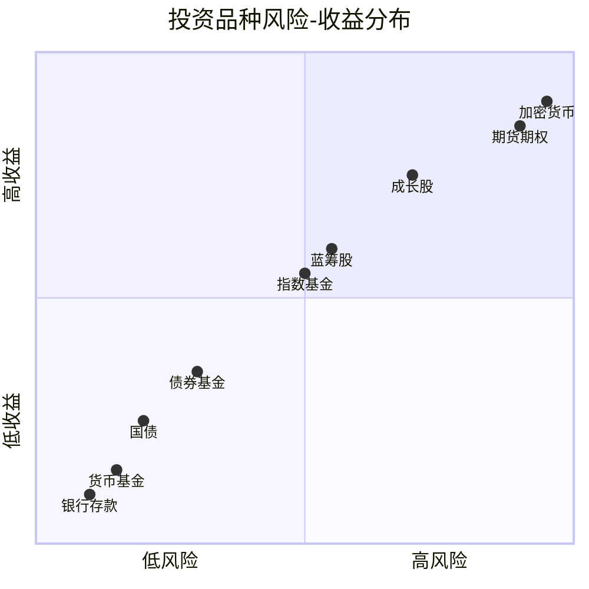
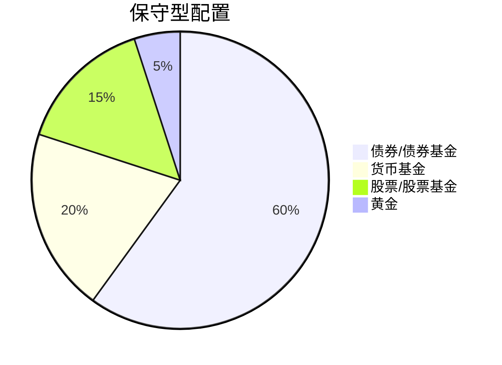
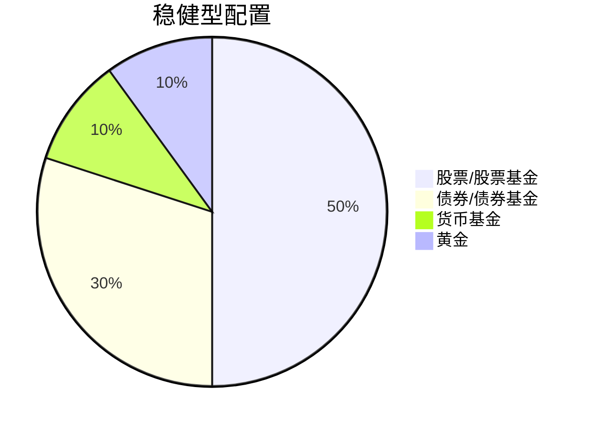
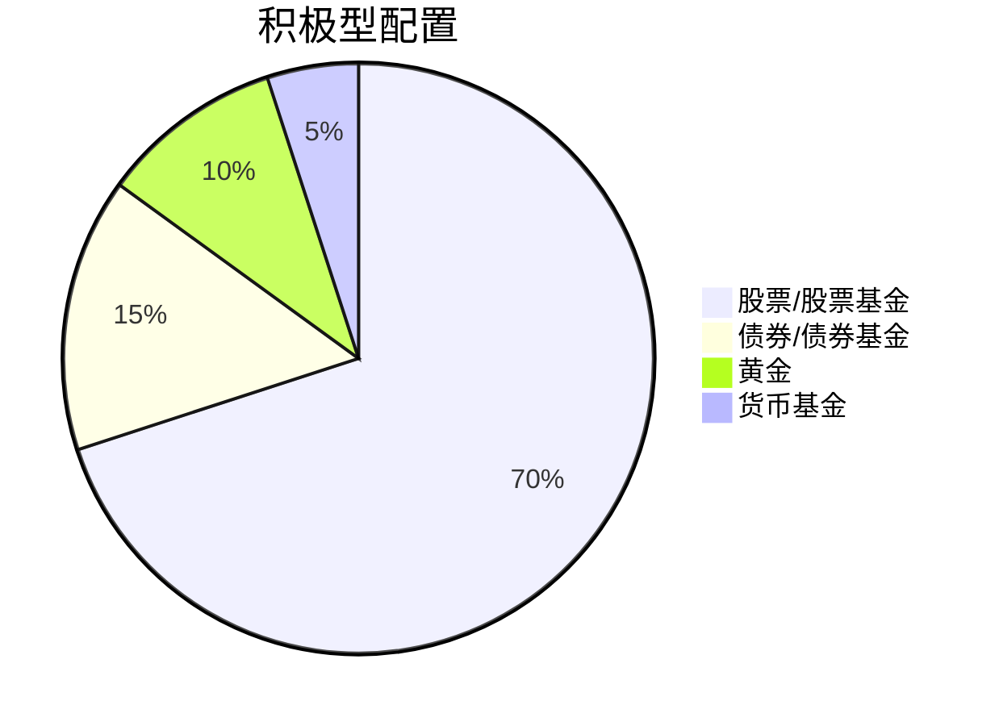
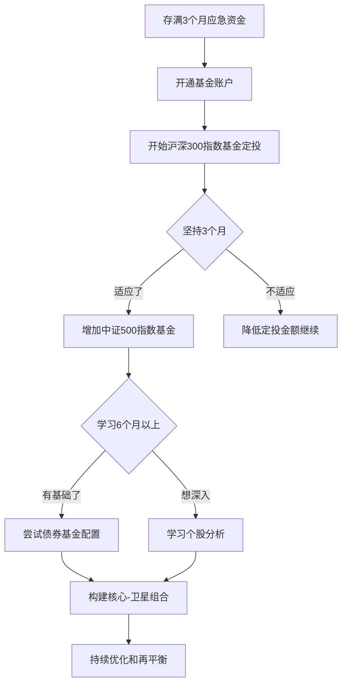
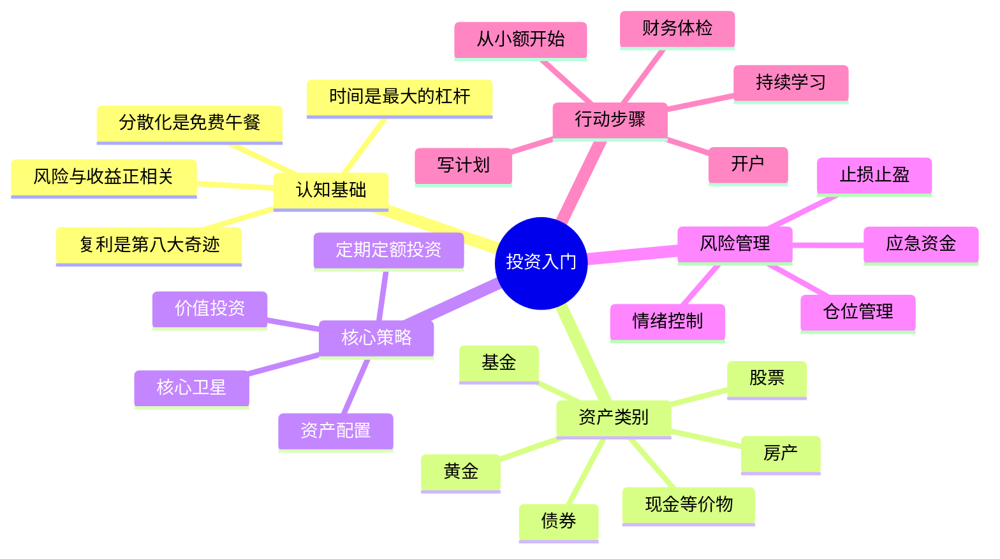

## 八、投资入门理论

投资不是赌博，不是投机，更不是"有钱人的游戏"。投资的本质是**让钱为你工作**——通过将今天的资金配置到能产生回报的资产上，实现财富的跨期增值。对于20-30岁的年轻人来说，理解投资入门理论不仅是理财技能，更是一种思维方式的升级：从"用时间换钱"转向"用钱生钱"。

本章将从底层原理出发，系统讲解投资的核心概念、资产类别、风险收益关系、组合构建方法和常见策略，帮助你建立完整的投资认知框架。

---

### 1. 为什么要投资：不投资的真实代价

很多人觉得"我不投资，钱放着就安全了"。这个想法犯了一个根本性错误：**通货膨胀**。

#### 1.1 通货膨胀的隐形侵蚀

通货膨胀意味着物价持续上涨，货币购买力持续下降。中国近20年的平均通胀率约为2%-3%，而广义通胀（包含房价、教育、医疗等）可能达到5%-7%。

| 年份 | 存款利率（1年定期） | CPI涨幅 | 实际利率 |
|------|---------------------|---------|----------|
| 2020 | 1.50% | 2.50% | -1.00% |
| 2022 | 1.50% | 2.00% | -0.50% |
| 2024 | 1.45% | 0.20% | +1.25% |
| 2025 | 1.10% | 0.50% | +0.60% |

即使在低通胀年份，扣除利息税后，银行存款的实际收益也微乎其微。如果你有10万元存银行，10年后这笔钱的购买力可能只相当于今天的7-8万元。

#### 1.2 复利效应：时间是最大的杠杆

复利被爱因斯坦称为"世界第八大奇迹"。它的核心公式：

$$FV = PV \times (1 + r)^n$$

其中 FV 是终值，PV 是现值，r 是年化收益率，n 是年数。

用具体数字感受复利的威力：

| 初始资金 | 年化收益率 | 10年后 | 20年后 | 30年后 |
|----------|-----------|--------|--------|--------|
| 10万元 | 3%（银行存款） | 13.4万 | 18.1万 | 24.3万 |
| 10万元 | 7%（稳健投资） | 19.7万 | 38.7万 | 76.1万 |
| 10万元 | 10%（积极投资） | 25.9万 | 67.3万 | 174.5万 |

差距惊人：同样是10万元，3%和10%的收益率在30年后相差7倍多。这就是为什么要尽早开始投资——**时间是复利最大的放大器**。

#### 1.3 投资的真正目的

投资不是为了暴富，而是实现三个核心目标：

- **对抗通胀**：确保财富不缩水
- **积累被动收入**：让钱生钱，逐步摆脱"手停口停"
- **实现财务目标**：买房、子女教育、退休养老等大额支出的资金准备

---

### 2. 核心概念：建立投资的底层认知

#### 2.1 风险与收益的关系

投资的第一定律：**风险与收益正相关**。高收益必然伴随高风险，低风险必然对应低收益。任何声称"高收益零风险"的投资都是骗局。

用风险-收益坐标系来理解：



#### 2.2 流动性

流动性指资产变现的速度和成本。活期存款流动性最高（随时取用），房产流动性最低（卖一套房可能需要数月）。

| 资产类别 | 流动性评级 | 变现时间 | 变现成本 |
|----------|-----------|---------|---------|
| 货币基金 | ★★★★★ | T+0到T+1 | 几乎为零 |
| 股票/ETF | ★★★★ | T+1到T+2 | 交易佣金+印花税 |
| 债券基金 | ★★★★ | T+1到T+3 | 赎回费 |
| 银行理财 | ★★★ | 1-3个工作日 | 可能有提前赎回费 |
| 房产 | ★ | 数周到数月 | 中介费+税费+折价 |

#### 2.3 时间价值

同金额的钱，在不同时间点的价值不同。今天的1万元比10年后的1万元更值钱，因为今天的1万元可以投资产生收益。这就是"货币的时间价值"（Time Value of Money, TVM）。

理解TVM的关键意义：**越早开始投资，时间杠杆越大**。25岁开始每月投1000元（年化8%），到60岁约有253万元；如果35岁才开始，同样条件只有约113万元。晚10年起步，最终少了一半以上。

#### 2.4 机会成本

投资一笔钱到A资产，意味着放弃了B资产的潜在收益。选择银行存款的机会成本是放弃了基金可能带来的更高回报；选择高风险股票的机会成本是放弃了债券的稳定性。

**核心思维：做投资决策时，永远问自己"这笔钱如果不投这里，还能投哪里？"**

#### 2.5 分散化

不要把所有鸡蛋放在一个篮子里。分散化（Diversification）是投资中唯一"免费的午餐"——通过持有不完全相关的资产，可以在不降低预期收益的情况下降低整体风险。

分散化的维度：
- **资产类别分散**：股票+债券+现金
- **地域分散**：国内市场+海外市场
- **行业分散**：科技+消费+金融+医药
- **时间分散**：定期定额投资（分批买入）

---

### 3. 主要投资资产类别详解

#### 3.1 现金及现金等价物

**代表品种**：银行活期/定期存款、货币基金（余额宝、零钱通）、短期国债逆回购

**特点**：
- 风险极低，本金基本安全
- 收益率低，通常仅能部分抵消通胀
- 流动性高，随时可取用

**适合场景**：应急资金（3-6个月生活费）、短期闲置资金、等待投资机会的资金停放

**实操建议**：将应急资金放在货币基金中而非银行活期。货币基金收益率通常高于活期存款3-5倍，且流动性接近（T+0赎回通常单日限额1万元）。

#### 3.2 债券

**什么是债券**：债券本质是借条。你借钱给政府（国债）或企业（公司债），对方承诺按期付息、到期还本。

**主要类型**：

| 类型 | 发行方 | 风险等级 | 典型收益率 |
|------|--------|---------|-----------|
| 国债 | 中央政府 | 极低 | 2%-3% |
| 地方债 | 地方政府 | 低 | 2.5%-3.5% |
| 政策性金融债 | 国开行等 | 低 | 2.5%-3.5% |
| 企业债/公司债 | 企业 | 中等 | 3%-6% |
| 可转债 | 上市公司 | 中高 | 不确定（含期权） |

**债券投资方式**：
- **直接购买国债**：通过银行柜台或网银购买储蓄国债，门槛低（100元起）
- **债券基金**：通过基金间接投资债券，由基金经理管理，适合新手
- **债券ETF**：交易所交易的债券基金，费率更低，流动性更好

**债券的核心价值**：在投资组合中起到"压舱石"作用。当股票下跌时，债券通常表现稳定甚至上涨，降低整体组合波动。

#### 3.3 股票

**什么是股票**：股票是公司所有权的凭证。买入一家公司的股票，你就成为这家公司的股东，享有分红权和投票权。

**股票收益的两个来源**：
1. **资本利得**：低买高卖的差价
2. **股息分红**：公司将利润分配给股东

**A股市场基础规则**：
- 交易时间：周一至周五 9:30-11:30、13:00-15:00
- 最小交易单位：1手 = 100股
- T+1交易制度：今天买入，明天才能卖出
- 涨跌幅限制：主板±10%，创业板/科创板±20%，北交所±30%
- 交易费用：佣金（约万分之三）+ 印花税（卖出千分之一）+ 过户费

**股票分析的两大流派**：

**基本面分析**——研究公司本身的价值：
- 财务指标：营收增长率、净利润率、ROE（净资产收益率）、PE（市盈率）、PB（市净率）
- 商业模式：公司靠什么赚钱？护城河在哪里？
- 行业前景：所在行业是朝阳还是夕阳？
- 管理层质量：是否有良好的治理结构和执行力

**技术面分析**——研究价格和交易量的规律：
- K线图、均线系统、MACD、RSI等技术指标
- 支撑位与阻力位
- 趋势判断与买卖时机

**新手建议**：对于入门阶段，不建议直接炒个股。个股研究需要大量时间和专业知识，且个股风险远高于基金。如果确实想参与，建议先用不超过总资金10%的"学费"来实践，并以基本面分析为主。

#### 3.4 基金

基金是投资入门的最佳载体，它解决了个人投资者的三个核心难题：资金量小、专业能力不足、时间精力有限。

**基金的分类**：

| 分类维度 | 类型 | 说明 |
|---------|------|------|
| 按投资标的 | 股票基金 | 80%以上资产投资股票 |
| | 债券基金 | 80%以上资产投资债券 |
| | 混合基金 | 股债混合配置 |
| | 货币基金 | 投资短期货币工具 |
| 按管理方式 | 主动基金 | 基金经理主动选股择时 |
| | 被动基金（指数基金） | 跟踪特定指数，不主动选股 |
| 按交易方式 | 场内基金（ETF/LOF） | 通过证券账户买卖 |
| | 场外基金 | 通过基金公司、银行、第三方平台申购赎回 |
| 按投资范围 | 国内基金 | 投资A股市场 |
| | QDII基金 | 可投资海外市场 |

**重点：指数基金为什么适合新手**

指数基金跟踪特定市场指数（如沪深300、中证500、标普500），具有以下优势：

1. **费率低**：管理费通常0.5%/年，远低于主动基金的1.5%
2. **透明度高**：持仓就是指数成分股，完全公开
3. **不依赖基金经理**：避免了"选人"的难题
4. **长期表现优异**：长期来看，80%以上的主动基金跑不赢指数

**国内主要宽基指数**：

| 指数名称 | 代码 | 覆盖范围 | 代表ETF |
|---------|------|---------|---------|
| 沪深300 | 000300 | A股前300大公司 | 华泰柏瑞沪深300ETF（510300） |
| 中证500 | 000905 | 中等市值500家公司 | 南方中证500ETF（510500） |
| 中证1000 | 000852 | 小市值1000家公司 | 华夏中证1000ETF（562800） |
| 创业板指 | 399006 | 创业板100家代表公司 | 易方达创业板ETF（159915） |
| 科创50 | 000688 | 科创板50家龙头 | 华夏科创50ETF（588000） |

#### 3.5 房产

房产是中国家庭最大的资产类别，也是最复杂的投资品种。

**房产投资的特点**：
- 资金门槛高（首付通常数十万）
- 流动性差（变现周期长）
- 杠杆效应大（房贷是普通人能获得的最大杠杆贷款）
- 与政策高度相关（限购、限贷、利率政策）

**房产投资的核心指标**：
- **租售比**：年租金/房价。国际合理区间为3%-5%，中国一线城市通常在1.5%-2%
- **房价收入比**：房价/家庭年收入。国际警戒线为6，中国一线城市通常在30-50
- **月供收入比**：月供/月收入。建议不超过35%

**20-30岁买房还是投资的决策框架**：

不是所有人都应该在20多岁买房。以下因素需要综合考虑：
- 工作稳定性：是否在同一城市长期发展？
- 所在城市：一线城市的房价收入比远高于二三线城市
- 月供压力：是否会严重影响生活质量和其他投资能力？
- 机会成本：首付和月供的钱如果用于投资，长期回报如何？

#### 3.6 其他资产类别简介

**黄金**：避险资产，长期抗通胀，但不产生现金流。可通过黄金ETF（如华安黄金ETF 518880）投资，建议配置比例5%-10%。

**REITs（不动产投资信托基金）**：不用买房也能收租金。国内公募REITs2021年起步，投资于基础设施项目（高速公路、产业园、仓储物流等），强制分红比例不低于90%可分配利润。

**银行理财产品**：资管新规后，银行理财已打破刚性兑付，不再保本。收益和风险介于存款和基金之间，适合保守型投资者。

---

### 4. 资产配置理论：构建投资组合的科学方法

#### 4.1 现代投资组合理论（MPT）

1952年，马科维茨（Harry Markowitz）提出现代投资组合理论，获得诺贝尔经济学奖。其核心思想是：**通过合理配置不同资产，可以在给定风险水平下最大化收益，或在给定收益水平下最小化风险。**

关键概念：
- **预期收益率**：组合中各资产预期收益的加权平均
- **标准差（波动率）**：衡量组合收益的不确定性
- **相关系数**：不同资产走势的相关程度。相关系数越低，分散化效果越好

#### 4.2 经典资产配置模型

**保守型（风险厌恶者）**：



- 预期年化收益：3%-5%
- 最大回撤：-5%以内
- 适合：临近退休、极度厌恶波动、短期（1-2年内）要用钱

**稳健型（平衡投资者）**：



- 预期年化收益：5%-8%
- 最大回撤：-15%以内
- 适合：有一定风险承受能力、投资期限3-5年

**积极型（成长投资者）**：



- 预期年化收益：8%-12%
- 最大回撤：-25%以内
- 适合：年轻、收入稳定、投资期限5年以上

#### 4.3 生命周期配置法

根据年龄调整风险资产比例，经典公式：

**股票配置比例 = 100 - 年龄**

例如25岁：股票占75%，债券和现金占25%。随着年龄增长，逐步降低股票比例。

这个公式的核心逻辑是：年轻人有更长的投资期限来承受波动和恢复损失，而年纪大的人需要更多稳定性来保护已有资产。

**进阶调整**：考虑中国的实际情况（社保替代率低、独生子女赡养压力），可以将公式调整为：

**股票配置比例 = 90 - 年龄**（更为保守）

#### 4.4 核心-卫星策略

将投资组合分为两部分：

- **核心（60%-80%）**：宽基指数基金，追求市场平均回报，长期持有
- **卫星（20%-40%）**：行业基金、个股、另类投资，追求超额收益，灵活调整

这种策略兼顾了稳定性和进攻性，是被广泛验证的有效方法。

---

### 5. 投资策略：从理论到行动

#### 5.1 定期定额投资（定投）

定投是最适合普通投资者的策略，也是入门阶段最应该掌握的方法。

**什么是定投**：在固定时间（如每月发薪日）投入固定金额到指定的基金中，无论市场涨跌都坚持买入。

**定投的数学原理**：

定投利用"微笑曲线"——在市场下跌时，同样的金额可以买入更多份额；市场上涨时，之前低价买入的份额带来更高收益。自动实现了"低点多买、高点少买"。

| 月份 | 基金净值 | 定投1000元买入份额 | 累计份额 | 累计投入 | 市值 |
|------|---------|-------------------|---------|---------|------|
| 1月 | 1.00 | 1000份 | 1000 | 1000 | 1000 |
| 2月 | 0.80 | 1250份 | 2250 | 2000 | 1800 |
| 3月 | 0.60 | 1667份 | 3917 | 3000 | 2350 |
| 4月 | 0.80 | 1250份 | 5167 | 4000 | 4134 |
| 5月 | 1.00 | 1000份 | 6167 | 5000 | 6167 |
| 6月 | 1.20 | 833份 | 7000 | 6000 | 8400 |

最终结果：投入6000元，市值8400元，收益率40%。如果一次性在1月买入6000元，到6月市值7200元，收益率仅20%。定投在波动市场中的优势显而易见。

**定投的最佳实践**：

1. **选择标的**：优先选择宽基指数基金（沪深300、中证500），波动适中、长期向上
2. **确定金额**：每月收入的10%-30%，不影响日常生活
3. **设定频率**：月定投优于周定投（差异不大，但月定投更方便管理）
4. **坚持时间**：至少3年，理想状态5年以上
5. **止盈不止损**：设定目标收益率（如年化15%-20%），达到后分批止盈；下跌时继续买入甚至加码

**智能定投（进阶）**：

根据市场估值调整定投金额。以沪深300市盈率（PE）为参考：

| PE分位数 | 定投倍数 | 说明 |
|---------|---------|------|
| 0%-20%（极度低估） | 2倍 | 大幅加仓 |
| 20%-40%（低估） | 1.5倍 | 适度加仓 |
| 40%-60%（正常） | 1倍 | 正常定投 |
| 60%-80%（高估） | 0.5倍 | 减少定投 |
| 80%-100%（极度高估） | 0 | 暂停定投，考虑止盈 |

#### 5.2 价值投资

价值投资的核心理念来自本杰明·格雷厄姆和沃伦·巴菲特：**以低于内在价值的价格买入优质资产，长期持有**。

核心原则：
1. **安全边际**：买入价格必须显著低于估算的内在价值，为判断错误留出缓冲
2. **能力圈**：只投资自己能理解的公司和行业
3. **长期持有**：短期市场是投票机，长期是称重机
4. **逆向思维**：别人恐惧时贪婪，别人贪婪时恐惧

**适合新手的价值投资工具**：
- 低PE（市盈率）策略：买入PE低于行业平均的公司
- 低PB（市净率）策略：买入PB低于1的"破净"公司
- 高股息策略：买入稳定分红的蓝筹股

**重要提醒**：价值投资不等于"买便宜货"。低PE可能是公司基本面恶化的信号（价值陷阱），需要结合财务报表综合判断。

#### 5.3 懒人投资组合

对于不想花太多时间研究的投资者，以下几种"一劳永逸"的组合值得参考：

**全天候策略（All Weather）**：

由桥水基金创始人达利欧提出，目标是在任何经济环境下都能获得稳定回报：

- 30% 股票（如沪深300ETF）
- 40% 长期国债
- 15% 中期国债
- 7.5% 黄金
- 7.5% 大宗商品

**简化版二基金组合**：
- 60% 宽基指数基金（如沪深300）
- 40% 债券基金

每年底再平衡一次，将比例恢复到60:40。

---

### 6. 风险管理：保住本金是第一要务

#### 6.1 应急资金

**在开始任何投资之前**，先建立应急资金。金额为3-6个月的生活费，放在货币基金中，不能用于投资。

应急资金的意义：当突发事件（失业、疾病、意外）发生时，你不必被迫在不合适的时机卖出投资资产。

#### 6.2 仓位管理

永远不要满仓。仓位管理的核心原则：

- **初始建仓**：不超过计划总投入的30%
- **分批买入**：剩余资金分3-5次在不同时间点买入
- **单只标的上限**：任何单只股票/基金不超过总投资的20%
- **永远留有现金**：保持10%-20%的现金仓位，用于应对机会和风险

#### 6.3 止损与止盈

**止损**：当投资亏损达到预设比例时果断卖出，防止更大损失。常见止损线：
- 个股：亏损10%-15%止损
- 基金：亏损20%-25%止损（基金波动更大，止损线可以更宽）

**止盈**：当投资收益达到预设目标时分批卖出，锁定利润。常见止盈策略：
- 目标收益率法：累计收益达到30%-50%时分批卖出
- 估值止盈法：当指数PE进入历史高估区间时开始减仓
- 动态止盈法：设定"回撤止盈"，如从最高点回撤10%时卖出

#### 6.4 常见投资风险类型

| 风险类型 | 说明 | 应对方法 |
|---------|------|---------|
| 市场风险 | 整体市场下跌 | 分散配置、长期持有 |
| 信用风险 | 债券发行方违约 | 选择高评级债券、基金分散 |
| 流动性风险 | 无法及时变现 | 保持部分高流动性资产 |
| 通胀风险 | 购买力下降 | 配置抗通胀资产（股票、黄金） |
| 政策风险 | 政策变化影响 | 关注宏观政策、分散行业集中度 |
| 操作风险 | 自己的决策失误 | 建立投资纪律、机械化执行 |

---

### 7. 新手常犯的十大错误及纠正方法

**错误一：没有计划就开始投资**

错误表现：听朋友说某个股票好就买，看到某只基金涨了就追。

纠正方法：先写投资计划书——明确目标、期限、风险承受能力、配置比例，然后严格执行。

**错误二：追涨杀跌**

错误表现：涨了兴奋买入，跌了恐慌卖出，完美实现"高买低卖"。

纠正方法：定投策略天然避免追涨杀跌。如果自己操作，设定买入和卖出规则并机械化执行。

**错误三：把所有钱投入股市**

错误表现：工资一到账全部买入股票或基金，没有应急资金。

纠正方法：先存3-6个月应急资金，再用闲钱投资。投资的钱必须是"亏了不影响生活"的钱。

**错误四：频繁交易**

错误表现：每天看盘，每周调仓，试图抓住每一个波动。

纠正方法：频繁交易增加成本（佣金、印花税、申赎费），且大概率降低收益。将查看账户的频率降到每月一次。

**错误五：只看收益不看风险**

错误表现：选择基金只看过去一年涨了多少，不看最大回撤和波动率。

纠正方法：用夏普比率（Sharpe Ratio）衡量风险调整后收益。夏普比率 = (收益率 - 无风险利率) / 波动率，越高越好。

**错误六：迷信"大V"和内幕消息**

错误表现：跟着财经大V买股票，或者相信某个"内部消息"。

纠正方法：没有人为你的亏损负责。建立自己的分析框架，至少能看懂基本的财务数据。

**错误七：不学习就投入大量资金**

错误表现：对投资一无所知就投入数万元甚至更多。

纠正方法：先用少量资金（如每月500-1000元）实践学习，积累至少6个月经验后再逐步加大投入。

**错误八：忽视费率**

错误表现：不关注基金的管理费、托管费、申赎费率。

纠正方法：同类基金中，长期来看低费率的基金几乎总是跑赢高费率的。选择费率在同类中偏低的产品。

**错误九：不分散投资**

错误表现：只买一只股票，或者只投资一个行业。

纠正方法：至少持有3-5只不同类型的基金，或直接使用宽基指数基金实现自动分散。

**错误十：情绪化决策**

错误表现：市场暴跌时恐慌卖出，市场暴涨时贪婪追高。

纠正方法：认识到情绪是投资最大的敌人。制定计划后机械化执行，必要时关闭账户通知减少干扰。

---

### 8. 投资实操：从零开始的行动指南

#### 8.1 第一步：投资前的准备

1. **财务体检**：列出所有资产和负债，计算净资产
2. **现金流分析**：计算每月收入和支出，确定可用于投资的金额
3. **风险评估**：通过银行或基金平台的风险测评问卷了解自己的风险承受等级
4. **目标设定**：明确投资目标（如5年攒30万首付）和投资期限

#### 8.2 第二步：开立账户

| 账户类型 | 用途 | 开户渠道 |
|---------|------|---------|
| 证券账户 | 买卖股票、ETF、场内基金 | 券商APP（华泰、中信、东方财富等） |
| 基金账户 | 购买场外基金 | 天天基金、蚂蚁财富、蛋卷基金等 |
| 银行账户 | 资金托管、购买国债 | 任意银行 |

**券商选择建议**：佣金费率是核心差异，目前互联网券商佣金可低至万分之一到万分之三，开户时主动协商。

#### 8.3 第三步：制定投资计划模板

```text
投资计划书
==========
一、基本信息
- 年龄：___  月收入：___  月支出：___
- 可投资金额：每月___  一次性投入：___

二、投资目标
- 目标1：___（金额___，期限___年）
- 目标2：___（金额___，期限___年）

三、风险承受能力
- 评估结果：保守型/稳健型/积极型
- 能承受的最大亏损：___%

四、资产配置方案
- 现金及货币基金：___%（应急资金___元）
- 债券基金：___%
- 股票/指数基金：___%
- 其他：___%

五、定投计划
- 定投标的：___
- 定投金额：每月___
- 定投日期：每月___号
- 止盈线：累计收益___%时分批卖出

六、再平衡规则
- 频率：每___个月检查一次
- 偏差阈值：当某类资产偏离目标比例超过___%时调整

七、纪律承诺
- 不频繁查看账户（每月不超过___次）
- 不追涨杀跌
- 严格执行计划，如有调整需书面记录原因
```

#### 8.4 第四步：选择你的第一个投资产品

**纯新手推荐路径**：



**具体产品建议**（仅供参考，不构成投资建议）：

| 类型 | 推荐方向 | 典型产品 |
|------|---------|---------|
| 货币基金 | 余额宝、零钱通 | 任意货币基金 |
| 宽基指数 | 沪深300 | 天弘沪深300ETF联接（000961） |
| 宽基指数 | 中证500 | 天弘中证500ETF联接（000962） |
| 债券基金 | 纯债基金 | 易方达稳健收益债券（110007） |
| 黄金 | 黄金ETF联接 | 华安黄金ETF联接（000216） |

#### 8.5 第五步：持续学习资源

- **入门书籍**：《小狗钱钱》（博多·舍费尔）、《指数基金投资指南》（银行螺丝钉）
- **进阶书籍**：《聪明的投资者》（本杰明·格雷厄姆）、《漫步华尔街》（伯顿·马尔基尔）
- **数据工具**：天天基金网、晨星中国、理杏仁（估值数据）
- **社区学习**：雪球、集思录（可转债）、且慢（策略跟投）

---

### 9. 投资中的心理学：认识自己比认识市场更重要

#### 9.1 常见认知偏差

| 偏差类型 | 表现 | 对策 |
|---------|------|------|
| 锚定效应 | 以买入价作为参考点，不愿割肉 | 不看成本价，只看当前价值和未来预期 |
| 损失厌恶 | 亏损的痛苦是盈利快乐的2倍 | 接受小亏损是投资的正常成本 |
| 确认偏差 | 只关注支持自己观点的信息 | 主动寻找反对意见和反面证据 |
| 从众心理 | 跟风买入热门股票 | 独立思考，逆向操作 |
| 过度自信 | 高估自己的判断能力 | 记录投资决策和结果，定期复盘 |
| 近因偏差 | 过度重视最近的信息 | 拉长时间视角，看5-10年的趋势 |

#### 9.2 建立投资纪律

投资纪律是抵抗情绪干扰的防火墙：

1. **写投资日记**：记录每笔交易的理由和预期，定期回顾
2. **设自动执行**：定投设为自动扣款，减少人为干预
3. **限制查看频率**：每天看盘只会增加焦虑，不会增加收益
4. **找投资伙伴**：和志同道合的人交流，互相监督和提醒
5. **定期复盘**：每季度回顾一次投资计划执行情况，每年做一次全面评估

---

### 10. 不同人生阶段的投资策略参考

| 阶段 | 年龄 | 特点 | 建议配置 | 重点 |
|------|------|------|---------|------|
| 起步期 | 22-25 | 收入低但时间多 | 积极型（80%股+20%债） | 养成定投习惯，重在学习 |
| 积累期 | 25-30 | 收入增长，可投资金额增加 | 积极型（70%股+25%债+5%黄金） | 加大定投金额，开始研究个股 |
| 增长期 | 30-40 | 收入稳定，家庭责任增加 | 稳健型（60%股+30%债+10%其他） | 资产配置多元化，考虑保险 |
| 巩固期 | 40-50 | 收入高峰，风险承受力下降 | 平衡型（50%股+40%债+10%其他） | 逐步降低风险，增加债券比例 |
| 保守期 | 50+ | 临近退休，保本为主 | 保守型（30%股+50%债+20%现金） | 以稳健收益和现金流为核心 |

---

### 11. 总结：投资入门的核心要点



投资是一场马拉松，不是百米冲刺。对于20-30岁的你来说，最重要的不是找到收益最高的投资品种，而是：

1. **尽早开始**——让时间的复利为你工作
2. **持续学习**——投资能力是可以通过学习提升的
3. **坚持纪律**——克服情绪，执行计划
4. **控制风险**——保住本金永远是第一要务
5. **保持耐心**——财富积累需要时间，不要期待一夜暴富

记住：**最好的投资时机是十年前，其次是现在。** 不要等到"准备好了"才开始，因为你永远不会觉得自己完全准备好。从今天开始，从一笔小额定投开始，迈出投资的第一步。
