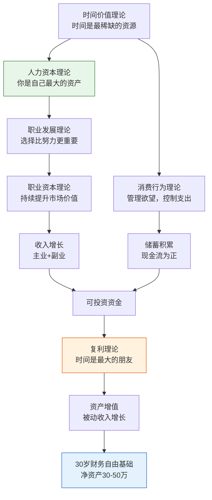
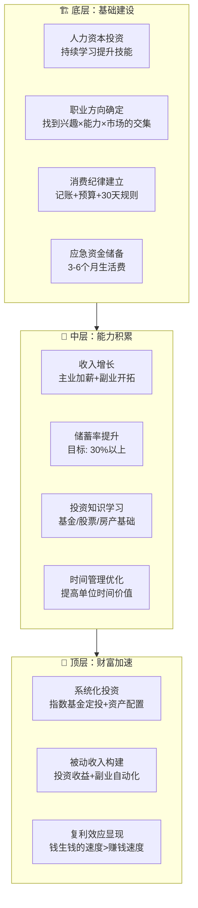

## 九、本节总结：20-30岁积累期理论全景回顾

本节（第一至八章）围绕一个核心命题展开：**20-30岁是人一生中财富积累的黄金窗口期，而大多数人在这个阶段系统性地浪费了它。** 从人力资本到复利效应，从职业发展到消费控制，从时间价值到投资入门，八个理论模块共同构建了一套完整的"积累期行动框架"。

本章将这些理论串联成一个有机整体，帮助你建立全局视角，并提供一套可执行的整合方案。

### 9.1 八大理论的核心逻辑链

八个理论并非孤立存在，它们之间存在清晰的因果递进关系：

**逻辑链条可以简化为一句话：** 提升人力资本 → 选择正确职业方向 → 积累职业资本以获得更高收入 → 控制消费以增加储蓄 → 将储蓄投入复利增长的资产 → 用时间换空间，实现财富的指数级增长。

### 9.2 各理论要点速览

下面用一张表将八大理论的核心要点、关键数据和行动建议浓缩在一起：

| 序号 | 理论名称 | 一句话总结 | 核心公式/法则 | 20-30岁关键行动 |
|------|---------|-----------|-------------|----------------|
| 一 | 人力资本理论 | 你本人就是最大的资产 | 终身收入 = 年薪 × 工作年限 × 增长系数 | 投资自己：教育、技能、健康 |
| 二 | 职业发展理论 | 探索→建立→加速，阶段不可跳过 | 舒伯五阶段 + S曲线 | 25岁前广泛探索，28岁前确定深耕方向 |
| 三 | 复利理论 | 时间让小额投入变成巨额财富 | A = P(1+r)^n，72法则 | 25岁开始定投，每月至少投入收入的20% |
| 四 | 消费行为理论 | 欲望管理是财富积累的前提 | 需要 vs 想要，边际效用递减 | 执行30天规则，区分资产型消费和负债型消费 |
| 五 | 职业资本理论 | 市场价值 = 稀缺性 × 替代成本 | T型能力结构 | 在一个领域成为前20%，再拓展相邻能力 |
| 六 | 时间价值理论 | 时间的机会成本决定了选择的质量 | 时薪 = 月薪 ÷ 工作小时数 | 算出时薪，外包低于时薪的事务 |
| 七 | 投资入门理论 | 让钱为你工作，而不是你为钱工作 | 风险-收益权衡，资产配置 | 先建应急金，再学指数基金定投 |
| 八 | 积累期科学基础 | 以上理论的综合框架 | 收入 - 支出 = 投资本金 | 系统执行，每月复盘 |

### 9.3 从理论到行动：积累期的三层金字塔

将八大理论落地为一个可操作的三层金字塔模型：

**第一层：基础建设（22-25岁）**

这一阶段的核心任务是打地基。你刚进入社会，收入不高，但没有太多负担。这是建立好习惯的最佳窗口期：

- **人力资本投资**：拿出收入的5-10%用于学习。考取行业相关证书、参加专业培训、阅读专业书籍。记住，人力资本的回报率远高于金融资产——一个年薪从8万提升到15万的人，相当于获得了一笔年化87.5%的投资回报。
- **职业探索**：如果还不确定方向，给自己2-3年时间尝试。但要设定明确的探索标准：每次尝试至少持续6个月，每次换方向要有明确的学习目标，而不是逃避困难。
- **消费纪律**：开始记账，搞清楚自己的钱都花在哪里了。目标是区分"需要"和"想要"，砍掉那些边际效用极低的消费。
- **应急资金**：存够3个月基本生活费。这笔钱放在货币基金里，随时可取，利率虽低但流动性是第一位的。

**第二层：能力积累（25-28岁）**

职业方向基本确定后，进入加速积累阶段：

- **收入增长**：这个阶段收入增长应该快于消费增长。目标是每年加薪15-20%（通过升职、跳槽、副业实现）。如果主业增长遇到瓶颈，可以开拓副业——但副业应该围绕你的核心能力展开，而不是去做时薪很低的兼职。
- **储蓄率提升**：随着收入增长，储蓄率应该从10-15%逐步提升到25-30%。关键原则是"先储蓄后消费"——工资到账后自动转入投资账户，剩下的才是可花的钱。
- **投资学习**：系统学习投资基础知识。推荐路径：先读《漫步华尔街》《指数基金投资指南》理解基本原理，再用小金额（每月500-1000元）开始指数基金定投，用真实体验验证理论。
- **时间管理**：算出你的时薪，外包一切低于时薪的事务（如家务、跑腿）。把省下的时间用于高价值活动：学习、社交、副业。

**第三层：财富加速（28-30岁）**

这个阶段复利效应开始初步显现：

- **系统化投资**：建立完整的投资组合。经典的"100法则"（用100减去你的年龄，得到应该投资股票类资产的比例）在20-30岁意味着70-80%配置股票类资产，20-30%配置债券和货币基金。
- **被动收入**：目标是让被动收入占总收入的10-15%。包括投资分红、基金收益、副业自动化收入等。
- **净资产里程碑**：30岁时的净资产目标是30-50万。这个数字看起来不小，但如果你从25岁开始每月投入3000元，按8%年化收益计算，到30岁就是约22万元本金加约5万元收益，再加上副业收入和工资增长带来的额外储蓄，30-50万是完全可以实现的。

### 9.4 理论之间的相互验证

八大理论不是各自独立的建议，它们在很多地方相互印证、相互支撑：

**验证一：人力资本 × 复利理论**

人力资本的提升是一个复利过程。一个持续学习的程序员，第一年可能只会写基础代码，第三年能独立设计系统架构，第五年能带领团队——能力的提升不是线性的，而是指数级的。这与复利公式 A = P(1+r)^n 的曲线完全吻合。P 是你的初始能力，r 是你每天的进步率，n 是时间。

**验证二：职业发展 × 职业资本**

舒伯的S曲线和T型人才理论提供了两个互补的视角。S曲线告诉你"什么时候该做什么"（25岁前探索，28岁前定方向），T型人才理论告诉你"怎么做好"（先深后广，纵向打穿一个领域再横向拓展）。两者结合，就形成了一个完整的职业发展策略。

**验证三：消费行为 × 复利效应**

每一块不该花的钱，都有一个"未来成本"。假设你每月多花1000元在不必要的消费上，按8%年化收益计算，30年后你损失了约150万元。这就是消费控制和复利效应的交叉点——控制消费不仅是为了省钱，更是为了给复利提供更多的"本金"。

**验证四：时间价值 × 人力资本**

时间价值理论的核心公式"时薪 = 月薪 ÷ 工作小时数"直接指向人力资本投资的回报率。假设你目前时薪50元，花2000元参加一个能提升20%工作效率的培训——这个培训的投资回报率是：提升的效率 × 工作小时数 × 时薪 = 20% × 2000小时/年 × 50元 = 20000元/年。2000元投入换来每年20000元回报，年化收益率1000%。

### 9.5 20-30岁积累期的核心指标体系

基于八大理论，建立一套可量化、可追踪的核心指标体系：

#### 9.5.1 收入类指标

| 指标 | 计算方式 | 25岁目标 | 28岁目标 | 30岁目标 |
|------|---------|---------|---------|---------|
| 月总收入 | 主业 + 副业 + 投资 | 8,000-15,000元 | 15,000-25,000元 | 20,000-40,000元 |
| 年收入增长率 | (今年收入 - 去年收入) / 去年收入 | ≥15% | ≥12% | ≥10% |
| 副业收入占比 | 副业收入 / 总收入 | 0-10% | 10-20% | 15-25% |
| 被动收入占比 | 投资收益 / 总收入 | 0-5% | 5-10% | 10-15% |

#### 9.5.2 支出类指标

| 指标 | 计算方式 | 目标值 | 说明 |
|------|---------|--------|------|
| 储蓄率 | (收入 - 支出) / 收入 | ≥30% | 核心指标，越高越好 |
| 必要支出占比 | 房租+餐饮+交通 / 总支出 | ≤60% | 控制基本生活成本 |
| 发展型支出占比 | 学习+社交+健康 / 总支出 | 15-20% | 投资自己的钱不能省 |
| 享乐型支出占比 | 娱乐+购物+奢侈 / 总支出 | ≤15% | 有节制的享受 |

#### 9.5.3 资产类指标

| 指标 | 计算方式 | 25岁目标 | 28岁目标 | 30岁目标 |
|------|---------|---------|---------|---------|
| 净资产 | 总资产 - 总负债 | 5-10万 | 15-25万 | 30-50万 |
| 应急资金 | 可随时变现的资产 | 3个月生活费 | 6个月生活费 | 6个月生活费 |
| 投资资产占比 | 投资资产 / 总资产 | 30-50% | 50-70% | 60-80% |
| 负债率 | 总负债 / 总资产 | ≤30% | ≤20% | ≤15% |

#### 9.5.4 能力类指标

| 指标 | 计算方式 | 目标值 | 说明 |
|------|---------|--------|------|
| 时薪 | 月收入 / 月工作小时数 | 持续增长 | 每年至少提升15% |
| 技能证书数 | 已获得的专业认证 | 2-3个 | 与职业方向相关的证书 |
| 行业排名 | 在同龄人中的相对位置 | 前20% | 通过薪资、职级等间接衡量 |
| 学习投入 | 每月学习时间 | ≥30小时 | 包括阅读、课程、实践 |

### 9.6 常见的系统性错误

基于八大理论，最容易犯的错误不是某一个环节做错了，而是**系统性的认知偏差**导致整个积累过程偏离轨道：

#### 错误一：只关注收入，忽视支出

**表现**：拼命加班赚钱，但月光甚至负债。

**根因**：不理解消费行为理论——欲望是无限的，收入增长永远追不上消费增长。

**纠正方法**：执行"先储蓄后消费"原则。工资到账后，立刻将30%转入一个不能轻易动用的账户（如定期存款或封闭式基金），剩下的才是可花的钱。如果30%太难，从10%开始，每月增加2%。

#### 错误二：只存钱不投资

**表现**：把所有钱放在银行活期或定期存款，年化收益不到2%。

**根因**：不理解复利理论和通货膨胀——2%的存款利率跑不赢3-5%的通胀率，你的钱在"安全地"贬值。

**纠正方法**：从最简单的指数基金定投开始。沪深300指数基金、中证500指数基金，每月定投500-1000元。不需要选股能力，不需要盯盘，只需要坚持。

#### 错误三：盲目追求高收益

**表现**：听消息炒股、追涨杀跌、投资P2P或加密货币。

**根因**：不理解风险-收益权衡——高收益必然伴随高风险，而大多数人没有承受高风险的资本和心态。

**纠正方法**：记住巴菲特的两条投资法则——第一条：永远不要亏钱；第二条：永远不要忘记第一条。在20-30岁阶段，本金有限，亏掉10万可能需要一两年才能赚回来，但复利损失的时间是永远追不回来的。

#### 错误四：没有应急资金就投资

**表现**：把所有钱投入股市/基金，遇到突发需要用钱时被迫割肉。

**根因**：不理解流动性管理——投资的钱应该是"3-5年内不需要用的钱"。

**纠正方法**：在开始投资之前，先存够3-6个月生活费的应急资金。这笔钱放在货币基金（如余额宝、零钱通）里，随时可取，年化收益2-3%。

#### 错误五：忽视人力资本投资

**表现**：工作后停止学习，技能停滞不前，收入增长缓慢。

**根因**：不理解人力资本理论——你最大的资产不是银行存款，而是你的赚钱能力。20-30岁的人力资本投资回报率远高于金融投资。

**纠正方法**：每月至少投入收入的5-10%用于学习。优先投资于能直接提升工作能力的技能（编程、数据分析、项目管理），其次投资于通用能力（沟通、写作、英语）。

#### 错误六：用时间换钱而不是用钱换时间

**表现**：花大量时间做低价值的事（如比价2小时省10块钱），却不愿意花钱提高效率。

**根因**：不理解时间价值理论——如果你的时薪是100元，花2小时比价就相当于花了200元的时间成本，而你只省了10块钱。

**纠正方法**：算出你的时薪，然后做一个简单的决策——如果一件事的时间成本高于直接花钱解决的成本，就花钱解决。典型的例子：通勤时间过长（时薪损失 > 租房差价）、自己做饭2小时（时薪损失 > 外卖差价）、花3天自学一个2小时就能学会的工具（时间损失 > 付费课程费用）。

### 9.7 个性化路径：不同起点的行动方案

不同的人起点不同，需要的策略也不同。下面是三种典型场景的个性化建议：

#### 场景A：刚毕业，月薪5000-8000元

**核心挑战**：收入低，储蓄空间有限，容易陷入"反正也存不了多少钱"的消极心态。

**行动方案**：

1. **支出管控**（第1个月）：开始记账，明确每月必要支出（房租、餐饮、交通）的底线，将支出控制在收入的80%以内
2. **应急资金**（第1-6个月）：每月存500-1000元到货币基金，目标积累3个月生活费（约10000-15000元）
3. **人力资本投资**（持续）：每天抽出1小时学习与工作相关的技能，优先学习能直接影响加薪的能力
4. **小额定投**（第7个月起）：应急金存够后，每月定投300-500元到沪深300指数基金
5. **收入增长**（第12个月起）：评估是否应该跳槽或发展副业，目标年收入增长20%以上

**12个月后的预期成果**：应急金10000-15000元，投资本金2000-3000元，掌握1-2项新技能。

#### 场景B：工作2-3年，月薪10000-15000元

**核心挑战**：收入有了起色，但消费也在升级（消费升级陷阱），储蓄率不升反降。

**行动方案**：

1. **消费审计**（第1周）：统计过去3个月的所有支出，找出"不知道花在哪里的钱"，目标砍掉20%的非必要支出
2. **储蓄率目标**（第1个月起）：将储蓄率从当前水平提升到25-30%。具体方法：工资到账自动转出，剩余才是可花的钱
3. **投资系统化**（第1个月起）：建立定投计划——沪深300指数基金1000元/月，中证500指数基金500元/月，货币基金保持6个月应急金
4. **职业深耕**（持续）：选定一个方向成为领域内的前20%。方法：在公司内部争取更有挑战性的项目，同时在行业社群建立个人品牌
5. **副业探索**（第6个月起）：利用专业技能开展副业（如技术写作、咨询、培训），目标副业收入占总收入的10-15%

**12个月后的预期成果**：投资本金增加20000-30000元，储蓄率稳定在25%以上，副业收入每月1000-2000元。

#### 场景C：工作5年以上，月薪20000元以上

**核心挑战**：收入不错但可能遇到瓶颈，需要从"为钱工作"转向"让钱为你工作"。

**行动方案**：

1. **资产配置优化**（第1个月）：建立完整的投资组合——60%股票型基金（指数基金为主）+ 20%债券基金 + 10%货币基金 + 10%其他（如REITs）
2. **被动收入目标**（第3个月起）：设定被动收入占总收入15-20%的目标。通过股息再投资、基金分红等方式逐步增加
3. **时间价值最大化**（持续）：外包所有低于时薪的事务（家务、跑腿、数据整理），把时间用于高价值活动
4. **人脉复利**（持续）：系统性维护行业人脉，参加行业活动，建立个人品牌。人脉的价值是指数级增长的
5. **财务自由预估**（第6个月）：计算达到财务自由需要的资产规模（年支出 × 25），制定具体的达成计划

**12个月后的预期成果**：投资组合规模50-100万，被动收入占总收入10%以上，明确的财务自由路径。

### 9.8 理论应用的注意事项

#### 注意一：理论是地图，不是领土

八大理论提供的是思考框架，不是精确的行动指南。你的情况可能和理论描述的"标准情况"不同——收入可能更低或更高，行业可能增长更快或更慢，个人偏好可能更保守或更激进。重要的是理解理论背后的逻辑，然后根据自己的实际情况调整。

#### 注意二：复利需要时间，不要急于求成

复利效应在前几年几乎不可见。一个每月定投3000元的人，第一年末只有约3.7万元（含约1500元收益），看起来和"不投资也差不多"。但坚持10年，本金36万元会变成约55万元（按8%年化），坚持20年会变成约176万元。**复利最大的敌人是放弃——在效应显现之前就停止了。**

#### 注意三：收入增长比省钱更重要

消费行为理论教你省钱，但不要走极端。在20-30岁阶段，投资人力资本、提升收入能力的回报远高于省吃俭用。一个月薪5000元的人即使储蓄率50%，一年也只能存3万元；一个月薪15000元的人储蓄率30%，一年能存5.4万元。**在积累期，提升收入永远是第一优先级。**

#### 注意四：不要和别人比

每个人的起点、机遇、风险承受能力都不同。看到同龄人炒股赚了大钱，不代表你也应该去炒股；看到别人月入10万，不代表你的策略就是错的。唯一应该比较的对象是昨天的自己——你的储蓄率是否在提升？你的投资知识是否在增长？你的职业技能是否在进步？

#### 注意五：接受不确定性

理论模型都是简化的，现实世界充满了不确定性。行业可能会衰退，公司可能会裁员，市场可能会暴跌。这些都不可怕——可怕的是你没有为此做好准备。应急资金、多元化投资、持续学习新技能，这些就是你应对不确定性的安全垫。

### 9.9 本节总结的一句话版本

如果要用一句话概括这八章的全部内容，那就是：

> **在20-30岁这个阶段，你最大的任务是：用尽可能高的储蓄率，把钱投到尽可能好的资产上，然后用尽可能长的时间等待复利发挥作用。而实现这一切的前提是：持续投资自己，提升赚钱能力。**

具体来说：

- **人力资本理论**告诉你：你最大的资产是你自己
- **职业发展理论**告诉你：选对方向比埋头苦干更重要
- **复利理论**告诉你：时间是最重要的变量，越早开始越好
- **消费行为理论**告诉你：控制欲望是积累的前提
- **职业资本理论**告诉你：稀缺性决定了你的市场价值
- **时间价值理论**告诉你：时间是最稀缺的资源，要高效使用
- **投资入门理论**告诉你：让钱为你工作，而不是为钱工作
- **积累期科学基础**告诉你：以上所有理论是一个有机整体

理解了这些理论，你已经比90%的同龄人有了更清晰的财富认知框架。接下来要做的，就是**行动**——从今天开始，从记账开始，从第一笔定投开始。

### 9.10 下一步：进入实战

理论学习到此为止。接下来的章节将进入实操层面，包括：

- **心理建设与成长思维**（第十章）：解决"知道但做不到"的问题
- **时间管理**（第十一章）：解决"没有时间执行"的问题
- **具体投资策略**：从指数基金定投到资产配置的完整教程
- **副业开发指南**：如何围绕核心能力构建第二收入来源
- **职业发展实战**：跳槽、谈判、升职的具体方法

记住：**理论的价值在于指导实践。如果学了理论不行动，和没学是一样的。** 从今天开始，选择上面任何一个行动方案，迈出第一步。
