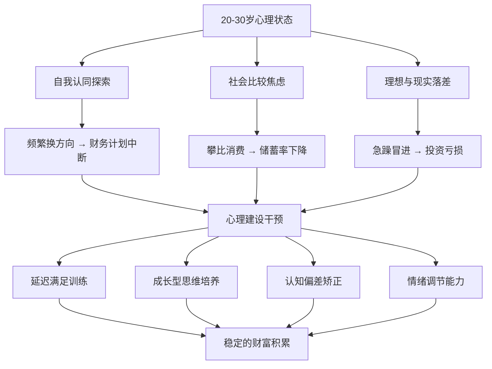
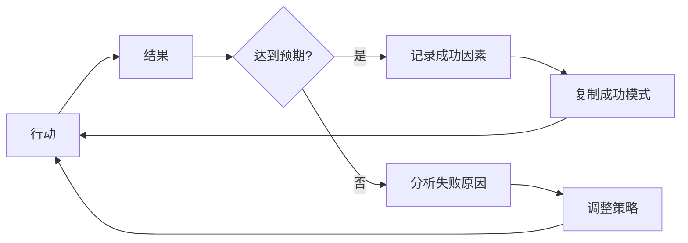

## 十、20-30岁的心理建设与成长思维

### 10.1 为什么心理建设是财富积累的底层操作系统

很多人把"搞钱"理解为一个纯粹的技术问题——学投资、找副业、谈加薪。但现实中，一个人能否在20-30岁完成财富积累，**心理层面的准备程度往往比技术知识更具有决定性作用**。

哈佛商学院的一项追踪研究发现：同样接受过理财教育的两个人群，最终的财富差异只有30%可以用收入水平解释，其余70%的差异来自心理特质——包括延迟满足能力、风险容忍度、对失败的反应模式、以及面对不确定性的决策方式。

用一个比喻来说：如果理财知识是"软件"，那么心理建设就是"操作系统"。再好的软件，跑在一个有bug的操作系统上，也会频繁崩溃。

#### 20-30岁心理发展的特殊性

发展心理学家埃里克·埃里克森（Erik Erikson）的人格发展八阶段理论指出，20-30岁处于"亲密对孤独"（Intimacy vs. Isolation）阶段，核心任务是建立深层的人际关系和自我认同。这个阶段的心理特征包括：

| 特征维度 | 表现 | 对财富积累的影响 |
|---------|------|----------------|
| 自我认同尚未稳固 | 频繁更换方向，容易被外界影响 | 难以坚持长期财务计划 |
| 社会比较最强烈 | 与同龄人攀比消费、收入 | 冲动消费、超前消费 |
| 风险偏好两极化 | 要么极度保守，要么盲目冒险 | 要么错过机会，要么遭受重大损失 |
| 情绪波动较大 | 焦虑、迷茫、自我怀疑交替出现 | 决策质量不稳定 |
| 理想主义与现实碰撞 | 对现实的不满和对未来的焦虑并存 | 容易产生"要么全有要么全无"的心态 |

理解这些特征不是给自己找借口，而是**有意识地识别这些心理模式，然后用具体的方法去修正它们**。



---

### 10.2 从学生思维到职场思维的转变

20-30岁心理建设的第一关，是从"学生思维"切换到"职场思维"。这不是一句口号，而是一系列具体的认知模式重组。

#### 10.2.1 六个维度的思维转型

| 维度 | 学生思维 | 职场思维 | 转型方法 |
|------|---------|---------|---------|
| 评价标准 | 分数、成绩、GPA | 创造的价值、可量化的结果 | 每周记录"我为团队/公司解决了什么问题" |
| 学习方式 | 被动接受教材内容 | 主动寻找能解决问题的知识 | 建立"问题驱动"的学习习惯 |
| 时间观念 | 按学期、按课表计划 | 按项目里程碑、按目标倒推 | 学习项目管理的基本框架 |
| 失败态度 | 失败=不及格=耻辱 | 失败=数据点=迭代依据 | 建立"失败日志"，记录每次失败的收获 |
| 人际关系 | 同学关系（平等、随意） | 人脉关系（互利、经营） | 学习基本的职场社交礼仪 |
| 收入观念 | 父母给钱/奖学金 | 用能力交换市场报酬 | 理解"收入=你解决问题的能力×问题的规模" |

#### 10.2.2 四个关键认知转换

**转换一：从"我学了什么"到"我能做什么"**

企业雇佣你不是因为你的学历，而是因为你能解决问题。一个持有计算机学位但写不了可用代码的人，在就业市场上不如一个自学成才但能交付项目的开发者。

**实操方法：** 每学一个新技能，立刻找一个真实项目去应用。学了Python？去做一个自动化脚本帮同事省时间。学了数据分析？去分析一个公开数据集并写成报告。**能力的证明不在于你"学过"，而在于你"做过"。**

**转换二：从"等待安排"到"主动发现"**

学生时代，课程表告诉你该做什么。职场中，没有人会把所有任务都安排好。最优秀的20%员工，是那些能主动发现问题、主动提出解决方案的人。

**实操方法：** 每天花10分钟思考三个问题：
1. 我的团队/部门目前面临的最大问题是什么？
2. 这个问题中，有哪些是我有能力参与解决的？
3. 我可以提出什么具体的建议？

**转换三：从"完美主义"到"完成主义"**

学生时代追求100分是合理的——考试有标准答案。但在职场中，追求100分往往意味着错过窗口期。一个80分的产品按时上线，远胜于一个100分的产品延迟三个月。

Facebook早期的内部格言"Done is better than perfect"（完成胜过完美）就是这个意思。这不意味着降低标准，而是**在速度和质量之间找到最优平衡点**。

**转换四：从"单打独斗"到"团队杠杆"**

学生时代，考试成绩取决于你个人的掌握程度。职场中，几乎所有有价值的工作都需要团队协作。一个能带动团队产出的人，其价值远超一个独狼式的天才。

**实操方法：** 主动在项目中承担协调角色，练习"把功劳归于团队，把责任留给自己"——这是职场中建立信任最快的方式。

---

### 10.3 延迟满足能力的培养

#### 10.3.1 为什么延迟满足是财富积累的第一心理能力

1968年，心理学家沃尔特·米歇尔（Walter Mischel）在斯坦福大学进行了著名的"棉花糖实验"：给4-5岁的孩子一颗棉花糖，告诉他们如果能等15分钟不吃，就能得到两颗。追踪研究发现，那些能等待的孩子在十几年后的SAT成绩平均高出210分，收入水平更高，肥胖率更低。

延迟满足的核心不是"压抑欲望"，而是**建立一个"当下选择"与"未来收益"之间的清晰连接**。当你能清晰地看到"现在不花这5000元"→"10年后变成10795元"这条因果链时，克制就不再是痛苦的忍耐，而是一个理性的选择。

#### 10.3.2 四种延迟满足的训练方法

**方法一：30天冷静期规则**

当你想买一件非必需品（价格超过月收入的5%）时，强制自己等待30天。

具体操作：
1. 看到想买的东西，先把它加入购物车或收藏夹
2. 在手机日历上设置30天后的提醒
3. 记录下此刻你"想要它"的理由
4. 30天后重新评估：你还想要吗？理由变了吗？

数据显示，大约70%的冲动消费欲望会在30天内消退。这个方法的原理是利用"时间折扣"效应——人类大脑天生倾向于低估未来收益、高估即时满足，而30天的间隔足以让理性思维重新接管。

**方法二：未来价值计算法**

把每一笔非必要支出换算成它在未来的投资价值。计算公式：

```text
未来价值 = 当前金额 × (1 + 年化收益率)^年数
```

举例：
| 当前消费 | 10年后价值（年化8%） | 20年后价值 | 30年后价值 |
|---------|---------------------|-----------|-----------|
| 一杯30元奶茶 | 65元 | 140元 | 301元 |
| 一部5000元手机 | 10,795元 | 23,305元 | 50,313元 |
| 一次20,000元旅行 | 43,178元 | 93,219元 | 201,253元 |
| 一辆200,000元的车 | 431,785元 | 932,191元 | 2,012,531元 |

这不意味着你不该花钱——而是**在做消费决策时，把"机会成本"纳入考量**。当你看到一部手机的真实成本是10年后的一万多元，你可能会选择一个性价比更高的型号。

**方法三：目标可视化系统**

把你的财务目标具象化：
1. **写一张"未来支票"**：在一张纸上写"2036年6月25日，支付给[你的名字]，人民币1,000,000元"，签名，贴在每天能看到的地方
2. **制作进度仪表盘**：用Excel或Notion做一个简单的进度条，显示你当前的净资产占目标的百分比
3. **建立"愿望清单"系统**：把想买的东西分为"现在需要"、"3个月后想要"、"1年后想要"三档，只有第一档可以直接购买

**方法四：阶梯式奖励机制**

延迟满足不等于苦行僧式的生活。关键是建立"达成目标→获得奖励"的正向循环：

| 目标 | 奖励 | 预算上限 |
|------|------|---------|
| 连续3个月储蓄率达到30% | 一顿好的晚餐 | 200元 |
| 净资产达到10万 | 一次短途旅行 | 1000元 |
| 净资产达到30万 | 一件心仪已久的物品 | 3000元 |
| 净资产达到100万 | 一次长途旅行 | 10000元 |

奖励金额控制在该阶段净资产的1%以内——既满足了即时享受的需求，又不会实质性地影响积累进度。

---

### 10.4 成长型思维的建立

#### 10.4.1 什么是成长型思维

斯坦福大学心理学教授卡罗尔·德韦克（Carol Dweck）在其著作《终身成长》中提出了两种思维模式：

- **固定型思维**（Fixed Mindset）：认为能力是天生的、固定的。失败证明了"我不行"，挑战意味着暴露弱点。
- **成长型思维**（Growth Mindset）：认为能力是可以通过努力和学习发展的。失败是学习的过程，挑战是成长的机会。

这不是鸡汤。德韦克的多项实验表明，仅仅通过改变一个人对"能力是否可变"的信念，就能显著改变其学习成就、抗压能力和长期表现。

#### 10.4.2 五种典型场景下的思维对比

| 场景 | 固定型思维的反应 | 成长型思维的反应 | 实际行动建议 |
|------|----------------|----------------|-------------|
| 遇到困难 | "我不适合做这个" | "我还没掌握方法" | 拆解困难为子问题，逐个击破 |
| 看到别人成功 | "他运气好/有背景" | "他做了什么我可以学习的？" | 分析对方的具体行为和策略 |
| 收到批评 | "他在针对我/不理解我" | "这个反馈里有什么有价值的信息？" | 提取可操作的改进点，忽略情绪攻击 |
| 面对失败 | "我就是不行" | "这次我获得了什么数据？" | 建立失败复盘模板，记录教训 |
| 面对新挑战 | "太难了，风险太大" | "这是一个拓展能力边界的机会" | 评估最坏情况，如果可以承受就去做 |

#### 10.4.3 培养成长型思维的实操步骤

**步骤一：语言重构训练**

语言不仅表达思维，还会反过来塑造思维。把每天的固定型语言替换为成长型语言：

| 固定型语言 | 成长型语言 |
|-----------|-----------|
| "我做不到" | "我还没学会，但我可以学" |
| "这太难了" | "这需要更多时间和练习" |
| "我失败了" | "我找到了一种行不通的方法" |
| "他比我聪明" | "他比我早学了这个领域" |
| "我没有天赋" | "我需要更有效的练习方法" |

**步骤二：建立"过程导向"的评价体系**

不要只关注结果（赚了多少钱、升了什么职），更要关注过程中的进步：
- 本周比上周多学了什么？
- 这次决策比上次多了哪些考量因素？
- 面对同样的困难，这次的反应比上次好了多少？

**步骤三：刻意练习"舒适区扩展"**

安德斯·艾利克森（Anders Ericsson）的研究表明，真正的成长发生在"学习区"——不是"舒适区"（太简单）也不是"恐慌区"（太难）。每周至少做一件让你感到有点不舒服但不至于恐惧的事情：

| 周次 | 舒适区扩展行动示例 |
|------|-------------------|
| 第1周 | 在团队会议上主动发言一次 |
| 第2周 | 学习一个与工作相关但不熟悉的新工具 |
| 第3周 | 向一个比你资深的人请教一个具体问题 |
| 第4周 | 尝试用一种新方法解决一个老问题 |
| 第5周 | 接受一个你原本觉得"超出能力范围"的任务 |

**步骤四：失败复盘模板**

每次经历失败或挫折后，用以下模板进行复盘：

```markdown
## 失败复盘

**事件描述：** [发生了什么]
**我的初始反应：** [情绪和第一反应]
**客观原因分析：** [哪些因素是我无法控制的]
**主观原因分析：** [哪些因素是我可以改进的]
**学到的教训：** [具体的一条或几条教训]
**下次改进方案：** [遇到类似情况，我会怎么做]
**附加收获：** [意外发现的能力/知识/资源]
```

---

### 10.5 认知偏差：财富积累的心理陷阱

行为经济学的研究揭示了人类大脑在财务决策中的系统性偏差。20-30岁是形成财务习惯的关键期，如果不识别和矫正这些偏差，它们会成为终身的财富杀手。

#### 10.5.1 影响财富积累的八大认知偏差

**偏差一：现状偏差（Status Quo Bias）**

人们倾向于维持现状，即使改变明显更好。表现：知道应该开始投资，但总觉得"等我再攒一点"；知道应该跳槽涨薪，但总觉得"再等等看"。

矫正方法：使用"预设转换"策略——把"开始投资"设为默认选项，不投资需要有明确理由。比如设置每月自动定投，只有在有明确理由时才暂停。

**偏差二：损失厌恶（Loss Aversion）**

诺贝尔经济学奖得主丹尼尔·卡尼曼（Daniel Kahneman）的研究表明，损失带来的痛苦是同等收益带来的快乐的2-2.5倍。表现：股票跌了10%就恐慌卖出，涨了10%却舍不得止盈；宁愿把钱存在银行（年化2%）也不愿承担任何波动风险。

矫正方法：
1. 设定明确的投资规则（如"定投不择时，持有至少3年"），写下来，在情绪波动时参照执行
2. 不看日收益，只看月度或季度收益——减少损失厌恶被激活的频率
3. 理解"波动不等于亏损"——短期波动是长期收益的代价

**偏差三：锚定效应（Anchoring Effect）**

人们在做决策时会过度依赖第一个接收到的信息。表现：面试时HR开价8000元，你的谈判就围绕这个数字展开，而不是你的实际市场价值；看到一件商品"原价999，现价499"就觉得赚了。

矫正方法：
1. 谈薪前先调研市场薪资（用脉脉、看准网、Glassdoor等平台），用数据锚定自己
2. 购物时只看"当前价格"，忽略"原价"标签
3. 做投资决策时，关注资产的内在价值（如市盈率、现金流），而非历史价格

**偏差四：从众效应（Bandwagon Effect）**

人们倾向于跟随大多数人的行为。表现：看到朋友都买了某个基金就跟风买入；看到大家都在炒某个概念就冲进去；因为"大家都这样做"而跟随月光族的消费模式。

矫正方法：当发现自己在做"因为大家都这样做"的决策时，停下来问三个问题：
1. 他们这样做是基于充分的信息，还是也在跟风？
2. 如果没有人在做这件事，我还会做吗？
3. 这件事的结果，最终是由"多少人做"决定的，还是由"做得好不好"决定的？

**偏差五：确认偏差（Confirmation Bias）**

人们倾向于寻找支持自己已有观点的信息，忽略相反的证据。表现：看好某只股票就只看利好消息；觉得自己"不适合投资"就只记住亏损的经历。

矫正方法：
1. 做重大财务决策前，主动寻找反对意见——"如果我要说服自己不要做这件事，最好的理由是什么？"
2. 建立一个"魔鬼代言人"清单，列出每个投资决策的3个最坏情况
3. 定期回顾过去的决策记录，检验自己的判断准确率

**偏差六：即时满足偏差（Present Bias）**

人们对即时奖励的偏好远超延迟奖励。表现：明知应该储蓄但"这个月先享受，下个月再存"；明知应该学习但"先刷一会短视频"。

矫正方法：（详见10.3节延迟满足训练）

**偏差七：过度自信偏差（Overconfidence Bias）**

高估自己的知识、能力和判断准确性。表现：觉得自己"懂投资"就重仓个股；觉得自己"不会失业"就不建立应急基金；觉得自己"还年轻"就忽视健康和保险。

矫正方法：
1. 建立决策记录——记录每个重要决策的理由和预期结果，定期回顾实际结果
2. 用"信心校准"练习：对10个你有80%信心的判断，检查实际正确率是否接近80%——如果只有50%正确，说明你过度自信了
3. 为每个决策设定"纠错触发点"——如果出现什么情况，我应该承认错误并改变方向

**偏差八：沉没成本谬误（Sunk Cost Fallacy）**

因为已经投入了时间、金钱或精力，而继续一个不值得的投入。表现：股票亏了50%不舍得卖（"等回本再说"）；在一个没有前景的岗位上继续熬（"我都干了3年了"）；花3000元买的课程不想浪费就硬着头皮学完。

矫正方法：做决策时只问一个问题——**"如果我现在没有任何投入，我还会选择继续做这件事吗？"** 如果答案是否，就应该止损。

#### 10.5.2 认知偏差的日常自检清单

每周花5分钟，用以下清单检查自己的财务决策：

```text
□ 过去一周的消费/投资决策中，有没有"因为大家都这样做"的？
□ 有没有因为"已经投入了"而继续做一件不值得的事？
□ 有没有因为害怕损失而错过合理的投资机会？
□ 有没有因为过度自信而承担了不必要的风险？
□ 有没有因为"等待更好时机"而推迟了应该开始的行动？
```

---

### 10.6 冒充者综合征：你比你想象的更有价值

#### 10.6.1 什么是冒充者综合征

冒充者综合征（Impostor Syndrome）是指即使有客观的成就和能力证明，仍然觉得自己是个"冒牌货"，担心被别人发现"其实我不行"。研究表明，大约70%的人在一生中至少经历过一次冒充者综合征，而在20-30岁的职场新人中，这个比例高达82%。

冒充者综合征对财富积累的直接危害：
- **不敢争取应得的报酬**：觉得"我还不够好"，不敢要求加薪或报出合理价格
- **错过机会**：觉得"我不配"，不敢申请更好的职位或接更大的项目
- **过度补偿**：为了弥补"不够好"的感觉，过度加班或免费付出，导致精力耗尽
- **不敢开始投资**：觉得"我还不懂"，永远在"学习"，从不真正入场

#### 10.6.2 冒充者综合征的五种类型

| 类型 | 核心信念 | 典型表现 | 矫正重点 |
|------|---------|---------|---------|
| 完美主义者 | "如果不是完美的，就是失败的" | 花80%时间在最后20%的细节上 | 学会接受"足够好" |
| 天才型 | "如果需要努力，说明我不够聪明" | 遇到困难就怀疑自己的天赋 | 理解"天才也需要努力" |
| 专家型 | "我必须知道所有答案才能开口" | 永远在学习，从不觉得自己"准备好了" | 接受"边做边学" |
| 独行侠型 | "我必须独自完成才有价值" | 不愿求助，觉得求助=无能 | 理解"借助他人是能力的一部分" |
| 超人型 | "我必须在所有方面都做到最好" | 同时追求多个领域的完美 | 聚焦核心目标 |

#### 10.6.3 克服冒充者综合征的实操方法

**方法一：成就清单**

建立一个"成就文件夹"（物理或电子），持续记录：
1. 收到的正面评价和表扬（邮件、聊天记录截图）
2. 完成的重要项目和成果
3. 解决过的困难问题
4. 获得的证书、奖项、认可

每当冒充者综合征发作时，打开这个文件夹，用客观事实反驳主观感受。

**方法二：能力-报酬对照表**

列出你当前的能力和你为公司/客户创造的价值，然后对照市场薪资：

```text
我掌握的技能：________________
我为公司解决的问题：____________
这些问题如果外包/招新人解决的成本：____________
我目前的收入：________________
差距：________________________
```

如果"解决问题的价值"远高于"目前的收入"，那么不是你"不配"获得更高报酬，而是你目前被低估了。

**方法三：接受"够好"标准**

设定一个"够好"的标准线，达到后就停下来，不追求100%：
- 代码写完并通过测试 → 够好，不需要再优化最后1%的性能
- 方案覆盖了核心风险点 → 够好，不需要穷尽所有边缘情况
- 投资组合配置合理 → 够好，不需要精确到每一个百分点

---

### 10.7 韧性与反脆弱：如何从挫折中变得更强

#### 10.7.1 韧性vs反脆弱

纳西姆·塔勒布（Nassim Taleb）在《反脆弱》一书中区分了三个层次：

| 层次 | 定义 | 类比 | 在财富积累中的表现 |
|------|------|------|-------------------|
| 脆弱 | 受到冲击后受损 | 玻璃杯 | 一次投资亏损就彻底退出市场 |
| 韧性 | 受到冲击后恢复原状 | 橡皮球 | 亏损后能恢复，但没有进步 |
| 反脆弱 | 受到冲击后变得更强 | 肌肉（撕裂后更粗壮） | 亏损后分析原因，优化策略，最终收益更高 |

20-30岁的目标不是避免所有挫折（这不可能），而是**建立反脆弱的心理结构——让每一次挫折都成为下一次成功的养料**。

#### 10.7.2 建立反脆弱心理的四个原则

**原则一：保持冗余**

不要把所有资源押在一个方向上。具体到财务层面：
- 保持6个月生活费的应急基金（冗余资金）
- 投资组合分散配置（冗余资产）
- 除了主业，发展至少一个可变现的技能（冗余收入来源）
- 维护至少3-5个深度人脉关系（冗余社会资本）

**原则二：小规模试错**

不要一次性投入所有资源去做一件不确定的事。用"最小可行投入"测试：
- 想创业？先用业余时间做一个最小可行产品（MVP），验证市场需求
- 想投资某个领域？先用1000元小额试水，了解实际波动和自己的心理反应
- 想转行？先在目标行业做兼职或志愿者，了解真实工作内容

**原则三：建立反馈循环**

每次挫折后建立明确的"输入→输出→反馈→调整"循环：



**原则四：区分"可控"与"不可控"**

斯多葛哲学的核心智慧：把精力集中在你能控制的事情上，接受你不能控制的事情。

| 不可控 | 可控 |
|--------|------|
| 经济周期 | 你的储蓄率 |
| 公司裁员决策 | 你的技能水平和市场价值 |
| 股市短期波动 | 你的资产配置和持有期限 |
| 别人的评价 | 你的行动和产出 |
| 运气 | 你为运气准备的"接球面积" |

---

### 10.8 情绪管理：理性决策的心理基础

#### 10.8.1 情绪与财务决策的关系

神经科学家安东尼奥·达马西奥（Antonio Damasio）的"躯体标记假说"指出：人类的决策不是纯理性的，情绪在其中扮演关键角色。这不是说情绪是坏的——而是说**你需要理解情绪如何影响你的决策，然后管理这个影响**。

20-30岁常见的负面情绪及其对财务决策的影响：

| 情绪 | 触发场景 | 对财务决策的影响 | 应对策略 |
|------|---------|----------------|---------|
| 焦虑 | 看到同龄人比自己收入高 | 盲目跳槽、冲动消费来"犒劳自己" | 转化为行动力：制定具体的提升计划 |
| 恐惧 | 市场大跌、公司裁员传闻 | 恐慌卖出、过度保守 | 回顾历史数据：市场长期向上 |
| 嫉妒 | 朋友买了房/车/奢侈品 | 超前消费、攀比支出 | 记住：你看到的是他们的消费，看不到他们的负债 |
| 贪婪 | 看到某个投资暴涨 | 追高、加杠杆、忽视风险 | 回到投资纪律：只投自己理解的资产 |
| 沮丧 | 投资亏损、求职被拒 | 放弃投资、降低目标 | 建立"最低行动标准"：无论情绪如何，至少完成X |

#### 10.8.2 情绪调节的实操工具

**工具一：10-10-10规则**

在情绪激动时做任何财务决策前，问自己三个问题：
- 10分钟后，我会怎么看待这个决定？
- 10个月后呢？
- 10年后呢？

这个简单的框架能帮助你从即时情绪中抽离出来，用更长远的视角做判断。

**工具二：决策冷静期**

给自己设定规则——不同金额的决策需要不同的冷静期：

| 决策金额 | 冷静期 | 说明 |
|---------|--------|------|
| < 月收入5% | 即时决定 | 不值得纠结 |
| 月收入5%-20% | 24小时 | 睡一觉再决定 |
| 月收入20%-50% | 3天 | 和信任的人讨论 |
| 月收入50%-100% | 1周 | 写决策分析文档 |
| > 月收入100% | 2-4周 | 详细调研+多方意见 |

**工具三：身体状态管理**

情绪状态和身体状态密切相关。以下是最基本但最有效的"情绪稳定基础设施"：
- **睡眠**：保证7-8小时，睡眠不足时人的风险偏好会显著改变（既可能过于保守，也可能过于冒险）
- **运动**：每周3次、每次30分钟以上的有氧运动，对焦虑和抑郁的缓解效果等同于中等剂量的抗抑郁药
- **饮食**：血糖波动直接影响情绪稳定性，避免高糖高油的"情绪性进食"
- **呼吸**：4-7-8呼吸法（吸气4秒、屏息7秒、呼气8秒），在焦虑时刻能快速降低心率

---

### 10.9 自我效能感：相信自己能做到

#### 10.9.1 什么是自我效能感

心理学家阿尔伯特·班杜拉（Albert Bandura）提出的自我效能感（Self-efficacy）是指**一个人对自己能否完成特定任务的信念**。注意这不是"自信"——自信是一种笼统的感觉，自我效能感是具体到某个领域的。

高自我效能感的人：
- 面对困难时更持久
- 设定更高的目标
- 从失败中恢复更快
- 实际表现更好

在财富积累领域，自我效能感直接影响你是否愿意开始投资、是否敢于争取加薪、是否相信自己能实现财务目标。

#### 10.9.2 建立财务自我效能感的四条路径

**路径一：掌握体验（最强大的来源）**

没有什么比"我做到了"更能建立自我效能感。从小的财务胜利开始：
1. 第一个月：成功记录所有支出
2. 第二个月：成功将储蓄率提高到20%
3. 第三个月：成功开设投资账户并完成第一笔定投
4. 第四个月：成功坚持30天冷静期规则

每一个小胜利都在告诉你的大脑："我能做到"。

**路径二：替代体验（观察学习）**

找到和你起点相似但已经取得成就的人，了解他们的具体路径。关键：不要找"天才型"榜样（他们的经历不可复制），而是找"普通人通过正确方法取得成果"的案例。

**路径三：言语说服（有效反馈）**

找到一个能给你建设性反馈的人——可以是导师、理财顾问、或者志同道合的朋友。关键：他们应该在你做得好时说"你做到了"，在你做得不好时说"你还没掌握这个方法，但你可以学"，而不是笼统的"你真棒"或"你不行"。

**路径四：情绪管理（身心状态）**

当你处于焦虑、疲惫或沮丧的状态时，自我效能感会显著下降。保持良好的身心状态（参见10.8.2节），是维持自我效能感的基础条件。

---

### 10.10 身份认同：你想成为什么样的人

#### 10.10.1 身份认同对行为的塑造力

你可能听过这样一句话："你不会超越你对自己的定义。"这不是鸡汤——社会心理学的研究表明，人们的行为会强烈地向自己的身份认同靠拢。

- 如果你认同"我是一个理财高手"，你会自然地学习理财知识、做出理性的消费决策
- 如果你认同"我是一个月光族"，你会不自觉地把所有收入花光——因为"这就是我"
- 如果你认同"我是一个投资者"，你会主动寻找投资机会并认真研究

身份认同不是一成不变的，它可以通过有意识的行为去塑造和改变。

#### 10.10.2 身份重塑的三步法

**第一步：定义目标身份**

不要用"我想赚100万"来定义目标（这是结果），而是用"我是一个理性、自律、持续学习的投资者"来定义（这是身份）。

**第二步：用行为投票**

每一个小行为都是一次对目标身份的"投票"：
- 今天少喝一杯30元的奶茶 → 投了一票"我是一个理性消费者"
- 今天花30分钟学习一个投资概念 → 投了一票"我是一个投资者"
- 今天记录了支出 → 投了一票"我是一个有财务纪律的人"

不需要每票都投对——只需要大多数时候投对，身份认同就会逐渐转变。

**第三步：环境设计**

身份认同的改变需要环境的配合：
- 把理财相关的书放在书桌最显眼的位置
- 取消关注炫耀消费的社交媒体账号
- 加入一个讨论理财的社群
- 把手机壁纸换成你的财务目标
- 定期和有理财习惯的朋友交流

---

### 10.11 心理建设的常见误区

| 误区 | 为什么是错的 | 正确做法 |
|------|------------|---------|
| "心态好就行，不需要方法" | 心理建设需要具体的方法和练习，光有意愿不够 | 结合具体方法（如本文的工具）持续练习 |
| "我要完全消除负面情绪" | 负面情绪是正常的人类反应，消除它既不可能也不健康 | 学会与负面情绪共处，管理它的影响而非消灭它 |
| "成长型思维就是盲目乐观" | 成长型思维不是"只要努力就一定能成功"，而是"从每次经历中学习" | 在乐观和现实之间保持平衡，既看到可能性也看到限制 |
| "延迟满足就是不花钱" | 延迟满足不是苦行，而是在消费和投资之间做出有意识的权衡 | 设定合理的消费预算，享受当下同时也为未来储蓄 |
| "看了这些方法我就能改变" | 知道不等于做到，心理模式的改变需要持续的实践 | 每周练习1-2个方法，持续至少21天形成习惯 |
| "别人成功是因为运气/背景" | 这是固定型思维的借口，忽略了别人的努力和策略 | 分析成功者的具体行为和决策，学习可复制的部分 |
| "我不需要心理建设，我只需要赚钱" | 心理能力决定了你能否持续赚钱、存钱、让钱增值 | 把心理建设视为与技能学习同等重要的投资 |

---

### 10.12 进阶内容：行为金融学的核心洞察

对于已经掌握基础心理建设的读者，以下是行为金融学中对个人投资决策最有价值的三个高级概念：

#### 10.12.1 前景理论与参考点依赖

卡尼曼和特沃斯基的前景理论揭示：人们对"收益"和"损失"的感受不是对称的，而且这种感受取决于一个"参考点"。

这意味着：
- 同样的结果，由于参考点不同，感受完全不同（月薪从5000涨到8000 vs 从12000降到8000，虽然都是8000，感受截然相反）
- 在投资中，你的"参考点"往往是买入价格——但这不应该影响你的持有决策，因为你应该关注的是资产的未来预期收益，而非历史买入价格

**实操建议：** 定期重新评估你的投资组合——假装你今天刚收到这笔钱，问自己"如果我现在有这些钱，我会怎么配置？"——如果答案和你当前的配置一致，说明你的持仓是理性的。

#### 10.12.2 心理账户

人们会把钱分成不同的"心理账户"（工资、奖金、意外收入、投资收益），并对不同账户的钱有不同的消费倾向。

常见表现：
- 年终奖更容易被"挥霍"——因为它是"额外的钱"
- 投资收益被视为"白赚的"——所以更容易承担风险
- 工资被严格划分为"房租""伙食""娱乐"——一旦某个类别超支就焦虑

**实操建议：** 把所有收入视为一个统一的资金池。年终奖和投资收益不比工资收入更"轻"——它们都是你的钱，都应该被理性地分配。

#### 10.12.3 时间不一致性偏好

人类的偏好会随时间变化：今天的"我"会为未来的"我"设定目标，但到了未来，"我"可能完全不记得或不认同那个目标。

这就是为什么新年计划几乎从未被执行——不是因为缺乏意志力，而是因为1月1日的你和1月15日的你有着不同的偏好。

**实操建议：** 用"承诺机制"约束未来的自己——自动定投（让银行在发工资日自动扣款）、把钱存入提前支取有罚息的定期存款、和朋友约定"如果我没做到X就给你1000元"。

---

### 10.13 本节总结

20-30岁的心理建设不是可选的"软技能"，而是财富积累的底层基础设施。以下是本节的核心要点：

| 核心能力 | 为什么重要 | 最有效的练习方法 |
|---------|-----------|----------------|
| 思维转型 | 决定了你能否在职场中创造价值 | 每周记录"我解决了什么问题" |
| 延迟满足 | 决定了你能否积累起第一桶金 | 30天冷静期规则 |
| 成长型思维 | 决定了你面对困难时的韧性 | 失败复盘模板 |
| 认知偏差矫正 | 决定了你能否做出理性决策 | 每周自检清单 |
| 冒充者克服 | 决定了你能否争取到应得的报酬 | 成就清单 |
| 反脆弱性 | 决定了你能否从挫折中变得更强 | 小规模试错+反馈循环 |
| 情绪管理 | 决定了你在压力下能否保持理性 | 10-10-10规则 |
| 自我效能感 | 决定了你是否敢于行动 | 从小胜利开始积累 |
| 身份认同 | 决定了你的长期行为模式 | 用行为投票重塑身份 |

最后记住一句话：**心理建设不是一次性工程，而是需要持续练习的终身技能。** 不要期望看完一篇文章就能改变所有心理模式——选择一个最触动你的方法，从今天开始练习，持续21天，你就会看到变化。
