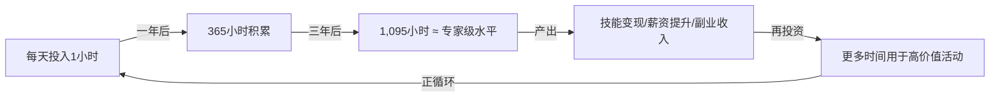
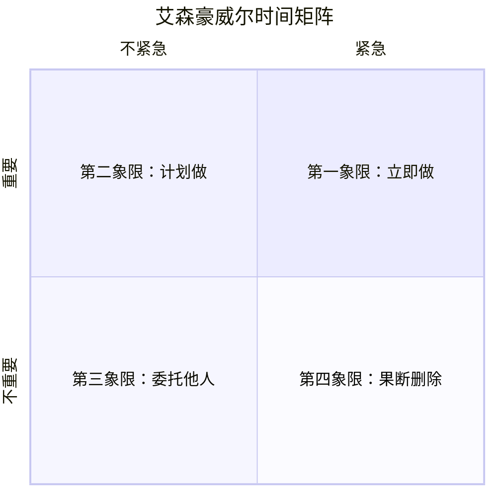
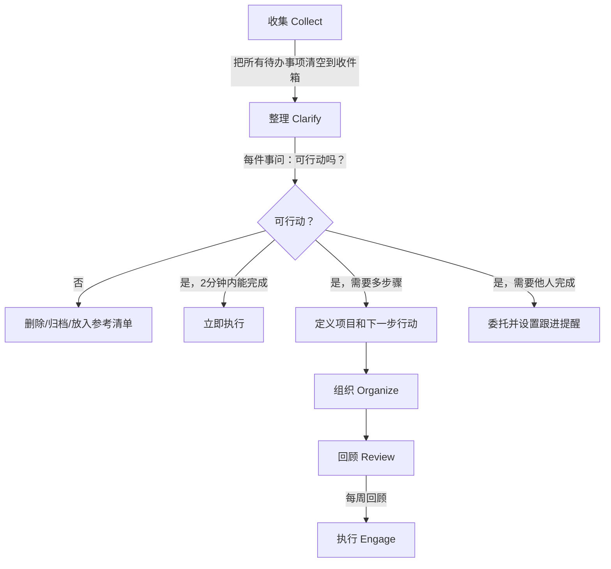
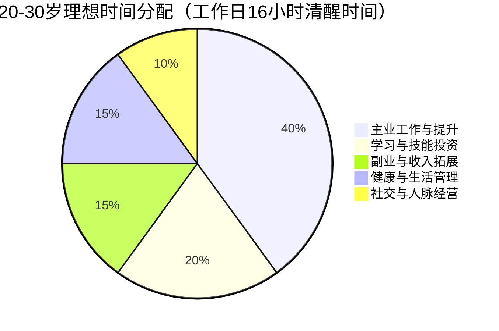

## 十一、20-30岁的时间管理

> "时间对每个人都是公平的，但时间的利用效率天差地别。20-30岁这十年，你把时间花在哪里，决定了你30岁以后的人生高度。"

20-30岁是人生中时间资源最丰富、但也是最容易被浪费的阶段。没有家庭负担、精力充沛、试错成本低——这些优势如果不通过有效的时间管理加以利用，就会在刷短视频、无效社交和拖延中悄然流逝。本节将从理论到实操，系统讲解20-30岁的时间管理方法论，帮助你把有限的时间转化为真正的财富积累。

### 1. 为什么时间管理是搞钱的基础能力

#### 1.1 时间与财富的底层关系

时间管理不是"自律鸡汤"，而是一项经济行为。理解这一点，需要先建立"时间经济学"的思维框架。

**时间的稀缺性**：每个人每天只有24小时，扣除睡眠（7-8小时）、通勤（1-2小时）、吃饭洗漱（2小时）等刚性消耗，真正可控的时间大约只有10-12小时。而20-30岁这十年，总共只有约36,500天中的3,650天——听起来很多，但扣掉刚性消耗后，可自由支配的时间只有大约1,500天（约4年）。

**时间的机会成本**：经济学中有一个核心概念——机会成本。你花在任何一件事上的时间，都是放弃了做其他事的可能性。刷2小时短视频的机会成本，可能是学习一项新技能、做一个副业项目、或者研究投资机会。

**时间的复利效应**：与金钱一样，时间也具有复利效应。每天多花1小时在有价值的事情上，一年就是365小时，十年就是3,650小时。按一万小时定律计算，这足以让你在任何一个领域达到专家水平。



#### 1.2 20-30岁时间管理的特殊性

20-30岁的时间管理与其他年龄段有显著不同，核心差异在于三个"多"：

**多任务并行**：这个阶段通常需要同时处理主业（工作）、副业（额外收入来源）、学习（技能提升）、社交（人脉积累）、恋爱/家庭等多条线。任何一条线都不能放弃，但也不可能平均分配时间。

**多目标冲突**：短期目标（本月工资、这个季度的KPI）和长期目标（三年后的职业转型、五年后的财务自由）之间存在张力。过度追求短期会牺牲长期发展，过度追求长期则可能连眼前的生活都维持不了。

**多角色切换**：上班是员工，下班是学生，周末可能是自媒体博主、兼职设计师或投资者。频繁的角色切换本身就需要时间管理技巧来降低切换成本。

#### 1.3 时间管理失败的代价

不做时间管理的代价是隐性的，但极其昂贵：

| 失败模式 | 短期代价 | 长期代价 |
|----------|----------|----------|
| 无计划随意行动 | 每天浪费2-3小时 | 十年浪费7,000-10,000小时 |
| 拖延症 | 任务堆积、质量下降 | 错过职业发展窗口期 |
| 多任务切换频繁 | 效率下降40%（斯坦福大学研究） | 长期认知能力受损 |
| 无效社交过多 | 每周消耗10-15小时 | 人脉质量低，无法转化为实际价值 |
| 碎片化学习 | 学而不精，无法变现 | 知识焦虑，能力停滞 |

### 2. 时间管理的核心理论体系

#### 2.1 艾森豪威尔矩阵：区分重要与紧急

这是最经典的时间管理工具，由美国前总统艾森豪威尔提出。核心思想是将所有任务按"重要性"和"紧急性"两个维度分为四个象限：



更直观的表达：

|  | **紧急** | **不紧急** |
|--|----------|------------|
| **重要** | **第一象限：立即执行**<br>危机处理、紧急deadline、突发问题 | **第二象限：计划执行**<br>学习提升、职业规划、健康管理、投资研究、人脉经营 |
| **不重要** | **第三象限：委托/简化**<br>大部分邮件、部分会议、他人转嫁的任务 | **第四象限：果断删除**<br>刷短视频、无目的浏览、八卦闲聊、过度追剧 |

**20-30岁的关键认知**：

大多数人把时间花在第一象限（救火）和第三象限（被打断），而真正决定你未来财富水平的第二象限——学习、投资研究、人脉经营、健康管理——却总是被"以后再说"。时间管理的核心目标，就是把尽可能多的时间从其他象限转移到第二象限。

**实操建议**：每周日花30分钟做"象限审计"，回顾过去一周的时间分配，标记每项活动所属的象限。目标是第二象限占比从当前的20%逐步提升到40%以上。

#### 2.2 帕累托法则（80/20法则）

意大利经济学家帕累托发现：80%的结果来自20%的投入。这个法则在时间管理中的应用是——你80%的收入和成就，来自你20%的核心活动。

**识别你的"关键20%"**：

对20-30岁的搞钱者来说，高价值活动通常包括：
- 提升核心专业技能（直接影响薪资增长）
- 维护关键人脉关系（带来机会和信息）
- 研究投资和理财知识（长期复利效应）
- 锻炼身体（维持长期战斗力）
- 深度思考和规划（避免方向性错误）

低价值活动通常包括：
- 无目的地刷手机（平均每天2-4小时）
- 参加没有实质内容的社交活动
- 做别人可以做的机械性工作
- 纠结于已经做出的决定
- 完美主义导致的过度打磨

**实操方法**：列出你每天/每周的所有活动，按照"对我搞钱的贡献度"打分（1-10分）。只保留8分以上的活动，其余要么删除、要么简化、要么委托。

#### 2.3 GTD（Getting Things Done）系统

David Allen 提出的GTD系统是目前最完整的个人任务管理框架，核心流程是五个步骤：



**GTD对20-30岁的价值**：这个年龄段任务繁杂（主业、副业、学习、社交同时进行），大脑容量有限。GTD的核心理念是"大脑是用来产生想法的，不是存储想法的"。把所有待办事项从大脑中清空到一个可靠的系统中，你的大脑才能腾出空间来做深度思考。

**简化的GTD实施步骤**：

1. **收集**：每天早上花10分钟，把脑子里所有待办事项写下来（纸笔或App都行）
2. **整理**：对每件事问三个问题——"这件事2分钟内能做完吗？""如果能，立即做；如果不能，它是某个项目的一部分吗？""它需要我亲自做吗？"
3. **组织**：把任务放入对应的列表——今日清单、本周清单、等待清单（委托他人的）、某天清单（未来可能做的）
4. **回顾**：每周日花20分钟回顾所有清单，更新进度，删除过期任务
5. **执行**：按照优先级和精力状态选择任务执行

#### 2.4 时间块（Time Blocking）方法

时间块方法的核心思想是：不给任务安排时间，就等于没有计划。Cal Newport（《深度工作》作者）是这个方法的倡导者。

**基本做法**：每天早上（或前一天晚上），把一天的时间划分为若干个时间块，每个时间块分配一个具体的任务或活动类型。

**20-30岁工作日的时间块模板（示例）**：

| 时间段 | 时间块类型 | 具体活动 | 时长 |
|--------|-----------|----------|------|
| 7:00-7:30 | 晨间准备 | 运动/冥想/早餐 | 30min |
| 7:30-8:00 | 规划时间 | 回顾当天计划，处理邮件 | 30min |
| 8:00-10:00 | 深度工作块1 | 主业核心任务（精力最充沛时段） | 2h |
| 10:00-10:15 | 休息 | 走动、喝水 | 15min |
| 10:15-12:00 | 深度工作块2 | 主业核心任务 | 1h45min |
| 12:00-13:00 | 午间 | 午餐+午休（15-20分钟） | 1h |
| 13:00-14:30 | 浅层工作块 | 会议、沟通、邮件、行政事务 | 1.5h |
| 14:30-14:45 | 休息 | 走动、茶歇 | 15min |
| 14:45-17:00 | 深度工作块3 | 主业收尾+学习（工作相关技能） | 2h15min |
| 17:00-18:00 | 通勤+过渡 | 播客/有声书（碎片学习） | 1h |
| 18:00-19:00 | 生活时间 | 晚餐+家务 | 1h |
| 19:00-20:30 | 副业/投资块 | 副业项目/投资研究 | 1.5h |
| 20:30-21:30 | 学习块 | 系统学习新技能 | 1h |
| 21:30-22:00 | 社交时间 | 联系朋友、维护人脉 | 30min |
| 22:00-22:30 | 复盘+准备 | 回顾当天，准备明天 | 30min |
| 22:30-23:00 | 放松时间 | 阅读/轻松活动 | 30min |
| 23:00 | 睡觉 | 保证7-8小时睡眠 | - |

**关键原则**：
- 把最重要的任务放在精力最充沛的时间段（通常是上午）
- 深度工作块至少90分钟，避免碎片化
- 每个时间块之间留10-15分钟缓冲
- 不是每天都必须严格遵守，目标是70%的执行率

#### 2.5 番茄工作法

由Francesco Cirillo发明，以25分钟为一个"番茄钟"，中间休息5分钟，每4个番茄钟后休息15-30分钟。

**适用场景**：
- 需要专注但难以进入状态的任务
- 有明确截止日期的项目
- 学习新知识、写代码、写文章等需要持续注意力的活动

**不适用场景**：
- 需要长时间沉浸的创造性工作（如设计、深度思考）
- 需要频繁沟通协作的工作
- 碎片化任务（如回复消息、处理邮件）

**实操技巧**：
- 一个番茄钟期间被打断（如同事找你），记录打断原因，重新开始
- 用专门的番茄钟App（如Forest、潮汐）记录每天完成的番茄钟数量
- 初期目标：每天完成8-10个有效番茄钟
- 进阶目标：每天完成12-16个，分布在主业和副业中

### 3. 20-30岁时间分配的科学模型

#### 3.1 时间分配的"四维模型"

20-30岁的时间应该分配到四个维度，每个维度都有其不可替代的价值：



**第一维度：主业工作与提升（40%，约6-7小时/天）**

主业是20-30岁最稳定的收入来源。时间分配不仅包括完成工作任务，还包括在工作中学习和成长。具体包括：
- 核心工作任务执行（4小时）
- 向同事和领导学习（0.5小时）
- 研究行业趋势和最佳实践（0.5小时）
- 项目复盘和经验总结（0.5小时）
- 与同事协作和沟通（0.5小时）

**第二维度：学习与技能投资（20%，约3小时/天）**

这是"投资自己"的时间，短期看不到回报，但长期收益最大。具体包括：
- 系统学习新技能（1.5小时）：在线课程、专业书籍、技术文档
- 阅读和信息输入（0.5小时）：行业报告、深度文章
- 输出和实践（0.5小时）：写作笔记、做项目练习
- 碎片化学习（0.5小时）：通勤时听播客、午休时看文章

**第三维度：副业与收入拓展（15%，约2-2.5小时/天）**

副业是20-30岁突破收入天花板的关键路径。具体包括：
- 副业项目执行（1.5小时）
- 副业相关学习（0.5小时）
- 投资研究和操作（0.5小时）

**第四维度：健康与生活管理（15%，约2-2.5小时/天）**

健康是一切的基础。20-30岁不注意健康，30岁以后会付出巨大代价。具体包括：
- 运动锻炼（0.5-1小时）
- 健康饮食准备（0.5小时）
- 睡眠（7-8小时，不计入清醒时间）
- 家务和个人卫生（0.5小时）

**第五维度：社交与人脉经营（10%，约1.5小时/天）**

人脉是搞钱路上的杠杆。具体包括：
- 维护核心朋友圈（每天15分钟线上互动）
- 行业社群参与（每周2-3小时）
- 深度社交活动（每周1-2次，每次2-3小时）
- 导师关系维护（每月1-2次深度交流）

#### 3.2 周末时间分配策略

周末是20-30岁搞钱者的"第二战场"。工作日时间被主业占据大头，周末可以集中精力做副业和深度学习。

**推荐的周末时间分配（每天14小时清醒时间）**：

| 时间段 | 周六 | 周日 |
|--------|------|------|
| 7:00-8:00 | 运动+早餐 | 运动+早餐 |
| 8:00-12:00 | 副业项目集中执行（4h） | 深度学习/课程（4h） |
| 12:00-13:30 | 午餐+午休 | 午餐+午休 |
| 13:30-17:00 | 副业/投资研究（3.5h） | 社交活动/人脉经营（3.5h） |
| 17:00-18:00 | 运动/户外活动 | 家务/生活整理 |
| 18:00-20:00 | 休闲放松（电影、游戏等） | 休闲放松 |
| 20:00-22:00 | 阅读/轻松学习 | 下周规划+复盘（1h）+ 阅读 |
| 22:00-22:30 | 放松 | 放松 |
| 22:30 | 睡觉 | 睡觉 |

**关键原则**：
- 周末不是"什么都不做"，而是"做工作日没时间做的事"
- 至少留半天给休闲和社交，避免过度疲劳导致的报复性放纵
- 周日晚上一定要做下周规划，否则周一很容易陷入被动

#### 3.3 不同职业阶段的时间侧重

20-30岁跨越了职场新人到资深人士的转变，不同阶段的时间侧重应有所不同：

| 阶段 | 年龄段 | 主业占比 | 学习占比 | 副业占比 | 重点策略 |
|------|--------|----------|----------|----------|----------|
| 新人期 | 22-25岁 | 50% | 25% | 10% | 全力提升主业能力，建立职业基础 |
| 成长期 | 25-27岁 | 40% | 20% | 20% | 主业稳定后开始探索副业 |
| 突破期 | 27-30岁 | 35% | 15% | 25% | 副业规模化，投资体系建立 |

### 4. 实操：打造个人时间管理系统

#### 4.1 工具选择

时间管理工具的选择原则：简单、可靠、跨平台。工具越复杂，越容易变成"管理工具"本身而不是"管理时间"。

**推荐工具组合**：

| 功能 | 推荐工具 | 说明 |
|------|----------|------|
| 任务管理 | 滴答清单 / Todoist | 支持项目分类、优先级、截止日期 |
| 日历管理 | Google Calendar / 飞书日历 | 时间块规划、会议安排 |
| 笔记和知识管理 | Notion / Obsidian | 学习笔记、项目文档 |
| 习惯追踪 | Habitica / 小日常 | 记录每日习惯完成情况 |
| 番茄钟 | Forest / 潮汐 | 专注计时 |
| 时间记录 | Toggl / 时间块App | 记录实际时间花费（审计用） |

**极简方案（只用两个工具）**：
- 滴答清单（任务管理+习惯追踪）
- 飞书日历（时间块规划）

#### 4.2 每日时间管理流程

**前一天晚上（15分钟）**：
1. 回顾今天完成的任务，标记进度
2. 明确明天最重要的3件事（MIT：Most Important Tasks）
3. 在日历上安排明天的时间块
4. 准备好明天需要的材料

**早晨启动（10分钟）**：
1. 回顾今天的计划和时间块
2. 确认今天最重要的1件事（MIT中的MIT）
3. 检查是否有需要调整的地方
4. 进入第一个深度工作块

**工作中（持续）**：
1. 遵循时间块安排
2. 遇到新任务先记入收件箱，不立即处理
3. 每90分钟休息10-15分钟
4. 遇到打断，快速评估：紧急重要吗？能推迟吗？

**晚上复盘（10分钟）**：
1. 统计今天完成的番茄钟数量
2. 记录今天的时间分配（与计划对比）
3. 标记明天需要跟进的任务
4. 简短记录今天的收获和反思

#### 4.3 每周复盘流程

每周日晚上花30-45分钟做一次深度复盘：

**第一步：回顾本周（10分钟）**
- 本周完成了哪些重要任务？
- 本周的时间分配是否合理？
- 有哪些计划没有完成？原因是什么？

**第二步：分析问题（10分钟）**
- 本周最大的时间浪费是什么？
- 有哪些任务可以简化或删除？
- 有哪些打断是可避免的？

**第三步：制定下周计划（15分钟）**
- 确定下周的3个核心目标
- 安排下周的时间块（粗粒度）
- 预留缓冲时间应对突发情况

**第四步：调整策略（5分钟）**
- 根据本周的复盘，调整时间分配比例
- 更新习惯追踪列表
- 设置下周的提醒和闹钟

#### 4.4 每月/每季度回顾

**月度回顾（1小时）**：
- 本月收入/支出/储蓄率对比目标
- 本月学习成果（完成的课程、读完的书）
- 本月副业进展
- 下月重点目标和计划

**季度回顾（2-3小时）**：
- 季度财务数据汇总
- 职业发展评估（技能提升、项目成果）
- 副业收入趋势分析
- 长期目标进度检查
- 时间管理策略调整

### 5. 深度工作：搞钱的核武器

Cal Newport在《深度工作》中提出了一个重要概念：在信息爆炸时代，能够长时间专注于高价值任务的能力，是一种稀缺且极具价值的技能。

#### 5.1 什么是深度工作

深度工作（Deep Work）是指在无干扰状态下进行的专业活动，它能够：
- 推动认知能力到极限
- 创造新价值
- 提升技能
- 难以复制

与之对应的是浅层工作（Shallow Work）：不需要太多认知投入的、容易被打断的任务，如回复邮件、参加无明确议程的会议、刷社交媒体。

#### 5.2 20-30岁如何培养深度工作能力

**第一阶段：从30分钟开始**

如果你之前没有深度工作的习惯，不要一开始就想连续工作4小时。从30分钟的专注时间开始，每周增加15分钟，逐步达到90-120分钟的深度工作块。

**第二阶段：建立启动仪式**

深度工作需要一个"启动仪式"来帮助大脑切换模式。例如：
- 泡一杯咖啡，戴上降噪耳机
- 关闭手机通知，打开专注App
- 花2分钟写下这个工作块的具体目标
- 深呼吸三次，开始

**第三阶段：管理打断**

打断是深度工作的天敌。常见打断及应对策略：

| 打断类型 | 来源 | 应对策略 |
|----------|------|----------|
| 数字打断 | 手机通知、微信消息 | 工作时开启勿扰模式，固定时间查看消息 |
| 人际打断 | 同事找你、领导临时安排 | 佩戴耳机作为"请勿打扰"信号，非紧急事项请对方稍后 |
| 内部打断 | 突然想起其他事 | 立即记入收件箱，继续当前任务 |
| 环境打断 | 噪音、温度不适 | 选择安静的工作环境，准备降噪耳机 |

**第四阶段：追踪和优化**

记录每天深度工作的时长，逐步提升。目标：

| 阶段 | 每日深度工作时长 | 对应能力水平 |
|------|-----------------|-------------|
| 入门 | 1-2小时 | 初级——能完成基本工作任务 |
| 进阶 | 3-4小时 | 中级——能处理复杂项目 |
| 高手 | 4-6小时 | 高级——能产出高质量成果 |
| 大师 | 6-8小时 | 顶级——能在领域内产出突破性成果 |

### 6. 常见时间管理误区与纠正

#### 6.1 误区一：把"忙碌"当成"高效"

**表现**：每天从早忙到晚，但到了月底发现重要的事情一件都没推进。

**原因**：用完成任务的数量来衡量效率，而不是任务的价值。回复100条微信消息可能让你感觉很忙，但对搞钱的贡献可能为零。

**纠正方法**：
- 每天只确定1-3个MIT（最重要的任务），优先完成
- 用"产出价值"而不是"投入时间"来衡量效率
- 定期问自己："如果今天只能做一件事，哪件事对我的长期目标最有帮助？"

#### 6.2 误区二：过度规划，执行不足

**表现**：花大量时间制作精美的计划表、购买各种效率工具、阅读时间管理书籍，但实际行动很少。

**原因**：规划本身会带来一种"虚假的成就感"，让人觉得已经做了很多。实际上，规划只是手段，执行才是目的。

**纠正方法**：
- 规划时间不超过总时间的10%
- 使用极简工具（一个任务管理App + 一个日历即可）
- 遵循"2分钟法则"：如果一件事2分钟内能做完，立即做，不要列入计划
- 设定"执行优先"的规则：没有完成当天的MIT之前，不允许做规划和整理

#### 6.3 误区三：忽视精力管理

**表现**：严格按时间表执行，但下午3点以后效率暴跌，晚上完全不想动脑。

**原因**：时间管理只是表面，精力管理才是底层。人的精力是波动的，不是每个小时的产出都一样。

**纠正方法**：
- 识别自己的精力高峰期（大多数人是上午9-11点和下午3-5点）
- 把最重要的任务安排在精力高峰期
- 用"精力象限"而不是"时间象限"来安排任务：
  - 高精力 + 重要任务 → 深度工作
  - 高精力 + 不重要任务 → 快速处理
  - 低精力 + 重要任务 → 拆解为小步骤
  - 低精力 + 不重要任务 → 推迟或删除
- 保持规律的睡眠、运动和饮食

#### 6.4 误区四：拒绝所有娱乐和社交

**表现**：把所有非工作时间都用于学习和副业，完全不给自己休息和娱乐的时间。

**原因**：过度紧绷会导致报复性放纵（突然连续几天什么都不想做），或者长期倦怠。

**纠正方法**：
- 每天至少保留30分钟纯粹的放松时间（不是"有目的的放松"，就是什么都不做或做喜欢的事）
- 每周至少保留半天给社交和娱乐
- 把娱乐和社交也纳入计划（是的，计划娱乐时间）
- 定期给自己放假（每月1天完全不工作）

#### 6.5 误区五：追求完美主义

**表现**：一篇报告反复修改到"完美"才提交，一个项目做到100分才肯发布。

**原因**：完美主义的本质是恐惧——害怕被批评、害怕不够好。但80分的成果及时交付，远比100分的成果迟到一周更有价值。

**纠正方法**：
- 设定"足够好"的标准，而不是"完美"的标准
- 使用"时间盒"方法：给每个任务设定固定时间，时间到了就交付
- 记住：完成 > 完美（Done is better than perfect）
- 先发布再迭代，比追求一次到位更高效

#### 6.6 误区六：同时做多件事（多任务处理）

**表现**：一边写报告一边回复微信，一边听课一边刷手机。

**原因**：人类大脑不支持真正的多任务处理。所谓的"多任务"实际上是快速切换任务，每次切换都有"切换成本"（重新进入状态需要15-25分钟）。斯坦福大学研究发现，频繁的多任务切换会使效率下降40%。

**纠正方法**：
- 一次只做一件事
- 使用番茄工作法强制单任务
- 关闭不必要的通知和标签页
- 批量处理同类任务（如统一时间回复消息、统一时间处理邮件）

### 7. 案例：时间管理如何改变搞钱效率

#### 7.1 案例一：从"救火队员"到"主动规划"

**背景**：小王，24岁，互联网公司运营，月薪8000元。每天被各种临时任务和紧急需求填满，下班后只想刷手机放松，完全没有时间学习和做副业。

**问题诊断**：
- 第一象限（紧急重要）占比：50%——大量时间在救火
- 第二象限（不紧急重要）占比：5%——几乎没有规划和学习时间
- 第三象限（紧急不重要）占比：30%——频繁被打断
- 第四象限（不紧急不重要）占比：15%——下班后刷手机

**调整方案**：
1. 每天早上花15分钟规划当天任务，区分优先级
2. 与领导沟通，约定每天下午2-3点集中处理临时需求，其他时间专注核心工作
3. 设置手机勿扰模式（工作时间只允许电话和紧急消息）
4. 下班后第一件事：花1小时学习运营相关课程（而不是刷手机）

**三个月后的变化**：
- 第一象限占比降到30%（很多"紧急"任务其实是可以提前预防的）
- 第二象限占比提升到35%（有时间做规划和学习）
- 第三象限占比降到20%（通过沟通减少了无效打断）
- 第四象限占比降到15%（刷手机时间减少了一半）
- 结果：半年后晋升为运营组长，月薪涨到12000元；同时开始做运营咨询副业，月均收入3000元

#### 7.2 案例二：时间块方法让副业成为可能

**背景**：小陈，26岁，设计师，月薪15000元。想做自由设计师副业但总觉得"没时间"。

**问题诊断**：
- 工作日下班后：7点到家，做饭吃饭到8点，然后"休息一下"刷手机到9点半，剩下不到2小时已经没精力了
- 周末：睡到自然醒（10点），然后约朋友吃饭逛街，一天就这么过去了

**调整方案**：
1. 工作日晚上：7-8点吃饭，8-9:30副业设计项目（时间块强制执行），9:30-10:30学习新设计工具，10:30后放松
2. 周六：8点起床，8-12点集中做副业项目（4小时深度工作），下午社交，晚上复盘
3. 周日：上午学习+阅读，下午规划下周+生活整理

**六个月后的变化**：
- 副业收入从0增长到月均5000元
- 完成了3个在线设计课程
- 在Dribbble上积累了2000+粉丝，开始接到品牌邀约
- 总收入从15000元增长到20000元+

#### 7.3 案例三：GTD系统管理多线程生活

**背景**：小张，28岁，程序员，月薪20000元。同时在做：主业工作、技术博客、开源项目、基金定投、健身计划。经常感觉事情太多做不完，焦虑感强烈。

**问题诊断**：
- 所有任务都存在脑子里，没有外部系统
- 经常忘记deadline和承诺
- 在不同任务之间频繁切换，效率低下
- 周末经常因为"不知道先做什么"而拖延一整天

**调整方案**：
1. 使用滴答清单建立GTD系统：
   - 收件箱：所有新想法和待办事项
   - 项目清单：主业项目、博客项目、开源项目
   - 等待清单：委托他人或等待回复的事项
   - 每周复盘：每周日晚上花30分钟清理和更新
2. 使用日历做时间块规划
3. 每天只关注3个MIT

**三个月后的变化**：
- 焦虑感显著降低（大脑不再需要"记住所有事情"）
- 任务完成率从50%提升到80%
- 技术博客更新频率从每月1篇提升到每周1篇
- 开源项目有了稳定的贡献节奏
- 每天反而多出了30分钟的自由时间

### 8. 进阶：从时间管理到精力管理

#### 8.1 精力的四个维度

Tony Schwartz在《精力管理》中提出，精力由四个维度构成：

| 维度 | 含义 | 恢复方式 |
|------|------|----------|
| 体能精力 | 身体的能量水平 | 运动、睡眠、营养、呼吸练习 |
| 情绪精力 | 积极/消极情绪状态 | 社交、感恩练习、冥想 |
| 心智精力 | 专注力和创造力 | 深度工作、学习新事物、适度休息 |
| 意志精力 | 人生目标和价值观 | 与长期目标对齐、反思和冥想 |

#### 8.2 20-30岁的精力管理策略

**体能精力**：
- 每周3-5次运动，每次30-60分钟（力量训练 + 有氧运动）
- 保证7-8小时睡眠（不是6小时，不要用"年轻"来透支）
- 减少高糖高油食物，增加蛋白质和蔬菜摄入
- 每工作90分钟站起来活动5分钟

**情绪精力**：
- 维护2-3个高质量的亲密关系
- 每天花5分钟记录3件感恩的事
- 减少与负能量人群的接触
- 学会说"不"——拒绝不必要的社交和任务

**心智精力**：
- 保护深度工作时间，减少碎片化
- 定期学习新事物，保持大脑活跃
- 减少信息过载——限制每天的新闻/社交媒体消费时间
- 适度的无聊和发呆是必要的（大脑需要"默认模式网络"来整合信息）

**意志精力**：
- 明确自己的人生目标和搞钱动机
- 把日常任务与长期目标关联起来
- 定期反思：我正在做的事是否符合我的长期方向？
- 找到超越金钱的意义感（使命感是持久动力的来源）

#### 8.3 避免精力透支的预警信号

当你出现以下信号时，说明精力已经透支，需要立即调整：

- 连续3天以上感到疲惫，即使睡了8小时
- 对原本喜欢的事情失去兴趣
- 注意力无法集中超过15分钟
- 容易发脾气或情绪低落
- 频繁生病（免疫力下降）
- 出现"报复性放纵"（如连续通宵刷剧、暴饮暴食）

**应对措施**：
1. 立即减少工作量，保留最低限度的任务
2. 增加睡眠时间（多睡1-2小时）
3. 进行低强度活动（散步、瑜伽、泡澡）
4. 与信任的人倾诉
5. 严重时寻求专业心理咨询

### 9. 工具与模板

#### 9.1 每日MIT清单模板

```text
日期：____年__月__日（星期__）

=== 今日最重要的3件事 ===
1. [ ] _________________ （预计___分钟，实际___分钟）
2. [ ] _________________ （预计___分钟，实际___分钟）
3. [ ] _________________ （预计___分钟，实际___分钟）

=== 其他任务 ===
4. [ ] _________________
5. [ ] _________________
6. [ ] _________________

=== 明日准备 ===
- 明天最重要的1件事：_______________
- 需要提前准备的材料：_______________

=== 今日反思 ===
- 完成的番茄钟数量：___
- 最大的时间浪费：_______________
- 明天可以改进的地方：_______________
```

#### 9.2 每周复盘模板

```text
=== 第___周复盘（__月__日 - __月__日）===

【目标完成情况】
1. 目标1：_______________  完成度：__%
2. 目标2：_______________  完成度：__%
3. 目标3：_______________  完成度：__%

【时间分配分析】
- 主业工作：___小时（占比__%）
- 学习提升：___小时（占比__%）
- 副业项目：___小时（占比__%）
- 健康运动：___小时（占比__%）
- 社交人脉：___小时（占比__%）
- 休闲放松：___小时（占比__%）

【本周亮点】
1. _________________
2. _________________

【本周问题】
1. 问题：_______________ 原因：_______________ 改进：_______________
2. 问题：_______________ 原因：_______________ 改进：_______________

【下周计划】
1. 核心目标：_______________
2. 重点任务：_______________
3. 需要避免的坑：_______________
```

#### 9.3 月度财务+时间综合回顾模板

```text
=== ___月度回顾 ===

【财务数据】
- 主业收入：____元
- 副业收入：____元
- 投资收益：____元
- 总收入：____元
- 总支出：____元
- 储蓄率：__%（目标：>30%）

【时间投入产出分析】
- 主业时间投入：___小时 → 收入：____元 → 时薪：____元
- 副业时间投入：___小时 → 收入：____元 → 时薪：____元
- 学习时间投入：___小时 → 产出：_______________
- 投资时间投入：___小时 → 收益：____元

【技能成长】
- 本月学到的新技能：_______________
- 本月完成的课程/书籍：_______________
- 下月学习计划：_______________

【下月目标】
1. _________________
2. _________________
3. _________________
```

### 10. 总结：时间管理的核心心法

20-30岁的时间管理不是把自己变成机器人，而是通过有意识的选择，把有限的时间投入到最有价值的事情上。记住以下几个核心原则：

**第一，先有方向，再谈效率**。方向错了，效率越高跑偏越远。在做时间管理之前，先想清楚你的搞钱目标是什么、三年后你想达到什么状态。

**第二，完成大于完美**。不要花太多时间优化系统和工具，一个能用的系统加上坚定的执行，远胜于一个完美的系统加上三天打鱼两天晒网。

**第三，保护你的深度工作时间**。在注意力稀缺的时代，能够长时间专注于高价值任务的能力，本身就是一种竞争优势。

**第四，精力管理是时间管理的底层操作系统**。没有好的精力状态，再好的时间规划也执行不了。照顾好身体和情绪，是时间管理的前提条件。

**第五，定期复盘，持续优化**。时间管理是一个不断迭代的过程。通过每周/每月的复盘，找到自己的时间黑洞和效率高峰，逐步优化你的系统。

20-30岁这十年，你把时间花在什么上面，十年后你就会收获什么。花在刷短视频上，收获的是空虚；花在提升自己上，收获的是成长；花在搞钱上，收获的是财务自由的可能性。时间是公平的，选择权在你手上。
