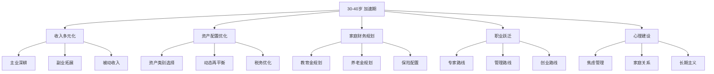
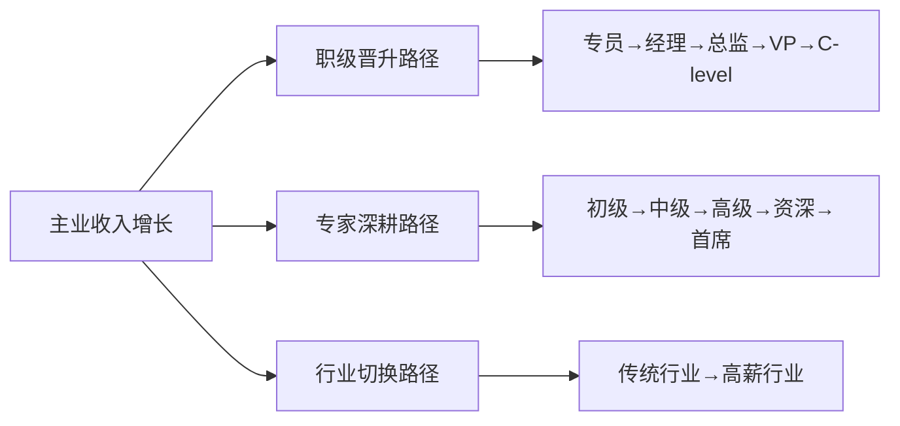
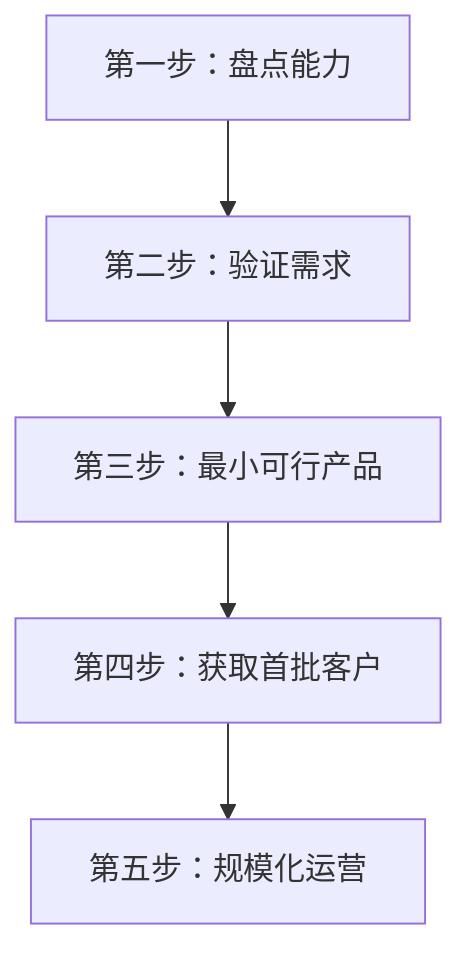
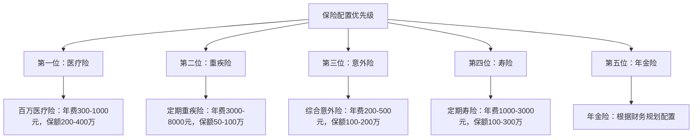

# 第十八章：30-40岁：加速期

> "30岁之前，你为简历工作；30岁之后，简历为你工作。" —— 沃伦·巴菲特

30-40岁是人生中最关键的十年。在这个阶段，你的收入进入快速增长期，职业发展进入上升通道，但同时家庭责任也在增加。如何在事业发展和家庭责任之间找到平衡，如何在收入增长的同时实现资产的快速积累，是这个阶段的核心挑战。

与20-30岁的"积累期"不同，30-40岁的核心任务不再是"试错"和"探索"，而是"聚焦"和"加速"。你已经有了10年左右的工作经验，清楚自己擅长什么、行业机会在哪里，现在要做的是把这些积累转化为实实在在的财富增长。本章将为你提供一套系统的搞钱策略，帮助你在加速期实现财富的快速增长。

**本章核心框架**：



---

## 18.1 阶段特点分析

### 18.1.1 收入进入快速增长期

**收入现实画像（2025-2026年数据）**：

| 城市级别 | 普通岗位 | 中层管理/资深专家 | 高管/顶级专家 |
|----------|----------|-------------------|---------------|
| 一线城市（北上广深） | 15,000-30,000元/月 | 30,000-60,000元/月 | 60,000-150,000元/月 |
| 新一线城市（杭州/成都/武汉） | 10,000-20,000元/月 | 20,000-40,000元/月 | 40,000-80,000元/月 |
| 二线城市 | 8,000-15,000元/月 | 15,000-30,000元/月 | 30,000-60,000元/月 |
| 三线及以下 | 5,000-10,000元/月 | 10,000-20,000元/月 | 20,000-40,000元/月 |

> 注意：以上为税前收入。实际到手收入需扣除五险一金和个税。以月薪30,000元为例，扣除五险一金（约6,000元）和个税（约2,500元）后，到手约21,500元。

**各行业30-40岁收入天花板**：

| 行业 | 中位数年薪 | 头部10%年薪 | 收入特点 |
|------|-----------|------------|----------|
| 互联网/科技 | 30-60万 | 80-200万 | 股票期权占比高，波动大 |
| 金融（银行/券商/基金） | 25-50万 | 60-300万 | 奖金占比高，受市场影响 |
| 医疗/医药 | 20-40万 | 50-150万 | 稳定增长，专业壁垒高 |
| 制造业 | 15-30万 | 40-80万 | 增长慢，但稳定性强 |
| 教育/培训 | 15-25万 | 30-80万 | 知识变现潜力大 |
| 公务员/事业单位 | 15-25万 | 25-40万 | 稳定，福利好，隐性收入高 |
| 自由职业/创业 | 差异极大 | 差异极大 | 上不封顶，下不保底 |

**收入增长的三个驱动因素**：

1. **职级跃迁带来的结构性增长**：从专员到经理、从经理到总监，每次晋升通常伴随30-100%的薪资涨幅。这是30-40岁最重要的收入增长来源。
2. **行业红利带来的被动增长**：选对行业，水涨船高。2020年的新能源、2023年的AI大模型，行业风口期的人才薪资涨幅远超其他行业。
3. **个人品牌带来的溢价收入**：当你在行业内有一定知名度后，猎头电话、咨询邀约、合作机会会主动找上门，这部分溢价往往是本职薪资的30-100%。

**关键认知**：30-40岁是职业发展的黄金期，也是收入增长最快的阶段。这个阶段的核心任务是最大化收入增长，同时建立多元化的收入来源。不要满足于"还不错"的薪资——如果你的年收入增长率低于15%，说明你可能在原地踏步。

### 18.1.2 家庭责任急剧增加

**30-40岁的典型家庭支出结构**：

| 支出项目 | 月均支出（一线城市） | 月均支出（二线城市） | 占比 |
|----------|---------------------|---------------------|------|
| 房贷/房租 | 8,000-20,000元 | 4,000-10,000元 | 30-40% |
| 子女教育 | 3,000-10,000元 | 2,000-5,000元 | 10-20% |
| 日常生活 | 5,000-10,000元 | 3,000-6,000元 | 15-20% |
| 交通出行 | 2,000-5,000元 | 1,000-3,000元 | 5-10% |
| 保险费用 | 1,000-3,000元 | 800-2,000元 | 3-5% |
| 社交应酬 | 1,000-3,000元 | 500-2,000元 | 3-5% |
| 父母赡养 | 1,000-5,000元 | 1,000-3,000元 | 5-10% |
| 其他 | 2,000-5,000元 | 1,000-3,000元 | 5-10% |
| **合计** | **23,000-61,000元** | **13,300-34,000元** | **100%** |

**"三座大山"的具体压力**：

**1. 房贷压力**

以2025-2026年为例：一线城市一套普通住房总价约300-600万元，首付30%后贷款210-420万元，按30年期LPR 3.5%计算，月供约9,400-18,800元。这意味着家庭收入的30-40%要用于还房贷。

应对策略：
- 控制房贷月供不超过家庭月收入的35%（警戒线：40%）
- 优先使用公积金贷款（利率2.85%），减少商业贷款比例
- 提前还款策略：如果投资收益率低于房贷利率，优先还贷；反之，保留贷款做投资
- 考虑"先小后大"的换房路径，不要一步到位背负过重房贷

**2. 子女教育费用**

从出生到大学毕业，一个孩子的教育总投入估算（2025年价格水平）：

| 教育阶段 | 年均费用（公立） | 年均费用（私立/国际） | 年限 | 总计（公立） | 总计（私立） |
|----------|-----------------|---------------------|------|-------------|-------------|
| 孕期-3岁 | 3-5万 | 8-15万 | 3年 | 9-15万 | 24-45万 |
| 幼儿园 | 2-4万 | 5-15万 | 3年 | 6-12万 | 15-45万 |
| 小学 | 1-3万 | 8-20万 | 6年 | 6-18万 | 48-120万 |
| 初中 | 1.5-3万 | 10-25万 | 3年 | 4.5-9万 | 30-75万 |
| 高中 | 2-4万 | 10-25万 | 3年 | 6-12万 | 30-75万 |
| 大学（国内） | 3-8万 | - | 4年 | 12-32万 | - |
| 大学（留学） | 25-50万 | - | 4年 | 100-200万 | - |
| **合计（公立+国内大学）** | | | | **43.5-98万** | |
| **合计（私立+留学）** | | | | | **247-635万** |

> 关键洞察：教育费用的差异巨大。选择公立路线和私立路线，总投入可能相差5-10倍。这不是说私立一定比公立好，而是要根据家庭财务状况做出理性选择。

**3. 赡养父母**

30-40岁正是父母逐渐老去的阶段。如果父母有退休金和医保，压力相对较小；如果父母没有充分的社保，赡养费用可能是一笔不小的开支。建议：
- 尽早了解父母的社保、医保、存款状况
- 为父母配置意外险和百万医疗险（年龄越大保费越贵，尽早买）
- 每月固定给父母一笔赡养费，金额根据自身能力和父母需求确定
- 兄弟姐妹之间明确分担比例，避免后期矛盾

**关键认知**：家庭责任的增加是客观现实，但不应该成为"躺平"的借口。恰恰相反，正是因为家庭责任的增加，你才更有动力去提升收入、优化财务结构。压力是最好的催化剂。

### 18.1.3 经验积累形成竞争优势

**10年工作经验的复利效应**：

到30岁时，你已经积累了8-10年的工作经验。这些经验不仅仅是"做过什么"，更重要的是形成了以下几类难以复制的竞争优势：

1. **行业认知深度**：你了解行业的潜规则、关键节点、利益链条。这种认知不是看几本书、上几节课能获得的，需要在实战中积累。
2. **问题解决能力**：你处理过各种复杂的业务问题，形成了自己的方法论和思维框架。面对新问题时，你能快速定位关键矛盾，找到突破口。
3. **人脉网络质量**：你认识行业内的关键人物——供应商、客户、合作伙伴、同行。这些人脉是你的"社会资本"，可以转化为实实在在的商业机会。
4. **决策直觉**：基于大量的经验和失败，你形成了对商业机会的直觉判断能力。这种"嗅觉"往往比数据分析更快、更准。

**如何将经验转化为收入**：

- **知识产品化**：将你的经验转化为课程、书籍、咨询产品。一个有10年经验的产品经理，一门在线课程售价199元，卖出1000份就是近20万元。
- **经验复用**：将A行业的成功经验迁移到B行业。跨行业的经验迁移往往能产生意想不到的价值。
- **人脉变现**：连接有供需关系的双方，收取合理的中介费或佣金。这不是"卖人情"，而是创造价值。

### 18.1.4 风险承受能力的"黄金窗口"

30-40岁是风险承受能力的"黄金窗口"——你有足够的资金积累去承受投资风险，同时还有足够的时间去弥补可能的损失。这个阶段的风险承受能力评估如下：

**风险承受能力评估矩阵**：

| 评估维度 | 低风险承受 | 中等风险承受 | 高风险承受 |
|----------|-----------|-------------|-----------|
| 年龄 | 接近40岁 | 33-37岁 | 30-33岁 |
| 家庭负担 | 双孩+房贷+赡养 | 单孩+房贷 | 无孩或轻房贷 |
| 收入稳定性 | 体制内/传统行业 | 大型企业 | 互联网/创业 |
| 应急基金 | <6个月 | 6-12个月 | >12个月 |
| 投资经验 | 无/亏损经历 | 有一定经验 | 丰富经验 |
| 建议股票配置 | 30-40% | 50-60% | 60-70% |

**关键认知**：风险承受能力不是一成不变的。随着家庭状况、收入水平、市场环境的变化，你需要定期重新评估自己的风险承受能力，并相应调整投资策略。每年至少做一次全面的财务体检。

---

## 18.2 收入多元化：构建多条现金流管道

单一的工资收入就像只有一条腿的凳子——看起来能坐，但随时可能翻倒。30-40岁的核心任务之一是构建多条现金流管道，让你的收入来源不再依赖单一雇主。

### 18.2.1 主业深耕：最大化你的"单位时间价值"

**收入增长的三条路径**：



**路径一：职级晋升路径**

从执行者到管理者，再到高层管理者。这是一条经典的收入增长路径，每升一级，收入通常增长30-100%。

关键行动：
- 主动争取带团队的机会，哪怕是2-3人的小团队
- 向上管理：让你的上级看到你的价值，成为他的"得力助手"
- 学会"授权"而不是"亲力亲为"——管理者的核心能力是通过他人拿结果
- 建立跨部门协作关系，扩大你的影响力范围
- 每年至少主导一个"有影响力"的项目，作为晋升的筹码

晋升时机判断：
- 在当前岗位已经稳定产出1.5-2年
- 你的能力已经"溢出"了当前岗位的要求
- 公司有明确的晋升通道和机会
- 你的上级认可你的能力并愿意推荐你

**路径二：专家深耕路径**

不是每个人都适合做管理。如果你更喜欢深耕技术或专业领域，走专家路线同样能获得高收入。许多大公司都有"双通道"晋升体系——管理通道和专业通道并行。

专家路线的核心是"稀缺性"。你需要做到在某个细分领域"全国前5%"或至少"公司内部前3%"。具体方法：
- 选择一个有市场需求的细分领域，持续深耕3-5年
- 输出专业内容（技术博客、行业报告、会议演讲），建立行业影响力
- 考取行业顶级认证（如CFA、CPA、PMP、AWS认证架构师等）
- 参与行业标准制定或开源项目，提升行业话语权

**路径三：行业切换路径**

如果你所在的行业增长乏力，考虑切换到高增长行业。30-40岁切换行业的成本比20多岁时高，但收益也更大——因为你带着成熟的方法论和管理经验进入新行业，起点更高。

适合30-40岁切换的行业方向：
- 传统IT → AI/大模型相关岗位（2023-2026年最大的行业风口）
- 传统金融 → 金融科技/数字货币
- 传统制造 → 新能源/智能制造
- 传统零售 → 直播电商/跨境电商

**跳槽谈判的实战技巧**：

跳槽是30-40岁最直接的涨薪方式。一次成功的跳槽可以带来30-80%的薪资涨幅，相当于在原公司升两级的涨幅。

谈判要点：
1. **不要先报价**：让对方先出价，你才有谈判空间。如果被追问，可以说"我更关注整体薪酬包，希望贵司根据我的能力和市场行情给出合理报价"。
2. **关注总包而非底薪**：股票期权、签字费、年终奖、补充公积金、商业保险等加起来可能占总薪酬的30-50%。
3. **用数据说话**：在Glassdoor、脉脉、猎聘等平台调研同岗位的薪资范围，用数据支撑你的期望。
4. **设置底线和理想值**：底线是你能接受的最低薪资（通常比当前薪资高20%），理想值是你期望的薪资（通常比当前薪资高40-60%）。
5. **不要急于接第一个offer**：拿到offer后，至少给自己2-3天的考虑时间。利用这个时间和其他机会做对比，增加谈判筹码。

### 18.2.2 副业拓展：打造"第二收入引擎"

**选择副业的核心原则**：

不是所有副业都值得做。一个好的副业应该满足以下条件：
1. **可复用主业能力**：不需要从零学习，而是利用你已有的技能和经验
2. **边际成本递减**：投入的时间和精力可以产生复利效应，而不是线性消耗
3. **不影响主业**：副业不应该影响你的主业表现和职业发展
4. **有增长潜力**：副业收入有天花板，但天花板应该足够高

**30-40岁高价值副业分类**：

**类型一：知识变现型**

适合人群：任何在某个领域有深度经验的专业人士

| 副业形式 | 启动成本 | 时间投入 | 月收入潜力 | 难度 |
|----------|----------|----------|-----------|------|
| 在线课程（网易/腾讯课堂） | 低（录屏设备+剪辑软件） | 前期40-80小时 | 5,000-50,000元 | ★★★ |
| 付费咨询（一对一） | 极低 | 按需 | 10,000-50,000元 | ★★ |
| 付费社群（知识星球等） | 低 | 每周5-10小时 | 5,000-30,000元 | ★★★ |
| 出版/写书 | 中（时间成本高） | 前期200-500小时 | 长尾收入，每年2-10万 | ★★★★ |
| 企业内训/演讲 | 低 | 按需 | 单次5,000-30,000元 | ★★★ |

知识变现的关键是"先免费、后收费"的漏斗模型：
1. 在公众号/知乎/B站免费输出高质量内容，积累粉丝
2. 用免费内容建立信任和专业形象
3. 将最深入、最系统的内容做成付费产品
4. 用付费学员的口碑和成果吸引更多学员

**类型二：资源对接型**

适合人群：有广泛人脉和行业资源的人

利用你在行业中的位置，连接有供需关系的双方。这不是简单的"中介"，而是基于你的专业判断和信任背书，帮助双方高效匹配。

具体形式：
- **猎头/人才推荐**：推荐成功后收取候选人年薪15-25%的佣金
- **供应链对接**：帮助上下游企业建立合作关系，收取服务费
- **项目外包对接**：将不适合自己做的项目推荐给合适的人，收取项目管理费
- **商务BD**：为平台或企业对接合作资源，按效果收取佣金

**类型三：技能服务型**

适合人群：有硬技能的专业人士

| 技能类型 | 服务形式 | 单次收费 | 每月可用时间 | 月收入潜力 |
|----------|----------|----------|-------------|-----------|
| 设计/UI | 接外包设计项目 | 3,000-20,000元/项目 | 40-60小时 | 5,000-20,000元 |
| 开发/编程 | 接外包开发项目 | 5,000-50,000元/项目 | 40-80小时 | 8,000-30,000元 |
| 写作/文案 | 品牌文案/商业写作 | 500-5,000元/篇 | 20-40小时 | 5,000-15,000元 |
| 财务/税务 | 代理记账/税务咨询 | 2,000-10,000元/月/客户 | 20-40小时 | 5,000-20,000元 |
| 法律 | 法律咨询/合同审查 | 1,000-10,000元/次 | 20-40小时 | 8,000-30,000元 |

**副业启动的五步法**：



1. **盘点能力**：列出你所有的技能、经验、资源、人脉，评估哪些可以变现
2. **验证需求**：在目标客户群体中调研，确认你的能力确实有人愿意付费
3. **最小可行产品**：用最小的成本做出第一个产品或服务，不要追求完美
4. **获取首批客户**：通过免费试用、老客户推荐、社群营销等方式获取前10个客户
5. **规模化运营**：当验证了可行性后，投入更多资源扩大规模

**副业的常见陷阱**：

- **时间精力过度分散**：副业投入时间不应超过每周15小时，否则会影响主业
- **与主业利益冲突**：确保副业不违反劳动合同中的竞业限制条款
- **前期投入过大**：不要在副业验证可行性之前投入大量资金
- **三分钟热度**：副业至少坚持6个月再判断是否值得继续

### 18.2.3 被动收入构建：让钱为你工作

被动收入是真正实现财务自由的关键。它不是"躺着赚钱"——前期需要大量的投入和建设，但一旦建成，就能持续产生收入。

**30-40岁适合构建的被动收入类型**：

**1. 投资性收入**

通过投资获取的股息、利息、租金等收入。这是最"纯粹"的被动收入，但需要足够的本金。

| 投资类型 | 年化收益率 | 最低门槛 | 稳定性 | 备注 |
|----------|-----------|----------|--------|------|
| 银行存款/国债 | 2-3% | 极低 | ★★★★★ | 安全但收益低 |
| 货币基金 | 1.5-2.5% | 极低 | ★★★★★ | 流动性好 |
| 债券基金 | 3-6% | 低 | ★★★★ | 波动小 |
| 指数基金股息 | 2-4% | 低 | ★★★ | 需长期持有 |
| REITs | 4-8% | 低 | ★★★ | 不动产证券化 |
| 房产租金 | 2-4%（一线） | 极高 | ★★★★ | 需大量本金 |
| 股票分红 | 3-8% | 中 | ★★ | 受市场波动影响 |

**2. 知识产权收入**

通过创作内容获取的持续收入：
- **在线课程**：一次制作，持续销售。一门优质课程的生命周期通常为2-5年，期间可以持续产生收入。头部课程的年收入可达10-50万元。
- **电子书/实体书**：版税收入。一本畅销书的年版税收入可达5-30万元。
- **软件/工具**：如果你会编程，开发一个小工具或SaaS产品，通过订阅收费。
- **音乐/图片/视频素材**：上传到图库平台，每次下载都有收入。

**3. 平台型收入**

利用平台的流量和机制获取收入：
- **自媒体广告收入**：公众号、B站、抖音等平台的广告分成
- **联盟营销**：推荐产品获取佣金（如淘宝客、京东联盟）
- **知识付费平台**：知乎、得到、喜马拉雅等平台的课程收入

**被动收入的构建公式**：

```text
被动收入 = 核心技能 × 内容资产 × 流量渠道 × 变现模式
```

- **核心技能**：你有什么别人愿意付费学习的技能？
- **内容资产**：你能否将技能转化为可复制的内容（课程、书籍、工具）？
- **流量渠道**：你通过什么渠道让目标客户看到你的内容？
- **变现模式**：你通过什么方式将流量转化为收入？

四个要素缺一不可。只有技能没有内容，收入不可复制；只有内容没有流量，酒香也怕巷子深。

---

## 18.3 资产配置优化：平衡风险与收益

### 18.3.1 资产配置的基础理论

**为什么资产配置比选股更重要？**

诺贝尔经济学奖得主威廉·夏普的研究表明，投资组合收益的90%以上来自资产配置决策，而非个股选择或择时。换句话说，你选择"60%股票+40%债券"还是"80%股票+20%债券"，对收益的影响远远大于你选了哪只股票。

**资产配置的三大支柱**：

1. **分散化**：不要把所有鸡蛋放在一个篮子里。分散投资于不同资产类别、不同行业、不同地区。
2. **风险预算**：根据你的风险承受能力，确定你能承受多大的波动。风险预算决定了你的资产配置比例。
3. **再平衡**：定期（如每季度或每半年）调整投资组合，使其回到目标配置比例。再平衡是一种"纪律性高抛低吸"。

**核心资产类别的特征对比**：

| 资产类别 | 年化收益率 | 最大回撤 | 波动性 | 与股市相关性 | 适合场景 |
|----------|-----------|----------|--------|-------------|----------|
| 沪深300指数 | 8-12% | -45% | 高 | 1.0 | 长期增长 |
| 中证500指数 | 10-14% | -55% | 极高 | 0.9 | 中小盘成长 |
| 纯债基金 | 3-5% | -3% | 低 | -0.1 | 稳健配置 |
| 黄金 | 5-8% | -20% | 中 | -0.2 | 避险对冲 |
| 货币基金 | 1.5-2.5% | ~0 | 极低 | 0 | 现金管理 |
| 房产（一线） | 3-8% | -15% | 低 | 0.3 | 长期持有 |
| 港股/美股 | 8-15% | -35% | 高 | 0.6 | 全球配置 |

### 18.3.2 30-40岁的推荐资产配置方案

**方案一：稳健型（适合风险承受能力较低的人群）**

| 资产类别 | 配置比例 | 具体产品建议 | 预期年化收益 |
|----------|----------|-------------|-------------|
| 沪深300指数基金 | 25% | 华泰柏瑞沪深300ETF、天弘沪深300 | 8-10% |
| 中证500指数基金 | 10% | 南方中证500ETF、天弘中证500 | 10-12% |
| 纯债基金 | 25% | 易方达纯债、广发纯债 | 3-5% |
| 黄金ETF | 10% | 华安黄金ETF | 5-8% |
| REITs | 10% | 公募REITs（产业园区/高速公路） | 4-7% |
| 货币基金 | 10% | 余额宝、零钱通 | 1.5-2.5% |
| 现金存款 | 10% | 银行大额存单/国债 | 2-3% |
| **综合预期** | **100%** | | **5-8%** |

**方案二：均衡型（适合大多数30-40岁人群）**

| 资产类别 | 配置比例 | 具体产品建议 | 预期年化收益 |
|----------|----------|-------------|-------------|
| 沪深300指数基金 | 30% | 同上 | 8-10% |
| 中证500指数基金 | 15% | 同上 | 10-12% |
| 行业/主题基金 | 10% | 科技、消费、医疗等行业ETF | 8-15% |
| 纯债基金 | 20% | 同上 | 3-5% |
| 黄金ETF | 5% | 同上 | 5-8% |
| REITs | 5% | 同上 | 4-7% |
| 货币基金 | 5% | 同上 | 1.5-2.5% |
| 港股/美股基金 | 10% | 恒生科技指数ETF、纳斯达克100 | 8-15% |
| **综合预期** | **100%** | | **7-11%** |

**方案三：进取型（适合风险承受能力较高、投资经验丰富的人群）**

| 资产类别 | 配置比例 | 具体产品建议 | 预期年化收益 |
|----------|----------|-------------|-------------|
| 沪深300指数基金 | 25% | 同上 | 8-10% |
| 中证500/1000指数 | 20% | 同上 | 10-14% |
| 行业/主题基金 | 15% | AI、新能源、半导体等 | 8-20% |
| 个股投资 | 10% | 精选优质个股 | 10-30% |
| 港股/美股 | 15% | 同上 | 8-15% |
| 纯债基金 | 10% | 同上 | 3-5% |
| 黄金/另类 | 5% | 同上 | 5-8% |
| **综合预期** | **100%** | | **8-15%** |

### 18.3.3 定投策略：最适合工薪族的投资方式

**什么是定投？**

定期定额投资（DCA）是指在固定的时间（如每月15号），以固定的金额（如5000元），投资于固定的标的（如沪深300指数基金）。这种方式的优势在于：
1. **平滑成本**：市场高时买得少，市场低时买得多，自动实现"低买高卖"
2. **克服人性弱点**：不需要择时，不需要盯盘，避免追涨杀跌
3. **强制储蓄**：将投资变成一种"习惯"，避免月光

**定投的实操方案**：

以月入30,000元、每月可投资12,000元为例：

| 定投标的 | 月投金额 | 定投日期 | 平台 | 备注 |
|----------|----------|----------|------|------|
| 沪深300指数基金 | 3,600元 | 每月10日 | 支付宝/天天基金 | 核心配置 |
| 中证500指数基金 | 1,800元 | 每月10日 | 支付宝/天天基金 | 成长配置 |
| 消费/科技行业基金 | 1,200元 | 每月15日 | 天天基金/蛋卷 | 主题配置 |
| 纯债基金 | 2,400元 | 每月15日 | 支付宝 | 稳健底仓 |
| 港股/美股基金 | 1,800元 | 每月20日 | 蛋卷/盈透 | 全球配置 |
| 黄金ETF联接 | 600元 | 每月20日 | 支付宝 | 避险配置 |
| 个人养老金 | 1,000元 | 每月25日 | 银行APP | 节税+养老 |

**定投的进阶技巧**：

1. **智慧定投（估值定投）**：当指数PE低于历史中位数时加倍投入，高于中位数时减少投入。这种方式比固定金额定投的收益通常高2-3个百分点。
2. **止盈不止损**：设定目标收益率（如年化15-20%），达到后分批止盈。但亏损时不要停止定投——这恰恰是低成本积累筹码的好时机。
3. **定期复盘**：每季度检查一次定投组合，每年做一次大调整。

### 18.3.4 税务优化：合法节税的实战技巧

**个人所得税优化**：

中国个人所得税采用7级超额累进税率（3%-45%）。对于月薪较高的人群，合理利用税收优惠政策可以节省大量税款。

| 级数 | 全年应纳税所得额 | 税率 | 速算扣除数 |
|------|-----------------|------|-----------|
| 1 | ≤36,000元 | 3% | 0 |
| 2 | 36,000-144,000元 | 10% | 2,520 |
| 3 | 144,000-300,000元 | 20% | 16,920 |
| 4 | 300,000-420,000元 | 25% | 31,920 |
| 5 | 420,000-660,000元 | 30% | 52,920 |
| 6 | 660,000-960,000元 | 35% | 85,920 |
| 7 | >960,000元 | 45% | 181,920 |

**合法节税的五种方式**：

**1. 个人养老金账户（每年节税1,200-5,400元）**

2022年11月起，中国正式实施个人养老金制度。每年最高可缴纳12,000元，享受税收递延优惠。

- 年收入≤96,000元（税率3%）：节税360元/年
- 年收入96,000-204,000元（税率10%）：节税840元/年
- 年收入204,000-360,000元（税率20%）：节税2,040元/年
- 年收入360,000-480,000元（税率25%）：节税2,640元/年
- 年收入480,000-720,000元（税率30%）：节税3,240元/年
- 年收入720,000-1,020,000元（税率35%）：节税3,840元/年
- 年收入>1,020,000元（税率45%）：节税5,040元/年

> 注意：个人养老金在领取时按3%缴税，所以对于年收入≤96,000元（当前税率已是3%）的人群，节税效果有限。对于高收入人群，节税效果非常显著。

**2. 专项附加扣除（每年可抵扣数万元）**

充分利用7项专项附加扣除：
- 子女教育：每个子女每月2,000元（2,4000元/年）
- 继续教育：学历教育每月400元，技能证书3,600元/年
- 大病医疗：最高80,000元/年
- 住房贷款利息：每月1,000元（12,000元/年）
- 住房租金：每月800-1,500元（根据城市）
- 赡养老人：每月3,000元（36,000元/年）
- 3岁以下婴幼儿照护：每个婴幼儿每月2,000元

**3. 年终奖计税方式选择**

年终奖可以选择"单独计税"或"并入综合所得"两种方式。两种方式的税负差异可能很大，需要根据具体情况计算。

一般来说：
- 如果你的综合所得应纳税所得额较低（<0），选择"并入综合所得"更有利
- 如果你的综合所得应纳税所得额已经较高，选择"单独计税"更有利
- 在某些临界点（如36,000元、144,000元等），多发1元可能导致多缴数千元税

**4. 公益捐赠抵税**

个人通过合规渠道的公益捐赠，不超过应纳税所得额30%的部分可以税前扣除。如果你既想做公益又想节税，这是一个双赢的选择。

**5. 股权激励的税务规划**

如果你有股票期权或限制性股票（RSU），税务规划非常重要：
- 期权行权时机的选择会影响税负
- RSU的归属和卖出时机需要配合税务规划
- 建议咨询专业的税务顾问，制定个性化的税务方案

---

## 18.4 家庭财务规划：为未来做好准备

### 18.4.1 教育金规划：用数学说话

**教育金需求的精确计算**：

假设你的孩子2025年出生，你希望为他/她准备到大学毕业（22岁）的教育费用。

场景一：公立路线（幼儿园+公立中小学+国内大学）
- 幼儿园（3-6岁）：3,000元/月 × 12月 × 3年 = 10.8万元
- 小学（7-12岁）：课外辅导+兴趣班 2,000元/月 × 12月 × 6年 = 14.4万元
- 初中（13-15岁）：课外辅导+兴趣班 3,000元/月 × 12月 × 3年 = 10.8万元
- 高中（16-18岁）：学费+辅导 4,000元/月 × 12月 × 3年 = 14.4万元
- 大学（19-22岁）：学费+生活费 3,000元/月 × 12月 × 4年 = 14.4万元
- **合计：约65万元**

场景二：私立+留学路线
- 私立幼儿园（3-6岁）：8,000元/月 × 12月 × 3年 = 28.8万元
- 私立中小学（7-18岁）：10,000元/月 × 12月 × 12年 = 144万元
- 海外大学（19-22岁）：35万元/年 × 4年 = 140万元
- **合计：约313万元**

**教育金的定投方案**：

以场景一（65万元目标）为例，假设孩子刚出生，你有18年时间准备：

| 起始时间 | 每月定投金额 | 假设年化收益 | 18年后总额 |
|----------|-------------|-------------|-----------|
| 出生即开始 | 1,800元 | 8% | 约65万元 |
| 3岁开始 | 2,500元 | 8% | 约65万元 |
| 6岁开始 | 4,000元 | 8% | 约65万元 |
| 10岁开始 | 7,500元 | 8% | 约65万元 |

> 关键洞察：早开始10年，每月可以少投5,700元。这就是复利的力量——时间是你最好的朋友。

**教育金的投资策略**：
- **0-10岁**：可以承受较高风险，配置70%股票型基金+30%债券型基金
- **10-15岁**：逐渐降低风险，配置50%股票型基金+50%债券型基金
- **15-18岁**：以稳健为主，配置30%股票型基金+70%债券型基金
- **18岁以后**：全部转为低风险产品，随时可以支取

### 18.4.2 养老金规划：越早开始越轻松

**养老金需求的精确计算**：

假设你35岁，计划60岁退休，预期寿命85岁，退休后每月需要15,000元（按当前购买力），通胀率3%。

- 退休时每月需要的金额：15,000 × (1.03)^25 = 31,400元
- 退休后25年总需求：31,400 × 12 × 25 = 942万元
- 社保养老金替代（假设40%）：942 × 40% = 377万元
- **个人需要准备：942 - 377 = 565万元**

**养老金的定投方案**：

| 起始年龄 | 每月定投金额 | 假设年化收益 | 60岁时总额 |
|----------|-------------|-------------|-----------|
| 30岁 | 3,500元 | 8% | 约565万元 |
| 35岁 | 5,800元 | 8% | 约565万元 |
| 40岁 | 10,000元 | 8% | 约565万元 |
| 45岁 | 18,500元 | 8% | 约565万元 |

> 关键洞察：30岁开始比40岁开始，每月可以少投6,500元。10年的差距，相当于每月多了一笔可观的可支配收入。

**养老金的三大支柱**：

1. **第一支柱：社保养老金**（国家兜底）
   - 缴费满15年可领取，缴得越多领得越多
   - 养老金替代率约40-60%（即退休后收入为退休前的40-60%）
   - 建议：尽可能多缴、长缴，不要中断社保

2. **第二支柱：企业年金/职业年金**（企业补充）
   - 目前覆盖率较低，主要集中在国企和大型企业
   - 如果你所在企业有企业年金，一定要参加
   - 企业年金的收益通常高于银行存款

3. **第三支柱：个人养老金+商业养老保险**（个人补充）
   - 个人养老金：每年最高12,000元，享受税收优惠
   - 商业养老保险：选择分红型或万能型，兼顾保障和收益
   - 个人投资：通过基金定投等方式自行积累养老金

### 18.4.3 保险配置：用确定性对抗不确定性

**30-40岁的保险配置优先级**：



**各类保险的选择要点**：

**1. 百万医疗险（必买）**

作用：覆盖大额医疗费用，解决"看不起病"的问题。
- 保额：200-400万元
- 免赔额：通常1万元
- 年费：30岁约300-500元/年，40岁约600-1,000元/年
- 选择要点：保证续保年限（越长越好）、增值服务（质子重离子、外购药）、免赔额

**2. 重疾险（强烈建议）**

作用：确诊重大疾病后一次性赔付，覆盖治疗费用+收入损失。
- 保额：建议50-100万元（至少覆盖3-5年的生活费）
- 类型：定期（保至70岁）或终身
- 年费：30岁男性50万保额约5,000-8,000元/年（定期），8,000-15,000元/年（终身）
- 选择要点：病种覆盖（28种高发重疾必须覆盖）、赔付次数（单次vs多次）、是否有轻症/中症保障

**3. 意外险（必买）**

作用：覆盖意外伤害导致的医疗费用和伤残/身故赔偿。
- 保额：100-200万元
- 年费：200-500元/年
- 选择要点：意外医疗额度（越高越好）、是否含猝死保障、是否限社保用药

**4. 定期寿险（强烈建议）**

作用：身故或全残后赔付，保障家人的生活。
- 保额：建议为年收入的5-10倍
- 保障期限：保至60-70岁
- 年费：30岁男性100万保额约1,000-1,500元/年
- 选择要点：免责条款（越少越好）、保费

**家庭保险配置示例**：

以"35岁男性+32岁女性+3岁孩子"的家庭为例：

| 家庭成员 | 医疗险 | 重疾险 | 意外险 | 定期寿险 | 年费合计 |
|----------|--------|--------|--------|----------|----------|
| 丈夫（35岁） | 百万医疗 500元 | 定期重疾50万 6,000元 | 综合意外 300元 | 定寿100万 1,200元 | 8,000元 |
| 妻子（32岁） | 百万医疗 400元 | 定期重疾50万 4,500元 | 综合意外 250元 | 定寿100万 800元 | 5,950元 |
| 孩子（3岁） | 百万医疗 600元 | 少儿重疾30万 1,500元 | 少儿意外 100元 | 不需要 | 2,200元 |
| **合计** | | | | | **16,150元** |

> 保险费用建议控制在家庭年收入的5-10%。以上配置约16,000元/年，对于年收入30万的家庭来说，占比约5.4%，在合理范围内。

---

## 18.5 职业跃迁：从优秀到卓越

### 18.5.1 建立个人品牌

30-40岁，你需要从"为公司打工"转变为"经营自己的个人品牌"。个人品牌是你最值钱的无形资产——它能让你在跳槽时获得溢价、在副业中获得客户、在行业中获得话语权。

**个人品牌的构建路径**：

1. **确定你的"标签"**：你希望别人提到什么话题时会想到你？这个标签应该足够具体（"AI产品经理"比"产品经理"好），并且有市场需求。
2. **持续输出内容**：在公众号、知乎、掘金、B站等平台持续输出与你标签相关的高质量内容。频率不重要，质量更重要——一个月一篇深度文章，比一周一篇水文有效得多。
3. **参与行业活动**：参加行业会议、技术沙龙、线上分享，让更多人认识你。从听众开始，逐渐成为分享者。
4. **建立信任网络**：与行业内的关键人物建立互信关系，互相推荐、互相背书。

### 18.5.2 AI时代的职业应对

2023年以来，AI大模型的快速发展正在重塑几乎所有行业。30-40岁的职场人面临一个关键问题：**你的工作会被AI取代吗？**

**AI对不同岗位的影响评估**：

| 影响程度 | 岗位类型 | 应对策略 |
|----------|----------|----------|
| 高替代风险 | 数据录入、基础翻译、简单客服、初级文案 | 尽快转型，学习AI工具提升效率 |
| 中等影响 | 中级开发、设计师、分析师、会计 | 学会使用AI工具，从"执行者"变为"AI指挥者" |
| 低替代风险 | 高级管理、复杂咨询、创意策划、人际沟通 | 利用AI增强能力，但核心价值不变 |
| 受益岗位 | AI工程师、提示词工程师、AI产品经理 | 抓住机遇，成为AI时代的稀缺人才 |

**30-40岁职场人的AI应对策略**：

1. **学会使用AI工具**：ChatGPT/Claude用于文案和分析、Midjourney用于设计、Cursor用于编程。这些工具能让你的效率提升3-10倍。
2. **培养"AI不可替代"的能力**：复杂问题定义、跨领域整合、人际沟通、团队领导、商业判断——这些是AI短期内无法替代的。
3. **成为"AI+行业"的复合人才**：既懂AI技术，又懂行业应用，这样的人才在未来5-10年会非常稀缺。

### 18.5.3 高价值证书清单

以下证书在30-40岁阶段考取，能显著提升职业竞争力和收入水平：

| 证书 | 适合人群 | 备考周期 | 薪资提升 | 难度 |
|------|----------|----------|----------|------|
| PMP（项目管理） | 管理者/项目经理 | 3-6个月 | 10-30% | ★★★ |
| CFA（金融分析师） | 金融从业者 | 2-3年 | 20-50% | ★★★★★ |
| CPA（注册会计师） | 财务/审计从业者 | 2-5年 | 20-40% | ★★★★★ |
| AWS/Azure云认证 | IT/云计算从业者 | 3-6个月 | 15-30% | ★★★ |
| 数据分析师认证 | 数据/业务分析师 | 3-6个月 | 10-25% | ★★★ |
| 一级建造师 | 建筑行业从业者 | 1-2年 | 15-30% | ★★★★ |
| 法律职业资格 | 法律从业者/跨界者 | 1-2年 | 20-40% | ★★★★ |

---

## 18.6 心理建设：搞钱路上的隐形障碍

### 18.6.1 焦虑管理

30-40岁是焦虑的高发期。同龄人的比较、孩子的教育、父母的健康、职业的天花板……各种压力交织在一起，很容易陷入焦虑的漩涡。

**常见的财务焦虑类型**：

1. **"不够多"焦虑**：总觉得赚得不够多、存得不够多，永远在追赶一个数字。
2. **"被落下"焦虑**：看到同龄人买了更好的车、更大的房子，觉得自己落后了。
3. **"来不及"焦虑**：觉得30多岁才开始认真搞钱已经太晚了。
4. **"不确定性"焦虑**：担心裁员、行业衰退、经济危机等不可控因素。

**应对策略**：

- **建立自己的"参照系"**：不要和别人比，和自己的过去比。只要你今年比去年进步了，就值得肯定。
- **设定合理的财务目标**：不要追求"暴富"，追求"稳步增长"。年化8-12%的投资收益、每年15-30%的收入增长，持续10-20年，就已经非常优秀了。
- **接受不确定性**：没有人能预测未来。你能做的是建立足够的安全垫（应急基金+保险+多元化收入），让自己在面对不确定性时有底气。
- **定期"数字排毒"**：减少刷朋友圈、看炫富内容的频率。这些内容会扭曲你对"正常生活"的认知。

### 18.6.2 家庭关系中的财务沟通

30-40岁也是家庭矛盾的高发期，而财务问题是家庭矛盾的主要来源之一。

**夫妻财务沟通的四条原则**：

1. **透明原则**：双方的收入、支出、债务、投资都应该对彼此透明。不要有"私房钱"——这会破坏信任。
2. **共同决策原则**：大额支出（如买房、买车、大额投资）应该双方共同决策。可以设定一个"阈值"（如5,000元），超过阈值的支出需要商量。
3. **分工原则**：根据双方的特长和兴趣，明确财务分工。比如一个人负责日常开支管理，一个人负责投资管理。
4. **定期复盘原则**：每月或每季度做一次家庭财务复盘，看看收支情况、投资表现、目标进度。

**推荐的家庭财务管理模式**：

| 模式 | 适合场景 | 具体做法 | 优缺点 |
|------|----------|----------|--------|
| 完全共管 | 信任度高、收入差距不大 | 所有收入汇入共同账户，共同管理 | 透明度高，但缺乏个人自由度 |
| 部分共管 | 大多数家庭 | 各自保留部分收入，共同承担家庭开支 | 兼顾透明和自由 |
| 完全独立 | 收入差距大或AA制偏好 | 各管各的，按比例分担家庭开支 | 自由度高，但可能缺乏共同目标 |

### 18.6.3 防止职业倦怠

30-40岁是职业倦怠的高发期。你可能已经做了10年同一类工作，新鲜感消退，上升空间受限，但又不敢轻易改变。

**职业倦怠的三个信号**：
1. 每天上班前感到抗拒或无力
2. 工作效率明显下降，但又无法集中注意力
3. 对工作成果不再有成就感

**应对策略**：
- **在现有工作中寻找新挑战**：主动申请新项目、新业务线、跨部门合作
- **培养工作之外的兴趣和副业**：让生活不只有工作
- **考虑"内部转岗"而非"跳槽"**：如果公司够大，内部转岗的风险远低于跳槽
- **给自己放一个长假**：如果条件允许，休1-2周的长假，远离工作，重新充电
- **必要时寻求专业帮助**：如果职业倦怠严重影响了生活质量，考虑咨询职业规划师或心理咨询师

---

## 18.7 案例：35岁中层管理者的财富增长之路

### 背景

张明（化名），35岁，在杭州一家互联网公司担任产品总监。妻子32岁，在一家外企做市场经理。有一个3岁的孩子。

**家庭财务现状**：
- 张明年薪：45万元（税前），到手约33万元
- 妻子年薪：25万元（税前），到手约19万元
- 家庭年收入到手：约52万元
- 房贷：贷款280万元，月供12,000元，年支出14.4万元
- 车贷：已还清
- 孩子幼儿园：3,500元/月，年支出4.2万元
- 家庭日常开支：8,000元/月，年支出9.6万元
- 保险费用：1.8万元/年
- 其他支出：5万元/年
- **年支出合计：约35万元**
- **年结余：约17万元**
- **已有资产**：存款30万元，基金投资40万元，房产价值约450万元

### 三年行动计划

**第一年（35岁）：夯实基础**

| 行动项目 | 具体措施 | 预期效果 |
|----------|----------|----------|
| 主业提升 | 主导一个AI产品线，学习AI技术 | 绩效提升，为晋升VP做准备 |
| 副业启动 | 开设产品经理课程（知乎/网易） | 月收入5,000-10,000元 |
| 资产配置 | 按均衡方案调整投资组合 | 年化收益7-10% |
| 保险优化 | 补充定期寿险和孩子的重疾险 | 家庭保障完善 |
| 税务优化 | 开通个人养老金账户 | 年节税2,000-3,000元 |
| 教育金 | 开始教育金定投，2,000元/月 | 18年后约65万元 |

**第二年（36岁）：加速增长**

| 行动项目 | 具体措施 | 预期效果 |
|----------|----------|----------|
| 主业突破 | 晋升为VP或跳槽到更大的平台 | 年薪提升至60-80万元 |
| 副业扩展 | 课程扩大品类，开始企业内训 | 月收入15,000-25,000元 |
| 投资增长 | 增加投资金额至每月15,000元 | 投资资产达到80万元 |
| 被动收入 | 课程+投资分红 | 被动收入约3,000元/月 |

**第三年（37岁）：收获期**

| 行动项目 | 具体措施 | 预期效果 |
|----------|----------|----------|
| 主业稳定 | 在新岗位稳定产出 | 年薪70-80万元 |
| 副业成熟 | 形成稳定的课程+咨询收入 | 月收入25,000-40,000元 |
| 资产积累 | 投资资产达到120万元 | 年投资收益8-12万元 |
| 被动收入 | 多条被动收入管道 | 被动收入约8,000元/月 |

### 三年后的财务全景

| 指标 | 现在（35岁） | 三年后（38岁） | 变化 |
|------|-------------|---------------|------|
| 主业年收入（到手） | 33万元 | 55万元 | +67% |
| 副业年收入 | 0 | 30-48万元 | 从0到有 |
| 投资资产 | 70万元 | 120万元 | +71% |
| 房产价值 | 450万元 | 480万元（保守估计） | +7% |
| 被动收入 | 0 | 约10万元/年 | 从0到有 |
| 家庭年总收入 | 52万元 | 95-113万元 | +83-117% |
| 储蓄率 | 33% | 50%+ | 显著提升 |

**关键经验总结**：

1. **主业是根基**：副业和投资的前提是主业稳定且持续增长。不要本末倒置。
2. **副业要复用主业能力**：张明的副业（产品经理课程和咨询）完全复用了他的主业技能，不需要额外学习新东西。
3. **投资要纪律性执行**：定投不是"有钱了再投"，而是"发工资就投"。把投资变成一种习惯。
4. **保险是安全网**：在追求增长的同时，不要忘记给家庭配置足够的保障。
5. **持续学习是核心竞争力**：张明主动学习AI技术，这让他在职业竞争中保持了优势。

---

## 18.8 30-40岁搞钱的黄金法则

### 法则一：收入最大化，支出合理化

不要只想着"省钱"，更要想着"赚钱"。30-40岁的收入增长潜力远大于20-30岁，把精力放在提升收入上，比砍掉每一杯咖啡钱有效得多。但同时，支出也需要合理控制——储蓄率至少保持在30%以上。

### 法则二：多元化是最大的安全网

收入来源多元化（主业+副业+投资）、投资资产多元化（股票+债券+黄金+房产）、职业能力多元化（专业技能+管理技能+AI技能）——多元化是对抗不确定性的最佳策略。

### 法则三：时间是最好的朋友

10年的差距，可以让每月定投金额相差数倍。不管是教育金、养老金还是投资，越早开始越好。今天不开始，明天只会更贵。

### 法则四：风险管理优先于收益追求

在追求高收益之前，先确保你有足够的安全垫：6-12个月的应急基金、完善的保险配置、稳定的主业收入。没有安全垫的高收益投资，本质上是赌博。

### 法则五：投资自己永远是回报率最高的投资

花3万元考一个有价值的证书，可能带来每年5-10万元的收入增长。花1万元参加一个行业峰会，可能结识一个改变你职业轨迹的人。不要在自我投资上省钱。

### 法则六：长期主义，延迟满足

不要因为短期的市场波动而恐慌卖出，不要因为一时的消费冲动而动用投资资金。30-40岁的每一个财务决策，都会在60岁时产生巨大的复利效应。

---

## 本章小结

30-40岁是搞钱的加速期，核心任务是：

1. **收入多元化**：在主业稳定增长的基础上，发展副业和被动收入，构建多条现金流管道
2. **资产配置优化**：根据风险承受能力选择合适的资产配置方案，通过定投纪律性执行
3. **税务优化**：充分利用个人养老金、专项附加扣除等合法节税工具
4. **家庭财务规划**：精确计算教育金和养老金需求，制定定投计划
5. **保险配置**：为家庭配置完善的保障体系，用确定性对抗不确定性
6. **职业跃迁**：建立个人品牌，适应AI时代，持续提升竞争力
7. **心理建设**：管理焦虑，维护家庭关系，防止职业倦怠

记住，这个阶段最重要的任务是最大化收入增长，同时建立稳健的财务基础。通过收入多元化、资产配置优化和家庭财务规划，你可以在这个阶段实现财富的快速增长。30-40岁的每一天都在为60岁的你投票——今天的每一个明智决策，都是给未来自己的一份礼物。

---

## 推荐资源

### 书籍

| 书名 | 作者 | 推荐理由 | 适合阶段 |
|------|------|----------|----------|
| 《富爸爸穷爸爸》 | 罗伯特·清崎 | 建立正确的财富观念 | 入门必读 |
| 《聪明的投资者》 | 本杰明·格雷厄姆 | 价值投资的圣经 | 有投资基础后 |
| 《投资最重要的事》 | 霍华德·马克斯 | 理解风险和市场周期 | 进阶必读 |
| 《指数基金投资指南》 | 银行螺丝钉 | 适合中国市场的定投实操 | 定投入门 |
| 《钱：7步创造终身收入》 | 托尼·罗宾斯 | 系统的财务规划框架 | 规划参考 |
| 《纳瓦尔宝典》 | 埃里克·乔根森 | 财富与幸福的底层逻辑 | 认知升级 |
| 《百万富翁快车道》 | MJ·德马科 | 打破"慢慢致富"的思维定式 | 思维突破 |
| 《刻意练习》 | 安德斯·艾利克森 | 如何成为某个领域的专家 | 能力提升 |

### 在线课程

| 课程/认证 | 平台 | 费用 | 适合人群 |
|-----------|------|------|----------|
| CFA（特许金融分析师） | CFA Institute | 约3,000美元/三级 | 金融从业者 |
| PMP（项目管理专业人士） | PMI | 约3,000元 | 管理者/项目经理 |
| Python数据分析 | Coursera/网易 | 免费-2,000元 | 想提升数据能力的人 |
| AI大模型应用 | 各大平台 | 免费-5,000元 | 所有职场人 |
| MBA/EMBA | 各大商学院 | 10-50万元 | 高层管理者 |

### 实用工具

| 工具 | 用途 | 平台 | 费用 |
|------|------|------|------|
| 随手记/钱迹 | 记账 | iOS/Android | 免费-98元/年 |
| 支付宝/天天基金 | 基金定投 | iOS/Android/Web | 免费 |
| 蛋卷基金 | 基金投资 | iOS/Android | 免费 |
| 雪球 | 投资社区+交易 | iOS/Android/Web | 免费 |
| 盈透证券 | 港美股投资 | Web/桌面端 | 按交易收费 |
| 个人养老金账户 | 银行APP | 各大银行 | 免费 |
| 国家社会保险公共服务平台 | 社保查询 | Web | 免费 |

---

## 本章行动清单

### 立即行动（本周内）

- [ ] 梳理当前家庭收支情况，计算储蓄率
- [ ] 检查保险配置是否完善（医疗险、重疾险、意外险、寿险）
- [ ] 检查专项附加扣除是否都已申报
- [ ] 开通个人养老金账户（如果还没有）

### 短期行动（1个月内）

- [ ] 制定家庭资产配置方案，确定各资产类别的配置比例
- [ ] 设置基金定投计划，选择2-3个平台
- [ ] 评估副业方向，列出自己的可变现技能清单
- [ ] 和伴侣做一次家庭财务沟通，明确共同目标

### 中期行动（3个月内）

- [ ] 启动副业，做出最小可行产品
- [ ] 学习使用1-2个AI工具，提升工作效率
- [ ] 制定教育金和养老金的定投计划
- [ ] 做一次全面的职业规划评估

### 长期行动（持续进行）

- [ ] 每月复盘收支和投资情况
- [ ] 每季度调整资产配置（再平衡）
- [ ] 每年做一次全面的财务体检
- [ ] 持续学习，提升个人品牌和专业能力
- [ ] 每年重新评估风险承受能力

***

*下一章，我们将讨论40-50岁的稳健期策略。*
